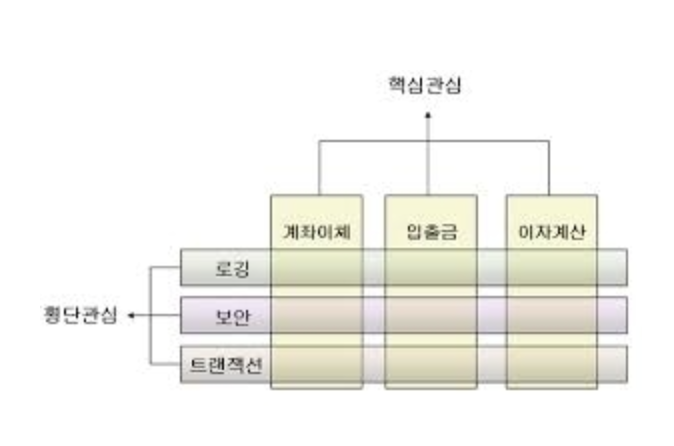
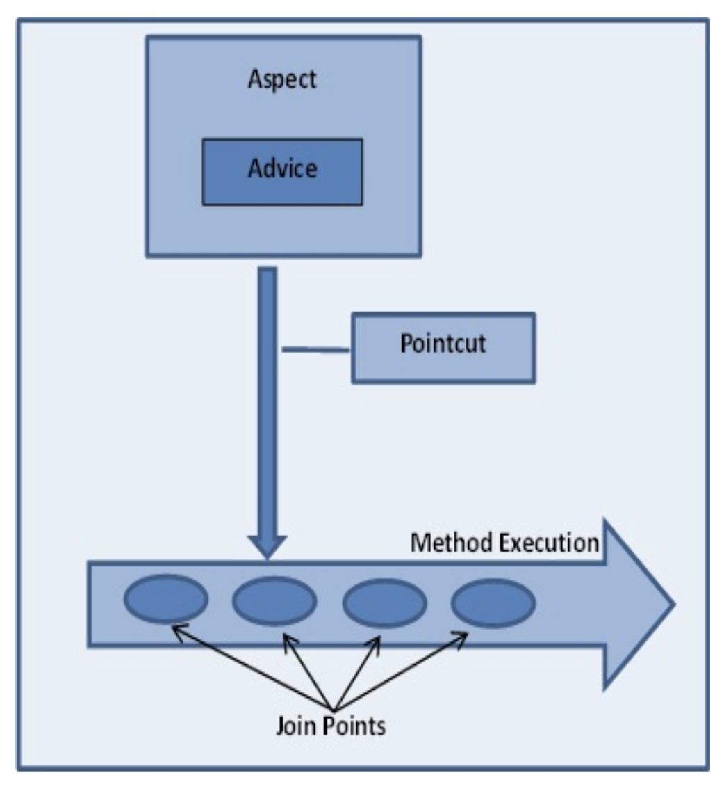
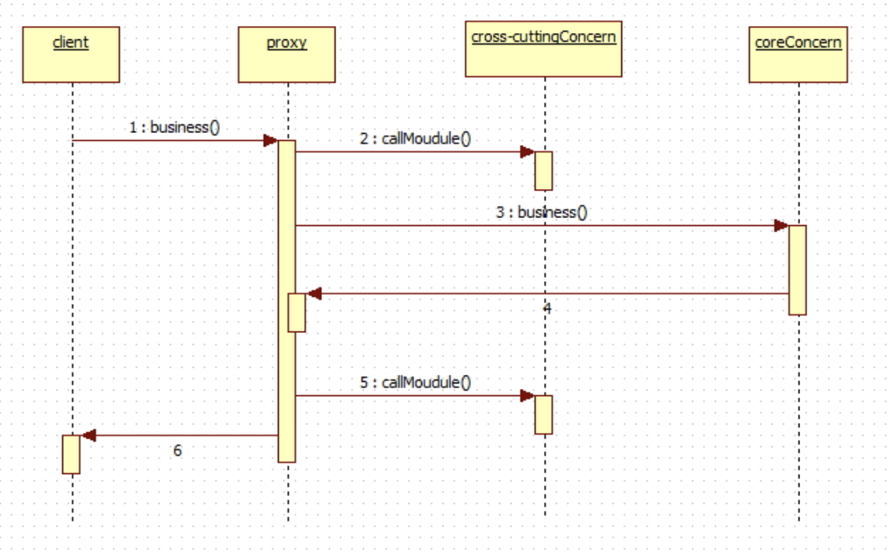

# SpringBoot

AOP Transaction 구현 Spring_bbs 프로젝트에서 작업


## AOP(Aspect Oriented Programming)의 구현 

- Spring_bbs 프로젝트에서 작업


### 1. 관점 지향 프로그래밍(AOP : Aspect-Oriented Programming)

- 트랜잭션이나 로깅, 보안과 같이 여러 모듈에서 공통적으로 사용하는 기능의 경우 해당 기능을 분리하여 관리할 수 있다.
- 공통모듈의 반복적인 코드를 줄이고, 핵심 비즈니스 로직에만 집중할 수 있는 방법을 제공한다.
- 핵심관심(core concern) : 핵심 비즈니스 기능
- 공통관심(cross-cutting concern) : 횡단관심이라고도 하며, 어플리케이션 전반에 걸쳐 적용되는 공통 기능 (부가기능)




- 은행 업무에서 계좌이체, 이자계산, 대출처리는 주된업무로 핵심관점이다.
- 이 업무를 처리할때 '로깅', '보안', '트랜잭션' 등의 처리는 어플리케이션 전반에 걸처 필요한 기능인 공통(횡단)관심(Cross-Cutting Concern)이다.
- AOP에서는 공통관심을 하나의 클래스 단위(aspect)분리하여 재사용성과 유지보수성을 높인다.
- AOP를 적용할 경우 핵심로직을 구현한 클래스는 더 이상 여러 공통모듈을 의존하지 않는다.
- 핵심로직 구현클래스에서 공통모듈을 사용하는 코드를 포함하지 않는다.


### 2. AOP 주요 용어




#### (1) 조인포인트(Joinpoint)
- 조인포인트는 클라이언트가 호출하는 모든 비즈니스 메소드로서, BbsService, MemberService 클래스의 모든 메소드를 말한다.
- 포인트컷 대상, 포인트컷 후보라고 하며, 조인포인트 중에서 포인트컷이 선택된다.


#### (2) 포인트컷(Pointcut)

- 클라이언트가 호출하는 모든 비즈니스 메소드가 조인포인트라면, 포인트컷은 필터링된 조인포인트를 의미한다.

- 트랜잭션처리 하는 공통기능을 만들었을때, 횡단관심은 등록, 수정, 삭제 기능의 비즈니스 메소드에 대해서는 동작을 하고 검색 기능의 메소드에서는 트랜잭션과 무관하여 동작할 필요가 없다.

- 수많은 비즈니스 메소드 중에서 우리가 원하는 특정 메소드에서만 횡단관심에 해당하는 공통기능을 수행시키기 위해서 포인트컷이 필요하다.

- 포인트컷을 이용하면 메소드가 포함된 클래스의 패키지, 메소드 시그니처까지 정확하게 지정할 수 있다.

- expression 값을 설정하는 방법에 따라 필터링되는 메소드가 달라진다. 

   `execution(* spring.model.bbs.*Service.*(..)) `

| *        | spring.model.bbs. | Service  | *(..)                |
| -------- | ----------------- | -------- | -------------------- |
| 리턴타입 | 패키지 경로       | 클래스명 | 메소드명 및 매개변수 |


#### (3) 어드바이스(Advice)

- 어드바이스는 횡단관심에 해당하는 공통 기능의 코드를 의미한다. 독립된 클래스의 메소드로 작성된다. 
- 어드바이스의 메소드가 언제 동작할지는 스프링 설정파일을 통해서 지정한다.


#### (4) 위빙(Weaving)
- 포인트컷으로 지정한 핵심관심 메소드가 호출될때, 어드바이스에 해당하는 횡단관심 메소드가 삽입되는 과정을 의미한다.
- 이 위빙을 통해서 비즈니스 메소드를 수정하지 않고도 횡단관심에 해당하는 기능을 추가하거나 변경할 수 있다.
- 위빙을 처리하는 방식는 컴파일타임(Compiletime)위빙, 로딩 타임(Loadingtime) 위빙, 런타임(Runtime) 위빙이 있지만 스프링에서는 런타임 위빙 방식을 지원한다.


#### (5) 애스팩트(Aspect) 또는 어드바이저(Advisor)

- AOP의 핵심은 애스팩트이다. 애스팩트는 포인트컷과 어드바이스의 결합이다.
- 어떤 포인트컷 메소드에 대해서 어떤 어드바이스 메소드를 실행할지 결정한다.
- 이 애스팩트 설정에 따라 AOP의 동작방식이 결정된다.
      

#### (6) Proxy 

- 위빙될때 생성되는 객체이다.
- Spring AOP의 동작을 전반적으로 제어 하는 객체이다.  




### 3. Spring의  AOP 

- Spring에서  AOP는 **런타임시에  AOP를 적용**하므로 소스코드나 클래스 정보를 변경 하지 않는다.

- Spring에서  AOP는 **프록시를 이용하여  AOP를 적용**한다. 

- 프록시 기반  AOP는 핵심로직을 구현한  객체에 직접 접근하는 것이 아니라  중간에 프록시를 생성하여 프록시를 통해서 핵심로직을 구현한 객체에 접근한다. 

  (프록시 호출 그림 참조 )

- 프록시 기반에서는 **메서드 호출때에만 Advice를 적용**할 수 있다. 필드값 변경과 같은 Joinpoint에 대해서는 적용할 수 없다.


### 4. AOP Transaction 구현

- 댓글이 있는 게시판 글을 삭제하면 부모를 참조하는 자식레코드가 있어서 삭제가 안된다.

- 자식레코드 삭제 후 부모레코드를 삭제한다.

- 두 개의 작업을 Transaction을 이용해서 작성한다.

- 일반 작업프로세스 :  controller -> dao -> mybatis -> oralce

- 트랜잭션을 적용한 작업프로세스 :

  controller -> service -> dao -> mybatis ->oracle 

  (트랜잭션 자체는 비즈니스 로직이라 반드시 Service가 있어야 함)

- Service 패턴을 적용해서 트랜잭션을 위한 BbsService.java 생성한다.


#### (1) Service 패턴을 적용한 비즈니스 클래스 선언

> BbsService.java

```java
package com.study.model;

public interface BbsService {
	void delete(int bbsno) throws Exception;
}
```


> BbsServiceImpl.java

```java
package com.study.model;

import org.springframework.beans.factory.annotation.Autowired;
import org.springframework.stereotype.Service;

import com.study.model.BbsMapper;
import com.study.model.ReplyMapper;

@Service("com.study.service.BbsServiceImpl")
public class BbsServiceImpl implements BbsService {
	@Autowired
	private BbsMapper mapper;

	@Autowired
	private ReplyMapper rmapper;

	public void delete(int bbsno) throws Exception {

		rmapper.bdelete(bbsno); // 댓글 삭제.
		mapper.delete(bbsno); // 부모글 삭제.
	}
}
```


> BbsMapper.java

```java
int delete(int bbsno);
```


> ReplyMapper.java

```java
int bdelete(int bbsno);
```


- Service단에서 Transaction을 적용하기위해 bbs.xml의 delete에서 오류 발생시킨다


> bbs.xml

```
<delete id="delete" parameterType="int">
		DELETE FROM bbs
		WHERE bbsno1 = #{bbsno}
</delete>
```

❗️-> 일부러 에러를 만들어서 Transaction이 잘 적용되는 지 확인하기

​    -> 다 하고 난 후 다시 원래대로 `WHERE bbsno = #{bbsno}`로 돌려놓음.


> reply.xml

```
<delete id="bdelete" parameterType="int">
    DELETE FROM reply
    WHERE bbsno = #{bbsno}
</delete>
```


#### (2) Transaction 설정
- AOP 관련 library 추가
- Gradle -> Refresh Gradle Project

> build.gradle

```
// https://mvnrepository.com/artifact/org.aspectj/aspectjweaver
implementation group: 'org.aspectj', name: 'aspectjweaver', version: '1.9.6'
```


> TransactionAspect.java

```java
package com.study.bbs;

import java.util.Collections;
import java.util.List;
import org.springframework.aop.Advisor;
import org.springframework.aop.aspectj.AspectJExpressionPointcut;
import org.springframework.aop.support.DefaultPointcutAdvisor;
import org.springframework.beans.factory.annotation.Autowired;
import org.springframework.context.annotation.Bean;
import org.springframework.context.annotation.Configuration;
import org.springframework.transaction.PlatformTransactionManager;
import org.springframework.transaction.interceptor.MatchAlwaysTransactionAttributeSource;
import org.springframework.transaction.interceptor.RollbackRuleAttribute;
import org.springframework.transaction.interceptor.RuleBasedTransactionAttribute;
import org.springframework.transaction.interceptor.TransactionInterceptor;

@Configuration
public class TransactionAspect {
	@Autowired
	private PlatformTransactionManager transactionManager;
	// 포인트 컷 선언: 트랜잭션이 적용되는 시점
	// private static final String EXPRESSION = "execution(*
	// com.study..service.*Impl.*(..))";
	// om.study 패키지로 시작하며 Impl로 끝나는 class의 모든 메소드에 트랜잭션 적용
	private static final String EXPRESSION = "execution(* com.study..model.*Impl.*(..))";

	@Bean
	public TransactionInterceptor transactionAdvice() {
		List<RollbackRuleAttribute> rollbackRules = Collections
				.singletonList(new RollbackRuleAttribute(Exception.class));
		RuleBasedTransactionAttribute transactionAttribute = new RuleBasedTransactionAttribute();
		transactionAttribute.setRollbackRules(rollbackRules);
		transactionAttribute.setName("*");
		MatchAlwaysTransactionAttributeSource attributeSource = new MatchAlwaysTransactionAttributeSource();
		attributeSource.setTransactionAttribute(transactionAttribute);
		return new TransactionInterceptor(transactionManager, attributeSource);
	}

	@Bean
	public Advisor transactionAdvisor() {
		AspectJExpressionPointcut pointcut = new AspectJExpressionPointcut();
		pointcut.setExpression(EXPRESSION);
		return new DefaultPointcutAdvisor(pointcut, transactionAdvice());
	}
}
```

```
어드바이스
어드바이저(에스펙트)
(포이트컷 + 어드바이스)
포인트컷 : 핵심관심(기능들중에서 실제 실행하는 필요한 메소드)
어드바이스: 공통모듈(트랜잭션)
```


> BbsController.java

```java
@Autowired
@Qualifier("com.study.service.BbsServiceImpl")
private BbsService service; // 추가
```

```java
	@PostMapping("/bbs/delete")
	public String delete(int bbsno, String passwd, String oldfile, HttpServletRequest request) throws IOException {

		String upDir = new ClassPathResource("/static/storage").getFile().getAbsolutePath();
//		String upDir = request.getRealPath("/static/storage");

		Map map = new HashMap();
		map.put("bbsno", bbsno);
		map.put("passwd", passwd);
		int cnt = mapper.passCheck(map);

		String url = "/bbs/passwdError";

		if (cnt > 0) {

			try {
				service.delete(bbsno); //mapper.delete(bbsno);
				url = "redirect:/bbs/list";
				if (oldfile != null)
					Utility.deleteFile(upDir, oldfile);
			} catch (Exception e) {
				e.printStackTrace();
				url = "/bbs/error";
			}

		}

		return url;
	}
```


*Fin.🐧*

