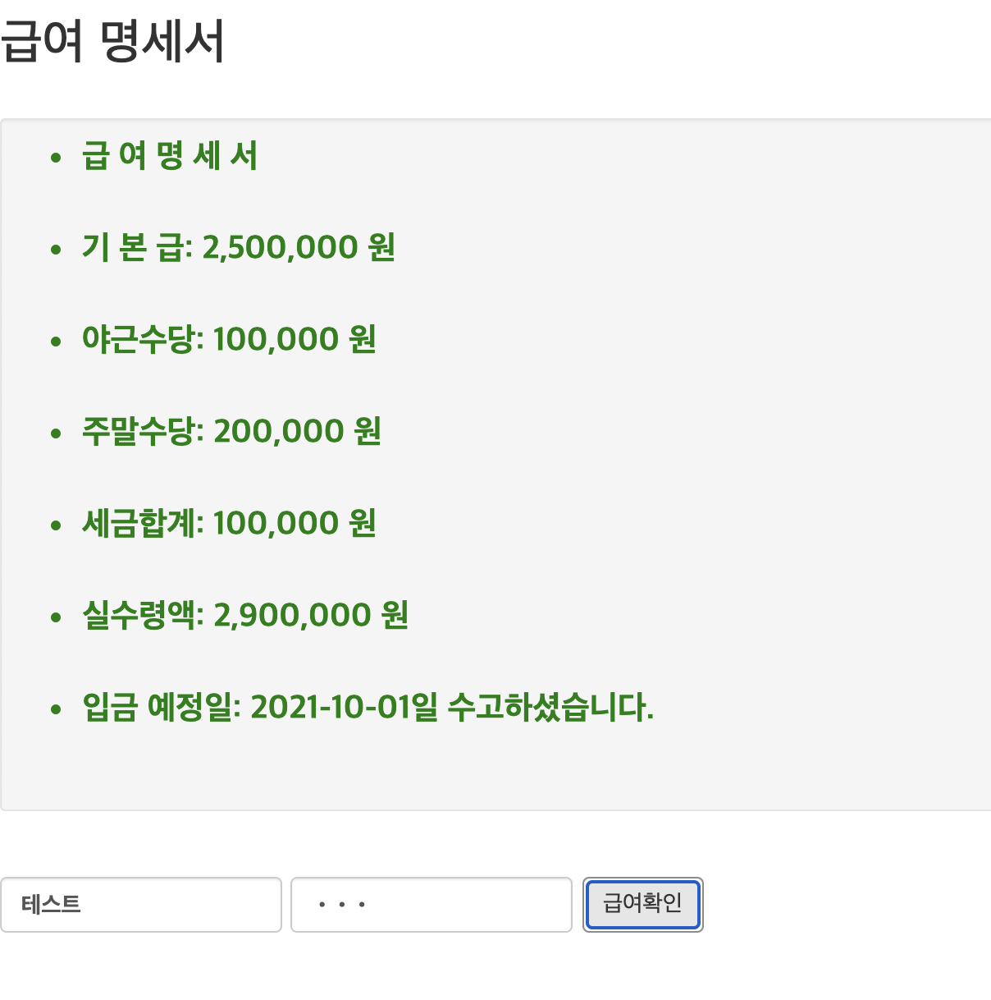

# Ajax와 Promise

## Ajax와 Promise사용 실습

- 서버의 급여 정보 비동기 통신으로 요청하여 출력하기


### 서버 응답 페이지

> json/pay.jsp
>
> 결과확인
>
> => `http://localhost:8000/pay.jsp?id=테스트&passwd=테스트`

```jsp
<%@ page contentType="text/html; charset=UTF-8" %> 
<%
String[] titles = {
"  급  여  명  세  서 ", 
"기 본 급: 2,500,000 원",
"야근수당:   100,000 원",
"주말수당:   200,000 원",
"세금합계:   100,000 원",
"실수령액: 2,900,000 원",
"입금 예정일: 2021-10-01일 수고하셨습니다.",
};
%> 
<!DOCTYPE html>
<html lang="en">
<head>
    <meta charset="UTF-8">
    <meta http-equiv="X-UA-Compatible" content="IE=edge">
    <meta name="viewport" content="width=device-width, initial-scale=1.0">
    <title>Document</title>
    <style type="text/css"> 
        *{ 
          font-family: gulim; 
          font-size: 20px; 
          color:green;
          font-weight: bold;
        } 
         
    </style>
</head>
<body>
    <ul>
<%
String id = request.getParameter("id");
String passwd = request.getParameter("passwd");
System.out.println(id);
if (id.equals("테스트") && passwd.equals("테스트")){
    for (int i = 0 ; i < titles.length ; i++) {
        out.println("<li>" + titles[i] + "<br/><br/>");
    }
}else{
    out.println("<li>인증 실패입니다.<br/><br/>");
    out.println("<li>다시 시도해 주세요.<br/><br/>");
}
%>    
</ul>
</body>
</html>
```


### Promise를 이용한 비동기 통신구현 js

>json/ajax.js

```js
class UserStorage {
    constructor() {
        if (window.XMLHttpRequest) {
            this.xhr = new XMLHttpRequest();
        } else {
            // code for IE6, IE5
            this.xhr = ActiveXObject("Microsoft.XMLHTTP");
        }
        console.log(this.xhr);
    }

    loginUser(id, passwd) {
        return new Promise((resolve, reject) => {

            this.xhr.onreadystatechange = () => {
                if (this.xhr.readyState == 4) {
                    if (this.xhr.status == 200) {
                        // alert(this.xhr.responseText);
                        resolve(this.xhr.responseText);
                    } else {
                        reject(new Error(this.xhr.status));
                    }
                }
            }
            //alert("pay.jsp?id="+id+"&passwd="+passwd);
            this.xhr.open("GET", "pay.jsp?id=" + id + "&passwd=" + passwd);
            this.xhr.send();

        });
    }
}
```


### id, passwd 입력후 비동기 통신 요청 페이지

> json/pay.html

```html
<!DOCTYPE html>
<html lang="en">
<head>
    <meta charset="UTF-8">
    <meta http-equiv="X-UA-Compatible" content="IE=edge">
    <meta name="viewport" content="width=device-width, initial-scale=1.0">
    <link rel="stylesheet" href="https://maxcdn.bootstrapcdn.com/bootstrap/3.4.0/css/bootstrap.min.css">
    <script src="https://ajax.googleapis.com/ajax/libs/jquery/3.3.1/jquery.min.js"></script>
    <script src="https://maxcdn.bootstrapcdn.com/bootstrap/3.4.0/js/bootstrap.min.js"></script>

    <title>Document</title>
    <script src="ajax.js" defer></script>
    <script>
        function send(id, passwd) {
            const userStorage = new UserStorage();
            //변경된곳
            userStorage
                .loginUser(id, passwd)
                .then(text => {
                    //alert(text);
                    let payList = document.getElementById("payList");
                    payList.innerHTML = text;
                })
                .catch(console.log)
        }
    </script>
</head>
<body>

    <h2>급여 명세서</h2>
    <br>
    <div class="well well-sm" id="payList"></div>
    <br>
    <form class="form-inline">
        <div class="form-group">
            <label class="sr-only" for="id">사원id:</label>
            <input type="email" class="form-control" id="id" value="테스트" name="id">
        </div>
        <div class="form-group">
            <label class="sr-only" for="pwd">비밀번호:</label>
            <input type="password" class="form-control" id="pwd" value="테스트" name="passwd">
        </div>
        <button type="button" class="btn btn-default"
            onclick="send(this.form.id.value, this.form.passwd.value)">급여확인</button>
    </form>
    </div>

</body>
</html>
```


### 실행

ajax.js + pay.html

\- TOMCAT SERVERS -> tomcat-9.0 -> Open in Browser 
\- id/passwd 입력후 급여확인 버튼클릭




*Fin.🐧*

