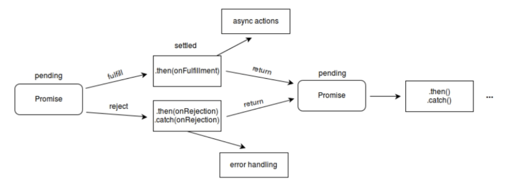
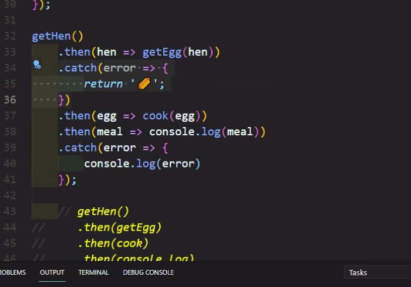

# callback 함수사용, callback 함수의 개선 Promise, asysnc, await


## 동기와 비동기에서 callback

### 동기와 비동기 처리

- 자바스크립트 : 동기 처리. 정해진 코드 순서로 처리
- hoisting 처리 -> var, function 선언 부분을 맨 앞으로 이동시킴
- Ajax에서는 비동기 처리, 비동기는 언제 코드가 실행될지 예측 불가.
- setTimeout() : 브라우저 API / callback 함수를 정의하여 얼마의 시간이 지난후에 콜백함수가 자동으로 호출된다.
- callback함수는 메소드의 매개변수로 전달되어 메소드 내부에서 이름없는 함수 또는 에로 함수('()=>{}')로 표현된다. 메소드 내부에서 기능 처리중에 호출된다. 

> index.html

```html
<!DOCTYPE html>
<html lang="en">
<head>
    <meta charset="UTF-8">
    <meta http-equiv="X-UA-Compatible" content="IE=edge">
    <meta name="viewport" content="width=device-width, initial-scale=1.0">
    <title>Document</title>
    <script src="async/callback.js" defer></script>
</head>
<body>
    
</body>
</html>
```

> (async/)callback.js

// asynchronous 비동기는 언제 코드가 실행될지 예측할 수 없다.

```js
'use strict';
//javascript is synchronous.:정해진 순서대로 코드가 실행
//Execute the code block by orger (in order) after hoisting
//hoisting : var, function declaration이 맨 위로 올라간다.
// console.log('1')
// console.log('2')
// console.log('3')

//asynchronous 비동기는 언제 코드가 실행될지 예측할 수 없다.
console.log('1');
setTimeout(() => { console.log('2'); }, 1000); //브라우저에서 제공하는 API
console.log('3');

//Synchronous callback-자동으로 호출되는 메서드
function printImmediaely(print) {
    print()
}
printImmediaely(() => console.log('hello'));

//Asynchronous callback
function printWithDelay(print, timeout) {
    setTimeout(print, timeout);
}
printWithDelay(() => console.log('async callback'), 2000);
```


### callback 함수 example

- UserStorage 클래스에서 로그인 처리 메서드와 로그인이 성공이면 역할을  얻어오는 메서드를 선언한다.
- 메소드 loginUser, getRoles는 콜백 함수를 정의하여 기능 처리를 한다.
- loginUser와 getRoles의 onSuccess, onError는 콜백 함수이다.
- 콜백 함수 안에서 또 다른 콜백 함수를 연속적으로 호출하게 되면 가독성이 떨어져서 유지 보수성과 확장성이 낮아진다.

> index.html

```html
<!DOCTYPE html>
<html lang="en">
<head>
    <meta charset="UTF-8">
    <meta http-equiv="X-UA-Compatible" content="IE=edge">
    <meta name="viewport" content="width=device-width, initial-scale=1.0">
    <title>Document</title>
    <script src="async/callback-hell.js" defer></script>
</head>
<body>
    
</body>
</html>
```

> callback-hell.js

//Callback Hell example;가독성이 떨어진다. 체인이길어지면 디버깅이 어렵다. callback-hell.js <- 복잡. 이것을 개선하는 방향 (promise 사용)

```js
//Callback Hell example;가독성이 떨어진다. 체인이길어지면 디버깅이 어렵다.
class UserStorage {
    loginUser(id, password, onSuccess, onError) {
        setTimeout(() => {
            if (
                (id === 'study' && password === 'aistudy') ||
                (id === 'coder' && password === 'academy')
            ) {
                onSuccess(id);
            } else {
                onError(new Error('not found'))
            }
        }, 2000)
    }
    getRoles(user, onSuccess, onError) {
        setTimeout(() => {
            if (user === 'study') {
                onSuccess({ name: 'study', role: 'admin' });
            } else {
                onError(new Error('no access'))
            }
        }, 1000)

    }
}

const userStorage = new UserStorage();
const id = prompt('enter your id');
const password = prompt('enter your password');
userStorage.loginUser(
    id,
    password,
    user => {
        userStorage.getRoles(
            user,
            userWithRole => {
                alert(`hello ${userWithRole.name}, you have a ${userWithRole.role} role`);
            },
            error => {
                console.log(error);
            }
        );
    },
    error => { console.log(error) }
);
```


## callback 함수의 개선

- Promise, async, await 사용으로 callback 문제점을 해결할 수 있다.

### Promise 사용

- 참조사이트 : [MDN Web Docs](https://developer.mozilla.org/ko/docs/Web/JavaScript/Reference/Global_Objects/Promise)

- Promise 객체는 자바스크립트에서 제공하며, 비동기를 간편하게 처리할 수 있도록 도와준다.

- 정해진 장시간의 기능 수행 후을 정상적인 수행 완료 또는 실패와 그 결과 값을 전달한다.

  

- 비동기 연산이 종료 후의 결과값이나 실패 이유를 처리하기 위한 처리기를 연결할 수 있다. 
-  프로미스를 사용하면 비동기 메서드에서 마치 동기 메서드처럼 값을 반환할 수 있다. 
- 최종 결과를 반환하지는 않고, 대신 promise를 반환해서 미래의 어떤 시점에 결과를 제공한다.

- Promise는 다음 중 하나의 상태를 가진다.

  대기(pending) : 이행하거나 거부되지 않은 초기 상태.

  이행(fulfilled) : 연산이 성공적으로 완료됨.

  거부(rejected) : 연산이 실패함.


- 대기 중인 promise는 값과 함께 이행할 수도, 어떤 이유(오류)로 인해 거부될 수 있다.
- 이행이나 거부될 때, 프로미스에 연결한 처리기는 그 프로미스의 then 메서드로 대기열에 오른다.




#### Promise 생성, 사용

- Promise 생성자의 excutor는 콜백함수로 resolve(정상수행 후 결과전달), reject(문제가 생기면 호출) 콜백함수를 받는다.
- Promise는 시간이 걸리는 비동기 처리를 구현할 수 있다.
- Promise를 생성하면 executor 콜백이 자동으로 실행된다.
- Promise는 생성하여 비동기 처리를 구현하면 그 객체를 사용하는 곳에서
   then, catch등을 통해서 비동기 처리에 따를 결과를 생성할 수 있다.

> index.html
>
> `<script src="async/promise.js" defer></script>`

> promise.js

```js
'use strict';
//Promise is a JavaScript object for asynchronous operation.
//State : pending -> fulfilled or rejected
//Producer vs Consumer

//1. Producer:제공자
// when new Promise is created, the executor runs automatically.

const promise = new Promise((resolve, reject) => {
    //doing some heavy work(network, read files)
    console.log('doing something...');
    setTimeout(() => {
        resolve('study');
        //reject(new Error('no network'));
    }, 2000)
});

//2. Consumers : 사용자 , then, catch, finally
promise //
    .then((value) => { // value는 promise가 잘 처리되어 resolve호출하고 거기에 전달된 'study' 를 받는다.
        console.log(value);
    })
    .catch(error => { //error는 promise가 처리되다 오류가 발생하여 전될되는 Error객체를 받는다. 
        console.log(error);
    })
    .finally(() => { //무조건 실행되는 곳
        console.log('finally')
    });
```


#### Promise chaning, error 처리
- Promise chaning, Promise error 예제 확인
- then은 값 또는 Promise 객체가 전달된다.

>  index.html
>
> `<script src="async/promise2.js" defer></script>`

> promise2.js

```js
//3. Promise chaining
const fetchNumber = new Promise((resolve, reject) => {
    setTimeout(() => resolve(1), 1000);
});
fetchNumber
    .then(num => num * 2)
    .then(num => num * 3)
    .then(num => {
        return new Promise((resolve, reject) => {
            setTimeout(() => resolve(num - 1), 1000);
        });
    })
    .then(num => console.log(num));


//4. Error Handling
const getHen = () =>
    new Promise((resolve, reject) => {
        setTimeout(() => resolve('🐓'), 1000);
    });

const getEgg = hen =>
    new Promise((resolve, reject) => {
        setTimeout(() => resolve(`${hen} => 🥚`), 1000);
        //setTimeout(() => reject(new Error(`error! ${hen} => ?`)),1000);
    });

const cook = egg =>
    new Promise((resolve, reject) => {
        setTimeout(() => resolve(`${egg} => 🍳`), 1000);
    });

getHen()
    .then(hen => getEgg(hen))
    .then(egg => cook(egg))
    .then(meal => console.log(meal));
// 받아온 값 하나를 => 다음 함수에 파라메터로 보낼때 간단히 표현방법.
// 32~35줄 간단히
// getHen() 
//     .then(getEgg)
//     .then(cook)
//     .then(console.log)  
//     .catch(console.log); 
//24라인 에러 처리, 오류난 부분에서 catch부분으로 건너띈다.

// 중간에 오류처리하는 방법, 계란을 받아오다가 오류가 나면 다른재료로 대체한다.
// getHen() 
//     .then(getEgg) 
//     .catch(error => {
//         return '?';
//     })
//     .then(cook) 
//     .then(console.log)
//     .catch(console.log);
```



```js
// 중간 오류 잡기
getHen()
    .then(hen => getEgg(hen))
    .catch(error => {
        return '🥖';
    })
    .then(egg => cook(egg))
    .then(meal => console.log(meal))
    .catch(error => { console.log(error) });
```


- callback-hell 예제를 Promise를 사용한 예제로 변경하여 개선할 수 있다.

>  index.html
>
> `<script src="async/promise2.js" defer></script>`

> topromise.js

```js
class UserStorage {
    loginUser(id, password) {
        return new Promise((resolve, reject) => {
            setTimeout(() => {
                if (
                    (id === 'study' && password === 'aistudy') ||
                    (id === 'coder' && password === 'academy')
                ) {
                    resolve(id);
                } else {
                    reject(new Error('not found'))
                }
            }, 2000);

        });
    }
    getRoles(user) {
        return new Promise((resolve, reject) => {
            setTimeout(() => {
                if (user === 'study') {
                    resolve({ name: 'study', role: 'admin' });
                } else {
                    reject(new Error('no access'))
                }
            }, 1000);
        });
    }
}

const userStorage = new UserStorage();
const id = prompt('enter your id');
const password = prompt('enter your password');
userStorage
    .loginUser(id, password) //로그인 성공하면 id 전달
    .then(user => userStorage.getRoles(user)) //id의 역할을 전달
    .then(user => alert(`Hello ${user.name}, you have a ${user.role} role`)) //역할 확인
    .catch(console.log); //문제발생시 오류출력
```


### async, await 사용

- `**async function**` 선언 : AsyncFunction 객체를 반환하는 하나의 비동기 함수 정의.
- 암시적으로 promise를 사용하여 결과를 반환.
- 비동기 함수를 사용하는 코드의 구문과 구조는, 동기 함수를 사용하는 것처럼 보임.
- async 함수에는 await식이 포함될 수 있다. 
- await은 async 함수의 실행을 일시 중지하고 전달 된 Promise의 해결을 기다린 다음 async 함수의 실행을 다시 시작하고 완료후 값을 반환한다.
- await 키워드는 async 함수에서만 유효하다
- 너무 많은 체인을 사용하면 callback함수를 겹겹히 사용하는 것처럼 가독성이 떨어지는데 async, await는 좀더 간결한 코드를 만들기 위해서 사용.

> index.html
>
>  `<script src="async/async.js" defer></script>`

> async/async.js

-- async : 코드블럭이 자동으로 promise로 변환

```js
//async & await
//clear style of using promise
//1. async : 코드블럭이 자동으로 promise로 변환
// function fetchUser(){
//     return new Promise((resolve, reject) => {
//         //do network request in 10 secs....
//         resolve('study');
//     });
// }
//위의 내용을 아래코드로 간단히 만든다.
async function fetchUser() {
    //do network request in 10 secs....
    return 'study';
}


const user = fetchUser();
user.then(console.log)
console.log(user);
```

-- await

async 함수 안에서 사용

delay함수호출이 끝날때까지 기다린다.

```js
//async 함수 안에서 사용
function delay(ms) {
    return new Promise(resolve => setTimeout(resolve, ms))
}

async function getApple() {
    await delay(2000); //delay함수호출이 끝날때까지 기다린다.
    //throw 'error'; //임의의 에러발생시킴
    return '🍎';
}

async function getBanana() {
    await delay(1000);
    return '🍌';
}
```

-- *Promise도 중첩적으로 체인잉을 하면 콜백지옥 같은 문제점 발생*

```js
//Promise도 중첩적으로 체인잉을 하면 콜백지옥 같은 문제점 발생
function pickFruits() {
    return getApple()
        .then(apple => {
            return getBanana().then(banana => `${apple} + ${banana}`);
        });
}
pickFruits().then(console.log);
```


-- await 적용

-- 좀 더 개선된 코드

```js
// 좀 더 개선된 코드
// 49 라인에서 1초, 50라인에서 1초 해서 총 2초가 소요
async function pickFruits(){
    try{
        const apple = await getApple();
        const banana = await getBanana();
        return `${apple} + ${banana}`;
    }catch{
        console.log(new Error('error'));//29라인 에러처리
    }
}
pickFruits().then(console.log);
```


--*독립적인 처리기능을 순차적으로 하는 대신 병렬처리로 하면 더 개선된 코드*

-- *병렬처리를 위해서 Promise를 사용한다. 동시수행으로 총 1초가 소요된다.*

```js
// 독립적인 처리기능을 순차적으로 하는 대신 병렬처리로 하면 좀 더 개선된 코드가 된다.
// 병렬처리를 위해서 Promise를 사용한다. 동시수행으로 총 1초가 소요된다.
async function pickFruits(){
    const applePromise = getApple(); //Promise 리턴, 바로 promise 실행
    const banaaPromise = getBanana(); //Promise 리턴, 바로 promise 실행
    const apple = await applePromise;
    const banana = await banaaPromise;
    return `${apple} + ${banana}`;
}

pickFruits().then(console.log);
```


-- useful Promise APIs - 위의 병렬처리 코드를 좀더 개선하는 방법

-- promise.all([]);배열형태로 함수를 전달하면 모든 함수가 병렬처리된다.

```js
//3. useful Promise APIs - 위의 병렬처리 코드를 좀더 개선하는 방법
//promise.all([]);배열형태로 함수를 전달하면 모든 함수가 병렬처리된다.
//then에 전달되는 결과 값도 배열형태이다.
function pickAllFruits() {
    return Promise.all([getApple(), getBanana()]) //배열로 병렬처리기능을 나열
    .then(fruits => fruits.join(' + '));
}
pickAllFruits().then(console.log);
```


-- 둘 중에 먼저 수행되는 것 하나만 처리결과를 가져온다. apple의 시간을 늘려서 확인

```js
// 둘 중에 먼저 수행되는 것 하나만 처리결과를 가져온다. apple의 시간을 늘려서 확인
function pickOnlyOne(){
    return Promise.race([getApple(), getBanana()]);
}

pickOnlyOne().then(console.log);
```


- async, await 추가해서 코드 개선

>  **topromise.js 에 async, await 추가해서 수정한 소스**
>
> ```js
> class UserStorage {
>     loginUser(id, password) {
>       return new Promise((resolve, reject) => {
>         setTimeout(() => {
>           if (
>             (id === 'study' && password === 'aistudy') ||
>             (id === 'coder' && password === 'academy')
>           ) {
>             resolve(id);
>           } else {
>             reject(new Error('not found'));
>           }
>         }, 2000);
>       });
>     }
>   
>     getRoles(user) {
>       return new Promise((resolve, reject) => {
>         setTimeout(() => {
>           if (user === 'study') {
>             resolve({ name: 'study', role: 'admin' });
>           } else {
>             reject(new Error('no access'));
>           }
>         }, 1000);
>       });
>     }
>   
>     // 추가된 곳 ?
>     async getUserWithRole(user, password) {
>       const id = await this.loginUser(user, password);
>       const role = await this.getRoles(id);
>       return role;
>     }
>   }
>   
>   const userStorage = new UserStorage();
>   const id = prompt('enter your id');
>   const password = prompt('enter your passrod');
> //변경된곳
>   userStorage
>   .getUserWithRole(id, password) //
>   .then(user => alert(`Hello ${user.name}, you have a ${user.role} role`))
>   .catch(console.log)
> ```
>
> 


*Fin.🐧*

