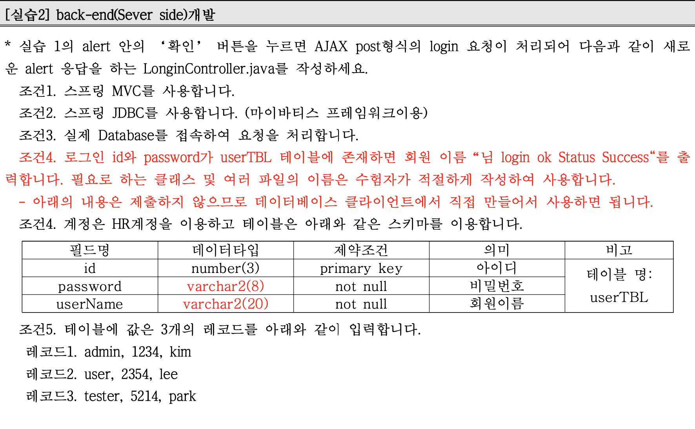
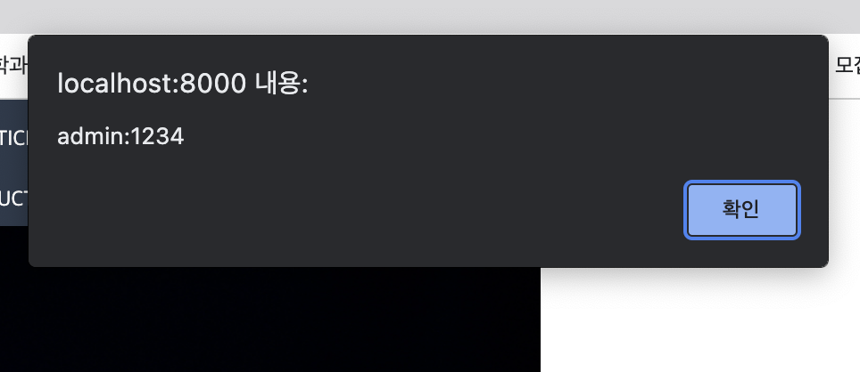
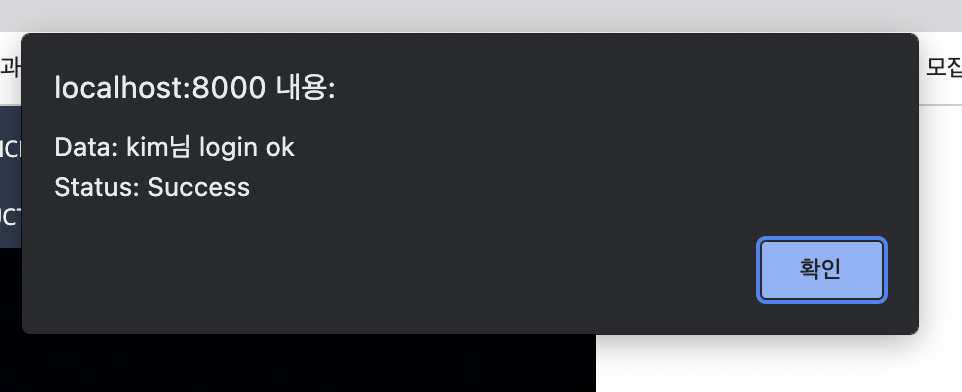
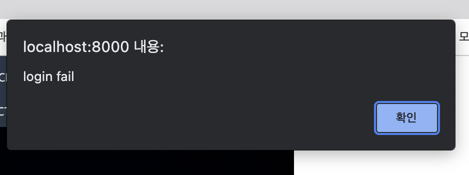

# 과제2 


## SpringBoot Web


1. id에 a를, pw에 b를 입력하여 로그인 버튼을 눌렀을 때 다음과 같은 alert이 뜨도록 test.js 작성 

test1.jsp

```jsp
<%@ page language="java" contentType="text/html; charset=UTF-8" pageEncoding="UTF-8"%>
<!DOCTYPE html>
<html>
<head>
<meta charset="UTF-8">
<title>Insert title here</title>
<meta charset="UTF-8">
<title>Company</title>

<!-- 반응형 웹 만들기 -->
<!-- 1. 모바일용 css -->
<link rel="stylesheet" href="/css/test1_2.css" media="(max-width:600px)">

<!-- 2. 데스크탑용 외부 스타일시트 적용 -->
<link rel="stylesheet" href="/css/test1_1.css" media="(min-width:600px)">

<script src="https://ajax.googleapis.com/ajax/libs/jquery/3.5.1/jquery.min.js"></script>
<script src="/js/test.js" type="text/javascript"></script>
<script type="text/javascript">

</script>

</head>
<body>

  <div id="page">

    <header>
      <div id="logo">
        
      </div>

      <div id="top_menu">
        <a href="#">HOME</a> | <a href="#">NOTICE</a> |
        <!--                 <a href="#">LOGIN</a> | -->
        <a href="#">JOIN</a> | ID <input class="login" id="id"> PW <input type="password" class="login" id="pw">
        <button id="login_btn" onclick="login()">LOGIN</button>
      </div>

      <nav>
        <ul>
          <li><a href="#">COMPANY</a></li>
          <li><a href="#">PRODUCT</a></li>
          <li><a href="#">CUSTOMER</a></li>
          <li><a href="#">SERVICE</a></li>
          <li><a href="#">RECRUIT</a></li>
        </ul>
      </nav>

    </header>

    <article id="content">
      <section id="main">
        
      </section>
      <section>
        <ul id="banner">
          <li><a href="#"></a></li>
          <li><a href="#"></a></li>
        </ul>

      </section>
      <section>
        <div>${message}</div>
      </section>

    </article>

    <footer>
      
    </footer>

  </div>
</body>
</html>
```


test.js

```js
function login() {
	var id = $('#id').val();
	var pw = $('#pw').val();
	alert(id + ":" + pw);
}
```


2. 


```
com.study.sample (package 이름 수정)

  -> LoginController.java
  -> DatabaseConfiguration.java
  -> TilesConfiguration.java
  -> AiWebTest2Application.java (수정)
  
com.study.model (추가)
  -> UserTBLDTO.java
  -> UserTBLMapper.java
  -> UserTBLService.java
  -> UserTBLServiceImpl.java 
  
src/main/resources
  -> mybatis
    -> userTBL.xml
  -> tiles
    -> tiles.xml
    
src/main/resources/static/js
  -> test.js (수정)

src/main/webapp/WEB-INF/
  -> lib / DB연동 위한 jar 파일 추가
  -> sql / DB 구축한 sql문 추가

src/main/webapp/WEB-INF/views
  -> test1.jsp (수정)
  
build.gradle에 필요한 Jsp 의존성 추가
application.properties 수정
```


### DB 구축 userTBL table 작성

> userTBL.sql

```sql
CREATE TABLE userTBL(
	id 			VARCHAR2(8) NOT NULL PRIMARY KEY,
	password 	VARCHAR2(8) NOT NULL,
	userName 	VARCHAR2(20) NOT NULL
);

INSERT INTO userTBL(id, password, userName) 
VALUES('admin', '1234', 'kim'); 
INSERT INTO userTBL(id, password, userName) 
VALUES('user', '2354', 'lee'); 
INSERT INTO userTBL(id, password, userName) 
VALUES('tester', '5214', 'park'); 

--로그인 관련 SQL 
SELECT COUNT(id) as cnt 
FROM userTBL 
WHERE id = 'user' AND password = '2354';  
```


### front_test1.jsp, test.js 수정

>  test1.jsp

```jsp
<%@ page language="java" contentType="text/html; charset=UTF-8" pageEncoding="UTF-8"%>
<%@ taglib prefix="c" uri="http://java.sun.com/jsp/jstl/core"%>
<!DOCTYPE html>
<html>
<head>
<meta charset="UTF-8">
<title>Insert title here</title>
<meta charset="UTF-8">
<title>Company</title>

<!-- 반응형 웹 만들기 -->
<!-- 1. 모바일용 css -->
<link rel="stylesheet" href="/css/test1_2.css" media="(max-width:600px)">

<!-- 2. 데스크탑용 외부 스타일시트 적용 -->
<link rel="stylesheet" href="/css/test1_1.css" media="(min-width:600px)">

<script src="https://ajax.googleapis.com/ajax/libs/jquery/3.5.1/jquery.min.js"></script>
<script src="/js/test.js" type="text/javascript"></script>
<script type="text/javascript">

</script>

</head>
<body>

  <div id="page">

    <header>
      <div id="logo">
        
      </div>

      <div id="top_menu">
        <a href="#">HOME</a> | <a href="#">NOTICE</a> |
        <!--                 <a href="#">LOGIN</a> | -->
        <a href="#">JOIN</a> | ID <input class="login" id="id"> PW <input type="password" class="login" id="pw">
        <button id="login_btn" type="button">LOGIN</button> <!--  onclick="login()" -->
      </div>

      <nav>
        <ul>
          <li><a href="#">COMPANY</a></li>
          <li><a href="#">PRODUCT</a></li>
          <li><a href="#">CUSTOMER</a></li>
          <li><a href="#">SERVICE</a></li>
          <li><a href="#">RECRUIT</a></li>
        </ul>
      </nav>

    </header>

    <article id="content">
      <section id="main">
        
      </section>
      <section>
        <ul id="banner">
          <li><a href="#"></a></li>
          <li><a href="#"></a></li>
        </ul>

      </section>
      <section>
        <div>${message}</div>
      </section>

    </article>

    <footer>
      
    </footer>

  </div>
</body>
</html>
```


> test.js

```js
$(function() {
	$('#login_btn').on('click', function() {
		let form = {
			id: $('#id').val(),
			password: $('#pw').val()
		}
		alert(form.id + ":" + form.password);

		$.ajax({
			url: "/",
			type: "POST",
			data: JSON.stringify(form),
			contentType: "application/json; charset=utf-8;",
			dataType: "json",
			success: function(data) {
				if(data.pflag){
					alert(`Data: ${data.userName}님 login ok \nStatus: Success`);
				}else{
					alert("login fail");
				}
				
			},
			error: function(request, status, error) {
				alert("code = " + request.status + " message = " + request.responseText + " error = " + error); // 실패 시 처리
				console.log("code = " + request.status + " message = " + request.responseText + " error = " + error); // 실패 시 처리
			}
		});// ajax end
	});
});

```


### src/main/resources

> mybatis/userTBL.xml

```xml
<?xml version="1.0" encoding="UTF-8" ?> 
 
<!DOCTYPE mapper
PUBLIC "-//mybatis.org//DTD Mapper 3.0//EN"
"http://mybatis.org/dtd/mybatis-3-mapper.dtd">

<mapper namespace="com.study.model.UserTBLMapper">
	<select id="passCheck" parameterType="Map" resultType="int">
		SELECT COUNT(id) as cnt
		FROM userTBL
		WHERE id=#{id} AND password=#{password}
	</select>
    <select id="readUser" parameterType="Map" resultType="com.study.model.UserTBLDTO">
      SELECT *
      FROM userTBL
      WHERE id=#{id} AND password=#{password}
    </select>
</mapper>
```


> tiles/tiles.xml

```xml
<?xml version="1.0" encoding="UTF-8"?>
<!DOCTYPE tiles-definitions PUBLIC
       "-//Apache Software Foundation//DTD Tiles Configuration 3.0//EN"
       "http://tiles.apache.org/dtds/tiles-config_3_0.dtd">
 
<tiles-definitions>
  <!-- main -->
  <definition name="/" extends="main">
    <put-attribute name="title" value="기본페이지"></put-attribute>
    <put-attribute name="body"
      value="/WEB-INF/views/test1.jsp" />
  </definition>
</tiles-definitions>
```


### UserTBL


> UserTBLDTO.java

```java
package com.study.model;

import lombok.Data;

@Data
public class UserTBLDTO {
	private String id;
	private String password;
	private String userName;
}
```


> UserTBLMapper.java

```java
package com.study.model;

import java.util.List;
import java.util.Map;

public interface UserTBLMapper {
	int passCheck(Map map);
	UserTBLDTO readUser(Map map);
}
```


> UserTBLService.java

```java
package com.study.model;

import java.util.List;
import java.util.Map;

public interface UserTBLService {
	int passCheck(Map map);
	UserTBLDTO readUser(Map map);
}
```


> UserTBLServiceImpl.java 

```java
package com.study.model;

import java.util.Map;

import org.springframework.beans.factory.annotation.Autowired;
import org.springframework.stereotype.Service;

@Service("com.study.model.UserTBLServiceImpl")
public class UserTBLServiceImpl implements UserTBLService {

	@Autowired
	private UserTBLMapper mapper;
	
	@Override
	public int passCheck(Map map) {
		// TODO Auto-generated method stub
		return mapper.passCheck(map);
	}

	@Override
	public UserTBLDTO readUser(Map map) {
		return mapper.readUser(map);
	}

}
```


### com.study.sample java

MyBatis 설정, Tiles설정 등

> DatabaseConfiguration.java

```java
package com.study.sample;
 
import javax.sql.DataSource;
 
import org.apache.ibatis.session.SqlSessionFactory;
import org.mybatis.spring.SqlSessionFactoryBean;
import org.mybatis.spring.SqlSessionTemplate;
import org.mybatis.spring.annotation.MapperScan;
import org.springframework.beans.factory.annotation.Autowired;
import org.springframework.boot.context.properties.ConfigurationProperties;
import org.springframework.context.ApplicationContext;
import org.springframework.context.annotation.Bean;
import org.springframework.context.annotation.Configuration;
import org.springframework.context.annotation.PropertySource;
 
import com.zaxxer.hikari.HikariConfig;
import com.zaxxer.hikari.HikariDataSource;
 
@Configuration
@PropertySource("classpath:/application.properties")  // 설정 파일 위치
@MapperScan(basePackages= {"com.study.*"})
public class DatabaseConfiguration {
  @Autowired
  private ApplicationContext applicationContext;
  
  @Bean
  @ConfigurationProperties(prefix="spring.datasource.hikari") // 설정 파일의 접두사 선언 
  public HikariConfig hikariConfig() {
      return new HikariConfig();
  }
  
  @Bean
  public DataSource dataSource() throws Exception{
      DataSource dataSource = new HikariDataSource(hikariConfig());
      System.out.println(dataSource.toString());  // 정상적으로 연결 되었는지 해시코드로 확인
      return dataSource;
  }
  
  @Bean
  public SqlSessionFactory sqlSessionFactory(DataSource dataSource) throws Exception{
      SqlSessionFactoryBean sqlSessionFactoryBean = new SqlSessionFactoryBean();
      sqlSessionFactoryBean.setDataSource(dataSource);
      sqlSessionFactoryBean.setMapperLocations(applicationContext.getResources("classpath:/mybatis/**/*.xml"));   
      return sqlSessionFactoryBean.getObject();
  }
  
  @Bean
  public SqlSessionTemplate sqlSessionTemplate(SqlSessionFactory sqlSessionFactory){
      return new SqlSessionTemplate(sqlSessionFactory);
  }
}
```


> TilesConfiguration.java

```java
package com.study.sample;
 
import org.springframework.context.annotation.Bean;
import org.springframework.context.annotation.Configuration;
import org.springframework.web.servlet.view.tiles3.TilesConfigurer;
import org.springframework.web.servlet.view.tiles3.TilesView;
import org.springframework.web.servlet.view.tiles3.TilesViewResolver;
 
@Configuration
public class TilesConfiguration {
  @Bean
  public TilesConfigurer tilesConfigurer() {
      final TilesConfigurer configurer = new TilesConfigurer();
      //해당 경로에 tiles.xml 파일을 넣음
      configurer.setDefinitions(new String[]{"classpath:/tiles/tiles.xml"});
      configurer.setCheckRefresh(true);
      return configurer;
  }
 
  @Bean
  public TilesViewResolver tilesViewResolver() {
      final TilesViewResolver tilesViewResolver = new TilesViewResolver();
      tilesViewResolver.setViewClass(TilesView.class);
      return tilesViewResolver;
  }
}
```

 

> AiWebTest2Application.java 

```java
package com.study.sample;

import org.springframework.boot.SpringApplication;
import org.springframework.boot.autoconfigure.SpringBootApplication;
import org.springframework.context.annotation.ComponentScan;

@SpringBootApplication
@ComponentScan(basePackages= {"com.study.*"})
public class AiWebTest2Application {

	public static void main(String[] args) {
		SpringApplication.run(AiWebTest2Application.class, args);
	}

}

```


### LoginController.java

```java
package com.study.sample;

import java.util.HashMap;
import java.util.Map;

import org.springframework.beans.factory.annotation.Autowired;
import org.springframework.beans.factory.annotation.Qualifier;
import org.springframework.stereotype.Controller;
import org.springframework.ui.Model;
import org.springframework.web.bind.annotation.GetMapping;
import org.springframework.web.bind.annotation.PostMapping;
import org.springframework.web.bind.annotation.RequestBody;
import org.springframework.web.bind.annotation.ResponseBody;

import com.study.model.UserTBLService;
import com.study.model.UserTBLDTO;

@Controller
public class LoginController {
	
	@Autowired
	@Qualifier("com.study.model.UserTBLServiceImpl")
	private UserTBLService service;
	
	@GetMapping("/")
	public String loginCheck() {
		
		return "test1";
	}
	
	@ResponseBody
	@PostMapping("/")
	public Map<String, Object> passCheck(@RequestBody UserTBLDTO dto,Model model) {
		System.out.println("PostMapping");
		
		Map map = new HashMap();
		map.put("id", dto.getId());
		map.put("password",dto.getPassword());
		boolean pflag = false;
		
		int cnt = service.passCheck(map);
		if (cnt > 0) {
			pflag = true;
			dto = service.readUser(map);
			map.put("userName",dto.getUserName());
			System.out.println(dto.toString());
		}
		
		if(pflag) {
			map.put("pflag", pflag);
			return map;
		}else {
			Map map2 = new HashMap();
			map2.put("pflag", pflag);
			return map2;
		}
	}
}
```


### 실행결과

- 성공 (DB에 id, pw 존재하는 경우)






- 실패 (DB에 id, pw 존재하지 않는 경우)




*Fin.🐧*

