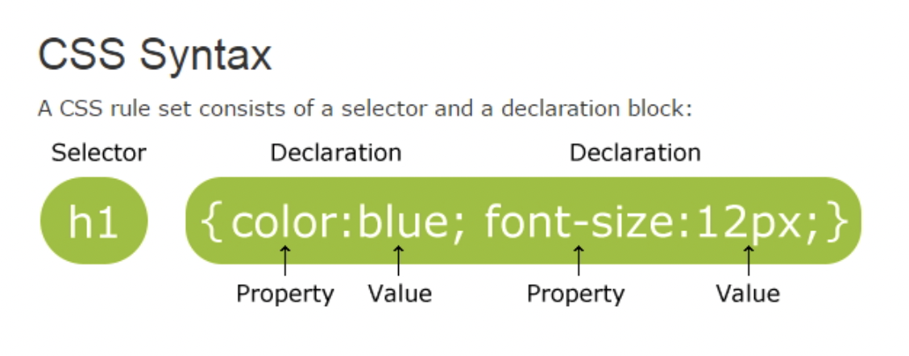

# CSS

## CSS Syntax, CSS Background


### CSS syntax




### CSS Example

```html
<!DOCTYPE html>
<html>
<head>
<style>
p {
    color: red;
    text-align: center;
} 
</style>
</head>
<body>
 
<p>Hello World!</p>
<p>This paragraph is styled with CSS.</p>
 
</body>
</html>
```


### CSS 주석

```html
<!DOCTYPE html>
<html>
<head>
<style>
p {
    color: red;
    /* This is a single-line comment */
    text-align: center;
} 
 
/* This is
a multi-line
comment */
</style>
</head>
<body>
 
<p>Hello World!</p>
<p>This paragraph is styled with CSS.</p>
<p>CSS comments are not shown in the output.</p>
 
</body>
</html>
```


### CSS Background

-- background-color.html

```html
<!--background-color.html-->
<!DOCTYPE html>
<html>
<head>
<style>
h1 {
    background-color: #6495ed;
}
 
p {
    background-color: #e0ffff;
}
 
div {
    background-color: #b0c4de;
}
</style>
</head>
<body>
 
<h1>CSS background-color example!</h1>
<div>
This is a text inside a div element.
<p>This paragraph has its own background color.</p>
We are still in the div element.
</div>
 
</body>
</html>
```

\- background-repeat  배경이미지의 반복을 지정 4가지 사용

\- repeat : 배경이미지가 반복적으로 적용, 기본값.

\- repeat-x : 배경이미지가 가로방향으로만 반복적으로 적용.

\- repeat-y : 배경이미지가 세로방향으로만 반복적으로 적용.

\- no-repeat : 배경이미지가 반복적으로 적용되지 않고 한번만 적용.


-- background-image.html

```html
<!-- background-image.html -->
<!DOCTYPE html>
<html>
<head>
<style>
body {
    background-image: url("tree.jpg");
    background-repeat: no-repeat;
}
</style>
</head>
<body>
 
<h1>Hello World!</h1>
<p>W3Schools background image example.</p>
<p>The background image is only showing once, but it is disturbing the reader!</p>
 
</body>
</html>
```


