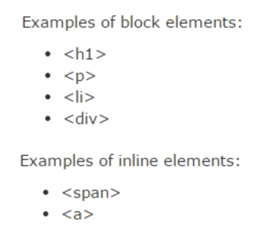

# CSS


## CSS Syntax, CSS Background


### CSS syntax


### CSS Example

```html
<!DOCTYPE html>
<html>
<head>
<style>
p {
    color: red;
    text-align: center;
} 
</style>
</head>
<body>
 
<p>Hello World!</p>
<p>This paragraph is styled with CSS.</p>
 
</body>
</html>
```


### CSS 주석

```html
<!DOCTYPE html>
<html>
<head>
<style>
p {
    color: red;
    /* This is a single-line comment */
    text-align: center;
} 
 
/* This is
a multi-line
comment */
</style>
</head>
<body>
 
<p>Hello World!</p>
<p>This paragraph is styled with CSS.</p>
<p>CSS comments are not shown in the output.</p>
 
</body>
</html>
```


### CSS Background

-- background-color.html

```html
<!--background-color.html-->
<!DOCTYPE html>
<html>
<head>
<style>
h1 {
    background-color: #6495ed;
}
 
p {
    background-color: #e0ffff;
}
 
div {
    background-color: #b0c4de;
}
</style>
</head>
<body>
 
<h1>CSS background-color example!</h1>
<div>
This is a text inside a div element.
<p>This paragraph has its own background color.</p>
We are still in the div element.
</div>
 
</body>
</html>
```

\- background-repeat  배경이미지의 반복을 지정 4가지 사용

\- repeat : 배경이미지가 반복적으로 적용, 기본값.

\- repeat-x : 배경이미지가 가로방향으로만 반복적으로 적용.

\- repeat-y : 배경이미지가 세로방향으로만 반복적으로 적용.

\- no-repeat : 배경이미지가 반복적으로 적용되지 않고 한번만 적용.


-- background-image.html

```html
<!-- background-image.html -->
<!DOCTYPE html>
<html>
<head>
<style>
body {
    background-image: url("tree.jpg");
    background-repeat: no-repeat;
}
</style>
</head>
<body>
 
<h1>Hello World!</h1>
<p>W3Schools background image example.</p>
<p>The background image is only showing once, but it is disturbing the reader!</p>
 
</body>
</html>
```

---

\- background-repeat: no-repeat 일때 이미지가 왼쪽 상단에 위치하는데 그 위치를 변경하는것 -> background-position


```html
<!DOCTYPE html>
<html>
<head>
<style>
body {
    background-image: url("tree.jpg");
    background-repeat: no-repeat;
    background-position: right top;
    margin-right: 200px;
}
</style>
</head>
<body>
 
<h1>Hello World!</h1>
<p>W3Schools background no-repeat, set position example.</p>
<p>Now the background image is only shown once, and positioned away from the text.</p>
<p>In this example we have also added a margin on the right side, so the background image will never disturb the text.</p>
 
</body>
</html>
```

---

\- [CSS](https://developer.mozilla.org/en-US/docs/Web/CSS) background-attachment 속성 : 배경 이미지를 [뷰포트](https://developer.mozilla.org/ko/docs/Glossary/Viewport) 내에서 고정할지, 아니면 자신의 컨테이닝 블록과 함께 스크롤할지 지정한다.

-- background-attachment.html

```html
<!DOCTYPE html>
<html>
<head>
<style> 
#myDIV {
    width: 300px;
    height: 300px;
    background: lightblue url('tree.jpg') no-repeat;
    color: white;
    overflow: auto;
}
</style>
</head>
<body>
 
<p>Click the radio buttons and scroll the DIV element to see the effect of the background-attachment property:</p>
 
<form name="myForm">
  <input type="radio" name="myAtt" value="scroll" onclick="myFunction()" checked>scroll
  <input type="radio" name="myAtt" value="local" onclick="myFunction()">local
</form>
 
<div id="myDIV">
  <h1>Hello</h1>
  <h1>Hello</h1>
  <h1>Hello</h1>
  <h1>Hello</h1>
  <h1>Hello</h1>
  <h1>Hello</h1>
  <h1>Hello</h1>
  <h1>Hello</h1>
  <h1>Hello</h1>
  <h1>Hello</h1>
  <h1>Hello</h1>
  <h1>Hello</h1>
  <h1>Hello</h1>
  <h1>Hello</h1>
  <h1>Hello</h1>
  <h1>Hello</h1>
  <h1>Hello</h1>
  <h1>Hello</h1>
  <h1>Hello</h1>
  <h1>Hello</h1>
</div>
 
<script>
function myFunction() {
    if (document.forms["myForm"]["myAtt"][0].checked) {
      document.getElementById("myDIV").style.backgroundAttachment = "scroll";
    } else {
      document.getElementById("myDIV").style.backgroundAttachment = "local";
    }
}
</script>
 
</body>
</html>
```


## CSS Margin, Padding, Border, Outline


```html
<!DOCTYPE html>
<html>
<head>
<style>
div {
    background-color: lightgrey;
    width: 300px;
    padding: 25px;
    border: 25px solid navy;
    margin: 25px;
}
</style>
</head>
<body>
 
<div>Lorem ipsum dolor sit amet, consectetur adipiscing elit, sed do eiusmod tempor incididunt ut labore et dolore magna aliqua. Ut enim ad minim veniam, quis nostrud exercitation ullamco laboris nisi ut aliquip ex ea commodo consequat. Duis aute irure dolor in reprehenderit in voluptate velit esse cillum dolore eu fugiat nulla pariatur. Excepteur sint occaecat cupidatat non proident, sunt in culpa qui officia deserunt mollit anim id est laborum.</div>
 
</body>
</html>
```

-- Output


### Margin Style

**`margin`** CSS 속성은 요소의 네 방향 [바깥 여백 영역](https://developer.mozilla.org/ko/docs/Web/CSS/CSS_Box_Model/Introduction_to_the_CSS_box_model)을 설정

```html
<!DOCTYPE html>
<html>
<head>
<style>
p {
    background-color: yellow;
}
 
p.ex {
    margin-top: 100px;
    margin-bottom: 100px;
    margin-right: 150px;
    margin-left: 50px;
}
</style>
</head>
<body>
 
<p>This is a paragraph with no specified margins.</p>
<p class="ex">This is a paragraph with specified margins.</p>
 
</body>
</html>
```

---


```html
<!DOCTYPE html>
<html>
<head>
<style>
h1 {
    background-color: lightblue;
    margin: 50px 25px;
}
</style>
</head>
<body>
 
<h1>This is a Heading</h1>
<p>This is a paragraph.</p>
 
</body>
</html>
```


### Padding Style


```html
<!DOCTYPE html>
<html>
<head>
<style>
p {
    background-color: yellow;
}
 
p.padding {
    padding-top: 25px;
    padding-right: 50px;
    padding-bottom: 25px;
    padding-left: 50px;
}
</style>
</head>
<body>
 
<p>This is a paragraph with no specified padding.</p>
<p class="padding">This is a paragraph with specified paddings.</p>
 
</body>
</html>
```


```html
<!DOCTYPE html>
<html>
<head>
<style>
p {
    background-color: lightblue;
    padding: 25px 50px;
}
</style>
</head>
<body>
 
<h1>This is a Heading</h1>
<p>This is a paragraph.</p>
 
</body>
</html>
```


### 3. Border Style


```html
<!DOCTYPE html>
<html>
<head>
<style>
p {
    border-top-style: dotted;
    border-right-style: solid;
    border-bottom-style: dotted;
    border-left-style: solid;
}
</style>
</head>
<body>
 
<p>2 different border styles.</p>
 
</body>
</html>
```


### 4. Outline Style


```html
<!DOCTYPE html>
<html>
<head>
<style>
p {
    border: 1px solid red;
    outline: green dotted thick;
}
</style>
</head>
<body>
 
<p><b>Note:</b> IE8 supports the outline properties only if a !DOCTYPE is 
specified.</p>
 
</body>
</html>
```


## CSS Hiding, Display, Position

### 1. Hiding an Element - display:none or visibility:hidden

```html
<!DOCTYPE html>
<html>
<head>
<style>
h1.hidden {
    visibility: hidden;
}
</style>
</head>
<body>
 
<h1>This is a visible heading</h1>
<h1 class="hidden">This is a hidden heading</h1>
<p>Notice that the hidden heading still takes up space.</p>
 
</body>
</html>
```

```html
<!DOCTYPE html>
<html>
<head>
<style>
h1.hidden {
    display: none;
}
</style>
</head>
<body>
 
<h1>This is a visible heading</h1>
<h1 class="hidden">This is a hidden heading</h1>
<p>Notice that the hidden heading does not take up space.</p>
 
</body>
</html>
```


### 2. CSS Display - Block and Inline Elements



```html
<!DOCTYPE html>
<html>
<head>
<style>
li {
    display: inline;
}
</style>
</head>
<body>
 
<p>Display a list of links as a horizontal menu:</p>
<ul>
<li><a href="/html/default.asp" target="_blank">HTML</a></li>
<li><a href="/css/default.asp" target="_blank">CSS</a></li>
<li><a href="/js/default.asp" target="_blank">JavaScript</a></li>
</ul>
 
</body>
</html>
```

-- Output


- strong : inline element

```html
<!DOCTYPE html>
<html>
<head>
<style>
strong {
    display:block;
}
</style>
</head>
<body>
 
<h1>This is a Heading</h1>
<p>This is a <strong>paragraph</strong>, with some words more <strong>important</strong> than others </p>
<p>This is another paragraph.</p>
 
</body>
</html>
```

-- Output


---

-- html

```html
<!DOCTYPE html>
<html>
<head>
  <meta charset="utf-8">
  <meta name="viewport" content="width=device-width">
  <title>JS Bin</title>
</head>
<body>
<!-- Block-level -->
  <div></div>
  <div></div>
  <div></div>
<!-- Inline-level -->
  <span>1</span>
  <span>3</span>
  <span>3</span>
  
</body>
</html>
```

-- css

```css
div, span {
  width:80px;
  height:80px;
  margin:20px
  
}
 
div {
  background:red;
}
 
span {
  background: blue;
}
```

-- Output


---


- display : inline ; //contents가 있어야 보여진다. 한줄에 여러개가 보여진다.
- display : block ; //한줄에 하나만 보여진다.
- display : inline-block ; //한줄에 여러개가 보여진다.

-- 위 코드 css 변경

```css
div, span {
  width:80px;
  height:80px;
  margin:20px
  
}
 
div {
  background:red;
  display : inline-block
}
 
span {
  background: blue;
  display:block;
}
```

-- Output


### 3. CSS Position

\- position : static (default) - html에 정의된 순서대로 브라우저에 보여줌 
\- position : relative - 나의 원래자리에서 상대적으로 이동
\- position : absolute - 내 아이템이 담겨있는 box에서 이동됨
\- position : fixed - 내 아이템이 담겨있는 box를 벗어나 page에서 이동된다
\- position : sticky - 원래자리에 고정되어, 스크롤바를 이동해도 그자리에 그대로 있다.


## CSS overflow

### CSS overflow property

 \- overflow, overflow-x, overflow-y

 \- contents가 Box 영역을 벗어났을때 처리되는 방법을 나타냄.


-- overflow1.html

```html
<!DOCTYPE html>
<html>
<head>
<style>
div.scroll {
    background-color: #00FFFF;
    width: 100px;
    height: 100px;
    overflow: scroll;
}
 
div.hidden {
    background-color: #00FF00;
    width: 100px;
    height: 100px;
    overflow: hidden;
}
</style>
</head>
<body>
 
<p>The overflow property specifies what to do if the content of an element exceeds the size of the element's box.</p>
 
<p>overflow:scroll</p>
<div class="scroll">You can use the overflow property when you want to have better control of the layout. The default value is visible.</div>
 
<p>overflow:hidden</p>
<div class="hidden">You can use the overflow property when you want to have better control of the layout. The default value is visible.</div>
 
</body>
</html>
```

-- Output


---


```html

<!DOCTYPE html>
<html>
<head>
<style>
div {
    color: red; 
}
 
h1  {
    color: initial; 
}
</style>
</head>
<body>
 
<div>
  <h1>Initial</h1>
  <p>The header and this text is inside a DIV element, which has the color property set to "red". The header element has its color property set to "initial", which in this case is "black".</p>
</div>
 
<p><b>Note:</b> The initial keyword is not supported as a property value in Internet Explorer, or in Opera before version 15.</p>
 
</body>
</html>
```

-- Output


---

```html
<!DOCTYPE html>
<html>
<head>
<style>
span {
    color: blue;
    border: 1px solid black;
}
.extra span {
    color: inherit;
}
</style>
</head>
<body>
 
<div>
Here is <span>a span element</span> which is blue, as span elements are set to be.
</div>
 
<div class="extra" style="color:green">
Here is <span>a span element</span> which is green, because it inherits from its parent.
</div>
 
<div style="color:red">
Here is <span>a span element</span> which is blue, as span elements are set to be.
</div>
 
</body>
</html>
```

-- Output


---


- white-space

| 속성     | 설명                                                         |
| -------- | ------------------------------------------------------------ |
| inherit  | 말 그대로 상속 받는 것                                       |
| normal   | 일반적인 것, default                                         |
| nowrap   | 줄바꿈을 하지 않는다.                                        |
| pre      | <pre> 태그와 같은 기능, 마크업에서 엔터로 줄바꿈 한 것만 적용되고 넘어가는 것에는 줄바꿈을 하지 않는다. |
| pre-line | 마크업에서 줄바꿈한 것이 적용되면서 width를 넘어가는 텍스트도 자동으로 줄바꿈된다. |
| pre-wrap | pre-line과 비슷                                              |

```html
<!DOCTYPE html>
<html>
<head>
<style> 
#myDIV {
    border: 1px solid black;
    background-color: lightblue;
    width: 200px;
    height: 210px;
    white-space: nowrap;
}
</style>
</head>
<body>
 
<p>Click the "Try it" button to change the overflow-x property of the DIV element:</p>
 
<button onclick="myFunction()">Try it</button>
 
<div id="myDIV">
Lorem ipsum dolor sit amet, consectetuer adipiscing elit,<br> sed diam nonummy nibh euismod tincidunt ut laoreet dolore magna aliquam erat volutpat.<br> Ut wisi enim ad minim veniam,<br> quis nostrud exerci tation ullamcorper suscipit lobortis nisl ut aliquip ex ea commodo consequat.
</div>
 
<script>
function myFunction() {
    document.getElementById("myDIV").style.overflowX = "scroll";
}
</script>
 
</body>
</html>
```

