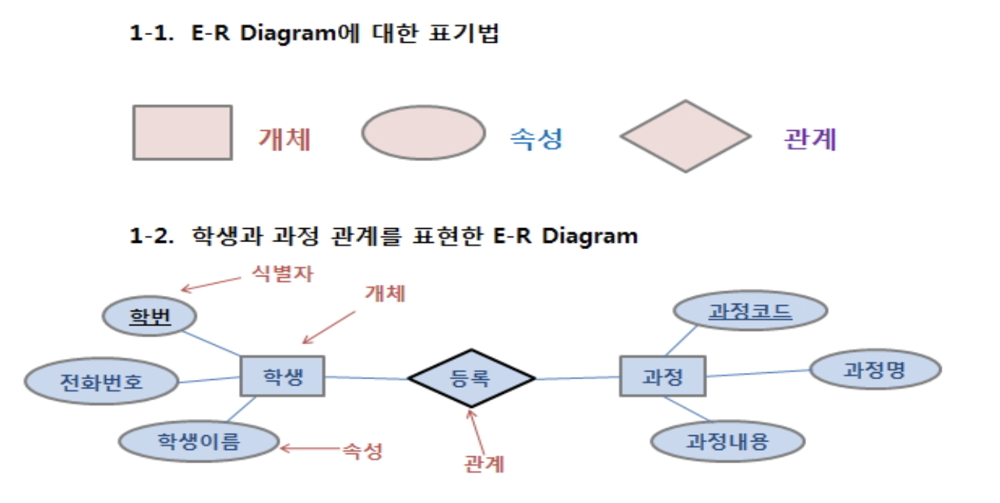

# DBModeling

## 개념적 데이터베이스 모델링

- 수집된 현실세계의 정보들을 사람들이 이해할 수 있는 명확한 형태로 표현하는 단계.
- 업무분석 단계에서 얻어진 내용을 토대로 우선 엔티티(Entity)를 추출하고 엔티티 내의 속성(Attribute)을 구성하며 엔티티간의 관계를 정의해서 ER-Diagram을 정의 하는 단계.
- 파워포인트를 이용한 실습

 

### 1. ER-Diagram의 표기법

- Tuple : Row
- E-R Model: 현실 세계에 존재하는 데이터와 그들 간의 관계를 사람이 이해할 수 있는 형태로 명확하게 표현하기 위해서 사용되고 있는 모델.
- Entity Type과 RelationShip Type을 기본 개념으로 현실세계를 개념적으로 표현하는 방법이다.
- 사각형-개체(테이블), 둥근원-속성(컬럼), 마름모-관계(키 제약조건)

### 2. 실체(Entity = 테이블)

- 실체 : 업무 수행을 위해 데이터로 관리되어져야 하는 사람, 사물, 장소, 사건 등. 
- 실체는 학생, 교수등 물리적으로 존재하는 유형이 될 수도 있고 과목, 학과 등과 같이 개념적으로 존재하는 대상이 될 수 있다.
- 파악된 업무를 바탕으로 문장으로 만들어 명사 위주의 단어를 추출하여 실체를 생성한다.
- 실제 업무에도 없는 실체를 상상력으로 결정하지 말고 실제 존재여부를 확인한 후 정확하게 정의 해야 한다.
- 물리적 데이터베이스에서 테이블을 말한다. 
- 각각의 실체는 인스턴스라 불리는 개별적인 객체들의 집합이다.
  

### 3. 속성(Attribute)

- 저장할 필요가 있는 실체(엔티티)에 관한 정보.
- 속성 : 실체의 성질, 분류, 수량, 상태, 특성, 특징 등을 나타내는 세부사항을 의미한다.
- 하나의 실체에 포함되는 속성의 숫자는 10개 내외가 적당합니다.
- 물리적 데이터베이스에서 컬럼을 말합니다.
- 속성의 유형
  - 기초속성 : 원래갖고 있는 속성으로 현업에서 기본적으로 사용되는 속성
  - 추출속성 : 기초속성을 가공처리(계산에 의해서) 얻어질 수 있는 속성
  - 설계속성 : 실제로 존재하지 않으나 시스템의 효율성을 도모하기 위해 설계자가 임의로 부여하는 속성

### 4. 속성 도메인(Domain)

- 컬럼에 들어갈 수 있는 값의 범위
- 속성에 대한 세부적인 업무 제약조건 및 특성을 전체적으로 정의해 주는 것
- 속성의 이름, 자료의 형태, 길이, Format 형식, 허용되는 값의 제약 조건, 유일성(Unique)여부, Null여부, 초기값, 유효값 등.

### 5. 식별자(Identifier)

- 레코드는 절대로 중복되면 안된다.

- Candidate Key(후보키)
  - Entity(테이블)에서 레코드를 유일(고유)하게 구분할 수 있는 속성(컬럼)들

- Primary Key(기본키)
  - Candidate Key중에서 활용도가 높고 길이가 짧은 키, Not Null, Unique, Clustered Index

- Alternate Key(대체키)
  - 후보키중에서 기본키로 선정되지 않은 키

- Composite Key(복합키)
  - 하나의 속성(컬럼)으로는 레코드가 고유하게 구분이 안되서 2개 이상의 컬럼으로 키를 구성하는 경우 쿼리문이 복잡해지는 문제점이 있음

- Surrogate Key(대리키)

  - 대리키는 복합키를 대신하여 사용할 수 있다.

  - 고유하게 구분되는 (속성)컬럼이 없고, 복합키의 구성이 난해한 경우 컬럼을 추가하여 키로 구성 

  - 이런 컬럼을 설계 속성 이라고 하며 그외의 일반 컬럼을 기초 속성이라고 한다.

### 6. 관계 (Relational)

- 두 Entity간에 업무적인 연관성을 관계라고 합니다.

- 관계차수란 두 Entity간에 Tuple(레코드)의 매핑 관계를 말한다.

- 선택성은 두 실체간에 관계가 설정되었을때, 항상 두 실체의 모든 인스턴스 간에 관계가 존재해야 하는지, 아니면 모든 인스턴스에 대해 존재할 필요는 없는지를 나타내는 부분이다.

- A실체와 B실체 사이에 AB라는 관계가 성립되었다고 했을때 A의 모든 인스턴스가 AB관계에 모두 참여한다면 Mandatory라고 하며 B의 인스턴스중 일부만 참여해도 된다면 이는 Optional이라고 한다.

- `Mandatory(|)` : 반드시 ~해야만 한다. 

  `Optional(O)` : ~일지도 모른다.

- ER-Diagram으로 관계를 설정하는 순서

1단계 - 관계가 있는 두 실체를 실선으로 연결하고 관계를 부여한다.

2단계 - 관계차수를 표현한다.

3단계 - 선택성을 표시한다.

- 관계 정의

ex ) 

회원과 회원상세정보 

: 회원은 회원상세정보를 포함한다.(능동형) / 회원상세정보는 회원에게 포함된다.(수동형)

사원과 부서 

: 부서는 사원을 소속한다.(능동형) / 사원은 부서에 소속된다.

- 차수성 정의 : 한 실체의 하나의 인스턴스가 다른 실체의 몇 개의 인스턴스와 관련될 수 있는 지 정의

일 대 일(1:1) / 일 대 다(1:N) / 다 대 다(N : M)

다대다(N:M)관계를 개선한 테이블 구조 ( => 1:N , N : 1로 구조를 변경한다.)

- 선택성 표기

### 7. 개념적 모델링 실습 

- 업무분석 내용을 보고 Entity 및 속성 추출
- ER-Diagram 그리기 

ex)

실체와 속성 추출(명사를 찾는다.)

Entity - 학생, 출결상태, 성적, 과목

=> 조건에 맞게 연결 표현

다 대 다 는 중간에 entity

실습문제)

교육센터에서는 여러과정을 가르치는데, 각 과정은 코드, 이름 및 수강료를 갖고 있다, 과정들은 1개월, 3개월, 6개월 기간은 다양한다. 왕눈이, 아로미는 우리의 훌륭한 강사들이다. 우리는 각강사의 이름과 , 전화번호를 필요로 한다. 학생들은 시간에 따라 여러개의 과정을 이수할 수 있는데 많은 학생들은 이렇게 하고 있다. 우리는 각 학생들의 이름과 전화번호를 알고 싶다  

## 논리적 DB 모델링

논리적 데이터베이스 모델링

- 개념적 단계에서 만들어진 개념적 구조로 부터 특정 DBMS가 처리할 수  있는 관계 스키마를 생성하는 단계.
- 개념적 단계에서 만들어진 ER-Digram이 논리적 단계에서 어떤 구조로 바뀌는지 확인.
- 관계형 모델의 개념 학습.     
- Mapping Rule을 이용한 관계 데이터 모델로의 변환 단계와 정규화 단계를 거친다.

### 1. 관계형 모델의 개념

- 부모테이블과 자식테이블 

  - 관계의 주체가 부모테이블이 된다.

  - 고객이 상품을 주문하다(능동형-주체)
  - 상품은 고객에게 주문되어진다(수동형)

- 주체관계로 구분이 모호한 경우 어느테이블에  데이타가 먼저 정의되어야 하는가 로 부모와 자식테이블을  구분할 수 있다.

- 기본키(Primary key)와 포린키(Foreign key)
  - 관계를 형성하고 있는 두테이블 중 부모테이블의 기본키는 자식 테이블의 포린키로 복사(전이)되어집니다.

- 식별관계와 비식별 관계

  - 식별관계 :부모 테이블의 기본키가 자식 테이블의  기본키 혹은 기본키 그룹 (Composite Primary key)구성원 으로 복사(전이)되는 것 입니다.

  - 비식별관계 :부모 테이블의 기본키가 자식 테이블의 일반컬럼으로 전이되는 것.

### 2. Mapping Rule

- 메핑 룰(Mapping Rule)이란 개념적 데이터베이스 모델링에서 도출된 개체 타입과 관계 타입의 테이블 정의를 의미하며 이름 관계 스키마라 정의한다.
- Entity    --> Table
- Attribute   --> Column
- Identifier  --> Primary Key
- Relationship --> Foreign Key

[ER-Win Tool을 이용한 모델링 실습] - 강사님 결과물

