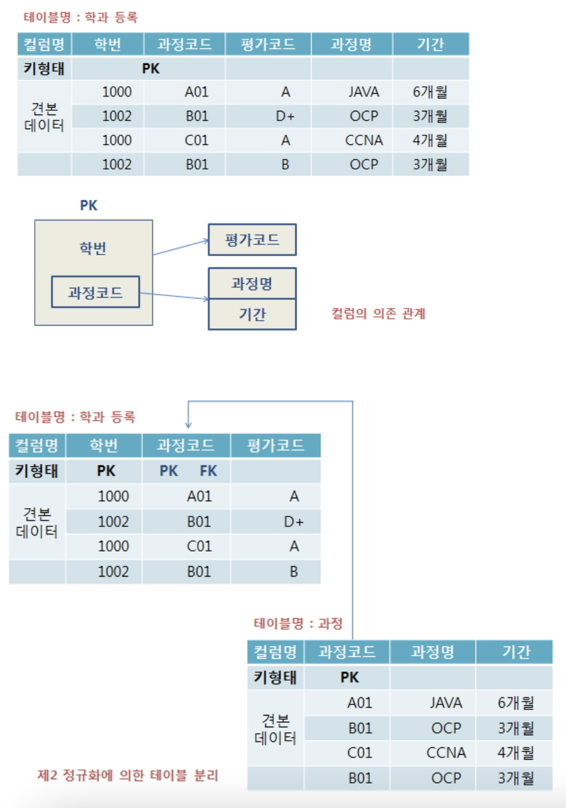

# DBModeling


## 논리적 단계의 정규화

정규화 (테이블 분리)

- 테이블에 중복된 데이터가 발생하는 것을 줄일 수 있다.(1정규화)
- 테이블에 null 컬럼이 발생하는 것을 줄일 수 있다.(1정규화)
- 특정 테이블에 컬럼이 집중되는 것을 효과적으로 분리 할 수 있다.(3정규화)
- 하나의 테이블에 두부류의 데이터 형질을 나타내는 목적을 가지고 있는 컬럼들은 두개의 테이블로 분리한다.
- (2정규화)
- 정규화를 많이하면 테이블이 너무 작게 쪼개져 과다한 JOIN으로 인한 과부하가 발생하게 된다. (역정규화)
- 처리 속도 향상을 위해 역정규화를 실시한다. (테이블 결합)


### 1. 제 1 정규화

- 반복되는 레코드들이 있는 테이블을 두개의 테이블로 나눈 후  P.K를 적용시켜 중복되는 레코드가 발생되지 않도록 하는 것이 목적, 1:N의 관계 생성한다.

#### 1. 모든 테이블은 PK(Primary Key)속성이 있어야 한다.

- 설계속성을 가지고 Primary Key를 적용한 경우, PK컬럼을 위해 sequence(일련번
     호) 컬럼을 추가한다.

#### 2. 중복된 레코드가 들어가 있는 [사원테이블]

- 1 정규화가 이루어진 1 : N 관계의 2개의 테이블로 변경

[사원테이블] / [자격증 테이블] 로 분리시킨다.

다른 예시) 과정테이블(과정코드, 과졍명, 교육내용, 교육기간, 강의 시간, 수강료, 교재1, 교재2, 교재3, 교재4, 교재5) --> 과정테이블과 교재테이블로 분리

과정 테이블(부모) - 교재 테이블(자식) 으로 나누어줌.

```
과정 테이블 (부모)
 PK 
과정코드   과정명    교육내용    교육기간    강의시간   수강료 

교재 테이블 (자식)
PK      FK
교재번호  과정코드     교재명
```


#### 2. 제 2 정규화

- 복합키로 구성되어 있는 테이블의 모든 컬럼들은 복합키 전체에 의존해야 하며, 그렇지 않을 경우 제 2 정규화의 대상이 된다.
- 복합키의 일부분에 의해 종속되는 것을 부분적 함수 종속관계라고 하며 이를 제거한다.

  ※ 키의 의존적이란 말 : 사원테이블의 예 -> 사원번호라는 키만 알면 그 사원의 이름, 주소,성별, 입사일을 알 수 있음을 의미한다.

[학과 등록 테이블]의 예




#### 3. 제3정규화

- 기본키에 의존하지 않는 일반 컬럼이 있는 경우 테이블을 분리한다.
- 테이블의 기본키가 아닌 모든 컬럼들은 기본키에 의존해야 하는데 다른 일반 컬럼에 의존적인 컬럼이 있다. 이를 이전적 함수 종속 관계라 하며 이를 해결해야 한다.


