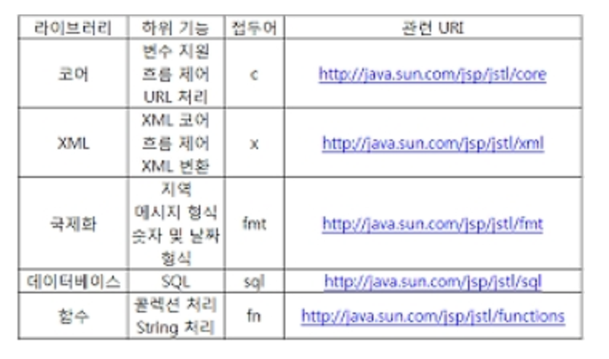

# SpringBoot

## EL(표현 언어, Expression Language)

- EL은 JSP 객체의 출력을 단순화하는 용도로 사용한다. 
- JSP 2.0은 JSTL 1.1버전에 포한된 EL의 기능을 제공한다
- 값이 없는 경우 "null"값을 출력하지 않는다. 
- 표현 방법 ${expr} 

### 1. JSP 내부 객체에 대한 EL 객체

### 2. EL 객체의 사용예

### 3. EL 객체 사용 연습

## 객체의 접근

### 1. 클래스 생성

### 2. 객체 request영역에 저장 및 el로 사용

### 3. ${} 기호는 기본적으로 request 영역에 접근

### 4. 표현언어로 클래스 메소드 사용 

## JSTL(JSP Standard TAG Library)의 사용 

- 많이 사용되는 사용자 정의 태그를 모아서 JSTL 규약 생성
- 스크립틀릿, 표현식을 보다 훨씬 간결한 문법 구조 지원
- JSTL은 5가지의 태그를 지원 
- jstl API (http://java.sun.com/products/jsp/jstl/1.1/docs/tlddocs/index.html) 

### 1. Spring 컨테이너는 관련 모듈을 제공한다.

## JSTL(JSP Standard TAG Library)의 사용2

### 1. EL & JSTL의 사용 - Core Tag

### 2. EL & JSTL의 사용 - Core Tag _ 기타 태그들

### 3. 국제화 태그 - 숫자 및 날짜 포맷팅

