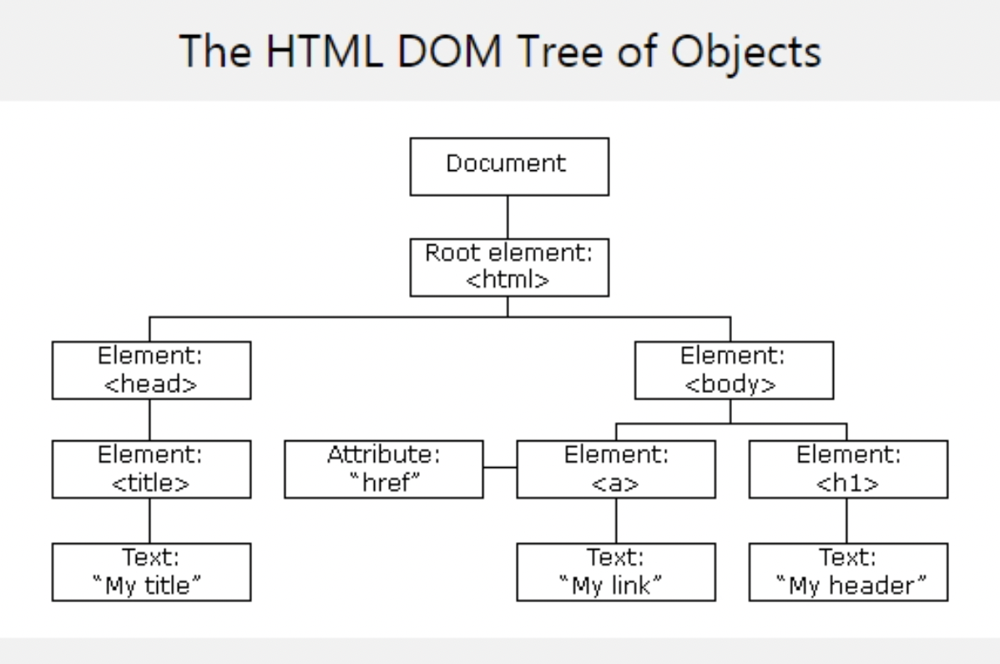
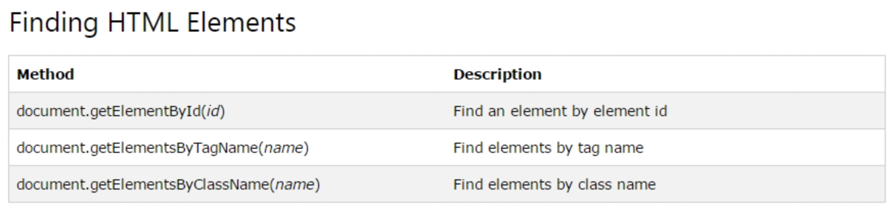

# Ajax

## HTML DOM(Document Object Model)

### DOM(Document Object Model)

\- W3C에서 표준을 제작하고 있다.

\- DOM은 구조화된 nodes와 property 와 method 를 갖고 있는 objects로 문서를 표현. 
\- 웹 페이지를 스크립트 또는 프로그래밍 언어들에서 사용될 수 있게 연결시켜주는 역할 담당.
\- DOM 은 동일한 문서를 표현하고, 저장하고, 조작하는 방법을 제공한다. 
\- DOM 은 웹 페이지의 객체 지향 표현이며, 자바스크립트와 같은 스크립팅 언어를 이용해 DOM 을 수정할 수 있다.
\- 웹 페이지는 일종의 문서(document)다. 이 문서는 웹 브라우저를 통해 그 내용이 해석되어
 웹 브라우저 화면에 나타나거나 HTML 소스 자체로 나타나기도 한다. 
\- Ajax를 사용하여 서버로부터의 응답 결과를 전송받아 브러우저의 HTML상에 출력할 때에
 DOM 모델을 이용한다.

\- DOM은 Object들을 Tree 처럼 생성합니다.
\- DOM은 동적으로 HTML 태그를 생성할때 필요하다.

참조사이트 : [MDN Web Docs](https://developer.mozilla.org/ko/docs/Web/API/Document_Object_Model/Introduction)

### 1. DOM은 내부적으로 HTML 태그를 Tree 형태로 표현.




### HTML DOM 활용



> 파일명 : dom.html

-- getElementById

```html
<!--idFind.html-->

<!DOCTYPE html>
<html>
<body>
 
<p id="intro">Hello World!</p>
 
<p>This example demonstrates the <b>getElementById</b> method!</p>
 
<p id="demo"></p>
 
<script>
var myElement = document.getElementById("intro");
document.getElementById("demo").innerHTML = 
"The text from the intro paragraph is " + myElement.innerHTML;
</script>
 
</body>
</html>
```

-- getElementsByTagName

```html
<!--tagnameFind.html-->


<!DOCTYPE html>
<html>
<body>
 
<p>Hello World!</p>
 
<p>The DOM is very useful.</p>
<p>This example demonstrates the <b>getElementsByTagName</b> method</p>
 
<p id="demo"></p>
 
<script>
var x = document.getElementsByTagName("p");
document.getElementById("demo").innerHTML = 
'The first paragraph (index 0) is: ' + x[0].innerHTML;
</script>
 
</body>
</html>

```

-- getElementsByTagName

```html
<!--idTagnameFind.html-->

<!DOCTYPE html>
<html>
<body>
 
<p>Hello World!</p>
 
<div id="main">
<p>The DOM is very useful.</p>
<p>This example demonstrates the <b>getElementsByTagName</b> method</p>
</div>
 
<p id="demo"></p>
 
<script>
var x = document.getElementById("main");
let y = x.getElementsByTagName("p");
document.getElementById("demo").innerHTML = 
'The first paragraph (index 0) inside "main" is: ' + y[0].innerHTML;
</script>
 
</body>
</html>
```

-- getElementByClassName

```html
<!DOCTYPE html>
<html lang="en">
<head>
    <meta charset="UTF-8">
    <meta http-equiv="X-UA-Compatible" content="IE=edge">
    <meta name="viewport" content="width=device-width, initial-scale=1.0">
    <title>Document</title>
</head>

<body>
    <p>Hello World!</p>

    <div id="main">
        <p>The DOM is very useful.</p>
        <p class='intro'>This example demonstrates the <b>getElementsByTagName</b> method</p>
        <p class='intro'>This example demonstrates the <b>getElementsByTagName</b> method</p>
    </div>

    <p id="demo"></p>

        var x = document.getElementByClassName("intro");
        document.getElementById('demo').innerHTML = 'The first paragraph (index 0) inside "main" is: ' + x[0].innerHTML;
    </script>
</body>
</html>
```

-- querySelectorAll

```html
<!DOCTYPE html>
<html lang="en">
<head>
    <meta charset="UTF-8">
    <meta http-equiv="X-UA-Compatible" content="IE=edge">
    <meta name="viewport" content="width=device-width, initial-scale=1.0">
    <title>Document</title>
</head>

<body>
    <p>Hello World!</p>

    <div id="main">
        <p class='intro'>The DOM is very useful.</p>
        <p class='intro'>This example demonstrates the <b>getElementsByTagName</b> method</p>
    </div>

    <p id="demo"></p>
    <script>
        var x = document.querySelectorAll("p.intro");
        document.getElementById('demo').innerHTML = 'The first paragraph (index 0) inside "main" is: ' + x[0].innerHTML;
    </script>
</body>
</html>
```

-- htmlobjectFind

```html
<!DOCTYPE html>
<html lang="en">
<head>
    <meta charset="UTF-8">
    <meta http-equiv="X-UA-Compatible" content="IE=edge">
    <meta name="viewport" content="width=device-width, initial-scale=1.0">
    <title>Document</title>
</head>

<body>
    <form id="frm1" action="form_action.asp">
        First name: <input type="text" name="fname" value="Donald"><br>
        Last name: <input type="text" name="lname" value="Duck"><br><br>
        <input type="submit" value="Submit">
    </form>
    <button onclick="myFunction()">Try it</button>
    <p id="demo"></p>

    <script>
        function myFunction() {
            let x = document.forms["frm1"];
            let text = "";
            let i;
            
            console.log(x.length);
            for (i = 0; i < x.length; i++) {
                text += x.elements[i].value + "<br>";
            }
            document.getElementById('demo').innerHTML = text;
        }
    </script>
</body>
</html>
```


- Changing HTML Elements

| Method                                   | Description                              |
| ---------------------------------------- | ---------------------------------------- |
| `element.innerHTML` = *new html content* | Change the inner HTML of an element      |
| `element.attribute` = *new value*        | Change the attribute value of an element |
| `element.setAttribute(attribute, value)` | Change the attribute value of an element |
| `element.style.property` = *new style*   |                                          |


