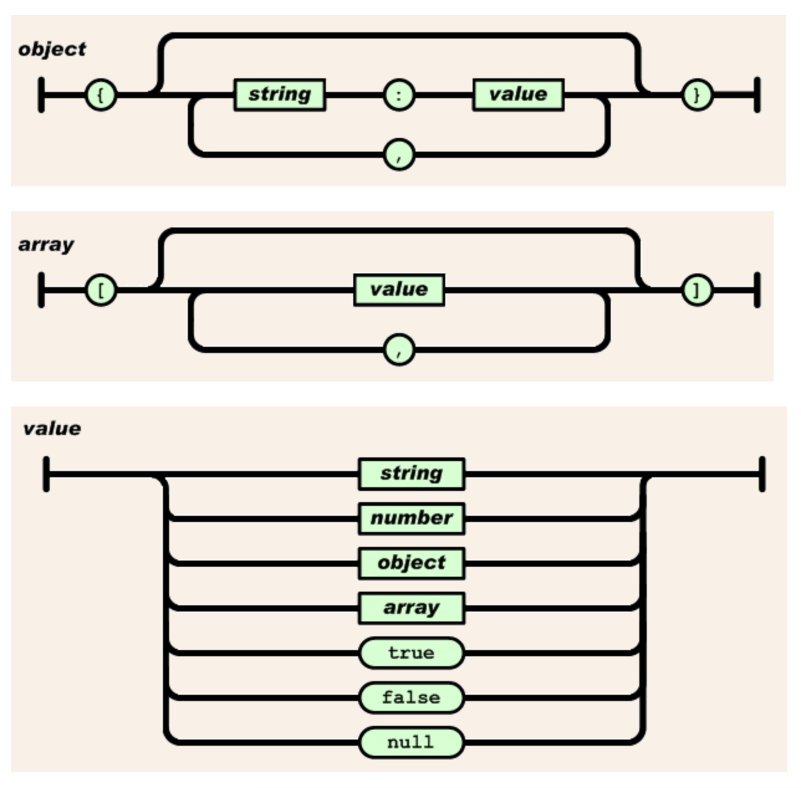
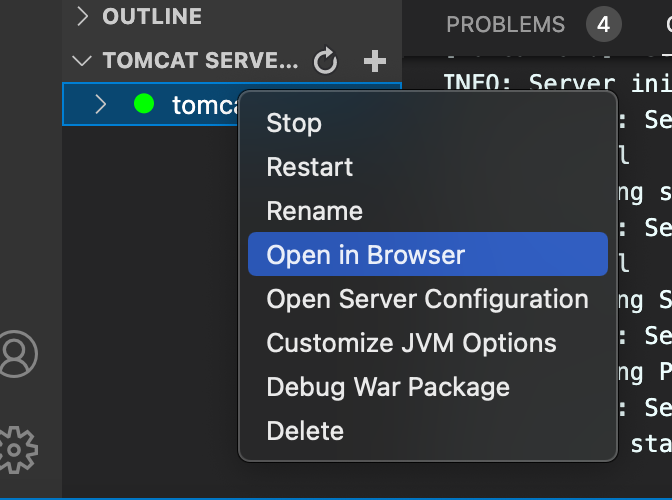
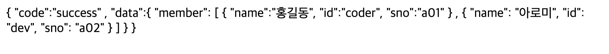
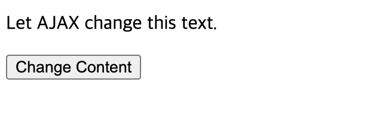
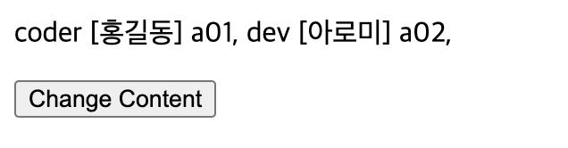

# JSON

## JSON(JavaScript Object Notation)

- 자바 스크립트 객체 표기법
- JSON은 데이터 저장과 교환에서 사용한다.
- XML에 비해서 매우 적은 네트워크 트래픽을 동반하며, XML을 대체할 수 있는 데이터 표현 기술
- 서버와 데이터를 주고 받을 때, 데이터를 직렬화할 때 사용
- key-value 표현
- 가벼운 텍스트 기반 구조
- 프로그램 언어와 플랫폼에 독립적.

\- JSON 참조 사이트

 MDN -> [https://developer.mozilla.org/en-US/d...](https://developer.mozilla.org/en-US/docs/Learn/JavaScript/Objects/JSON)

 JavaScript.info -> https://javascript.info/json

 JavaScript.info 한국어 -> https://ko.javascript.info/json 

\- 유용한 사이트:

 JSON Diff checker: http://www.jsondiff.com/ 

 : 서버에서 받아온 1번째 데이터와 두번째 데이터를 비교할때, 디버깅시 유용

 JSON Beautifier/editor: https://jsonbeautifier.org/

 : 서버에서 받아온 json이 포맷이 잘못되었을 때 알맞은 포맷을 만들어 준다..

 JSON Parser: https://jsonparser.org/

 : json -> object 확인

 JSON Validator: [https://tools.learningcontainer.com/j](https://tools.learningcontainer.com/json-validator/)

 : JSON의 잘못된 형식을 살펴볼때 유용하다


### JSON과 XML 표현

-- json example

```json
{"employees":[
    {"firstName":"John", "lastName":"Doe"},
    {"firstName":"Anna", "lastName":"Smith"},
    {"firstName":"Peter", "lastName":"Jones"}
]}
```

-- XML example

```xml
<employees>
    <employee>
        <firstName>John</firstName> <lastName>Doe</lastName>
    </employee>
    <employee>
        <firstName>Anna</firstName> <lastName>Smith</lastName>
    </employee>
    <employee>
        <firstName>Peter</firstName> <lastName>Jones</lastName>
    </employee>
</employees>
```


### JSON Object와 Array 구조



#### JSON Object와 Array 구문

- JSON data는 name-value 한 쌍으로 표현

  `"firstName":"John"`

- JSON data는 , 로 구분해서 표현

- JSON Object 는 {,} 를 사용한다.

  `{"firstName":"John", "lastName":"Doe"}`

- JSON Array는 [, ]를 사용한다.

```json
  "employees":[
       {"firstName":"John", "lastName":"Doe"}, 
       {"firstName":"Anna", "lastName":"Smith"}, 
       {"firstName":"Peter","lastName":"Jones"}
  ]
```


### 직렬화 및 역직렬화

- 서버와 클라이언트(브라우저)가 연결하여 데이터를 주고받을때 사용한다.
- parse(text:string, reviver?:(this:any, key:string, value:any) => any) : any; json 문자열을 어떤 타입의 객체로 변환해준다.
- parse함수의 reviver? 는 callback함수로, 사용은 옵션으로 좀더 세밀한 객체로 조정하고 싶을때.

- stringify(value:any, replacer?:(this:any, key:string,value:any) => any, space?: .... ) : string; 어떤 타입이든 string 타입으로 변환 해준다.
- stringify함수의 replacer? 는 callback함수로 사용은 옵션으로 좀 더 세밀한 문자열로 통제하고 싶을 때.


#### 직렬화 Object -> JSON

- 클라이언트에서 서버로 객체를 전송할때는 JSON의 문자열로 변환해서 보낸다 
- stringify(obj)
- 객체안의 메소드는 JSON 문자열로 만들어지지 않는다.

> index.html

```html
<!DOCTYPE html>
<html lang="en">
<head>
    <meta charset="UTF-8">
    <meta http-equiv="X-UA-Compatible" content="IE=edge">
    <meta name="viewport" content="width=device-width, initial-scale=1.0">
    <title>Document</title>
    <script src="async/json.js" defer></script>
</head>
<body>
    
</body>
</html>
```

> async/json.js

Object to JSON

```js
// json.js
// JSON(JavaScript Object Notation)
// 1. Object -> JSON
// stringify(obj)
let json = JSON.stringify(true); //true -> 문자열
console.log(json);

json = JSON.stringify(['apple', 'banana']); //배열 -> 문자열
console.log(json);

const rabbit = {  //객체 -> 문자열, 메서드는 JSON으로 변환되지 않는다.
    name: 'tori',
    color: 'white',
    size: null,
    birthdate: new Date(),
    jump: () => { // JSON에 제외된다.
        console.log(`${name} can jump!`);
    },
};

json = JSON.stringify(rabbit);
console.log(`value : ${json}, type : ${typeof json}`);

//JSON으로 변환시 통제, 두번째 파라메터에서 배열을 넘기면 첫번째 객체에서
//두번째 배열의 내용만 변환
json = JSON.stringify(rabbit, ['name', 'color']);
console.log(json);

//JSON으로 변환시 통제, 두번째 파라미터에 함수를 사용한다.
json = JSON.stringify(rabbit, (key, value) => {
    console.log(`key: ${key}, value: ${value}`);
    return key === 'name' ? 'rab' : value;
});

console.log(json);
```


#### 역직렬화 JSON -> Object

- 클라이언트가 서버로부터 JSON의 문자열 데이터를 받아서 객체로 변환해서 사용한다.

> async/json.js

JSON to Object 

```js
// 2. JSON to Object 
// parse(json)
console.clear();
json = JSON.stringify(rabbit);
const obj = JSON.parse(json);
console.log(obj);

rabbit.jump();
// obj.jump();

console.log(rabbit.birthdate.getDate());
//JSON으로 변환할때 문자열로 변환되어 object로 파싱될때도 string값을 가진다
//console.log(obj.birthdate.getDate()); 

//파싱될때 추가적인 파라미터로 birthdate를 Date객체로 변환하게 할 수 있다.
const obj2 = JSON.parse(json, (key, value) => {
    console.log(`key: ${key}, value: ${value}`);
    return key === 'birthdate' ? new Date(value) : value;
});
console.log(obj2.birthdate.getDate());
```


### 비동기 통신 예제 JSON 사용


#### parse(), stringify() 확인, typeof();타입확인

> json/json1.html

```html
<!DOCTYPE html>
<html lang="en">
<head>
    <meta charset="UTF-8">
    <meta http-equiv="X-UA-Compatible" content="IE=edge">
    <meta name="viewport" content="width=device-width, initial-scale=1.0">
    <title>Document</title>
</head>
<body>
    <h2>JSON Object Creation in JavaScript</h2>
    <p id='demo'></p>

    <script>
        let text = '{"name":"John","street":"Oslo West","phone":"111 11111"}';
        console.log(typeof (text));
        let obj = JSON.parse(text); //문자열을 객체로 변환
        console.log(typeof (obj));
        document.getElementById('demo').innerHTML =
            obj.name + '<br>' +
            obj.street + '<br>' +
            obj.phone;

        let text2 = JSON.stringify(obj); //객체를 문자열로 변환
        console.log(typeof (text2));
    </script>
</body>
</html>
```


#### 비동기 통신으로 JSON 응답 받기

> json/member.jsp

```jsp
<%@ page contentType="text/html; charset=UTF-8" %>
{
    "code":"success"
    ,
    "data":{
        "member":
    [
        {
        "name":"홍길동",
        "id":"coder",
        "sno":"a01"
        }
        ,
        {
        "name": "아로미",
        "id": "dev",
        "sno": "a02"
        }
    ]

    }
}
```

> json/ajaxtest3.html

```html
<!DOCTYPE html>
<html lang="en">
<head>
    <meta charset="UTF-8">
    <meta http-equiv="X-UA-Compatible" content="IE=edge">
    <meta name="viewport" content="width=device-width, initial-scale=1.0">
    <title>Document</title>
    <script>
        function loadDoc() {
            let xhttp;
            if (window.XMLHttpRequest) {
                xhttp = new XMLHttpRequest();
            } else {
                // code for IE6, IE5
                xhttp = ActiveXObject("Microsoft.XMLHTTP");
            }

            xhttp.onreadystatechange = function () {
                if (xhttp.readyState == 4 && xhttp.status == 200) {
                    //alert(xhttp.responseText);
                    let result = JSON.parse(xhttp.responseText);
                    if (result.code === 'success') {
                        let marr = result.data.member;
                        let tex = '';
                        console.log(marr);
                        document.getElementById('demo').innerHTML = "";
                        for (let i = 0; marr.length; i++) {
                            let idx = marr[i]["id"];
                            let name = marr[i].name;
                            let sno = marr[i].sno;
                            let txt = idx + " [" + name + "] " + sno + ", ";

                            document.getElementById("demo").append(txt);
                        }
                    }

                } else {

                    // alert(xhttp.status)

                }
            };
            xhttp.open("GET", "member.jsp", true);
            xhttp.send();
        }
    </script>
</head>
<body>
    <p id='demo'>Let AJAX change this text.</p>
    <button onclick='loadDoc()'>Change Content</button>
</body>
</html>
```


#### - Tomcat 서버 설정

```markdown
**Tomcat**

- 서버를 구현한 jsp는 톰캣이 있어야한다.
- 톰캣 서버 설정 
- VSCode 확장하기
   Debugger for java (Microsoft)
   Tomcat for java (Wei Shen)
 
- Explorer 하단에 추가된 TOMCAT SERVERS에서 '+' 클릭 후
  톰캣폴더를 추가 한다.
- 우클릭으로 Open server configration 선택한다.
 
<Host name="localhost" 찾아서 아래부분에 다음소스 추가 (d:/aistudy/javascirpt/ajax)
<Context path="" docBase="jsp작업경로"></Context>

### 실행하기
 -  tomcat-9.0 (우클릭)-> Open in Browser 
```



-- 요청 페이지 확인

```
http://localhost:8000/json/member.jsp
```



-- Ajax 비동기 요청

```
http://localhost:8000/json/ajaxtest3.html
```



(버튼 클릭 후)




>+) `http://localhost:8000/json/ajaxtest3.html`
>
>경로의 경우 
>
>tomcat -> open server configration 에서
>
>server.xml 에서 경로 어떻게 설정했나에 따라 다름
>ajax/json
>```xml
> <Context path="" docBase="/Users/jules/Study/AIstudy/web/ajax/json"></Context>
>```
>-- => `http://localhost:8000/ajaxtest3.html`
>
>ajax
>
>```xml
> <Context path="" docBase="/Users/jules/Study/AIstudy/web/ajax"></Context>
>```
>
>-- 이런 경우 =>  `http://localhost:8000/json/ajaxtest3.html`


*Fin.🐧*

