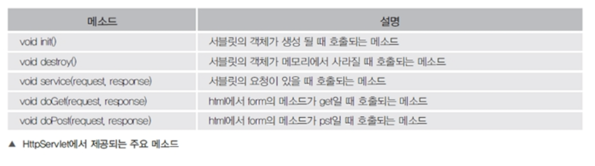
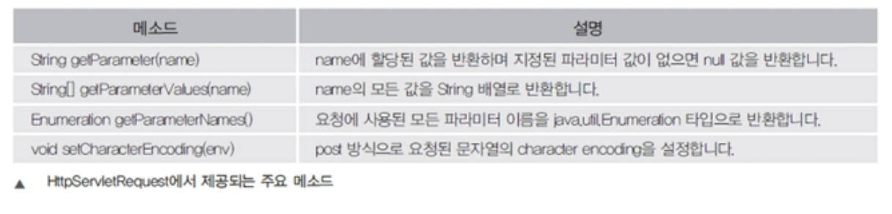
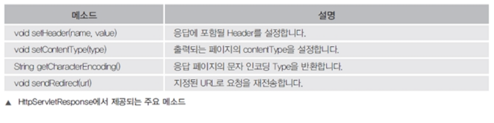
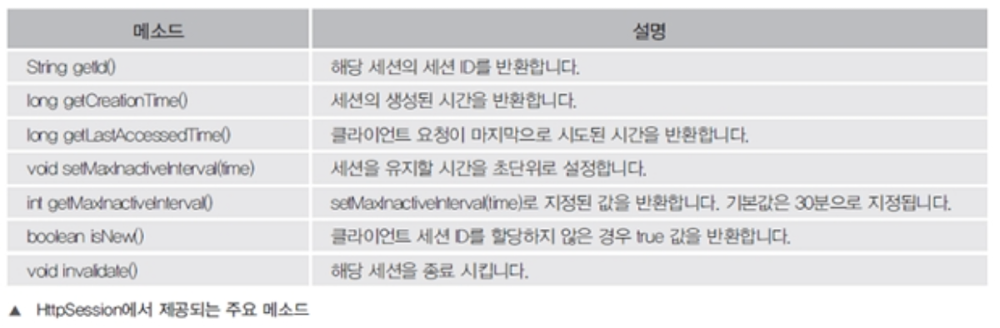
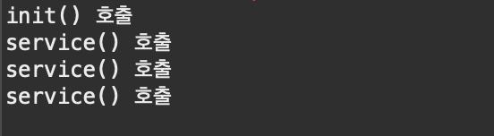
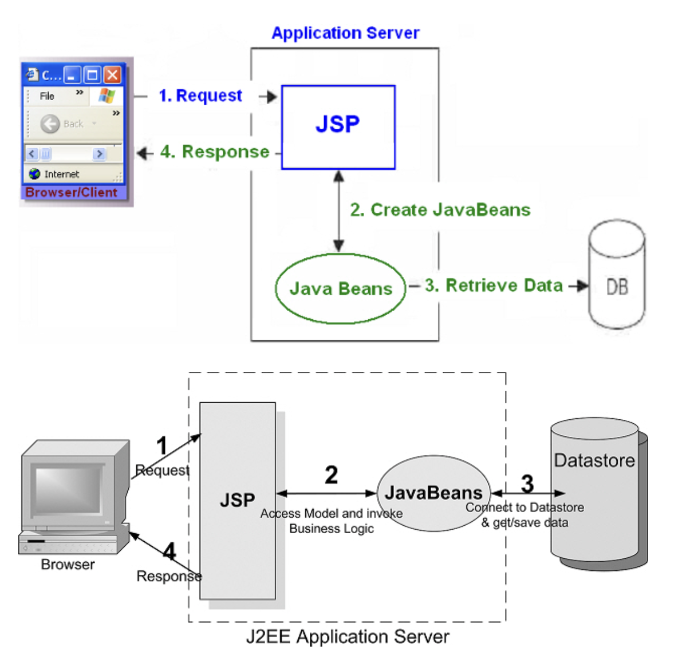
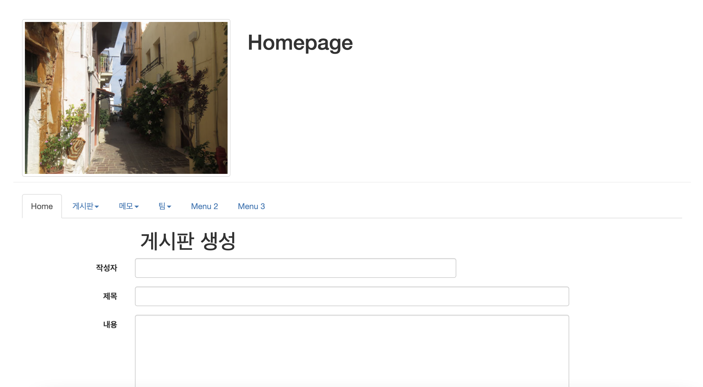
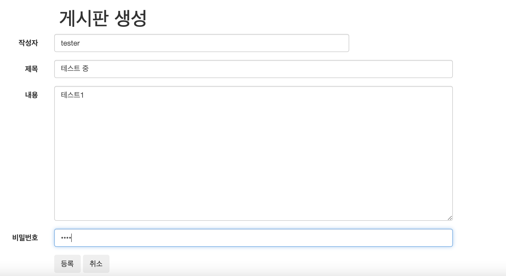
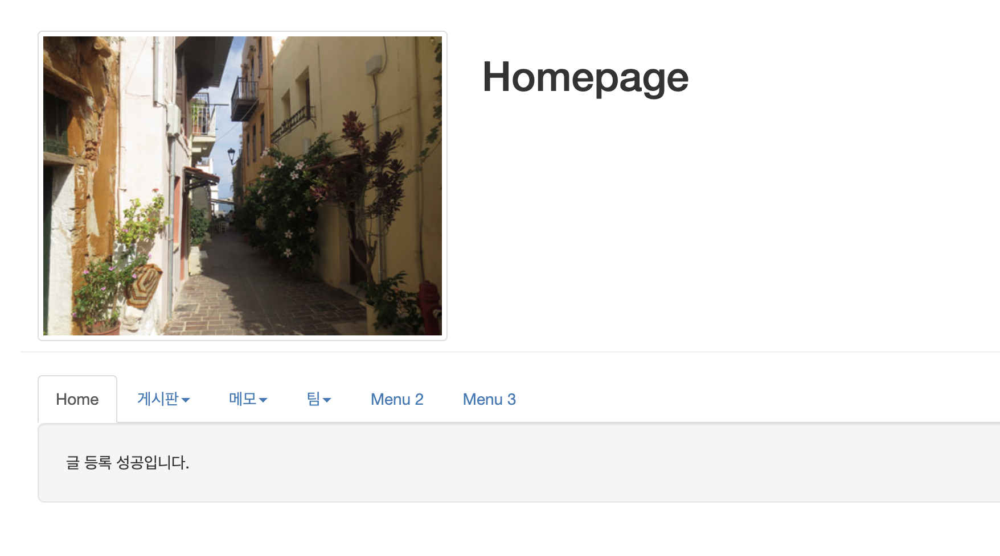

# JSP


목차

---

[서블릿 기초 문법](서블릿-기초-문법)

[게시판 실습, DBMS SQL](#게시판-실습,-dbms-sql)


---

## 서블릿 기초 문법


#### 서블릿의 주요 클래스

■ HttpServlet
서블릿을 만들기 위해서 반드시 상속해야 할 필수 클래스스
Servlet 인터페이스 > GenericServlet 추상클래스 > HttpServlet 상속구조
위에서 제공되는 많은 메소드사용 가능



■ HttpServletRequest
클라이언트가 데이터를 입력하거나 클라이언트의 정보에 대한 요청 값을 가지고
 있다.



■ HttpServletResponse
클라이언트가 요청한 정보를 처리하고 응답을 위한 정보를 담고 있다.



■ HttpSession
클라이언트가 세션정보를 저장하고, 세션 기능을 유지 하기 위해서 제공된다.




#### 서블릿의 라이프 사이클

```
클라이언트 서블릿 요청 -> init(최초 한번 호출) -> service, doGet(반복적 호출) -> destroy(마지막 한번 호출)
```

- init() : 서블릿이 처음으로 요청이 되어 객체가 생성 될 때 호출되는 메소드
- service() : 클라이언트가 요청이 있을 때마다 호출되는 메소드
- destroy() : 서블릿 서비스의 종료 및 재시작 그리고 서블릿 코드가 수정이 될 때 호출되는 메소드
- deGet() : 클라이언트 요청할 때 form의 method가 get 방식일 때 호출되는 메소드
- doPost() : 클라이언트 요청할 때 form의 method가 post 방식일 때 호출되는 메소드


> ch07/ExServlet2.java

```
package ch07;

import java.io.IOException;
import javax.servlet.ServletConfig;
import javax.servlet.ServletException;
import javax.servlet.annotation.WebServlet;
import javax.servlet.http.HttpServlet;
import javax.servlet.http.HttpServletRequest;
import javax.servlet.http.HttpServletResponse;

/**
 * Servlet implementation class ExServlet2
 */
@WebServlet("/ch07/ExServlet2")
public class ExServlet2 extends HttpServlet {
	private static final long serialVersionUID = 1L;

	/**
	 * @see Servlet#init(ServletConfig)
	 */
	public void init(ServletConfig config) throws ServletException {
		System.out.println("init() 호출");
	}

	/**
	 * @see Servlet#destroy()
	 */
	public void destroy() {
		System.out.println("destroy() 호출");
	}

	/**
	 * @see HttpServlet#service(HttpServletRequest request, HttpServletResponse response)
	 */
	protected void service(HttpServletRequest request, HttpServletResponse response) throws ServletException, IOException {
		System.out.println("service() 호출");	
	}

}

```

-- Output

> 실행하면 브라우저 화면에 아무것도 없이 보여진다.
>
> ```
> http://localhost:8000/jsptest/ch07/ExServlet2
> ```
>
> 

> 서버 콘솔창 화면
>
> init() 은 처음에 한번만, service는 새로고침할 때마다 다시 호출
>
> 
>
> 톰캣 서버를 정지하면 (근데 안 보였음)
>
> destory() 호출


### 서블릿의 요청 방식

- 브라우저에서 페이지 간에 통신 할 수 있는 대표적인 방법은 form에서 제공되는 get방식과 post방식이 있다.


#### get방식

- 검색이나 조건을 다른 페이지로 전송할 때 사용
- 요청시 url에 노출 되는 특징이 있있다.(보안적인 내용은 사용안함)

> servlet/getJsp.jsp

```jsp
<%@ page language="java" contentType="text/html; charset=UTF-8" pageEncoding="UTF-8"%>
<!DOCTYPE html>
<html>
<head>
<meta charset="UTF-8">
<title>Insert title here</title>
</head>
<body>
	<h1>Get Servlet 방식</h1>
	<form method="get" action="../ch07/getServlet">
		msg : <input name="msg"> <input type="submit" value="전송">
	</form>
</body>
</html>
```


> ch07/GetServlet.java

```java
package ch07;

import java.io.IOException;
import java.io.PrintWriter;

import javax.servlet.ServletException;
import javax.servlet.annotation.WebServlet;
import javax.servlet.http.HttpServlet;
import javax.servlet.http.HttpServletRequest;
import javax.servlet.http.HttpServletResponse;

/**
 * Servlet implementation class GetServlet
 */
@WebServlet("/ch07/getServlet")
public class GetServlet extends HttpServlet {
	private static final long serialVersionUID = 1L;

	/**
	 * @see HttpServlet#doGet(HttpServletRequest request, HttpServletResponse
	 *      response)
	 */
	protected void doGet(HttpServletRequest request, HttpServletResponse response) throws ServletException, IOException {
		String msg = request.getParameter("msg");
		response.setContentType("text/html; charset=UTF-8");
		PrintWriter out = response.getWriter();
		out.println("<html>");
		out.println("<body>");
		out.println("<h1>Get Servlet 방식</h1>");
		out.println("<h2>msg : " + msg + "</h2>");
		out.println("</body>");
		out.println("</html>");
	}

}
```


#### post 방식

- 게시판에 글을 입력하거나 또는 회원가입을 하는 기능으로 다른 페이지로 전송할 때 사용하는 방식이다.
- url에 노출되지 않고 html 헤더 값에 같이 전송된다.
- 일반적으로 DB 연동을 한다면 insert, update, update 이런 쿼리문을 실행할 때 사용되는 방식이다.

> servlet/postJsp.jsp

```jsp
<%@ page language="java" contentType="text/html; charset=UTF-8" pageEncoding="UTF-8"%>
<!DOCTYPE html>
<html>
<head>
<meta charset="UTF-8">
<title>Insert title here</title>
</head>
<body>
	<h1>Post Servlet 방식</h1>
	<form method="post" action="../ch07/postServlet">
		id : <input name="id"><br /> 
		pwd : <input type="password" name="pwd"><br /> 
		email : <input name="email"><br /> 
		<input type="submit" value="가입">
	</form>
</body>
</html>
```

> ch07/PostServlet.java

```java
package ch07;

import java.io.IOException;
import java.io.PrintWriter;

import javax.servlet.ServletException;
import javax.servlet.annotation.WebServlet;
import javax.servlet.http.HttpServlet;
import javax.servlet.http.HttpServletRequest;
import javax.servlet.http.HttpServletResponse;

/**
 * Servlet implementation class PostServlet
 */
@WebServlet("/ch07/postServlet")
public class PostServlet extends HttpServlet {
	private static final long serialVersionUID = 1L;

	/**
	 * @see HttpServlet#doPost(HttpServletRequest request, HttpServletResponse response)
	 */
	protected void doPost(HttpServletRequest request, HttpServletResponse response) throws ServletException, IOException {
		request.setCharacterEncoding("UTF-8");
        String id = request.getParameter("id");
        String pwd = request.getParameter("pwd");
        String email = request.getParameter("email");
        
        response.setContentType("text/html; charset=UTF-8");
        PrintWriter out = response.getWriter(); 
        out.println("<html>");
        out.println("<body>");
        out.println("<h1>Post Servlet 방식</h1>");
        out.println("<h3>id : "+ id + "</h3>");
        out.println("<h3>pwd : "+ pwd + "</h3>");
        out.println("<h3>email : "+ email + "</h3>");
        out.println("</body>");
        out.println("</html>");
	}

}
```


## 게시판 실습, DBMS SQL

### 게시판

- STS Setting
  type   : Dynamic Web Project
  name   : webtest
  packages : bbs, utility

- webtest/WEB-INF/lib/ojdbc8.jar(오라클,자바 연동)

bbs.sql

```sql
DROP TABLE bbs PURGE; 
 
CREATE TABLE bbs ( 
  bbsno    NUMBER(7)       NOT NULL,   -- 글 일련 번호, -9999999 ~ +9999999 
  wname   VARCHAR(20)    NOT NULL,   -- 글쓴이 
  title        VARCHAR(100)  NOT NULL,   -- 제목(*) 
  content   VARCHAR(4000) NOT NULL,  -- 글 내용 
  passwd   VARCHAR(15)     NOT NULL,  -- 비밀 번호 
  viewcnt   NUMBER(5)       DEFAULT 0,  -- 조회수, 기본값 사용 
  wdate     DATE               NOT NULL,  -- 등록 날짜, sysdate 
  grpno     NUMBER(7)       DEFAULT 0, -- 부모글 번호 
  indent    NUMBER(2)       DEFAULT 0,  -- 답변여부,답변의 깊이
  ansnum  NUMBER(5)       DEFAULT 0,  -- 답변 순서 
  PRIMARY KEY (bbsno)  
); 

-- c(create, insert)
-- 일련번호 생성
SELECT max(bbsno) AS max FROM bbs;

SELECT * FROM bbs
ORDER BY bbsno asc;


SELECT nvl(max(bbsno),0)+1 AS bbsno FROM bbs;

INSERT INTO bbs(bbsno, wname, title, content, passwd, wdate)  
VALUES((SELECT NVL(MAX(bbsno), 0) + 1 as bbsno FROM bbs), 
'홍길동', '게시판제목', '게시판내용', '1234', sysdate);              


-- read(select)
UPDATE bbs
SET VIEWCNT = VIEWCNT + 1
WHERE bbsno=1;

SELECT * FROM bbs
WHERE bbsno = 1;

--update(수정)
UPDATE BBS
SET wname = '왕눈이',
	title = '제목수정',
	content = '내용 수정'
WHERE BBSNO = 1;

-- 비번 검증 (cnt : 1-인증성공(1234) / cnt:0-인증실패(12345) )
SELECT count(bbsno) AS cnt
FROM bbs
WHERE bbsno = 1
AND PASSWD = '1234';


-- DELETE(삭제)
DELETE FROM BBS
WHERE bbsno=1;

--목록(페이징, 검색)
SELECT bbsno, wname, title, content, viewcnt, wdate
FROM bbs
ORDER BY bbsno DESC;

SELECT bbsno, wname, passwd FROM bbs;


-- 1) 성명 검색 글 목록(S:Search List) 
SELECT bbsno, wname, title, content, passwd, viewcnt, wdate, grpno, indent, ansnum 
FROM bbs  
WHERE wname LIKE '%왕눈이%' 
ORDER BY bbsno DESC;  
 
 
-- 2) 제목 검색 글 목록(S:Search List) 
SELECT bbsno, wname, title, content, passwd, viewcnt, wdate, grpno, indent, ansnum 
FROM bbs  
WHERE title LIKE '%독도%' 
ORDER BY bbsno DESC;  
 
 
 
-- 3) 내용 검색 글 목록(S:Search List) 
SELECT bbsno, wname, title, content, passwd, viewcnt, wdate, grpno, indent, ansnum 
FROM bbs  
WHERE content LIKE '%독도%' 
ORDER BY bbsno DESC;  
 
 
-- 4) 파이프 기호를 통한 SQL 결합 
SELECT ('A' || 'B' || 'C' || 'D') as "grade" 
FROM dual; 

 
SELECT ('등록자: ' || wname) as "wname"  
FROM bbs; 


```


### Design Pattern 
 \- list.jsp -> BbsDAO.java -> DBOpen.java, DBClose.java -> Oracle/MySQL DBMS 



### DBMS Connection 관리자 클래스 

> packagge utility;
>
> Constant.java, Open.java, DBClose.java (+ JDBC_Test.java)


-- Constant.java

```java
package utility;

public class Constant {
	public static final String DRIVER = "oracle.jdbc.pool.OracleDataSource";
			//.driver.OracleDriver";
	public static final String URL = "jdbc:oracle:thin:@orcldb_high?TNS_ADMIN=전자지갑경로";
	public static final String USER = "admin";
	public static final String PASSWORD = "비번";
}
```


-- Open.java

```java
package utility;

import java.sql.Connection;
import java.sql.DriverManager;
import java.sql.SQLException;

public class Open {
  private static Connection con;

  public static Connection getConnection() {

    try {
      Class.forName(Constant.DRIVER);

      con = DriverManager.getConnection(Constant.URL, Constant.USER, Constant.PASSWORD);
   
      
    } catch (ClassNotFoundException | SQLException e) {
      // TODO Auto-generated catch block
      e.printStackTrace();
    }
    return con;
  }

}
```


-- DBClose.java

```java
package utility;

import java.sql.Connection;
import java.sql.PreparedStatement;
import java.sql.ResultSet;
import java.sql.SQLException;

public class DBClose {
  public static void close(PreparedStatement pstmt, Connection con) {
    try {
      if (pstmt != null)
        pstmt.close();
    } catch (SQLException e) {
      // TODO Auto-generated catch block
      e.printStackTrace();
    }
    try {
      if (con != null)
        con.close();
    } catch (SQLException e) {
      // TODO Auto-generated catch block
      e.printStackTrace();
    }
  }

  public static void close(ResultSet rs, PreparedStatement pstmt, Connection con) {
    try {
      if (rs != null)
        rs.close();
    } catch (SQLException e) {
      // TODO Auto-generated catch block
      e.printStackTrace();
    }
    try {
      if (pstmt != null)
        pstmt.close();
    } catch (SQLException e) {
      // TODO Auto-generated catch block
      e.printStackTrace();
    }
    try {
      if (con != null)
        con.close();
    } catch (SQLException e) {
      // TODO Auto-generated catch block
      e.printStackTrace();
    }
  }
}
```


>  JDBC_Test.java

```java
package utility;
 
import java.sql.Connection;
import java.sql.PreparedStatement;
import java.sql.ResultSet;
 
 
/**
 * JAVA Client Test
 */
public class JDBC_Test {
 
    public static void main(String[] args) {
 
        Connection con = Open.getConnection();
        PreparedStatement pstmt = null;
        ResultSet rs = null;
        
        // 테이블의 갯수 리턴
        String sql="SELECT count(*) as cnt FROM tab";
        
        try{
            pstmt = con.prepareStatement(sql);
            
            rs = pstmt.executeQuery();
            if (rs.next() == true){
                System.out.println("현재 생성된 테이블 갯수: " + rs.getInt("cnt"));
            }
        }catch(Exception e){
            System.out.println(e);
        }finally{
            DBClose.close(rs, pstmt, con);
        }
    }
}
```


#### DTO(Data Transfer Object, VO: Value Object) 생성 
- DTO(Data Transfer Object, Value Object, Bean, Domain) 
- 하나의 레코드를 객체로 저장, 레코드가 10개이면 DTO(VO) 객체도 10개가 생성
- 필드들은 접근 제한자를 전부 private으로 지정
- oracle의 char, varchar, varchar2, date는 String으로 선언
- number(5)는 int로 선언 
- number(5, 1)은 float 또는 double로 선언, 정수 4자리, 소수점 이하 1자리number(전체 자리수, 소수점 이하 자리수) 
- 멤버 변수(필드)의 접근 메소드는 public으로 선언 
- 필드의 주석은 '/** */'의 형태로 DOC 주석을 지정
- SELECT된 레코드가 많은 경우 오라클은 SubQuery, MySQL은 limit등을 이용해서 레코드를 분할해서 가져온다.(Paging)   

■ DTO 생성 과정 
\- 멤버 변수(필드) 선언, 멤버 변수(필드) 주석 처리 
\- 생성자, getter, setter, toString 선언 

> BbsDTO.java

```java
package bbs;

public class BbsDTO { 
	  /** 번호 */ 
	  private int bbsno; 
	  /** 글쓴이 */ 
	  private String wname; 
	  /** 제목 */ 
	  private String title; 
	  /** 내용 */ 
	  private String content; 
	  /** 패스워드 */ 
	  private String passwd; 
	  /** 조회수 */ 
	  private int viewcnt; 
	  /** 등록일 */ 
	  private String wdate; 
	  /** 그룹 번호 */ 
	  private int grpno; 
	  /** 답변 차수 */ 
	  private int indent; 
	  /** 답변 순서 */ 
	  private int ansnum;
	public BbsDTO() {
		super();
		// TODO Auto-generated constructor stub
	}
	public BbsDTO(int bbsno, String wname, String title, String content, String passwd, int viewcnt, String wdate,
			int grpno, int indent, int ansnum) {
		super();
		this.bbsno = bbsno;
		this.wname = wname;
		this.title = title;
		this.content = content;
		this.passwd = passwd;
		this.viewcnt = viewcnt;
		this.wdate = wdate;
		this.grpno = grpno;
		this.indent = indent;
		this.ansnum = ansnum;
	}
	@Override
	public String toString() {
		return "BbsDTO [bbsno=" + bbsno + ", wname=" + wname + ", title=" + title + ", content=" + content + ", passwd="
				+ passwd + ", viewcnt=" + viewcnt + ", wdate=" + wdate + ", grpno=" + grpno + ", indent=" + indent
				+ ", ansnum=" + ansnum + "]";
	}
	public int getBbsno() {
		return bbsno;
	}
	public void setBbsno(int bbsno) {
		this.bbsno = bbsno;
	}
	public String getWname() {
		return wname;
	}
	public void setWname(String wname) {
		this.wname = wname;
	}
	public String getTitle() {
		return title;
	}
	public void setTitle(String title) {
		this.title = title;
	}
	public String getContent() {
		return content;
	}
	public void setContent(String content) {
		this.content = content;
	}
	public String getPasswd() {
		return passwd;
	}
	public void setPasswd(String passwd) {
		this.passwd = passwd;
	}
	public int getViewcnt() {
		return viewcnt;
	}
	public void setViewcnt(int viewcnt) {
		this.viewcnt = viewcnt;
	}
	public String getWdate() {
		return wdate;
	}
	public void setWdate(String wdate) {
		this.wdate = wdate;
	}
	public int getGrpno() {
		return grpno;
	}
	public void setGrpno(int grpno) {
		this.grpno = grpno;
	}
	public int getIndent() {
		return indent;
	}
	public void setIndent(int indent) {
		this.indent = indent;
	}
	public int getAnsnum() {
		return ansnum;
	}
	public void setAnsnum(int ansnum) {
		this.ansnum = ansnum;
	}
	  
}
```


#### DAO(Data(DBMS) Access Object) 제작 
\- 데이터베이스에 접속하여 SQL을 실행하는 클래스 

```java
package bbs;

import java.sql.Connection;
import java.sql.PreparedStatement;
import java.sql.ResultSet;
import java.sql.SQLException;
import java.util.Map;

import utility.DBClose;
import utility.Open;

public class BbsDAO {
	public boolean passCheck(Map map) {
		boolean flag = false;
		Connection con = Open.getConnection();
		PreparedStatement pstmt = null;
		ResultSet rs = null;
		StringBuffer sql = new StringBuffer();
		sql.append(" select count(bbsno) as cnt ");
		sql.append(" from bbs ");
		sql.append(" where bbsno = ? ");
		sql.append(" and passwd = ? ");
		
		int bbsno = (Integer)map.get("bbsno");
		String passwd = (String)map.get("passwd");
		
		try {
			pstmt = con.prepareStatement(sql.toString());
			pstmt.setInt(1, bbsno);
			pstmt.setString(2, passwd);
			
			rs = pstmt.executeQuery();
			
			rs.next();
			
			int cnt = rs.getInt("cnt");
			
			if(cnt>0) flag = true;
			
		} catch (SQLException e) {
			// TODO Auto-generated catch block
			e.printStackTrace();
		} finally {
			DBClose.close(rs, pstmt, con);
		}
		
		
		return flag;
	}
	public void upViewcnt(int bbsno) {
		Connection con = Open.getConnection();
		PreparedStatement pstmt = null;
		StringBuffer sql = new StringBuffer();
		sql.append(" update bbs ");
		sql.append(" set viewcnt = viewcnt + 1 ");
		sql.append(" where bbsno = ? ");
		
		try {
			pstmt = con.prepareStatement(sql.toString());
			pstmt.setInt(1, bbsno);
			
			pstmt.executeUpdate();
		} catch (SQLException e) {
			// TODO Auto-generated catch block
			e.printStackTrace();
		} finally {
			DBClose.close(pstmt, con);
		}

	}
	
	public boolean create(BbsDTO dto) {
		boolean flag = false;
		Connection con = Open.getConnection();
		PreparedStatement pstmt = null;
		StringBuffer sql = new StringBuffer();
		sql.append(" insert into bbs(bbsno, wname, title, content, passwd, wdate) ");
		sql.append(" values((select nvl(max(bbsno),0) + 1 as bbsno from bbs), ");
		sql.append(" ?,?,?,?,sysdate) ");
		
		
		try {
			pstmt = con.prepareStatement(sql.toString());
			pstmt.setString(1, dto.getWname());
			pstmt.setString(2, dto.getTitle());
			pstmt.setString(3, dto.getContent());
			pstmt.setString(4, dto.getPasswd());
			
			int cnt = pstmt.executeUpdate();
			
			if(cnt>0)flag =true;
			
			
		} catch (SQLException e) {
			// TODO Auto-generated catch block
			e.printStackTrace();
		} finally {
			DBClose.close(pstmt, con);
		}
				
		return flag;
	}
	
	public BbsDTO read(int bbsno) {
	    BbsDTO dto = null;
	    Connection con = Open.getConnection();
	    PreparedStatement pstmt = null;
	    ResultSet rs = null;
	 
	    StringBuffer sql = new StringBuffer();
	    sql.append(" SELECT bbsno, wname, title, content,  viewcnt, ");
	    sql.append(" to_char(wdate,'yyyy-mm-dd') wdate ");
	    sql.append(" FROM bbs   ");
	    sql.append(" WHERE bbsno = ?  ");
	 
	    try {
	      pstmt = con.prepareStatement(sql.toString());
	      pstmt.setInt(1, bbsno);
	 
	      rs = pstmt.executeQuery();
	 
	      if (rs.next()) {
	        dto = new BbsDTO();
	        dto.setBbsno(rs.getInt("bbsno"));
	        dto.setWname(rs.getString("wname"));
	        dto.setTitle(rs.getString("title"));
	        dto.setContent(rs.getString("content"));
	        dto.setViewcnt(rs.getInt("viewcnt"));
	        dto.setWdate(rs.getString("wdate"));
	      }
	 
	    } catch (SQLException e) {
	      // TODO Auto-generated catch block
	      e.printStackTrace();
	    } finally {
	      DBClose.close(rs, pstmt, con);
	    }
	 
	    return dto;
	  }
	
	public boolean update(BbsDTO dto) {
	    boolean flag = false;
	    Connection con = Open.getConnection();
	    PreparedStatement pstmt = null;
	    StringBuffer sql = new StringBuffer();
	    sql.append(" UPDATE bbs  ");
	    sql.append(" SET         ");
	    sql.append("    wname   = ?,  ");
	    sql.append("    title   = ?,  ");
	    sql.append("    content = ?  ");
	    sql.append(" WHERE bbsno  = ?  ");
	 
	    try {
	      pstmt = con.prepareStatement(sql.toString());
	      pstmt.setString(1, dto.getWname());
	      pstmt.setString(2, dto.getTitle());
	      pstmt.setString(3, dto.getContent());
	      pstmt.setInt(4, dto.getBbsno());
	 
	      int cnt = pstmt.executeUpdate();
	      if (cnt > 0)
	        flag = true;
	 
	    } catch (SQLException e) {
	      // TODO Auto-generated catch block
	      e.printStackTrace();
	    } finally {
	      DBClose.close(pstmt,con);
	    }
	 
	    return flag;
	  }
	 
	public boolean delete(int bbsno) {
	    boolean flag = false;
	    Connection con = Open.getConnection();
	    PreparedStatement pstmt = null;
	    StringBuffer sql = new StringBuffer();
	    sql.append(" delete from bbs ");
	    sql.append(" where bbsno = ? ");
	 
	    try {
	      pstmt = con.prepareStatement(sql.toString());
	      pstmt.setInt(1, bbsno);
	 
	      int cnt = pstmt.executeUpdate();
	      if (cnt > 0)
	        flag = true;
	 
	    } catch (SQLException e) {
	      // TODO Auto-generated catch block
	      e.printStackTrace();
	    } finally {
	      DBClose.close(pstmt,con);
	    }
	 
	    return flag;
	  }
}

```


> BbsTest.java

```java
package bbs;

public class BbsTest {
	public static void main(String[] args) {
		BbsDAO dao = new BbsDAO();
//		create(dao);
	    read(dao);
//	    update(dao);
//	    delete(dao);
	}

	private static void create(BbsDAO dao) {
		BbsDTO dto = new BbsDTO();
		dto.setWname("김길동");
		dto.setTitle("게시판 제목");
		dto.setContent("게시판 내용");
		dto.setPasswd("1234");
		if (dao.create(dto)) {
			p("성공");

		} else {
			p("실패");
		}
	}

	private static void update(BbsDAO dao) {
		BbsDTO dto = dao.read(1);
		dto.setWname("아리");
		dto.setTitle("제목 수정");
		dto.setContent("수정_오늘의 날씨는..");

		if (dao.update(dto)) {
			p("수정 성공");
		} else {
			p("수정 실패");
		}
	}
	
	private static void read(BbsDAO dao) {
	    BbsDTO dto = dao.read(1);
	    p(dto.toString());
	  }

	private static void delete(BbsDAO dao) {
		if (dao.delete(5)) { // 5 방금 삭제함. row 없어짐.
			p("삭제 성공");
		} else {
			p("삭제 실패");
		}
	}

	private static void p(String string) {
		System.out.println(string);
	}
}
```


#### 등록 폼

(webapp/bbs/)createForm.jsp , createProc.jsp




> createForm.jsp

```jsp
<%@ page contentType="text/html; charset=UTF-8" %> 
 
<!DOCTYPE html> 
<html> 
<head>
  <title>homepage</title>
  <meta charset="utf-8">
</head>
<body> 
<jsp:include page="/menu/top.jsp"/>
<div class="container">
<h1 class="col-sm-offset-2 col-sm-10">게시판 생성</h1>
<form class="form-horizontal" 
      action="createProc.jsp"
      method="post">

  <div class="form-group">
    <label class="control-label col-sm-2" for="wname">작성자</label>
    <div class="col-sm-6">
      <input type="text" name="wname" id="wname" class="form-control">
    </div>
  </div>
  
  <div class="form-group">
    <label class="control-label col-sm-2" for="title">제목</label>
    <div class="col-sm-8">
      <input type="text" name="title" id="title" class="form-control">
    </div>
  </div>
  
  <div class="form-group">
    <label class="control-label col-sm-2" for="content">내용</label>
    <div class="col-sm-8">
    <textarea rows="12" cols="7" id="content" name="content" class="form-control"></textarea>
    </div>
  </div>
  
  <div class="form-group">
    <label class="control-label col-sm-2" for="passwd">비밀번호</label>
    <div class="col-sm-8">
      <input type="password" name="passwd" id="passwd" class="form-control">
    </div>
  </div>

   <div class="form-group">
   <div class="col-sm-offset-2 col-sm-5">
    <button class="btn">등록</button>
    <button type="reset" class="btn">취소</button>
   </div>
 </div>
</form>
</div>
</body> 
</html> 
```



> createProc.jsp
>
> 등록 처리

```jsp
<%@ page contentType="text/html; charset=UTF-8"%>
<%
request.setCharacterEncoding("utf-8");
%>
<jsp:useBean class="bbs.BbsDAO" id="dao" />
<jsp:useBean class="bbs.BbsDTO" id="dto" />
<jsp:setProperty name="dto" property="*" />
<%
//String wname = request.getParameter("wname");
//dto.setWname(wname);
boolean flag = dao.create(dto);
%>
<!DOCTYPE html>
<html>
<head>
<title>게시판 생성</title>
<meta charset="utf-8">
</head>
<body>
	<jsp:include page="/menu/top.jsp" />
	<div class="container">
		<div class="well well-lg">
			<%
			if (flag) {
				out.print("글 등록 성공입니다.");
			} else {
				out.print("글 등록 실패입니다.");
			}
			%>
		</div>
	</div>
</body>
</html>
```




## 조회(read.jsp) 및 조회수 증가 


#### SQL

```sql
-- SQL 
UPDATE bbs 
SET viewcnt = viewcnt + 1 
WHERE bbsno=1; 

SELECT bbsno, wname, title, content, viewcnt, wdate
FROM bbs  
WHERE bbsno = 1; 
```


#### 조회: 글 등록을 참조하여 작성

> /WebContent/bbs/read.jsp 

```jsp
<%@ page contentType="text/html; charset=UTF-8" %> 
<%@ page import="bbs.BbsDTO" %>
<jsp:useBean class="bbs.BbsDAO" id="dao" />
<%
	int bbsno = Integer.parseInt(request.getParameter("bbsno"));

	dao.upViewcnt(bbsno);
	
	BbsDTO dto = dao.read(bbsno);
	
	String content = dto.getContent().replaceAll("\r\n", "<br>");
%>
<!DOCTYPE html> 
<html> 
<head>
  <title>게시판</title>
  <meta charset="utf-8">
  <script>
  	function update(){
  		let url = 'updateForm.jsp';
  		url += '?bbsno=<%=dto.getBbsno()%>';
  		
  		location.href=url;
  	}
  	function del(){
  		let url = 'deleteForm.jsp';
  		url += '?bbsno=<%=dto.getBbsno()%>';
  		
  		location.href= url;
  	}
  </script>
</head>
<body> 
<jsp:include page="/menu/top.jsp"/>
<div class="container">
<h2>조회</h2>
<div class= "panel panel-default">
	<div class="panel-heading">작성자</div>
	<div class="panel-body"><%=dto.getWname() %></div>
	
	<div class="panel-heading">제목</div>
	<div class="panel-body"><%=dto.getTitle() %></div>
	
	<div class="panel-heading">내용</div>
	<div class="panel-body" style="height:200px"><%=content %></div>
	
	<div class="panel-heading">조회수</div>
	<div class="panel-body"><%=dto.getViewcnt() %></div>
	
	<div class="panel-heading">등록일</div>
	<div class="panel-body"><%=dto.getWdate() %></div>

</div>

	<button class='btn' onclick="location.href='./createForm.jsp'">등록</button>
	<button class='btn' onclick="update()">수정</button>
	<button class='btn' onclick="del()">삭제</button>
	<button class='btn' onclick="location.href='./list.jsp'">목록</button>
<br>
<br>
</div>

</body> 
</html> 

```


> (여기까지 진행 중_read.jsp 뒤에 아직 직접 붙여줘야 함.)
>
> read.jsp 요청시
>
> ```
> http://localhost:8000/webtest/bbs/read.jsp?bbsno=1
> ```
>
> `?bbsno=1` 붙여서 확인. 아직 경로명 제대로 못가져와서 bbsno 직접 붙여줌.


> ❗️webtest -> java -> bbs/BbsDAO.java, BbsDTO.java, BbsTest.java 
>
> webtest -> webapp/bbs/
>
> createForm.jsp, createProc.jsp, deleteForm.jsp, deleteProc.jsp, read.jsp, updateForm.jsp, updateProc.jsp
>
> 까지 프로젝트 진행. 첨부한 코드들 ; create, 한 개 페이지 read, update 기능 포함.


*Fin.🐧*

