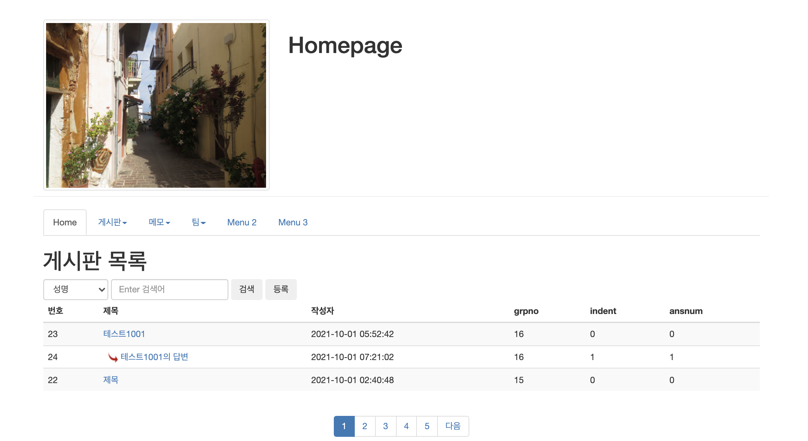

## 게시판 실습, DBMS SQL

---

목차

[조회(read.jsp) 및 조회수 증가](#조회(read.jsp)-및-조회수-증가)

[게시판 목록](#게시판-목록)

[게시판 검색](#게시판-검색)

[PAGING의 원리, 구현, 사용](#paging의-원리,-구현,-사용)

[게시판 댓글 기능](#게시판-댓글-기능)

[새로운 글에 new 이미지 표시](#새로운-글에-new-이미지-표시)


---

(0930)

### 게시판

- STS Setting
  type   : Dynamic Web Project
  name   : webtest
  packages : bbs, utility

- webtest/WEB-INF/lib/ojdbc8.jar(오라클,자바 연동)

bbs.sql

```sql
DROP TABLE bbs PURGE; 
 
CREATE TABLE bbs ( 
  bbsno    NUMBER(7)       NOT NULL,   -- 글 일련 번호, -9999999 ~ +9999999 
  wname   VARCHAR(20)    NOT NULL,   -- 글쓴이 
  title        VARCHAR(100)  NOT NULL,   -- 제목(*) 
  content   VARCHAR(4000) NOT NULL,  -- 글 내용 
  passwd   VARCHAR(15)     NOT NULL,  -- 비밀 번호 
  viewcnt   NUMBER(5)       DEFAULT 0,  -- 조회수, 기본값 사용 
  wdate     DATE               NOT NULL,  -- 등록 날짜, sysdate 
  grpno     NUMBER(7)       DEFAULT 0, -- 부모글 번호 
  indent    NUMBER(2)       DEFAULT 0,  -- 답변여부,답변의 깊이
  ansnum  NUMBER(5)       DEFAULT 0,  -- 답변 순서 
  PRIMARY KEY (bbsno)  
); 

-- c(create, insert)
-- 일련번호 생성
SELECT max(bbsno) AS max FROM bbs;

SELECT * FROM bbs
ORDER BY bbsno asc;


SELECT nvl(max(bbsno),0)+1 AS bbsno FROM bbs;

INSERT INTO bbs(bbsno, wname, title, content, passwd, wdate)  
VALUES((SELECT NVL(MAX(bbsno), 0) + 1 as bbsno FROM bbs), 
'홍길동', '게시판제목', '게시판내용', '1234', sysdate);              


-- read(select)
UPDATE bbs
SET VIEWCNT = VIEWCNT + 1
WHERE bbsno=1;

SELECT * FROM bbs
WHERE bbsno = 1;

--update(수정)
UPDATE BBS
SET wname = '왕눈이',
	title = '제목수정',
	content = '내용 수정'
WHERE BBSNO = 1;

-- 비번 검증 (cnt : 1-인증성공(1234) / cnt:0-인증실패(12345) )
SELECT count(bbsno) AS cnt
FROM bbs
WHERE bbsno = 1
AND PASSWD = '1234';


-- DELETE(삭제)
DELETE FROM BBS
WHERE bbsno=1;

--목록(페이징, 검색)
SELECT bbsno, wname, title, content, viewcnt, wdate
FROM bbs
ORDER BY bbsno DESC;

SELECT bbsno, wname, passwd FROM bbs;


-- 1) 성명 검색 글 목록(S:Search List) 
SELECT bbsno, wname, title, content, passwd, viewcnt, wdate, grpno, indent, ansnum 
FROM bbs  
WHERE wname LIKE '%왕눈이%' 
ORDER BY bbsno DESC;  
 
 
-- 2) 제목 검색 글 목록(S:Search List) 
SELECT bbsno, wname, title, content, passwd, viewcnt, wdate, grpno, indent, ansnum 
FROM bbs  
WHERE title LIKE '%독도%' 
ORDER BY bbsno DESC;  
 
 
 
-- 3) 내용 검색 글 목록(S:Search List) 
SELECT bbsno, wname, title, content, passwd, viewcnt, wdate, grpno, indent, ansnum 
FROM bbs  
WHERE content LIKE '%독도%' 
ORDER BY bbsno DESC;  
 
 
-- 4) 파이프 기호를 통한 SQL 결합 
SELECT ('A' || 'B' || 'C' || 'D') as "grade" 
FROM dual; 

 
SELECT ('등록자: ' || wname) as "wname"  
FROM bbs; 


```


### Design Pattern 

 \- list.jsp -> BbsDAO.java -> DBOpen.java, DBClose.java -> Oracle/MySQL DBMS 


### DBMS Connection 관리자 클래스 

> packagge utility;
>
> Constant.java, Open.java, DBClose.java (+ JDBC_Test.java)


-- Constant.java

```java
package utility;

public class Constant {
	public static final String DRIVER = "oracle.jdbc.pool.OracleDataSource";
			//.driver.OracleDriver";
	public static final String URL = "jdbc:oracle:thin:@orcldb_high?TNS_ADMIN=전자지갑경로";
	public static final String USER = "admin";
	public static final String PASSWORD = "비번";
}
```


-- Open.java

```java
package utility;

import java.sql.Connection;
import java.sql.DriverManager;
import java.sql.SQLException;

public class Open {
  private static Connection con;

  public static Connection getConnection() {

    try {
      Class.forName(Constant.DRIVER);

      con = DriverManager.getConnection(Constant.URL, Constant.USER, Constant.PASSWORD);
   
      
    } catch (ClassNotFoundException | SQLException e) {
      // TODO Auto-generated catch block
      e.printStackTrace();
    }
    return con;
  }

}
```


-- DBClose.java

```java
package utility;

import java.sql.Connection;
import java.sql.PreparedStatement;
import java.sql.ResultSet;
import java.sql.SQLException;

public class DBClose {
  public static void close(PreparedStatement pstmt, Connection con) {
    try {
      if (pstmt != null)
        pstmt.close();
    } catch (SQLException e) {
      // TODO Auto-generated catch block
      e.printStackTrace();
    }
    try {
      if (con != null)
        con.close();
    } catch (SQLException e) {
      // TODO Auto-generated catch block
      e.printStackTrace();
    }
  }

  public static void close(ResultSet rs, PreparedStatement pstmt, Connection con) {
    try {
      if (rs != null)
        rs.close();
    } catch (SQLException e) {
      // TODO Auto-generated catch block
      e.printStackTrace();
    }
    try {
      if (pstmt != null)
        pstmt.close();
    } catch (SQLException e) {
      // TODO Auto-generated catch block
      e.printStackTrace();
    }
    try {
      if (con != null)
        con.close();
    } catch (SQLException e) {
      // TODO Auto-generated catch block
      e.printStackTrace();
    }
  }
}
```


>  JDBC_Test.java

```java
package utility;
 
import java.sql.Connection;
import java.sql.PreparedStatement;
import java.sql.ResultSet;
 
 
/**
 * JAVA Client Test
 */
public class JDBC_Test {
 
    public static void main(String[] args) {
 
        Connection con = Open.getConnection();
        PreparedStatement pstmt = null;
        ResultSet rs = null;
        
        // 테이블의 갯수 리턴
        String sql="SELECT count(*) as cnt FROM tab";
        
        try{
            pstmt = con.prepareStatement(sql);
            
            rs = pstmt.executeQuery();
            if (rs.next() == true){
                System.out.println("현재 생성된 테이블 갯수: " + rs.getInt("cnt"));
            }
        }catch(Exception e){
            System.out.println(e);
        }finally{
            DBClose.close(rs, pstmt, con);
        }
    }
}
```


#### DTO(Data Transfer Object, VO: Value Object) 생성 

- DTO(Data Transfer Object, Value Object, Bean, Domain) 
- 하나의 레코드를 객체로 저장, 레코드가 10개이면 DTO(VO) 객체도 10개가 생성
- 필드들은 접근 제한자를 전부 private으로 지정
- oracle의 char, varchar, varchar2, date는 String으로 선언
- number(5)는 int로 선언 
- number(5, 1)은 float 또는 double로 선언, 정수 4자리, 소수점 이하 1자리number(전체 자리수, 소수점 이하 자리수) 
- 멤버 변수(필드)의 접근 메소드는 public으로 선언 
- 필드의 주석은 '/** */'의 형태로 DOC 주석을 지정
- SELECT된 레코드가 많은 경우 오라클은 SubQuery, MySQL은 limit등을 이용해서 레코드를 분할해서 가져온다.(Paging)   

■ DTO 생성 과정 
\- 멤버 변수(필드) 선언, 멤버 변수(필드) 주석 처리 
\- 생성자, getter, setter, toString 선언 

> BbsDTO.java

```java
package bbs;

public class BbsDTO { 
	  /** 번호 */ 
	  private int bbsno; 
	  /** 글쓴이 */ 
	  private String wname; 
	  /** 제목 */ 
	  private String title; 
	  /** 내용 */ 
	  private String content; 
	  /** 패스워드 */ 
	  private String passwd; 
	  /** 조회수 */ 
	  private int viewcnt; 
	  /** 등록일 */ 
	  private String wdate; 
	  /** 그룹 번호 */ 
	  private int grpno; 
	  /** 답변 차수 */ 
	  private int indent; 
	  /** 답변 순서 */ 
	  private int ansnum;
	public BbsDTO() {
		super();
		// TODO Auto-generated constructor stub
	}
	public BbsDTO(int bbsno, String wname, String title, String content, String passwd, int viewcnt, String wdate,
			int grpno, int indent, int ansnum) {
		super();
		this.bbsno = bbsno;
		this.wname = wname;
		this.title = title;
		this.content = content;
		this.passwd = passwd;
		this.viewcnt = viewcnt;
		this.wdate = wdate;
		this.grpno = grpno;
		this.indent = indent;
		this.ansnum = ansnum;
	}
	@Override
	public String toString() {
		return "BbsDTO [bbsno=" + bbsno + ", wname=" + wname + ", title=" + title + ", content=" + content + ", passwd="
				+ passwd + ", viewcnt=" + viewcnt + ", wdate=" + wdate + ", grpno=" + grpno + ", indent=" + indent
				+ ", ansnum=" + ansnum + "]";
	}
	public int getBbsno() {
		return bbsno;
	}
	public void setBbsno(int bbsno) {
		this.bbsno = bbsno;
	}
	public String getWname() {
		return wname;
	}
	public void setWname(String wname) {
		this.wname = wname;
	}
	public String getTitle() {
		return title;
	}
	public void setTitle(String title) {
		this.title = title;
	}
	public String getContent() {
		return content;
	}
	public void setContent(String content) {
		this.content = content;
	}
	public String getPasswd() {
		return passwd;
	}
	public void setPasswd(String passwd) {
		this.passwd = passwd;
	}
	public int getViewcnt() {
		return viewcnt;
	}
	public void setViewcnt(int viewcnt) {
		this.viewcnt = viewcnt;
	}
	public String getWdate() {
		return wdate;
	}
	public void setWdate(String wdate) {
		this.wdate = wdate;
	}
	public int getGrpno() {
		return grpno;
	}
	public void setGrpno(int grpno) {
		this.grpno = grpno;
	}
	public int getIndent() {
		return indent;
	}
	public void setIndent(int indent) {
		this.indent = indent;
	}
	public int getAnsnum() {
		return ansnum;
	}
	public void setAnsnum(int ansnum) {
		this.ansnum = ansnum;
	}
	  
}
```


#### DAO(Data(DBMS) Access Object) 제작 

\- 데이터베이스에 접속하여 SQL을 실행하는 클래스 

```java
package bbs;

import java.sql.Connection;
import java.sql.PreparedStatement;
import java.sql.ResultSet;
import java.sql.SQLException;
import java.util.Map;

import utility.DBClose;
import utility.Open;

public class BbsDAO {
	public boolean passCheck(Map map) {
		boolean flag = false;
		Connection con = Open.getConnection();
		PreparedStatement pstmt = null;
		ResultSet rs = null;
		StringBuffer sql = new StringBuffer();
		sql.append(" select count(bbsno) as cnt ");
		sql.append(" from bbs ");
		sql.append(" where bbsno = ? ");
		sql.append(" and passwd = ? ");
		
		int bbsno = (Integer)map.get("bbsno");
		String passwd = (String)map.get("passwd");
		
		try {
			pstmt = con.prepareStatement(sql.toString());
			pstmt.setInt(1, bbsno);
			pstmt.setString(2, passwd);
			
			rs = pstmt.executeQuery();
			
			rs.next();
			
			int cnt = rs.getInt("cnt");
			
			if(cnt>0) flag = true;
			
		} catch (SQLException e) {
			// TODO Auto-generated catch block
			e.printStackTrace();
		} finally {
			DBClose.close(rs, pstmt, con);
		}
		
		
		return flag;
	}
	public void upViewcnt(int bbsno) {
		Connection con = Open.getConnection();
		PreparedStatement pstmt = null;
		StringBuffer sql = new StringBuffer();
		sql.append(" update bbs ");
		sql.append(" set viewcnt = viewcnt + 1 ");
		sql.append(" where bbsno = ? ");
		
		try {
			pstmt = con.prepareStatement(sql.toString());
			pstmt.setInt(1, bbsno);
			
			pstmt.executeUpdate();
		} catch (SQLException e) {
			// TODO Auto-generated catch block
			e.printStackTrace();
		} finally {
			DBClose.close(pstmt, con);
		}

	}
	
	public boolean create(BbsDTO dto) {
		boolean flag = false;
		Connection con = Open.getConnection();
		PreparedStatement pstmt = null;
		StringBuffer sql = new StringBuffer();
		sql.append(" insert into bbs(bbsno, wname, title, content, passwd, wdate) ");
		sql.append(" values((select nvl(max(bbsno),0) + 1 as bbsno from bbs), ");
		sql.append(" ?,?,?,?,sysdate) ");
		
		
		try {
			pstmt = con.prepareStatement(sql.toString());
			pstmt.setString(1, dto.getWname());
			pstmt.setString(2, dto.getTitle());
			pstmt.setString(3, dto.getContent());
			pstmt.setString(4, dto.getPasswd());
			
			int cnt = pstmt.executeUpdate();
			
			if(cnt>0)flag =true;
			
			
		} catch (SQLException e) {
			// TODO Auto-generated catch block
			e.printStackTrace();
		} finally {
			DBClose.close(pstmt, con);
		}
				
		return flag;
	}
	
	public BbsDTO read(int bbsno) {
	    BbsDTO dto = null;
	    Connection con = Open.getConnection();
	    PreparedStatement pstmt = null;
	    ResultSet rs = null;
	 
	    StringBuffer sql = new StringBuffer();
	    sql.append(" SELECT bbsno, wname, title, content,  viewcnt, ");
	    sql.append(" to_char(wdate,'yyyy-mm-dd') wdate ");
	    sql.append(" FROM bbs   ");
	    sql.append(" WHERE bbsno = ?  ");
	 
	    try {
	      pstmt = con.prepareStatement(sql.toString());
	      pstmt.setInt(1, bbsno);
	 
	      rs = pstmt.executeQuery();
	 
	      if (rs.next()) {
	        dto = new BbsDTO();
	        dto.setBbsno(rs.getInt("bbsno"));
	        dto.setWname(rs.getString("wname"));
	        dto.setTitle(rs.getString("title"));
	        dto.setContent(rs.getString("content"));
	        dto.setViewcnt(rs.getInt("viewcnt"));
	        dto.setWdate(rs.getString("wdate"));
	      }
	 
	    } catch (SQLException e) {
	      // TODO Auto-generated catch block
	      e.printStackTrace();
	    } finally {
	      DBClose.close(rs, pstmt, con);
	    }
	 
	    return dto;
	  }
	
	public boolean update(BbsDTO dto) {
	    boolean flag = false;
	    Connection con = Open.getConnection();
	    PreparedStatement pstmt = null;
	    StringBuffer sql = new StringBuffer();
	    sql.append(" UPDATE bbs  ");
	    sql.append(" SET         ");
	    sql.append("    wname   = ?,  ");
	    sql.append("    title   = ?,  ");
	    sql.append("    content = ?  ");
	    sql.append(" WHERE bbsno  = ?  ");
	 
	    try {
	      pstmt = con.prepareStatement(sql.toString());
	      pstmt.setString(1, dto.getWname());
	      pstmt.setString(2, dto.getTitle());
	      pstmt.setString(3, dto.getContent());
	      pstmt.setInt(4, dto.getBbsno());
	 
	      int cnt = pstmt.executeUpdate();
	      if (cnt > 0)
	        flag = true;
	 
	    } catch (SQLException e) {
	      // TODO Auto-generated catch block
	      e.printStackTrace();
	    } finally {
	      DBClose.close(pstmt,con);
	    }
	 
	    return flag;
	  }
	 
	public boolean delete(int bbsno) {
	    boolean flag = false;
	    Connection con = Open.getConnection();
	    PreparedStatement pstmt = null;
	    StringBuffer sql = new StringBuffer();
	    sql.append(" delete from bbs ");
	    sql.append(" where bbsno = ? ");
	 
	    try {
	      pstmt = con.prepareStatement(sql.toString());
	      pstmt.setInt(1, bbsno);
	 
	      int cnt = pstmt.executeUpdate();
	      if (cnt > 0)
	        flag = true;
	 
	    } catch (SQLException e) {
	      // TODO Auto-generated catch block
	      e.printStackTrace();
	    } finally {
	      DBClose.close(pstmt,con);
	    }
	 
	    return flag;
	  }
}

```


> BbsTest.java

```java
package bbs;

public class BbsTest {
	public static void main(String[] args) {
		BbsDAO dao = new BbsDAO();
//		create(dao);
	    read(dao);
//	    update(dao);
//	    delete(dao);
	}

	private static void create(BbsDAO dao) {
		BbsDTO dto = new BbsDTO();
		dto.setWname("김길동");
		dto.setTitle("게시판 제목");
		dto.setContent("게시판 내용");
		dto.setPasswd("1234");
		if (dao.create(dto)) {
			p("성공");

		} else {
			p("실패");
		}
	}

	private static void update(BbsDAO dao) {
		BbsDTO dto = dao.read(1);
		dto.setWname("아리");
		dto.setTitle("제목 수정");
		dto.setContent("수정_오늘의 날씨는..");

		if (dao.update(dto)) {
			p("수정 성공");
		} else {
			p("수정 실패");
		}
	}
	
	private static void read(BbsDAO dao) {
	    BbsDTO dto = dao.read(1);
	    p(dto.toString());
	  }

	private static void delete(BbsDAO dao) {
		if (dao.delete(5)) { // 5 방금 삭제함. row 없어짐.
			p("삭제 성공");
		} else {
			p("삭제 실패");
		}
	}

	private static void p(String string) {
		System.out.println(string);
	}
}
```


#### 등록 폼

(webapp/bbs/)createForm.jsp , createProc.jsp


> createForm.jsp

```jsp
<%@ page contentType="text/html; charset=UTF-8" %> 
 
<!DOCTYPE html> 
<html> 
<head>
  <title>homepage</title>
  <meta charset="utf-8">
</head>
<body> 
<jsp:include page="/menu/top.jsp"/>
<div class="container">
<h1 class="col-sm-offset-2 col-sm-10">게시판 생성</h1>
<form class="form-horizontal" 
      action="createProc.jsp"
      method="post">

  <div class="form-group">
    <label class="control-label col-sm-2" for="wname">작성자</label>
    <div class="col-sm-6">
      <input type="text" name="wname" id="wname" class="form-control">
    </div>
  </div>
  
  <div class="form-group">
    <label class="control-label col-sm-2" for="title">제목</label>
    <div class="col-sm-8">
      <input type="text" name="title" id="title" class="form-control">
    </div>
  </div>
  
  <div class="form-group">
    <label class="control-label col-sm-2" for="content">내용</label>
    <div class="col-sm-8">
    <textarea rows="12" cols="7" id="content" name="content" class="form-control"></textarea>
    </div>
  </div>
  
  <div class="form-group">
    <label class="control-label col-sm-2" for="passwd">비밀번호</label>
    <div class="col-sm-8">
      <input type="password" name="passwd" id="passwd" class="form-control">
    </div>
  </div>

   <div class="form-group">
   <div class="col-sm-offset-2 col-sm-5">
    <button class="btn">등록</button>
    <button type="reset" class="btn">취소</button>
   </div>
 </div>
</form>
</div>
</body> 
</html> 
```


> createProc.jsp
>
> 등록 처리

```jsp
<%@ page contentType="text/html; charset=UTF-8"%>
<%
request.setCharacterEncoding("utf-8");
%>
<jsp:useBean class="bbs.BbsDAO" id="dao" />
<jsp:useBean class="bbs.BbsDTO" id="dto" />
<jsp:setProperty name="dto" property="*" />
<%
//String wname = request.getParameter("wname");
//dto.setWname(wname);
boolean flag = dao.create(dto);
%>
<!DOCTYPE html>
<html>
<head>
<title>게시판 생성</title>
<meta charset="utf-8">
</head>
<body>
	<jsp:include page="/menu/top.jsp" />
	<div class="container">
		<div class="well well-lg">
			<%
			if (flag) {
				out.print("글 등록 성공입니다.");
			} else {
				out.print("글 등록 실패입니다.");
			}
			%>
		</div>
	</div>
</body>
</html>
```


## 조회(read.jsp) 및 조회수 증가 


#### SQL

```sql
-- SQL 
UPDATE bbs 
SET viewcnt = viewcnt + 1 
WHERE bbsno=1; 

SELECT bbsno, wname, title, content, viewcnt, wdate
FROM bbs  
WHERE bbsno = 1; 
```


#### 조회: 글 등록을 참조하여 작성

> /WebContent/bbs/read.jsp 

```jsp
<%@ page contentType="text/html; charset=UTF-8" %> 
<%@ page import="bbs.BbsDTO" %>
<jsp:useBean class="bbs.BbsDAO" id="dao" />
<%
	int bbsno = Integer.parseInt(request.getParameter("bbsno"));

	dao.upViewcnt(bbsno);
	
	BbsDTO dto = dao.read(bbsno);
	
	String content = dto.getContent().replaceAll("\r\n", "<br>");
%>
<!DOCTYPE html> 
<html> 
<head>
  <title>게시판</title>
  <meta charset="utf-8">
  <script>
  	function update(){
  		let url = 'updateForm.jsp';
  		url += '?bbsno=<%=dto.getBbsno()%>';
  		
  		location.href=url;
  	}
  	function del(){
  		let url = 'deleteForm.jsp';
  		url += '?bbsno=<%=dto.getBbsno()%>';
  		
  		location.href= url;
  	}
  </script>
</head>
<body> 
<jsp:include page="/menu/top.jsp"/>
<div class="container">
<h2>조회</h2>
<div class= "panel panel-default">
	<div class="panel-heading">작성자</div>
	<div class="panel-body"><%=dto.getWname() %></div>
	
	<div class="panel-heading">제목</div>
	<div class="panel-body"><%=dto.getTitle() %></div>
	
	<div class="panel-heading">내용</div>
	<div class="panel-body" style="height:200px"><%=content %></div>
	
	<div class="panel-heading">조회수</div>
	<div class="panel-body"><%=dto.getViewcnt() %></div>
	
	<div class="panel-heading">등록일</div>
	<div class="panel-body"><%=dto.getWdate() %></div>

</div>

	<button class='btn' onclick="location.href='./createForm.jsp'">등록</button>
	<button class='btn' onclick="update()">수정</button>
	<button class='btn' onclick="del()">삭제</button>
	<button class='btn' onclick="location.href='./list.jsp'">목록</button>
<br>
<br>
</div>

</body> 
</html> 

```


> (여기까지 진행 중_read.jsp 뒤에 아직 직접 붙여줘야 함.)
>
> read.jsp 요청시
>
> ```
> http://localhost:8000/webtest/bbs/read.jsp?bbsno=1
> ```
>
> `?bbsno=1` 붙여서 확인. 아직 경로명 제대로 못가져와서 bbsno 직접 붙여줌.


> ❗️webtest -> java -> bbs/BbsDAO.java, BbsDTO.java, BbsTest.java 
>
> webtest -> webapp/bbs/
>
> createForm.jsp, createProc.jsp, deleteForm.jsp, deleteProc.jsp, read.jsp, updateForm.jsp, updateProc.jsp
>
> 까지 프로젝트 진행. 첨부한 코드들 ; create, 한 개 페이지 read, update 기능 포함.


---

(1001)


## 게시판 목록

### 목록

(asc : 오름차순, desc : 내림차순)

### SQL

```sql
SELECT bbsno, wname, title, viewcnt, wdate 
FROM bbs  
ORDER BY bbsno DESC; 

SELECT bbsno, wname, title, grpno, indent, ansnum 
FROM bbs  
ORDER BY bbsno DESC;
```


### DAO

list 함수 추가

```java
	public List<BbsDTO> list() {
		List<BbsDTO> list = new ArrayList<BbsDTO>();
		Connection con = Open.getConnection();
		PreparedStatement pstmt = null;
		ResultSet rs = null;

		StringBuffer sql = new StringBuffer();
		sql.append(" SELECT bbsno, wname, title,  grpno, indent, ansnum ");
		sql.append(" FROM bbs   ");
		sql.append(" order by bbsno desc ");

		try {
			pstmt = con.prepareStatement(sql.toString());

			rs = pstmt.executeQuery();

			while (rs.next()) {
				BbsDTO dto = new BbsDTO();
				dto.setBbsno(rs.getInt("bbsno"));
				dto.setWname(rs.getString("wname"));
				dto.setTitle(rs.getString("title"));
				dto.setGrpno(rs.getInt("grpno"));
				dto.setIndent(rs.getInt("indent"));
				dto.setAnsnum(rs.getInt("ansnum"));

				list.add(dto);
			}

		} catch (SQLException e) {
			// TODO Auto-generated catch block
			e.printStackTrace();
		} finally {
			DBClose.close(rs, pstmt, con);
		}

		return list;
	}
```


목록 페이지

webapp/bbs/list.jsp


```jsp
<%@ page language="java" contentType="text/html; charset=UTF-8" pageEncoding="UTF-8"%>
<%@ page import="java.util.*, bbs.*" %>
<jsp:useBean class="bbs.BbsDAO" id="dao" />
<% 
   List<BbsDTO> list = dao.list(); 
%> 
<!DOCTYPE html>
<html>
<head>
<meta charset="UTF-8">
<title>Insert title here</title>
</head>
<body>
	<jsp:include page="/menu/top.jsp"></jsp:include>
	<div class="container">
		<h1>게시판 목록</h1>
		<table class='table table-striped'>
			<thead>
				<tr>
					<th>번호</th>
					<th>제목</th>
					<th>작성자</th>
					<th>grpno</th>
					<th>indent</th>
					<th>ansnum</th>
				</tr>
			</thead>
			<tbody>
				<%
				if (list.size()==0) {
				%>
				<tr>
					<td colspan="6">등록된 글이 없습니다.</td>
					<%
					} else {

					for (int i = 0; i < list.size(); i++) {
						BbsDTO dto = list.get(i);
					%>
				
				<tr>
					<td><%=dto.getBbsno()%></td>
					<td>
						<a href="javascript:read('<%=dto.getBbsno()%>')"><%=dto.getTitle()%></a>
					</td>
					<td><%=dto.getWname()%></td>
					<td><%=dto.getGrpno()%></td>
					<td><%=dto.getIndent()%></td>
					<td><%=dto.getAnsnum()%></td>
				</tr>
				<%
				} //for_end

				} //if_end
				%>
			</tbody>
		</table>
		<button class='btn' onclick="location.href='createForm.jsp'">등록</button>
	</div>
</body>
</html>
```


> ❗️★ bootstrap 적용 되어 있음 (class 명들 다 bootstrap_))
>
> webapp/menu/top.jsp
>
> bootstrap 적용을 위한 코드
>
> 이 파일을 다른 파일들이 포함 중이라 다른 파일에는 이 코드는 필요 X
>
> ```jsp
> <link rel="stylesheet" href="https://maxcdn.bootstrapcdn.com/bootstrap/3.4.0/css/bootstrap.min.css">
> <script src="https://ajax.googleapis.com/ajax/libs/jquery/3.3.1/jquery.min.js"></script>
> <script src="https://maxcdn.bootstrapcdn.com/bootstrap/3.4.0/js/bootstrap.min.js"></script>
> ```
>(bootstrap)


## 게시판 검색

### SQL

```sql
SELECT bbsno, wname, title, viewcnt, wdate, grpno, indent, ansnum 
FROM bbs  
WHERE wname LIKE '%왕눈이%' 
ORDER BY grpno DESC, ansnum ASC; 
```


### DAO list 함수 변경

```java
public List<BbsDTO> list(Map map) {
		List<BbsDTO> list = new ArrayList<BbsDTO>();
		Connection con = Open.getConnection();
		PreparedStatement pstmt = null;
		ResultSet rs = null;

		String col = (String) map.get("col"); // name, title, content, title_content
		String word = (String) map.get("word");

		StringBuffer sql = new StringBuffer();
		sql.append(" SELECT bbsno, wname, title,  grpno, indent, ansnum ");
		sql.append(" FROM bbs   ");

		if (word.trim().length() > 0 && col.equals("title_content")) {
			sql.append(" where title like '%'||?||'%' "); // => '%왕%'
			sql.append(" or content like '%'||?||'%' ");
		} else if (word.trim().length() > 0) {
			sql.append(" where " + col + " like '%'||?||'%' ");
		}

		sql.append(" order by bbsno desc ");

		try {
			pstmt = con.prepareStatement(sql.toString());

			if (word.trim().length() > 0 && col.equals("title_content")) {
				pstmt.setString(1, word);
				pstmt.setString(2, word);
			} else if (word.trim().length() > 0) {
				pstmt.setString(1, word);
			}

			rs = pstmt.executeQuery();

			while (rs.next()) {
				BbsDTO dto = new BbsDTO();
				dto.setBbsno(rs.getInt("bbsno"));
				dto.setWname(rs.getString("wname"));
				dto.setTitle(rs.getString("title"));
				dto.setGrpno(rs.getInt("grpno"));
				dto.setIndent(rs.getInt("indent"));
				dto.setAnsnum(rs.getInt("ansnum"));

				list.add(dto);
			}

		} catch (SQLException e) {
			// TODO Auto-generated catch block
			e.printStackTrace();
		} finally {
			DBClose.close(rs, pstmt, con);
		}

		return list;
	}
```


### list.jsp 검색 부분 추가

> utility/Utility.java

```java
package utility;

public class Utility {
	public static String checkNull(String str) {
		if(str == null) {
			str = "";
		}
		
		return str;
	}
}
```


> list.jsp

```jsp
<%@ page language="java" contentType="text/html; charset=UTF-8" pageEncoding="UTF-8"%>
<%@ page import="java.util.*, bbs.*, utility.*"%>
<jsp:useBean class="bbs.BbsDAO" id="dao" />
<%
// 검색 관련
String col = Utility.checkNull(request.getParameter("col"));
String word = Utility.checkNull(request.getParameter("word"));
 
if(col.equals("total")){
word = "";
}

Map map = new HashMap();
map.put("col", col);
map.put("word", word);

List<BbsDTO> list = dao.list(map);
Iterator<BbsDTO> iter = list.iterator();
%>
<!DOCTYPE html>
<html>
<head>
<meta charset="UTF-8">
<script type="text/javascript">
	function read(bbsno) {
		var url = "read.jsp";
		url += "?bbsno=" + bbsno;

		location.href = url;

	}
</script>
<title>Insert title here</title>
</head>
<body>
	<jsp:include page="/menu/top.jsp"></jsp:include>
	<div class="container">
		<h1>게시판 목록</h1>
		<form class="form-inline" action="list.jsp">
			<div class="form-group">
				<select class="form-control" name="col">
					<option value="wname"
					<% if(col.equals("wname")) out.print("selected");%>
					>성명</option>
					<option value="title"
					<% if(col.equals("title")) out.print("selected");%>
					>제목</option>
					<option value="content"
					<% if(col.equals("content")) out.print("selected");%>
					>내용</option>
					<option value="title_content"
					<% if(col.equals("title_content")) out.print("selected");%>
					>제목+내용</option>
					<option value="total"
					<% if(col.equals("total")) out.print("selected");%>
					>전체 출력</option>
				</select>
			</div>
			<div class="form-group">
				<input type="search" name="word" value="<%=word %>" class="form-control" placeholder="Enter 검색어">
			</div>
			<button class='btn'>검색</button>
		</form>
		<table class='table table-striped'>
			<thead>
				<tr>
					<th>번호</th>
					<th>제목</th>
					<th>작성자</th>
					<th>grpno</th>
					<th>indent</th>
					<th>ansnum</th>
				</tr>
			</thead>
			<tbody>
				<%
				if (list.size() == 0) {
				%>
				<tr>
					<td colspan="6">등록된 글이 없습니다.</td>
					<%
					} else {

					for (int i = 0; i < list.size(); i++) {
						BbsDTO dto = list.get(i);
					%>
				
				<tr>
					<td><%=dto.getBbsno()%></td>
					<td>
						<a href="javascript:read('<%=dto.getBbsno()%>')"><%=dto.getTitle()%></a>
					</td>
					<td><%=dto.getWname()%></td>
					<td><%=dto.getGrpno()%></td>
					<td><%=dto.getIndent()%></td>
					<td><%=dto.getAnsnum()%></td>
				</tr>
				<%
				} //for_end

				} //if_end
				%>
			</tbody>
		</table>
		<button class='btn' onclick="location.href='createForm.jsp'">등록</button>
	</div>
</body>
</html>
```


## PAGING의 원리, 구현, 사용

- page는 1부터 시작 
- 레코드가 많은 경우 레코드를 분할하여 가져오는 기술, 보통 10~20개가 하나의 페이지로 구성되어 있음. 
- oracle은 rownum으로 지정 


### SQL

```sql
-- 1001

-- 10개 정도 추가한다.
INSERT INTO bbs(bbsno, wname, title, content, passwd, wdate,grpno)  
VALUES((SELECT NVL(MAX(bbsno), 0) + 1 as bbsno FROM bbs), 
'왕눈이', '제목', '내용', '123', sysdate,
(SELECT NVL(MAX(grpno), 0) + 1  FROM bbs)
);
 
select * from bbs;
 
 
2. 페이징이 되는 소스
--정렬
SELECT bbsno, wname, title, viewcnt, wdate, grpno, indent, ansnum
FROM bbs  
ORDER BY grpno DESC, ansnum ASC; 
 
 
-- rownum 생성 
SELECT bbsno, wname, title, viewcnt, wdate, grpno, 
indent, ansnum, rownum
FROM ( 
      SELECT bbsno, wname, title, viewcnt, wdate, grpno,
      indent, ansnum
      FROM bbs  
      ORDER BY grpno DESC, ansnum ASC 
);
 
 
-- rownum 값에 따른 페이지 분리 
SELECT bbsno, wname, title, viewcnt, wdate, grpno, 
indent, ansnum,  r 
From(
    SELECT bbsno, wname, title, viewcnt, wdate, grpno, 
    indent, ansnum, rownum r
    FROM ( 
         SELECT bbsno, wname, title, viewcnt, wdate, grpno,
         indent, ansnum
         FROM bbs  
         ORDER BY grpno DESC, ansnum ASC 
    ) 
)where r >= 3 and r <= 5
```


> ★ rownum 값에 따른 페이지 분리 
>
> 2중 쿼리까지만으로 작성하면 마지막줄에 WHERE 조건에서 1부터 하지 않으면 버그(?) 나서 목록이 조회되지 않음 (ex, r>6 ~ r<10  이런식으로 조건 검색 불가)
>
> ```sql
> -- rownum 값에 따른 페이지 분리 
> SELECT bbsno, wname, title, viewcnt, wdate, grpno, 
> indent, ansnum,  r 
> From(
>     SELECT bbsno, wname, title, viewcnt, wdate, grpno, 
>     indent, ansnum, rownum as r
>     FROM ( 
>          SELECT bbsno, wname, title, viewcnt, wdate, grpno,
>          indent, ansnum
>          FROM bbs  
>          ORDER BY grpno DESC, ansnum ASC 
>     ) 
> )where r >= 3 and r <= 5
> ```
>
> 


###  DAO 및 DAO Test

- BbsDAO _ list() 추가 수정_ 페이징 부분

```java
public List<BbsDTO> list(Map map) {
		List<BbsDTO> list = new ArrayList<BbsDTO>();
		Connection con = Open.getConnection();
		PreparedStatement pstmt = null;
		ResultSet rs = null;

		String col = (String) map.get("col"); // name, title, content, title_content
		String word = (String) map.get("word");

		int sno = (Integer) map.get("sno");
		int eno = (Integer) map.get("eno");

		StringBuffer sql = new StringBuffer();
		// Paging 3중쿼리
		sql.append(" SELECT bbsno, wname, title, viewcnt, wdate, grpno, indent, ansnum  ");
		sql.append(" FROM (   ");
		sql.append("  SELECT bbsno, wname, title, viewcnt, wdate, grpno, indent, ansnum, ROWNUM r ");
		sql.append("     FROM (  ");
		sql.append("          SELECT bbsno, wname, title, viewcnt, wdate, grpno, indent, ansnum ");
		sql.append("          FROM bbs ");

		if (word.trim().length() > 0 && col.equals("title_content")) {
			sql.append(" where title like '%'||?||'%' "); // => '%왕%'
			sql.append(" or content like '%'||?||'%' ");
		} else if (word.trim().length() > 0) {
			sql.append(" where " + col + " like '%'||?||'%' ");
		}

		sql.append(" order by bbsno desc ");
		sql.append("   )  ");
		sql.append(" )where r >= ? and r <= ? ");

		try {
			pstmt = con.prepareStatement(sql.toString());

			int i = 0;

			if (word.trim().length() > 0 && col.equals("title_content")) {
				pstmt.setString(++i, word);
				pstmt.setString(++i, word);
			} else if (word.trim().length() > 0) {
				pstmt.setString(++i, word);
			}

			pstmt.setInt(++i, sno);
			pstmt.setInt(++i, eno);

			rs = pstmt.executeQuery();

			while (rs.next()) {
				BbsDTO dto = new BbsDTO();
				dto.setBbsno(rs.getInt("bbsno"));
				dto.setWname(rs.getString("wname"));
				dto.setTitle(rs.getString("title"));
				dto.setViewcnt(rs.getInt("viewcnt"));
				dto.setWdate(rs.getString("wdate"));
				dto.setGrpno(rs.getInt("grpno"));
				dto.setIndent(rs.getInt("indent"));
				dto.setAnsnum(rs.getInt("ansnum"));

				list.add(dto);
			}

		} catch (SQLException e) {
			// TODO Auto-generated catch block
			e.printStackTrace();
		} finally {
			DBClose.close(rs, pstmt, con);
		}

		return list;
	}
```

- BbsDAO _ total() 추가 

```java
public int total(String col, String word) {
		int total = 0;
		Connection con = Open.getConnection();
		PreparedStatement pstmt = null;
		ResultSet rs = null;
		StringBuffer sql = new StringBuffer();
		sql.append(" select count(*) from bbs ");

		if (word.trim().length() > 0 && col.equals("title_content")) {
			sql.append(" where title like '%'||?||'%' ");
			sql.append(" or content like '%'||?||'%' ");
		} else if (word.trim().length() > 0) {
			sql.append(" where " + col + " like '%'||?||'%' ");
		}
		try {
			pstmt = con.prepareStatement(sql.toString());
			if (word.trim().length() > 0 && col.equals("title_content")) {
				pstmt.setString(1, word);
				pstmt.setString(2, word);
			} else if (word.trim().length() > 0) {
				pstmt.setString(1, word);
			}
			rs = pstmt.executeQuery();
			if (rs.next()) {
				total = rs.getInt(1);
			}

		} catch (SQLException e) {
			// TODO Auto-generated catch block
			e.printStackTrace();
		} finally {
			DBClose.close(rs, pstmt, con);
		}

		return total;
	}
```


> utility/Utility.java
>
> Paging 컴포넌트 추가

```java
/**
	 * @param totalRecord   전체 레코드수
	 * @param nowPage       현재 페이지
	 * @param recordPerPage 페이지당 레코드 수
	 * @param col           검색 컬럼
	 * @param word          검색어
	 * @return 페이징 생성 문자열
	 */
	public static String paging(int totalRecord, int nowPage, int recordPerPage, String col, String word) {
		int pagePerBlock = 5; // 블럭당 페이지 수
		int totalPage = (int) (Math.ceil((double) totalRecord / recordPerPage)); // 전체 페이지
		int totalGrp = (int) (Math.ceil((double) totalPage / pagePerBlock));// 전체 그룹
		int nowGrp = (int) (Math.ceil((double) nowPage / pagePerBlock)); // 현재 그룹
		int startPage = ((nowGrp - 1) * pagePerBlock) + 1; // 특정 그룹의 페이지 목록 시작
		int endPage = (nowGrp * pagePerBlock); // 특정 그룹의 페이지 목록 종료

		StringBuffer str = new StringBuffer();
		str.append("<div style='text-align:center'>");
		str.append("<ul class='pagination'> ");
		int _nowPage = (nowGrp - 1) * pagePerBlock; // 10개 이전 페이지로 이동
		if (nowGrp >= 2) {
			str.append(
					"<li><a href='./list.jsp?col=" + col + "&word=" + word + "&nowPage=" + _nowPage + "'>이전</A></li>");
		}

		for (int i = startPage; i <= endPage; i++) {
			if (i > totalPage) {
				break;
			}

			if (nowPage == i) {
				str.append("<li class='active'><a href=#>" + i + "</a></li>");
			} else {
				str.append("<li><a href='./list.jsp?col=" + col + "&word=" + word + "&nowPage=" + i + "'>" + i
						+ "</A></li>");
			}
		}

		_nowPage = (nowGrp * pagePerBlock) + 1; // 10개 다음 페이지로 이동
		if (nowGrp < totalGrp) {
			str.append(
					"<li><A href='./list.jsp?col=" + col + "&word=" + word + "&nowPage=" + _nowPage + "'>다음</A></li>");
		}
		str.append("</ul>");
		str.append("</div>");

		return str.toString();
	}
```


>list.jsp

```jsp
<%@ page language="java" contentType="text/html; charset=UTF-8" pageEncoding="UTF-8"%>
<%@ page import="java.util.*, bbs.*, utility.*"%>
<jsp:useBean class="bbs.BbsDAO" id="dao" />
<%
// 검색 관련
String col = Utility.checkNull(request.getParameter("col"));
String word = Utility.checkNull(request.getParameter("word"));

if (col.equals("total")) {
	word = "";
}

// paging 관련
int nowPage = 1; // 현재 페이지
if (request.getParameter("nowPage") != null) {
	nowPage = Integer.parseInt(request.getParameter("nowPage"));
}
int recordPerPage = 3; // 한페이지당 보여줄 레코드 갯수

// DB에서 가져올 순번 
int sno = ((nowPage - 1) * recordPerPage) + 1;
int eno = nowPage * recordPerPage;

Map map = new HashMap();
map.put("col", col);
map.put("word", word);
map.put("sno",sno);
map.put("eno",eno);

int total= dao.total(col,word);

String paging = Utility.paging(total, nowPage, recordPerPage, col, word);

List<BbsDTO> list = dao.list(map);
Iterator<BbsDTO> iter = list.iterator();
%>
<!DOCTYPE html>
<html>
<head>
<meta charset="UTF-8">
<script type="text/javascript">
	function read(bbsno) {
		var url = "read.jsp";
		url += "?bbsno=" + bbsno;

		location.href = url;

	}
</script>
<title>Insert title here</title>
</head>
<body>
	<jsp:include page="/menu/top.jsp"></jsp:include>
	<div class="container">
		<h1>게시판 목록</h1>
		<form class="form-inline" action="list.jsp">
			<div class="form-group">
				<select class="form-control" name="col">
					<option value="wname" 
					<%if (col.equals("wname")) out.print("selected");%>>성명</option>
					<option value="title" <%if (col.equals("title")) out.print("selected");%>>제목</option>
					<option value="content" <%if (col.equals("content")) out.print("selected");%>>내용</option>
					<option value="title_content" <%if (col.equals("title_content")) out.print("selected");%>>제목+내용</option>
					<option value="total" <%if (col.equals("total")) out.print("selected");%>>전체 출력</option>
				</select>
			</div>
			<div class="form-group">
				<input type="search" name="word" value="<%=word%>" class="form-control" placeholder="Enter 검색어">
			</div>
			<button class='btn'>검색</button>
			<button type='button' class='btn' onclick="location.href='createForm.jsp'">등록</button>
		</form>
		<table class='table table-striped'>
			<thead>
				<tr>
					<th>번호</th>
					<th>제목</th>
					<th>작성자</th>
					<th>grpno</th>
					<th>indent</th>
					<th>ansnum</th>
				</tr>
			</thead>
			<tbody>
				<%
				if (list.size() == 0) {
				%>
				<tr>
					<td colspan="6">등록된 글이 없습니다.</td>
					<%
					} else {

					for (int i = 0; i < list.size(); i++) {
						BbsDTO dto = list.get(i);
					%>
				
				<tr>
					<td><%=dto.getBbsno()%></td>
					<td>
						<a href="javascript:read('<%=dto.getBbsno()%>')"><%=dto.getTitle()%></a>
					</td>
					<td><%=dto.getWname()%></td>
					<td><%=dto.getGrpno()%></td>
					<td><%=dto.getIndent()%></td>
					<td><%=dto.getAnsnum()%></td>
				</tr>
				<%
				} //for_end

				} //if_end
				%>
			</tbody>
		</table>
		<%=paging %>
	</div>
</body>
</html>
```


## 게시판 댓글 기능

### SQL

```sql
-- 답변
-- indent 답변의 깊이.. 답변의 답변.


-- 1) 모든 레코드 삭제 
DELETE FROM bbs; 

       
 
-- 2) 부모글(일반적인 글) 등록 
 
INSERT INTO bbs(bbsno, wname, title, content, passwd, wdate, 
grpno)  
VALUES((SELECT NVL(MAX(bbsno), 0) + 1 as bbsno FROM bbs), 
'왕눈이', '부모글3', '내용', '123', sysdate,
(SELECT NVL(MAX(grpno), 0) + 1 as grpno FROM bbs)
);                 
 
         
SELECT bbsno, title, grpno, indent, ansnum 
FROM bbs  
ORDER BY grpno DESC, ansnum ASC; 
  
     
-- 3) 답변처리
-- read(부모의 title,grpno,indent,ansnum) : 첫번째
select bbsno, title, grpno, indent, ansnum
from bbs
where bbsno=2 --부모의 글

     

-- 답변등록(부모의같은 grpno, 부모+ 1 -> indent,ansnum): 세번째
INSERT INTO bbs(bbsno, wname, title, content, passwd, wdate, grpno, indent, ansnum)
VALUES((SELECT NVL(MAX(bbsno), 0) + 1 AS bbsno
	FROM bbs), 
  '아로미', '부모글1 답변글2', '내용', '123', sysdate, 2, 1, 1);
 
     
-- 부모글의 2차이상의 답변인 경우 ansnum(답변의 순서) 재정렬 :두번째
UPDATE bbs 
SET ansnum = ansnum + 1 
WHERE grpno=2 AND ansnum > 0; 

```


### DAO (java)

답변쓰기 페이지에서 부모의 bbsno, title, grpno, indent,ansnum 값을 가져온다.

> BbsDAO.java
>
> reply 관련 함수 추가
>
> readReply(), upAnsnum(), createReply()

```java
	public boolean createReply(BbsDTO dto) {
		boolean flag = false;
		Connection con = Open.getConnection();
		PreparedStatement pstmt = null;
		StringBuffer sql = new StringBuffer();
		sql.append(" insert into bbs(bbsno, wname, title, content, passwd, wdate, grpno, indent, ansnum) ");
		sql.append(" values((select nvl(max(bbsno),0) + 1 as bbsno from bbs), ");
		sql.append(" ?,?,?,?,sysdate,?,?,?) ");

		try {
			pstmt = con.prepareStatement(sql.toString());
			pstmt.setString(1, dto.getWname());
			pstmt.setString(2, dto.getTitle());
			pstmt.setString(3, dto.getContent());
			pstmt.setString(4, dto.getPasswd());
			pstmt.setInt(5, dto.getGrpno()); // ★부모의 grpno
			pstmt.setInt(6,  dto.getIndent() + 1); // ★부모의 indent+1
			pstmt.setInt(7,  dto.getAnsnum() + 1); // ★부모의 ansnum+1

			int cnt = pstmt.executeUpdate();

			if (cnt > 0)
				flag = true;

		} catch (SQLException e) {
			// TODO Auto-generated catch block
			e.printStackTrace();
		} finally {
			DBClose.close(pstmt, con);
		}

		return flag;
	}

	public void upAnsnum(Map map) {
		Connection con = Open.getConnection();
		PreparedStatement pstmt = null;
		
		int ansnum = (Integer) map.get("ansnum");
		int grpno = (Integer) map.get("grpno");
		
		StringBuffer sql = new StringBuffer();
		sql.append(" update bbs ");
		sql.append(" set ansnum = ansnum + 1 ");
		sql.append(" where grpno = ? AND ansnum > ? ");

		try {
			pstmt = con.prepareStatement(sql.toString());
			pstmt.setInt(1, grpno);
			pstmt.setInt(2, ansnum);

			pstmt.executeUpdate();

		} catch (SQLException e) {
			// TODO Auto-generated catch block
			e.printStackTrace();
		} finally {
			DBClose.close(pstmt, con);
		}

	}

	public BbsDTO readReply(int bbsno) {
		BbsDTO dto = null;
		Connection con = Open.getConnection();
		PreparedStatement pstmt = null;
		ResultSet rs = null;

		StringBuffer sql = new StringBuffer();
		sql.append(" select bbsno, title, grpno, indent, ansnum");
		sql.append(" FROM bbs ");
		sql.append(" WHERE bbsno = ? ");

		try {
			pstmt = con.prepareStatement(sql.toString());
			pstmt.setInt(1, bbsno);

			rs = pstmt.executeQuery();

			if (rs.next()) {
				dto = new BbsDTO();
				dto.setBbsno(rs.getInt("bbsno"));
				dto.setTitle(rs.getString("title"));
				dto.setGrpno(rs.getInt("grpno"));
				dto.setIndent(rs.getInt("indent"));
				dto.setAnsnum(rs.getInt("ansnum"));
				
			}

		} catch (SQLException e) {
			// TODO Auto-generated catch block
			e.printStackTrace();
		} finally {
			DBClose.close(rs, pstmt, con);
		}

		return dto;
	}
```


> replyForm.jsp

```jsp
<%@ page contentType="text/html; charset=UTF-8" %> 
<%@ page import="bbs.BbsDTO" %>
<jsp:useBean id="dao" class="bbs.BbsDAO" />
<%
    int bbsno = Integer.parseInt(request.getParameter("bbsno"));
    BbsDTO dto = dao.readReply(bbsno);
 %>
<!DOCTYPE html> 
<html> 
<head>
  <title>homepage</title>
  <meta charset="utf-8">
</head>
<body> 
<jsp:include page="/menu/top.jsp"/>
<div class="container">
<h1 class="col-sm-offset-2 col-sm-10">게시판 답변</h1>
<form class="form-horizontal" 
      action="replyProc.jsp"
      method="post">
      
  <input type="hidden" name="bbsno" value="<%=dto.getBbsno() %>">
  <input type="hidden" name="grpno" value="<%=dto.getGrpno() %>">
  <input type="hidden" name="indent" value="<%=dto.getIndent() %>">
  <input type="hidden" name="ansnum" value="<%=dto.getAnsnum() %>">
  <div class="form-group">
    <label class="control-label col-sm-2" for="wname">작성자</label>
    <div class="col-sm-6">
      <input type="text" name="wname" id="wname" class="form-control">
    </div>
  </div>
  
  <div class="form-group">
    <label class="control-label col-sm-2" for="title">제목</label>
    <div class="col-sm-8">
      <input type="text" name="title" id="title" class="form-control" value="<%=dto.getTitle() %>">
    </div>
  </div>
  
  <div class="form-group">
    <label class="control-label col-sm-2" for="content">내용</label>
    <div class="col-sm-8">
    <textarea rows="12" cols="7" id="content" name="content" class="form-control"></textarea>
    </div>
  </div>
  
  <div class="form-group">
    <label class="control-label col-sm-2" for="passwd">비밀번호</label>
    <div class="col-sm-8">
      <input type="password" name="passwd" id="passwd" class="form-control">
    </div>
  </div>

   <div class="form-group">
   <div class="col-sm-offset-2 col-sm-5">
    <button class="btn">답변</button>
    <button type="reset" class="btn">취소</button>
   </div>
 </div>
</form>
</div>
</body> 
</html> 
```


> read.jsp
>
> reply() 함수 추가

```jsp
<%@ page contentType="text/html; charset=UTF-8" %> 
<%@ page import="bbs.BbsDTO" %>
<jsp:useBean class="bbs.BbsDAO" id="dao" />
<%
	int bbsno = Integer.parseInt(request.getParameter("bbsno"));

	dao.upViewcnt(bbsno);
	
	BbsDTO dto = dao.read(bbsno);
	
	String content = dto.getContent().replaceAll("\r\n", "<br>");
%>
<!DOCTYPE html> 
<html> 
<head>
  <title>게시판</title>
  <meta charset="utf-8">
  <script>
  	function update(){
  		let url = 'updateForm.jsp';
  		url += '?bbsno=<%=dto.getBbsno()%>';
  		
  		location.href=url;
  	}
  	function del(){
  		let url = 'deleteForm.jsp';
  		url += '?bbsno=<%=dto.getBbsno()%>';
  		
  		location.href= url;
  	}
  	
  	function reply(){
  		let url = 'replyForm.jsp';
  		url += '?bbsno=<%=dto.getBbsno()%>';
  		
  		location.href= url;
  	}
  </script>
</head>
<body> 
<jsp:include page="/menu/top.jsp"/>
<div class="container">
<h2>조회</h2>
<div class= "panel panel-default">
	<div class="panel-heading">작성자</div>
	<div class="panel-body"><%=dto.getWname() %></div>
	
	<div class="panel-heading">제목</div>
	<div class="panel-body"><%=dto.getTitle() %></div>
	
	<div class="panel-heading">내용</div>
	<div class="panel-body" style="height:200px"><%=content %></div>
	
	<div class="panel-heading">조회수</div>
	<div class="panel-body"><%=dto.getViewcnt() %></div>
	
	<div class="panel-heading">등록일</div>
	<div class="panel-body"><%=dto.getWdate() %></div>

</div>

	<button class='btn' onclick="location.href='./createForm.jsp'">등록</button>
	<button class='btn' onclick="update()">수정</button>
	<button class='btn' onclick="del()">삭제</button>
	<button class='btn' onclick="reply()">답변</button>
	<button class='btn' onclick="location.href='./list.jsp'">목록</button>
<br>
<br>
</div>

</body> 
</html> 

```


> replyProc.jsp

```jsp
<%@ page contentType="text/html; charset=UTF-8"%>
<%@ page import="java.util.*" %>
<%
request.setCharacterEncoding("utf-8");
%>
<jsp:useBean class="bbs.BbsDAO" id="dao" />
<jsp:useBean class="bbs.BbsDTO" id="dto" />
<jsp:setProperty name="dto" property="*" />
<%
Map map = new HashMap();
map.put("grpno", dto.getGrpno());
map.put("ansnum", dto.getAnsnum());

dao.upAnsnum(map);
boolean flag = dao.createReply(dto);
%>
<!DOCTYPE html>
<html>
<head>
<title>게시판 답변</title>
<meta charset="utf-8">
</head>
<body>
	<jsp:include page="/menu/top.jsp" />
	<div class="container">
		<div class="well well-lg">
			<%
			if (flag) {
				out.print("글 답변등록 성공입니다.");
			} else {
				out.print("글 답변등록 실패입니다.");
			}
			%>
		</div>
		<button class="btn" onclick="location.href='createForm.jsp'">다시 등록</button>
		<button class="btn" onclick="location.href='list.jsp'">목록</button>
	</div>
</body>
</html>

```




## 새로운 글에 new 이미지 표시


> utility/Utility.java
>
> `getDay()` : 오늘,어제,그제 날짜 가져오기
>
> `compareDay()` : 등록날짜와 오늘,어제,그제날짜와 비교

```java
/**
	 * 오늘,어제,그제 날짜 가져오기
	 * 
	 * @return List- 날짜들 저장 SimpleDateFormat("yyyy-MM-dd")
	 */
	public static List<String> getDay() {
		List<String> list = new ArrayList<String>();

		SimpleDateFormat sd = new SimpleDateFormat("yyyy-MM-dd");
		Calendar cal = Calendar.getInstance();
		for (int j = 0; j < 3; j++) {
			list.add(sd.format(cal.getTime()));
			cal.add(Calendar.DATE, -1);
		}

		return list;
	}

	/**
	 * 등록날짜와 오늘,어제,그제날짜와 비교
	 * 
	 * @param wdate - 등록날짜
	 * @return - true:오늘,어제,그제중 등록날짜와 같음 false:오늘,어제,그제 날짜가 등록날짜와 다 다름
	 */
	public static boolean compareDay(String wdate) {
		boolean flag = false;
		List<String> list = getDay();
		if (wdate.equals(list.get(0)) || wdate.equals(list.get(1)) || wdate.equals(list.get(2))) {
			flag = true;
		}

		return flag;
	}
```


> list.jsp
>
> ```jsp
> <a href="javascript:read('<%=dto.getBbsno()%>')"><%=dto.getTitle()%></a>
> ```
>
> 아래 부분에 다음 코드 추가
> ```jsp
> <%if(Utility.compareDay(dto.getWdate())){  %>
> 
> <% }%>
> ```
> read() 함수 내용 추가 
>
> ```jsp
> <script type="text/javascript">
> 	function read(bbsno) {
> 		var url = "read.jsp";
> 		url += "?bbsno=" + bbsno;
> 		url += "&col=<%=col%>";
> 		url += "&word=<%=word%>";
> 		url += "&nowPage=<%=nowPage%>";
> 
> 		location.href = url;
> 
> 	}
> </script>
> ```
>
> 


read.jsp

list 함수추가

```jsp
<script>
function list(){
  		let url = 'list.jsp';
  		url += '?col=<%=request.getParameter("col")%>';
  		url += '&word=<%=request.getParameter("word")%>';
  		
  		location.href= url;
  	}
</script>
```


read.jsp

수정

```jsp
 <script>
  	function update(){
  		let url = 'updateForm.jsp';
  		url += '?bbsno=<%=dto.getBbsno()%>';
  		url += '&col=<%=request.getParameter("col")%>';
  		url += '&word=<%=request.getParameter("word")%>';
  		url += '&nowPage=<%=request.getParameter("nowPage")%>';
  		
  		location.href=url;
  	}
  	
  	function list(){
  		let url = 'list.jsp';
  		url += '?col=<%=request.getParameter("col")%>';
  		url += '&word=<%=request.getParameter("word")%>';
  		url += '&nowPage=<%=request.getParameter("nowPage")%>';
  		
  		location.href= url;
  	}
  </script>
```


updateForm.jsp

read.jsp 에서 보내는 값 세개 hidden으로 받아둠. -> updateProc.jsp로

```jsp
<input type="hidden" name='bbsno' value='<%=dto.getBbsno()%>'> 
<!-- 이 밑 부분에 아래 세줄 코드 추가-->
  <input type="hidden" name='col' value='<%=request.getParameter("col")%>'>
  <input type="hidden" name='word' value='<%=request.getParameter("word")%>'>
  <input type="hidden" name='nowPage' value='<%=request.getParameter("nowPage")%>'>
```


updateProc.jsp

목록 btn을 위한 list 함수 추가

```jsp
<script>
function list(){
		let url = 'list.jsp';
		url += '?col=<%=request.getParameter("col")%>';
		url += '&word=<%=request.getParameter("word")%>';
		url += '&nowPage=<%=request.getParameter("nowPage")%>';
		
		location.href= url;
	}
</script>
```

btn 수정

```jsp
<button class="btn" onclick="list()">목록</button>
```


삭제하고 페이지 돌아오기 구현


