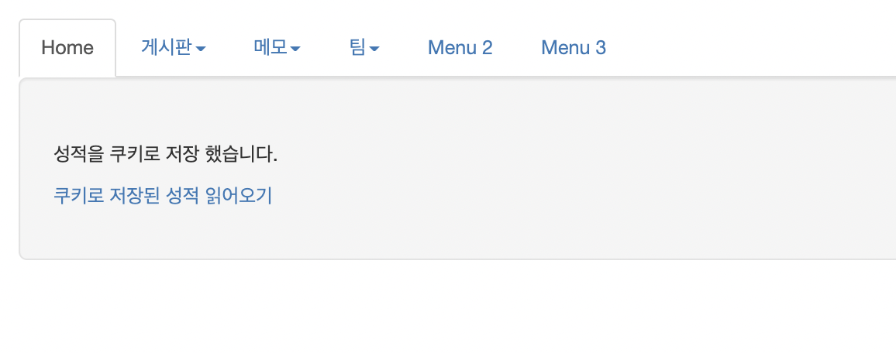

# JSP


## Session, Cookie


### Session

- 인터넷은 HTTP 프로토콜을 사용한다. 이 HTTP 프로토콜은 상태가 없는 프로토콜이라고 한다.
- 사용자 브라우저와 서버 간의 상태에 대한 보존없이 매 순간순간 새로운 연결을 하고, 요청에 대한 응답을 서버가 전송하고 나면 모든 연결이 끊어진다.
- 이렇게 연결이 끊어지면 로그인한 사람에 대한 내용도 모두 없어지고 그 사람에 의해서 담겨진 장바구니 내용도 잃어버린다.
- 상태가 없는 프로토콜을 이용하면서 상태에 대한 보존을 위해서 세션을 사용한다.
- 세션은 사용자 브라우저와 서버간의 논리적인 연결이라 할 수 있다.
- 특정한 클라이언트가 서버로 요청을 보낼때 그 클라이언트의 정보도 포함되어 전송한다. 서버는 그 클라이언트 정보를 가지고 있다가 다시 그 클라이언트로부터 또 다른 요청이 왔을때 이미 가지고 있던 정보를 비교하여 동일한 브라우저인지를 판단한다.
- 서버가 자신에 접속한 클라이언트의 정보를 갖고 있는 상태를 세션
   이라 한다.


### Cookie

- 쿠키 역시 상태가 없는 프로토콜을 위해 상태를 지족시키기 위한 방법이다.
- 쿠키는 세션과 달리 서버에 클라이언트 정보를 담아두지 않고 클라이언트 자신들에게 그 정보를 저장한다.
- javax.servlet.http.Cookie 클래스를 이용한다.
- Tomcat 서버가 접속자의 컴퓨터에 저장하는 텍스트 파일로 된 정보. 
- 4KB까지 저장할 수 있다. 


writeCookie.jsp

```jsp
<%@ page language="java" contentType="text/html; charset=UTF-8" pageEncoding="UTF-8"%>
<%
	Cookie cookie = null;

	cookie = new Cookie("name", "User1");
	cookie.setMaxAge(30); // 30초
	response.addCookie(cookie);
	
	cookie = new Cookie("kuk", "90");
	cookie.setMaxAge(30); 
	response.addCookie(cookie);
	
	cookie = new Cookie("eng", "100");
	cookie.setMaxAge(30); 
	response.addCookie(cookie);
%>
<!DOCTYPE html>
<html>
<head>
<meta charset="UTF-8">
<title>cookie 예제</title>
</head>
<body>
<jsp:include page="/menu/top.jsp"/>
<div class="container">
<div class="well well-lg">
<br>
<p>성적을 쿠키로 저장 했습니다.</p> 
<p><a href="./readCookie.jsp">쿠키로 저장된 성적 읽어오기</a></p> 
</div>
</div>
</body>
</html>
```


readCookie.jsp

```jsp
<%@ page language="java" contentType="text/html; charset=UTF-8" pageEncoding="UTF-8"%>
<% 
	//client안에 있는 모든 쿠키를 전부 읽어온다. 
	Cookie[] cookies = request.getCookies(); 
	Cookie cookie = null; 
 
	String name = null;  
	int kuk = 0; 
	int eng = 0; 
 
	for (int i = 0; i < cookies.length; i++) { 
  	//쿠키 변수를 각각 추출. 
  		cookie = cookies[i]; 
 
  		if (cookie.getName().equals("name")){ 
    		name = cookie.getValue(); 
  		}else if (cookie.getName().equals("kuk")){ 
    		kuk = Integer.parseInt(cookie.getValue()); 
  		}else if (cookie.getName().equals("eng")){ 
    		eng = Integer.parseInt(cookie.getValue()); 
  		} 
	} 
%> 
<!DOCTYPE html>
<html>
<head>
<meta charset="UTF-8">
<title>cookie 예제</title>
</head>
<body>
<jsp:include page="/menu/top.jsp"/>
<div class="container">
<div class="well well-lg">
<br>
<% 
	if (name != null){ // Cookie 변수가 있다면  
  		out.println ("성명 : " + name + "<br>"); 
  		out.println ("국어 : " + kuk + "<br>"); 
  		out.println ("영어 : " + eng + "<br>"); 
		out.println ("총점 : " + (kuk+eng) + "<br>"); 
		out.println ("평균 : " + (kuk+eng)/2 + "<br>"); 
		out.println ("30초 후 쿠키는 인식이 되지 않습니다. <br>"); 
     
	}else{ 
    	out.println("쿠키를 읽어 들일수 없습니다. <br>"); 
	} 
%> 
</div>
</div>
</body>
</html>
```


readCookie.jsp - run on server



읽어오기를 누르면 아래와 같이 쿠키 내용을 불러온다.


30초가 지나면 (새로고침 하면) 다음과 같이 쿠키를 더이상 읽을 수 없다.


> list.jsp에서
> ```jsp
> <a href="javascript:read('<%=dto.getBbsno()%>')"><%=dto.getTitle()%></a>
> ```
> -> 
>
> ```jsp
> <a href="read.jsp?bbsno=<%=dto.getBbsno()%>"><%=dto.getTitle()%></a>
> ```
> 이런식으로 할 수도 있다.


