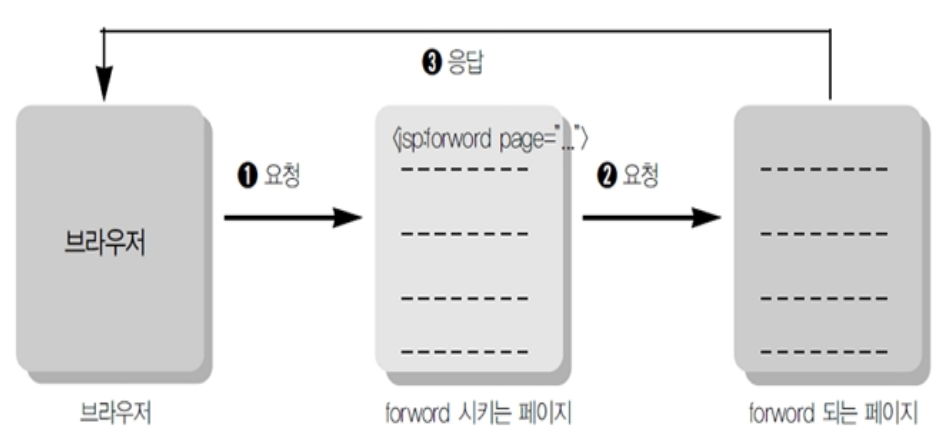

# JSP

## JSP 기초 문법

- WEB 환경에서 JAVA를 이용한 DBMS 접근을 처리 .
- Java Logic 처리를 구현
- JAVA를 기반으로하는 문법
- JSP 고유의 태그가 존재
- JSP의 출력 결과를 HTML과 CSS로 편집하여 출력


### 스크립틀릿의 이해

- 일반적인 java 코드가 쓰임 : `<% ... JAVA Code ... %>`

> sts workspace -> jsptest / ex1.jsp

```jsp
<%@ page language="java" contentType="text/html; charset=UTF-8"
    pageEncoding="UTF-8"%>
<!DOCTYPE html>
<html>
<head>
<meta charset="UTF-8">
<title>Insert title here</title>
</head>
<body>
<%
	String name = "왕눈이";
	int kuk = 90;
	int eng = 95;
	int tot = kuk + eng;
	int avg = tot / 2;
%>

<h1>성적표</h1>
<div style='font-size: 24px;'>
 -------------------------<br/>
 성명: <% out.println(name); %><br/>
 국어: <% out.println(kuk); %><br/>
 영어: <% out.println(eng); %><br/>
 총점: <%=tot %><br/> 
 평균: <%=avg %><br/>
 
<%
	System.out.println(">>>>> name: " + name);
%>
</div>
</body>
</html>
```


> ★ 지시자
>
> 페이지 설명
>
> 이 페이지가 브라우저에 응답될 때 정보 알려주는 부분
> ```jsp
<%@ page language="java" contentType="text/html; charset=UTF-8"
    pageEncoding="UTF-8"%>


### 선언문(특별한 경우만 사용, 빈즈로 대체하여 사용함으로 권장하지 않음)

- 메소드(함수) 선언: <%! ...JAVA 메소드... %>

  `int tot = tot(kuk, eng, mat);`

```jsp
<%@ page language="java" contentType="text/html; charset=UTF-8"
	pageEncoding="UTF-8"
%>
<!DOCTYPE html>
<html>
<head>
<meta charset="UTF-8">
<title>Insert title here</title>
</head>
<body>
	<%!
	public int tot(int kuk, int eng, int mat) {
		return kuk + eng + mat;
	}

	public int avg(int tot) {
		return tot / 3;
	}%>
	<%
	String name = "아로미";
	int kuk = 90;
	int eng = 85;
	int mat = 100;
	int tot = tot(kuk, eng, mat);
	int avg = avg(tot);
	%>
	<h1>성적표</h1>
	<ul style='font-size: 24px;'>
		<li>성명: <%=name%> <br>
		<li>국어: <%=kuk%> <br>
		<li>영어: <%=eng%> <br>
		<li>수학: <%=mat%> <br>
		<li>총점: <%=tot%> <br>
		<li>평균: <%=avg%> <br>
	</ul>
</body>
</html>
```


### 표현식(Expression) 

- 단순 출력 기능.
- `<% System.out.print(hap(10, 20)); %>` 콘솔에 출력 
- `<% out.print(hap(10, 20)); %>`    JSP 출력
- `<%=hap(10, 20)%>` JSP 출력, 문장 종결자(';')을 사용할 수 없고, 오로지 하나의 값만 출력


### 주석

```jsp
<% 
	//            
	/*...~~~...*/ 
%>
```

> ex3.jsp

```jsp
<%@ page language="java" contentType="text/html; charset=UTF-8"
	pageEncoding="UTF-8"
%>
<!DOCTYPE html>
<html>
<head>
<meta charset="UTF-8">
<title>JSP 스크립트 Example</title>
</head>
<body>
	<h1>Script Example1</h1>
<%!String declaration = "Declaration";%>
<%!public String decMethod() {
		return declaration;
	}
%>
<%
	String scriptlet = "Scriptlet";
	String comment = "Comment";

	out.println("내장객체를 이용한 출력 : " + declaration + "<p/>");
%>

선언문의 출력:
<%=declaration  %><p/>
선언문의 출력2:
<%= decMethod() %><p/>
스크립트릿의 출력:
<%=scriptlet%><p />
<!--JSP주석부분-->
<!-- JSP 주석1 :  <%=comment%> -->
<p />
<%-- JSP 주석2 : <%=comment%> --%>
<%
/* 주석 
  (여러줄 주석)
   */
%>
<%
// 주석(한줄 주석)
%>
</body>
</html>
```


### [실습] 이미지 목록을 배열에 저장한 후 출력하는 스크립트를 작성

for문을 이용할 것.

다운받은 tulip 압축파일을 tulip폴더에 압축을 풀어 WebContent로 저장후 실행 (jsptest/src/main/webapp 에 넣음 + refresh)

> ex4.jsp

```jsp
<%@ page language="java" contentType="text/html; charset=UTF-8"
	pageEncoding="UTF-8"
%>
<!DOCTYPE html>
<html>
<head>
<meta charset="UTF-8">
<title>Insert title here</title>
</head>
<body>
<%
	String root = request.getContextPath();
	// 이미지 목록을 배열에 저장
	String[] images = { "tu01.jpg", "tu02.jpg", "tu03.jpg", "tu04.jpg", "tu05.jpg", "tu06.jpg", 
			"tu07.jpg", "tu08.jpg", "tu09.jpg", "tu10.jpg" };

	out.println("<h1>튜울립 축제</h1><br>");

	for (int i = 0; i < images.length; i++) {
		out.println("<a href='" + root + "/tulip/" + images[i] + "'>");
		out.println("");
		out.println("</a>");
	}
%>
</body>
</html>
```


## JSP 지시자(Directive), 액션태그


### JSP 지시자(Directive)

- 지시자는 클라이언트의 요청에 JSP 페이지가 실행이 될 때 필요한 정보를 JSP 컨테이너에게 알리는 역할한다.
- 지시자는 태그 안에서 @으로 시작하며, 3가지 종류가 있다.
  page, include, taglib

(1) page 지시자

- jsp페이지에서 지원되는 속성들을 정의하는 것들이다.
- jsp페이지에서 JSP컨테이너에게 해당 페이지를 어떻게 처리할 것인가에 대한 페이지 정보를 알려준다.

■ info : 페이지설명, jsp 페이지 제목을 붙이는 것과 같다.
■ language : Jsp페이지의 스크립트 언어지정 기본값은 Java
■ contentType: jsp의 출력 형식 지정, 문자 셋을 지정한다. 

- 형식: `contentType="text/html; charset=UTF-8"`

  `<%@ page contentType="text/html; charset=UTF-8" %>`

- JSP처리 결과가 HTML임으로 MIME Type을 'text/html'과 문자 코드(UTF-8) 선언.
  
- MIME Type: 브러우저가 출력하는 데이터의 종류를 나타낸 코드값, 
  
    예) image/jpg는 이미지가 출력됨 
    
- HTML 태그의 META태그도 일치시켜야함(브러우저용). 

```html
<meta http-equiv="Content-Type" content="text/html; charset=UTF-8"> 
<meta http-equiv="Content-Type" content="text/html; charset=EUC-KR"> 
```

■ import: 패키지의 import, 중복 사용가능 
자바에서 패키지를 사용하겠다고 선언하는 것과 같다

예) `<%@ page import="java.util.*" %>`

> import.jsp

```jsp
<%@ page language="java" contentType="text/html; charset=UTF-8"
	pageEncoding="UTF-8"
%>
<%@ page import="java.util.Date"%>
<!DOCTYPE html>
<html>
<head>
<meta charset="UTF-8">
<title>Insert title here</title>
</head>
<body>
	<div style='font-size: 36px; color: #FFFFFF; background-color: #FF3399;'>
	<%
		Date date = new Date(); // Date cannot be resolved to a type 
		out.println(date.toLocaleString());
	%>
	</div>
</body>
</html>
```

> comma.jsp

```jsp
<%@ page language="java" contentType="text/html; charset=UTF-8"
	pageEncoding="UTF-8"
%>
<%@ page import="java.text.DecimalFormat"%>
<!DOCTYPE html>
<html>
<head>
<meta charset="UTF-8">
<title>Insert title here</title>
</head>
<body>
	<%!public String comma(long val) {
		DecimalFormat df = new DecimalFormat("￦ ###,###,### 원");
		String str = df.format(val);

		return str;
	}
	%>
	<h1>6월 급여 명세서</h1>
	<div style='font-size: 24px; color: #FFFFFF; background-color: #000055'>
		본봉: <%=comma(1800000)%><br> 
		수당: <%=comma(200000)%><br> 
		세금: <SPAN style='color: #FF0000'><%=comma(100000)%></SPAN><br>
		실수령액: <%=comma(1900000)%><br> <br> <span style='color: #00FF00'>수고하셨습니다.</span>
	</div>
</body>
</html>
```


■ pageEncoding: jsp1.2에 추가된 규약으로 jsp페이지의 문자셋 형식을 지정

`<%@ page pageEncoding="UTF-8" contentType="text/html" %>` 


(2) include 지시자

- 여러 jsp페이지에서 공통적으로 포함하는 내용이 있을 때 이러한 내용을 매번 입력하지 않고 파일에 저장한 후 JSP파일에 포함해서 실행한다.

- 처리 결과가 합쳐지는 것이 아니라 파일의 소스가 하나의 파일에 합쳐진 다음 실행된다. 

  list.jsp 소스 + ssi.jsp 소스 = jsp 통합 큰 소스 ==> 실행 


- 사용 방법

```jsp
<%@ include file="Local URL" %> 
 
<%@ include file="./ssi.jsp" %> 
```


> top.jsp

```jsp
<%@ page language="java" contentType="text/html; charset=UTF-8"
	pageEncoding="UTF-8"%>
<!DOCTYPE html>
<html>
<head>
<meta charset="UTF-8">
<title>Insert title here</title>
</head>
<body>
<body>
	include 지시자의 Top 부분입니다.
	<hr />
</body>
</html>
```

> bottom.jsp

```jsp
<%@ page language="java" contentType="text/html; charset=UTF-8"
	pageEncoding="UTF-8"
%>
<%@page import="java.util.*"%>
<!DOCTYPE html>
<html>
<head>
<meta charset="UTF-8">
<title>Insert title here</title>
</head>
<body>
	<%
	Date date = new Date();
	%>
	<hr />
	include 지시자의 Bottom 부분입니다.
	<p />
	<%=date.toLocaleString()%>
</body>
</html>
```

> directive.jsp

```jsp
<%@ page language="java" contentType="text/html; charset=UTF-8"
	pageEncoding="UTF-8"
%>
<!DOCTYPE html>
<html>
<head>
<meta charset="UTF-8">
<title>Directive Example4</title>
</head>
<body>
	<h1>Directive Example4</h1>
	<%@include file="top.jsp"%>
	include지시자의 Body 부분입니다.
	<%@include file="bottom.jsp"%>
</body>
</html>
```


### 액션태그

- JSP 문법이다.
- 액션태그의 종류는 include, forward, useBean, setProperty, getProperty 등이 있다.

■ useBean, setProperty, getProperty

- 자바빈즈(JavaBeans)와 통신을 위해서 구현한 액션태그이다.


■ forward

- 다른페이지로 이동할 때 사용하는 태그이다.




- forward 액션 태그 예제

> ★ 아래 코드를 삽입해야 웹 페이지에서 한글 깨지지 않음
>
> ```
> <%
> 	request.setCharacterEncoding("UTF-8");
> %>
> ```
>
> 


> forwardTag1.html

```html
<html>
<head>
<meta http-equiv="Content-Type" content="text/html; charset=UTF-8" />
</head>
<body>
	<h1>Forward Tag Example1</h1>
	<form method=post action="forwardTag1_1.jsp">
		아이디 : <input name="id"> <p />
		패스워드 : <input type="password" name="pwd"> <p />
		<input type="submit" value="보내기">
	</form>
</body>
</html>
```

> forwardTag1_1.jsp

```jsp
<%@ page language="java" contentType="text/html; charset=UTF-8"
	pageEncoding="UTF-8"%>
<%
	request.setCharacterEncoding("UTF-8");
%>
<!DOCTYPE html>
<html>
<head>
<meta charset="UTF-8">
<title>Insert title here</title>
</head>
<body>
	<h1>Forward Tag Example1</h1>
	Forward Tag의 포워딩 되기 전의 페이지입니다.
	<jsp:forward page="forwardTag1_2.jsp" />
</body>
</html>
```

>forwardTag1_2.jsp

```jsp
<%@ page language="java" contentType="text/html; charset=UTF-8"
	pageEncoding="UTF-8"
%>
<%
	String id = request.getParameter("id");
	String pwd = request.getParameter("pwd");
%>
<!DOCTYPE html>
<html>
<head>
<meta charset="UTF-8">
<title>Insert title here</title>
</head>
<body>
	<h1>Forward Tag Example1</h1>
	당신의 아이디는 <b><%=id%></b>이고
	<p />
	패스워드는 <b><%=pwd%></b> 입니다.
</body>
</html>
```


