# JSP

## 목차

---

[JSP 기초문법](#jsp-기초-문법)

[JSP 지시자(Directive), 액션태그](#jsp-지시자(directive),-액션태그)

[Include 액션태그](#include-액션태그)

[Menu 페이지 제작](#menu-페이지-제작)

[JSP Template 변경](#jsp-template-변경)

[JSP 내부 객체](#jsp-내부-객체)

[서블릿 기초 문법](서블릿-기초-문법)


---


## JSP 기초 문법

- WEB 환경에서 JAVA를 이용한 DBMS 접근을 처리 .
- Java Logic 처리를 구현
- JAVA를 기반으로하는 문법
- JSP 고유의 태그가 존재
- JSP의 출력 결과를 HTML과 CSS로 편집하여 출력


### 스크립틀릿의 이해

- 일반적인 java 코드가 쓰임 : `<% ... JAVA Code ... %>`

> sts workspace -> jsptest / ex1.jsp

```jsp
<%@ page language="java" contentType="text/html; charset=UTF-8"
    pageEncoding="UTF-8"%>
<!DOCTYPE html>
<html>
<head>
<meta charset="UTF-8">
<title>Insert title here</title>
</head>
<body>
<%
	String name = "왕눈이";
	int kuk = 90;
	int eng = 95;
	int tot = kuk + eng;
	int avg = tot / 2;
%>

<h1>성적표</h1>
<div style='font-size: 24px;'>
 -------------------------<br/>
 성명: <% out.println(name); %><br/>
 국어: <% out.println(kuk); %><br/>
 영어: <% out.println(eng); %><br/>
 총점: <%=tot %><br/> 
 평균: <%=avg %><br/>
 
<%
	System.out.println(">>>>> name: " + name);
%>
</div>
</body>
</html>
```


> ★ 지시자
>
> 페이지 설명
>
> 이 페이지가 브라우저에 응답될 때 정보 알려주는 부분
> ```jsp
<%@ page language="java" contentType="text/html; charset=UTF-8"
    pageEncoding="UTF-8"%>


### 선언문(특별한 경우만 사용, 빈즈로 대체하여 사용함으로 권장하지 않음)

- 메소드(함수) 선언: <%! ...JAVA 메소드... %>

  `int tot = tot(kuk, eng, mat);`

```jsp
<%@ page language="java" contentType="text/html; charset=UTF-8"
	pageEncoding="UTF-8"
%>
<!DOCTYPE html>
<html>
<head>
<meta charset="UTF-8">
<title>Insert title here</title>
</head>
<body>
	<%!
	public int tot(int kuk, int eng, int mat) {
		return kuk + eng + mat;
	}

	public int avg(int tot) {
		return tot / 3;
	}%>
	<%
	String name = "아로미";
	int kuk = 90;
	int eng = 85;
	int mat = 100;
	int tot = tot(kuk, eng, mat);
	int avg = avg(tot);
	%>
	<h1>성적표</h1>
	<ul style='font-size: 24px;'>
		<li>성명: <%=name%> <br>
		<li>국어: <%=kuk%> <br>
		<li>영어: <%=eng%> <br>
		<li>수학: <%=mat%> <br>
		<li>총점: <%=tot%> <br>
		<li>평균: <%=avg%> <br>
	</ul>
</body>
</html>
```


### 표현식(Expression) 

- 단순 출력 기능.
- `<% System.out.print(hap(10, 20)); %>` 콘솔에 출력 
- `<% out.print(hap(10, 20)); %>`    JSP 출력
- `<%=hap(10, 20)%>` JSP 출력, 문장 종결자(';')을 사용할 수 없고, 오로지 하나의 값만 출력


### 주석

```jsp
<% 
	//            
	/*...~~~...*/ 
%>
```

> ex3.jsp

```jsp
<%@ page language="java" contentType="text/html; charset=UTF-8"
	pageEncoding="UTF-8"
%>
<!DOCTYPE html>
<html>
<head>
<meta charset="UTF-8">
<title>JSP 스크립트 Example</title>
</head>
<body>
	<h1>Script Example1</h1>
<%!String declaration = "Declaration";%>
<%!public String decMethod() {
		return declaration;
	}
%>
<%
	String scriptlet = "Scriptlet";
	String comment = "Comment";

	out.println("내장객체를 이용한 출력 : " + declaration + "<p/>");
%>

선언문의 출력:
<%=declaration  %><p/>
선언문의 출력2:
<%= decMethod() %><p/>
스크립트릿의 출력:
<%=scriptlet%><p />
<!--JSP주석부분-->
<!-- JSP 주석1 :  <%=comment%> -->
<p />
<%-- JSP 주석2 : <%=comment%> --%>
<%
/* 주석 
  (여러줄 주석)
   */
%>
<%
// 주석(한줄 주석)
%>
</body>
</html>
```


### [실습] 이미지 목록을 배열에 저장한 후 출력하는 스크립트를 작성

- for문을 이용할 것.

- 다운받은 tulip 압축파일을 tulip폴더에 압축을 풀어 WebContent로 저장후 실행 (jsptest/src/main/webapp 에 넣음 + refresh)

> ex4.jsp

```jsp
<%@ page language="java" contentType="text/html; charset=UTF-8"
	pageEncoding="UTF-8"
%>
<!DOCTYPE html>
<html>
<head>
<meta charset="UTF-8">
<title>Insert title here</title>
</head>
<body>
<%
	String root = request.getContextPath();
	// 이미지 목록을 배열에 저장
	String[] images = { "tu01.jpg", "tu02.jpg", "tu03.jpg", "tu04.jpg", "tu05.jpg", "tu06.jpg", 
			"tu07.jpg", "tu08.jpg", "tu09.jpg", "tu10.jpg" };

	out.println("<h1>튜울립 축제</h1><br>");

	for (int i = 0; i < images.length; i++) {
		out.println("<a href='" + root + "/tulip/" + images[i] + "'>");
		out.println("");
		out.println("</a>");
	}
%>
</body>
</html>
```

-- Output


## JSP 지시자(Directive), 액션태그


### JSP 지시자(Directive)

- 지시자는 클라이언트의 요청에 JSP 페이지가 실행이 될 때 필요한 정보를 JSP 컨테이너에게 알리는 역할한다.
- 지시자는 태그 안에서 @으로 시작하며, 3가지 종류가 있다.
  page, include, taglib

(1) page 지시자

- jsp페이지에서 지원되는 속성들을 정의하는 것들이다.
- jsp페이지에서 JSP컨테이너에게 해당 페이지를 어떻게 처리할 것인가에 대한 페이지 정보를 알려준다.

■ info : 페이지설명, jsp 페이지 제목을 붙이는 것과 같다.
■ language : Jsp페이지의 스크립트 언어지정 기본값은 Java
■ contentType: jsp의 출력 형식 지정, 문자 셋을 지정한다. 

- 형식: `contentType="text/html; charset=UTF-8"`

  `<%@ page contentType="text/html; charset=UTF-8" %>`

- JSP처리 결과가 HTML임으로 MIME Type을 'text/html'과 문자 코드(UTF-8) 선언.
  
- MIME Type: 브러우저가 출력하는 데이터의 종류를 나타낸 코드값, 
  
    예) image/jpg는 이미지가 출력됨 
    
- HTML 태그의 META태그도 일치시켜야함(브러우저용). 

```html
<meta http-equiv="Content-Type" content="text/html; charset=UTF-8"> 
<meta http-equiv="Content-Type" content="text/html; charset=EUC-KR"> 
```

■ import: 패키지의 import, 중복 사용가능 
자바에서 패키지를 사용하겠다고 선언하는 것과 같다

예) `<%@ page import="java.util.*" %>`

> import.jsp

```jsp
<%@ page language="java" contentType="text/html; charset=UTF-8"
	pageEncoding="UTF-8"
%>
<%@ page import="java.util.Date"%>
<!DOCTYPE html>
<html>
<head>
<meta charset="UTF-8">
<title>Insert title here</title>
</head>
<body>
	<div style='font-size: 36px; color: #FFFFFF; background-color: #FF3399;'>
	<%
		Date date = new Date(); // Date cannot be resolved to a type 
		out.println(date.toLocaleString());
	%>
	</div>
</body>
</html>
```

> comma.jsp

```jsp
<%@ page language="java" contentType="text/html; charset=UTF-8"
	pageEncoding="UTF-8"
%>
<%@ page import="java.text.DecimalFormat"%>
<!DOCTYPE html>
<html>
<head>
<meta charset="UTF-8">
<title>Insert title here</title>
</head>
<body>
	<%!public String comma(long val) {
		DecimalFormat df = new DecimalFormat("￦ ###,###,### 원");
		String str = df.format(val);

		return str;
	}
	%>
	<h1>6월 급여 명세서</h1>
	<div style='font-size: 24px; color: #FFFFFF; background-color: #000055'>
		본봉: <%=comma(1800000)%><br> 
		수당: <%=comma(200000)%><br> 
		세금: <SPAN style='color: #FF0000'><%=comma(100000)%></SPAN><br>
		실수령액: <%=comma(1900000)%><br> <br> <span style='color: #00FF00'>수고하셨습니다.</span>
	</div>
</body>
</html>
```


■ pageEncoding: jsp1.2에 추가된 규약으로 jsp페이지의 문자셋 형식을 지정

`<%@ page pageEncoding="UTF-8" contentType="text/html" %>` 


(2) include 지시자

- 여러 jsp페이지에서 공통적으로 포함하는 내용이 있을 때 이러한 내용을 매번 입력하지 않고 파일에 저장한 후 JSP파일에 포함해서 실행한다.

- 처리 결과가 합쳐지는 것이 아니라 파일의 소스가 하나의 파일에 합쳐진 다음 실행된다. 

  list.jsp 소스 + ssi.jsp 소스 = jsp 통합 큰 소스 ==> 실행 


- 사용 방법

```jsp
<%@ include file="Local URL" %> 
 
<%@ include file="./ssi.jsp" %> 
```


> top.jsp

```jsp
<%@ page language="java" contentType="text/html; charset=UTF-8"
	pageEncoding="UTF-8"%>
<!DOCTYPE html>
<html>
<head>
<meta charset="UTF-8">
<title>Insert title here</title>
</head>
<body>
<body>
	include 지시자의 Top 부분입니다.
	<hr />
</body>
</html>
```

> bottom.jsp

```jsp
<%@ page language="java" contentType="text/html; charset=UTF-8"
	pageEncoding="UTF-8"
%>
<%@page import="java.util.*"%>
<!DOCTYPE html>
<html>
<head>
<meta charset="UTF-8">
<title>Insert title here</title>
</head>
<body>
	<%
	Date date = new Date();
	%>
	<hr />
	include 지시자의 Bottom 부분입니다.
	<p />
	<%=date.toLocaleString()%>
</body>
</html>
```

> directive.jsp

```jsp
<%@ page language="java" contentType="text/html; charset=UTF-8"
	pageEncoding="UTF-8"
%>
<!DOCTYPE html>
<html>
<head>
<meta charset="UTF-8">
<title>Directive Example4</title>
</head>
<body>
	<h1>Directive Example4</h1>
	<%@include file="top.jsp"%>
	include지시자의 Body 부분입니다.
	<%@include file="bottom.jsp"%>
</body>
</html>
```


### 액션태그

- JSP 문법이다.
- 액션태그의 종류는 include, forward, useBean, setProperty, getProperty 등이 있다.


■ useBean, setProperty, getProperty

- 자바빈즈(JavaBeans)와 통신을 위해서 구현한 액션태그이다.


■ forward

- 다른페이지로 이동할 때 사용하는 태그.


- forward 액션 태그 예제

> ★ 아래 코드를 삽입해야 웹 페이지에서 한글 깨지지 않음
>
> ```
> <%
> 	request.setCharacterEncoding("UTF-8");
> %>
> ```
>
> 

-- forward 액션 태그 예제 (파일 3개)

> forwardTag1.html

```html
<html>
<head>
<meta http-equiv="Content-Type" content="text/html; charset=UTF-8" />
</head>
<body>
	<h1>Forward Tag Example1</h1>
	<form method=post action="forwardTag1_1.jsp">
		아이디 : <input name="id"> <p />
		패스워드 : <input type="password" name="pwd"> <p />
		<input type="submit" value="보내기">
	</form>
</body>
</html>
```

> forwardTag1_1.jsp

```jsp
<%@ page language="java" contentType="text/html; charset=UTF-8"
	pageEncoding="UTF-8"%>
<%
	request.setCharacterEncoding("UTF-8");
%>
<!DOCTYPE html>
<html>
<head>
<meta charset="UTF-8">
<title>Insert title here</title>
</head>
<body>
	<h1>Forward Tag Example1</h1>
	Forward Tag의 포워딩 되기 전의 페이지입니다.
	<jsp:forward page="forwardTag1_2.jsp" />
</body>
</html>
```

>forwardTag1_2.jsp

```jsp
<%@ page language="java" contentType="text/html; charset=UTF-8"
	pageEncoding="UTF-8"
%>
<%
	String id = request.getParameter("id");
	String pwd = request.getParameter("pwd");
%>
<!DOCTYPE html>
<html>
<head>
<meta charset="UTF-8">
<title>Insert title here</title>
</head>
<body>
	<h1>Forward Tag Example1</h1>
	당신의 아이디는 <b><%=id%></b>이고
	<p />
	패스워드는 <b><%=pwd%></b> 입니다.
</body>
</html>
```


\- `<jsp:param/>` forward되는 페이지에서 값을 전달 받을 수 있다. (3파일) 
다운로드 받아서 webapp에 넣음.

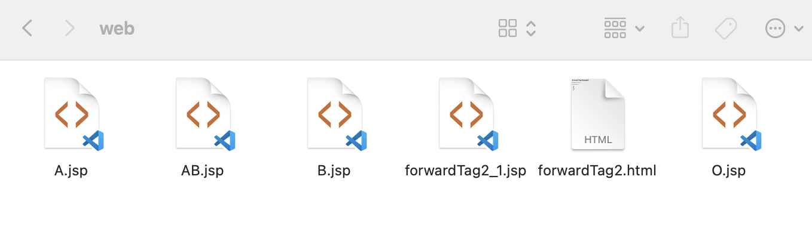

파일명

```
A.jsp, AB.jsp, B.jsp, forwardTag2_1.jsp, forwardTag2.html, O.jsp
```

실행

```
http://localhost:8000/jsptest/forwardTag2.html
```


## Include 액션태그

Include 액션태그, Menu페이지 제작, JSP Template 생성

- `<%@ include file="./ssi.jsp" %>`

  ssi.jsp의 JSP 소스가 그대로 복사되어 원본 파일에 추가됨.   

- `<jsp:include page="/menu/top.jsp" flush="false"/>`

  top.jsp가 처리가 되고 나서 HTML로 변경된 결과가 포함.

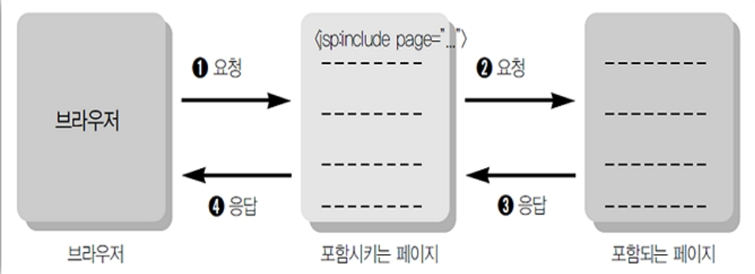

- include 액션태그는 include 지시자 처럼 다른페이지를 현재 페이지에 포함시킬 수 있는 기능을 가진다.
- include 액션태그는 include 지시자와 다르게 포함시킬 페이지의 처리결과를 포함한다.
- include 액션태그의 flush 속성은 포함될 페이지로 이동할 때 현재 페이지가 지금까지 출력버퍼에 저장한 결과를 어떻게 처리할 것인가를 결정한다.
- flush = 'true' 이면 포함할 페이지의 내용을 삽입하기 이전에 현재 페이지가 지금까지 버퍼에 저장한 내용을 출력한다.

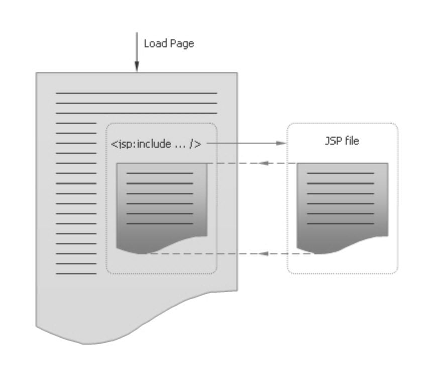


## Menu 페이지 제작

- menu는 jsp:include Action 태그를 사용해야 페이지 간 간섭을 피할 수 있다. 

- include 지시자를 사용하면 같은 변수가 2번이상 선언될 경우 소스 충돌로 에러 발생.

- menu Layout

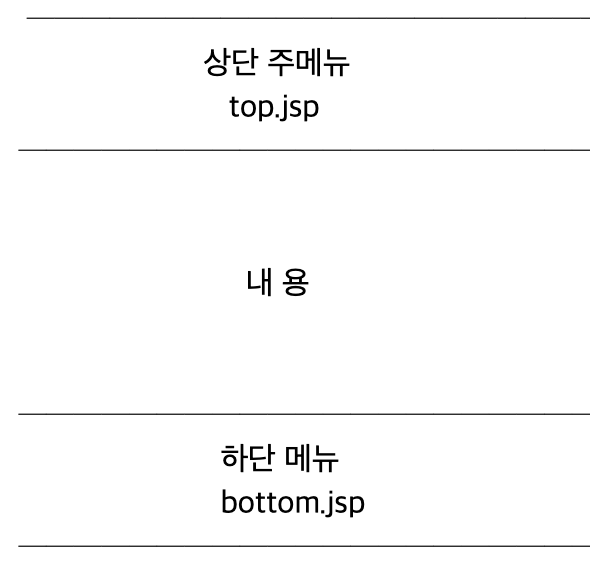


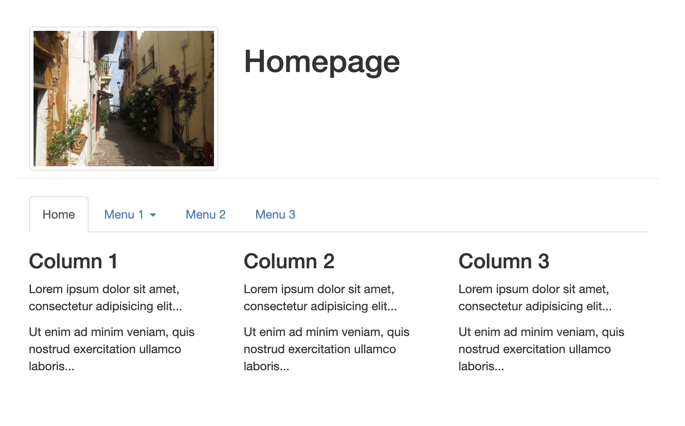

> 실행
>
> ```
> http://localhost:8000/jsptest/menu/index.html
> ```
>
> 


### 페이지를 분할하지 않은 통합 소스 

> menu/index.html

```html
<!DOCTYPE html>
<html lang="en">
<head>
<title>Bootstrap Example</title>
<meta charset="utf-8">
<meta name="viewport" content="width=device-width, initial-scale=1">
<link rel="stylesheet" href="https://maxcdn.bootstrapcdn.com/bootstrap/3.4.0/css/bootstrap.min.css">
<script src="https://ajax.googleapis.com/ajax/libs/jquery/3.3.1/jquery.min.js"></script>
<script src="https://maxcdn.bootstrapcdn.com/bootstrap/3.4.0/js/bootstrap.min.js"></script>
</head>
<body>
	<!--상단메뉴-->
	<div class="container">
		<div class="page-header row">
			<div class="col-sm-4">
				
			</div>
			<div class="col-sm-8">
				<h1>Homepage</h1>
			</div>
		</div>
		<ul class="nav nav-tabs">
			<li class="active"><a href="#">Home</a></li>
			<li class="dropdown"><a class="dropdown-toggle" data-toggle="dropdown" href="#">Menu 1 <span class="caret"></span></a>
				<ul class="dropdown-menu">
					<li><a href="#">Submenu 1-1</a></li>
					<li><a href="#">Submenu 1-2</a></li>
					<li><a href="#">Submenu 1-3</a></li>
				</ul></li>
			<li><a href="#">Menu 2</a></li>
			<li><a href="#">Menu 3</a></li>
		</ul>
	</div>
	<!--내용-->
	<div class="container">
		<div class="row">
			<div class="col-sm-4">
				<h3>Column 1</h3>
				<p>Lorem ipsum dolor sit amet, consectetur adipisicing elit...</p>
				<p>Ut enim ad minim veniam, quis nostrud exercitation ullamco laboris...</p>
			</div>
			<div class="col-sm-4">
				<h3>Column 2</h3>
				<p>Lorem ipsum dolor sit amet, consectetur adipisicing elit...</p>
				<p>Ut enim ad minim veniam, quis nostrud exercitation ullamco laboris...</p>
			</div>
			<div class="col-sm-4">
				<h3>Column 3</h3>
				<p>Lorem ipsum dolor sit amet, consectetur adipisicing elit...</p>
				<p>Ut enim ad minim veniam, quis nostrud exercitation ullamco laboris...</p>
			</div>
		</div>
	</div>
</body>
</html>
```


### 상단 메뉴의 구성

> menu/top.jsp

```jsp
<%@ page contentType="text/html; charset=UTF-8"%>
<%
String root = request.getContextPath();
%>
<!DOCTYPE html>
<html>
<head>
<title>Bootstrap Example</title>
<meta charset="utf-8">
<meta name="viewport" content="width=device-width, initial-scale=1">
<link rel="stylesheet" href="https://maxcdn.bootstrapcdn.com/bootstrap/3.4.0/css/bootstrap.min.css">
<script src="https://ajax.googleapis.com/ajax/libs/jquery/3.3.1/jquery.min.js"></script>
<script src="https://maxcdn.bootstrapcdn.com/bootstrap/3.4.0/js/bootstrap.min.js"></script>
</head>
<body>
	<div class="container">
		<div class="page-header row">
			<div class="col-sm-4">
				/images/img_chania.jpg" class="img-responsive img-thumbnail" alt="Cinque Terre">
			</div>
			<div class="col-sm-8">
				<h1>Homepage</h1>
			</div>
		</div>
		<ul class="nav nav-tabs">
			<li class="active"><a href="<%=root%>/index.jsp">Home</a></li>
			<li class="dropdown"><a class="dropdown-toggle" data-toggle="dropdown" href="#">게시판<span class="caret"></span></a>
				<ul class="dropdown-menu">
					<li><a href="<%=root%>/bbs/createForm.jsp">생성</a></li>
					<li><a href="<%=root%>/bbs/list.jsp">목록</a></li>
				</ul></li>
			<li class="dropdown"><a class="dropdown-toggle" data-toggle="dropdown" href="#">메모<span class="caret"></span></a>
				<ul class="dropdown-menu">
					<li><a href="">생성</a></li>
					<li><a href="">목록</a></li>
				</ul></li>
			<li class="dropdown"><a class="dropdown-toggle" data-toggle="dropdown" href="#">팀<span class="caret"></span></a>
				<ul class="dropdown-menu">
					<li><a href="">생성</a></li>
					<li><a href="">목록</a></li>
				</ul></li>
			<li><a href="#">Menu 2</a></li>
			<li><a href="#">Menu 3</a></li>
		</ul>
	</div>
</body>
</html>
```


(하단 메뉴 구성 - menu/bottom.jsp (그냥 생략함))


###  /webapp/index.jsp 사용예

webapp/index.jsp

```jsp
<%@ page language="java" contentType="text/html; charset=UTF-8" pageEncoding="UTF-8"%>
<!DOCTYPE html>
<html>
<head>
<meta charset="UTF-8">
<title>Insert title here</title>
</head>
<body>
	<jsp:include page="/menu/top.jsp" />
	<div class="container">
		<div class="row">
			<div class="col-sm-4">
				<h3>Column 1</h3>
				<p>Lorem ipsum dolor sit amet, consectetur adipisicing elit...</p>
				<p>Ut enim ad minim veniam, quis nostrud exercitation ullamco laboris...</p>
			</div>
			<div class="col-sm-4">
				<h3>Column 2</h3>
				<p>Lorem ipsum dolor sit amet, consectetur adipisicing elit...</p>
				<p>Ut enim ad minim veniam, quis nostrud exercitation ullamco laboris...</p>
			</div>
			<div class="col-sm-4">
				<h3>Column 3</h3>
				<p>Lorem ipsum dolor sit amet, consectetur adipisicing elit...</p>
				<p>Ut enim ad minim veniam, quis nostrud exercitation ullamco laboris...</p>
			</div>
		</div>
	</div>
</body>
</html>
```


## JSP Template 변경

- 템플릿 설정하기

[Preferences --> Web --> JSP Files --> Editor --> Templates] 
Name  : JSP_HTML5 
Context : New JSP 
Description: 새로운 HTML5 기반 JSP 생성시 기초 소스 

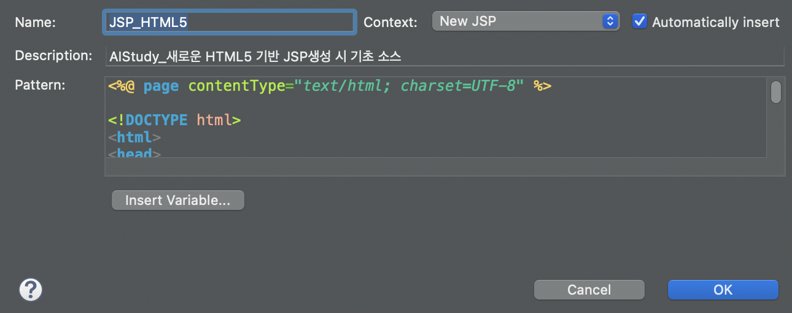

> pattern 부분 Code 삽입
>
> 앞으로 파일을 JSP_HTML5 적용해서 생성하면 기본 코드로 아래 코드
>
> ```jsp
> <%@ page contentType="text/html; charset=UTF-8" %> 
>  
> <!DOCTYPE html> 
> <html> 
> <head>
>   <title>homepage</title>
>   <meta charset="utf-8">
> </head>
> <body> 
> <jsp:include page="/menu/top.jsp"/>
> <div class="container">
> <h1 class="col-sm-offset-2 col-sm-10">제목</h1>
> <form class="form-horizontal" 
>       action="Proc.jsp"
>       method="post">
> 
>   <div class="form-group">
>     <label class="control-label col-sm-2" for="title">제목</label>
>     <div class="col-sm-6">
>       <input type="text" name="title" id="title" class="form-control">
>     </div>
>   </div>
>   
>   <div class="form-group">
>     <label class="control-label col-sm-2" for="content">내용</label>
>     <div class="col-sm-6">
>     <textarea rows="5" cols="5" id="content" name="content" class="form-control"></textarea>
>     </div>
>   </div>
> 
>    <div class="form-group">
>    <div class="col-sm-offset-2 col-sm-5">
>     <button class="btn">등록</button>
>     <button type="reset" class="btn">취소</button>
>    </div>
>  </div>
> </form>
> </div>
> </body> 
> </html> 
> ```
>
> 


- 템플릿 적용하기

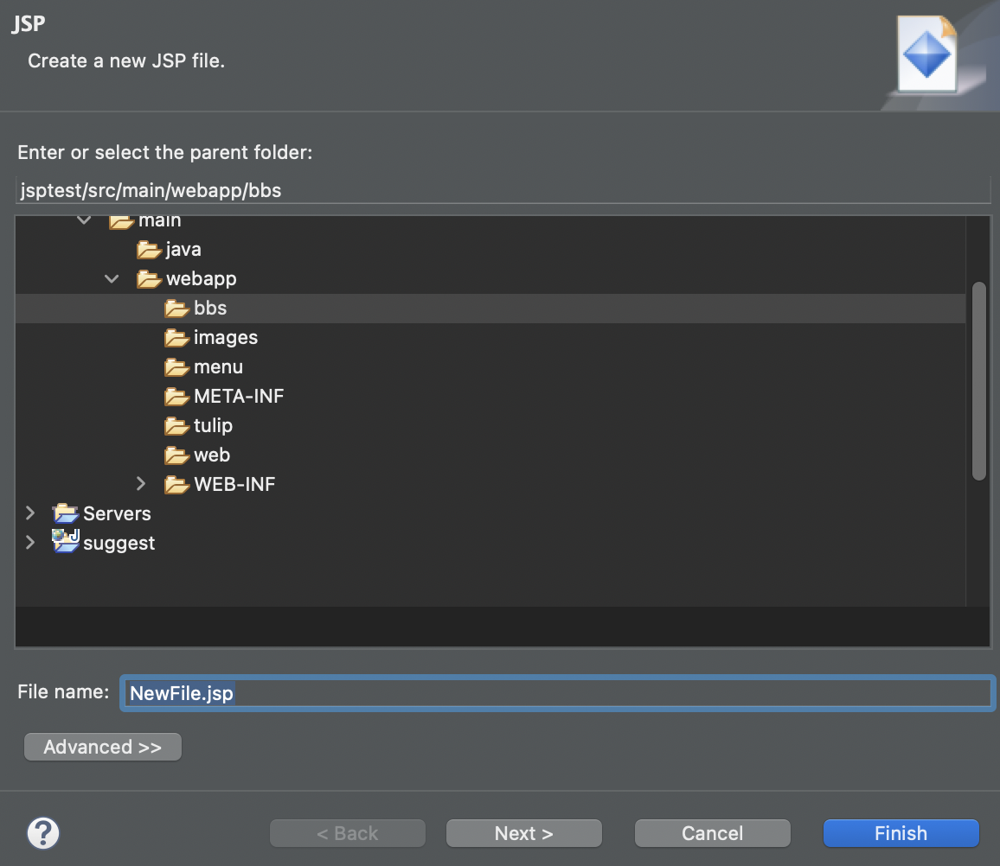


> ❗️sts에서 자바 문법 공부한 jsp 파일들은 모두
>
> core_jsp folder로 이동 (+menu, index.jsp 예제 이후 파일들도)
>
> (Menu페이지 제작 부분 까지의 파일들.)
>
> webapp에는 파일은 index.jsp만 남게 둠.
>


## JSP 내부 객체

- JSP 페이지의 내장 객체

(단발성)

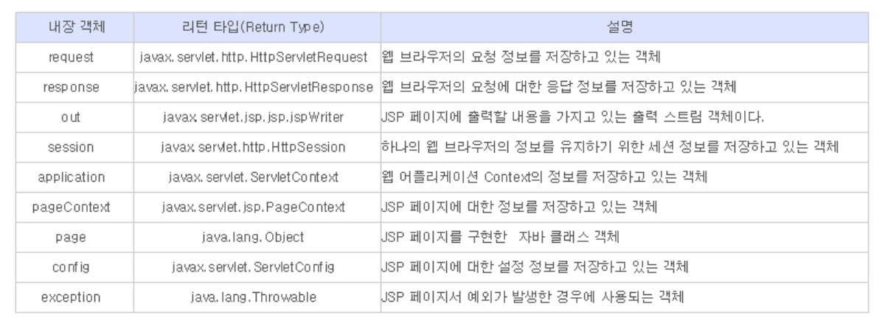

- 내장 객체의 속성(attribute)과 관련된 메소드

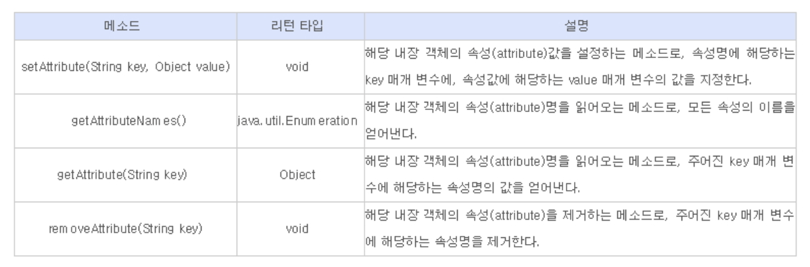


### JSP 내부객체의 이해

- 개발자가 객체를 생성하지 않아도 jsp페이지가 서블릿 컨테이너(Tomcat)로  로딩되면 Tomcat등 서버가 자동으로 생성하는 객체이다.
-  개발자는 반복적인 작업을 줄이고 필요한 작업만 할수 있다. 
- jsp페이지는 Web서버 및 Servlet Container라고 하는 복잡한 환경에서 실행이 되기 때문에, 실행중에 여러가지 상태정보를 가지고 있어야 하는데, 이런 경우에 사용되는 객체들이 내부 객체들이다. 
- 내부 객체로 인해 개발자는 좀더 쉽게 JSP 프로그래밍이 가능함. 

**(1) request, response, out**

- 클라이언트로 부터 jsp 페이지의 호출에 의해서 전달되는 데이터 요청과 응답, 출력의 역할을 한다.

■ request 내부 객체 

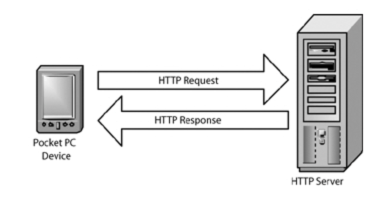

- javax.servlet.http.HttpServletRequest Interface를 Tomcat등 서버가 구현한 객체, 자동화된 객체, 개발자는 사용만함. 
- `<FORM>`에서 입력되어 브러우저가 전송한 데이터를 Tomcat 서버의 JSP에서  처리할수 있도록 객체로 가져오는 역할을 한다 
- ? : 파라메터를 보낸다는 뜻
- &: 접속자가 보내는 값이 2개 이상인 경우  


[실행결과]

```
http://localhost:8000/jsptest/request.jsp?pay=3000000&name=홍길동&java=100&jsp=90&spring=90
```


```
1. http://localhost:8000/jsptest/request.jsp
2. /jsptest/request.jsp
3. 사용자로부터 입력을 받을 경우
급여: 3000000
4. 사용자로부터 입력값이 여러개인 경우
급여: 3000000
성명: 홍길동
JAVA: 100
JSP: 90
Spring: 90
총점: 280
평균: 93
```

> request.jsp

```jsp
<%@ page language="java" contentType="text/html; charset=UTF-8"
    pageEncoding="UTF-8"%>
<!DOCTYPE html>
<html>
<head>
<meta charset="UTF-8">
<title>Insert title here</title>
</head>
<body>
<div style="font-size:28px">
  1. URL :<%=request.getRequestURL() %><br>
  2. URI : <%=request.getRequestURI() %><br>
   3. 사용자로부터 입력을 받을 경우<br>
      급여: <%=request.getParameter("pay") %><br> 
 4. 사용자로부터 입력값이 여러개인 경우<br>
      급여: <%=request.getParameter("pay") %><br>
      성명: <%=request.getParameter("name") %><br>
<%   
  int java = Integer.parseInt(request.getParameter("java"));
  int jsp = Integer.parseInt(request.getParameter("jsp"));
  int spring = Integer.parseInt(request.getParameter("spring"));
  int tot = java+jsp+spring;
  int avg = tot / 3;
  %>
      JAVA: <%=java %><br>
      JSP: <%=jsp %><br>
      Spring: <%=spring %><br>
      총점: <%=tot %><br>
      평균: <%=avg %><br> 
</div>

</body>
</html>
```

- 접속한 클라이언트에 대한 정보도 알 수 있다.
- 웹 브라우저와 웹 서버의 정보 반환

> request2.jsp

```jsp
<%@ page language="java" contentType="text/html; charset=UTF-8"
    pageEncoding="UTF-8"%>
<!DOCTYPE html>
<html>
<head>
<meta charset="UTF-8">
<title>Insert title here</title>
</head>
<body>
<%
       String protocol = request.getProtocol();
       String serverName = request.getServerName();
        int serverPort = request.getServerPort();
        String remoteAddr = request.getRemoteAddr();
        String remoteHost = request.getRemoteHost();
        String method = request.getMethod();
        StringBuffer requestURL = request.getRequestURL();
        String requestURI = request.getRequestURI();
        String useBrowser = request.getHeader("User-Agent");
        String fileType = request.getHeader("Accept");
%>
<h1>Request Example2</h1>
프로토콜 : <%=protocol%><p/>
서버의 이름 : <%=serverName%><p/>
서버의 포트 번호 :<%=serverPort%><p/>
사용자 컴퓨터의 주소 : <%=remoteAddr%><p/>
사용자 컴퓨터의 이름 : <%=remoteHost%><p/>
사용 method : <%=method%><p/>
요청 경로(URL) : <%=requestURL%><p/>
요청 경로(URI) : <%=requestURI%><p/>
현재 사용하는 브라우저 : <%=useBrowser%><p/>
브라우저가 지원하는 file의 type : <%=fileType%><p/>

</body>
</html>
```

> ※ ip가 0:0:0:0:0:0:0:1 일때 해결
> 메뉴 Run -> Run Configurations -> Arguments 탭 ->   
>       -Djava.net.preferIPv4Stack=true 추가


■ response내부 객체 

- javax.servlet.http.HttpServletResponse Interface를 Tomcat등 서버가 구현한 객체, 자동화된 객체, 개발자는 사용만함. 
- 처리 결과를 클라이언트(웹 브러우저)에게 출력할 목적을 가지고 있다. 
- out 객체는 response 객체로부터 생성한다.
- `sendRedirect()` : 데이터 처리를 한후 특정 페이지로 자동으로 주소 이동. 요청자체가 새로운 요청으로 바뀐다.
- 기상청으로 이동: http://www.kma.go.kr 


>  response.jsp

```jsp
<%@ page language="java" contentType="text/html; charset=UTF-8"
    pageEncoding="UTF-8"%>
<!DOCTYPE html>
<html>
<head>
<meta charset="UTF-8">
<title>Insert title here</title>
</head>
<body>
<% 
response.sendRedirect("http://www.kma.go.kr"); 
%>
</body>
</html>
```


■ out 내부 객체 

- jsp페이지 결과를 클라이언트에 전송해 주는 출력 스트림을 나타낸다.
- javax.servlet.jsp.JspWriter Class의 객체
- out 객체는 response객체에서 생성된다. 
- `out.print("접속에 성공했습니다.")`
- HTML이 모두 한줄로 생성됨, 소스 분석 어려움 
- `out.println("접속에 성공했습니다.")`
- 호출될 때마다 HTML코드를 생성하고 새로운 라인으로 이동함.
- System.out.print(), System.out.println()은 디버깅 정보를 콘솔창에 출력하는 용도로 사용 (변수의 변화를 추적하기 위한 용도, 관리, 에러 수정목적) 

> out.jsp

```jsp
<%@ page language="java" contentType="text/html; charset=UTF-8"
    pageEncoding="UTF-8" buffer="5kb"%>
<%
	int totalBuffer = out.getBufferSize();
	int remainBuffer = out.getRemaining();
	int useBuffer = totalBuffer - remainBuffer;
%>
<!DOCTYPE html>
<html>
<head>
<meta charset="UTF-8">
<title>Insert title here</title>
</head>
<body>
<h1>Out Example1</h1>
<b>현재 페이지의 Buffer 상태</b><p/>
출력 Buffer의 전체 크기 : <%=totalBuffer%>byte<p/>
남은 Buffer의 크기 : <%=remainBuffer%>byte<p/>
현재 Buffer의 사용량 : <%=useBuffer%>byte<p/>
</body>
</html>
```


**(2) session, application, pageContext**

- 실행되는 페이지의 외부환경정보(context)와 관련된 내부 객체들이다.
- session은 요청에 관한 Context를 제공한다.
- application은 서블릿 Context를 제공한다. 
- pageContext는 jsp 페이지 자체의 Context를 제공한다.

■ session 

- 세션은 요청을 시도한 특정클라이언트와 다른 클라이언트와 구별하여
   각각의 클라이언트에 대한 정보를 지속적으로 관리할 수 있다.

> session.html로 접속 -> 로그인하면 session.jsp -> 결과 session_1.jsp 로 넘어가짐
>
> `http://localhost:8000/jsptest/core_jsp/session.html`

> session.html

```html
<!DOCTYPE html>
<html>
<head>
<meta charset="UTF-8">
<title>Insert title here</title>
</head>
<body>
	<h1>Session Example1</h1>
	<form method="post" action="session.jsp">
		아이디 : <input name="id"><p />
		비밀번호 : <input type="password" name="pwd"><p />
		<input type="submit" value="로그인">
	</form>
</body>
</html>
```

> session.jsp

```jsp
<%@ page language="java" contentType="text/html; charset=UTF-8"
    pageEncoding="UTF-8"%>
<%
	request.setCharacterEncoding("utf-8");

	String id = request.getParameter("id");
	String pwd = request.getParameter("pwd");

    session.setAttribute("idKey",id);
    session.setMaxInactiveInterval(60*5); //5분후 연결종료
%>
<!DOCTYPE html>
<html>
<head>
<meta charset="UTF-8">
<title>Insert title here</title>
</head>
<body>
	<h1>Session Example1</h1>
	<form method="post" action="session_1.jsp">
		1.가장 좋아하는 계절은?<br /> 
		<input type="radio" name="season" value="봄">봄 
		<input type="radio" name="season" value="여름">여름 
		<input type="radio" name="season" value="가을">가을 
		<input type="radio" name="season" value="겨울">겨울
		<p />
		2.가장 좋아하는 과일은?<br /> 
		<input type="radio" name="fruit" value="watermelon">수박 
		<input type="radio" name="fruit" value="melon">멜론 
		<input type="radio" name="fruit" value="apple">사과 
		<input type="radio" name="fruit" value="orange">오렌지
		<p />
		<input type="submit" value="결과보기">
	</form>
</body>
</html>
```


> session_1.jsp

```jsp
<%@ page language="java" contentType="text/html; charset=UTF-8" pageEncoding="UTF-8"%>
<%
	request.setCharacterEncoding("UTF-8");

	String season = request.getParameter("season");	
	String fruit = request.getParameter("fruit");
	String id = (String) session.getAttribute("idKey");
	String sessionId = session.getId();
	int intervalTime = session.getMaxInactiveInterval();
%>
<!DOCTYPE html>
<html>
<head>
<meta charset="UTF-8">
<title>Insert title here</title>
</head>
<body>
	<%
	if (id != null) {
	%>
	<h1>Session Example1</h1>
	<b><%=id%></b>님이 좋아하시는 계절과 과일은<p />
	<b><%=season%></b>과 <b><%=fruit%></b> 입니다.
	<p />
	세션 ID :<%=sessionId%><p>
	세션 유지 시간 : <%=intervalTime%>초
	<p />
	<%
		session.invalidate();
	} else {
		out.println("세션의 시간이 경과를 하였거나 다른 이유로 연결을 할 수가 없습니다.");
	}
	%>
</body>
</html>
```


■ application

- 서블릿 또는 어플리케이션 외부 환경 정보(contenxt)를 나타낸다
- 서버의 정보와 서버측 자원에 대한 정보를 얻을 수 있다.
- javax.servlet.ServletContext 인터페이스의 구현 객체
- 서블릿이 서블릿 컨테이너(Tomcat)에서 실행 될 때의 환경 정보를 저장
- 절대 경로 추출시 JSP 형식 

```jsp
<%
String upDir = "/pds/storage"; 
upDir = application.getRealPath(upDir); 
%>
```


> application.jsp

```jsp
<%@ page language="java" contentType="text/html; charset=UTF-8" pageEncoding="UTF-8"%>
<!DOCTYPE html>
<html>
<head>
<meta charset="UTF-8">
<title>Insert title here</title>
</head>
<body>
<%
	String serverInfo = application.getServerInfo();
	String mimeType = application.getMimeType("request1.html");
	String realPath = application.getRealPath("/");
	application.log("application 내부 객체 로그 테스트");
%>
<h1>Application Example1</h1>
서블릿 컨테이너의 이름과 버전 :<%=serverInfo%><p />
request1.html의 MIME Type :<%=mimeType%><p />
로컬 파일 시스템 경로 :<%=realPath%>
</body>
</html>
```


■ pageContext

- Jsp페이지의 Context를 나타낸다.
- pageContext 내부객체를 통해서 다른 내부객체를 접근할 수 있다.
- out내부객체 가져오는 방법
   `JspWriter pageOut = pageContext.getOut();`
- javax.servlet.jsp.PageContext 클래스 타입으로 제공된다.

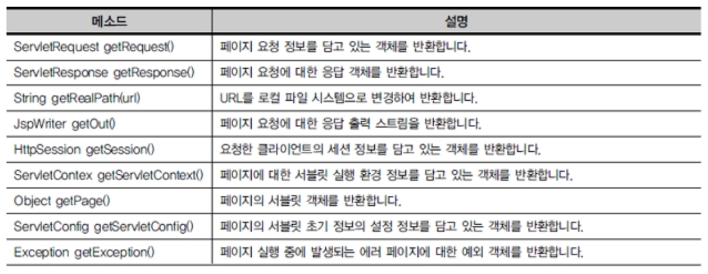


**(3) page, config**

- page 내부객체와 config내부객체를 통해서 jsp페이지가 변환된 서블릿관 관련돼, 내용에 접근할 수 있도록 하는 객체들이다.

■ page

- Jsp페이지 그 자체를 나타내는 객체이다.
- Jsp페이지에서 page객체는 this 키워드로 자기 자신을 참조한다.

> (page.jsp - *SKIP*)

```
<%@ page info = "study.co.kr"
    contentType="text/html;charset=UTF-8"%>
<% 
       String pageInfo = this.getServletInfo();
%>
<h1>Page Example1</h1>
현재 페이지의 info값 : <%=pageInfo%>
```

■ config

- javax.servlet.ServletConfig 클래스 타입의 내부 객체이다.
- 서블릿이 초기화될 때 참조해야 할 다른 여러 정보를 가지고 있다가 전해준다.

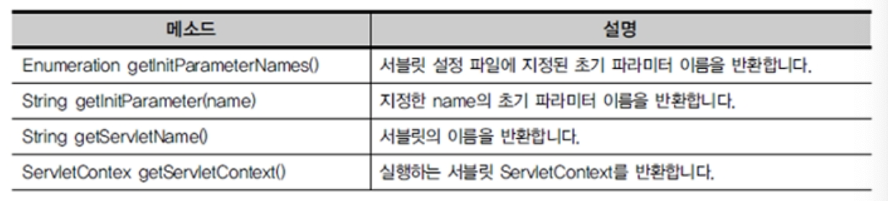


**(4) exception 내부 객체**

- Jsp 페이지에서 발생한 예외를 처리하는 페이지를 지정한 경우 에러페이지에 전달되는 예외 객체이다.
- page지시자 isErrorPage속성을 true로 지정한 Jsp페이지에서만 사용가능하다.

> exception.jsp

```jsp
<%@ page contentType="text/html;charset=UTF-8" errorPage="exception2.jsp"
%>
<%
  int one  = 1;
  int zero = 0;
%>
<h1>Exception Example1</h1>
one / zero = <%=one/zero%><p/>
```

>  exception2.jsp

```jsp

<%@ page contentType="text/html;charset=UTF-8"
                    isErrorPage="true"
%>
<%
   String message = exception.getMessage();
   String objectMessage = exception.toString();
%>
에러 메세지 : <b><%=message%></b><p/>
에러 실체의 클래스명과 에러 메세지  : <b><%=objectMessage%></b><p/>
```


## 서블릿 기초 문법

### 서블릿이란

- Jsp가 나오기전에 만들어진 웹페이지 생성 기술
- 서블릿은 java의 많은 장점들을 사용 할 수 있지만 html, css, js 등과 연동하기에 많은 단점이 있다
- 기업에서 사용하는 프레임워크의 기초 기술로 사용된다.
- WAS(tomcat)에서 웹페이지를 동적으로 생성하여 결과를 전송해 주는 서버 측 프로그램이다.


#### 서블릿 생성

- jsptest -> src -> package ; ch07 생성 -> ch07 ; New Servlet -> class name ; ExServlet , Next 클릭 -> URL Mapping 더블클릭 ->
   새창에서 pattern : /ch07/ExServlet 입력 -> Next -> 

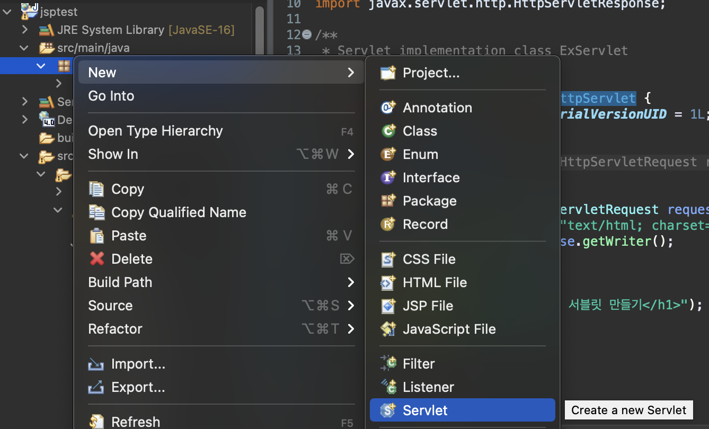

  --

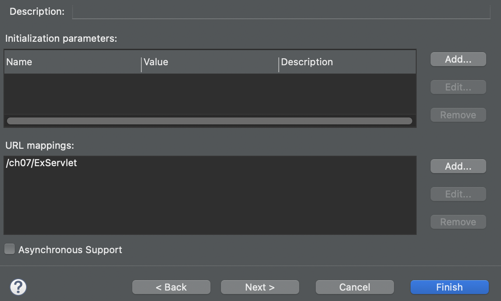

  --

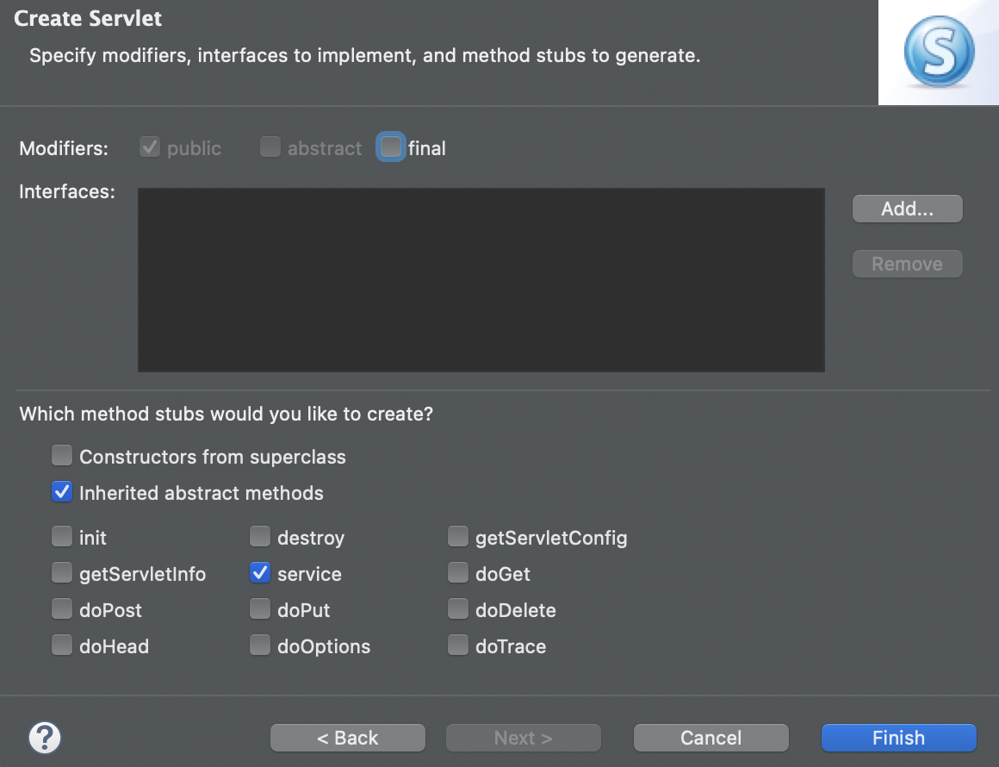

  

> ch07/ExServlet.java

```java
package ch07;

import java.io.IOException;
import java.io.PrintWriter;

import javax.servlet.ServletException;
import javax.servlet.annotation.WebServlet;
import javax.servlet.http.HttpServlet;
import javax.servlet.http.HttpServletRequest;
import javax.servlet.http.HttpServletResponse;

/**
 * Servlet implementation class ExServlet
 */
@WebServlet("/ch07/ExServlet")
public class ExServlet extends HttpServlet {
	private static final long serialVersionUID = 1L;

	 /**
     * @see HttpServlet#service(HttpServletRequest request, HttpServletResponse response)
     */

	protected void service(HttpServletRequest request, HttpServletResponse response) throws ServletException, IOException {
		response.setContentType("text/html; charset=UTF-8");
		PrintWriter out = response.getWriter();
		// html시작
		out.println("<html>");
		out.println("<body>");
		out.println("<h1>이클립스로 서블릿 만들기</h1>");
		out.println("</body>");
		out.println("</html>");
		// html 끝
	}

}
```


- ch07.ExServlet 선택 후 실행하기

```
http://localhost:8000/jsptest/ch07/ExSerlvet
```


*Fin.🐧*


