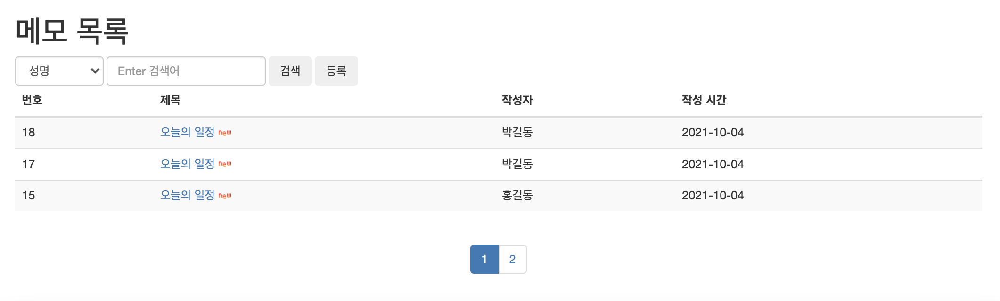

# JSP

## Memo Example

---

목차

[1. SQL](#1.-sql)

[2. DTO, DAO, Test](#2.-dto,-dao,-test)

[3. list.jsp, read.jsp](#3.-list.jsp,-read.jsp)

[4. Form.jsp, Proc.jsp](#4.-Form.jsp,-Proc.jsp)

[5. etc](#5.-etc)

---


메모 

(게시판 기능 코드 연습. 게시판에서 작성한 코드들을 memo에 맞게 다시 코딩 해보기)

#### 1. SQL

memo table 작성, 

필요한(MemoDAO에서 사용될) sql문 (CRUD) 작성

- sql

```sql
CREATE TABLE memo ( 
  memono    NUMBER(7)       NOT NULL,   -- 글 일련 번호, -9999999 ~ +9999999 
  wname   VARCHAR(20)    NOT NULL,   -- 글쓴이 
  title        VARCHAR(100)  NOT NULL,   -- 제목(*) 
  content   VARCHAR(4000) NOT NULL,  -- 글 내용 
  passwd   VARCHAR(15)     NOT NULL,  -- 비밀 번호 
  viewcnt   NUMBER(5)       DEFAULT 0,  -- 조회수, 기본값 사용 
  wdate     DATE               NOT NULL,  -- 등록 날짜, sysdate 

  PRIMARY KEY (memono)  
); 

insert into memo(memono, wname, title, content, passwd, wdate)
values((SELECT nvl(MAX(memono),0)+1 from memo),
'홍길동', '오늘의 일정', '2시 점심약속', '1234', sysdate);

SELECT * FROM memo;


SELECT * FROM memo
WHERE memono = 1;

-- update
UPDATE memo
SET title = '오늘의 일정 취소',
	content = '2시 점심 약속을 7시 저녁 약속으로 변경'
WHERE memono = 1;

-- delete
DELETE memo
WHERE memono = 1;

-- passcheck 
SELECT count(memono) AS cnt
FROM memo
WHERE memono = 1 AND passwd = '1234';


-- 조회수 증가
UPDATE memo
SET viewcnt = viewcnt + 1
WHERE memono = 1;

-- 목록 
SELECT memono, wname, title, viewcnt, wdate, r
FROM(
	SELECT memono, wname, title, viewcnt, wdate, rownum r
	FROM (
		SELECT memono, wname, title, viewcnt, wdate
		FROM memo
		--WHERE wname LIKE '%김%'; -- wname, title, content, title_content
		ORDER BY memono DESC
	)
)WHERE r >= 5 AND r <= 10;
```


#### 2. DTO, DAO, Test

DTO : 계층간 데이터 교환을 위한 자바빈즈

memoDTO에는 이 테이블 구조와 유사한 클래스를 선언. 변수들,  get, set 함수

DAO : 데이터베이스의 data에 접근하기 위한 객체

memoDAO에는 실질적으로 DB에 (memo table에) 접근하는 객체

- MemoDTO

```java
package memo;

public class MemoDTO {
	private int memono;
	private String wname;
	private String title;
	private String content;
	private String passwd;
	private int viewcnt;
	private String wdate;
	public MemoDTO() {
		super();
		// TODO Auto-generated constructor stub
	}
	public MemoDTO(int memono, String wname, String title, String content, String passwd, int viewcnt, String wdate) {
		super();
		this.memono = memono;
		this.wname = wname;
		this.title = title;
		this.content = content;
		this.passwd = passwd;
		this.viewcnt = viewcnt;
		this.wdate = wdate;
	}
	@Override
	public String toString() {
		return "MemoDTO [memono=" + memono + ", wname=" + wname + ", title=" + title + ", content=" + content
				+ ", passwd=" + passwd + ", viewcnt=" + viewcnt + ", wdate=" + wdate + "]";
	}
	public int getMemono() {
		return memono;
	}
	public void setMemono(int memono) {
		this.memono = memono;
	}
	public String getWname() {
		return wname;
	}
	public void setWname(String wname) {
		this.wname = wname;
	}
	public String getTitle() {
		return title;
	}
	public void setTitle(String title) {
		this.title = title;
	}
	public String getContent() {
		return content;
	}
	public void setContent(String content) {
		this.content = content;
	}
	public String getPasswd() {
		return passwd;
	}
	public void setPasswd(String passwd) {
		this.passwd = passwd;
	}
	public int getViewcnt() {
		return viewcnt;
	}
	public void setViewcnt(int viewcnt) {
		this.viewcnt = viewcnt;
	}
	public String getWdate() {
		return wdate;
	}
	public void setWdate(String wdate) {
		this.wdate = wdate;
	}
	
}
```


- MemoDAO

```java
package memo;

import java.sql.Connection;
import java.sql.PreparedStatement;
import java.sql.ResultSet;
import java.sql.SQLException;
import java.util.ArrayList;
import java.util.List;
import java.util.Map;

import utility.DBClose;
import utility.Open;

public class MemoDAO {
	public boolean create(MemoDTO dto) {
		boolean flag = false;
		Connection con = Open.getConnection();
		PreparedStatement pstmt = null;
		StringBuffer sql = new StringBuffer();
		sql.append(" insert into memo(memono, wname, title, content, passwd, wdate) ");
		sql.append(" values((SELECT nvl(MAX(memono),0)+1 from memo), ");
		sql.append(" ?,?,?,?, sysdate) ");

		try {
			pstmt = con.prepareStatement(sql.toString());
			pstmt.setString(1, dto.getWname());
			pstmt.setString(2, dto.getTitle());
			pstmt.setString(3, dto.getContent());
			pstmt.setString(4, dto.getPasswd());

			int cnt = pstmt.executeUpdate();

			if (cnt > 0)
				flag = true;
		} catch (SQLException e) {
			// TODO Auto-generated catch block
			e.printStackTrace();
		} finally {
			DBClose.close(pstmt, con);
		}

		return flag;
	}

	public MemoDTO read(int memono) {
		MemoDTO dto = null;
		Connection con = Open.getConnection();
		PreparedStatement pstmt = null;
		ResultSet rs = null;

		StringBuffer sql = new StringBuffer();
		sql.append(" SELECT memono, wname, title, content, viewcnt, ");
		sql.append(" to_char(wdate,'yyyy-mm-dd') wdate ");
		sql.append(" FROM memo   ");
		sql.append(" WHERE memono = ?  ");

		try {
			pstmt = con.prepareStatement(sql.toString());
			pstmt.setInt(1, memono);

			rs = pstmt.executeQuery();

			if (rs.next()) {
				dto = new MemoDTO();
				dto.setMemono(rs.getInt("memono"));
				dto.setWname(rs.getString("wname"));
				dto.setTitle(rs.getString("title"));
				dto.setContent(rs.getString("content"));
				dto.setViewcnt(rs.getInt("viewcnt"));
				dto.setWdate(rs.getString("wdate"));
			}

		} catch (SQLException e) {
			// TODO Auto-generated catch block
			e.printStackTrace();
		} finally {
			DBClose.close(rs, pstmt, con);
		}

		return dto;
	}

	public void upViewcnt(int memono) {
		Connection con = Open.getConnection();
		PreparedStatement pstmt = null;
		StringBuffer sql = new StringBuffer();
		sql.append(" UPDATE memo ");
		sql.append(" SET viewcnt = viewcnt + 1 ");
		sql.append(" WHERE memono = ? ");
		
		try {
			pstmt = con.prepareStatement(sql.toString());
			pstmt.setInt(1, memono);
			
			pstmt.executeUpdate();
		} catch (SQLException e) {
			// TODO Auto-generated catch block
			e.printStackTrace();
		} finally {
			DBClose.close(pstmt, con);
		}
	}

	public boolean update(MemoDTO dto) {
		boolean flag = false;
		Connection con = Open.getConnection();
		PreparedStatement pstmt = null;
		StringBuffer sql = new StringBuffer();

		sql.append(" UPDATE memo ");
		sql.append(" SET         ");
		sql.append("     wname = ?, ");
		sql.append("     title = ?, ");
		sql.append(" 	 content = ? ");
		sql.append(" WHERE memono = ? ");

		try {
			pstmt = con.prepareStatement(sql.toString());
			pstmt.setString(1, dto.getWname());
			pstmt.setString(2, dto.getTitle());
			pstmt.setString(3, dto.getContent());
			pstmt.setInt(4, dto.getMemono());

			int cnt = pstmt.executeUpdate();
			if (cnt > 0)
				flag = true;

		} catch (SQLException e) {
			// TODO Auto-generated catch block
			e.printStackTrace();
		} finally {
			DBClose.close(pstmt, con);
		}

		return flag;
	}

	public boolean delete(int memono) {
		boolean flag = false;
		Connection con = Open.getConnection();
		PreparedStatement pstmt = null;
		StringBuffer sql = new StringBuffer();
		sql.append(" delete from memo ");
		sql.append(" where memono = ? ");

		try {
			pstmt = con.prepareStatement(sql.toString());
			pstmt.setInt(1, memono);

			int cnt = pstmt.executeUpdate();
			if (cnt > 0)
				flag = true;

		} catch (SQLException e) {
			// TODO Auto-generated catch block
			e.printStackTrace();
		} finally {
			DBClose.close(pstmt, con);
		}

		return flag;
	}

	public boolean passCheck(Map map) {
		boolean flag = false;
		Connection con = Open.getConnection();
		PreparedStatement pstmt = null;
		ResultSet rs = null;
		StringBuffer sql = new StringBuffer();
		sql.append(" SELECT count(memono) AS cnt ");
		sql.append(" FROM memo ");
		sql.append(" WHERE memono = ? AND passwd = ? ");
		
		int memono = (Integer)map.get("memono");
		String passwd = (String)map.get("passwd");
		
		try {
			pstmt = con.prepareStatement(sql.toString());
			pstmt.setInt(1, memono);
			pstmt.setString(2, passwd);
			
			rs = pstmt.executeQuery();
			
			rs.next();
			
			int cnt = rs.getInt("cnt");
			
			if(cnt>0) flag = true;
			
		} catch (SQLException e) {
			// TODO Auto-generated catch block
			e.printStackTrace();
		} finally {
			DBClose.close(rs, pstmt, con);
		}

		return flag;
	}

	public List<MemoDTO> list(Map map) {
		List<MemoDTO> list = new ArrayList<MemoDTO>();
		Connection con = Open.getConnection();
		PreparedStatement pstmt = null;
		ResultSet rs = null;
		
		String col = (String)map.get("col"); //wname, title, content, title_content
		String word = (String)map.get("word");
		int sno = (Integer)map.get("sno");
		int eno = (Integer)map.get("eno");
		
		StringBuffer sql = new StringBuffer();
		sql.append(" SELECT memono, wname, title, content, viewcnt, to_char(wdate,'yyyy-mm-dd') wdate, r ");
		sql.append(" FROM( ");
		sql.append(" 	SELECT memono, wname, title, viewcnt, content, wdate, rownum r ");
		sql.append(" 	FROM ( ");
		sql.append(" 		SELECT memono, wname, title, content, viewcnt, wdate ");
		sql.append(" 		FROM memo ");
		
		if(word.trim().length() > 0 && col.equals("title_content")) {
			sql.append("       where title like '%'||?||'%' ");// =>'%왕%' 왕=>word
			sql.append("       or  content like '%'||?||'%' ");
		} else if (word.trim().length() > 0) {
			sql.append("       where "+col+" like '%'||?||'%' ");
		}
		
		sql.append(" 		ORDER BY memono DESC ");
		sql.append(" 	) ");
		sql.append(" )WHERE r >= ? AND r <= ? ");
		
		try {
			pstmt = con.prepareStatement(sql.toString());
		
			int i = 0;
			
			if(word.trim().length() > 0 && col.equals("title_content")) {
				pstmt.setString(++i, word);
				pstmt.setString(++i, word);
				
			} else if (word.trim().length() > 0) {
				pstmt.setString(++i, word);
			}
			
			pstmt.setInt(++i, sno);
			pstmt.setInt(++i, eno);
			
			rs = pstmt.executeQuery();
			
			
			while(rs.next()) {
				MemoDTO dto = new MemoDTO();
				dto.setMemono(rs.getInt("memono"));
				dto.setWname(rs.getString("wname"));
				dto.setTitle(rs.getString("title"));
				dto.setContent(rs.getString("content"));
				dto.setViewcnt(rs.getInt("viewcnt"));
				dto.setWdate(rs.getString("wdate"));
				
				list.add(dto);
			}
		
		} catch (SQLException e) {
			// TODO Auto-generated catch block
			e.printStackTrace();
		} finally {
			DBClose.close(rs, pstmt, con);
		}
		
		return list;
	}

	public int total(String col, String word) {
		int total = 0;
		Connection con = Open.getConnection();
		PreparedStatement pstmt = null;
		ResultSet rs = null;
		StringBuffer sql = new StringBuffer();
		sql.append(" SELECT count(*) from memo ");
		if(word.trim().length() > 0 && col.equals("title_content")) {
			sql.append(" where title like '%'||?||'%' ");// =>'%왕%' 왕=>word
			sql.append(" or  content like '%'||?||'%' ");
		} else if (word.trim().length() > 0) {
			sql.append(" where "+col+" like '%'||?||'%' ");
		}
		
		try {
			pstmt = con.prepareStatement(sql.toString());
			if(word.trim().length() > 0 && col.equals("title_content")) {
				pstmt.setString(1, word);
				pstmt.setString(2, word);
				
			} else if (word.trim().length() > 0) {
				pstmt.setString(1, word);
			}
						
			rs = pstmt.executeQuery();
			
			rs.next();
			total = rs.getInt(1);
			
		} catch (SQLException e) {
			// TODO Auto-generated catch block
			e.printStackTrace();
		}finally {
			DBClose.close(rs, pstmt, con);
		}
		
		return total;
	}

}
```


- MemoTest

```java
package memo;

import java.util.HashMap;
import java.util.List;
import java.util.Map;

import bbs.BbsDAO;
import bbs.BbsDTO;

public class MemoTest {
	
	public static void main(String[] args) {
		MemoDAO dao = new MemoDAO();
		
//		create(dao);
//	    read(dao);
//	    update(dao);
//	    delete(dao);
		list(dao);
	}
	
	private static void list(MemoDAO dao) {
		Map<String, Object> map = new HashMap();
		map.put("col", "wname");
		map.put("word", "");
		map.put("sno", 1);
		map.put("eno", 5);
		
		List<MemoDTO> list = dao.list(map);
		for(int i = 0; i<list.size(); i++) {
			MemoDTO dto = list.get(i);
			p(dto);
			p("--------------------");
		}
	}
	
	private static void create(MemoDAO dao) {
		MemoDTO dto = new MemoDTO();
		dto.setWname("박길동");
		dto.setTitle("오늘의 일정");
		dto.setContent("2시 약속");
		dto.setPasswd("1234");
		
		if(dao.create(dto)) {
			p("성공");
		}else {
			p("실패");
		}
	}
	
	private static void update(MemoDAO dao) {
		MemoDTO dto = dao.read(1);
		dto.setWname("아리");
		dto.setTitle("일정 수정");
		dto.setContent("7시 공부");

		if (dao.update(dto)) {
			p("수정 성공");
		} else {
			p("수정 실패");
		}
	}
	
	private static void read(MemoDAO dao) {
	    MemoDTO dto = dao.read(1);
	    p(dto);
	  }

	private static void delete(MemoDAO dao) {
		if (dao.delete(5)) { // 5 방금 삭제함. row 없어짐.
			p("삭제 성공");
		} else {
			p("삭제 실패");
		}
	}
	
	
	private static void p(MemoDTO dto) {
		p("번호: "+dto.getMemono());
		p("이름: "+dto.getWname());
		p("제목: "+dto.getTitle());
		p("내용: "+dto.getContent());
	}
	
	private static void p(String string) {
		System.out.println(string);
	}

}
```


#### 3. list.jsp, read.jsp

> webapp/memo

- list.jsp

```jsp
<%@ page contentType="text/html; charset=UTF-8" %> 
<%@ page import="java.util.*, memo.*, utility.*"%>
<jsp:useBean class="memo.MemoDAO" id="dao" />
<%
	request.setCharacterEncoding("utf-8");
%>
<%
// 검색 관련
String col = Utility.checkNull(request.getParameter("col"));
String word = Utility.checkNull(request.getParameter("word"));

if (col.equals("total")) {
	word = "";
}

// paging 관련
int nowPage = 1; // 현재 페이지
if (request.getParameter("nowPage") != null) {
	nowPage = Integer.parseInt(request.getParameter("nowPage"));
}
int recordPerPage = 3; // 한페이지당 보여줄 레코드 갯수

// DB에서 가져올 순번 
int sno = ((nowPage - 1) * recordPerPage) + 1;
int eno = nowPage * recordPerPage;

Map map = new HashMap();
map.put("col", col);
map.put("word", word);
map.put("sno",sno);
map.put("eno",eno);

List<MemoDTO> list = dao.list(map);

int total= dao.total(col,word);

String paging = Utility.paging(total, nowPage, recordPerPage, col, word);
%>
<!DOCTYPE html> 
<html> 
<head>
  <title>메모</title>
  <meta charset="utf-8">
	<script type="text/javascript">
	function read(memono) {
		var url = "read.jsp";
		url += "?memono=" + memono;
		url += "&col=<%=col%>";
		url += "&word=<%=word%>";
		url += "&nowPage=<%=nowPage%>";

		location.href = url;

	}
</script> 
</head>
<body> 
<jsp:include page="/menu/top.jsp"/>
	<div class="container">
		<h1>메모 목록</h1>
		<form class="form-inline" action="list.jsp" method="post">
			<div class="form-group">
				<select class="form-control" name="col">
					<option value="wname" <%if (col.equals("wname")) out.print("selected");%>>성명</option>
					<option value="title" <%if (col.equals("title")) out.print("selected");%>>제목</option>
					<option value="content" <%if (col.equals("content")) out.print("selected");%>>내용</option>
					<option value="title_content" <%if (col.equals("title_content")) out.print("selected");%>>제목+내용</option>
					<option value="total" <%if (col.equals("total")) out.print("selected");%>>전체 출력</option>
				</select>
			</div>
			<div class="form-group">
				<input type="search" name="word" value="<%=word%>" class="form-control" placeholder="Enter 검색어">
			</div>
			<button class='btn'>검색</button>
			<button type='button' class='btn' onclick="location.href='createForm.jsp'">등록</button>
		</form>
		<table class='table table-striped'>
			<thead>
				<tr>
					<th>번호</th>
					<th>제목</th>
					<th>작성자</th>
					<th>작성 시간</th>
				</tr>
			</thead>
			<tbody>
				<%
				if (list.size() == 0) {
				%>
				<tr><td colspan="6">등록된 글이 없습니다.</td></tr>
				<%
					} else {

					for (int i = 0; i < list.size(); i++) {
						MemoDTO dto = list.get(i);
				%>

				<tr>
					<td><%=dto.getMemono()%></td>
					<td>
					<a href="javascript:read('<%=dto.getMemono()%>')"><%=dto.getTitle()%></a>
						<%if(Utility.compareDay(dto.getWdate())){  %>
						
						<% }%>
					</td>
					<td><%=dto.getWname()%></td>
					<td><%=dto.getWdate()%></td>
				</tr>
				<%
					} //for_end

				} //if_end
				%>
			</tbody>
		</table>
		<%=paging %>
		
	</div>
</body> 
</html> 
```


- read.jsp

```jsp
<%@ page contentType="text/html; charset=UTF-8" %> 
 <%@ page import="memo.MemoDTO" %>
<jsp:useBean class="memo.MemoDAO" id="dao" />
<%
	int memono = Integer.parseInt(request.getParameter("memono"));

	dao.upViewcnt(memono);
	
	MemoDTO dto = dao.read(memono);
	
	String content = dto.getContent().replaceAll("\r\n", "<br>");
%>
<!DOCTYPE html> 
<html> 
<head>
  <title>메모</title>
  <meta charset="utf-8">
   <script>
  	function update(){
  		let url = 'updateForm.jsp';
  		url += '?memono=<%=dto.getMemono()%>';
  		url += '&col=<%=request.getParameter("col")%>';
  		url += '&word=<%=request.getParameter("word")%>';
  		url += '&nowPage=<%=request.getParameter("nowPage")%>';
  		
  		location.href=url;
  	}
  	function del(){
  		let url = 'deleteForm.jsp';
  		url += '?memono=<%=dto.getMemono()%>';
  		url += '&col=<%=request.getParameter("col")%>';
  		url += '&word=<%=request.getParameter("word")%>';
  		url += '&nowPage=<%=request.getParameter("nowPage")%>';
  		
  		location.href = url;
  	}
  	
  	function list(){
  		let url = 'list.jsp';
  		url += '?col=<%=request.getParameter("col")%>';
  		url += '&word=<%=request.getParameter("word")%>';
  		url += '&nowPage=<%=request.getParameter("nowPage")%>';
  		
  		location.href= url;
  	}
  </script>
  
</head>
<body> 
<jsp:include page="/menu/top.jsp"/>
<div class="container">
<h2>조회</h2>
<div class= "panel panel-default">
	<div class="panel-heading">작성자</div>
	<div class="panel-body"><%=dto.getWname() %></div>
	
	<div class="panel-heading">제목</div>
	<div class="panel-body"><%=dto.getTitle() %></div>
	
	<div class="panel-heading">내용</div>
	<div class="panel-body" style="height:200px"><%=content %></div>
	
	<div class="panel-heading">조회수</div>
	<div class="panel-body"><%=dto.getViewcnt() %></div>
	
	<div class="panel-heading">등록일</div>
	<div class="panel-body"><%=dto.getWdate() %></div>

</div>

	<button class='btn' onclick="location.href='./createForm.jsp'">등록</button>
	<button class='btn' onclick="update()">수정</button>
	<button class='btn' onclick="del()">삭제</button>
	<button class='btn' onclick="location.href='./list.jsp'">목록</button>
<br>
<br>
</div>
</body> 
</html> 
```


#### 4. Form.jsp, Proc.jsp

createForm.jsp, createProc.jsp

updateForm.jsp, updateProc.jsp

deleteForm.jsp, deleteProc.jsp

Form, Proc 파일끼리 구조는 거의 유사

- Form

form tag로 Proc.jsp 파일로 post 방식으로 정보 전송.

내용들을 입력받아 Proc.jsp 파일로 작성자, 제목, 내용, 비밀번호를 전송한다.

- Proc

map을 이용해 memono과 passwd를 보내 비밀번호를 확인한다.

비밀번호가 맞으면 해당되는 기능을 수행한다.(update, delete 등)

목록을 누르면 원래 페이지로 돌아가기 위해 col, word, nowPage 값을 불러와

원래 페이지 번호의 페이지로 돌아간다.


- createFrom.jsp

```jsp
<%@ page contentType="text/html; charset=UTF-8" %> 
 
<!DOCTYPE html> 
<html> 
<head>
  <title>homepage</title>
  <meta charset="utf-8">
</head>
<body> 
<jsp:include page="/menu/top.jsp"/>
<div class="container">
<h1 class="col-sm-offset-2 col-sm-10">메모 생성</h1>
<form class="form-horizontal" 
      action="createProc.jsp"
      method="post">

  <div class="form-group">
    <label class="control-label col-sm-2" for="wname">작성자</label>
    <div class="col-sm-6">
      <input type="text" name="wname" id="wname" class="form-control">
    </div>
  </div>
  
  <div class="form-group">
    <label class="control-label col-sm-2" for="title">제목</label>
    <div class="col-sm-8">
      <input type="text" name="title" id="title" class="form-control">
    </div>
  </div>
  
  <div class="form-group">
    <label class="control-label col-sm-2" for="content">내용</label>
    <div class="col-sm-8">
    <textarea rows="12" cols="7" id="content" name="content" class="form-control"></textarea>
    </div>
  </div>
  
  <div class="form-group">
    <label class="control-label col-sm-2" for="passwd">비밀번호</label>
    <div class="col-sm-8">
      <input type="password" name="passwd" id="passwd" class="form-control">
    </div>
  </div>

   <div class="form-group">
   <div class="col-sm-offset-2 col-sm-5">
    <button class="btn">등록</button>
    <button type="reset" class="btn">취소</button>
   </div>
 </div>
</form>
</div>
</body> 
</html> 
```


- createProc.jsp

```jsp
<%@ page contentType="text/html; charset=UTF-8"%>
<%
request.setCharacterEncoding("utf-8");
%>
<jsp:useBean class="memo.MemoDAO" id="dao" />
<jsp:useBean class="memo.MemoDTO" id="dto" />
<jsp:setProperty name="dto" property="*" />
<%
//String wname = request.getParameter("wname");
//dto.setWname(wname);
boolean flag = dao.create(dto);
%>
<!DOCTYPE html>
<html>
<head>
<title>메모 생성</title>
<meta charset="utf-8">
</head>
<body>
	<jsp:include page="/menu/top.jsp" />
	<div class="container">
		<div class="well well-lg">
			<%
			if (flag) {
				out.print("메모 등록 성공입니다.");
			} else {
				out.print("메모 등록 실패입니다.");
			}
			%>
		</div>
	</div>
</body>
</html>
```


- updateFrom.jsp

```jsp
<%@ page contentType="text/html; charset=UTF-8" %> 
<%@ page import="memo.MemoDTO" %>
<jsp:useBean class="memo.MemoDAO" id="dao" />

<%
	int memono= Integer.parseInt(request.getParameter("memono"));

    MemoDTO dto = dao.read(memono);

%>
 
<!DOCTYPE html> 
<html> 
<head>
  <title>homepage</title>
  <meta charset="utf-8">
</head>
<body> 
<jsp:include page="/menu/top.jsp"/>
<div class="container">
<h1 class="col-sm-offset-2 col-sm-10">메모 수정</h1>
<form class="form-horizontal" 
      action="updateProc.jsp"
      method="post"
      >
  <input type="hidden" name='memono' value='<%=dto.getMemono()%>'>
  <input type="hidden" name='col' value='<%=request.getParameter("col")%>'>
  <input type="hidden" name='word' value='<%=request.getParameter("word")%>'>
  <input type="hidden" name='nowPage' value='<%=request.getParameter("nowPage")%>'>
  <div class="form-group">
    <label class="control-label col-sm-2" for="wname">작성자</label>
    <div class="col-sm-6">
      <input type="text" name="wname" id="wname" class="form-control" value="<%=dto.getWname()%>">
    </div>
  </div>
  <div class="form-group">
    <label class="control-label col-sm-2" for="title">제목</label>
    <div class="col-sm-8">
      <input type="text" name="title" id="title" class="form-control" value="<%=dto.getTitle()%>">
    </div>
  </div>
  
  <div class="form-group">
    <label class="control-label col-sm-2" for="content">내용</label>
    <div class="col-sm-8">
    <textarea rows="12" cols="7" id="content" name="content" class="form-control"><%=dto.getContent() %></textarea>
    </div>
  </div>
  
  <div class="form-group">
    <label class="control-label col-sm-2" for="passwd">비밀번호</label>
    <div class="col-sm-6">
      <input type="password" name="passwd" id="passwd" class="form-control">
    </div>
  </div>
  
   <div class="form-group">
   <div class="col-sm-offset-2 col-sm-5">
    <button class="btn">수정</button>
    <button type="reset" class="btn">취소</button>
   </div>
 </div>
</form>
</div>
</body> 
</html> 
```


- updateProc.jsp

```jsp
<%@ page contentType="text/html; charset=UTF-8"%>
<%@ page import="java.util.HashMap, java.util.Map"%>
<%
request.setCharacterEncoding("utf-8");
%>
<jsp:useBean class="memo.MemoDAO" id="dao" />
<jsp:useBean class="memo.MemoDTO" id="dto" />
<jsp:setProperty name="dto" property="*" />
<%
// pw check
Map map = new HashMap();
map.put("memono", dto.getMemono());
map.put("passwd", dto.getPasswd());

boolean pflag = dao.passCheck(map);

boolean flag = false;
if(pflag){
	flag = dao.update(dto);
}
%>
<!DOCTYPE html>
<html>
<head>
<title>게시판 수정</title>
<meta charset="utf-8">
</head>
<script>
function list(){
		let url = 'list.jsp';
		url += '?col=<%=request.getParameter("col")%>';
		url += '&word=<%=request.getParameter("word")%>';
		url += '&nowPage=<%=request.getParameter("nowPage")%>';
		
		location.href= url;
	}
</script>
<body>
	<jsp:include page="/menu/top.jsp" />
	<div class="container">
		<div class="well well-lg">
			<%
			if (!pflag) {
				out.print("잘못된 비밀번호 입니다.");
			} else if(flag){
				out.print("메모 수정 성공입니다.");
			}else {
				out.print("메모 수정 실패입니다.");
			}
			%>
		</div>
			<% if(!pflag){ %>
			<button class="btn" onclick="history.back()">다시 시도</button> 
			<!-- back 대신 go라는 함수도 있음. 숫자로 얼마나 전으로 이동할지 설정가능 -->
			<%} %>
			<button class="btn" onclick="location.href='createForm.jsp'">다시 등록</button>
			<button class="btn" onclick="list()">목록</button>
	</div>
</body>
</html>
```


- deleteForm.jsp

```jsp
<%@ page contentType="text/html; charset=UTF-8" %> 

<!DOCTYPE html> 
<html> 
<head>
  <title>homepage</title>
  <meta charset="utf-8">
  <style>
   #red{
    color:red;
   }
  </style>
</head>
<body> 
<jsp:include page="/menu/top.jsp"/>
<div class="container">
<h1 class="col-sm-offset-2 col-sm-10">메모 삭제</h1>
<form class="form-horizontal" 
      action="deleteProc.jsp"
      method="post"
      >
 <input type="hidden" name='memono' value='<%= request.getParameter("memono")%>'>
 <input type="hidden" name='col' value='<%= request.getParameter("col")%>'>
 <input type="hidden" name='word' value='<%= request.getParameter("word")%>'>
 <input type="hidden" name='nowPage' value='<%= request.getParameter("nowPage")%>'>
  <div class="form-group">
    <label class="control-label col-sm-2" for="passwd">비밀번호</label>
    <div class="col-sm-6">
      <input type="password" name="passwd" id="passwd" class="form-control">
    </div>
  </div>
  
  <p id='red' class="col-sm-offset-2 col-sm-6">삭제하면 복구할 수 없습니다.</p>
  
   <div class="form-group">
   <div class="col-sm-offset-2 col-sm-5">
    <button class="btn">삭제</button>
    <button type="reset" class="btn">취소</button>
   </div>
 </div>
</form>
</div>
</body> 
</html> 
```


- deleteProc.jsp

```jsp
<%@ page contentType="text/html; charset=UTF-8" %> 
<%@ page import="java.util.*" %>
<%
	request.setCharacterEncoding("utf-8");
%>
<jsp:useBean class="memo.MemoDAO" id="dao"/>
<jsp:useBean class="memo.MemoDTO" id="dto"/>
<jsp:setProperty name="dto" property="*" />
<%
	Map map = new HashMap();
	map.put("memono",dto.getMemono());
	map.put("passwd", dto.getPasswd());
  
	boolean pflag = dao.passCheck(map);
	
	boolean flag = false;
	if(pflag){
		flag = dao.delete(dto.getMemono());
	}
%>
<!DOCTYPE html> 
<html> 
<head>
  <title>게시판 생성</title>
  <meta charset="utf-8">
</head>
<script type="text/javascript">
	function list(){
		let url = "list.jsp";
		url += '?col=<%=request.getParameter("col")%>';
		url += '&word=<%=request.getParameter("word")%>';
		url += '&nowPage=<%=request.getParameter("nowPage")%>';
		
		location.href = url;
	}

</script>
<body> 
<jsp:include page="/menu/top.jsp"/>
<div class="container">
<div class="well well-lg">
	<%
		if(!pflag){
			out.print("잘못된 비밀번호 입니다.");
		}else if(flag){
			out.print("메모 삭제 성공 입니다.");
		}else{
			out.print("메모 삭제 실패입니다.");
		}
	%>
	
</div>
	<% if(!pflag){%>
	<button class="btn" onclick="history.back()">다시시도</button>
	<% } %>
	<button class="btn" onclick="location.href='createForm.jsp'">다시등록</button>
	<button class="btn" onclick="list()">목록</button>
</div>
</body> 
</html> 
```


#### 5. etc


- 목록 화면



- 목록 url

아래와 같은 방식으로, col, word, nowPage를 이용한 url

```
http://localhost:8000/webtest/memo/list.jsp?col=&word=&nowPage=1
```


*Fin.🐧*


