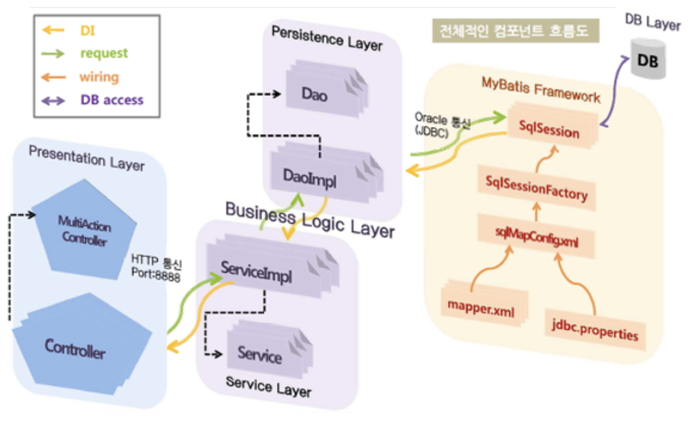
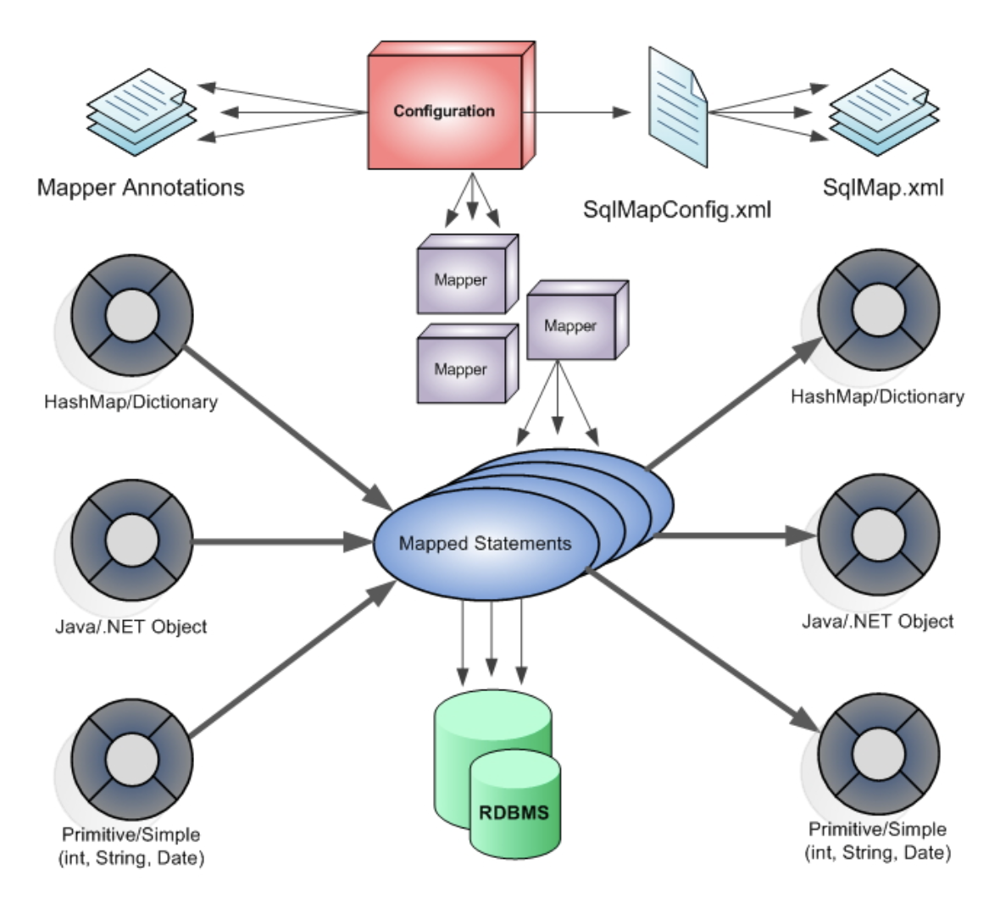
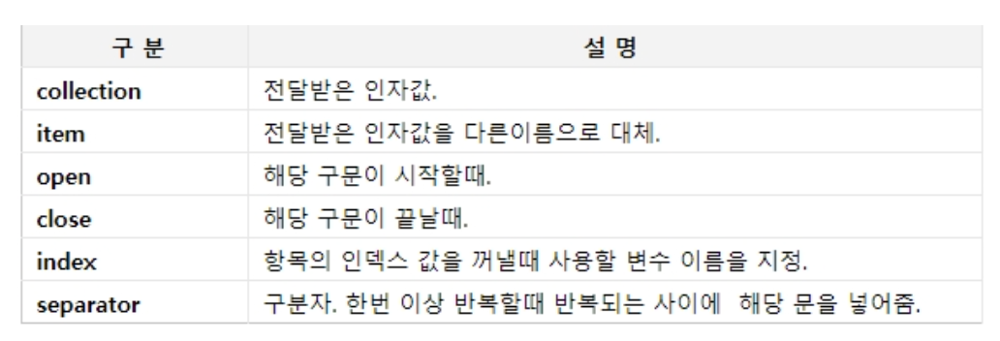

# Mybatis


## Mybatis 프레임워크

- 아파치(Apache) 소프트웨어 재단의 IBatis 개발자팀이 구글 코드로 이전하고, 구글 코드에서는 이름이 MyBatis로 변경되었다.


### Mybatis 프레임 특징

- 한 두줄의 자바코드로 DB연동을 처리한다. 코드길이가 줄어듦.
- SQL 명령어를 자바코드에서 분리하여 XML 파일에 따로 관리한다.
- 이식성이 좋아 어떤 프로그래밍 언어로도 구현 가능
- 오픈소스, 무료


#### Mybatis Component Flow

- Mybatis Framework가 Business Layer(Persistance Layer + Service Layer)와 DB Layer사이 가운데서 양쪽을 연결하고 있다.

- 하단의 mapper.xml 파일을 이용하여 쿼리문을 별도로 작성한다.




### Mybatis의 구성요소

#### (1) Configuration 파일(SqlMapConfig.xml)

- Mybatis 메인 환경설정를 정의 한다.
- DB설정및 mapper 설정등을 한다.
- DB 설정은 별도의 properties 파일로 분리할 수 있다.
- mapper는 SQL query를 xml문서로 분리한 것이다.

#### (2) 매퍼(Mapper)

- 두가지 종류의 매퍼를 정의 할 수 있다.
- 1 : SQL을 XML에 정의된 XML파일로 생성
- 2 : SQL을 메소드에 어노테이션으로 정의한 인터페이스로 생성

#### (3) 매핑구문(Mapped Statements)

- SQL을 DB에 실행할 구문을 의미한다.
- 매핑 구문은 어노테이션 정의 방법과 XML정의 방식 두가지가 있다.

#### (4) Mybatis Java API

- SqlSession 는 Mapper xml에 등록된 SQL구분을 실행한다.
- SqlSession 객체는 SQL구분을 실행하기 위한 여러가지 메소드를 제공한다. selectOne(), selectList(), insert(), update(), delete() 등




## Mapper XML 파일 구조

- Mybatis 프레임워크에서 가장 중요한 파일이다.
- SQL 문장을 가지고 있다.
- Mapper XML 또는 Mapper는 `<mapper>`루트 엘리먼트를 가지는 XML파일이다.
- Mapper구조는 DTD 선언이 등장하고, 그밑에 `<mapper>` 루트 엘리먼트가 선언된다.
-  `<mapper>`엘리먼트는 namespace라는 속성을 가진다.

```xml
<?xml version="1.0" encoding="UTF-8"?>
<!DOCTYPE mapper
PUBLIC "-//mybatis.org//DTD Mapper 3.0//EN"
"http://mybatis.org/dtd/mybatis-3-mapper.dtd">
<mapper namespace="bbs"> 
                 :
</mapper>
```


### 1. SELECT

```xml
<select id=”selectPerson” parameterType=”int” resultType=”hashmap”>
SELECT * FROM PERSON WHERE ID = #{id}
</select>
```

SELECT 는 resultType  필수


#### (1) id 속성

- 필수 속성으로 전체 Mapper 파일들 내에서 유일한 아이디를 등록한다.
- `<mapper namespace="">`에서 namespace값이 다른면 같은 id도 다른 id로 인식된다.

```xml
<mapper namespace="bbs"> 
    <select id=”selectPerson” >...</select>
</mapper>
 <mapper namespace="member"> 
    <select id=”selectPerson” >...</select>
</mapper>
```


#### (2) paramaterType 속성

- 외부로 부터 데이터를 받아올 때 사용하는 속성이다.
- insert, update시 사용할 데이터를 받아와서 생성,수정한다.
- 받아온 데이터의 타입을 명시한다. 


#### (3) resultType 속성
- 주로 select구문 처리후 DBMS로부터 결과를 받아올때 사용한다.
- 결과값을 매핑할 자바 객체 타입을 명시한다.
- select구문에서 생략할 수 없는 속성이다.


### 2. insert, update, delete

- 데이터 삽입, 수정, 삭제를 위한 구문이다.
- insert의 selectKey는 기본 키 필드의 자동 생성을 지원한다.
- `<selectKey>`를 사용하면 생성된 키를 쉽게 가져올 수 있다.

```xml
<insert id="insertAuthor" parameterType="domain.blog.Author">
        <selectKey keyProperty="id" resultType="int" >
                select board_seq.nextval as idfrom dual
        </selectKey>
        insert into Author (id,username,password,email,bio)
        values (#{id},#{username},#{password},#{email},#{bio})
</insert>
 
<update id="updateAuthor" parameterType="domain.blog.Author">
        update Author set
        username = #{username},
        password = #{password},
        email = #{email},
        bio = #{bio}
        where id = #{id}
</update>
 
<delete id="deleteAuthor” parameterType="int">
        delete from Author where id = #{id}
</delete>
```


### 3. resultMap 속성

- 결과를 매핑할 때 하나의 java객체로 매핑이 안되는 경우에 사용한다(join등)
- 테이블 컬럼명과 매핑할 자바객체의 필드명이 다를때도 사용한다.
- `<resultMap>`을 사용하려면 미리 `<resultMap>`의 매핑 규칙을 지정한다.

```xml
<resultMap id="selectResult" type="board">
     <result property="num" column = 'seq'>
     <result property="title" column = 'subject'>
     <result property="content" column = 'content'>
     <result property="redate" column = 'redate'>
</resultMap>
<select id=”selectBoard” parameterType=”int” resultMap=”selectResult”>
    SELECT * FROM board WHERE num = #{num}
</select>
```


### 4. CDATA Section 사용

- SQL구문에 '<'를 사용하면 에러가 난다. 
- xml 파서가 xml처리시 '<' 작다란 의미를 태그시작으로 처리하기 때문이다.
- CDATA Section으로 사용하면 에러가 나지 않는다. 파서가 처리하지 않는 영역이다.(단순 문자 데이터로 인식한다.)

```xml
<select id=”selectBoard” parameterType=”int” resultType=”board”>
    SELECT *
    FROM board
   <![CDATA[
    WHERE num <= #{num}
    ]]>
</select>
```


### 5. 동적 SQL

- 동적 SQL 요소들은 JSTL 이나 XML 기반의 텍스트 프로세서 사용과 비슷하다.

#### (1) if

```xml
<select id=”findActive”
        parameterType=”Blog” resultType=”Blog”>
        SELECT * FROM BLOG
        WHERE state = ‘ACTIVE’
        <if test=”title != null”>
        AND title like #{title}
        </if>
</select>
 
<select id=”findActiveBlogLike”
parameterType=”Blog” resultType=”Blog”>
        SELECT * FROM BLOG WHERE state = ‘ACTIVE’
        <if test=”title != null”>
        AND title like #{title}
        </if>
        <if test=”author != null and author.name != null”>
        AND author_name like #{author.name}
        </if>
</select>
```


#### (2) choose, when, otherwise

```xml
<select id=”findActiveBlogLike”
        parameterType=”Blog” resultType=”Blog”>
        SELECT * FROM BLOG WHERE state = ‘ACTIVE’
        <choose>
        <when test=”title != null”>
                AND title like #{title}
        </when>
        <when test=”author != null and author.name != null”>
                AND author_name like #{author.name}
        </when>
        <otherwise>
                AND featured = 1
        </otherwise>
        </choose>
</select>
```


#### (3) where

- where 요소는 단순히 “WHERE” 만을 추가한다. “AND” 나 “OR” 로 시작한다면, 그 “AND” 나 “OR”를 지워버린다.

```xml
<select id=”findActiveBlogLike”
        parameterType=”Blog” resultType=”Blog”>
        SELECT * FROM BLOG
        <where>
        <if test=”state != null”>
                state = #{state}
        </if>
        <if test=”title != null”>
                AND title like #{title}
        </if>
        <if test=”author != null and author.name != null”>
                AND author_name like #{author.name}
        </if>
        </where>
</select>
```


#### (4) set

- 동적인 update 구문의 set 요소는 update 하고자 하는 칼럼을 동적으로 포함시키기 위해 사용한다.
- set 요소는 동적으로 SET 키워드를 붙히고 필요없는 콤마를 제거한다.

```xml
<update id="updateAuthorIfNecessary"
        parameterType="domain.blog.Author">
        update Author
        <set>
        <if test="username != null">username=#{username},</if>
        <if test="password != null">password=#{password},</if>
        <if test="email != null">email=#{email},</if>
        <if test="bio != null">bio=#{bio}</if>
        </set>
        where id=#{id}
</update>
```


#### (5) foreach

- collection에 대해 반복처리한다. 종종 IN 조건을 사용한다.



```xml
<select id="selectPostIn" resultType="domain.blog.Post">
        SELECT *
        FROM POST 
        WHERE ID in 
        <foreach item="item" index="index" collection="list"
        open="(" separator="," close=")">
                #{item}
        </foreach>
</select>
```


*Fin.🐧*

