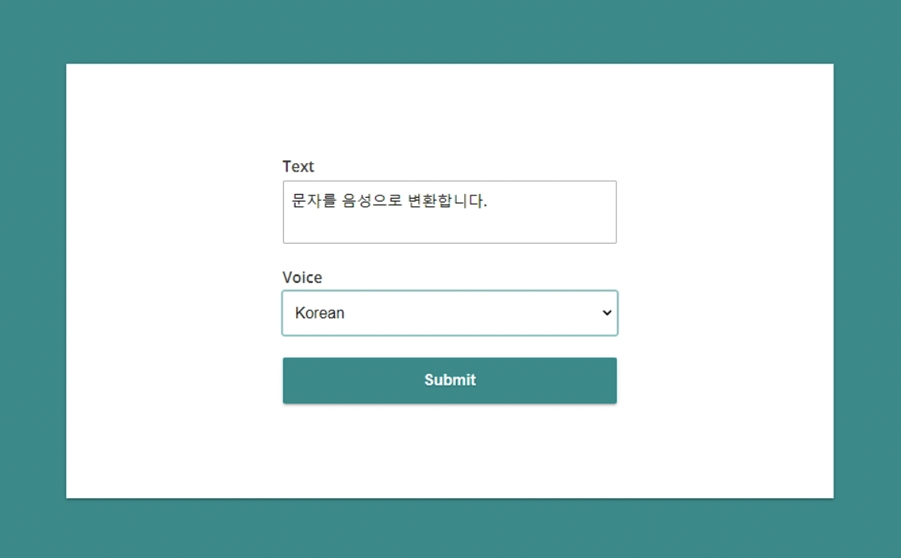
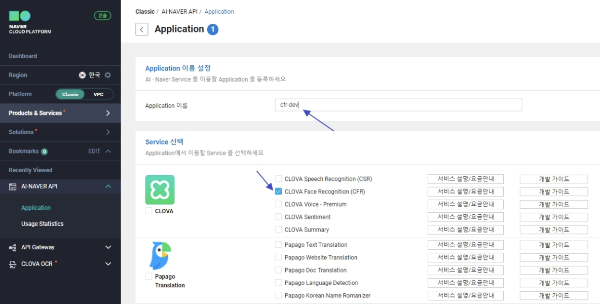
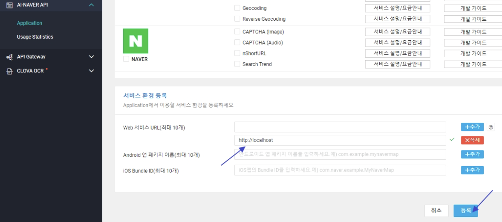
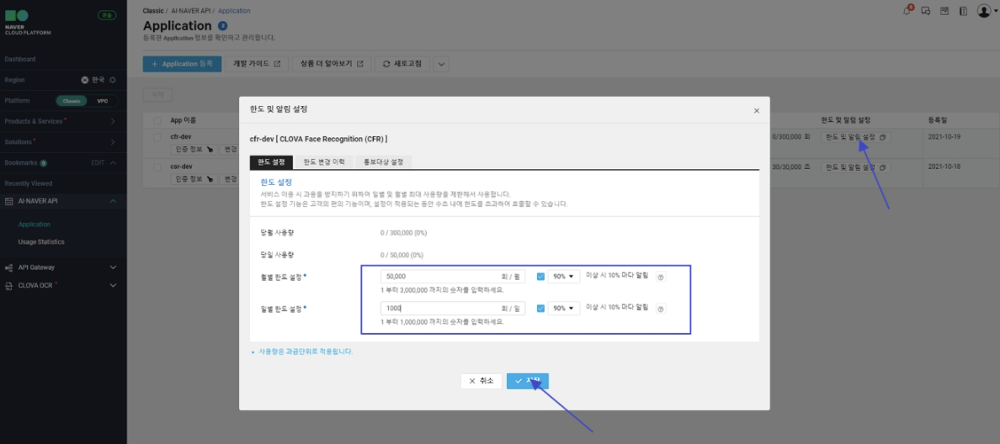
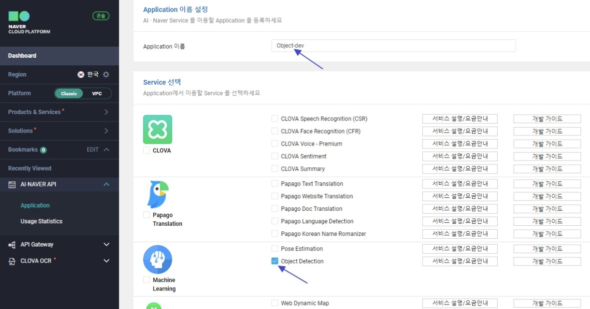
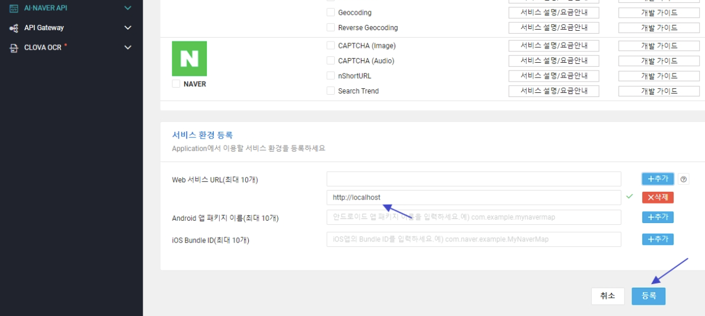

# Naver Clova

강의에서 제공해주는 계정을 통해 Naver Clova AI API 활용 실습 진행


## Naver Clova 음성인식 AI API 활용(CSR)

- 문자 -> 음성, 음성 -> 문자로 변환을 제공하는 사이트
- 최대 100자까지 지원되며, 한글은 50자 까지만 지원됨.  
- https://soundoftext.com/



- 문자 -> 음성

- Play 확인 및 sample.mp3로 다운로드


### Naver Cloud 

- AI Service 접속 -> Clova Speech Recognition(CSR) 이용신청
- Application 등록 후 Service선택 , 서비스환경 등록 -> web Service URL : `http://localhost`
- 한도 및 알림 설정(월별 한도 설정 : 30,000 , 50% (약 8시간, 최소값) / 일별 한도 설정 :  3,600 , 90% (1시간))
- 인증정보 확인 (-> Python 에서 Client ID, Client Secret 이용)


### Naver Clova 음성 인식 AI API 활용


## Naver Clova 문자 인식 AI API 활용 (OCR)

- 문서를 인식하고, 사용자가 지정한 영역의 텍스트와 데이터를 정확하게 추출한다.
- 100건까지 무료, 300건의 경우 600원의 이용 요금 부과됨


## Naver Clova 이미지 인식 AI API 활용(CFR)

- 1 ~ 1000건까지는 1000 원의 요금 부과, 1회만 사용해도 1000원이며, 서비스 이용이 1000회를 초과하면 1000원 단위로 요금 증가
- 공식 문서: https://developers.naver.com/docs/clova/api/CFR/API_Guide.md#%EC%9D%91%EB%8B%B5-2
- 국내 유명인 위주로 인식을 잘함.


### 1. 서비스 신청

#### (1) ncloud 로그인

#### (2) CLOVA CFR

- AI Service -> Clova Face Recongnition(CFR) 선택 -> 이용신청하기 -> 
  \+ Application 등록 

- CFR 선택, Application cfr-dev



- Web서비스 URL : http://localhost



- 인증정보 확인
- Python에서 사용할 인증 정보 확인


- 한도 및 알림 설정(1,000, 90%)



- 설정 완료


### 2. Python 테스트

> /CFR/CFR-이미지 인식.ipynb

```python
import os
import sys
import requests
import json
 
client_id = "fb........................."
client_secret = "hm....................................................."
 
url = "https://naveropenapi.apigw.ntruss.com/vision/v1/celebrity" 
 
# 유명인 얼굴인식
 
# files = {'image': open('./조정석.jpg', 'rb')}
# {"info":{"size":{"width":390,"height":429},"faceCount":1},"faces":[{"celebrity":{"value":"조정석","confidence":1.0}}]}
 
# files = {'image': open('./김남길.jpg', 'rb')}
# {"info":{"size":{"width":500,"height":291},"faceCount":1},"faces":[{"celebrity":{"value":"김남길","confidence":0.18698}}]}
 
# files = {'image': open('./이하늬.jpg', 'rb')}
# {"info":{"size":{"width":390,"height":532},"faceCount":1},"faces":[{"celebrity":{"value":"이하늬","confidence":1.0}}]}
 
files = {'image': open('./검은 사제들.jpg', 'rb')}  # 3명 찾음.
# {"info":{"size":{"width":768,"height":432},"faceCount":5},"faces":[{"celebrity":{"value":"문지인","confidence":0.105306}},{"celebrity":{"value":"이하늬","confidence":1.0}},{"celebrity":{"value":"최필립","confidence":0.207688}},{"celebrity":{"value":"김남길","confidence":0.357709}},{"celebrity":{"value":"김성균","confidence":0.958674}}]}
 
headers = {'X-NCP-APIGW-API-KEY-ID': client_id, 'X-NCP-APIGW-API-KEY': client_secret }
response = requests.post(url,  files=files, headers=headers)
rescode = response.status_code
 
if(rescode==200):
    print (response.text)
    data = json.loads(response.text)
    print('발견된 얼굴수: {0} 명'.format(len(data['faces'])))
    
    for i in range(len(data['faces'])):
        name = data['faces'][i]['celebrity']['value']
        per = data['faces'][i]['celebrity']['confidence']
        print("감지된 얼굴 {0}: {1} {2} %".format(i+1, name, round(per*100)))
else:
    print("Error Code:" + rescode)
```


## Naver Clova 객체 탐지(물체 감지) AI API 활용

- 1 ~ 1000건까지는 1250 원의 요금 부과, 1회만 사용해도 1250원이며, 서비스 이용이 1000회를 초과하면 1000건 단위로 1250원 요금 증가
- 공식 문서: https://api.ncloud-docs.com/docs/ai-naver-objectdetection
- 국내 유명인 위주로 인식을 잘함.
- 응답 구조

```python
predictions[0]['detection_classes'] List: 탐지된 객체의 클래스 번호
predictions[0]['detection_names'] List: 탐지된 객체의 클래스 이름
predictions[0]['num_detections']  Number: 탐지된 객체의 수
predictions[0]['detection_boxes']  List<Number, Number, Number, Number>: 탐지된 객체의 바운딩 박스 좌표 (x1, y1, x2, y2)
predictions[0]['detection_scores'] List: 탐지된 객체의 정확도, 확률값
```


### 1. 서비스 신청

#### (1) ncloud 로그인

#### (2) Object Detection

- AI Service -> Object Detection 선택 -> 이용신청하기 -> 
  \+ Application 등록 -> Application : object-dev



- Web 서비스 URL : http://localhost



- Python에서 사용할 인증정보 확인 , 한도 및 알림설정 한다.

- 월별 한도 설정 : 1000, 90%, 일별 한도 설정 : 1000, 90%


### 2. Python 테스트

> Object-Detection-물체감지.ipynb

```python
import os
import sys
import requests
import json
import collections
client_id = "pea..............." # "YOUR_CLIENT_ID"
client_secret = "ZXE.........................." # "YOUR_CLIENT_SECRET"
url = "https://naveropenapi.apigw.ntruss.com/vision-obj/v1/detect" # 객체 인식
# files = {'image': open(file_name, 'rb')}
# Counter({'car': 18, 'truck': 13, 'bus': 3})
files = {'image': open('./검은 사제들.jpg', 'rb')}
# Counter({'person': 6, 'handbag': 1})
headers = {'X-NCP-APIGW-API-KEY-ID': client_id, 'X-NCP-APIGW-API-KEY': client_secret }
response = requests.post(url,  files=files, headers=headers)
rescode = response.status_code
if(rescode==200):
    print (response.text)
    data = json.loads(response.text)
    print('발견된 물체수: {0} 명'.format(data['predictions'][0]['num_detections']))
    detection_names = data['predictions'][0]['detection_names']
    print(detection_names)
    count = collections.Counter(detection_names)
    print(count)
    print('car:', count['car'])
    print('truck:', count['truck'])
    print('bus:', count['bus'])
else:
    print("Error Code:" + rescode)
```


