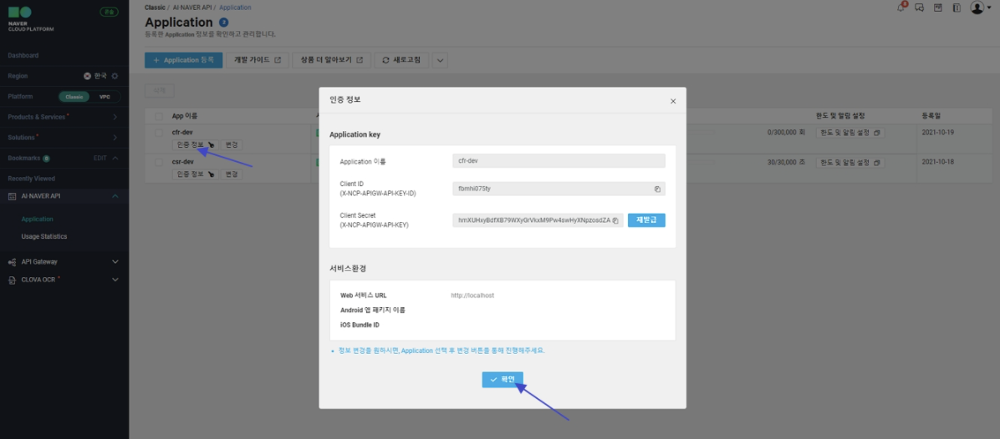

# Naver Clova

강의에서 제공해주는 계정을 통해 Naver Clova AI API 활용 실습 진행


## Naver Clova 음성인식 AI API 활용(CSR)

- 문자 -> 음성, 음성 -> 문자로 변환을 제공하는 사이트
- 최대 100자까지 지원되며, 한글은 50자 까지만 지원됨.  
- https://soundoftext.com/


- 문자 -> 음성

- Play 확인 및 sample.mp3로 다운로드


### Naver Cloud 

- AI Service 접속 -> Clova Speech Recognition(CSR) 이용신청
- Application 등록 후 Service선택 , 서비스환경 등록 -> web Service URL : `http://localhost`
- 한도 및 알림 설정(월별 한도 설정 : 30,000 , 50% (약 8시간, 최소값) / 일별 한도 설정 :  3,600 , 90% (1시간))
- 인증정보 확인 (-> Python 에서 Client ID, Client Secret 이용)


### Naver Clova 음성 인식 AI API 활용 Python 테스트

> ainaver/notebook/csr/CSR-음성인식.ipynb

```python
!pip show requests
 
# !pip install requests
 
import requests
client_id = "1fpjq.............."
 
client_secret = "h4....................................."
lang = "Kor" # 언어코드{Kor, Jpn, Eng, Chn}
url = "https://naveropenapi.apigw.ntruss.com/recog/v1/stt?lang=" + lang
# data = open('./hi.m4a', 'rb') # read byte
data = open('./msg2.mp3', 'rb')
# data = open('./ma.mp3', 'rb') # 60초넘어서 ST001 Error발생
headers = {
    "X-NCP-APIGW-API-KEY-ID": client_id,
    "X-NCP-APIGW-API-KEY": client_secret,
    "Content-Type" : "application/octet-stream"
}
response = requests.post(url, data=data, headers=headers)
rescode = response.status_code
if(rescode == 200):
    print(response.text)
else :
    print("Error : " + response.text)
```


## Naver Clova 문자 인식 AI API 활용 (OCR)

- 문서를 인식하고, 사용자가 지정한 영역의 텍스트와 데이터를 정확하게 추출한다.
- 100건까지 무료, 300건의 경우 600원의 이용 요금 부과됨

### 1. 서비스 신청

#### (1) ncloud 로그인

#### (2) CLOVA OCR

이용신청

#### (3) 설정

도메인이름, 도메인코드 자유롭게 설정가능, 인식언어 한국어,  서비스 타입은 General

- General 도메인 : 입력 이미지에서 텍스트만 추출하는 Text OCR
- Template 도메인: 입력 이미지에서 판독할 영역을 직접 지정해 영역에 포함된 텍스트만 추출

(요금안내 메세지 - 확인)

- 정상적으로 도메인 리스트가 등록된지 확인

#### (4) NCloud -> 서비스 -> API Gateway   

- API 사용 요금등 통합 모니터링 지원

- API Gateway 이용신청 -> 콘솔에서 확인

#### (5) Text OCR

Secret Key 생성 -> APIGW 자동 연동 

(SecretKey Python에서 사용할 것임으로 복사하여 보관)

#### (6) 설정완료

- APIGW Invoke URL Python에서 사용할 것임으로 복사하여 보관

### Python 테스트

> /OCR/OCR-문자 인식.ipynb

```python
import json
import base64
import requests
 
with open("./sample1.jpg", "rb") as f:
    img = base64.b64encode(f.read())
 
# 본인의 APIGW Invoke URL로 치환
URL = "https://f121a84............................................................................"
   
# 본인의 Secret Key로 치환
KEY = "aE9w..................................................................................."
    
headers = {
    "Content-Type": "application/json",
    "X-OCR-SECRET": KEY
}
    
data = {
    "version": "V1",
    "requestId": "sample_id", # 요청을 구분하기 위한 ID, 사용자가 정의
    "timestamp": 0, # 현재 시간값
    "images": [
        {
            "name": "sample_image",
            "format": "jpg",
            "data": img.decode('utf-8')
        }
    ]
}
data = json.dumps(data)
response = requests.post(URL, data=data, headers=headers)
res = json.loads(response.text)
print(res)

print(res['images'][0]['fields']) # 단어 정보와 밀접한 부분

# return 되는 JSON 형식 분해
# [
#   {
#     'valueType': 'ALL', 
#     'boundingPoly': {'vertices': [{'x': 356.0, 'y': 35.0}, {'x': 424.0, 'y': 35.0}, {'x': 424.0, 'y': 62.0}, {'x': 356.0, 'y': 62.0}]}, 
#     'inferText': '사랑의', 
#     'inferConfidence': 0.9993
#   }, 
#   {
#     'valueType': 'ALL', 
#     'boundingPoly': {'vertices': [{'x': 431.0, 'y': 34.0}, {'x': 501.0, 'y': 34.0}, {'x': 501.0, 'y': 63.0}, {'x': 431.0, 'y': 63.0}]},
#     'inferText': '불시착', 
#     'inferConfidence': 1.0
#   }, 
#   {
#     'valueType': 'ALL', 
#     'boundingPoly': {'vertices': [{'x': 504.0, 'y': 35.0}, {'x': 562.0, 'y': 35.0}, {'x': 562.0, 'y': 61.0}, {'x': 504.0, 'y': 61.0}]}, 
#     'inferText': '주연:', 
#     'inferConfidence': 0.9982
#   }, 
#   {
#     'valueType': 'ALL', 
#     'boundingPoly': {'vertices': [{'x': 567.0, 'y': 35.0}, {'x': 623.0, 'y': 35.0}, {'x': 623.0, 'y': 64.0}, {'x': 567.0, 'y': 64.0}]},
#     'inferText': '현빈,',
#     'inferConfidence': 0.9996}, 
#   {
#     'valueType': 'ALL',
#     'boundingPoly': {'vertices': [{'x': 626.0, 'y': 35.0}, {'x': 694.0, 'y': 35.0}, {'x': 694.0, 'y': 61.0}, {'x': 626.0, 'y': 61.0}]},
#     'inferText': '손예진',
#     'inferConfidence': 0.9978
#   }
# ]

# print(len(res))
words = res['images'][0]['fields']
print(type(words)) # 단어의 수
print(len(words)) # 단어의 수
print(type(words[0])) # <class 'dict'>

wlist = []
for word in words:
    wlist.append((word['inferText']))
    
print(" ".join(wlist))
```


## Naver Clova 이미지 인식 AI API 활용(CFR)

- 1 ~ 1000건까지는 1000 원의 요금 부과, 1회만 사용해도 1000원이며, 서비스 이용이 1000회를 초과하면 1000원 단위로 요금 증가
- 공식 문서: https://developers.naver.com/docs/clova/api/CFR/API_Guide.md#%EC%9D%91%EB%8B%B5-2
- 국내 유명인 위주로 인식을 잘함.


### 1. 서비스 신청

#### (1) ncloud 로그인

#### (2) CLOVA CFR

- AI Service -> Clova Face Recongnition(CFR) 선택 -> 이용신청하기 -> 
  \+ Application 등록 

- CFR 선택, Application cfr-dev


- Web서비스 URL : http://localhost


- 인증정보 확인
- Python에서 사용할 인증 정보 확인



- 한도 및 알림 설정(1,000, 90%)


- 설정 완료


### 2. Python 테스트

> /CFR/CFR-이미지 인식.ipynb

```python
import os
import sys
import requests
import json
 
client_id = "fb........................."
client_secret = "hm....................................................."
 
url = "https://naveropenapi.apigw.ntruss.com/vision/v1/celebrity" 
 
# 유명인 얼굴인식
 
# files = {'image': open('./조정석.jpg', 'rb')}
# {"info":{"size":{"width":390,"height":429},"faceCount":1},"faces":[{"celebrity":{"value":"조정석","confidence":1.0}}]}
 
# files = {'image': open('./김남길.jpg', 'rb')}
# {"info":{"size":{"width":500,"height":291},"faceCount":1},"faces":[{"celebrity":{"value":"김남길","confidence":0.18698}}]}
 
# files = {'image': open('./이하늬.jpg', 'rb')}
# {"info":{"size":{"width":390,"height":532},"faceCount":1},"faces":[{"celebrity":{"value":"이하늬","confidence":1.0}}]}
 
files = {'image': open('./검은 사제들.jpg', 'rb')}  # 3명 찾음.
# {"info":{"size":{"width":768,"height":432},"faceCount":5},"faces":[{"celebrity":{"value":"문지인","confidence":0.105306}},{"celebrity":{"value":"이하늬","confidence":1.0}},{"celebrity":{"value":"최필립","confidence":0.207688}},{"celebrity":{"value":"김남길","confidence":0.357709}},{"celebrity":{"value":"김성균","confidence":0.958674}}]}
 
headers = {'X-NCP-APIGW-API-KEY-ID': client_id, 'X-NCP-APIGW-API-KEY': client_secret }
response = requests.post(url,  files=files, headers=headers)
rescode = response.status_code
 
if(rescode==200):
    print (response.text)
    data = json.loads(response.text)
    print('발견된 얼굴수: {0} 명'.format(len(data['faces'])))
    
    for i in range(len(data['faces'])):
        name = data['faces'][i]['celebrity']['value']
        per = data['faces'][i]['celebrity']['confidence']
        print("감지된 얼굴 {0}: {1} {2} %".format(i+1, name, round(per*100)))
else:
    print("Error Code:" + rescode)
```


## Naver Clova 객체 탐지(물체 감지) AI API 활용

- 1 ~ 1000건까지는 1250 원의 요금 부과, 1회만 사용해도 1250원이며, 서비스 이용이 1000회를 초과하면 1000건 단위로 1250원 요금 증가
- 공식 문서: https://api.ncloud-docs.com/docs/ai-naver-objectdetection
- 국내 유명인 위주로 인식을 잘함.
- 응답 구조

```python
predictions[0]['detection_classes'] List: 탐지된 객체의 클래스 번호
predictions[0]['detection_names'] List: 탐지된 객체의 클래스 이름
predictions[0]['num_detections']  Number: 탐지된 객체의 수
predictions[0]['detection_boxes']  List<Number, Number, Number, Number>: 탐지된 객체의 바운딩 박스 좌표 (x1, y1, x2, y2)
predictions[0]['detection_scores'] List: 탐지된 객체의 정확도, 확률값
```


### 1. 서비스 신청

#### (1) ncloud 로그인

#### (2) Object Detection

- AI Service -> Object Detection 선택 -> 이용신청하기 -> 
  \+ Application 등록 -> Application : object-dev


- Web 서비스 URL : http://localhost


- Python에서 사용할 인증정보 확인 , 한도 및 알림설정 한다.

- 월별 한도 설정 : 1000, 90%, 일별 한도 설정 : 1000, 90%


### 2. Python 테스트

> Object-Detection-물체감지.ipynb

```python
import os
import sys
import requests
import json
import collections
client_id = "pea..............." # "YOUR_CLIENT_ID"
client_secret = "ZXE.........................." # "YOUR_CLIENT_SECRET"
url = "https://naveropenapi.apigw.ntruss.com/vision-obj/v1/detect" # 객체 인식
# files = {'image': open(file_name, 'rb')}
# Counter({'car': 18, 'truck': 13, 'bus': 3})
files = {'image': open('./검은 사제들.jpg', 'rb')}
# Counter({'person': 6, 'handbag': 1})
headers = {'X-NCP-APIGW-API-KEY-ID': client_id, 'X-NCP-APIGW-API-KEY': client_secret }
response = requests.post(url,  files=files, headers=headers)
rescode = response.status_code
if(rescode==200):
    print (response.text)
    data = json.loads(response.text)
    print('발견된 물체수: {0} 명'.format(data['predictions'][0]['num_detections']))
    detection_names = data['predictions'][0]['detection_names']
    print(detection_names)
    count = collections.Counter(detection_names)
    print(count)
    print('car:', count['car'])
    print('truck:', count['truck'])
    print('bus:', count['bus'])
else:
    print("Error Code:" + rescode)
```


