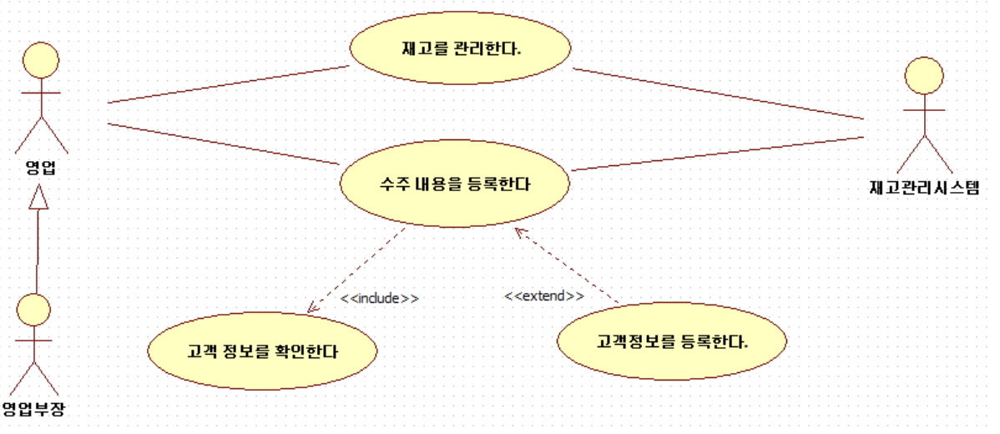

# OOAD

Object-oriented analysis and design

## [OOAD] 요구 사항 정의(Defining Requirement)

 

### 1. 요구 사항 정의(Defining Requirement)

- 기능적 모델링(Functional Modeling)
- 요구되는 기능 정의

 

#### 1)  유스케이스 다이어그램(UseCase Diagram)

- 외부로 부터 본 시스템의 기능(행동)을 표현한다. 즉 어떤 시스템을 외부(사용자 등)에서 봤을때, 이 시스템에 어떠한 기능이 존재하는가를 확인할 수 있다.
- 요구 분석등의 상위작업에서 사용되며, 사용자의 '이 기능이 필요하다'라는 요구(기능 요구)를 정리하여 개발 대상을 명확하게 하기 위해 사용한다.


 #### 2) 유스케이스 다이어그램(UseCase Diagram)의 주요 요소 

- 액터(Actor)
  어떤 시스템을 중심으로 봤을때,  그 외부에 존재하는 것을 나타낸다. 일반적으로 시스템의 사용자나 관련된 외부의 시스템을 나타낸다.

  액터는 사람모양을의 아이콘으로 표기하며, 액터를 추상화 하거나 구체화할 경우에는 액터간의 일반화(generalization) 관계로 표현할 수 있다.

  일반화 관계는 객체 지향의 상속과 그 의미가 유사하며, 일반화 액터의 모든 기능을 특수화한 액터가 갖게 된다. 아래의 그림은 영업이 일반화 액터이고, 영업부장이 특수한 액터가 된다.

- 유스 케이스(UseCase)
  어떤 시스템을 외부에서 봤을 때, 그 시스템이 가지고 있는 기능을 나타내는 것이다. 
  그래서 외부로 부터 파악할 수 없는 레벨의 내부처리는 유스케이스로 표현하지 않는다.

  유스케이스는 타원형으로 표기하고, 타원 안에 이름을 기술한다. 어떤 기능이 다른 기능을 포함할 경우에는, 유스케이스간에 포함(include)관계를 사용해서 표현한다.

  또, 어떤 기능을 확장해서 기능(처리)를 추가할 경우에는 유스케이스 간에 확장(extends)의 관계를 사용해서 표현한다.


  아래의 그림은 수주 내용을 등록하기 위해서 고객정보를 등록하는 작업을 확장(추가)하고, 고객정보를 확인 하는 작업을  포한 함고 있다.

- 관련(Association)
  양쪽 끝에 화살모양이 없는 실선 모양으로 유스케이스와 액터간의 관련성을 나타낸다.

[UseCase Diagram 예]




#### 3) 유스케이스 정의서 작성

##### Usecase Specification(유즈케이스 정의서)

- 회사마다 독립적인 양식이 있으며 엑셀, 워드, 프로젝트 관리 솔루션등을 이용한다. 

ex)

```
Usecase 번호: mem01_회원가입
 
Actor     System
----------------------------------
비회원    1) 아이디 중복 확인
             - 아이디 중복되면 Ex01
          2) 별명 중복 확인
             - 별명 중복되면 Ex02
          3) 주민등록번호 중복 검사
             - 주민등록번호 중복되면 Ex03 
          4) 이메일 중복 검사
             - 이메일 중복되면 Ex04 
          5) 기타 정보 입력 후 전송
 
 
예외 처리
         Ex01: 아이디 중복 안내 창 출력
         Ex02: 별명 중복 안내 창 출력
         Ex03: 주민등록번호 중복 안내 창 출력
         Ex04: 이메일 중복 안내 창 출력
```

=> Usecase Specification(유즈케이스 정의서)까지 만들어 질 경우 의뢰인의 의도를 구체적으로 어느정도 파악 할 수 있게 된다.


