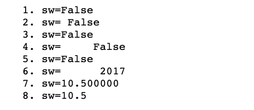

# Python


## 데이터 타입, 논리형, 숫자형과 연산자


### 1. 데이터(자료) 형(data type)

- 프로그램의 실행 흐름: 입력 기능 → 처리 기능 → 출력 기능
- 데이터를 입력하여 처리하고 출력하면서 메모리에 저장하며, 그 기준은 사전에 지정된 데이터 타입을 기준으로 메모리를 할당한다.
- 파이썬은 숫자등 데이터를 객체 기반의 형태로 저장하고 출력한다.

- basic / 논리형과숫자형_연산자.ipynb 파일 생성
   

- None
  아무런 값이 없다는 것을 나타내는 기호 

- Boolean형
  True, False 값 사용, 첫자 대문자 주의

- 정수형
  객체 기반의 음의 정수, 양의 정수를 저장한다.

- 실수형
  소수점이 들어간 실수를 저장한다.

- 문자열형
  문자열을 저장 할 수 있으며 여러라인도 가능하다.

- 주석 

  한라인 주석: #

  여러라인 주석: '''  .....  ''' or """ ..... """


#### (1) 논리형 (Boolean)

- bool 값을 표현하기 위해 0과 1을 써도 쉽게 작성할 수는 있지만, 가독성과 유지보수를 위해 True, False 사용 (첫 글자 대문자)
- if 나 while문에서 사용된다.

```python
sw = True
print(sw)

print("sw")
 
sw = False
print(sw)
```

실행 결과


#### (2) 숫자형 

- int( 정수), float(실수), complex(복소수)
- 연산이 가능한 데이터 타입.
- 변수 선언시 데이터 타입을 선언하지 않는다.

##### 1) 정수형 자료

- 프로그램에서 일반적으로 사용되는 정수형은 10진수 이다.
- 컴퓨터는 0과 1로 표현되는 2진수로 처리하기 때문에 코드에서 8진수나 16진수를 사용하는 것이 편리한 경우가 있다.
- python에서 2진수는 0b, 8진수 0o, 16진수 0x로 시작하는 수이며, 정수형의 값은 최소 최대 값이 없고, 메모리가 허용하는 범위에서 지원 가능한 수를 사용한다.
- 정수를 대입한 변수를 출력하면 모두 10진수로 출력된다.

```python
#정수형 자료
int_data = 10
bin_data = 0b10
oct_data = 0o10
hex_data = 0x10
long_data = 12345678901234567891234567890123456789
print(int_data)
print(bin_data)
print(oct_data)
print(hex_data)
print(long_data)
```

실행 결과 


##### 2) 실수형 자료

- 실수는 e를 사용할 수 있다 e는 10의 거듭제곱을 나타낸다.

e2   -> 10² 
e-3  -> 10￣³
1.56e3  -> 1.56 * 10³
-7e-4 -> -7 * 10￣⁴

✓ print 출력

```python
# print("sw=" + sw)  # ERROR
print("1. sw=" + str(sw)) # 문자열 결합
print("2. sw=", sw)
print("3. sw=%s" % sw)  #%s 문자열을 나타내는 format 문자
print("4. sw=%10s" % sw) #%10s 10자리의 문자열을 나타내는 format 문자 -오른쪽부터 채워 출력
print("5. sw=%-10s" % sw) #%-10s 10자리의 문자열을 왼쪽부터 채워 출력
print("6. sw=%10d" % 2017) #%10d 10자리의 정수을 나타내는 format 문자 - 오른쪽부터 채워출력
print("7. sw=%f" % 10.5) #%f는 실수를 나타내는 format 문자
print("8. sw=%.1f" % 10.5)    # 소수점 1자리 지정
```

실행 결과




##### 3) 복소수형

- 복소수 형은 실수부와 허수부로 되어 있다. 우리가 배운 수학에서 허수부는 i로 되어있지만 파이썬에선 j를 이용한다.
- 복소수형 자료에서 실수부만 취하려면 real을 이용하며, 허수부만 취하려면 imag를 이용한다. 
- 실수부와 허수부를 구성하는 숫자는 실수형 상수로 구성된다.
- complex()를 이용해 복소수형 상수를 구성할 수 있다.

```python
c1 = 1+7j
print(c1.real) #실수부
print(c1.imag) #허수부
c2 = complex(2, 3)
print(c2)
```

실행결과


#### (4) 연산자


##### 1) 수학연산자

| 연산자 | 설명                    |
| ------ | ----------------------- |
| +      | 덧셈                    |
| -      | 뺄셈                    |
| *      | 곱셈                    |
| /      | 나눗셈                  |
| //     | 나눗셈의 몫             |
| %      | 모듈로(나눗셈의 나머지) |
| **     | 지수 연산자             |
| +var   | 단항 덧셈               |
| +var   | 단항 뺄셈               |

- (//) 나눗셈은 나눗셈의 결과에서 자동적으로 소수점 이하를 버리고 정수를 남긴다.
- (**) 거듭제곱 연산자는 예상할 수 있듯이, 연산자 왼쪽에 있는 숫자를 n번 곱한 결과를
    반환하며, 연산자 오른쪽의 n은 숫자를 나타낸다.
- 연산자 우선순위 : (), 거듭제곱, 곱셈/나누셈, 덧셈/뺄셈

```python
print(10 - 6)
 
print(9 * 7)
 
print(36 // 5)  #정수형 결과
 
print(36 / 5) #실수형 결과

print(36 / 5)
 
# 나머지를 반환하는 
print(36 % 5)
 
# 5의 제곱 
print(5**2)
 
# 100의 제곱
print(100**2) 
```


```python
a = 2
b = 4
ret1 = a+b
ret2 = a - b
ret3 = a*b         
ret4 = a/b         
ret5 = a**b        
ret6 = a+a*b/a     #*->/->+->-
ret7 = (a+b)*(a-b)  #()
ret8 = a*b**a   
print (ret1)
print (ret2)
print (ret3)
print (ret4)
print (ret5)
print (ret6)
print (ret7)
print (ret8)
```


```python
print("0 % 3 = " + str(0 % 3))
print("1 % 3 = " + str(1 % 3))
print("2 % 3 = " + str(2 % 3))
print("3 % 3 = " + str(3 % 3))
print("4 % 3 = " + str(4 % 3))
print("5 % 3 = " + str(5 % 3))
 
year = 2015
print("1)" + str(year) + " 년")
 
year = year + 1
print("2)" + str(year) + " 년")
 
year = year + 1
print("3)" + str(year) + " 년")
 
year += 1
print("4)" + str(year) + " 년")
 
year -= 1
print("5)" + str(year) + " 년")
 
val = 55.567
print("최초의 값 val: " + str(val))
 
val = val * 100
print("val: " + str(val))
 
val = int(val)  #정수형으로 변환(정수만가져옴)
val = val / 100
print("val: " + str(val))
 
print("2 ** 3: " + str(2 ** 3))
```


##### 2) 수학 내장 함수

| 기능            | 설명                                                        |
| --------------- | ----------------------------------------------------------- |
| abs(var)        | 절대값                                                      |
| pow(x,y)        | **연산자 대신에 사용 가능                                   |
| pow(x,y,modulo) | 삼항 지수 - 나머지 (x**y) % modulo                          |
| round(var[,n])  | 10-n 또는 (10**-n)의 반올림한 근사치를 반환 (n : default 0) |
| divmod(x,y)     | 나눗셈의 몫과 나머지로 이루어진 튜플을 반환                 |


```
```


##### 3) 비교 연산자

| 연산자 | 설명        |
| ------ | ----------- |
| >      | 큼          |
| <      | 작음        |
| >=     | 크거나 같음 |
| <=     | 작거나 같음 |
| !=     | 같지 않음   |
| ==     | 같음        |


##### 4) 비트 연산자

| 연산자 | 설명                                                         |
| ------ | ------------------------------------------------------------ |
| &      | 논리곱 연산자. 비트가 두 항에 모두 나타나는 경우 비트를 결과에 복사 |
| \|\|   | 논리합 연산자. 비트가 두 항 중 어느곳에 나타나는 경우 비트를 결과에 복사 |
| ^      | 배타적 논리합 연산자. 어느 한 쪽의 항에만 비트가 존재할 경우 비트를 결과에 복사 |
| ~      | 부정 연산자. 비트를 뒤집어서 각 비트에 대해 정확히 반대를 반환 |

```python
#비트연산자

print(14 & 27)
 
print(14 | 27)
 
print(14 ^ 27)
 
print(~14)
 
print(~27)
```


##### 5) 이동연산자

| 연산자 | 설명                                                |
| ------ | --------------------------------------------------- |
| x << n | 왼쪽으로 이동 (숫자 x에 2를 n번 곱한 것과 동등함)   |
| x >> n | 오른쪽으로 이동 (숫자 x를 2로 n번 나눈 것과 동등함) |

- 왼쪽 이동 연산자는 왼쪽 항의 값을 오른쪽 항에서 지정한 비트만큼 왼쪽으로 이동시킨다.
- 오른쪽 이동 연산자는 정확히 반대로 동작하여, 왼쪽 항의 값을 오른쪽 항에서 지정한 비트만큼 오른쪽으로 이동시킨다.
- 본질적으로 왼쪽 이동 연산자는 왼쪽에 있는 항에다가 오른쪽 항에서 지정한 횟수만큼 숫자 2를 곱하는 셈이다.
- 반대로 오른쪽 이동 연산자는 왼쪽에 있는 항을 오른쪽 항에서 지정한 횟수만큼 2로 나누는 것이다


## 시퀀스 자료형

### 시퀀스 자료형

- 어떤 객체가 순서를 가지고 나열되어 있는 것을 말한다.
- 파이썬의 시퀀스 자료형은 문자열, 리스트, 튜플
- 문자열은 문자나 기호들이 순서대로 나열되어 있는 시퀀스 자료형이다.
- 리스트는 임의의 객체가 순서대로 나열되어 있는 시퀀스 자료형이다.
- 튜플은 리스트와 마찬가지로 값을 변경할 수 없는 임의의 객체가 나열되어 있는 시퀀스 자료형이다.

#### (1) 시퀀스 자료 인덱싱

- 인덱싱를 통해서 해당 값을 얻는 방법이다.
- 0부터 사용하며 음수 인덱스도 사용 가능하다.(끝에서 부터 몇번째 라는 의미이다.)
- `basic / 시퀀스_문자열_형변환함수.ipynb` 생성

```python
strdata = 'Time is money!!'
print(strdata[5])     # ‘i'가 출력됨
print(strdata[-2])    # ‘!’가 출력됨

listdata = [1, 2, [1, 2, 3]]
print(listdata[0])     # 1이 출력됨
print(listdata[-1])    # [1, 2, 3]이 출력됨
print(listdata[2][-1])  # 3이 출력됨
```


#### (2) 시퀀스 슬라이싱

- 시퀀스 자료형에서 일정범위에 해당하는 부분을 취하는 방법이다.
- [시작인덱싱 : 끝 인덱싱 : 스텝(간격)]
- [m:n] m이상 n미만
- [:n]  처음부터 n미만
- [m:] m부터 자료끝까지
- [:-n] 처음부터 끝에서 n번째 미만인 요소까지
- [-m:] 자료의 끝에서m번째 요소부터 시퀀스 자료의 끝까지 


```python
strdata = 'Time is money!!'
print(strdata[1:5])   # ‘ime’가 출력됨
print(strdata[:7])    # ‘Time is’가 출력됨
print(strdata[9:])    # ‘oney!!’가 출력됨
print(strdata[:-3])   # ‘Time is mone’이 출력됨
print(strdata[-3:])   # ‘y!!’이 출력됨
print(strdata[:])    # ‘Time is money!!’가 출력됨
print(strdata[::2])  # ‘Tm smny!’가 출력됨
```


#### (3) 시퀀스 자료 연결(+)

- 자료형이 동일한 두개의 시퀀스 자료를 '+' 연산자로 순서있게 연결하여 새로운 시퀀스 자료로 만들 수 있다.

```python
strdata1 = 'I love '; strdata2 = 'Python'; strdata3 = 'you'
print(strdata1 + strdata2)     # ‘I love Python’이 출력됨
print(strdata1 + strdata3)     # ‘I love you’가 출력됨

listdata1 = [1, 2, 3]; listdata2 = [4, 5, 6]
print(listdata1 + listdata2)    # [1, 2, 3, 4, 5, 6]이 출력됨
```


#### (4) 시퀀스 자료의 반복(*) 및 자료의 크기, 멤버체크 in

- 동일한 시퀀스 자료를 반복하여 새로운 자료를 만들고자 하면 * 연산자 사용
- len() 함수를 이용한면 시퀀스 자료의 크기를 알 수 있다.
- in은 자료에 어떤 값이 있는지 없는지 확인할 수 있다.

```python
artist = '빅뱅'
sing = '뱅~'
dispdata = artist + '이 부르는 ' + sing*3
print(dispdata)  # ‘빅뱅이 부르는 뱅~뱅~뱅~’이 출력됨


strdata1 = 'I love python'
strdata2 = '나는 파이썬을 사랑합니다'
listdata = ['a', 'b', 'c', strdata1, strdata2]
print(len(strdata1))    # 13이 출력됨
print(len(strdata2))    # 13이 출력됨
print(len(listdata))     # 5가 출력됨
print(len(listdata[3]))  # 13이 출력됨
print(listdata[3])
```


### 문자열

- 여러문자로 구성되어 있고, 다른 문자와 연결될 수 있으며 데이터에 포함 문자열의 길이를 확인할 수 있는 데이터 타입(str)
- ('), (")로 감싸면 문자열로 인식한다. (' ' '), (" " ")로 감싸면 여러 줄인 경우에 사용된다.

```python
print("안녕하세요")
print('안녕하세요')
 
print('''
        안녕하세요
        반갑습니다.
        다시봅시다.
''')
    
print(' 안녕하세요\n'
       '반갑습니다.\n'
        '다시봅시다.')
```


```python
# 문자열 중간에 (') 출력하기

print("안녕하세요 '김길동' 입니다.")
print('안녕하세요 "박길동" 입니다.')

print("안녕하세요 \"홍길동\" 입니다.")
print('안녕하세요 \'홍길동\' 입니다.')
```


```python
# 문자열 메소드 사용하기 

our_string='python is the best language ever'
 
# 문자열의 첫 글자를 대문자로
print(our_string.capitalize())
 
# 가운데 정렬
print(our_string.center(50))
 
print(our_string.center(50,'-'))
 
# 문자열 내에서 부분문자열 세기
print(our_string.count('a'))
 
# 부분문자열 발생 횟수 세기
state = 'Mississippi'
print(state.count('ss'))
```


```python
# 문자열을 분할(partition)하면, 분리자의 앞 부분, 분리자, 
# 그리고, 그 분리자의뒷 부분의 세 원소로 이루어진 튜플을 반환
x = "Hello, my name is Josh"
print(x.partition('n'))
 
# 위와 똑같은 x가 있다고 할 때, 'l'을 분리자로 하여 문자열을 쪼개기(split)
print(x.split('l'))
# 보는 바와 같이 분리자는 반환되는 목록에 포함되지 않는다.
# maxsplits 값을 1로 하여 추가하게 되면, 가장 왼쪽부터 쪼개기가 이루어진다.
# maxsplits 값을 2로 주면, 가장 왼쪽 두 개의 쪼개기가 이루어진다.
print(x.split('l',1))
print(x.split('l',2))
```


#### (1) 문자열 포맷팅

- 변하는 값을 나타내기 위해 사용되는 기호를 포맷 문자열이라 한다.
- %s  문자열에 대응됨
- %c  문자나 기호 한개에 대응됨
- %f  실수에 대응됨
- %d 정수에 대응됨
- %% '%'라는 기호 자체를 표시함

```python
txt1 = '자바';txt2='파이썬'
num1= 5; num2=10
print('나는 %s보다 %s에 더 익숙합니다.' %(txt1, txt2))
print('%s은 %s보다 %d배 더 쉽습니다.' %(txt2, txt1, num1))
print('%d + %d = %d' %(num1, num2, num1+num2))
print('작년 세계 경제 성장률은 전년에 비해 %d%% 포인트 증가했다.' %num1)
 
# 전체 자리수.소수 자리수f, 전체 자리수에 소수 자리수가 포함됨, 반올림 안됨
no3 = 12.35
print('%3.2f%%' % no3)
print('%5.2f%%' % no3)
print('%5.1f%%' % no3)
```


```python
# end='' :줄바꿈 없이
# \r : 캐리지 리턴(Carriage Return) 은 현재 위치를 나타내는 커서 를 맨 앞으로
#      이동시킨다는 뜻이다.

from time import sleep
 
for i in range(100):
    msg = '\r진행률 %2d%%' %(100-i-1)
    print(msg, end='')
    sleep(0.1) # 0.1초동안 중지됨
```


(진행률이 점점 줄어든다.)


#### (2) 이스케이프 문자

##### 1) '\'
- print()안에 문장이 길어질때 '\'를 입력하면 에러 없이 다음 줄의 내용도 출력된다.

##### 2) 이스케이프 문자

- \n: 줄 바꾸기
- \t: Tab
- \\: '\' 출력
- \', \": ', "의 출력 

```python
print('나는 파이썬을 사랑합니다.\n파이썬은 자바보다 훨씬 쉽습니다.')
print('Name: John Smith\tgender: Male\tAge: 22')
print('이 문장은 화면폭에 비해 너무 길어 보기가 힘듭니다. \
그래서 \\Enter키를 이용해 문장을 다음줄과 연속되도록 했습니다.')
print('작은따옴표(\')와 큰 따옴표(")는 문자열을 정의할 때 사용합니다.')
```


#### (3) 문자열 함수 및 in

- in으로 문자열에서 특정한 문자나 문자열이 있는지 확인한다.
- len() : 문자열의 길이
- count() : 문자열에 있는 문자 갯수 구한다.
- isalpha() : 문자열만 있는지 검사한다.
- isdigit() : 숫자만 있는지 검사한다.
- isalnum() : 문자열과 숫자만 있는지 검사한다.
- upper, lower 대소문자로 변환
- lstrip, rstrip, strip : 좌우 공백제거
- split : 특정 문자열로 분리하기
- join : 특정 문자열로 결합하기

```python
msg = input('임의의 문장을 입력하세요: ')
if 'is' in msg:
    print('당신이 입력한 문장에는 is가 있습니다.')
else:
    print('당신이 입력한 문장에는 is가 없습니다.')
```


```python
msg = input('임의의 문장을 입력하세요: ')
msglen = len(msg)
print('당신이 입력한 문장의 길이는 <%d> 입니다.' %msglen)
##################################################
txt = 'A lot of things occur each day, every day.'
word_count1 = txt.count('o')
word_count2 = txt.count('day')
word_count3 = txt.count(' ')
print(word_count1)  # 3이 출력됨
print(word_count2)  # 2가 출력됨
print(word_count3)  # 8이 출력됨
```


```python
# 빈공간이 있으면 isalpha()의 결과를 False값을 리턴하다.
txt1 = 'A'
txt2 = '안녕'
txt3 = 'Warcraft Three'
txt4 = '3PO'
ret1 = txt1.isalpha()
ret2 = txt2.isalpha()
ret3 = txt3.isalpha()
ret4 = txt4.isalpha()
print(ret1)        # True가 출력됨
print(ret2)        # True가 출력됨
print(ret3)        # False가 출력됨
print(ret4)        # False가 출력됨
```


```python
#숫자가 아님 False
txt1 = '010-1234-5678'
txt2 = 'R2D2'
txt3 = '1212'
ret1 = txt1.isdigit()
ret2 = txt2.isdigit()
ret3 = txt3.isdigit()
print(ret1)      # False가 출력됨
print(ret2)      # False가 출력됨
print(ret3)      # True가 출력됨
```


```python
# 문자나 숫자가 아닌 데이터(? . - 등 특수문자)가 들어가면 False

txt1 = '안녕하세요?'
txt2 = '1. Title-제목을 넣으세요'
txt3 = '3피오R2D2'
ret1 = txt1.isalnum()
ret2 = txt2.isalnum ()
ret3 = txt3.isalnum ()
print(ret1)      # False가 출력됨
print(ret2)      # False가 출력됨
print(ret3)      # True가 출력됨
```


```python
txt = 'A lot of Things occur each day.'
ret1 = txt.upper()
ret2 = txt.lower()
print(ret1)       # ‘A LOT OF THINGS OCCUR EACH DAY.’가 출력됨
print(ret2)       # ‘a lot of things occur each day.’가 출력됨
```


```python
txt = '   양쪽에 공백이 있는 문자열입니다.   '
ret1 = txt.lstrip()
ret2 = txt.rstrip()
ret3 = txt.strip()
print('<'+txt+'>')
print('<'+ret1+'>')
print('<'+ret2+'>')
print('<'+ret3+'>')
```


```python
# list = str.split() : 문자열에서 리스트로, 공백으로 구분 
# ” “.join( list ) : 리스트에서 문자열으로
a='Beautiful, is; better*than\nugly'
import re
re.split('; |, |\*|\n',a)
```


```python
url = 'http://www.naver.com/news/today=20160831'
log = 'name:홍길동 age:17 gender:남자 nation:한국'

ret1 = url.split('/')
print(ret1)
 
ret2 = log.split()
for data in ret2:
    d1, d2 = data.split(':')
    print('%s -> %s' %(d1, d2))

loglist = ['2016/08/26 10:12:11', '200', 'OK', '이 또한 지나가리라']
bond = ';'
log = bond.join(loglist)
print(log)
```


### 3. 형 변환 함수

- chr : 문자코드 값에 해당하는 문자 리턴
- ord : 문자에 해당하는 문자코드 값 리턴

```python
# 정수가 나타내는 문자를 반환
print(chr(4))
 
print( chr(10))

# 정수를 부동소수점수로 변환
print(float(8))
 

# 문자를 나타내는 정수 값으로 변환
print(ord('A'))
 
print(ord('C'))
 
print(ord('z'))
```


```python
# 빈공간, 문자를 입력하면 예외에 걸려서 메세지 출력
# 정수나 실수를 입력하면 정수 또는 실수 출력
numstr = input('숫자를 입력하세요: ')
try:
    num = int(numstr)
    print('당신이 입력한 숫자는 정수 <%d>입니다.' %num)
except:
    try:
        num = float(numstr)
        print('당신이 입력한 숫자는 실수 <%f>입니다.' %num) 
    except:
        print('+++ 숫자를 입력하세요~ +++')
```


```python
num1 = 1234
num2 = 3.14
 
numstr1 = str(num1)
numstr2 = str(num2)
print('num1을 문자열로 변환한 값은 “%s” 입니다.' %numstr1)
print('num2를 문자열로 변환한 값은 “%s” 입니다.' %numstr2)
```


## 데이터 타입의 가변형(mutable) vs. 불변형(immutable) 

- 가변형은 변경이 가능한 데이터의 성질을 의미하고, 불변형은 변경이 불가능한 데이터 성질을 의미한다. 
- list, dict, set은 가변형(mutable)이고, str과 tuple은 불변형 이다.
- 변형은 데이터 추가, 삭제 수정이 가능한 메서드를 가지고 있다.


## 데이터 구조 list, tuple, set, Dictionary

- 데이터구조란  

  데이터를 활용 방식에 따라 조금 더 효율적으로 이용할 수 있도록 컴퓨터에 저장하는 여러 방법들

- Python의 데이터 구조는 list, tuble, set, Dictionary


### (1) list

- 파이썬 프로그래밍 언어 내에서 가장 많이 쓰이는 구조
- 목록은 어떠한 파이썬 자료형이라도 저장할 수 있다.

```python
# 빈 목록을 정의
my_list = []
my_list = list()  # 가끔 사용됨
 
# 하나의 원소를 가진 목록
my_list = [1]
print(my_list)  
 
# 문자열 값의 목록을 정의
my_string_list = ['Hello', 'Python' ,'Lists']
 
# 복수의 자료형을 포함하는 목록을 정의
multi_list = [1, 2, 'three', 4, 'five', 'six']
 
# 목록을 포함하는 목록을 정의
combo_list = [1, my_string_list, multi_list]
 
# 목록을 포함하는 목록을 한 줄로 정의
my_new_list = ['new_item1', 'new_item2', [1, 2, 3, 4], 'new_item3']
print (my_new_list)
 
# 목록에서 원소를 얻기
print(my_string_list[0])
 
print(my_string_list[2])

 
# 음수 인덱스는 목록의 마지막 원소에서 시작하여 첫 항목 쪽으로 거슬러 감
print(my_string_list[-1])
 
print(my_string_list[-2])
 

# 시작 인덱스의 원소는 포함하고 끝 인덱스의 원소는 제외한다
print(my_string_list[0:2])
 

# 목록의 복사본을 생성
my_string_list_copy = my_string_list[:]
 
print(my_string_list_copy)
```


```python
# 새로운 리스트생성
new_list=[2, 4, 6, 8, 10, 12, 14, 16, 18, 20]
 
# 시작인덱스:끝인덱스:간격
# 이 예제는 한 칸 씩 이동(step)
print(new_list[0:10:1])
 

# 그리고 여기서는 두 칸 씩 이동
print(new_list[0:10:2])
 

# 시작 인덱스를 비워두면 기본값이 0을 지정한 것과 같이 동작하며, 
# 끝 인덱스에 대해서는 목록의 길이가 기본값임
print(new_list[::2])

 
# 목록의 원소를 수정. 이 경우는 9번 위치에 있는 원소를 수정함
new_list[9] = 25
print(new_list)

 
# append 메소드를 사용하여 목록에 값들을 추가
new_list=['a','b','c','d','e','f','g']
new_list.append('h')
print (new_list)

 
# 다른 목록을 기존 목록에 추가
new_list2=['h','i','j','k','l','m','n','o','p']
new_list.extend(new_list2)
print (new_list)

 
# 인덱스를 통해 특정 위치에 값을 삽입.
# 이 예제에서는 'c'를 목록에서 3 번째 위치에 추가
# (목록의 인덱스는 0부터 시작하므로, 인덱스 2가 실제로는 세번째 자리를 가리킴을 기억하라)
new_list.insert(2,'c')
print (new_list)

 
# 인덱스를 통해 특정한 위치로 목록을 삽입
another_list = ['a', 'b', 'c']
another_list.insert(2, new_list)
print(another_list)
```


