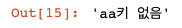
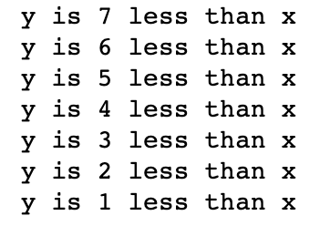
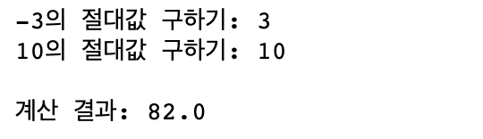
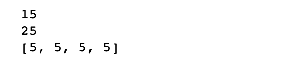

# Python


## 데이터구조 list, tuple, set, Dictionary


### 1. 데이터 타입의 가변형(mutable) vs 불변형(immutable)

- 가변형 : 변경이 가능한 데이터의 성질
- 불변형 : 변경이 불가능한 데이터의 성질
- list, dict, set은 가변형(mutable)이고, str과 tuple은 불변형 이다.
- 변형은 데이터 추가, 삭제 수정이 가능한 메서드를 가지고 있다.


### 2. 데이터 구조 list, tuple, set, Dictionary

- 데이터 구조란

  데이터를 활용한 방식에 따라 조금 더 효율적으로 이용할 수 있도록 컴퓨터에 저장하는 여러 방법들

- Python의 데이터 구조는 list, tuble, set, Dictionary


#### (1) list

- 파이썬 프로그래밍 언어 내에서 가장 많이 쓰이는 구조
- 목록은 어떠한 파이썬 자료형이라도 저장할 수 있다.


```python
# 썰기 표기법을 사용하여 목록 또는 순서의 일부를 덮어씀
new_listA=[100,200,300,400]
new_listB=[500,600,700,800]
new_listA[0:2]=new_listB
print (new_listA)
 

one = ['a', 'b', 'c', 'd']
two = ['e', 'f']
print(one)
 
print(two)
```


```python
# 시작과 종료 위치를 동일하게 하여 목록으로부터 빈 조각을 만들어낸다.
# 시작과 끝 위치를 동일하게 쓰는 한, 어느 위치든 상관 없음.
print(one[2:2])
 

# 이것에 대해 유용한 점은 이것을 빈 조각에 할당할 수 있다는 것이다.
# 이제, 'two' 목록을 'one'목록의 빈 조각에 할당함으로써 실제로는 'two' 목록을 'one' 목록에 삽입한다.
one[2:2] = two   # 'one' 목록의 원소 1과 2 사이를 'two' 목록으로 대체
print(one)
```


```python
# del 구문을 사용하여 값 또는 값의 범위를 목록으로부터 제거
# 모든 다른 원소가 이동하여 빈 공간을 채움에 유의
new_list3 = ['a','b','c','d','e','f']
del new_list3[2]
print(new_list3)
 
del new_list3[1:3]
print(new_list3)
 

# del 구문을 사용하여 목록을 제거
new_list3=[1,2,3,4,5]
print (new_list3)
 
del new_list3
#print (new_list3)  #오류
```


```python
# pop과 remove 함수를 사용하여 목록으로부터 값을 제거
new_list=['a','b','c','d','e','f','g']
print (new_list)


# 인덱스가 2인 원소를 pop한 값 리턴
print(new_list.pop(2))
#'c'
print (new_list)
 
# 목록에서 처음으로 나타나는 'g' 문자를 제거, 리턴안함
new_list.remove('g')
print (new_list)
```


pop() 함수를 사용하는 예제

```python
x = 5
times_list = [1,2,3,4,5]
while times_list:
    print(x * times_list.pop(0))
    
print(times_list)
```


#### (2) list 함수 사용하기


```python
# 어떤 주어진 값에 대한 인덱스를 반환
new_list=[1,2,3,4,5,6,7,8,9,10]
print(new_list.index(4)) #값이 4인 인덱스 리턴
 
#  인덱스가 4인 원소의 값을 변경
new_list[4] = 30
print(new_list)
 

# 이제, 값을 원상태로 되돌려놓자.
new_list[4] = 5
print(new_list)
 

# 이 목록에 중복된 값을 추가하고 인덱스를 반환
# 처음 나타나는 값의 인덱스를 반환함에 유의
new_list.append(6)
print(new_list)
 
print(new_list.index(6))
 

# 주어진 값과 동등한 원소의 갯수를 반환하도록 count() 함수를 사용
print(new_list.count(2))
 
print(new_list.count(6))


# 목록의 값들을 정렬
new_list.sort()
print(new_list)


# 목록의 값들의 순서를 반대로
new_list.reverse()
print(new_list)
```


```python
list1 = [1, 2, 3, 4, 5]

list2 = ['a', 'b', 'c']

list3 = [1, 'a', 'abc', [1, 2, 3, 4, 5], ['a', 'b', 'c']]

list1[0] = 6

print(list1)      # [6, 2, 3, 4, 5]가 출력됨

def myfunc():
    print('안녕하세요')

list4 = [1, 2, myfunc]

list4[2]()       # ‘안녕하세요’ 가 출력됨
```


#### (3) tuple

- 변경할 수 없는 list형
- tuple형은 서로다른 종류의 데이터형으로 이루어진 항목들을 바로 풀어쓰는 언패킹 또는 색인을 매기는 용도로 사용한다.
- **()기호로 감싸거나 아예 감싸지 않는 방법**으로 선언한다.


```python
## 튜플

#tuple 생성 
t2 = [1,2,3],[4,5,6]
print(t2)
 
print(t2[0])
 
#tuple은 변경할 수 없기때문에 에러남
#t2[0] = [7,8,9]
 

t2[0][0] = 7
print(t2)
```


```python
# 변수 movie에 4개의 서로 다른 자료형이 하나의 튜풀로 포장되었다.
# 이개념 튜플패키징이라고 하다.
movie ='슈퍼맨',1234,'배트맨',4321
print(movie)
 
#반대로 아래 예제 처럼 튜플을 항목별로 각각 풀어서 할당하는 개념을 튜플 언패킹이라고 한다.
a,b,c,d = movie
print(a)
print(b)
print(c)
print(d)
```


```python
# 숫자 튜풀생성
tuple1 = (1, 2, 3, 4, 5)

# 문자 튜풀생성
tuple2 = ('a', 'b', 'c')

# 다양한 타입의 튜풀생성
tuple3 = (1, 'a', 'abc', [1, 2, 3, 4, 5], ['a', 'b', 'c'])

#오류
#tuple1[0] = 6
 

def myfunc():

     print('안녕하세요')

#함수도 포함해서 튜풀생성

tuple4 = (1, 2, myfunc)

tuple4[2]()       # ‘안녕하세요’ 가 출력됨
```


#### (4) set

- 색인에 대한 순서가 없고 중복이 허용되지 않는 데이터들의 집합
- set()함수로만 set생성이 가능하다.

```python
# 다음의 구문을 써서 집합을 생성한다
myset = set([1,2,3,4,5])
print(myset)
#---------------------------------
{1, 2, 3, 4}
 
# 집합에 값을 추가. 자세한 내용은 
myset.add(6)
print(myset)
 
# 중복되는 원소의 추가를 시도
myset.add(4)
print(myset)
#---------------------------------
{1, 2, 3, 4, 6}
```


```python
# 두 개의 집합을 생성
s1 = set(['python','cpython','ironpython'])
s2 = set(['python','ironpython','pypy'])
 
# 집합의 사본을 만듦
s3 = s1.copy()
print(s3)

#교집합
print(s1.intersection(s2))
#---------------------------------------
{'ironpython', 'python'}


#차집합
print(s1.difference(s2))
#---------------------------------------
{'cpython'}
 

#합집합
print(s1.union(s2))
#-------------------------------------------
{'cpython', 'ironpython', 'pypy', 'python'}


#합집합 - 교집합
print(s1.symmetric_difference(s2))
#---------------------------------------
{'cpython', 'pypy'}
```


```python
# 세 개의 집합을 생성
s1 = set([1, 2, 3, 4, 5, 6, 7, 8, 9, 10])
s2 = set([5, 10, 15, 20])
s3 = set([2, 4, 6, 8, 10])
 
# s2로부터 임의의 원소를 제거
s2.pop()
 
print(s2)
 

# s1에 3과 동일한 원소가 존재하는 경우 폐기
s1.discard(3)
print(s1)
 

# s1과 s2 양쪽 모두에 속하는 원소들만을 가지도록 s1을 갱신
s1.intersection_update(s2) # s1과 s2의 교집합으로 s1을 갱신
print(s1)
print(s2)
```


```python
# s2의 모든 원소를 제거
s2.clear()
print(s2)
 

# 집합 s3의 모든 원소를 포함하도록 s1을 갱신
s1.update(s3) #s1에 s3값을 포함시켜서 갱신
print(s1)
```


#### **(5) Dictionary**

- 전체항목이 정렬되지 않는 키(key)와 값(Value)의 쌍으로 구성된 집합
- 순서가 없는 집합이다.
- key와 value값으로 저장된다. {}를 이용하여 생성한다.
- 요소를 참조할때는 []를 사용한다.

```python
# 빈 사전 및 채워진 사전을 생성
myDict={}
print(myDict.values())
 

# 사전에 키-값 쌍을 할당
myDict['one'] = 'first'
myDict['two'] = 'second'
print(myDict)
 
 
 
# 사전에서 키를 찾아봄
print('firstkey' in myDict)
 

# 사전에 키/값 쌍을 추가
myDict['firstkey'] = 'firstval'
 
 
 
# 사전의 값들을 나열
print(myDict.values())
 

# 사전의 키들을 나열
print(myDict.keys())
 

# 사전의 길이(키/값 쌍이 얼마나 들어있는지)를 표시
print(len(myDict))
 

# 사전의 내용을 출력
print(myDict)
```


```python
myDict2 = {'r_wing':'Josh','l_wing':'Frank','center':'Jim','l_defense':'Leo','r_defense':'Vic'}
print(myDict2.values())
 
print(myDict2.get('r_wing')) #Josh출력
 
print(myDict2['r_wing'])  #Josh출력
```


```python
myDict2.get('aa','aa키 없음')
```



```python
for player in myDict2.items():
    print(player)
```


## 제어문, 키보드 입력, 출력문

(파일명 : `제어문_키보드입력_출력문_1025.ipynb`)

### 1. 제어문

#### (1) 조건문

- if 문은 단순히 식에 대한 평가를 수행해서 그것이 참인지 거짓인지에 따라 다른 일을 한다.


```python
x = 3
y = 2
if x == y:
    print ('x는 y와 같습니다')
elif x > y:
    print ('x는 y보다 큽니다')
```


```python
x = 9
y = 2
while y < x:
    print ('y is %d less than x' % (x-y))
    y += 1
```



```python
x = 0
while x < 10:
    x = x + 1
    if x < 3:
        continue #while 구문 처음으로 이동하여 반
    print(x)
    if x > 7:
        break #while 구분을 탈출
```


```python
for x in range(10):
    print (x)
```


```python
scope = [1, 2, 3, 4, 5]
for x in scope:
    print(x)
```


```python
str2 = 'abcdefg'
for s in str2:
    print(s)
```


```python
ascii_codes = {"a":97,"b":99,"c":100}
for c in ascii_codes:
    print(c, ":", ascii_codes[c])
```


```python
scope = [1, 2, 3, 4, 5]
for x in scope:
    print(x)
else:
    print('Done') # for구문이 다 실행후 실행할 코드
```


### 2. 키보드 입력

- 파이썬 언어는 사용자 입력을 허용하기 위해 키보드 입력을 받는 내장 함수를 갖고 있다.
- input()을 사용하여 명령행에서 입력을 요청하고 사용자의 입력을 받아들일 수 있다. 

 

#### (1) input()함수 사용


```python
# 함수 내의 텍스트는 선택사항이며, 사용자에게 프롬프트로 사용됨
name = input("Enter Your Name:")
 
print (name)
 
# 사용자가 입력한 식을 평가하는 input 함수를 사용
val = input ('Please provide an expression: ')
 
print(val)
```


### 3. 출력문

- 출력은 print() 프로그램 결과를 화면에 출력하는데 사용된다.
- 프로그램 내에서 출력되는 메시지를 표출하고, 계산된 값을 출력할 수도 있다.
- 변수의 내용이나 식의 결과를 print 문에 포함하고 싶으면, 다음의 구문을 사용한다.

`**print ('String of text goes here %d %s %f' % (decimalValue, stringValue, floatValue))**`

```
%s - 문자열
%c - 문자 1개
%d - 정수
%f  - 부동소수점수
%o - 8진수
%x - 16진수
%% - % 자체
```


```python
#-----------------------------------------------------------------------
print ('This text will be printed to the command line')
 
my_value = 'I love programming in Jython'
print (my_value)
 
#-----------------------------------------------------------------------
z = 10
#print ('I am a fan of the number: ' + z)
print ('I am a fan of the number: ' + str(z))
 
#-----------------------------------------------------------------------
string_value = 'hello world'
float_value = 3.998
decimal_value = 5
print ('Here is a test of the print statement using the values: %d, %s, and %f' % (decimal_value, string_value, float_value))
 
#-----------------------------------------------------------------------
x = 1
y = 2
print ('The value of x + y is: %d' % (x + y))
 
#-----------------------------------------------------------------------
x = 2.3456
print ('%s' % x)
 
print ('%d' % x)
 
print ('%f' % x) 
```


## 예외처리

- 파이썬에서 예외는 문법적으로 문제가 없는 코드를 실행중에 발생하는 오류이다.
- 파이썬에서 예외처리는 try~except 구문을 이용한다.
- 예외를 일으키기위해 raise문을 실행한다.
- 예외 클래스의 최상의는 BaseException 클래스이다.
- 파이썬의 모든 예외 형식은 BaseException클래스로 부터 상속받는다.
- BaseException의 자식클래스  Exception 로  모든 파이썬 예외를 받을 수 있다.  

```python
try:
    print('안녕하세요.')
    print(param)
except:
    print('예외가 발생했습니다!')


###############################################
 
try:
    print(1/0)
except:
    print("예외가 발생했습니다.")
```


- 다음 함수는 try-except 문을 통하여 사용자가 0을 분모로 전달하면

  에러 메세지를 제공한다.

```python
def divide_numbers(x, y):
    try:
        return x/y
    except ZeroDivisionError:
        return 'You cannot divide by zero, try again'
```


- 파이썬에서는 또한 else 절을 제공하여 try-except-else 논리를 구성할 수 있다.
- else는 선택사항으로서 **아무런 예외도 찾을 수 없을 경우에 수행할 코드를 넣을 수 있다**.
- 아무런 예외가 발생하지 않을 경우에만 수행하여야 하는 작업과 같은 예외 처리 논리를 다루기 위하여 *else* 절을 사용할 수 있다.
- else 절 내의 코드는 아무런 예외도 던져지지 않았을 때에만 시작되며,  else 절 내에서 어떠한 예외가 발생하게 되면 except로 돌아가지 못한다.

```python
try:
    print('안녕하세요.')
    param = 100
    print(param)

except:
    print('예외가 발생했습니다!')
else:
    print('예외가 발생하지 않았습니다.')
```


- try-except 블록은 원하는 만큼 겹칠 수 있다.
- 겹쳐진 예외 처리 블록의 경우, 만약 예외가 던져지면 오류를 받는 가장 안쪽의 블록으로부터 프로그램 제어가 바로 윗 블록으로 건너뛰게 된다. 

```python
# 키보드 입력을 통하여 받은 숫자에 대하여 나눗셈을 수행
# 빈값이나 문자를 입력하면 ValueError,TypeError 발행
try:
    try:
        x = input ('dividend:  ')
        y = input('divisor: ')
        x = int(x)
        y = int(y)
    except ValueError:
        # 예외를 처리하고 바깥의 try-except로 이동
        print ('You must enter a numeric value')
    z = x / y
except ZeroDivisionError:
    # handle exception
    print ('You cannot divide by zero!')
except TypeError:
    print ('Retry and only use numeric values this time!')
else:
    print ('Your quotient is: %d' % (z))
```


```python
# 복수개의 except절
my_list = [1, 2, 3]
 
try:
    index = int(input())
    print(my_list[index]/0)
except ZeroDivisionError:
    print("0으로 나눌 수 없습니다.")
except IndexError:
    print("잘못된 첨자입니다.")
```


- as로 예외형식을 받아온다.
- Exception 클래스는 모든 예외를 다 받을 수 있다.

```python
my_list = [1, 2, 3]
 
try:
    index = int(input())
    print(my_list[index]/0)
except ZeroDivisionError as err:
    print("0으로 나눌 수 없습니다.({0})".format(err))
except IndexError as err:
    print("잘못된 첨자입니다. (%s)" %err)
```


- else : except절을 만나지 않으면 실행되는 블럭
- finally : 무조건 실행되는 블럭.

```python
my_list = [1, 2, 3]
 
try:
    index = int(input())
    print('my_list[{0}] : {1}'.format(index, my_list[index]))
except Exception as err:
    print("예외 발생.({0})".format(err))
else:
    print("리스트의 요소 출력")
finally:
    print("무조건 출력")
```


- 예외 일으키기

```python
# 예외 일으키기 (raise)
def some_function():
    print("1~10 사이의 수만 입력")
    num = int(input())
    if num < 1 or num > 10:
        raise Exception("유효하지 않은 숫자: {0}".format(num))
    else:
        print("입력한 수는 {0}".format(num))

try:
    some_function()
except Exception as err:
    print("예외 발생. {0}".format(err))
```


```python
def some_function_caller():
    try:
        some_function()
    except Exception as err:
        print('1) 예외가 발생 : {}'.format(err))
        raise

try:
    some_function_caller()
except Exception as err:
    print("2) 예외가 발생했습니다. {0}".format(err))
```


## 함수의 제작및 응용, 함수 인자, 리턴값, 함수 정보 확인

### 1. 함수의 제작 및 응용

- 함수를 사용하면 가독성이 높아지고 재사용성이 증가한다.
- 유사한 기능을 하는 코드의 묶음으로 한번 작성하여 여러번 호출 할 수 있다.
- 작성된 함수가 어떤 일을 하는지 함수 이름으로 알 수 있어서 가독성이 좋다.
- 파이썬의 함수는 def로 시작하여 정의한다.
- 함수 블럭도 들여쓰기로 구분한다.

```python
def 함수 이름(매개변수1, 매개변수2, .....매개변수n):
     명령어1
     명령어2
     return 반환값
```


#### (1) 함수 만들기

- 함수를 먼저 정의하고 사용한다. 함수를 사용한다는 것은 함수를 호출한다는 의미이다.
- 함수에서 매개변수는 입력이고 반환값은 출력과 같다.

```python
def add_number(n1, n2):
    return n1 + n2
 
def add_txt(t1, t2): 
    return t1 + t2

print(add_number(10, 15))              
print(add_txt('대한민국~', '만세!!'))
```


```python
def abs(number):
    if number < 0:
        number = -number
    return number
 
print('-3의 절대값 구하기:', abs(-3))
print('10의 절대값 구하기:', abs(10))
print()
temp = abs(-9)/3 * abs(20) + 3 + abs(-19) 
print('계산 결과:', temp)
```




#### (2) 함수의 인자 

- 함수의 매개변수(parameter)와 인자(arguments) 용어의 이해
- 매개변수 : 함수에 입력으로 전달되는 **값을 받는 변수**
- 인자: 함수를 호출할 때 전달하는 **입력값** 


- 2개 이상의 매개변수일때 값은 순서대로 저장된다.
- 함수를 실행할때 함수의 매개변수에 맞게 인자를 넣어야 한다.


- 함수도 객체이다. 객체라는 건 객체를 만든 클래스가 있다는 뜻 
- type 클래스에 함수이름을 전달하여 확인한다.
- 함수도 클래스로 만들어진 객체라는 것을 알 수 있다.

```python
print(type(hap))

<class 'function'>
```

- 함수 클래스 확인하기

```python
import types 

type(hap) == types.FunctionType 
```

-> True

- 실제함수(hap)는 FunctionType 개체이다.
- FunctionType클래스의 __name__ 스페셜 속성에 있는 문자열 정보이다.

 ```python
 types.FunctionType.__name__
 ```

-> 'function'

- isinstance함수로 객체와 클래스를 확인할 수 있다.
- hap함수는 types.FunctionType 클래스의 객체이다.

```python
 isinstance(hap,types.FunctionType)
```

-> True


- 파이썬 함수의 모든 매개 변수는 참조에 의해 전달된다. 
- 불변하는 문자열 객체를 함수로 넘겨주고 변경하는 경우에는 문자열의 복사본이 만들어진다.
- id는 객체의 참조값(주소처럼 사용되는 유일한 값)을 알려준다.

```python
# 문자열은 원본값이 변하지 않는다.
def changestr(mystr):
    mystr = mystr + '_changed'
    print ('The string inside the function: {}'.format(mystr))
    return
mystr = 'hello'
changestr(mystr)
 
print(mystr)
```


해시 코드 달라짐

```python
def changestr(mystr):
    print(id(mystr))
    mystr = mystr + '_changed'
    print ('The string inside the function: {}'.format(mystr))
    print(id(mystr))
    return
mystr = 'hello'
changestr(mystr)
 
print(mystr)
```


- 함수를 인수로 전달

```python
# 두 개의 값과  함수를 매개변수로 받는 함수를 정의
def perform_calc(value1, value2, func):
     return func(value1, value2)

# 넘겨줄 수학 함수를 정의
def mult_values(value1, value2):
     return value1 * value2

#함수 호출
print(perform_calc(2, 4, mult_values))

#  넘겨줄 또 다른 함수를 정의
def add_values(value1, value2):
     return value1 + value2

print(perform_calc(2, 4, add_values))
```


##### 1) 매개변수에 기본값 설정

-  함수 정의를 할때 매개변수를 정의하면, 함수 호출시 인자를 전달해야 매개변수가 함수 내의 이름공간에 할당된다. 함수호출시 인자를 넣지 않으면 예외가 발생한다.
- 매개변수에 기본값을 설정하면 함수 호출시 인자를 넣지 않아도 예외가 발생하지 않는다. 기본값은 함수 정의시 매개변수에 값을 할당한다.
- **기본값이 설정된 매개변수는 반드시 기본값이 없는 매개변수 뒤에만 배치할 수 있다.**

```python
func(who='Everyone', message, when='am') <--- 오류
func(who='Everyone', when='am', message) <--- 오류
```

```python
def report(message, who='Everyone'):
    print(message, who)

report('good morning')
report('good morning', 'Mr. Park')
```


##### 2) 위치매핑 매개변수와 키워드 매핑 매개변수

- 함수호출시 매개변수 이름을 일일이 지정해 데이터를 입력하면 인수의 순서는 지키지 않아도 된다.(키워드로 매핑)
- 함수호출시 매개변수 이름을 일일이 지정하지 않으면 위치로 찾아간다. (위치로 매핑)
- **위치로 매핑되는 인자는 항상 키워드인자보다 먼저 작성해야 한다.**

```python
def func(a,b):
    print(a,b,sep="-")

func('py','thon')  #위치로 매핑
func(b='thon',a='py') #키워드로 매핑

# func(a='py', 'thon') # 오류 
func('py', b='thon') # 가능
```


```python
def print_personnel(name, position="staff",nationality="Korea"):
    print("name = {0}".format(name))
    print("position = {0}".format(position))
    print("nationality = {0}".format(nationality))
    print("\n")

print_personnel("박길동")
 
print_personnel(nationality="ROK", name="박길동")
 
print_personnel(position="인턴", name="박길동")
```


##### 3) 가변인자 

- 함수 정의할때 매개변수 앞에 *****를 붙이면 함수를 호출할때 인자의 개수를 원하는 대로 넣어도 된다는 뜻이다.
- 가변인수는 한 함수에 하나만 사용할 수 있다.
- 가변 인수 뒤에 매개변수는 올 수 없다.


```python
def select_even(*arg): #0개이상의 인자를 받을 수 있다.튜플 인자
    result = []
    for num in arg:
        if num%2 == 1:
            continue
        result.append(num)
    return result
 
print(select_even(1,2,3,4))
print(select_even(-12, 2, 81, 99, 48, 20))
```


```python
def merge_string(*text_list):
    result = ""
    for s in text_list:
        result = result + s + " "
        
    return result

 
print(merge_string("홍길동", '김길동'))
```


- 매개변수에 **를 붙히면 가변인수가 되는데 전달된 값들은 사전의 형태로 저장된다.

```python
def print_team(**players):
    for k in players.keys():
        print('{0} = {1}'.format(k, players[k]))
        
print_team(카시아스='GK', 호널두='FW', 알론소='MF', 페페 = 'DF')
```


```python
test = {'a':1,'b':2, 'c':3}
for k, v in test.items():
    print("{} : {}".format(k, v))
```


```python
def func1(*args): 
    print(args)

def func2(width, height, **kwargs):
    print(kwargs)

func1()                          # 빈 튜플 ( ) 이 출력됨
func1(3, 5, 1, 5)               # (3, 5, 1, 5)가 출력됨
func2(10, 20)                  # 빈 사전 { }이 출력됨
func2(10, 20, depth=50, color='blue')  #{‘depth’:50, ‘color’:’blue’} 이 출력됨
```


#### (3) 함수의 리턴값

- 함수의 리턴값은 없을 수도 있고, 하나 또는 여러값일 수 있다.
- return문이 없는 함수는 None값을 리턴한다.
- return문은 하나의 객체만 돌려준다.
- 리스트, 튜풀,사전등의 자료형을 사용하면 한 번에 여러개의 값을 돌려줄 수 있다.

```python
def turnNone(value):
    x = value

def turnValue(value):
    return value * 10

def turnSet(value):
    return {value, value+1, value+2}

def turnTuple(value):
    return value, value-1, value-2

print(turnNone(10))
print(turnValue(10))
print(turnSet(10))
print(turnTuple(10))
```


#### (4) 함수 정보 표시
- 함수정보는 help()로 확인할 수 있고, __doc__로 수정할 수 있다.
- 함수시작부분에 세개의 작은따옴표(''')를 이용하여 설명을 적어주면 함수 정보가 된다.

```python
def print_odd(start, end):
    '''주어진 범위에서 홀수를 리스트로 만들어 주는 함수입니다.
    start: 시작 값을 지정합니다.
    end: 끝 값을 지정합니다.'''
    result = []
    for num in range(start, end+1):
        if num%2 == 0:
            continue
        result.append(num)
 
    return result
 
help(print_odd)
print('-' * 50)
print_odd.__doc__ = '''변경은 이곳에서 합니다'''
help(print_odd)
print('-' * 50)
print(print_odd(3, 19))
```


## 내장함수, 함수표현식(람다함수 정의)

### 1. 내장함수 (built-in function)

- 파이썬이 제공해주는 함수를 내장함수라 한다.
- 특별히 모듈을 추가하지 않아도 언제든지 사용할 수 이다.
- bulit-in function의 정보를 얻을 수 있는 주소
- 파이썬 문서(영문) : ```https://docs.python.org/3/library/functions.htm```


#### (1) abs(), bool()

- abs() : 절댓값을 구해주는 내장함수
- bool() : 주어진 값이 참인지 거짓인지 알려주는 함수


bool()

```python
num0 = 0
num1 = 1
empty_list = []
full_list = [1, 2, 3]
empty_str = ""
full_str = "파이썬"
 
print(bool(num0))
print(bool(empty_list))
print(bool(empty_str))
print(bool(num1))
print(bool(full_list))
print(bool(full_str))
```


```python
color = input('색상 입력: ')
if not bool(color):
    print('색을 반드시 입력해야 합니다.')
else:
    print(color)
```


#### (2) dir(), help()

- dir() : 현재 사용할 수 있는 변수들을 보여준다.
- dir(객체) : 객체가 사용 가능한 기능들을 보여준다. (메소드)
- help() : 주어진 값에 대한 도움말 기능이다.
- input()는 사용자의 키보드 입력을 기다리기 때문에 화면을 잠시 정지시킬 수 있다. 엔터를 치면 다음 코드를 실행한다.


```python
myList = [1, 2, 3]
 
dir()					# 현재 상태에서 사용할 수 있는 변수들을 보여줌
dir(myList)  	# myList에서 사용 가능한 기능을 보여줌
```

```python
print(dir(myList)) #리스트형인 myList변수로 사용할 수 있는 함수들을 보여줌
input()
print('-' * 50)
 
print(help(myList.append)) # append()의 사용법을 보여준다.
input()
print('-' * 50)
 
print(help(myList))
```


#### (3) eval(), exec(), compile()

- eval() : 파이썬 수식형태의 문자열을 인수로 받아서 실제로 실행시킬 수 있는 파이썬의 수식으로 변환하여 실행까지 해준다.
- eval()에는 파이썬 수식이 아닌 파이썬 문장을 넣으면 오류가 발생한다.

```python
print(eval('1000 * 2'))
 
number = 1
exp = 'print(number + 1)'
eval(exp)
```


- exec() : 문장을 받아 파이썬 코드로 변환하고 실행해 주는 함수이다.

- **수식은** 변수, 연산자, 함수 호출 등 **최종값을 만들 수 있는 것**을 말한다.

  ```
   1+2+3+4+5
   10 * 3.14
   int("1")
   4/2-1
  ```

- **문장은** **수식을 포함해 한 줄을 구성**할 수 있는 모든 것을 말한다.

```python
state1 = 'print("I Love Python")'
exec(state1)
 
state2 = '''
number = 1
for item in [1, 2, 3]:
    number = number + 1
    if item%2: #0:false, 1이상:true
        break
print(number)
'''
exec(state2)
```


- compile() : 문자열을 미리 파이썬 코드로 변환해 주는 함수
- 미리 변환해 두기 때문에 실제 속도에서 빠르다.
- 변환만 해주기 때문에 실행하기 위해서 eval()과 exec()와 함께 사용한다.
- eval : 수식을 변환할 때 선택하는 모드이다. 이 모드로 변환하면 반환값이 생김. 수식이란 최종값을 만들 수 있는 것이다.
- single : 단 한줄의 문장을 변환할 때 선택하는 모드로 반환값이 없다.
- exec : 여러줄의 문장을 변환할 때 선택하는 모드로 역시 반환값이 없다.

```python
number = 0
 
exp = 'number + 1'
code1 = compile(exp, '<string>', 'eval') #<string> 대신, 수식/문장이 저장된 파일명이 올수 있다.
for h in range(100):
    number = eval(code1)
print('1', number)
```


```python
state1 = 'number = number + 1'
code2 = compile(state1, '<string>', 'single')
for h in range(100):
    exec(code2)
print('2', number)
```


```python
state2 = '''
for item in [1, 2, 3]:
    number = number + 1
    if item == 2:
        break;
print('3', number)
'''
code3 = compile(state2, '<string>', 'exec')
exec(code3)
```


#### (4) float(), int(), len()

- float() : 주어진값을 실수로 변환해 준다.
- 주어진 값이 문자열일 경우 숫자로 구성된 문자열이어야 한다.
- float() 의 괄호에 값을 생략하면 실수 0.0를 돌려준다.


- int() : 주어진값을 정수로 변환해준다.
- 주어진 값이 문자열일 경우 정수로 구성된 문자열이어야 한다.
- int() 의 괄호를 생략하면 정수 0을 돌려준다.


- len() : 함수에 문자열을 넣으면 문자열의 길이를 알려주며, 시퀀스형 객체를 넣으면 항목의 개수를 알려준다.
- range() 와 함께 사용하면 시퀀스형 객체의 항목 개수를 일일이 셀 필요가 없어서 편리하다.

```python
print('문자열:', len('python'))
 
myList = [1, 2, 3, 4, 5, 6, 7]
print('리스트:', len(myList))
 
myDict = {0:'호날두', 1:'메시', 2:'손흥민'} 
for item in range(len(myDict)):
    print('사전',item,':', myDict[item])
```


#### (5) pow(), round(), sum()

- pow() : 지수승을 구해주는 함수이다. ** 연산과 같다. 더 나은 점이 있다면 pow()의 세번째 인자가 있는데 pow(10, 2, 2) 는 10을 2제곱승 해주고 2로 나눈 나머지를 구해준다.

- round(숫자) : 반올림 함수로 가장 가까운 정수를 구해준다.
  2.3 --> 2, 4.6 --> 5, 3.1 --> 3

- round(숫자, n) 두번째 인자 n은 반올림 하는 위치를 알려준다.

  n이 양수이면 보여줄 소수점 자리, 음수이면 반올림할 정수 자리

```python
print(round(367.5254, 2)) 
# 소수점 세째자리에서 반올림 해서, 소수점 둘째 자리까지 보여줌 
 
print(round(367.5454, 1)) 
# 소수점 둘째자리에서 반올림 해서, 소수점 첫째 자리까지 보여줌 
 
print(round(367.5254, -1)) 
# 정수 일의자리에서 반올림 해서 십의자리까지 보여줌
 
print(round(367.5254, -2)) 
# 정수 십의자리에서 반올림 해서 백의자리까지 보여줌
 
```


- sum() : 항목들의 합을 구해준다.


#### (6) max(), min()

- max() : 최대값, min : 최소값
- 아스키 코드에서 숫자 < 영어 대문자 < 영어 소문자 순으로 크기가 정해져 있다.
- 문자열과 숫자는 크기 비교를 할 수 없다.
- 아스키 코드에서 공백은 32번, 숫자는 48~57번, 영어 대문자 65~90번, 
- 영어 소문자 97~ 122번 이다.
- 다음 예제의 마지막 줄의 문장 속 최소값은 공백이 출력되었다. 

```python
myTup = (56, 79, 82, 1, 22, 99)
print(max(myTup), min(myTup))
 
print('영문자 중 가장 큰 문자:', max('abcde'))
print('서로 다른 문자들 중 큰 문자:', max('0Aa'))
 
print('문장 속 최댓값 문자:', max('I went to the zoo yesterday, 27 March.'))
print('문장 속 최솟값 문자:', min('I went to the zoo yesterday, 27 March.'))
```


#### (7) any(), all()

- 어떤 객체의 내부 값을 확인하여 참과 거짓을 표시한다.
- any() : 내부 원소의 값이 하나라도 참이면 참값으로 처리한다.
- all() : 내부 원소의 값이 모두 참일 경우면 참값으로 처리한다.

- 결측값 None는 항상 거짓이다. 

```python
bool(None)
# False 


all(j) #None이 거짓을 나타내므로 all()의 결과는 거짓으로 처리된다.
# False
```

- 빈 리스트 객체도 거짓이다.

```python
bool([])
# False
```

- any()에 빈객체를 넣어서 실행하면 False가 되고 all()에 빈 객체를 전달하면 참이 나온다.

```python
any([])
# False

all([])
# True 
```


### 2. 함수표현식

- 함수는 정의한 후에 호출해서 사용한다. 
- 함수표현식을 사용하면 함수를 일반적인 표현식으로 나타내고 바로 실행할 수 있다.
- 함수를 딱 한줄로 만들어 주는 방법이다.
- 함수 정의문과 달리, 함수 이름이 없어서 함수 표현식을 사용하면 이름공간에 저장되지 않는다.
- 함수표현식을 다시 사용하려면 변수에 저장해야 한다.
- 간단한 기능을 작성해서 함수 매개변수에 인자로 전달하거나 값을 간단히 처리할 때 함수표현식이 많이 사용된다.
- 함수표현식은 lambda 키워드를 쓴 다음에 매개변수를 정한다. 매개변수가 여러개면 쉼표로 구분한다.
- 함수표현식의 처리결과는 콜론을 쓴 후에 표현식으로 작성한다. 
- 함수표현식에는 반환문(return)이 없다.

 

#### (1) 람다 함수 정의

- 람다표현식은 이름이 없어서 '익명(이름이 없는) 함수(Anonymous function)' 라고 한다.
- 람다함수를 정의하여 실행하면 람다함수 객체가 만들어진다.

 `lambda x : x # x` 매개변수를 받아서 그대로 반환한다.

` <function __main__.<lambda>(x)>`

- 람다함수 실행하려면 람다표현식을 전체를 () 로 묶고 ()안에 인자값을 전달한다.


 

#### (2) 람다함수를 함수의 인자로 전달

- 위에 만든 add()에 람다함수 인자로 전달
- `z -> lambda` 의 매개변수
- `z * z -> lambda` 함수 처리결과

```python
def add(x, y):
     return x + y

add((lambda z : z*z)(10),200)  
```


- 새로운 함수 apply를 정의하여 lambda함수를 인자로 전달
- x <-- 람다함수의 매개변수
- `[i*i for i in x]` <- 람다함수의 처리결과

```python
def apply(func, obj):
    return func(obj)


ll = [1,2,3,4]
apply(lambda x : [i * i for i in x], ll)  
```


#### (3) 함수 map과 filter에 함수표현식(람다표현) 인자로 전달

##### 1) map - 함수를 받아 들어온 객체의 원소를 변형하는 일을 한다.

```python
l=[1,2,3,4]
for i in map(lambda x: x*x, l) :
    print(i)
```


- 리스트 내부에 map 함수를 정의하고 이름앞에 *를 붙이면 처리된 원소가 리스트 객체 안에 원소로 들어간다.
- 위에 예제를 간단히 작성했다.

```python
[*map(lambda x : x*x, l)]
# [1,4,9,16]
```


##### 2) filter

- 원소가 많은 객체를 인자로 받아 함수의 결과가 참인 경우만 반환하도록 처리한다.
- 함수표현식 부분에 처리된 결과가 참과 거짓을 표시하면 내부적으로 참인 경우만 출력한다.

```python
l=[1,2,3,4]
for i in filter(lambda x : (x % 2==0), l) :
    print(i)


[*filter(lambda x : ( x % 2==0),l)]
```


#### (4) 람다함수로 함수체인 만들기

- 함수를 연속해서 호출하는 것을 함수 체인이라고 한다.
- 함수 체인을 만들기 위해서 람다함수 표현식에 다른 함수를 호출한다.

```python
_list = []
def compose(x, func) :
    _list.append(x)
    return func


def add(x) :
    result = 0
    for i in _list :
        result += i
    return result + x
```

- 세개의 람다 함수를 만들어서 세개의 변수 a, b, c에 각각 저장한다.
- a를 실행하면 연속적으로 함수를 반환한다.
- 계속 함수를 실행하여 처리하고, 최종결과는 인자값들의 합입니다.

```python
a = lambda x : compose(x, b)
b = lambda y : compose(y, c)
c = lambda z : add(z)

print(a(5)(5)(5))
# 15

print(a(5)(5)(5))
# 25

print(_list)  #전역변수로 추가되어지는 인자값이 저장된다.
# [5, 5, 5, 5]
```




## 이름공간과 스코프

### 이름공간과 스코프

- 이름공간 : 프로그래밍 언어에서 이름인 변수를 검색해서 사용 여부를 결정하는 영역
- 스코프 : 이 영역을 확인할 수 있는 범위
- 변수를 정의하는 것 -> 변수에 객체의 주소(id)를 할당하는 것


#### (1) 파이썬 이름 공간 3가지

- 전역 네임스페이스 : 모듈별로 존재하며, 모듈 전체에 쓸 수 있는 이름을 사용
- 지역 네임스페이스 : 함수 및 메소드 별로 존재하며 함수 내의 지역 변수들이 포함
- 빌트인 네임스페이스 : 기본 내장함수 및 기본 예외들의 이름을 저장하는 곳

#### (2) 파이썬 변수 scope 

- 프로그래밍언어에서 Scope는 어떠한 객체(변수,함수 등)의 유효한 범위이다.
- 범위를 벗어나면 해당 객체는 사용될 수 없다.
-  파이썬에서 Scope는 항상 객체가 선언된 지점에서 위로는 상위 객체 까지, 아래로는 모든 하위 객체들과 그 안에까지 범위를 갖는다.
- 변수를 찾을때 LEGB 룰을 적용한다.


##### 1) Local scope

- 주로 함수 안에서 선언된 변수나 함수가 local scope를 가지고 있다. 이런 변수들은 해당 함수 안에서만 유효하다

```python
def funcs():
    a = 1  #지역변수
    print(a)

print(a) #함수영역을 벗어나서 에러남
```


##### 2) Enclosed scope

- Enclosing Scope는 중첩함수가 있을때 적용되는 Scope이다.
- 부모 함수에서 선언된 변수는 중첩함수 안에서도 유효한 범위를 갖는다.

```python
def outer():
    a=1
    print(a)
    def inner():
        b=7
        print(a+b)  #Eclosed scope임으로 a의 값을 사용할 수 있다.
 
    inner()
    # print(b) # b는 함수를 벗어나면 에러난다.

outer() #오류남. 이름공간과 스코프
```


##### 3) Global Scope
- Global scope는 함수 밖에서 선언된 변수나 함수를 말한다.
- 선언된 지점과 동일한 지역, 그리고 더 안쪽의 지역들까지 범위가 유효하다.
- 선언된 지점이 해당 파일에서 가장 바깥쪽에서 선언되므로 해당 파일에서 선언된 지점
  아래로는 다 유효한 범위를 가지고 있다.

```python
k = 1
def outer():
    a=1
    print(a+k)
    def inner():
        b=7
        print(a+b+k)
 
    inner()

print(k)
# 1

outer() # 2, 9
```


##### 4) Built-in Scope

- Built-in scope는 scope중 가장 광범위한 scope이다.
- 파이썬안에 내장되어 있는, 파이썬이 제공하는 함수 또는 속성들이 built-in scope를 가지고 있다.
- built-in scope는 따로 선언이 없이도 모든 파이썬 파일에서 유요한 범위를 가지고 있다.
- list등과 같은 자료구조의 element 총 개수를 리턴하는 len() 함수가 바로 built-in scope의 예이다.


#### (3) vars(), globals()
- vars() : 이름공간에서 객체의 정보를 가져온다.
- globals() : 전역 이름 공간에서 객체의 정보를 가져온다.

```python
x = 100

vars()['x']
# 100
 
globals()['x']
# 100
 
def add(x,y):
    return x+y
 
vars()['add']
# <function __main__.add(x, y)>
 
globals()['add']
# <function __main__.add(x, y)>

 
class klass:
    pass
 
vars()['klass']
# __main__.klass
 
globals()['klass']
# __main__.klass
```


#### (4) 변수범위 예제

##### 1) 전역변수와 지역변수

```python
global_var = '전역변수'
 
def scope():
    local_var = '지역변수'
    print(global_var)
    print(local_var)
     
scope() # scope() 함수 실행
 
print()
print(global_var)
# print(local_var) #지역변수가 함수를 벗어나면 에러
```


##### 2) 동일한 이름의 변수가 전역과 지역에 있을때
- 전역과 지역에 같은 이름의 변수가 선언되면 서로 다른 변수이다.
- 변수가 사용될 때는 자신이 사용된 영역에서 먼저 동일한 이름의 변수를 찾는다.

```python
var = '전역변수'
 
def scope():
    var = '지역변수'
    print(var)
     
scope() # scope() 함수 실행
 
print()
print(var)
```


##### 3) 지역에서 전역변수를 변경하고 싶을때
- 지역에서 전역변수를 변경하고 싶을때 global 명령어를 사용한다.
- 전역변수의 유효범위는 프로그램 전체이지만 지역에 동일한 이름의 변수가 있으면 지역변수 우선하기 때문에 global명령어가 필요하다.

```python
var = '전역변수'
 
def scope():
    global var # global 명령어가 없으면 새로운 지역변수가 생성
    var = 'global 명령어의 역할'
    print('함수 안 var: ', var)
     
scope() # scope() 함수 실행
 
print()
print('함수 밖 var: ', var)
```


#### (5) 함수에 함수 정의하기

- 외부함수(outer function) : 일반적으로 가장 밖에 정의된 함수
- 내부함수(inner function) : 안에 정의된 함수

```python
def outer(x):
    def inner(y) : 
        return x + y
    return inner(5)

outer(10)
```


함수 안에 함수 모양 선언


- 외부 함수의 x변수를 내부함수에서 변경하려 하면 오류남

```python
def outer(x):
    def inner(y) : 
        x += 1 #x=x+1이부분에서 x를 찾고, 로컬에서 먼저 찾는데 아직 생성되지 않았다.
        return x + y
    return inner(5)

outer(10)
```


- 외부함수의 x 변수를 변경하기 위해 내부함수에서 x 변수앞에 nonlocal을 사용한다.

```python
def outer(x):
    def inner(y) : 
        nonlocal x #외부함수 영역에서 x변수를 찾아서 가져온다.
        x += 1 
        return x + y
    return inner(5)

outer(10)
```


##### 1) 클로저 환경 이해

- 파이썬은 함수를 객체로 처리함으로 함수를 변수에 할당하거나 자료구조 안에 저장할 수 있다.
- 함수를 인자(argument)로 다른 함수에 전달해서 결과를 출력할 수 있다.
- 클로저란 외부 함수로 부터 생성된 변수값을 내부함수에서 바꾸거나 저장할 수 있는 것이다. 
- 클로저는 일반함수와 달리 자신의 영역 밖에서 호출된 함수의 변수를 사용할 수 있다.
- 클로저는 일반함수와 달리 생성 당시의 상태를 저장할 수 있다는 점에서 유용하다.


- 외부함수의 지역변수는 그안의 모든 함수에서 접근할 수 있다.(클로저 아님)

```python
def outer_funce() :
    message = "python"
    def inner_funce():
        print(message)
    return inner_funce() # 자신의 영역안에서 함수호출(클로저아님)

outer_funce()
```


- 내부함수에서 외부함수의 변수를 사용하면 외부함수의 변수가 자유변수가 된다.
- 자유변수(free variable)는 내부함수에서 사용됐지만, 그 내부함수 안에서 정의되지 않은 변수를 뜻한다.
- 내부함수에서 외부함수의 변수를 nonlocal로 정의할 경우 외부함수의 변수를 바로 참조해서 갱신할 수 있다.
- 클로저 환경을 구성하여 내부함수가 처리될때 외부함수의 변수도 계속 갱신처리도 하고, 내부함수가 사용될 동안 외부함수의 변수를 내부함수에서 계속 사용이 가능하다.


##### 2) 클로저 만들기

- 외부함수를 정의할때 내부함수를 실행하지 않고 내부함수 자체를 리턴한다.
- 정의된 외부함수를 실행해서 변수에 할당하고 그변수의 정보를 확인하면 내부함수가 저장된 것을 확인할 수 있다.

```python
def closure(x):
    def inner(y):
        nonlocal x
        x = x * y
        return x
    return inner# 내부함수 자체를 리턴한다.
 
clo = closure(10)
clo #내부함수가 저장되었다.
```


- 클로저 환경이 구성되면 __closure__스페셜 속성에는 클로저 환경에 구성된 자유변수의 값을 볼 수 있다.

`clo.__closure__[0].cell_contents #자유변수 x값`

=> 10

`clo(30) #외부함수의 결과값, 선언된 함수의 다른영역에서 내부함수 실행`

=> 300

`clo.__closure__[0].cell_contents #자유변수 x값` (다시 확인하면)

=> 300

closure를 이용하면 y값도 변경할 수 있다. 파라메터를 계속 다른 값을 전달 할 수 있다.

✓ closure 환경 : 내부 외부 함수 안에서 이루어짐. 그 안에서 사용하고 있는 내용을 (외부에 사용됬던 변수도 갱신 가능) 변경할 수 있음.


*Fin.🐧*

