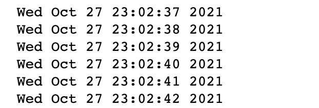
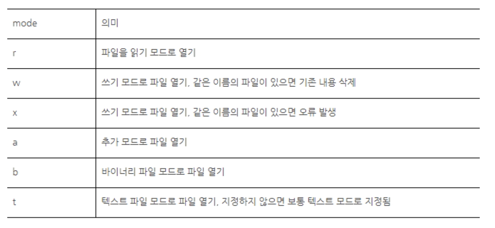

# Python


## 모듈의 제작 및 import, 파일 입출력


### 1. 모듈의 제작

- 파이썬의 모듈은 프로그램의 기능단위를 의미한다. 
- 파이썬는 파일단위로 작성된 파이썬 코드 이다.
- 프로그램을 관리하는 기준이 되고, 확장자는 py 파일로 저장한다.
- 모듈안에 있는 변수나 함수를 사용하기 위해서 import를 사여 사용한다.

- 주피터 노트북에서 파일을 만들기 위해서 %%writefile 명령어를 사용한다.
- 모듈이름.py 저장하여 사용한다. 예) first.py, myMath.py
- 주피터 노트북에서 모듈 자체를 실행하려면 %run first.py로 하면 된다.
- cmd, Anaconda prompt에서 파일이 있는 경로 이동하여 python first.py로
   실행하는 것과 같은 의미이다. 

- 모듈에 대한 설명은 처음에 ''',""" 를 앞뒤로 쓰고 그안에 작성하면 되며,
   __doc__로 모듈의 설명을 확인할 수 있다.


```python
%%writefile  myMath.py
""" 모듈을 작성합니다.
    pi 변수와 두개의 함수가 있습니다.
"""
pi = 3.14
 
def oneHapN(end):    # 1부터 N까지의 합을 구해주는 함수
    sum = 0
    for i in range(end):
        sum += i+1
    return sum
 
def oneGopN(end):    # 1부터 N까지의 곱을 구해주는 함수
    total = 1
    for i in range(end):
        total *= i+1
    return total

```


같은 폴더 내에 myMath.py 파일 생성됨.


-- 확인하기

```python
import myMath
import math

print(myMath.__doc__)
```


```python
print(myMath.pi)
print(math.pi)
 
print('1부터 10까지의 합:', myMath.oneHapN(10))
print('1부터 10까지의 곱:', myMath.oneGopN(10))
```


#### (1) `__name__` 변수

- 모듈은 직접 실행할 수 있고, import되면서 실행될 수도 있다.
- `__name__` 변수는 파이썬 파일(모듈)이 직접 실행되었는지 혹은 모듈로
   import되어 실행되었는지를 구별할 수 있다.
- 모듈이 직접 실행되면 __name__ 변수에는 __main__이 저장된다.
- import되어 실행되명 __name__변수에는 모듈이름이 저장된다.
- 노트북에서 파이썬 파일 직접 실행하기 %run 모듈명.py

```python
%%writefile first.py
''' 
내가만든 모듈입니다.
내부에는 변수와 함수가 하나씩 있습니다.
'''

print(__name__) #직접실행하면 __main__출력, import되서 실행되면 모듈명 출력


first_value = 100
 
def first_func(x, y):
    return x + y


if __name__ == '__main__' :
    print()
    print(__doc__)
    print("first_value",first_value)
    print("first_func", first_func(1,5))

```


(first.py 생성됨)


-- 확인하기

```python
%run first.py
```


```python
import first
```


```python
print(first.__doc__)
```


#### 모듈 import

##### 1) import myMath

- myMath 모듈의 모든 변수와 함수 등을 가져온다.
- 모듈명의 길이가 길 경우 as로 간단한 모듈 이름으로 대신 사용가능하다.
- import myMath as my 로 하면 myMath.pi 대신 my.pi로 사용가능하다.
- 모듈명.변수 사용
- 모듈명.함수 호출

```python
import myMath as my

print(my.pi)
print(my.oneGopN(10))
```


##### 2) from myMath import pi, oneHapN

- myMath 모듈에서 pi변수와 oneHapN함수만 가져온다. 
- 모듈명.함수로 호출하면 import 안한 부분도 사용할 수 있다.
- from 과 import를 사용하면 모듈명.변수, 모듈명.함수로 호출하지 않고  바로 변수명, 함수명으로 사용할 수 있다.
- 위험성 존재

```python
from myMath import pi, oneHapN

print(pi)
print('1부터 10까지의 합:', oneHapN(10))
# print('1부터 10까지의 곱:', oneGopN(10)) # 사용 불가
```


##### 3) from myMath import *

- `*` 의미가 모두의 뜻이므로 myMath 모듈의 모든 변수 함수를 가져온다.
- 모든 변수와 함수명에 대해 바로 변수명, 함수명으로 사용할 수 있다.
- 위험성이 존재한다.

```python
from myMath import *

print(pi)
print('1부터 10까지의 합:', oneHapN(10))
print('1부터 10까지의 곱:', oneGopN(10)) 
```


##### 4) 2)와 3)번의 위험성 예제

- 서로 다른 모듈의 변수이름이 같을경우 나중에 인포트한 변수가 앞에서 인포트한 변수를 대체한다(덮어쓰기) 
- 문제가 생기지 않는 1번 import 방식을 많이 사용한다

```python
from math import *  #math.pi = 3.141592653589793 
from myMath import pi #myMath.pi = 3.14
 
print(pi)
```


### 2. 내장 모듈


#### (1) keyword 모듈

- keyword 모듈은 파이썬 예약어 관련 기능들을 제공한다.


#### (2) random 모듈

##### 1) random.randint()

- 임의의 난수를 얻을 수 있다.
- randint(시작값, 끝값) 시작과 끝값 사이에서 임의의 수를 추출한다.
- print() 함수의 end 속성은 출력 후 한 줄의 마지막을 어떻게 처리할 것인지를 지정해 주는 역할을 한다. (line skip 안하고 붙여서 출력)

```python
import random

for i in range(6):
    number = random.randint(1, 45)
    print(number, end=' ')
```


##### 2) random.shuffle(), random.choice()

- shuffle()은 list 값을 무작위로 섞어준다.
- choice()는 무작위로 하나를 선택해준다.

```python
card = ['A', '2', '3', '4', '5', '6', '7', '8', '9', '10', 'J', 'Q', 'K']
print(card)
 
random.shuffle(card)
print(card)
 
print(random.choice(card))
```


##### 3) random.sample()
- 여러항목을 중복되지 않게 뽑아준다.
- sample()의 첫번째 인자는 시퀀스 객체 또는 집합이고 두번째 인자는 추출 개수이다.
- 시퀀스 객체는 리스트,튜플,문자열등을 나타낸다.

```python
import random

myStr = "최고의영화-죽은시인의사회"
print(random.sample(myStr, 3))

myList = random.sample(range(1,46), 6)
myList.sort()
print(myList)
```


##### 4) random.random(), random.uniform()
- random() : 0.0~1.0 사이에 실수를 무작위로 추출한다.
- uniform() : 주어진 값의 범위에서 실수를 임의로 추출한다.

```python
import random
 
print(random.random())
print(random.uniform(0, 10))
```


#### (3) time 모듈

 #####  1) time.time() 

- 현재 시간을 1970년 1월 1일 00시 00분 00초 이후부터 지금까지의 초 단위로 알려준다. 이것 자체로는 유용하지 않다.
- 프로그램의 실행 시간을 알아낼 수 있다.
- 실행시간을 측정하는 코드는 보통 프로그램이나 알고리즘의 효율성을 체크할 때 많이 사용된다.


##### 2) time.ctime()

- 현재 시간을 문자열로 알려준다.
 - 함수로 얻은 시간정보를 문자열함수로 분리해 사용할 수 있다.
 - split() 함수는 각요소를 분리해서 리스트로 반환해 준다.
 - split() 괄호에 인자가 없으면 공백으로 분리해준다.


##### 3) time.sleep()
- 프로그램을 잠시 쉬게 해주는 기능을 가진 함수이다.
- 주로 반복문 안에서 사용되고, 초를 실수 값으로 입력할 수도 있다.

```python
import time
 
for t in range(6): #0~5번까지 반복
    print(time.ctime()) #현재 시간정보를 출력
    time.sleep(1) #1초동안 딜레이 된다.
```



(1초에 한 줄씩 출력된다.)


#### (4) datetime 모듈
- 이 모듈은 time모듈에 date 모듈을 합친 모듈이다.
- 날짜와 시간을 모두 다루고 있다.
- datetime.now() : 현재 시간
- 이때 얻은 값으로 year, month, day... 와 같은 방법으로 값을 사용
- weekday() 요일을 알려준다. 0~6 까지 숫자이다. (0 : 월요일 ~ 6 : 일요일)

```python
import datetime
 
d = datetime.datetime.now() #현재시간
print(d)
 
print(d.year, d.month, d.day, sep='/') #얻은 객체로 년,월,일을 얻을 수 있다.
print(d.hour, d.minute, d.second, d.microsecond, sep=':')#시간,분,초,마이크로초 획득
print(d.weekday()) #요일을 알려준다.
```


### 3. 파일 입출력

- 컴퓨터가 문자열을 처리할때는 텍스트와 바이트 단위로 처리한다.
- 파이썬도 문자열을 처리하기 위해서 유니코드와 바이트로 처리한다.
- 텍스트를 기준으로 파일을 처리하면 유니코드 문자열로 처리해야 한다.
- 바이트를 기준으로 파일을 처리할때는 영어 알파벳기준인 바이트 단위로 처리한다.
- 파일도 하나의 클래스 이므로 open()를 호출하면 객체가 만들어진다.
- open()함수 : 파일명과, 파일의 상태를 표시한 모드를 인자로 가진다.

 

#### (1) 파일의 상태를 표시하는 모드

- mode는 혼합해서 사용할 수 있다.
- 바이너리 파일을 쓰기 모드로 열고 싶으면 mode에 ‘bw’, ‘wb’를 입력한다.
- mode에 아무것도 쓰지 않으면 ‘rt’와 같은 기능을 한다. 
- 즉, 읽기 모드이면서 텍스트 모드로 파일을 연다.
- mode에 ‘w’만 입력하면 ‘wt’모드로 파일을 연다.




#### (2) 파일에 데이터 쓰기

- open()에 저장할 파일명, mode의 w, wb, wt를 사용하여 데이터를 저장한다.
- 생성된 파일객체를 close()함수로 파일객체 사용을 종료한다.
- 파일을 열때(open) 파일의 경로는 절대경로와 상대경로가 있다.
- 파일은 경로에 없으면 자동으로 생성된다.(w,wb,wt) 
- 폴더는 경로에 없으면 오류가 발생함으로 미리 폴더를 생성 해준다.

▷ 절대경로 : 작업폴더와 무관하게 절대적인 위치를 가리키는 경로

ex ) `c:/workspace/file, c:/temp`

▷ 상대경로 : 소스코드(*.py)가 있는 작업 폴더를 기준으로 상대적인 위치를 가리키는 경로

ex) `../file/, ./src/images (. : 현재폴더, .. : 상위폴더로 이동)`


##### 1) write()

- 문자열의 데이터를 파일에 저장할 수 있는 함수

```python
f = open('/Users/jules/pywork/myfile.txt', 'w') #경로에서 파일을 확인한다.
 
memo = '파일을 열었으니 데이터를 저장하자'
f.write(memo)
 
f.close()
```

해당 위치에 myfile.txt가 생성됨.


##### 2) writelines()

- 문자열이나 list의 데이터를 파일에 저장할 수 있는 함수
- 상대경로 notebook/files/data.txt에 데이터 저장한다.
- open()에 세번째 인자에 encoding='utf-8'로 작성하면 jupyter notebook의 브라우저에서 한글이 안깨지고 보인다.

```python
s = """ 라인1
라인2
라인3
"""

s
```


```python
s2 = ["첫번째\n", '두번째\n', '세번째\n']
 
s2
```


```python
f = open("./files/data.txt","x",encoding='utf-8') #jupyter notebook 브라우저에서 확인
 
f.writelines(s2) #f.writelines(s), 문자열도 저장한다.
 
f.close()
```

files 폴더 위치에 data.txt가 생성됨.


