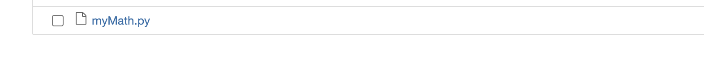
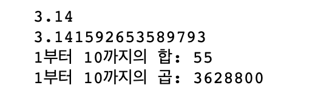
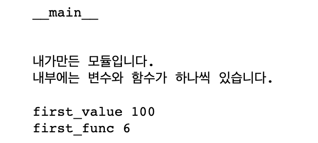
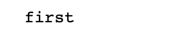
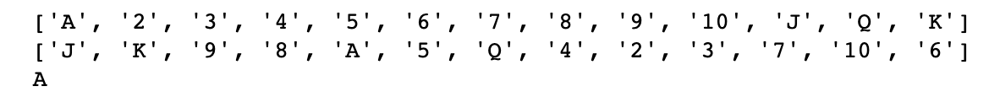
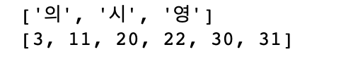
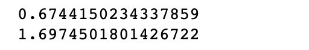

# Python


## 모듈의 제작 및 import, 파일 입출력


### 1. 모듈의 제작

- 파이썬의 모듈은 프로그램의 기능단위를 의미한다. 
- 파이썬는 파일단위로 작성된 파이썬 코드 이다.
- 프로그램을 관리하는 기준이 되고, 확장자는 py 파일로 저장한다.
- 모듈안에 있는 변수나 함수를 사용하기 위해서 import를 사여 사용한다.

- 주피터 노트북에서 파일을 만들기 위해서 %%writefile 명령어를 사용한다.
- 모듈이름.py 저장하여 사용한다. 예) first.py, myMath.py
- 주피터 노트북에서 모듈 자체를 실행하려면 %run first.py로 하면 된다.
- cmd, Anaconda prompt에서 파일이 있는 경로 이동하여 python first.py로
   실행하는 것과 같은 의미이다. 

- 모듈에 대한 설명은 처음에 ''',""" 를 앞뒤로 쓰고 그안에 작성하면 되며,
   __doc__로 모듈의 설명을 확인할 수 있다.


```python
%%writefile  myMath.py
""" 모듈을 작성합니다.
    pi 변수와 두개의 함수가 있습니다.
"""
pi = 3.14
 
def oneHapN(end):    # 1부터 N까지의 합을 구해주는 함수
    sum = 0
    for i in range(end):
        sum += i+1
    return sum
 
def oneGopN(end):    # 1부터 N까지의 곱을 구해주는 함수
    total = 1
    for i in range(end):
        total *= i+1
    return total

```




같은 폴더 내에 myMath.py 파일 생성됨.


-- 확인하기

```python
import myMath
import math

print(myMath.__doc__)
```


```python
print(myMath.pi)
print(math.pi)
 
print('1부터 10까지의 합:', myMath.oneHapN(10))
print('1부터 10까지의 곱:', myMath.oneGopN(10))
```




#### (1) `__name__` 변수

- 모듈은 직접 실행할 수 있고, import되면서 실행될 수도 있다.
- `__name__` 변수는 파이썬 파일(모듈)이 직접 실행되었는지 혹은 모듈로
   import되어 실행되었는지를 구별할 수 있다.
- 모듈이 직접 실행되면 __name__ 변수에는 __main__이 저장된다.
- import되어 실행되명 __name__변수에는 모듈이름이 저장된다.
- 노트북에서 파이썬 파일 직접 실행하기 %run 모듈명.py

```python
%%writefile first.py
''' 
내가만든 모듈입니다.
내부에는 변수와 함수가 하나씩 있습니다.
'''

print(__name__) #직접실행하면 __main__출력, import되서 실행되면 모듈명 출력


first_value = 100
 
def first_func(x, y):
    return x + y


if __name__ == '__main__' :
    print()
    print(__doc__)
    print("first_value",first_value)
    print("first_func", first_func(1,5))

```


(first.py 생성됨)


-- 확인하기

```python
%run first.py
```




```python
import first
```




```python
print(first.__doc__)
```


#### 모듈 import

##### 1) import myMath

- myMath 모듈의 모든 변수와 함수 등을 가져온다.
- 모듈명의 길이가 길 경우 as로 간단한 모듈 이름으로 대신 사용가능하다.
- import myMath as my 로 하면 myMath.pi 대신 my.pi로 사용가능하다.
- 모듈명.변수 사용
- 모듈명.함수 호출

```python
import myMath as my

print(my.pi)
print(my.oneGopN(10))
```


##### 2) from myMath import pi, oneHapN

- myMath 모듈에서 pi변수와 oneHapN함수만 가져온다. 
- 모듈명.함수로 호출하면 import 안한 부분도 사용할 수 있다.
- from 과 import를 사용하면 모듈명.변수, 모듈명.함수로 호출하지 않고  바로 변수명, 함수명으로 사용할 수 있다.
- 위험성 존재

```python
from myMath import pi, oneHapN

print(pi)
print('1부터 10까지의 합:', oneHapN(10))
# print('1부터 10까지의 곱:', oneGopN(10)) # 사용 불가
```


##### 3) from myMath import *

- `*` 의미가 모두의 뜻이므로 myMath 모듈의 모든 변수 함수를 가져온다.
- 모든 변수와 함수명에 대해 바로 변수명, 함수명으로 사용할 수 있다.
- 위험성이 존재한다.

```python
from myMath import *

print(pi)
print('1부터 10까지의 합:', oneHapN(10))
print('1부터 10까지의 곱:', oneGopN(10)) 
```


##### 4) 2)와 3)번의 위험성 예제

- 서로 다른 모듈의 변수이름이 같을경우 나중에 인포트한 변수가 앞에서 인포트한 변수를 대체한다(덮어쓰기) 
- 문제가 생기지 않는 1번 import 방식을 많이 사용한다

```python
from math import *  #math.pi = 3.141592653589793 
from myMath import pi #myMath.pi = 3.14
 
print(pi)
```


### 2. 내장 모듈


#### (1) keyword 모듈

- keyword 모듈은 파이썬 예약어 관련 기능들을 제공한다.


#### (2) random 모듈

##### 1) random.randint()

- 임의의 난수를 얻을 수 있다.
- randint(시작값, 끝값) 시작과 끝값 사이에서 임의의 수를 추출한다.
- print() 함수의 end 속성은 출력 후 한 줄의 마지막을 어떻게 처리할 것인지를 지정해 주는 역할을 한다. (line skip 안하고 붙여서 출력)

```python
import random

for i in range(6):
    number = random.randint(1, 45)
    print(number, end=' ')
```


##### 2) random.shuffle(), random.choice()

- shuffle()은 list 값을 무작위로 섞어준다.
- choice()는 무작위로 하나를 선택해준다.

```python
card = ['A', '2', '3', '4', '5', '6', '7', '8', '9', '10', 'J', 'Q', 'K']
print(card)
 
random.shuffle(card)
print(card)
 
print(random.choice(card))
```




##### 3) random.sample()
- 여러항목을 중복되지 않게 뽑아준다.
- sample()의 첫번째 인자는 시퀀스 객체 또는 집합이고 두번째 인자는 추출 개수이다.
- 시퀀스 객체는 리스트,튜플,문자열등을 나타낸다.

```python
import random

myStr = "최고의영화-죽은시인의사회"
print(random.sample(myStr, 3))

myList = random.sample(range(1,46), 6)
myList.sort()
print(myList)
```




##### 4) random.random(), random.uniform()
- random() : 0.0~1.0 사이에 실수를 무작위로 추출한다.
- uniform() : 주어진 값의 범위에서 실수를 임의로 추출한다.

```python
import random
 
print(random.random())
print(random.uniform(0, 10))
```




#### (3) time 모듈

 #####  1) time.time() 

- 현재 시간을 1970년 1월 1일 00시 00분 00초 이후부터 지금까지의 초 단위로 알려준다. 이것 자체로는 유용하지 않다.
- 프로그램의 실행 시간을 알아낼 수 있다.
- 실행시간을 측정하는 코드는 보통 프로그램이나 알고리즘의 효율성을 체크할 때 많이 사용된다.


