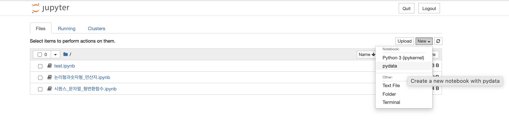

# Python


## Python 프로그래밍


### (1) 프로그래밍 언어란?

- 컴퓨터에 명령을 내리려고 만든 언어
- 컴퓨터의 중앙처리장치(CPU, Central Processing Unit)에 전기 신호를 직접 주기 위한 0, 1로 이뤄진 명령의 나열(기계어)
- 기계어는 프로그래밍 생성, 수정이 어려웠다. 그래서 어셈블리어가 생겨났다. (저급언어)
- 어셈블리어는 기계어와 일대일 대응되는 프로그래밍 언어로 기계어로 변환하여 컴퓨터가 이해하고 실행한다.
- CPU에 대한 지식이 없으면 여전히 어려운 프로그래밍 언어이다.
- 컴퓨터 하드웨어에 대한 지식이 없는 사람이 좀더 이해하기 쉽고 작성할 수 있는 프로그램 언어가 만들어진다.(고급언어)
- 고급언어에는 Python, Java, C, C++, C#, R 등이 있으며 어셈블리어는 저급언어라 한다.
- 고급언어는 컴퓨터가 이해할 수 있는 기계어로 변환해야 실행될 수 있다.


### (2) 기계어로 변환하는 방식

- Compiled Language
- 다수의 명령어로 이루어진 소스코드를 한번에 기계어로 번역해서 실행파일을 만든다.
- Interpreted Language
- 소스코드를 한 줄씩 기계어로 번역해서 실행 결과를 보여준다. 인터프리티드 언어는 Script 언어라고 한다.

### (3) Python이름의 유래

- Python의 사전적 의미는 독이 없는 뱀으로 먹이를 몸으로 감아서 압사시키는 큰 뱀, 또는 그리스 신화에 나오는 악마 의미가 있다. 

- 프로그래밍 언어로서 Python 이름의 유래는 1970년대에 영국 BBC에서 방영한 "Monty Python's Flying Circus" 방영 프로그램에서 유래되었다. 

- 귀도 반 리섬(Guido van Rossum)이 이 프로그램의 대단한 팬이었다.

- 1989년 12월 크리스마스 휴가중 Guido는 휴가기간 동안 컴파일 과정이 필요없는 인터프리터(interpreter)를 만들게 되었다. 

  (인터프리터는 코드를 한줄씩 바로 해석하여 결과를 보여준다.) 

- 즉, Guido가 무료한 한때를 보내기 위하여 만들기 시작했던 언어가 지금 많은 사람들이 사용하는 Python 언어가 되었다. 


### (4) Python의 특징

- 배우기 쉬운 문법이며, 무료이다.
- 방대한 라이브러리가 있다. Python하면 바로 사용가능한 표준라이브러리로부터 확장을 위해 새롭게 설치하여 사용하는 외부라이브러리등을 활용할 수 있다.
- 다양한 운영체제에서 동작한다 (윈도우, 리눅스, 맥 등)
- 짧아지는 코드로 C언어 또는 Java → 100라인,  파이썬 → 5~10라인 
- 대화 기능의 인터프리터 언어 → 마치 컴퓨터와 개발자가 대화하는듯한 느낌
- 동적인 데이터 타입 결정 지원 한다.

ex)

```python
def add(a,b):     
		return a+b 
print add(1,2)
print add('abc', 'def')
print add([1, 2, 3], [4, 5, 6]) 
```

```
    결과---------------------------------------
    3 
    abcdef
    [1, 2, 3, 4, 5, 6] 
 
    설명---------------------------------------
    def  → add 함수 선언
    print → add 함수 수행한 반환값을 출력
    문자열을 더하면 문자들이 합쳐짐 
    리스트 + 리스트 = 하나의 리스트 
    함수의 a와 b는 타입이 정해져 있지 않음.
    타입은 실제로 값이 변수에 할당되는 순간에 정해짐 
    ---------------------------------------------
```

- 고수준의 내장 객체 자료형 제공 
- 리스트 : 서로 다른 객체들을 원소로 갖고, 순서가 부여된 자료구조형
- 리스트 : 첫 번째, 두 번째 인덱싱을 할 수 있음 

```python
a=[12, 'abcde', 4+2j, [3,4,5]]
a.append('add')
a; 

결과 ---------------------------------------
[12, 'abcde', (4+2j), [3, 4, 5], 'add'] 
```


### (5) Python 의 장점

- Guido가 생각했던 Python 문법적 특징 ; 들여쓰기를 철저하게 지키도록 언어를 설계
- 파이썬은 들여쓰기를 안 할 경우 error 발생
  → 들여쓰기 강제, 이는 코드의 가독성 높여준다.
- C 언어에서처럼 {} 등의 괄호를 넣지 않기 때문에 프로그램을 좀더 깔끔하게 만들어준다. 
- 파이썬 코드는 재사용하기가 쉽다.
- 코드의 분석이 쉽기 때문에 다른 사람이 작성한 코드를 받아서 작업하는 사람들이 훨씬 더 작업을 편하게 해준다. 


### (6) Python 공부를 위한 참고 사이트

- 파이썬 공식 홈페이지 : https://www.python.org/
- 코드 아카데미 : https://www.codecademy.com/
- 위키독스: https://wikidocs.net/
- 바이트오브파있이썬 : [http://byteofpython-korean.sourceforge.net/byte_of_python.html ](http://byteofpython-korean.sourceforge.net/byte_of_python.html)


## Python 개발 환경 구축 


### (1) Anaconda 설치


#### (1) 아나콘다란?

- 파이썬 기본 프로그램과 함께 많이 사용하는 패키지와 통합 개발 환경을 한번에 설치
    할 수 있도록 만들어진 배포판이다.
- 아나콘다(Anaconda)는 수학과 과학 분야에서 사용되는 여러 패키지들을 묶어 놓은 파이썬 배포판으로서 SciPy, Numpy, Matplotlib, Pandas 등을 비롯한 많은 패키지들을 포함하고 있다.
- Anaconda는 특히 최근에 데이타 사이언스와 머신 러닝 분야에서 파이썬을 사용하기 위해 기본적으로 설치하는 배보판이 되었다. 
- Anaconda를 설치하기 위해서는 https://www.anaconda.com/ 웹사이트에서 자신의 OS에 맞는 Anaconda를 다운받아 설치한다.


####  (2) Anaconda 구성요소

- Jupyter IDE 개발도구
- Numpy, SciPy 과학 분석용 라이브러리
- Matplotlib 데이타 시각화 (Data Visualization) 라이브러리
- Python 3.7, PIP, Pandas 등


## Conda를 이용한 Python 3.7 기반 가상환경 생성 

- 가상환경(Virtual Environments)이란 자신이 원하는 Python 환경을 구축하기 위해 필요한 모듈만 담아 놓은 환경이다.
- 각 가상환경(virtualenv1, 2, 3…)은 독립적으로 관리된다.
- 각 모듈은 다른 모듈에 대한 의존성(dependency)이 다르기 때문에 여러모듈을 설치하다보면 충돌이 날 수도 있다.
- 따라서 각 프로젝트 별로 별개의 가상환경을 만들어놓고 사용하는 것이 효율적이다.
- 가상환경을 사용하는 이유는, 같은 모듈을 사용한다고 하더라도 다른 버전을 필요로 한다거나, Python 프로그램을 실행하기 위한 최소한의 환경을 마련하고자 할 때나, GitHub 등의 저장소나 네트워크와 연계하고자 할 때 등 매우 다양하다.


### (1) conda를 이용한 가상 독립환경 구성 

(VMWare를 통한 우분투 설치와 비슷한 원리) 

 

#### (1) 가상환경과 같이 설치하는 Python library 

- numpy(넘파이) : NumPy는 행렬이나 일반적으로 대규모 다차원 배열을 쉽게 처리 할 수 있게 해주는 파이썬의 라이브러리.

  NumPy는 데이터 구조 외에도 수치 계산을 위해 효율적으로 구현 된 기능을 제공.

- scipy(사이파이): Python을 위한 과학적 도구의 오픈소스 라이브러리, 프로그래밍, 수학, 과학, 공학을 위한 수치 해석 소프트웨어.

- matplotlib(맷플롯립): 데이터 시각화 파이썬 라이브러리.

- pandas:
   데이터 분석을 위한 파이썬 라이브러리, R언어의 데이터프레임과 같은 이름의
   데이터프레임 구조에 데이터를 저장하고 다양한 조작으로 데이터 분석을 편리하게 해 줌
-  seaborn(시본):
   matplotlib 기반의 파이썬 시각화 라이브러리, 다양한 색상 테마와 통계용 차트 등의
   기능을 제공함.

- spyder(스파이더): NumPy, SciPy, Matplotlib, IPython이 통합된 IDE


## Jupyter Notebook 커널(Conda 가상환경) 연동

### (1) Jupyter Notebook

- 주피터 노트북(Jupyter Notebook)은 웹 브라우저에서 파이썬 코드를 작성하고 실행해 볼 수 있는 개발도구이다. 
- 아나콘다(Anaconda)를 설치하면 Jupyter Notebook이 함께 설치된다. 
- Jupyter Notebook을 실행하면, Jupyter Notebook 서버 (콘솔 프로그램)와 클라이언트로 사용되는 웹 브라우저 등 2개의 프로그램이 실행된다. 
- Jupyter Notebook 서버 프로그램은 백그라운드에서 실행되는 파이썬 프로그램으로 웹 브라우저 클라이언트가 접속하는 서버 프로그램이며 실제 파이썬 코드 실행은 여기에서 일어난다. 
- 웹 브라우저는 파이썬 코드를 입력받고, 실행해 볼 수 있는 UI를 제공하는 클라이언트로서 코드를 Jupyter Notebook 서버에 보내 결과를 다시 웹 브라우저에 뿌려 주게 된다.
- Jupyter Notebook 서버 프로그램은 디폴트로 웹 포트 8888 을 오픈하여 사용하며,
  Jupyter Notebook 웹 브라우저는 http://localhost:8888 을 통해 접속한다.


### (2) Jupyter Notebook 실행 파일 생성



### (3) 구글 코랩 사용하기

- 구글 코랩은 주피터 노트북을 구글 서버에 특화시킨 버전이다.
- 구글에서 교육과 과학 연구를 목적으로 개발한 도구이다.
- 코랩은 웹브라우저를 통해 제어하고 실제 파이썬 코드 실행은 구글 클라우드 의 가상 서버에서 이루어진다.
- 코랩을 사용하려면면 구글 계정이 필요하다.
- 구글 코랩의 장점은 설치가 필요없고, 구글의 GPU 활용가능하다.
- CPU 사양으로 텐서플로가 내컴퓨터에 설치가 안될때 구글코랩을 사용 하면 편하다.
- 단점은 새로 설치한 패키지가 저장되지 않고, 샘플 파일, 가중치 값이 유실 될 수 있다. 또한 나의 파일을 사용하기 위해선 업로드하여 사용한다.


*Fin.🐧*

