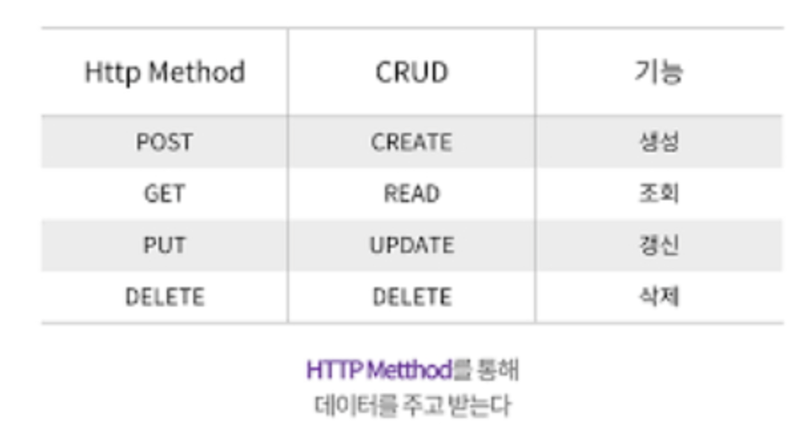
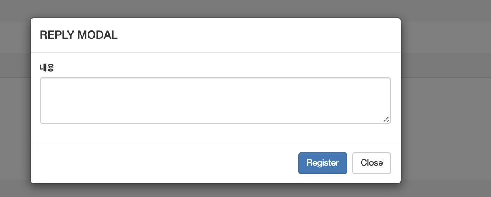
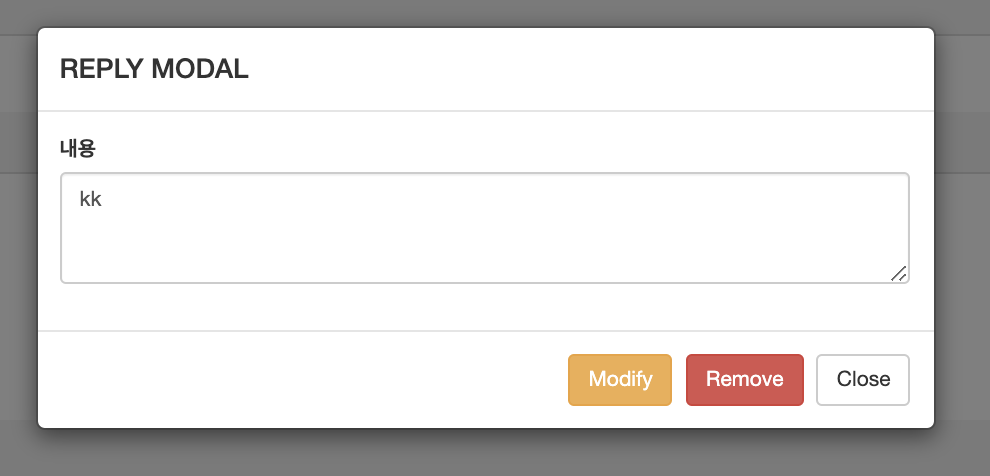

# SpringBoot


## RestController를 이용한 댓글 목록


### 1. RestController

- REST는 Representational State Transfer의 약자로 하나의 URI는 하나의 고유한 리소스(Resource)를 대표하도록 설계된다는 개념에 전송방식을 결합해서 원하는 작업을 지정한다. 
- REST는 HTTP URI로 리소스를 정의하고 HTTP메소드로 리소스에 대한 행위를 정의한다.
- 리소스는 JSON, XML과 같은 여러가지 언어로 표현할 수 있다.
- REST서비스에서는 CRUD에 해당하는 4개의 HTTP 메소드가 있다.



- RestController는 기존 Controller 와 ResponseBody를 합친 모습과 같다.
- RestController는 기존 Controller가 JSP경로를 리턴 했다면 RestController는 순수한 데이터를 반환한다.
- 일반 문자열, JSON, XML등의 다양한 포맷의 데이터를 전송한다.
- RestController에서 사용가능한 요청annotation

```
@RequestMapping
@GetMapping
@PostMapping
@PutMapping
@DeleteMapping
```


#### (1) 라이브러리 추가

> build.gradle

```
// https://mvnrepository.com/artifact/org.json/json
implementation group: 'org.json', name: 'json', version: '20201115'
```


### 2. 댓글 처리 구현

- spring_bbs Project의 bbs 내용보기에서 댓글 구현을 추가.
- 댓글은 답변하고 다르게 새로운 테이블을 생성한다.
- 댓글입력시 로그인 인증후 댓글 쓰기와 수정, 삭제가 가능하다.


#### (1) 댓글 테이블 설정

/sql/reply.sql

```sql
create table reply(
   rnum number not null,
   content varchar(500) not null,
   regdate date not null,
   id varchar(10) not null,
   bbsno number(7) not null,
   primary key(rnum),
   foreign key(bbsno)  references bbs(bbsno)
 
);
 
insert into reply(rnum, content, regdate, id, bbsno)
values((select nvl(max(rnum),0)+1 from reply),
'의견입니다.',sysdate,'user1',1
) ;
 
 
--list(목록)
select rnum, content, to_char(regdate,'yyyy-mm-dd') regdate, id, bbsno, r
FROM(
select rnum, content, regdate, id, bbsno, rownum r
FROM(
select rnum, content, regdate, id, bbsno
from REPLY
where bbsno = 1
order by rnum DESC
    )
)WHERE r >= 1 and r <= 5;
 
 
--total(목록)
select count(*) from reply
where bbsno = 1;
```


#### (2) Model 생성 및 mybatis mapper xml 제작

> package com.study.model;
>
> ReplyDTO.java

```java
package com.study.model;

public class ReplyDTO {
	private int rnum;
	private String content;
	private String regdate;
	private String id;
	private int bbsno;

	@Override
	public String toString() {
		return "ReplyDTO [rnum=" + rnum + ", content=" + content + ", regdate=" + regdate + ", id=" + id + ", bbsno="
				+ bbsno + "]";
	}

	public ReplyDTO(int rnum, String content, String regdate, String id, int bbsno) {
		super();
		this.rnum = rnum;
		this.content = content;
		this.regdate = regdate;
		this.id = id;
		this.bbsno = bbsno;
	}

	public ReplyDTO() {
		super();
		// TODO Auto-generated constructor stub
	}

	public int getRnum() {
		return rnum;
	}

	public void setRnum(int rnum) {
		this.rnum = rnum;
	}

	public String getContent() {
		return content;
	}

	public void setContent(String content) {
		this.content = content;
	}

	public String getRegdate() {
		return regdate;
	}

	public void setRegdate(String regdate) {
		this.regdate = regdate;
	}

	public String getId() {
		return id;
	}

	public void setId(String id) {
		this.id = id;
	}

	public int getBbsno() {
		return bbsno;
	}

	public void setBbsno(int bbsno) {
		this.bbsno = bbsno;
	}
}
```


> package com.study.model;
>
> ReplyMapper.java

```java
package com.study.model;

import java.util.List;
import java.util.Map;

public interface ReplyMapper {

	int create(ReplyDTO replyDTO);

	List<ReplyDTO> list(Map map);

	ReplyDTO read(int rnum);

	int update(ReplyDTO replyDTO);

	int delete(int rnum);

	int total(int bbsno);
}
```


reply.xml

```xml
<?xml version="1.0" encoding="UTF-8" ?> 

<!DOCTYPE mapper
PUBLIC "-//mybatis.org//DTD Mapper 3.0//EN"
"http://mybatis.org/dtd/mybatis-3-mapper.dtd">

<mapper namespace="com.study.model.ReplyMapper">
  <select id="list" parameterType="Map" resultType="com.study.model.ReplyDTO">
    select rnum, content, to_char(regdate,'yyyy-mm-dd') regdate, id, bbsno, r
    FROM(
    select rnum, content, regdate, id, bbsno, rownum r
    FROM(
    select rnum, content, regdate, id, bbsno
    from REPLY
    where bbsno = #{bbsno}
    order by rnum DESC
    )
<![CDATA[
)WHERE r >= #{sno} and r <= #{eno}
]]>
  </select>

  <select id="total" resultType="int" parameterType="int">
    select count(*) from reply
    where bbsno=#{bbsno}
  </select>

  <insert id="create" parameterType="com.study.model.ReplyDTO">
    insert into reply(rnum, content, regdate, id, bbsno)
    values((select nvl(max(rnum),0)+1 from reply),
    #{content}, sysdate, #{id}, #{bbsno}
    )
  </insert>

  <select id="read" parameterType="int" resultType="com.study.model.ReplyDTO">
    select * from reply
    where rnum = #{rnum}
  </select>
</mapper>
```


#### (3) BbsController.java 수정

- 게시판 조회 아래부분에서 댓글의 목록을 출력하기 위한 내용을 작성

> BbsController.java

```java
	@GetMapping("/bbs/read")
	public String read(int bbsno, Model model, HttpServletRequest request) {
		mapper.upViewcnt(bbsno);
		BbsDTO dto = mapper.read(bbsno);

		String content = dto.getContent().replaceAll("\r\n", "<br>");
		dto.setContent(content);

		model.addAttribute("dto", dto);

		/* 댓글 관련 시작 */
        int nPage = 1;
        if (request.getParameter("nPage") != null) {
                nPage = Integer.parseInt(request.getParameter("nPage"));
        }
        int recordPerPage = 3;

        int sno = ((nPage - 1) * recordPerPage) + 1;
        int eno = nPage * recordPerPage;

        Map map = new HashMap();
        map.put("sno", sno);
        map.put("eno", eno);
        map.put("nPage", nPage);

        model.addAllAttributes(map);

        /* 댓글 처리 끝 */
		
		return "/bbs/read";
	}
```


#### (4) read.jsp 댓글 목록 출력 추가


```jsp
<%@ page contentType="text/html; charset=UTF-8"%>
<!DOCTYPE html>
<html>
<head>
<title>게시판</title>
<meta charset="utf-8">
<script>
  	function update(){
  		let url = 'update';
  		url += '?bbsno=${dto.bbsno}';
  		url += "&col=${param.col}";
  		url += "&word=${param.word}";
  		url += "&nowPage=${param.nowPage}";
  		
  		location.href=url;
  	}
  	function del(){
  		let url = 'delete';
  		url += '?bbsno=${dto.bbsno}';
  		url += "&col=${param.col}";
  		url += "&word=${param.word}";
  		url += "&nowPage=${param.nowPage}";
  		url += "&oldfile=${dto.filename}"; 
  		location.href= url;
  	}
  	
  	function reply(){
  		let url = 'reply';
  		url += '?bbsno=${dto.bbsno}';
  		url += "&col=${param.col}";
  		url += "&word=${param.word}";
  		url += "&nowPage=${param.nowPage}";
  		
  		location.href= url;
  	}
  	function list(){
  		let url = "list";
  		url += "?col=${param.col}";
  		url += "&word=${param.word}";
  		url += "&nowPage=${param.nowPage}";
  		
  		location.href=url;
  	}
  	function delete_Ajax(){
  		let url = "delete_Ajax";
  		url += "?bbsno=${dto.bbsno}";
  		url += "&oldfile=${dto.filename}";
  		url += "&col=${param.col}";
  		url += "&word=${param.word}";
  		url += "&nowPage=${param.nowPage}";
  		
  		location.href=url;
  	}
  </script>
</head>
<body>
  <div class="container">
    <h2>조회</h2>
    <div class="panel panel-default">
      <div class="panel-heading">작성자</div>
      <div class="panel-body">${dto.wname}</div>

      <div class="panel-heading">제목</div>
      <div class="panel-body">${dto.title}</div>

      <div class="panel-heading">내용</div>
      <div class="panel-body">${dto.content}</div>

      <div class="panel-heading">조회수</div>
      <div class="panel-body">${dto.viewcnt}</div>

      <div class="panel-heading">등록일</div>
      <div class="panel-body">${dto.wdate}</div>
      <div class="panel-heading">파일</div>
      <div class="panel-body">${dto.filename}</div>

    </div>

    <button class='btn' onclick="location.href='./create'">등록</button>
    <button class='btn' onclick="update()">수정</button>
    <button class='btn' onclick="del()">삭제</button>
    <button class='btn' onclick="reply()">답변</button>
    <button class='btn' onclick="list()">목록</button>
    <button class='btn' onclick="delete_Ajax()">삭제(비동기)</button>

    <hr>
    <div class='row'>

      <div class="col-lg-12">

        <!-- panel start-->
        <div class="panel panel-default">

          <div class="panel-heading">
            <i class="fa fa-comments fa-fw"></i> 댓글
            <button id='addReplyBtn' class='btn btn-primary btn-xs pull-right'>New Reply</button>
          </div>


          <div class="panel-body">

            <ul class="chat list-group">
              <li class="left clearfix" data-rno="12">
                <div>
                  <div class="header">
                    <strong class="primary-font">user1</strong> <small class="pull-right text-muted">2019-05-12</small>
                  </div>
                  <p>Good job!</p>

                </div>
              </li>
            </ul>
            <!-- ul end  -->
          </div>

          <div class="panel-footer">1234</div>

        </div>
        <!-- panel end-->
      </div>
      <!--  col-lg-12 end -->
    </div>
    <!-- row end -->
  </div>

  <!-- Modal -->
  <div class="modal fade" id="myModal" tabindex="-1" role="dialog" aria-labelledby="myModalLabel" aria-hidden="true">
    <div class="modal-dialog">
      <div class="modal-content">
        <div class="modal-header">
          <button type="button" class="close" data-dismiss="modal" aria-hidden="true">&times;</button>
          <h4 class="modal-title" id="myModalLabel">REPLY MODAL</h4>
        </div>
        <div class="modal-body">
          <div class="form-group">
            <label>내용</label>
            <textarea cols="10" rows="3" class="form-control" name='content'>New Reply!!!!</textarea>
          </div>
        </div>
        <div class="modal-footer">
          <button id='modalModBtn' type="button" class="btn btn-warning">Modify</button>
          <button id='modalRemoveBtn' type="button" class="btn btn-danger">Remove</button>
          <button id='modalRegisterBtn' type="button" class="btn btn-primary">Register</button>
          <button id='modalCloseBtn' type="button" class="btn btn-default">Close</button>
        </div>
      </div>
      <!-- /.modal-content -->
    </div>
    <!-- /.modal-dialog -->
  </div>
  <!-- /.modal -->

  <!-- 댓글처리 관련 Javascript 파일 추가-->
  <script type="text/javascript" src="${pageContext.request.contextPath}/js/breply.js"></script>

  <!-- 페이지 로딩시 댓글 목록 처리-->
  <!-- jstl는 internal javascript에서 사용가능 -->
  <script type="text/javascript">
  var bbsno = "${dto.bbsno}"; 
  var sno = "${sno}";
  var eno = "${eno}";
 <!-- 댓글용 paging, 게시판 검색 -->
  var nPage = "${nPage}";
  var nowPage = "${param.nowPage}";
  var colx = "${param.col}";
  var wordx = "${param.word}";
 </script>
  <script type="text/javascript" src="${pageContext.request.contextPath}/js/replyprocess.js"></script>

</body>
</html>
```


#### (5) 댓글처리 Ajax javascript

- static/js폴더 생성후 javascript파일 생성
- js/replyprocess.js 는 페이지 로딩되면서 댓글목록을 처리할 함수 호출한다.
- js/breply.js 는 댓글 목록처리를 위한 함수들이 정의 되어 있다.

> static/js/breply.js

```js
console.log("*****Reply Module........");
class ReplyService {
    getList(param) {
        return new Promise((resolve, reject) => {
            var bbsno = param.bbsno;
            var sno = param.sno;
            var eno = param.eno;
            //alert(param.bbsno);
            $.getJSON("./reply/list/" + bbsno + "/" + sno + "/" + eno ,
                function (data) {
                    //alert(data);
                    resolve(data); // 댓글 목록만 가져오는 경우 
                    //callback(data.replyCnt, data.list); //댓글 숫자와 목록을 가져오는 경우 
                }
            );
        });
    }

    getPage(param) {
        return new Promise((resolve, reject) => {
            $.ajax({
                type: 'get',
                url: "./reply/page",
                data: param,
                contentType: "application/text; charset=utf-8",
                success: function (result, status, xhr) {
                    resolve(result);

                },
                error: function (xhr, status, er) {
                    reject(er);
                }
            });
        });
    }
    
    add(reply) {
        return new Promise((resolve, reject) => {
            console.log("add reply...............");
 
            $.ajax({
                type: 'post',
                url: './reply/create',
                data: JSON.stringify(reply),
                contentType: "application/json; charset=utf-8",
                success: function (result, status, xhr) {
 
                    resolve(result);
 
                },
                error: function (xhr, status, er) {
 
                    reject(er);
 
                }
            });
        });
    }
 
    get(rnum) {
        return new Promise((resolve, reject) => {
            $.get("./reply/" + rnum + "", function (result) {
                resolve(result);
            }).fail(function (xhr, status, err) {
                reject(err);
            });
        });
    }

} //class end
```


> js/replyprocess.js

```js
$(function () {//페이지가 로딩될때
   showList();
   showPage();
});//page loading function end  

let replyUL = $(".chat");
let replyPageFooter = $(".panel-footer");

let param = "nPage=" + nPage;
    param += "&nowPage=" + nowPage;
    param += "&bbsno=" + bbsno;
    param += "&col=" + colx;
    param += "&word=" + wordx;

const replyService = new ReplyService();

function showList() {
  replyService
    .getList({ bbsno: bbsno, sno: sno, eno: eno })
    .then(list => {
      let str = ""

      for (var i = 0; i < list.length ; i++) {
        str += "<li class='list-group-item' data-rnum='" + list[i].rnum + "'>";
        str += "<div><div class='header'><strong class='primary-font'>" + list[i].id + "</strong>";
        str += "<small class='pull-right text-muted'>" + list[i].regdate + "</small></div>";
        str += replaceAll(list[i].content, '\n', '<br>') + "</div></li>";
      }

      replyUL.html(str);
    })

}//showList() end

function replaceAll(str, searchStr, replaceStr) {
  return str.split(searchStr).join(replaceStr);
}

function showPage(){
    replyService
   .getPage(param)
   .then(paging => {
      console.log(paging);
      let str = "<div><small class='text-muted'>" + paging + "</small></div>";

      replyPageFooter.html(str);
	});
}

let modal = $(".modal");
let modalInputContent = modal.find("textarea[name='content']");
 
let modalModBtn = $("#modalModBtn");
let modalRemoveBtn = $("#modalRemoveBtn");
let modalRegisterBtn = $("#modalRegisterBtn");
 
$("#modalCloseBtn").on("click", function (e) {
 
  modal.modal('hide');
});
 
 
$("#addReplyBtn").on("click", function (e) {
  modalInputContent.val("");
  modal.find("button[id !='modalCloseBtn']").hide();
 
  modalRegisterBtn.show();
 
  $(".modal").modal("show");
 
});

modalRegisterBtn.on("click", function (e) {
 
  if (modalInputContent.val() == '') {
    alert("댓글을 입력하세요")
    return;
  }
 
  let reply = {
    content: modalInputContent.val(),
    id: 'user1',
    bbsno: bbsno
  };
  //alert(reply.bbsno);
  replyService
    .add(reply)
    .then(result => {
 
      //alert(result);
 
      modal.find("input").val("");
      modal.modal("hide");
 
      showList();
      showPage();
 
    }); //end add
 
}); //end modalRegisterBtn.on
 
 //댓글 조회 클릭 이벤트 처리 
$(".chat").on("click", "li", function (e) {
 
  let rnum = $(this).data("rnum");
 
  //alert(rnum)
  replyService
    .get(rnum)
    .then(reply => {
 
      modalInputContent.val(reply.content);
      modal.data("rnum", reply.rnum);
 
      modal.find("button[id !='modalCloseBtn']").hide();
 
      modalModBtn.show();
      modalRemoveBtn.show();
 
      $(".modal").modal("show");
 
    });
});

```


### 3. Ajax 요청을 처리하는 RestController 작성

> package com.study.controller;
>
> ReplyController.java

```java
package com.study.controller;

import java.util.HashMap;
import java.util.List;
import java.util.Map;

import org.slf4j.Logger;
import org.slf4j.LoggerFactory;
import org.springframework.beans.factory.annotation.Autowired;
import org.springframework.http.HttpStatus;
import org.springframework.http.ResponseEntity;
import org.springframework.web.bind.annotation.GetMapping;
import org.springframework.web.bind.annotation.PathVariable;
import org.springframework.web.bind.annotation.PostMapping;
import org.springframework.web.bind.annotation.RequestBody;
import org.springframework.web.bind.annotation.RequestParam;
import org.springframework.web.bind.annotation.RestController;

import com.study.model.ReplyDTO;
import com.study.model.ReplyMapper;
import com.study.utility.Utility;

@RestController
public class ReplyController {
	private static final Logger log = LoggerFactory.getLogger(ReplyController.class);

	@Autowired
	private ReplyMapper mapper;

	@GetMapping("/bbs/reply/list/{bbsno}/{sno}/{eno}")
	public ResponseEntity<List<ReplyDTO>> getList(@PathVariable("bbsno") int bbsno, @PathVariable("sno") int sno,
			@PathVariable("eno") int eno) {

		Map map = new HashMap();
		map.put("sno", sno);
		map.put("eno", eno);
		map.put("bbsno", bbsno);

		return new ResponseEntity<List<ReplyDTO>>(mapper.list(map), HttpStatus.OK);
	}

	@GetMapping("/bbs/reply/page")
	public ResponseEntity<String> getPage(@RequestParam("nPage") int nPage, @RequestParam("nowPage") int nowPage,
			@RequestParam("bbsno") int bbsno, @RequestParam("col") String col, @RequestParam("word") String word) {

		int total = mapper.total(bbsno);
		String url = "read";

		int recordPerPage = 3; // 한페이지당 출력할 레코드 갯수

		String paging = Utility.rpaging(total, nowPage, recordPerPage, col, word, url, nPage, bbsno);

		return new ResponseEntity<>(paging, HttpStatus.OK);

	}

	@PostMapping("/bbs/reply/create")
	public ResponseEntity<String> create(@RequestBody ReplyDTO vo) {

		log.info("ReplyDTO1: " + vo.getContent());
		log.info("ReplyDTO1: " + vo.getId());
		log.info("ReplyDTO1: " + vo.getBbsno());

		vo.setContent(vo.getContent().replaceAll("/n/r", "<br>"));

		int flag = mapper.create(vo);

		log.info("Reply INSERT flag: " + flag);

		return flag == 1 ? new ResponseEntity<>("success", HttpStatus.OK)
				: new ResponseEntity<>(HttpStatus.INTERNAL_SERVER_ERROR);
	}

	@GetMapping("/bbs/reply/{rnum}")
	public ResponseEntity<ReplyDTO> get(@PathVariable("rnum") int rnum) {

		log.info("get: " + rnum);

		return new ResponseEntity<>(mapper.read(rnum), HttpStatus.OK);
	}
}
```


### 4. 댓글 목록 페이징

> Utility.java 에 rpaging 메소드추가

```java
	public static String rpaging(int total, int nowPage, int recordPerPage, String col, String word, String url,
			int nPage, int bbsno) {
		int pagePerBlock = 5; // 블럭당 페이지 수
		int totalPage = (int) (Math.ceil((double) total / recordPerPage)); // 전체 페이지
		int totalGrp = (int) (Math.ceil((double) totalPage / pagePerBlock));// 전체 그룹
		int nowGrp = (int) (Math.ceil((double) nPage / pagePerBlock)); // 현재 그룹
		int startPage = ((nowGrp - 1) * pagePerBlock) + 1; // 특정 그룹의 페이지 목록 시작
		int endPage = (nowGrp * pagePerBlock); // 특정 그룹의 페이지 목록 종료

		StringBuffer str = new StringBuffer();
		str.append("<div style='text-align:center'>");
		str.append("<ul class='pagination'> ");
		int _nowPage = (nowGrp - 1) * pagePerBlock; // 10개 이전 페이지로 이동

		if (nowGrp >= 2) {
			str.append("<li><a href='" + url + "?col=" + col + "&word=" + word + "&nowPage=" + nowPage + "&bbsno="
					+ bbsno + "&nPage=" + _nowPage + "'>이전</A></li>");
		}

		for (int i = startPage; i <= endPage; i++) {
			if (i > totalPage) {
				break;
			}

			if (nPage == i) {
				str.append("<li class='active'><a href=#>" + i + "</a></li>");
			} else {
				str.append("<li><a href='" + url + "?col=" + col + "&word=" + word + "&nowPage=" + nowPage + "&bbsno="
						+ bbsno + "&nPage=" + i + "'>" + i + "</A></li>");
			}
		}

		_nowPage = (nowGrp * pagePerBlock) + 1; // 10개 다음 페이지로 이동
		if (nowGrp < totalGrp) {
			str.append("<li><A href='" + url + "?col=" + col + "&word=" + word + "&nowPage=" + nowPage + "&bbsno="
					+ bbsno + "&nPage=" + _nowPage + "'>다음</A></li>");
		}
		str.append("</ul>");
		str.append("</div>");

		return str.toString();

	}
```


### 5. 실행결과

새 댓글 등록



댓글 수정




