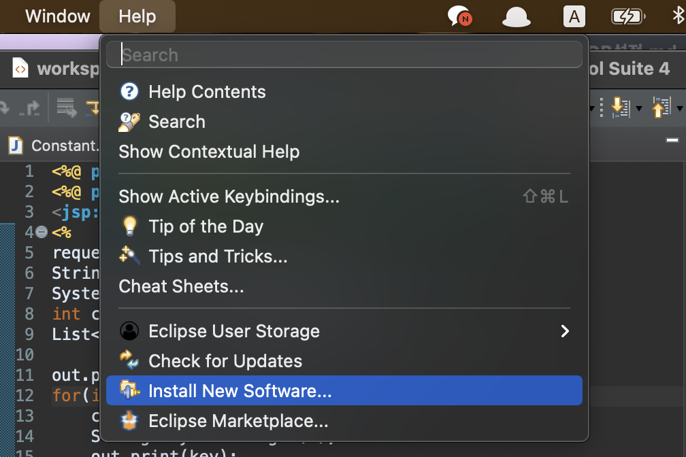
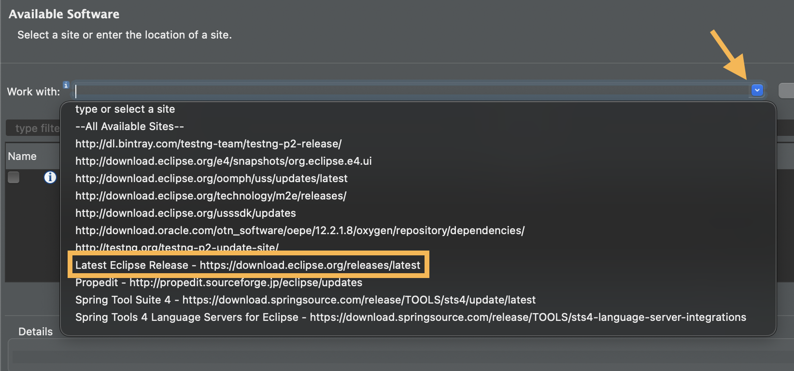
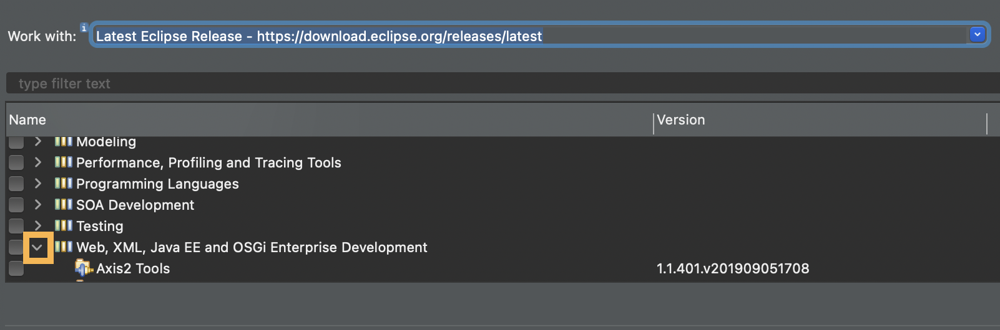
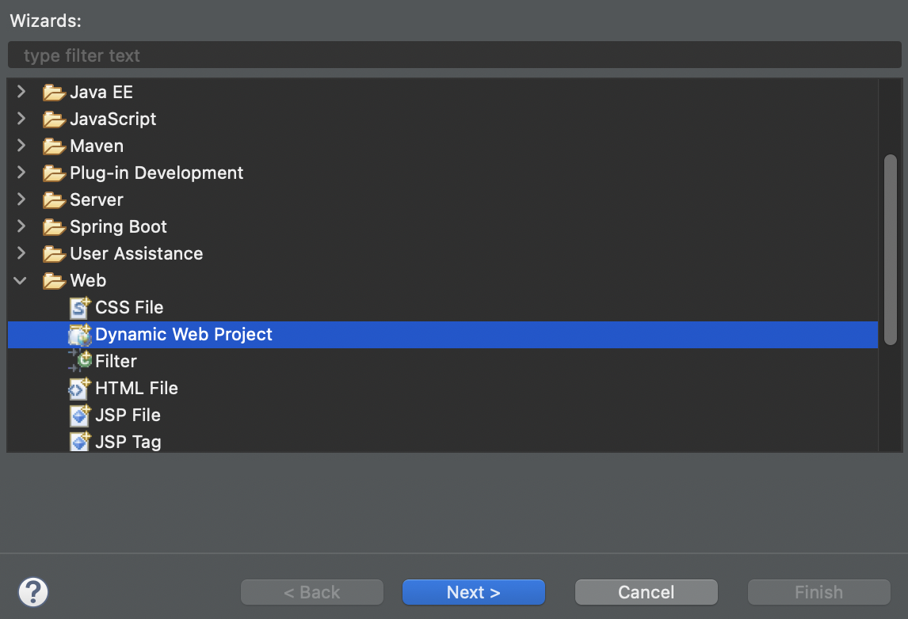
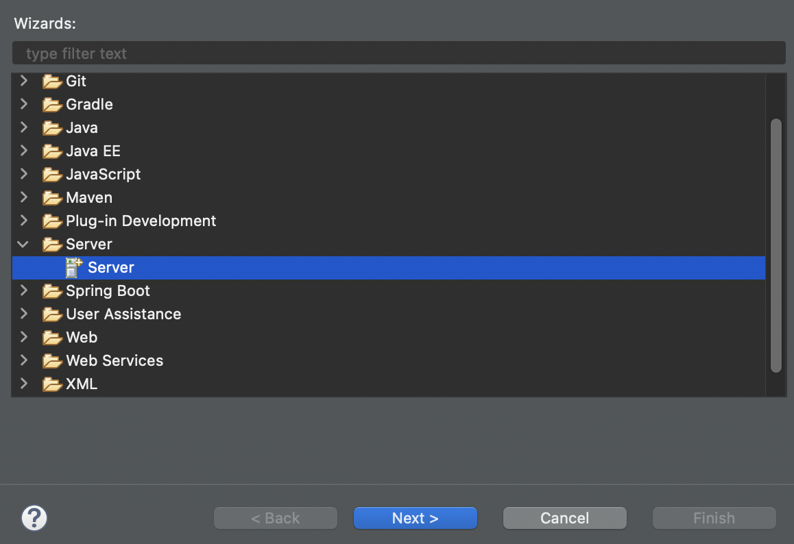
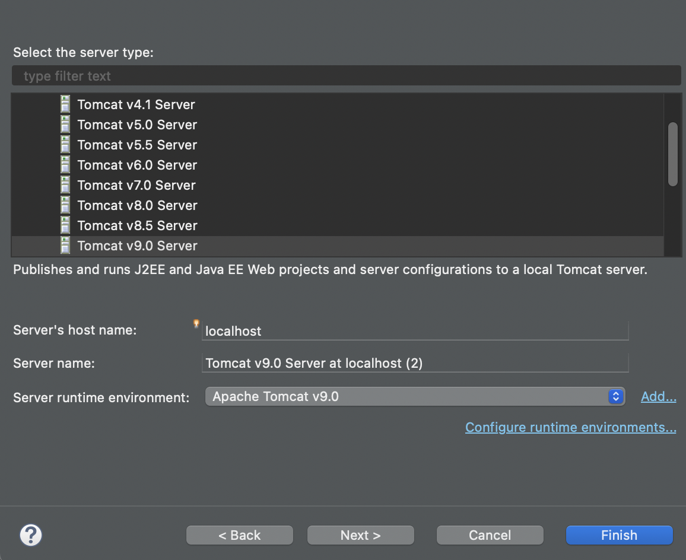

## STS에서 Dynamic Web Project 생성

### STS에 eclipse 플러그인 설치 및 톰캣 연결

(1) Help -> Install New Software 선택



Work with에서 






\- Web부분 선택 후 Eclipse 관련 항목 선택

\- 라이센스 동의하고 설치후 STS 재실행.


### Dynamic Web Project 생성

\- 프로젝터 생성 시 Dynamic Web Project로 생성



\- Preferences -> UTF-8 Encoding 설정 확인


### STS에 톰캣 연결

File -> New -> Other -> Web -> Dynamin New Project 생성시 톰캣연결

 

File -> New -> Other -> Server 선택 후 Next






### Dynamic Web Project 예제

\- javascript/java : workspace
\- suggest : 프로젝트 이름
\- WEB-INF/ojdbc8.jar
\- src/main/java/ : javatest의 utility 패키지 가져오기
\- utility.Constant.java 내용 변경

> Constant.java

```java
package utility;

public class Constant {
	public static final String DRIVER = "oracle.jdbc.pool.OracleDataSource";
			//.driver.OracleDriver";
	public static final String URL = "jdbc:oracle:thin:@db이름_high?TNS_ADMIN=전자지갑경로";
	public static final String USER = "admin";
	public static final String PASSWORD = "Oracle Colud DB Password";
}
```


#### Java Test

> JDBC_Test.java

```java
package utility;
 
import java.sql.Connection;
import java.sql.PreparedStatement;
import java.sql.ResultSet;
 
 
/**
 * JAVA Client Test
 */
public class JDBC_Test {
 
    public static void main(String[] args) {
 
        Connection con = Open.getConnection();
        PreparedStatement pstmt = null;
        ResultSet rs = null;
        
        // 테이블의 갯수 리턴
        String sql="SELECT count(*) as cnt FROM tab";
        
        try{
            pstmt = con.prepareStatement(sql);
            
            rs = pstmt.executeQuery();
            if (rs.next() == true){
                System.out.println("현재 생성된 테이블 갯수: " + rs.getInt("cnt"));
            }
        }catch(Exception e){
            System.out.println(e);
        }finally{
            DBClose.close(rs, pstmt, con);
        }
    }
}
```


#### Backend - DB 설정, DAO 작성

DBeaver 이용

- 테이블 구조

> suggest_0928.sql

```sql
CREATE TABLE suggest(
        suggestno NUMBER(7) NOT NULL,
        sqlpart VARCHAR(20) NOT NULL,
        sqlquery VARCHAR(100) NOT NULL, 
        etc VARCHAR(100) NULL,
        PRIMARY KEY(suggestno)
    );

DROP SEQUENCE suggest_seq;

CREATE SEQUENCE suggest_seq
START WITH 10
--시작번호, 0~9는 테스트 일련 번호
    INCREMENT BY 1
--증가값
    MAXVALUE 9999999
--최대값
CACHE 2
--시쿼스 변경시 자주 update되는 것을 방지하기위한 캐시값
NOCYCLE;

INSERT INTO suggest(suggestno, sqlpart, sqlquery, etc)
VALUES(suggest_seq.nextval, 'INSERT',
           'INSERT 테이블명 VALUES( ~ )', '');

INSERT INTO suggest(suggestno, sqlpart, sqlquery, etc)
VALUES(suggest_seq.nextval, 'INSERT',
           'INSERT 테이블명 ( ~ ) VALUES( ~ )', '');

INSERT INTO suggest(suggestno, sqlpart, sqlquery, etc)
VALUES(suggest_seq.nextval, 'SELECT',
           'SELECT * FROM ~', '');

INSERT INTO suggest(suggestno, sqlpart, sqlquery, etc)
VALUES(suggest_seq.nextval, 'SELECT',
           'SELECT * FROM ~ WHERE ~', '');

INSERT INTO suggest(suggestno, sqlpart, sqlquery, etc)
VALUES(suggest_seq.nextval, 'UPDATE',
           'UPDATE ~ SET ~', '');

INSERT INTO suggest(suggestno, sqlpart, sqlquery, etc)
VALUES(suggest_seq.nextval, 'UPDATE',
           'UPDATE ~ SET ~ WHERE ~', '');

INSERT INTO suggest(suggestno, sqlpart, sqlquery, etc)
VALUES(suggest_seq.nextval, 'DELETE',
           'DELETE FROM ~', '');

INSERT INTO suggest(suggestno, sqlpart, sqlquery, etc)
VALUES(suggest_seq.nextval, 'DELETE',
           'DELETE FROM ~ WHERE ~', '');

INSERT INTO suggest(suggestno, sqlpart, sqlquery, etc)
VALUES(suggest_seq.nextval, '자바코드',
           '자바001', '');

INSERT INTO suggest(suggestno, sqlpart, sqlquery, etc)
VALUES(suggest_seq.nextval, '자바코드',
           '자바002', '');

INSERT INTO suggest(suggestno, sqlpart, sqlquery, etc)
VALUES(suggest_seq.nextval, '자바코드',
           '자바003', '');

INSERT INTO suggest(suggestno, sqlpart, sqlquery, etc)
VALUES(suggest_seq.nextval, '모니터',
           'LCD 15inch', '');

INSERT INTO suggest(suggestno, sqlpart, sqlquery, etc)
VALUES(suggest_seq.nextval, '모니터',
           'LCD 16inch', '');

INSERT INTO suggest(suggestno, sqlpart, sqlquery, etc)
VALUES(suggest_seq.nextval, '모니터',
           'LCD 17inch', '');

INSERT INTO suggest(suggestno, sqlpart, sqlquery, etc)
VALUES(suggest_seq.nextval, '모니터',
           'LCD 18inch', '');

INSERT INTO suggest(suggestno, sqlpart, sqlquery, etc)
VALUES(suggest_seq.nextval, '모니터',
           'LCD 19inch', '');

INSERT INTO suggest(suggestno, sqlpart, sqlquery, etc)
VALUES(suggest_seq.nextval, '모니터',
           'LCD 20inch', '');

INSERT INTO suggest(suggestno, sqlpart, sqlquery, etc)
VALUES(suggest_seq.nextval, '모니터',
           'LCD 21inch', '');

INSERT INTO suggest(suggestno, sqlpart, sqlquery, etc)
VALUES(suggest_seq.nextval, '모니터',
           'LCD 22inch', '');

INSERT INTO suggest(suggestno, sqlpart, sqlquery, etc)
VALUES(suggest_seq.nextval, '모니터',
           'LCD 23inch', '');

INSERT INTO suggest(suggestno, sqlpart, sqlquery, etc)
VALUES(suggest_seq.nextval, '모니터',
           'LCD 24inch', '');

INSERT INTO suggest(suggestno, sqlpart, sqlquery, etc)
VALUES(suggest_seq.nextval, '모니터',
           'LCD 25inch', '');

SELECT *
FROM suggest;

COMMIT;

SELECT COUNT(sqlquery) AS cnt
FROM suggest
WHERE sqlquery LIKE 'INS%'
 
SELECT COUNT(sqlquery) AS cnt
FROM suggest
WHERE sqlquery LIKE '자%'
    
    
SELECT sqlquery
FROM suggest
WHERE sqlquery LIKE 'INS%'
ORDER BY sqlquery;

SELECT sqlquery
FROM suggest
WHERE sqlquery LIKE '자%'
ORDER BY sqlquery;
                                        
```


#### DAO 작성

>  suggest/SuggestDAO.java

```java
package suggest;
 
import java.sql.*;
import utility.*;
import java.util.*;
 
public class SuggestDAO {
    public int getCount(String keyword) {
        int count = 0;
        Connection con = Open.getConnection();
        PreparedStatement pstmt = null;
        ResultSet rs = null;
        StringBuffer sql = new StringBuffer();
        
        sql.append(" SELECT COUNT(sqlquery)");
        sql.append(" FROM suggest");
        sql.append(" WHERE sqlquery LIKE '"+keyword+"%'");
         
 
        try {
            pstmt = con.prepareStatement(sql.toString());
            rs = pstmt.executeQuery();
            if (rs.next()) {
                count = rs.getInt(1); // 수량 산출
            }
        } catch (Exception e) {
         e.printStackTrace();
        } finally {
            DBClose.close(rs, pstmt, con);
        }
        return count;
    }
 
    public List<String> getSqlquery(String keyword) {
        List<String> list = new ArrayList<String>();
        Connection con = Open.getConnection();
        PreparedStatement pstmt = null;
        ResultSet rs = null;
        StringBuffer sql = new StringBuffer();
 
        sql.append(" SELECT sqlquery");
        sql.append(" FROM suggest");
        
        sql.append(" WHERE sqlquery LIKE '"+keyword+"%'");
              
        sql.append(" ORDER BY sqlquery ASC");
 
        try {
            pstmt = con.prepareStatement(sql.toString());
            rs = pstmt.executeQuery();
            while (rs.next()) {
                String str = rs.getString(1);
                list.add(str);
            }
        } catch (Exception e) {
            e.printStackTrace();
        } finally {
            DBClose.close(rs, pstmt, con);
        }
        return list;
    }
}

```


#### 비동기 요청할 JSP페이지

> src/main/webapp/suggest.jsp

```jsp
<%@ page contentType="text/html; charset=UTF-8"%>
<%@ page import="java.util.*"%>
<jsp:useBean id="dao" class="suggest.SuggestDAO" />
<%
request.setCharacterEncoding("UTF-8");
String keyword = request.getParameter("keyword");
System.out.println(keyword);
int count = dao.getCount(keyword);
List<String> list = dao.getSqlquery(keyword);
 
out.print(count + "|") ;
for(int i =0; i < list.size() ; i++){
    count = count - 1;
    String key = list.get(i);
    out.print(key);
    if (count > 0){ // 값의 중간만 콤마 출력
        out.print(",");
    }
}
%>
```


#### 실행

\- 서버실행

\- `http://localhost:8000/suggest/suggest.jsp?keyword=자바 `

> 결과
>
> 


*Fin.🐧*

