# SpringBoot


## Framework 개념

### Framework란

- 프레임 워크의 사전적 의미 : 뼈대, 틀로 소프트웨어 관점에서 접근하면 아키텍처에 해당하는 골격코드
- 애플리케이션을 개발할 때, 가장 중요한 것이 전체 애플리케이션의 구조를 결정하는 아키텍처인데, 이 아키텍처에 해당하는 골격 코드를 프레임워크가 제공함.
- 프레임워크를 이용하여 개발하면, 개발자에게 모든 것을 위임하는 것이 아니라 애플리케이션의 기본 아키텍처는 프레임워크가 제공하고, 그 뼈대
   에 살을 붙이는 작업만 개발자가 한다.


### 프레임워크의 장점

잘 만들어진 프레임워크를 사용하면 애플리케이션에 대한 분석, 설계,구현 모두에게 재사용성이 증가하며, 다음과 같은 장점을 얻게 된다.

 ① 빠른구현 시간

- 아키텍처에 해당하는 골격 코드를 제공받기 때문에 개발자는 비즈니스 로직
   만 구현하면되고 제안된 시간에 많은 기능을 구현할 수 있다.

② 쉬운 관리

- 같은 프레임워크가 적용된 애플리케이션들은 아키텍쳐가 같아서 관리가 쉽다. 결과적으로 유지보수에 들어가는 인력과 시간도 줄일 수 있다.

③ 개발자들의 역량 획일화

- 숙련된 개발자와 초급 개발자는 지식과 경험이 달라 두 개발자의 소스의 품질은 당현히 다를 수밖에 없다. 하지만 프레임워크를 사용하면 숙련된 개발자와 초급 개발자가 생성한 코드가 비슷하다.
- 초급 개발자도 프레임워크를 통해서 세련되고 효율적인 코드를 생성할 수 있다.
- 관리자 입장에서 개발 인력을 더 효율적으로 구성할 수 있다.

④ 검증된 아키텍처의 재사용과 일관성 유지

- 프레임워크에서 제공하는 아키텍처를 사용하므로 아키텍처에 관한 별다른 고민이나 검증 없이 소프트웨어를 개발 할 수 있다.
- 개발된 시스템은 시간이 지나도 유지보수 과정에서 아키텍처가 왜곡되거나
    변형되지 않는다.


## Spring Framework

- 로드 존슨(Rod Johnson)이 2004년에 만든 오픈소스 프레임워크이다.
- 많은 디자인 패턴을 적용되어 배포되므로 프레임 워크를 이용하는 것 자체가 디자인 패턴을 사용하는 것이다.


### Spring Framework의 특징 ❗️

(1) 경량(Lightweight)

- 일반적인 J2EE 프레임워크 등 다른 프레임워크와 달리 객체간의 관계를 구성할 때 별도의 API를 등을 사용하지 않고 기존에 존재하는 라이브러리 등을 사용하기에 객체가 가볍다. ( J2EE 프레임워크에 비해! )

(2) 제어 역행(IoC: Inversion of Control)

- 기존에 자바 애플리케이션을 개발할 때 자바 객체를 생성하고 서로간 의존 관계를 연결작업에 대한 제어권은 보통 개발되는 어플리케이션에 있었다.
- Servlet, EJB 등을 사용하는 경우 Servlet Container, EJB Container에게 제어권이 넘어가서 객체의 생명주기(Life Cycle)를 Container들이 전담하게 된다.
- IoC의 제어 역행이란 객체의 생성에서부터 생명주기의 관리까지 모든 객체에 대한 제어권이 바뀌었다는 것을 의미한다.

(3) 의존성 관리(DI : Dependency Injection)

- 의존성(Dependency)이라는 것은 하나의 객체가 다른 객체 없이 제대로 된 역할을 할 수 없다는 의미이다. 
- 각각의 계층이나 서비스들 간에 의존성이 존재할 경우 프레임워크가 자동으로 관리한다.

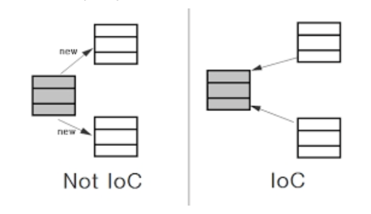

(4) 관점 지향 프로그래밍(AOP : Aspect-Oriented Programming)

- 트랜잭션이나 로깅, 보안과 같이 여러 모듈에서 공통적으로 사용하는 기능의 경우 해당 기능을 분리하여 관리할 수 있다.
- 공통모듈의 반복적인 코드를 줄이고, 핵심 비즈니스 로직에만 집중할 수 있는 방법을 제공한다.

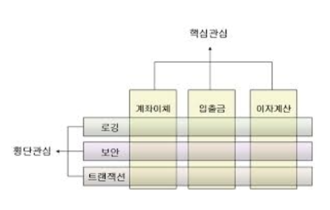

(5) 컨테이너

- 특정 객체의 생성과 관리를 담당하며 객체 운용에 필요한 기능 제공
- 일반적으로 서버안에 포함되어 배포 및 구동된다.
- 대표적인 컨테이너로는 Servlet 객체를 생성하고 관리하는 Servlet 컨테이너와 EJB객체를 생성하고 관리하는 EJB 컨테이너가 있다.
- Servlet 컨테이너는 톰캣서버에도 포함되어 있다.
- 애플리케이션 운용에 필요한 객체를 생성하고 객체 간의 의존관계를 관리한다는 점에서 스프링도 일종의 컨테이너라 할 수 있다.


## Spring Boot

- 현재의 스프링은 엔터프라이즈 시스템 개발에 필요한 분야를 지원하는 하나의 플랫폼으로 발전했다.
- 스프링은 다양한 기술들을 구현하기 위해 사용할 라이브러리가 많아졌고 그에 따라 관련 설정이 더욱 복잡해졌다.
- 이런 이유로 스프링을 처음 시작하는 사람들 대부분이 스프링의 복잡하고 방대한 설정 에 대해 부담을 느끼는 경우가 많다.
- 복잡한 설정은 필연적으로 오류를 발생할 가능성이 높다.
- 기존 스프링을 통한 개발의 이런 문제점을 해결하기 위해 스프링 부트가 탄생했다.
- 기존 스프링이 학습에 어려움이 있기에 쉽게 배울 수 있도록 개발된 것이 스프링 부트이다.


### 스프링 부트의 특징

- 웹 서버를 내장하고 있어, 복잡한 외적인 환경 설정과 실행을 간소화했다.

  따라서, 직접적인 개발과 관련이 적은 개발환경 설정보다는 개발 자체에 더 집중 할 수 있다.

- 스프링부트로 프로젝트 생성을 위해 제공하는 스타터는 필요한 라이브러리들을 관련된 것끼리 묶어 패키지를 제공한다.

- 스프링 부트가 자동으로 관련된 라이브러리들을 다운로드하고 라이브러리 사이의 의존성을 문제를 해결한다. 

- 모든 빈(Bean)설정은 XML이 아닌 어노테이션(annotation)으로 처리한다.


## IoC(Inversion of Control) 컨테이너

- 컨테이너 : 스프링 프레임워크를 이해하는데 중요한 부분
- 서블릿 컨테이너를 통해 스프링 컨테이너의 동작 방식 유추


### Spring Boot Project 생성

```
   Project Type  :  Spring Starter Project 
           Name  : HelloApp 
           Type  : Gradle
       Packaging : War
    Java Version : 8
       Language  : java
Group, Artifact, Version, Description :  기본값
       Package   : com.example.demo (기본값) 
       Library   : 선택하지 않음
```


## 4가지 클래스 유형 실습

### 결합도(Coupling)가 높은 클래스

- 결합도란 하나의 클래스가 다른 클래스와 얼마나 많이 연결되어 있는지를 나타내는 표현이며, 결합도가 높은 프로그램은 유지 보수가 어렵다.


- SamsungTV와 LgTV의 시청에 필요한 필수 기능 4개
- TVUser 클래스에서 두개 TV클래스를 사용하면 두 클래스의 메소드 원형이 다르기 때문에 TV 교체시 다변경해야 하므로 유지보수가 힘들어 지고, TV교체를 결정하기 쉽지 않다.
- src/main/java 패키지 만든 후 클래스 생성한다.

> package coupling;
>
> SamsungTV.java

```java
package coupling;

public class SamsungTV {
	public void powerOn() {
		System.out.println("SamsungTV.....전원 켠다.");
	}

	public void powerOff() {
		System.out.println("SamsungTV.....전원 끈다.");
	}

	public void volumeUp() {
		System.out.println("SamsungTV.....소리 올린다.");
	}

	public void volumeDown() {
		System.out.println("SamsungTV.....소리 내린다.");
	}

}
```


> LgTV.java

```java
package coupling;

public class LgTV {
	public void turnOn() {
		System.out.println("LgTV.....전원 켠다.");
	}

	public void turnOff() {
		System.out.println("LgTV.....전원 끈다.");
	}

	public void soundUp() {
		System.out.println("LgTV.....소리 올린다.");
	}

	public void soundDown() {
		System.out.println("LgTV.....소리 내린다.");
	}
}
```


> TVUser.java

```java
package coupling;

public class TVUser {

	public static void main(String[] args) {
		SamsungTV tv = new SamsungTV();
		tv.powerOn();
		tv.powerOff();
		tv.volumeUp();
		tv.volumeDown();

		LgTV tv2 = new LgTV();
		tv2.turnOn();
		tv2.turnOff();
		tv2.soundUp();
		tv2.soundDown();
	}
}
```


### 다형성 이용하기

- 결합도를 낮추기 위해서 객체지향 언어의 핵심 개념인 다형성(Polymorphism)을 이용한다. 결합도 높은 위의 예제를 수정.
- 다형성을 이용하려면 상속과 메소드 재정의(Overriding), 형변환이 필요.

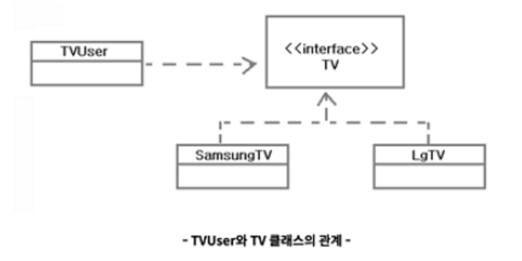


> package polymorphism;
>
> TV.java (interface)

```java
package polymorphism;

public interface TV {
	void powerOn();

	void powerOff();

	void volumeUp();

	void volumeDown();
}
```


> SamsungTV.java

```java
package polymorphism;

public class SamsungTV implements TV {

	@Override
	public void powerOn() {
		System.out.println("SamsungTV.....전원 켠다.");
	}

	@Override
	public void powerOff() {
		System.out.println("SamsungTV.....전원 끈다.");
	}

	@Override
	public void volumeUp() {
		System.out.println("SamsungTV.....소리 올린다.");
	}

	@Override
	public void volumeDown() {
		System.out.println("SamsungTV.....소리 내린다.");
	}
}
```


> LgTV.java

```java
package polymorphism;

public class LgTV implements TV {

	@Override
	public void powerOn() {
		System.out.println("LgTV.....전원 켠다.");
	}

	@Override
	public void powerOff() {
		System.out.println("LgTV.....전원 끈다.");
	}

	@Override
	public void volumeUp() {
		System.out.println("LgTV.....소리 올린다.");
	}

	@Override
	public void volumeDown() {
		System.out.println("LgTV.....소리 내린다.");
	}
}
```


> TVUser.java

```java
package polymorphism;

public class TVUser {

	public static void main(String[] args) {
		TV tv = new SamsungTV();
		tv.powerOn();
		tv.powerOff();
		tv.volumeUp();
		tv.volumeDown();

		TV tv2 = new LgTV();
		tv2.powerOn();
		tv2.powerOff();
		tv2.volumeUp();
		tv2.volumeDown();
	}
}
```


### 디자인 패턴 이해하기

- 결합도를 낮추는 또 하나의 방법으로 디자인 패턴을 이용한다.
- TV를 교체할 때, 클라이언트 소스(TVUser.java)를 수정하지 않고 TV를 교체 한다면 유지보수는 더욱 편해진다.
- Factory패턴을 적용하여, 클라이언트에서 사용할 객체 생성을 캡슐화하여 TVUser와 TV 사이를 느슨한 결합 상태로 만들어준다.

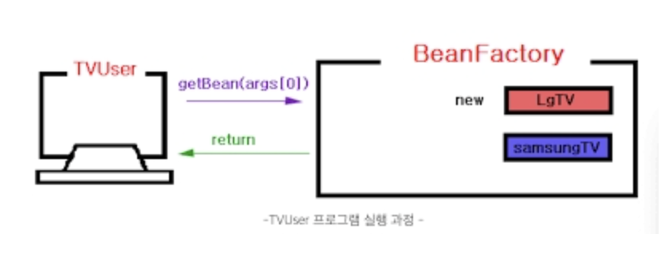

> package factory;
>
> TV.java (interface)

```java
package factory;

public interface TV {
	void powerOn();

	void powerOff();

	void volumeUp();

	void volumeDown();
}
```


> SamsungTV.java

```java
package factory;

public class SamsungTV implements TV {

	public void powerOn() {
		System.out.println("SamsungTV.....전원 켠다.");
	}

	public void powerOff() {
		System.out.println("SamsungTV.....전원 끈다.");
	}

	public void volumeUp() {
		System.out.println("SamsungTV.....소리 올린다.");
	}

	public void volumeDown() {
		System.out.println("SamsungTV.....소리 내린다.");
	}
}
```


> LgTV.java

```java
package factory;

public class LgTV implements TV {

	public void powerOn() {
		System.out.println("LgTV.....전원 켠다.");
	}

	public void powerOff() {
		System.out.println("LgTV.....전원 끈다.");
	}

	public void volumeUp() {
		System.out.println("LgTV.....소리 올린다.");
	}

	public void volumeDown() {
		System.out.println("LgTV.....소리 내린다.");
	}

}
```


> BeanFactory.java

```java
package factory;

public class BeanFactory {
	public static TV getBean(String beanName) {
		if (beanName.equals("samsung")) {
			return new SamsungTV();
		} else if (beanName.equals("lg")) {
			return new LgTV();
		}
		return null;
	}
}
```


> TVUser.java
>
> Run configurations -> 인자로 samsung or lg

```java
package factory;

public class TVUser {

	public static void main(String[] args) {
		TV tv = BeanFactory.getBean(args[0]);
		tv.powerOn();
		tv.powerOff();
		tv.volumeUp();
		tv.volumeDown();
	}
}
```


### 스프링 IoC를 이용

- Ioc 컨테이너는 각 컨테이너에서 관리할 객체들를 위한 별도의 설정클래스(TVConfig.java)를 사용한다.
- 설정클래스는 HelloAppApplication 클래스와 같은 패키지에 만든다.
- HelloAppApplication 클래스는 시작 클래스 이며, 프로젝트가 시작될 때 설정클래스에서 생성된 빈을 가져와 사용한다.

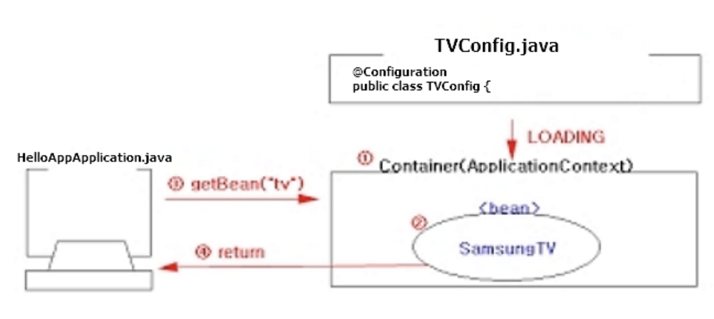

> package ioc;
>
> TV.java

```java
package ioc;

public interface TV {
	void powerOn();

	void powerOff();

	void volumeUp();

	void volumeDown();
}
```


> SamsungTV.java

```java
package ioc;

public class SamsungTV implements TV {

	public SamsungTV() {
		System.out.println(">>>SamsungTV 객체 생성");
	}

	public void powerOn() {
		System.out.println("SamsungTV.....전원 켠다.");
	}

	public void powerOff() {
		System.out.println("SamsungTV.....전원 끈다.");
	}

	public void volumeUp() {
		System.out.println("SamsungTV.....소리 올린다.");
	}

	public void volumeDown() {
		System.out.println("SamsungTV.....소리 내린다.");
	}
}
```


> LgTV.java

```java
package ioc;

public class LgTV implements TV {

	public LgTV() {
		System.out.println(">>>> LgTV 객체 생성");
	}

	public void powerOn() {
		System.out.println("LgTV.....전원 켠다.");
	}

	public void powerOff() {
		System.out.println("LgTV.....전원 끈다.");
	}

	public void volumeUp() {
		System.out.println("LgTV.....소리 올린다.");
	}

	public void volumeDown() {
		System.out.println("LgTV.....소리 내린다.");
	}

}
```


- @Configuration 어노테이션이 붙은 클래스는 스프링 설정으로 사용됨을 의미한다.
- @Bean 어노테이션이 붙은 메서드의 리턴값은 빈 객체로 사용됨을 의미한다.
- @Bean(name="samsung")은 빈으로 등록될 빈의 이름을 지정한다. 별도의 이름을 지정하지 않으면 메서드 이름이 빈의 이름으로 등록된다.


> com.example.demo.TVConfig.java

```java
package com.example.demo;

import org.springframework.context.annotation.Bean;
import org.springframework.context.annotation.Configuration;

import ioc.LgTV;
import ioc.SamsungTV;
import ioc.TV;

@Configuration
public class TVConfig {
	@Bean
	public TV lgCreate() {
		LgTV tv = new LgTV();

		return tv;
	}

	@Bean(name = "samsung")
	public TV SamsungCreate() {

		return new SamsungTV();
	}

}
```


- 자동으로 생성된 시작 클래스에 아래 코드를 추가한 후 실행한다.

  파일 선택 -> Run AS -> Spring Boot App

>  HelloAppApplication.java

```java
package com.example.demo;

import org.springframework.boot.SpringApplication;
import org.springframework.boot.autoconfigure.SpringBootApplication;
import org.springframework.context.ApplicationContext;
import org.springframework.context.annotation.AnnotationConfigApplicationContext;

import ioc.SamsungTV;
import ioc.TV;

@SpringBootApplication
public class HelloAppApplication {

	public static void main(String[] args) {
		SpringApplication.run(HelloAppApplication.class, args);

		// 추가하는 부분(ioc 예제)
		// 1.IoC 컨테이너 생성
		ApplicationContext context = new AnnotationConfigApplicationContext(TVConfig.class);

		// 2.LgTV Bean 가져오기
		TV lg = (TV) context.getBean("lgCreate");
		lg.powerOn();
		lg.volumeUp();
		lg.volumeDown();
		lg.powerOff();

		// 3.SamsungTV Bean 가져오기
		TV samsung = (TV) context.getBean("samsung", SamsungTV.class);
		samsung.powerOn();
		samsung.volumeUp();
		samsung.volumeDown();
		samsung.powerOff();
	}

}
```


## 의존성 관리

### 스프링의 의존성 관리 방법

- 스프링 프레임워크는 객체 생성과 의존관계를 컨테이너가 자동으로 관리한다.

- 스프링 IoC의 핵심 원리이고 두 가지 형태로 지원한다.


- 컨테이너가 객체생성하고 클라이언트가 검색(Lookup)하여 사용하는 방식이 Dependency Lookup이다
- 실제 애플리케이션 개발과정에서 대부분 Dependency Injection을 사용한다.
- Dependency Injection은 객체 사이의 의존 관계를 프로그램 코드에 포함된 어노테이션 정보를 바탕으로 컨테이너가 자동으로 처리해 준다.
- 의존성 설정을 바꾸고 싶을때 프로그램 코드의 어노테이션 정보만 수정하여
   변경사항을 적용할 수 있어 유지보수가 향상된다.


## Annotation DI(Dependency Injection)의 구현


### 1. Spring Boot Project 생성

project Name : diApp

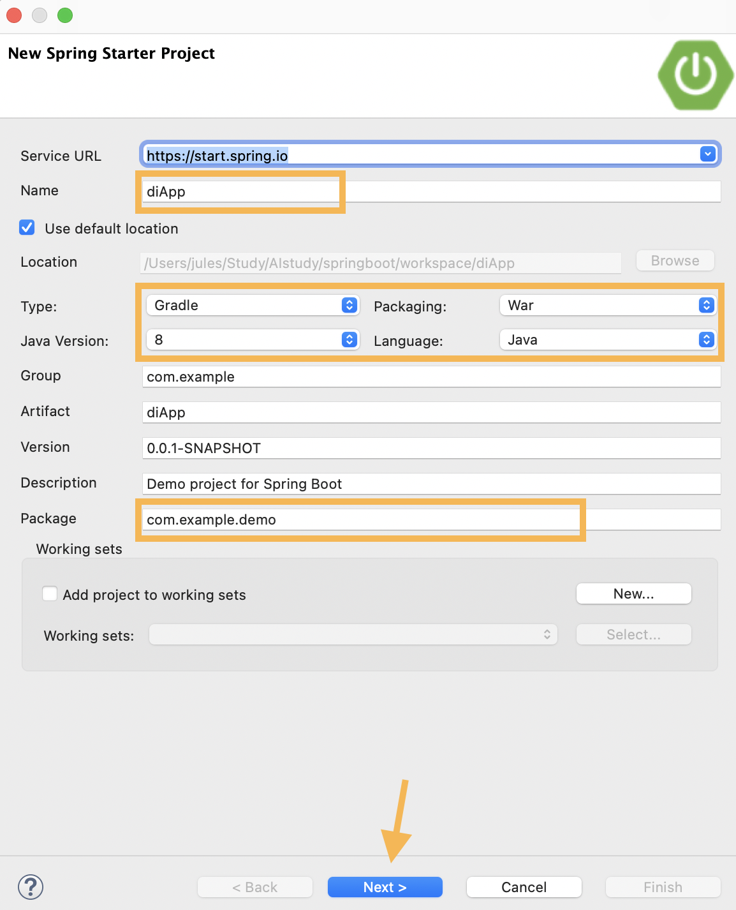


### 2. 객체 자동 생성 및 주입

- @Component("samsungTV"): 컨테이너가 객체를 생성 해준다. 빈 이름은 samsungTV로 등록된다.
- @Autowired : DI 부분 AppleSpeaker 타입의 객체가 주입된다.
- @Value("400000") : 문자열, 기본형 타입의 값이 주입된다.

>package ioc_di;
>
>AppleSpeaker.java

```java
package ioc_di;

import org.springframework.stereotype.Component;

@Component("apple")
public class AppleSpeaker {

	public AppleSpeaker() {
		System.out.println(">>> AppleSpeaker 객체 생성");
	}

	public void volumUp() {
		System.out.println("AppleSpeaker.......소리 올린다.");
	}

	public void volumDown() {
		System.out.println("AppleSpeaker........소리 내린다.");
	}

}
```


> ioc_di.TV.java

```java
package ioc_di;

public interface TV {
	void powerOn();

	void powerOff();

	void volumeUp();

	void volumeDown();
}
```


> ioc_di.SamsungTV.java

```java
package ioc_di;

import org.springframework.beans.factory.annotation.Autowired;
import org.springframework.beans.factory.annotation.Value;
import org.springframework.stereotype.Component;

@Component("samsungTV")
public class SamsungTV implements TV {

	@Autowired
	private AppleSpeaker speaker;
	@Value("400000")
	private int price;

	public SamsungTV() {
		System.out.println(">>>>>>> SamsungTV 객체 생성");
	}

	public void powerOn() {
		System.out.println("SamsungTV...전원 켠다.(가격:" + price + ")");
	}

	public void powerOff() {
		System.out.println("SamsungTV...전원 끈다.");
	}

	public void volumeUp() {
		speaker.volumUp();
	}

	public void volumeDown() {
		speaker.volumDown();
	}
}
```


> ioc_di.LgTV.java

```java
package ioc_di;

import org.springframework.beans.factory.annotation.Autowired;
import org.springframework.beans.factory.annotation.Value;
import org.springframework.stereotype.Component;

@Component("lgTV")
public class LgTV implements TV {
	@Autowired
	private AppleSpeaker speaker;
	@Value("500000")
	private int price;

	public LgTV() {
		System.out.println(">>>>>> LgTV 객체 생성");
	}

	public void powerOn() {
		System.out.println("LgTV.....전원 켠다.(가격:" + price + ")");
	}

	public void powerOff() {
		System.out.println("LgTV....전원 끈다");
	}

	public void volumeUp() {
		speaker.volumUp();
	}

	public void volumeDown() {
		speaker.volumDown();
	}
}
```


### 3. Application 시작클래스에 패키지 등록 및 Controller 호출

- Application 클래스와 같은 패키지 내부에 포함되지 않을 경우 Ioc와 Di가 자동인식이 안된다.
- 시작 클래스에서 자동으로 Ioc와 Di가 인식하도록 외부 패키지를 등록한다.
- Spring Boot 프로젝트는 생성시 Packaging : War로 지정하면 Controller를 요청할 수 있는 웹 프로젝트가 만들어진다.
- Controller 클래스를 만들어 Ioc와 Di를 테스트 한다.
- @Qualifier : 동일한 인터페이스를 구현한 클래스가 여러개 있는 경우 이름을 지정하여 명확하게 클래스를 인식할 수 있다.
- @RequestMapping("/") : 웹브라우저 주소창에 url 를 입력하면 이 어노테이션에 등록된 메서드가 호출된다.
- @ResponseBody : html 태그없이 문자열 데이터만 응답된다 (Json, xml등 Rest Api형태 응답)

> package com.example.demo;
>
> DiAppApplication.java
>
> ```java
> @ComponentScan(basePackages = { "ioc_di" }) 
> // 어노테이션 추가
> ```
>
> 

```java
package com.example.demo;

import org.springframework.boot.SpringApplication;
import org.springframework.boot.autoconfigure.SpringBootApplication;
import org.springframework.context.annotation.ComponentScan;

@SpringBootApplication
@ComponentScan(basePackages = { "ioc_di" }) // 추가
public class DiAppApplication {

	public static void main(String[] args) {
		SpringApplication.run(DiAppApplication.class, args);
	}

}

```


> package ioc_di;
>
> DiController.java

```java
package ioc_di;

import org.springframework.beans.factory.annotation.Autowired;
import org.springframework.beans.factory.annotation.Qualifier;
import org.springframework.stereotype.Controller;
import org.springframework.web.bind.annotation.RequestMapping;
import org.springframework.web.bind.annotation.ResponseBody;

@Controller
public class DiController {
	@Autowired
	@Qualifier("samsungTV")
	private TV tv;
	
	@Autowired
	@Qualifier("lgTV")
	private TV tv2;

	@RequestMapping("/")
	public @ResponseBody String root() {

		// 1.samsungTV Bean 가져오기
		tv.powerOn();
		tv.volumeUp();
		tv.volumeDown();
		tv.powerOff();

		// 2.lgTV Bean 가져오기
		tv2.powerOn();
		tv2.volumeUp();
		tv2.volumeDown();
		tv2.powerOff();

		return "Annotation DI 사용하기";
	}
}
```


### 4. 테스트

- diApp 프로젝트 선택 -> Run As -> Spring Boot App
- 실행 후 콘솔확인

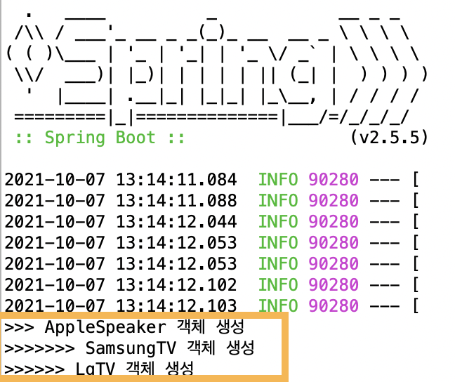

- 브라우저 확인

```
http://localhost:8080/
```

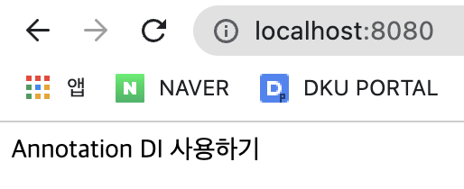


- 브라우저 확인 후 변경된 콘솔 확인

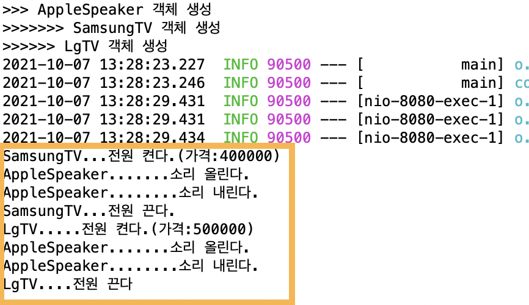


## Spring boot 시작하기

### 스프링 부트의 장점

- 프로젝트에따라 자주 사용되는 라이브러리들이 미리 조합되어 있다.
- 복잡한 설정을 자동으로 처리해 준다.
- 내장 서버를 포함해서 톰캣과 같은 서버를 추가로 설치하지 않아도 바로 개발이 가능하다.
- 톰캣이나 제티(Jetty)와 같은 웹 애플리케이션 서버(WAS Web Application Server)에 배포하지 않고도 실행할 수 있는 JAR 또는 WAR 파일로 웹 애플리케이션을 개발할 수 있다.
- sts는 기본적으로 빌드 도구 Maven을 내장하고 있지만, Maven의 xml문서는 양이 방대해지는 단점이 있으므로 설정이 간편하고 프로젝트별로 유연하게 설정할 수 있는 Gradle을 사용한다.


### 스프링 부트로 프로젝트 생성하기

- File -> New -> Spring Starter Project 선택, 새 스프링 부트 프로젝트 생성.


- [Next]을 선택하여 스프링 프레임워크의 다양한 라이브러리를 선택한다.
- DevTools는 스프링 부트 1.3부터 추가된 기능으로 개발 생산성 향상을 목표로 한다.
- Web 검색후 -> spring Web 선택
- Developer Tools -> Spring Boot DevTools

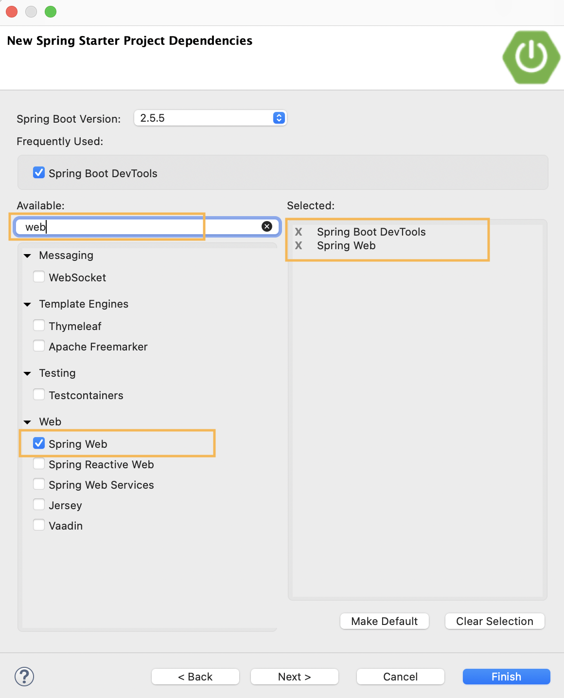

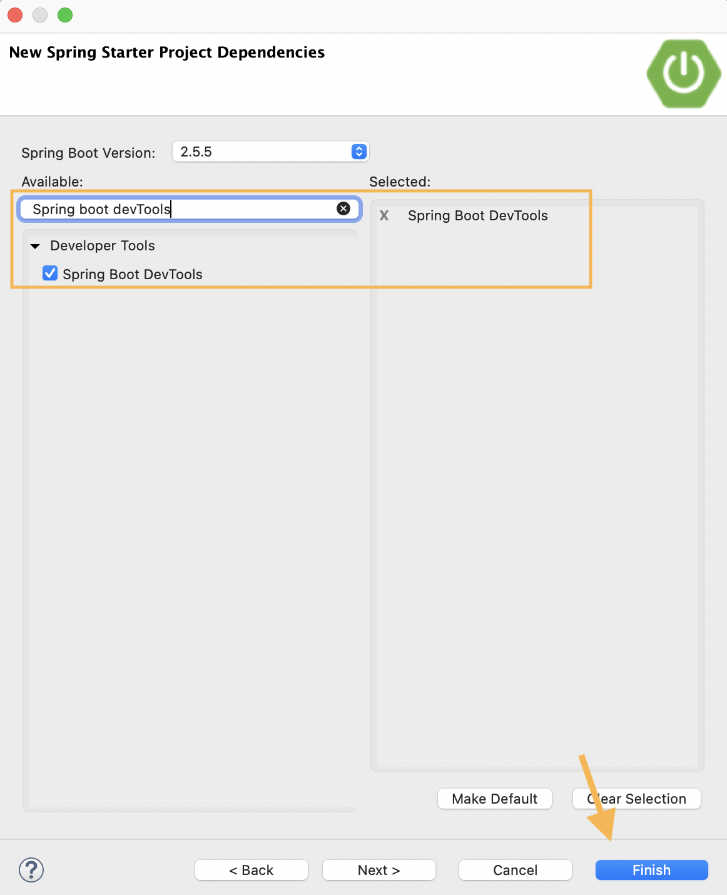


### Hello world 출력할 HelloController 생성

- **[주의]자동으로 생성되는 SampleApplication 패키지의 하위패키지를 만든다.**
- src/main/java의 com/example/sample/controller 생성
- com/example/sample/controller/HelloController 생성 

> package com.example.sample.controller;
>
> HelloController.java

```java
package com.example.sample.controller;

import org.springframework.web.bind.annotation.GetMapping;
import org.springframework.web.bind.annotation.RestController;

@RestController
public class HelloController {
	@GetMapping
	public String hello() {

		return "Hello World!";
	}
}
```


### Spring boot 프로젝트 sample 실행

- sample 프로젝트  -> Run As -> Spring Boot App 선택 실행.
- console 결과

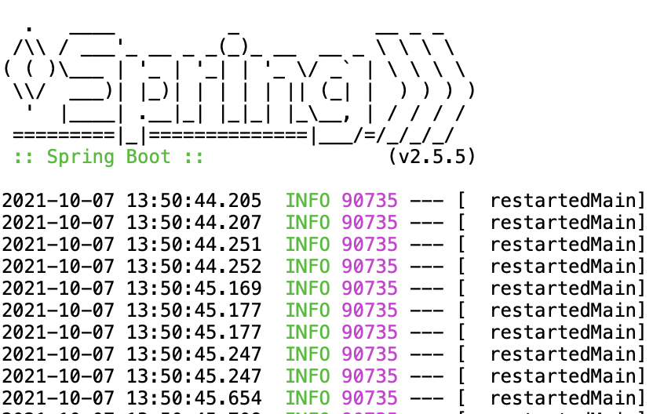

- 브라우저에서 

```
http://localhost:8080/
```

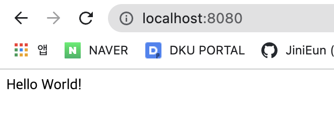


 \- 기본 포트가 8080으로 Oracle XE 18c 포트와 충돌이 날 경우 Spring boot의 포트를 변경한다.

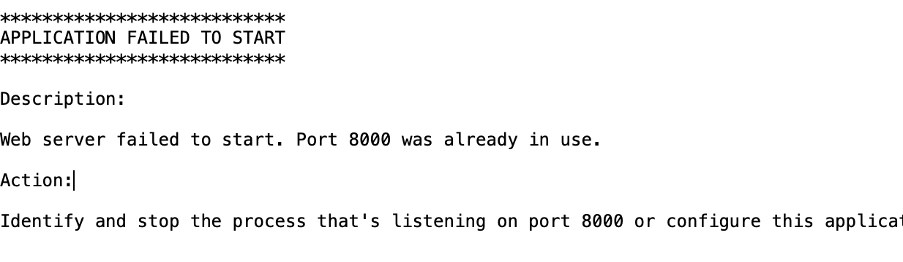

 \>>> src/main/resources/application.properties

```
server.port = 8000
```


- 브라우저에서

```
http://localhost:8000/
```

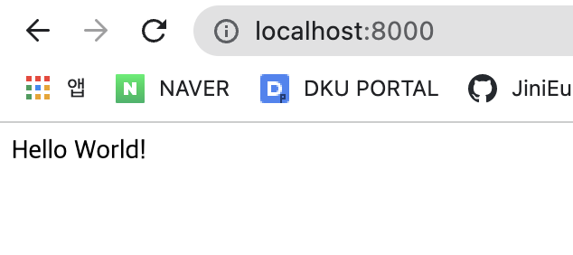


### 스프링 부트 프로젝트 살펴보기

#### (1) 프로젝트의 주요 파일 및 구조

- src/main/java 
  자바소스 폴더

- SampleApplication 
  애플리케이션을 시작할 수 있는 main메소드가 존재하는 스프링 구성 메인 클래스

- src/main/resources/static
  HTML, 스타일 시트, 자바스크립트, 이미지 등의 정적 리소스 폴더

- application.properties

  애플리케이션 및 스프링의 설정 등에서 사용할 여러 가지 프로퍼티(property)정의

- Project and External Dependencies :
  Gradle에 명시된 프로젝트의 필수 라이브러리 모음  

- src 
  JSP등 리소스 디렉토리

- build.gradle  
  Gradle 빌드 명세, 프로젝트에 필요한 라이브러리 관리, 빌드 배포 설정

  스프링 부트의 버전을 명시

  자바 버전 명시

  의존성 옵션

  implementation: 의존 라이브러리 수정시 본 모듈까지만 재빌드(재컴파일)

  api: 의존 라이브러리 수정시 본 모듈을 의존하는 모듈들도 재빌드(재컴파일)

  compileOnly: compile 시에만 빌드하고 빌드 결과물에는 포함하지 않음

  runtime(실행)시 필요없는 라이브러리인 경우 

  runtimeOnly: runtime 시에만 필요한 라이브러리인 경우

  providedRuntime: 실행시 제공되는 library

  testImplementation: 테스트시 관련 library 제공


#### (2) SampleApplication 클래스

- 스프링 부트 애플리케이션의 구성과 실행을 담당하는 중요한 클래스
- 스프링 부트의 장점 중 하나는 자동 구성으로 기존의 복잡하고 다양한 스프링 설정을 제거하고 최소한의 설정으로 바로 실행할 수 있는 애플리케이션을 만들어준다는 점

> package com.example.sample;
>
> SampleApplication.java

```java
package com.example.sample;

import org.springframework.boot.SpringApplication;
import org.springframework.boot.autoconfigure.SpringBootApplication;

@SpringBootApplication
public class SampleApplication {

	public static void main(String[] args) {
		SpringApplication.run(SampleApplication.class, args);
	}

}
```


- @SpringBootApplication는 스프링 부트의 핵심 어노테이션이며 세 개의 스프링 부트 어노테이션으로 구성되어 있다.
- @EnableAutoConfiguration : 스프링의 다양한 설정을 자동으로 구성한다.
- @ComponentScan : 컴포넌트 클래스를 검색하고 검색된 컴포넌트 및 클래스를 스프링 애플리케이션 컨텍스트에 등록한다.
- @Configuration : 자바기반 설정 파일임을 의미한다.(XML설정대신 사용)
- main메소드는 스프링 부트의 SampleApplication.run() 메소드를 사용하여 스프링 부트 프로젝트 애플리케이션을 실행할 수 있게 한다.


#### (3) build.gradle

- Gradle로 생성된 프로젝트의 빌드를 관리하는 파일이다.

```java
plugins {
	id 'org.springframework.boot' version '2.5.5' //스프링부트 버전
	id 'io.spring.dependency-management' version '1.0.11.RELEASE'
	id 'java'
	id 'war'
}

group = 'com.example'
version = '0.0.1-SNAPSHOT'
sourceCompatibility = '1.8'

repositories {
	mavenCentral() //라이브러리 받아오는 저장소 설정
}

 //필요한 라이브러리 의존성을 설정한다. 라이브러리 추가할때마다 변경된다.
dependencies {
	implementation 'org.springframework.boot:spring-boot-starter-web'
	developmentOnly 'org.springframework.boot:spring-boot-devtools'
	providedRuntime 'org.springframework.boot:spring-boot-starter-tomcat'
	testImplementation 'org.springframework.boot:spring-boot-starter-test'
}

test {
	useJUnitPlatform()
}

```


##  Boot Project sample 에서 여러가지 설정

- sample boot project에서 작업


### 개발편의 모듈 devtools 설정

- devtools(Developer Tools)는 스프링 부트에서 제공하는 개발 편의를 위한 모듈이다.
- 주로 변경된 코드를 서버 또는 화면에 신속하게 반영해 결과를 확인하기 위해서 사용한다.
- 프로젝트 생성시 라이브러리 선택을 못했을 경우는 저장소에서 검색하여 추가한다.

#### (1)`[http://mvnrepository.com ](http://mvnrepository.com/)`

- 저장소에서 spring-boot-devtools 검색(Spring version 2.4.3과 일치를 권장)

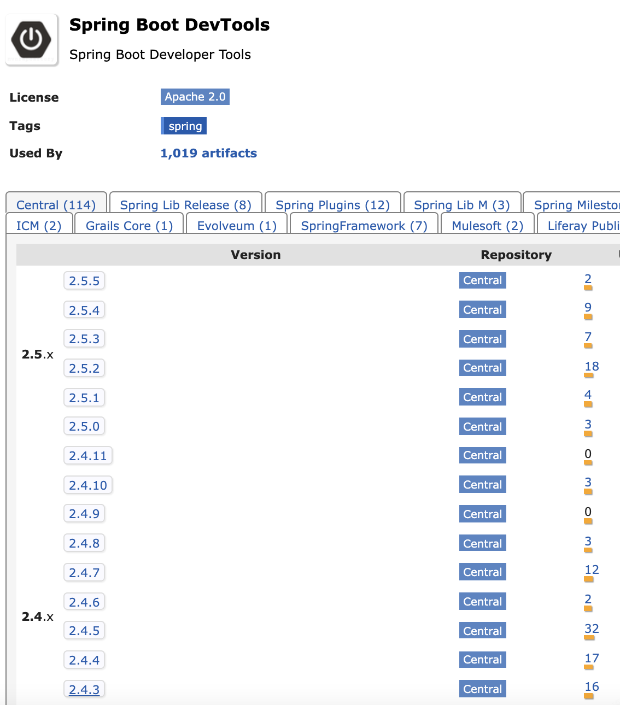

2.4.3 선-> Gradle -> 코드 복사 (build.gradle dependencies에 붙여 넣기)

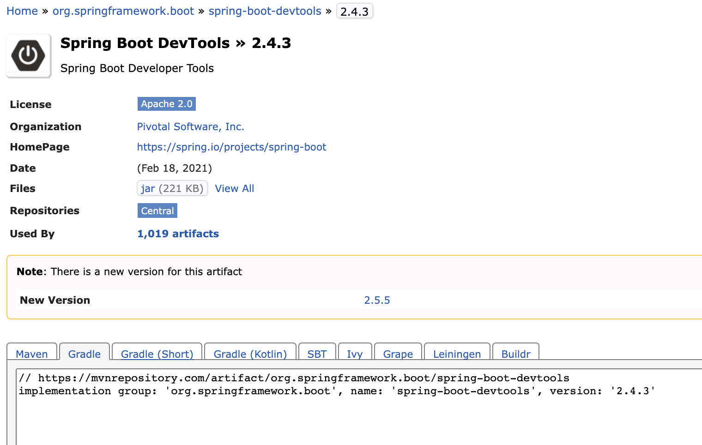


#### (2) 설정 추가

- build.gradle에 dependencies {}안에 추가한다.

> build.gradle

```java
plugins {
	id 'org.springframework.boot' version '2.5.5'
	id 'io.spring.dependency-management' version '1.0.11.RELEASE'
	id 'java'
	id 'war'
}

group = 'com.example'
version = '0.0.1-SNAPSHOT'
sourceCompatibility = '1.8'

repositories {
	mavenCentral()
}

dependencies {
	implementation 'org.springframework.boot:spring-boot-starter-web'
	developmentOnly 'org.springframework.boot:spring-boot-devtools'
	providedRuntime 'org.springframework.boot:spring-boot-starter-tomcat'
	testImplementation 'org.springframework.boot:spring-boot-starter-test'
	
	// 추가한 부분
	// https://mvnrepository.com/artifact/org.springframework.boot/spring-boot-devtools
	implementation group: 'org.springframework.boot', name: 'spring-boot-devtools', version: '2.4.3'
}

test {
	useJUnitPlatform()
}
```


/src/main/resources/application.properties 변경

```properties
server.port = 8000
# DEVTOOLS (DevToolsProperties)
spring.devtools.livereload.enabled=true
```


#### (3) Gradle refresh

- build.gradle 선택 -> Gradle -> Refresh Gradle Project

gradle을 수정한 경우 다음과 같이 refresh 해줘야 한다.

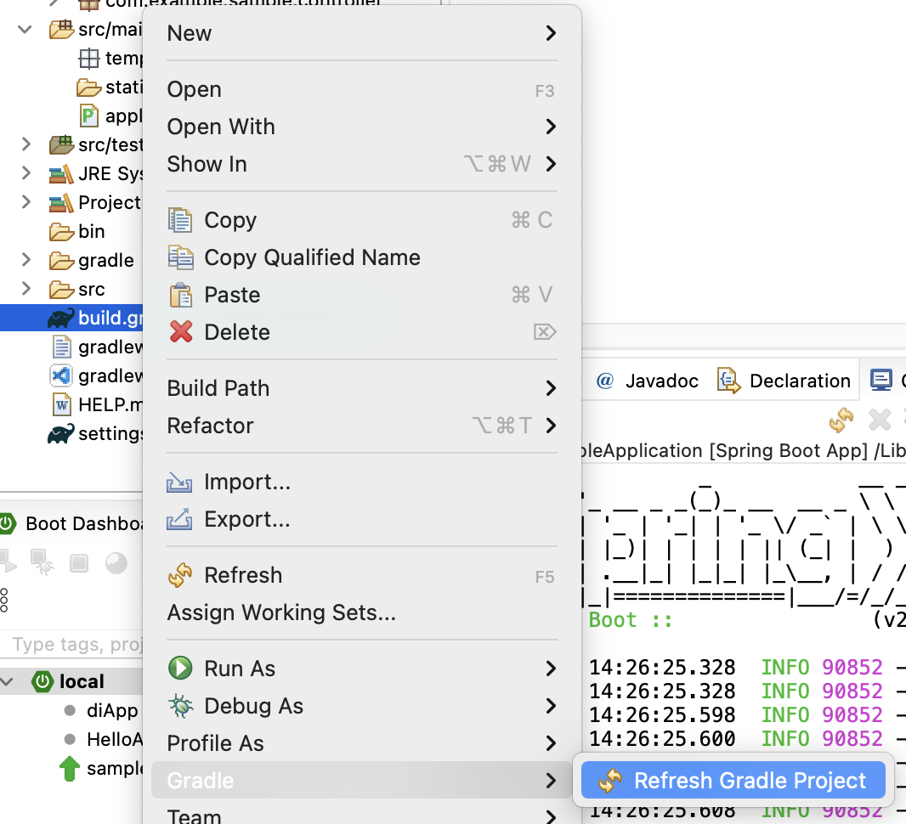


### JSP 실행 설정

#### (1) jsp 사용을 위한 설정 추가

- 톰캣이 jsp파일을 컴파일할 수 있도록 만들어주는 라이브러리 추가
- build.gradle에 등록 후 Refresh Gradle Project 한다.
- application.properties에 JSP사용이 가능하도록 설정한다.

> build.gradle

```java
plugins {
	id 'org.springframework.boot' version '2.5.5'
	id 'io.spring.dependency-management' version '1.0.11.RELEASE'
	id 'java'
	id 'war'
}

group = 'com.example'
version = '0.0.1-SNAPSHOT'
sourceCompatibility = '1.8'

repositories {
	mavenCentral()
}

dependencies {
	implementation 'org.springframework.boot:spring-boot-starter-web'
	developmentOnly 'org.springframework.boot:spring-boot-devtools'
	providedRuntime 'org.springframework.boot:spring-boot-starter-tomcat'
	testImplementation 'org.springframework.boot:spring-boot-starter-test'
	
	// 추가한 부분
	// https://mvnrepository.com/artifact/org.springframework.boot/spring-boot-devtools
	implementation group: 'org.springframework.boot', name: 'spring-boot-devtools', version: '2.4.3'
	implementation 'javax.servlet:jstl'
	implementation 'org.apache.tomcat.embed:tomcat-embed-jasper'  
}

test {
	useJUnitPlatform()
}
```


> application.properties 추가

```properties
server.port = 8000
# DEVTOOLS (DevToolsProperties)
spring.devtools.livereload.enabled=true
# jsp 설정
spring.mvc.view.prefix=/WEB-INF/views/
spring.mvc.view.suffix=.jsp
```


#### (2) JSP 파일이 위치할 폴더 생성
- src/main 폴더에 webapp/WEB-INF/views 폴더 생성

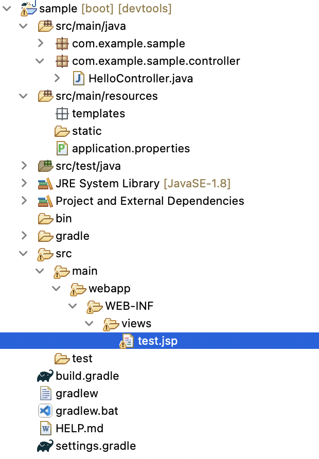


#### (3) JSP 파일 생성

- views/test.jsp 파일 생성

>  test.jsp

```jsp
<%@ page language="java" contentType="text/html; charset=${encoding}"
    pageEncoding="utf-8"%>
<!DOCTYPE html>
<html>
<head>
<meta charset="utf-8">
<title>Insert title here</title>
  <meta name="viewport" content="width=device-width, initial-scale=1">
  <link rel="stylesheet" href="https://maxcdn.bootstrapcdn.com/bootstrap/3.4.1/css/bootstrap.min.css">
  <script src="https://ajax.googleapis.com/ajax/libs/jquery/3.5.1/jquery.min.js"></script>
  <script src="https://maxcdn.bootstrapcdn.com/bootstrap/3.4.1/js/bootstrap.min.js"></script>
</head>
<body>
<div class="container">
  <h2>시원한 풍경 사진</h2>
  <p>이미지 파일을 보여줍니다.</p>            
  <!-- -->
</div>
</body>
</html>
```


#### (4) Controller 작성

- src/main/java폴더의 HelloController 수정
- RestController는 기본적으로 @ResponseBody를 가지고있다.
- Controller로 변경후 문자열 리턴시 @ResponseBody를 명시한다.

> HelloController.java

```java
package com.example.sample.controller;

import org.springframework.stereotype.Controller;
import org.springframework.web.bind.annotation.GetMapping;
import org.springframework.web.bind.annotation.ResponseBody;

@Controller
public class HelloController {
	@GetMapping
	@ResponseBody
	public String hello() {
		return "Hello World!";
	}

	@GetMapping("/test")
	public String test() {
		return "test";
	}
}
```


#### (5) 실행하기

- sample -> Run As -> Spring Boot App

```
http://localhost:8000/test
```

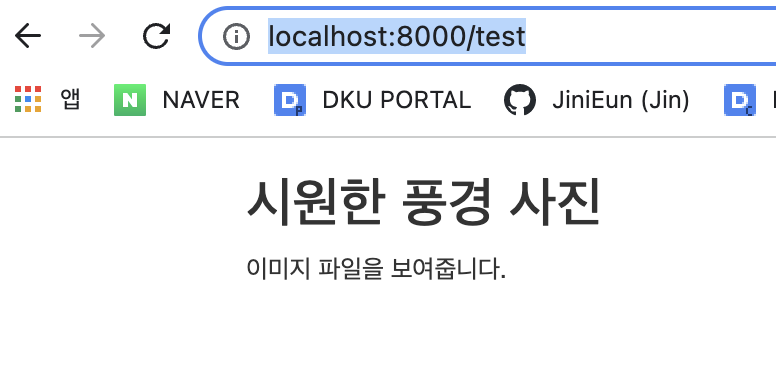


## HTML, CSS, JS, JSTL 실행 및 이미지 출력

### 1. HTML 출력

- src/main/webapp폴더에 test.html작성
- src/main/resources/static/test.html  ; 같은 결과 출력된다.

> test.html

```html
<!DOCTYPE html>
<html>
<head>
<meta charset="UTF-8">
<title>Insert title here</title>
</head>
<body>
<h1>HTML 문서 제목</h1>
<p>이곳은 문장을 입력하면 됩니다.</p>
</body>
</html>
```


> 실행 결과
>
> ```
> http://localhost:8000/test.html
> ```

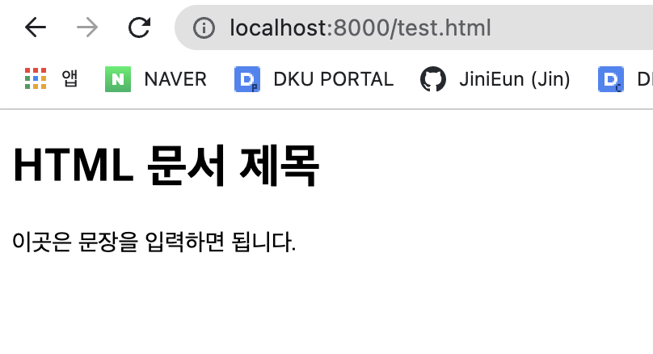


### 2. CSS 실행

- src/main/resources 아래 static 폴더에 css/style.css작성

> css/style.css

```
```


> test.html

```
```


> 실행 결과

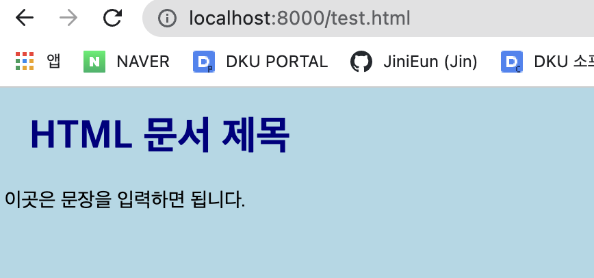


### 3. JS 실행

- src/main/resources 아래 static 폴더에 js/function.js작성

> js/function.js

```js
function myFunction(p1, p2) {
  return p1 * p2;
}
document.getElementById("demo").innerHTML = myFunction(4, 3);
```


- html 페이지 수정

```html
<!DOCTYPE html>
<html>
<head>
<meta charset="UTF-8">
<link href="/css/style.css" rel="stylesheet" type="text/css">
<title>Insert title here</title>
</head>
<body>
	<h1>HTML 문서 제목</h1>
	<p>이곳은 문장을 입력하면 됩니다.</p>
	<br>
	<br>
	<p id="demo"></p>
	<script type="text/javascript" src="/js/function.js"></script>
</body>
</html>
```


> 실행 결과
>
> ```
> http://localhost:8000/test.html
> ```

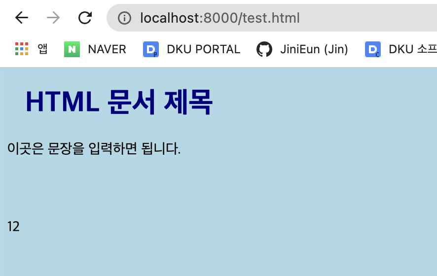


### 4. JSTL, image 출력

- JSP에서 JSTL사용과 image를 출력한다.
- src/main/resources의 static 폴더에 images폴더 생성 후 이미지 파일 저장.
- views/test.jsp파일을 jstp, image 출력되도록 수정한다.

> test.jsp

```jsp
<%@ page language="java" contentType="text/html; charset=${encoding}" pageEncoding="utf-8"%>
<%@ taglib prefix="c" uri="http://java.sun.com/jsp/jstl/core" %>
<!DOCTYPE html>
<html>
<head>
<meta charset="utf-8">
<title>Insert title here</title>
<meta name="viewport" content="width=device-width, initial-scale=1">
<link rel="stylesheet" href="https://maxcdn.bootstrapcdn.com/bootstrap/3.4.1/css/bootstrap.min.css">
<script src="https://ajax.googleapis.com/ajax/libs/jquery/3.5.1/jquery.min.js"></script>
<script src="https://maxcdn.bootstrapcdn.com/bootstrap/3.4.1/js/bootstrap.min.js"></script>
<link rel="stylesheet" href="${pageContext.request.contextPath}/css/style.css">
</head>
<body>
	<div class="container">
		<h2>시원한 풍경 사진</h2>
		<p>이미지 파일을 보여줍니다.</p>
		
		<br>
		<h1>JSTL 결과 출력하기</h1>
		<c:set var="season" value="봄이 도착했습니다."></c:set>
		<h3>JSTL 출력:${season}</h3>
	</div>
</body>
</html>
```


> 실행 결과
>
> ```
> http://localhost:8000/test
> ```

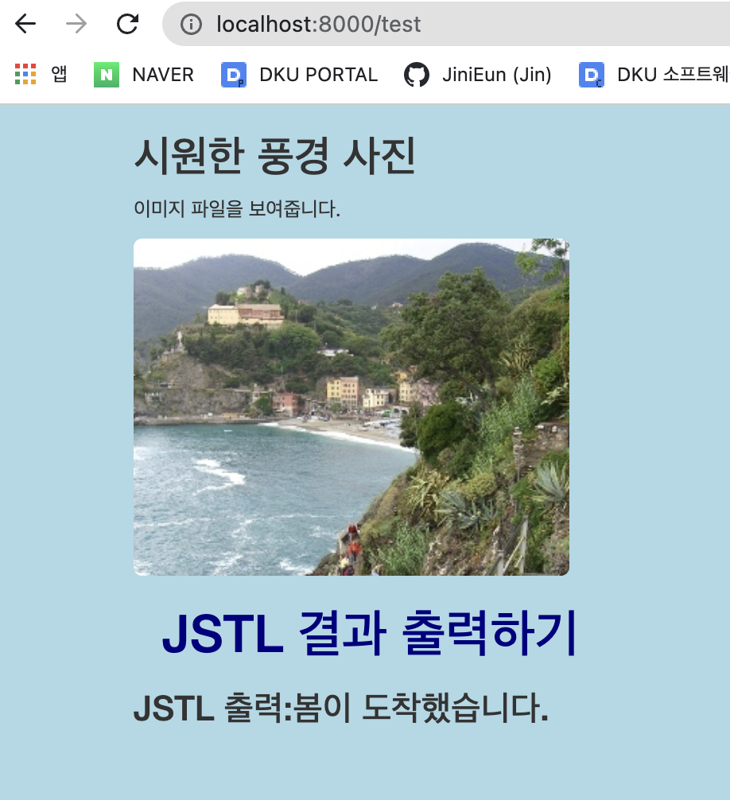


## 폼 데이터 사용


### 1. 커맨드 객체(DTO,VO) 이해 및 생성

- 사용자가 서버에 전달할 데이터를 폼에 입력하여, 커맨드 객체에 담아서 서버에 전달한다.
- DB서버에서 가져온 데이터를 커맨드 객체에 담아 사용자에게 전달한다.
- sample 프로젝트에서 실습한다.
- com.example.sample.bean 패키지 생성

> com.example.sample.bean
>
> Member.java

```java
package com.example.sample.bean;

public class Member {

	private String id;
	private String name;

	public Member() {
		// TODO Auto-generated constructor stub
	}

	public Member(String id, String name) {
		super();
		this.id = id;
		this.name = name;
	}

	@Override
	public String toString() {
		return "Member [id=" + id + ", name=" + name + "]";
	}

	public String getId() {
		return id;
	}

	public void setId(String id) {
		this.id = id;
	}

	public String getName() {
		return name;
	}

	public void setName(String name) {
		this.name = name;
	}

}
```


### 2. RequestMapping

- 사용자 요청시 처리할 메서드가 리턴된다.
- 연결된 메서드의 매개변수는 요청/응답 객체, 요청처리 결과를 담아서 뷰페이지로 전달할 Model 객체, 요청지로 부터 전달받은 파라메터 값등 다양한 값이 선언될 수 있다.
- 요청 url 자체에 변수를 넣어 줄 수 있는데, 주소와 변수를 구분하기 위해@PathVariable 사용한다.
- 기존 컨트롤러에 코드를 추가한다.

> HelloController.java

```java
// 함수 4개 추가
// http://localhost:8000/test1?id=hong&name=홍길동
	@RequestMapping("/test1")
	public String test1(HttpServletRequest httpServletRequest, Model model) {

		String id = httpServletRequest.getParameter("id");
		String name = httpServletRequest.getParameter("name");

		model.addAttribute("id", id);
		model.addAttribute("name", name);

		return "test1";
	}

	// http://localhost:8000/test2?id=hong&name=홍길동
	@RequestMapping("/test2")
	public String test2(@RequestParam("id") String id, @RequestParam("name") String name, Model model) {
		// 파라미터가 많아지면 불편해진다.
		model.addAttribute("id", id);
		model.addAttribute("name", name);

		return "test1";
	}

	// 패스 자체에 변수를 넣어 줄 수도 있다.
	// http://localhost:8000/test3/hong/홍길동
	@RequestMapping("/test3/{studentId}/{name}")
	public String getStudent(@PathVariable String studentId, @PathVariable String name, Model model) {
		model.addAttribute("id", studentId);
		model.addAttribute("name", name);
		return "test1";
	}

	// http://localhost:8000/test4?id=hong&name=홍길동
	@RequestMapping("/test4")
	public String test3(Member member, Model model) {
		// 파라미터와 일치하는 빈을 만들어서 사용할 수 있다.
		// View 페이지에서 model 을 사용하지 않고 member를 사용한다.
		return "test1";
	}
```


### 3. View

> test1.jsp

```jsp
<%@ page language="java" contentType="text/html; charset=UTF-8"
	pageEncoding="UTF-8"%>
<!DOCTYPE html>
<html>
<head>
<meta charset="UTF-8">
<title>Insert title here</title>
<link rel="stylesheet" href="https://maxcdn.bootstrapcdn.com/bootstrap/3.4.1/css/bootstrap.min.css">
<script src="https://ajax.googleapis.com/ajax/libs/jquery/3.5.1/jquery.min.js"></script>
<script src="https://maxcdn.bootstrapcdn.com/bootstrap/3.4.1/js/bootstrap.min.js"></script>
<link rel="stylesheet" href="${pageContext.request.contextPath}/css/style.css">
</head>
<body>
	<div class="container">
		<h2>시원한 풍경 사진</h2>
		<p>이미지 파일을 보여줍니다.</p>
		
		<br>
		<h1>JSTL 결과 출력하기</h1>
		<c:set var="season" value="봄이 도착했습니다."></c:set>
		<h3>JSTL 출력:${season}</h3>
		<%
		out.println("#01 : Hello World");
		%>
		<br> 당신의 아이디는 ${id} 입니다. <br> 당신의 이름은 ${name} 입니다.
    
	</div>

</body>
</html>
```

test 3을 위한 test1.jsp 변경

```jsp
<br> test4 : 당신의 아이디는 ${member.name} 입니다. <br> 당신의 이름은 ${member.name} 입니다.
```


### 4. 테스트

test1

```
http://localhost:8000/test1?id=hong&name=honggildong
```

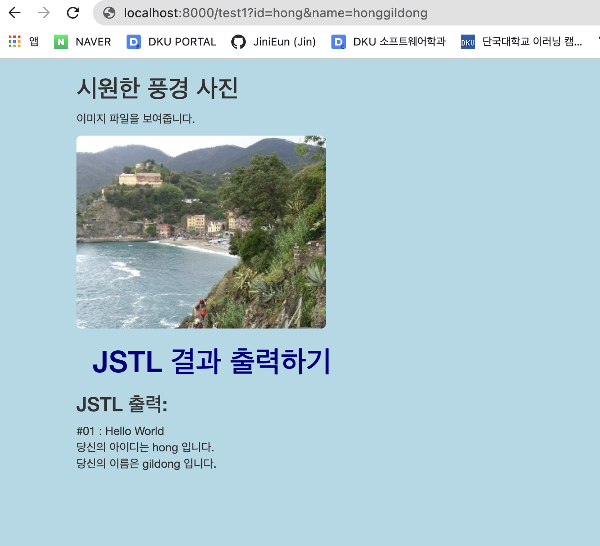

test2

```
http://localhost:8000/test2?id=hong&name=홍길동
```

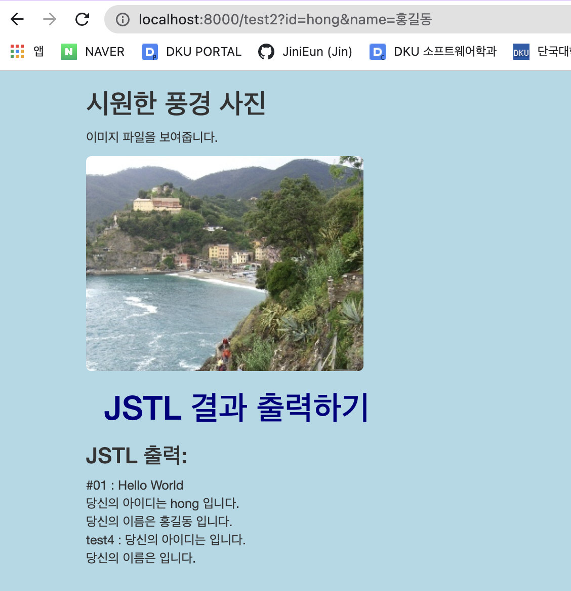

test3

```
http://localhost:8000/test3/hong/홍길동
```

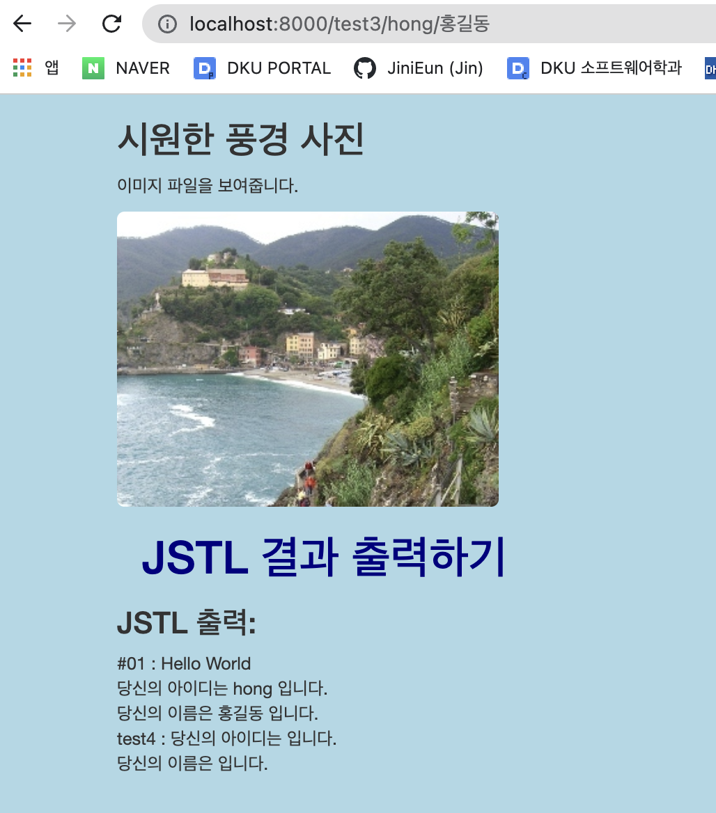


test4

````
http://localhost:8000/test4?id=hong&name=홍길동
````

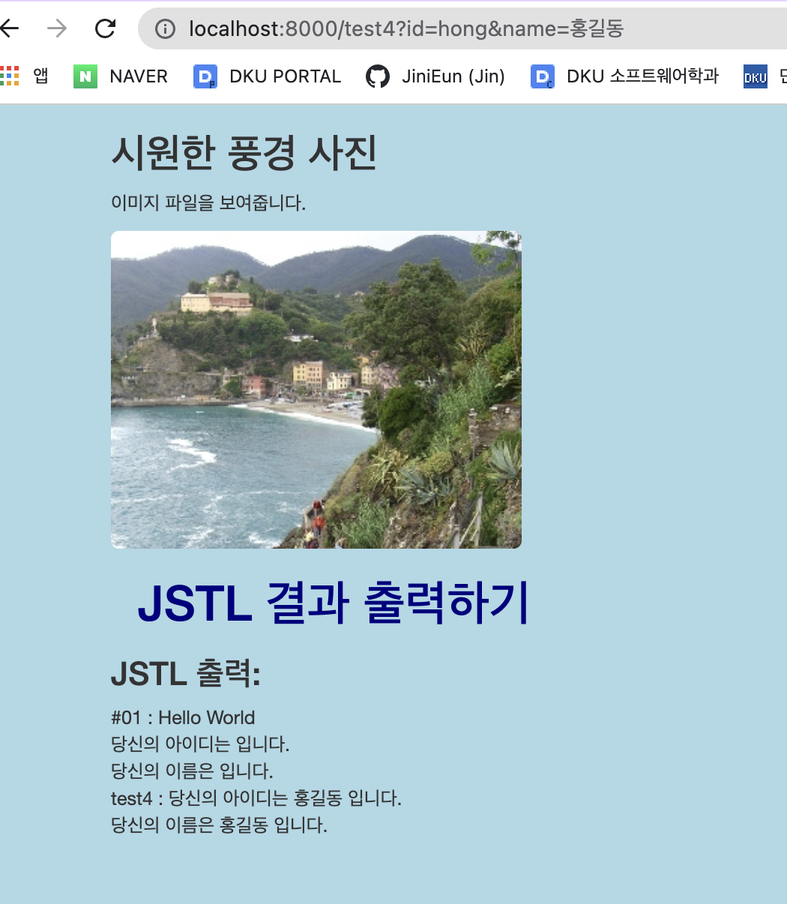


버전이 넘어오면서 RequestMapping -> GetMapping / PostMapping 이용함


## Form 값의 검증, Validator interface 사용

- 검증시 사용자 입력의 에러는 Javascript로 검증하여 에러 메시지 출력

- 정상적인 폼을 우회하여 전송된 데이터 검증을 위하여 Controller에서 재검증

- sample project 계속 사용

- build.gradle 에 Validator 라이브러리 추가

  Gradle -> Refresh Gradle Project

> build.gradle
>
> 다음 코드도 추가
>
> ```
> implementation 'org.springframework.boot:spring-boot-starter-validation'
> ```
>
> 


### 1. VO Class

> ClacVO.java

```java
package com.example.validator;

public class CalcVO {
	private String menu;
	private int price;
	private int count;
	private int payment;

	public CalcVO() {
		// TODO Auto-generated constructor stub
	}

	public CalcVO(String menu, int price, int count, int payment) {
		super();
		this.menu = menu;
		this.price = price;
		this.count = count;
		this.payment = payment;
	}

	@Override
	public String toString() {
		return "CalcVO [menu=" + menu + ", price=" + price + ", count=" + count + ", payment=" + payment + "]";
	}

	public String getMenu() {
		return menu;
	}

	public void setMenu(String menu) {
		this.menu = menu;
	}

	public int getPrice() {
		return price;
	}

	public void setPrice(int price) {
		this.price = price;
	}

	public int getCount() {
		return count;
	}

	public void setCount(int count) {
		this.count = count;
	}

	public int getPayment() {
		return payment;
	}

	public void setPayment(int payment) {
		this.payment = payment;
	}
}
```


### 2. Validator Class

- 유효성 검증 클래스 선언

> CalcValidator.java

```java
package com.example.validator;

import org.springframework.validation.Errors;
import org.springframework.validation.Validator;

public class CalcValidator implements Validator {

	public CalcValidator() {
		// TODO Auto-generated constructor stub
	}

	@Override
	public boolean supports(Class<?> clazz) {
		// TODO Auto-generated method stub
		return CalcVO.class.isAssignableFrom(clazz);

	}

	@Override
	public void validate(Object target, Errors errors) {
		CalcVO calcVO = (CalcVO) target;
		String menu = calcVO.getMenu();
		if (menu == null || menu.trim().isEmpty()) {
			System.out.println("menu가 등록이 누락되었습니다.");
			errors.rejectValue("menu", "error");
			// 임의 값 지정 가능, 에러 발생을 나타냄
		}

		int price = calcVO.getPrice();
		if (price < 1000 || price >= 10000000) {
			System.out.println("금액은 1000원이상 천만원 이하여야합니다.");
			errors.rejectValue("price", "error");
		}

		int count = calcVO.getCount();
		if (count <= 0 || count >= 1000) {
			System.out.println("수량은 1개이상 천개 이하여야합니다.");
			errors.rejectValue("count", "error");
		}
	}
}
```


### 3. Controller Class

> CalcController.java

```java
package com.example.validator;

import org.springframework.stereotype.Controller;
import org.springframework.ui.Model;
import org.springframework.validation.BindingResult;
import org.springframework.web.bind.annotation.GetMapping;
import org.springframework.web.bind.annotation.PostMapping;

@Controller
public class CalcController {

	public CalcController() {
		System.out.println("CalcController created");
	}

	// http://localhost:8000/calc
	@GetMapping("/calc")
	public String calc() {
		return "/calc/form";
	}

	// 에러가 발생했을때 자동으로 이전 폼으로 이동
	@PostMapping("/calc")
	public String calc(CalcVO calcVO, BindingResult result, Model model) {

		CalcValidator calcValidator = new CalcValidator();
		calcValidator.validate(calcVO, result); // 검증

		if (result.hasErrors()) { // 에러 발생시
			return "/calc/form";
		} else { // 에러 미발생
			int payment = calcVO.getPrice() * calcVO.getCount();
			model.addAttribute("payment", payment);
			return "/calc/proc";
		}
	}

}
```


### 4. SampleApplication에 새로운 패키지 추가 등록
- @ComponentScan(basePackages = {"com.example.validator"});
  Controller등 자동 인식 package 설정

> SampleApplication.java
>
> ```java
> @ComponentScan(basePackages = {"com.example.validator"}); // 어노테이션 추가
> ```
>
> 

```java
package com.example.sample;

import org.springframework.boot.SpringApplication;
import org.springframework.boot.autoconfigure.SpringBootApplication;
import org.springframework.context.annotation.ComponentScan;

@SpringBootApplication
@ComponentScan(basePackages = { "com.example.validator" })
public class SampleApplication {

	public static void main(String[] args) {
		SpringApplication.run(SampleApplication.class, args);
	}
}
```


### 5. View 페이지

> views/calc/form.jsp

```jsp
<%@ page language="java" contentType="text/html; charset=UTF-8" pageEncoding="UTF-8"%>
<!DOCTYPE html>
<html>
<head>
<title>form.jsp</title>
<meta charset="utf-8">
<meta name="viewport" content="width=device-width, initial-scale=1">
<link rel="stylesheet" href="https://maxcdn.bootstrapcdn.com/bootstrap/3.4.1/css/bootstrap.min.css">
<script src="https://ajax.googleapis.com/ajax/libs/jquery/3.5.1/jquery.min.js"></script>
<script src="https://maxcdn.bootstrapcdn.com/bootstrap/3.4.1/js/bootstrap.min.js"></script>
</head>
<body>
	<div class="container">
		<h2>form.jsp</h2>
		<form class="form-horizontal" method="post" action="./calc">
			<div class="form-group">
				<label class="control-label col-sm-2" for="menu">메뉴명:</label>
				<div class="col-sm-8">
					<input type="text" class="form-control" autofocus="autofocus"
						id="menu" value="김밥" name="menu">
				</div>
			</div>
			<div class="form-group">
				<label class="control-label col-sm-2" for="price">가격:</label>
				<div class="col-sm-8">
					<input type="number" class="form-control" id="price" name="price"
						value="3000">
				</div>
			</div>
			<div class="form-group">
				<label class="control-label col-sm-2" for="count">수량:</label>
				<div class="col-sm-8">
					<input type="number" class="form-control" id="count" name="count"
						value="2">
				</div>
			</div>
			<div class="form-group">
				<div class="col-sm-offset-2 col-sm-10">
					<button type="submit" class="btn btn-default">처리</button>
				</div>
			</div>
		</form>
	</div>
</body>
</html>
```


> views/calc/proc.jsp

```jsp
<%@ page language="java" contentType="text/html; charset=UTF-8" pageEncoding="UTF-8"%>
<!DOCTYPE html>
<html>
<head>
  <title>proc.jsp</title>
  <meta charset="utf-8">
  <meta name="viewport" content="width=device-width, initial-scale=1">
  <link rel="stylesheet" href="https://maxcdn.bootstrapcdn.com/bootstrap/3.4.1/css/bootstrap.min.css">
  <script src="https://ajax.googleapis.com/ajax/libs/jquery/3.5.1/jquery.min.js"></script>
  <script src="https://maxcdn.bootstrapcdn.com/bootstrap/3.4.1/js/bootstrap.min.js"></script>
</head>
<body> 
<div class="container">
  <h2>메뉴명</h2>
  <div class="panel panel-default">
    <div class="panel-body">${param.menu}</div>
  </div>
  <h2>가격</h2>
  <div class="panel panel-default">
    <div class="panel-body">${param.price}</div>
  </div>
  <h2>수량</h2>
  <div class="panel panel-default">
    <div class="panel-body">${param.count}</div>
  </div>
  <h2>결제</h2>
  <div class="panel panel-default">
    <div class="panel-body">${payment}</div>
  </div>
</div>
</body>
</html>
```


### 6. 실행 결과


#### 정상 처리

> form.jsp
>
> ```
> http://localhost:8000/calc
> ```
>
> 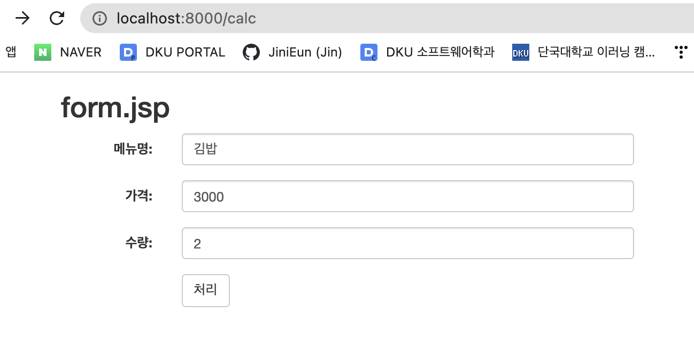


> proc.jsp
>
> ```
> http://localhost:8000/calc + 처리 버튼 클릭
> ```
>
> 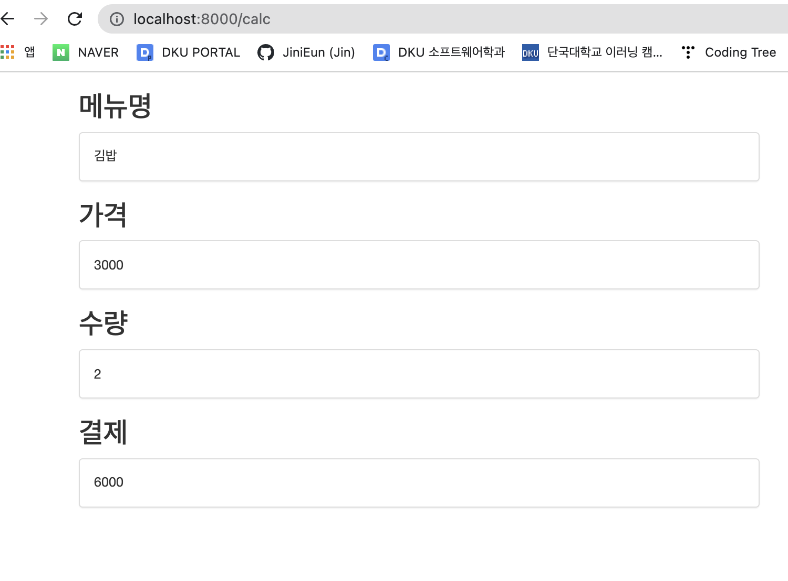


#### 비정상 처리되는 경우
- 유효성 검사후 오류이면 다시 form으로 이동한다.

(수량 - 일 경우)


*Fin.🐧*
