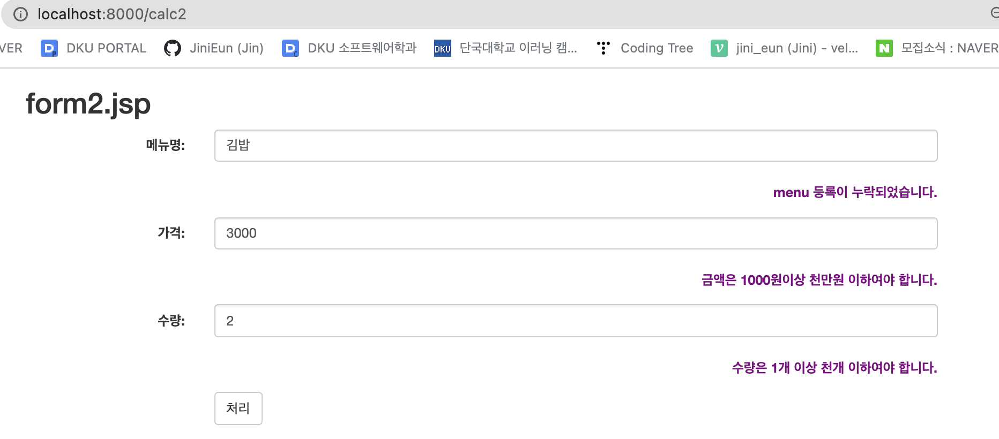
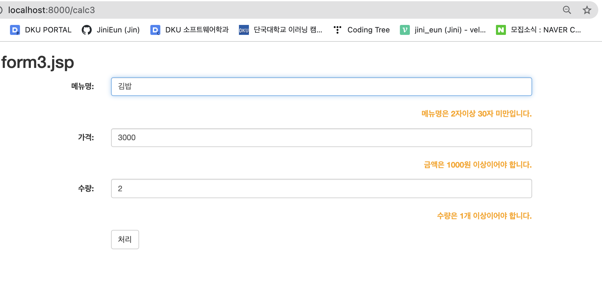
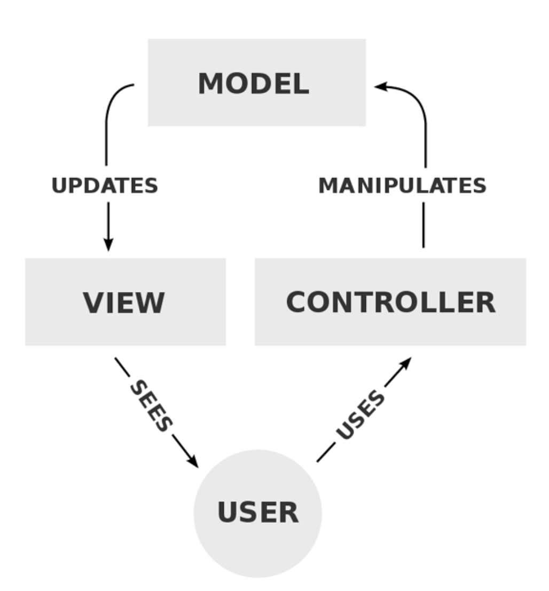
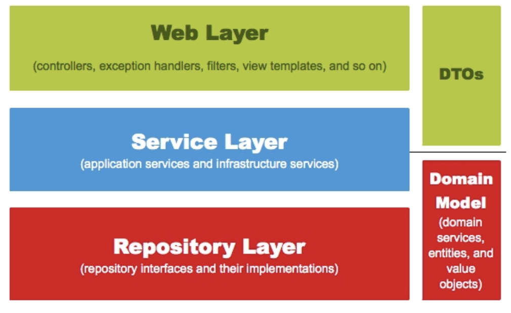
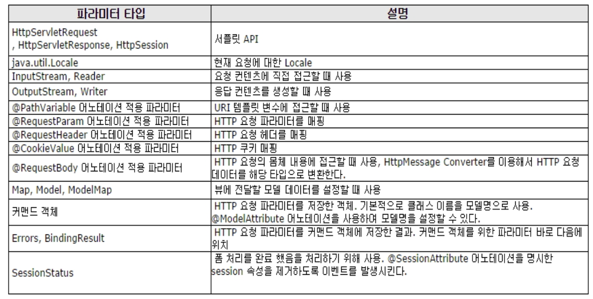
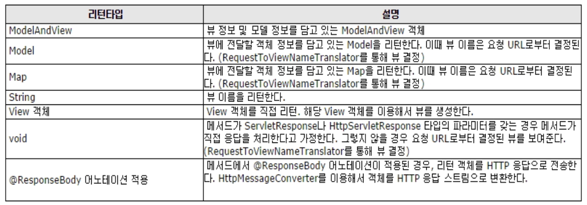

# SpringBoot

## Form 값의 검증, 에러 메세지 출력


### Controller class 변경

validator class 를 사용해 검증

```java
CalcValidator calcValidator = new CalcValidator();
calcValidator.validate(calcVO, result);
```


> project : sample 
>
> package com.example.validator;
>
> CalcController2.java

```java
package com.example.validator;

import java.util.HashMap;
import java.util.Map;

import org.springframework.stereotype.Controller;
import org.springframework.ui.Model;
import org.springframework.validation.BindingResult;
import org.springframework.web.bind.annotation.GetMapping;
import org.springframework.web.bind.annotation.PostMapping;

@Controller
public class CalcController2 {

	public CalcController2() {
		System.out.println("---> CalcController2 created");
	}

	@GetMapping("/calc2")
	public String calc() {
		return "/calc/form2";
	}

	@PostMapping("/calc2")
	public String calc(CalcVO calcVO, BindingResult result, Model model) {
		CalcValidator calcValidator = new CalcValidator();
		calcValidator.validate(calcVO, result);

		Map<String, String> errors = new HashMap<String, String>();

		if (result.hasErrors()) { // 에러 발생시

			if (result.getFieldError("menu") != null) {
				System.out.println("menu: " + result.getFieldError("menu").getCode());
				errors.put("menu", "menu 등록이 누락되었습니다.");
			}

			if (result.getFieldError("price") != null) {
				System.out.println("price: " + result.getFieldError("price").getCode());
				errors.put("price", "금액은 1000원이상 천만원 이하여야 합니다.");
			}

			if (result.getFieldError("count") != null) {
				System.out.println("count: " + result.getFieldError("count").getCode());
				errors.put("count", "수량은 1개 이상 천개 이하여야 합니다.");
			}
			model.addAllAttributes(errors);
			return "/calc/form2";
		} else { // 에러 미발생
			int payment = calcVO.getPrice() * calcVO.getCount();
			model.addAttribute("payment", payment);
			return "/calc/proc";
		}
	}
}
```


### View 페이지 작성

> views/calc/form2.jsp

```jsp
<%@ page language="java" contentType="text/html; charset=UTF-8" pageEncoding="UTF-8"%>
<!DOCTYPE html>
<html>
<head>
<title>form.jsp</title>
<meta charset="utf-8">
<meta name="viewport" content="width=device-width, initial-scale=1">
<link rel="stylesheet" href="https://maxcdn.bootstrapcdn.com/bootstrap/3.4.1/css/bootstrap.min.css">
<script src="https://ajax.googleapis.com/ajax/libs/jquery/3.5.1/jquery.min.js"></script>
<script src="https://maxcdn.bootstrapcdn.com/bootstrap/3.4.1/js/bootstrap.min.js"></script>
</head>
<body>
	<div class="container">
		<h2>form2.jsp</h2>
		<form class="form-horizontal" method="post" action="./calc2">
			<div class="form-group">
				<label class="control-label col-sm-2" for="menu">메뉴명:</label>
				<div class="col-sm-8">
					<input type="text" class="form-control" autofocus="autofocus"
						id="menu" value="김밥" name="menu">
				</div>
			</div>
			<div class="form-group">
				<label class="control-label col-sm-10" style="color:purple;">${menu}</label>
			</div>
			<div class="form-group">
				<label class="control-label col-sm-2" for="price">가격:</label>
				<div class="col-sm-8">
					<input type="number" class="form-control" id="price" name="price"
						value="3000">
				</div>
			</div>
			<div class="form-group">
				<label class="control-label col-sm-10" style="color:purple;">${price}</label>
			</div>
			
			<div class="form-group">
				<label class="control-label col-sm-2" for="count">수량:</label>
				<div class="col-sm-8">
					<input type="number" class="form-control" id="count" name="count"
						value="2">
				</div>
			</div>
			<div class="form-group">
				<label class="control-label col-sm-10" style="color:purple;">${count}</label>
			</div>
			<div class="form-group">
				<div class="col-sm-offset-2 col-sm-10">
					<button type="submit" class="btn btn-default">처리</button>
				</div>
			</div>
		</form>
	</div>
</body>
</html>
```


### 실행 결과

- 비정상인 경우 form으로 다시 이동 후 오류 메세지를 출력한다.
- (에러 - 보라색 글씨)

```
http://localhost:8000/calc2
```




## Form 값의 검증, Annotation을 이용한 검증

- VO class 필드에 validation Annotation 등록한다.


### VO Class

> package com.example.validator;
>
> CalcVOAnnotation.java

```java
package com.example.validator;

import javax.validation.constraints.Max;
import javax.validation.constraints.Min;
import javax.validation.constraints.NotEmpty;
import javax.validation.constraints.Size;

public class CalcVOAnnotation {
	@NotEmpty(message = "메뉴명은 필수 입력입니다(Not empty).")
	@Size(min = 2, max = 30, message = "메뉴명은 2자이상 30자 미만입니다.")
	private String menu;

	@Max(value = 1000000, message = "금액은 100만원 이하여야 합니다.")
	@Min(value = 1000, message = "금액은 1000원 이상이어야 합니다.")
	private int price;

	@Max(value = 100, message = "수량은 100개 이하여야 합니다.")
	@Min(value = 1, message = "수량은 1개 이상이어야 합니다.")
	private int count;
	private int payment;

	public CalcVOAnnotation() {
		// TODO Auto-generated constructor stub
	}

	public CalcVOAnnotation(String menu, int price, int count, int payment) {
		super();
		this.menu = menu;
		this.price = price;
		this.count = count;
		this.payment = payment;
	}

	@Override
	public String toString() {
		return "CalcVO [menu=" + menu + ", price=" + price + ", count=" + count + ", payment=" + payment + "]";
	}

	public String getMenu() {
		return menu;
	}

	public void setMenu(String menu) {
		this.menu = menu;
	}

	public int getPrice() {
		return price;
	}

	public void setPrice(int price) {
		this.price = price;
	}

	public int getCount() {
		return count;
	}

	public void setCount(int count) {
		this.count = count;
	}

	public int getPayment() {
		return payment;
	}

	public void setPayment(int payment) {
		this.payment = payment;
	}
}

```


### Controller class

Validatator class는 사용하지 않음

> package com.example.validator;
>
> CalcController3.java

```java
package com.example.validator;

import java.util.HashMap;
import java.util.Map;

import javax.validation.Valid;

import org.springframework.stereotype.Controller;
import org.springframework.ui.Model;
import org.springframework.validation.BindingResult;
import org.springframework.web.bind.annotation.GetMapping;
import org.springframework.web.bind.annotation.PostMapping;

@Controller
public class CalcController3 {

	public CalcController3() {
		System.out.println("---> CalcController3 created");
	}

	@GetMapping("/calc3")
	public String calc() {
		return "/calc/form3";
	}

	@PostMapping("/calc3")
	public String calc(@Valid CalcVOAnnotation calcVO, BindingResult result, Model model) {

		Map<String, String> errors = new HashMap<String, String>();

		if (result.hasErrors()) { // 에러 발생시

			if (result.getFieldError("menu") != null) {
				System.out.println("menu: " + result.getFieldError("menu").getDefaultMessage());
				errors.put("menu", result.getFieldError("menu").getDefaultMessage());
			}

			if (result.getFieldError("price") != null) {
				System.out.println("price: " + result.getFieldError("price").getDefaultMessage());
				errors.put("price", result.getFieldError("price").getDefaultMessage());
			}

			if (result.getFieldError("count") != null) {
				System.out.println("count: " + result.getFieldError("count").getDefaultMessage());
				errors.put("count", result.getFieldError("count").getDefaultMessage());
			}
			model.addAllAttributes(errors);
			return "/calc/form3";
		} else { // 에러 미발생
			int payment = calcVO.getPrice() * calcVO.getCount();
			model.addAttribute("payment", payment);
			return "/calc/proc";
		}
	}
}

```


### View 페이지

> views/calc/form3.jsp

```jsp
<%@ page language="java" contentType="text/html; charset=UTF-8" pageEncoding="UTF-8"%>
<!DOCTYPE html>
<html>
<head>
<title>form.jsp</title>
<meta charset="utf-8">
<meta name="viewport" content="width=device-width, initial-scale=1">
<link rel="stylesheet" href="https://maxcdn.bootstrapcdn.com/bootstrap/3.4.1/css/bootstrap.min.css">
<script src="https://ajax.googleapis.com/ajax/libs/jquery/3.5.1/jquery.min.js"></script>
<script src="https://maxcdn.bootstrapcdn.com/bootstrap/3.4.1/js/bootstrap.min.js"></script>
</head>
<body>
	<div class="container">
		<h2>form3.jsp</h2>
		<form class="form-horizontal" method="post" action="./calc3">
			<div class="form-group">
				<label class="control-label col-sm-2" for="menu">메뉴명:</label>
				<div class="col-sm-8">
					<input type="text" class="form-control" autofocus="autofocus"
						id="menu" value="김밥" name="menu">
				</div>
			</div>
			<div class="form-group">
				<label class="control-label col-sm-10" style="color:orange;">${menu}</label>
			</div>
			<div class="form-group">
				<label class="control-label col-sm-2" for="price">가격:</label>
				<div class="col-sm-8">
					<input type="number" class="form-control" id="price" name="price"
						value="3000">
				</div>
			</div>
			<div class="form-group">
				<label class="control-label col-sm-10" style="color:orange;">${price}</label>
			</div>
			
			<div class="form-group">
				<label class="control-label col-sm-2" for="count">수량:</label>
				<div class="col-sm-8">
					<input type="number" class="form-control" id="count" name="count"
						value="2">
				</div>
			</div>
			<div class="form-group">
				<label class="control-label col-sm-10" style="color:orange;">${count}</label>
			</div>
			<div class="form-group">
				<div class="col-sm-offset-2 col-sm-10">
					<button type="submit" class="btn btn-default">처리</button>
				</div>
			</div>
		</form>
	</div>
</body>
</html>
```


실행 결과

```
http://localhost:8000/calc3
```





## Spring MVC의 주요 구성 요소 


### MVC 패턴의 구조는 Model, View, Controller 세 가지로 나누어진다.

- 모델은 비즈니스 로직과 DB 등에 대한 처리를 수행한다.
- 컨트롤러는 뷰와 모델을 이어주는 역할을 맡는다.
  뷰의 요청에 따라 모델의 상태를 바꾸고, 이를 다시 뷰에 전달한다.
- 뷰는 사용자에게 보이는 영역이다. 컨트롤러를 통해 모델에 질의를 보내고,
  그 값을 사용자에게 적절하게 보여준다.

 




## Spring 웹 계층
### spring의 5가지 요소




#### (1) Web Layer

- 컨트롤러(@Controller)와 JSP등의 뷰 영역이다.
- 이외에도 필터(@filter), 인터셉터, 컨트롤러 어드바이스 등 외부 요청과 응답에 대한 전반적인 영역을 의미한다.


#### (2) Service Layer

- 서비스 영역(@Service)이다.
- 일반적으로 컨트롤러와 저장소(Repository, Dao)의 중간에 위치한다.
- 트랜잭션(@Transactional)이 사용되어야 하는 영역이다.


#### (3) Repository Layer

- DB와 같은 데이터 저장소에 접근하는 영역이다.
- DAO(Data Access Object)영역이다.


#### (4) DTOs

- DTO(Data Transfer Object)는 계층 간의 데이터 교환을 위한 객체이며, 이들의 영역이다.


#### (5) Domain model

- 개발 대상, 즉 도메인을 모든 사람이 동일한 관점에서 이해할 수 있고 공유할 수
   있도록 단순화한 것을 도메인 모델이라고 한다.
- JPA를 사용한다면, @Entity가 사용되는 영역 역시 도메인 모델이라 할 수 있다.


## Annotation

### Spring MVC 어노테이션

@Controller     - 클래스 타입에만 적용되며,웹 요청처리에 사용
@RequestMapping - 컨트롤러가 처리할 Get/Post방식 요청URL을 명시(클래스,메소드)
@GetMapping    - 컨트롤러가 처리할 Get방식 요청URL을 명시(메소드)
@PostMapping   - 컨트롤러가 처리할 POST방식 요청URL을 명시(메소드)

#### (1) 컨트롤러 메소드의 매개변수(파라메터) 타입


@RequestBody : JSON데이터를 서버에 보내서 원하는 타입의 객체로 변환하는 용도로 사용

#### (2) 컨트롤러 메소드의 리턴값 타입


@ResponseBody : JSP와 같은 뷰가 전달되는 것이 아니라 데이터 자체를 전달하기 위한 용도(Ajax 응답데이터)로 사용된다.   


### 그외 어노테이션
@PathVariable  - Parameter를 URL형식으로 받기 

@RequestParam - Form페이지에서 넘어오는 파라메터를 받을수 있다.     

- 해당 파라미터가 없다면 HTTP 400 - Bad Request 가 전달 된다. 

  ```java
  public String edit( @RequestParam("id") int id, 
                @RequestParam("title") String title, 
                @RequestParam("file") MultipartFile file ) {...} 
  ```

- 파라미터가 필수가 아니라면 required = false 로 지정하면 된다. 
  파라미터가 없으면 NULL이 들어간다. default 값을 지정 할 수도 있다. 

  ```java
  public void view( @RequestParam(value = "id", 
                        required = false, 
                      defaultValue = "0" ) int id) {..}.   
  ```

- @RequestParam을 생략하여 사용할수 있다.
    Map타입으로 데이터를 받을경우는 반드시 @RequestParam을
    명시해야 데이터를 받아온다.

  ``` java
  <input type="text" name="id" /><br>
  <input type="password" name="passwd" /> 
        
  public String add( @RequestParam Map<String, String> params ) {...} 
  ```

@ModelAttribute  - 파라미터를 Object(DTO) 형태로 받을때 사용
ex) 

```
public void update( @ModelAttribute("board") Board board) {...} 
```

@SessionAttributes - 세션상에서 model의 정보를 유지하고 싶을 경우 사용

@RequestBody    - JSON 데이터를 원하는 타입으로 바인딩 처리 


*Fin.🐧*

