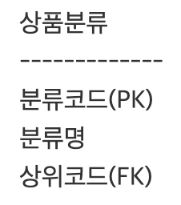
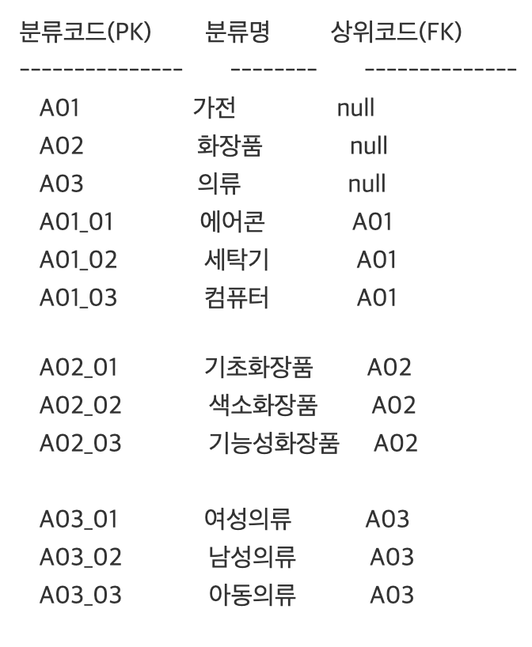
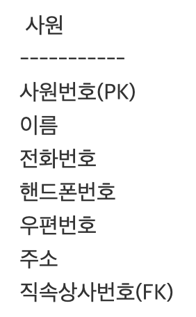

# SpringBoot


## Category 테이블 모델링


### 1. 순환관계 모델링 하기

- 순환관계를 정의할때는 반드시 비식별관계로 정의 해야 한다. 
- 최초로 입력되는 최상의 코드의 FK에는 NULL값이 들어간다.
- 자식 엔티티로 전이되는 포린키 컬럼의 이름을 바꿔준다.








### 2. category, content sql


```sql
/**********************************/
/* Table Name: 상품분류 */
/**********************************/
CREATE TABLE category(
                cateno                                  NUMBER(10)     NOT NULL,
                catename                              VARCHAR2(50)     NOT NULL,
                categrpno                              NUMBER(10)      NULL,
        PRIMARY KEY (cateno),
        FOREIGN KEY (categrpno) REFERENCES category     
);
 
COMMENT ON TABLE category is '상품분류';
COMMENT ON COLUMN category.cateno is '분류번호';
COMMENT ON COLUMN category.catename is '분류명';
COMMENT ON COLUMN category.categrpno is '상위번호';

insert into category(cateno, catename, categrpno)
values((select nvl(max(cateno),0)+1 from category),
        'Jean', null);
insert into category(cateno, catename, categrpno)
values((select nvl(max(cateno),0)+1 from category),
        'Bag', null);
insert into category(cateno, catename, categrpno)
values((select nvl(max(cateno),0)+1 from category),
        'Shoes', null);
        
select cateno, catename
from category
where categrpno is null;
 
 
/**********************************/
/* Table Name: 컨텐츠 */
/**********************************/
CREATE TABLE contents(
                contentsno                            NUMBER(10)         NOT NULL    PRIMARY KEY,
                cateno                                  NUMBER(10)         NULL ,
                pname                                 VARCHAR2(50)       NOT NULL,
                price                                   NUMBER(10)           NOT NULL,
                filename                                VARCHAR2(100)     NULL ,
                detail                                  CLOB             NOT NULL,
                rdate                                   DATE             NOT NULL,
                stock                                   NUMBER(10)    DEFAULT 0      NOT NULL,
  FOREIGN KEY (cateno) REFERENCES category (cateno)
);

COMMENT ON TABLE contents is '컨텐츠';
COMMENT ON COLUMN contents.contentsno is '상품번호';
COMMENT ON COLUMN contents.cateno is '분류번호';
COMMENT ON COLUMN contents.pname is '상품명';
COMMENT ON COLUMN contents.price is '가격';
COMMENT ON COLUMN contents.filename is '상품이미지';
COMMENT ON COLUMN contents.detail is '상세내용';
COMMENT ON COLUMN contents.rdate is '등록일';
COMMENT ON COLUMN contents.stock is '재고량';

insert into contents(contentsno, cateno, pname, price, filename, detail, rdate, stock)
values((select nvl(max(contentsno),0)+1 from contents), 1, 'Ripped Skinny Jeans', 
50000, 'jean.jpg','찢어진 스키니 청바지 입니다.',sysdate,10);
 
select contentsno, cateno, pname, price, filename, detail, stock 
from contents 
where contentsno = 1;
 
update contents
set pname ='Ripped Skinny Jeans2',
    price = 55000,
    filename = 'jean1.jpg',
    detail = '청바지'
where contentsno = 1;
 
delete from contents
where contentsno = 1;
 
select contentsno, cateno, pname, price, filename, stock, r
from (
    select contentsno, cateno, pname, price, filename, stock, rownum r
    from(
        select contentsno, cateno,pname, price, filename, stock
        from contents
        order by contentsno desc
    )
)where r >= 1 and r <= 12;

```


### 3. ContentsDTO 구현

> package com.study.contents;
>
> ContentsDTO.java

```java
package com.study.contents;

import org.springframework.web.multipart.MultipartFile;

import lombok.Data;

@Data
public class ContentsDTO {
	private int contentsno;
	private int cateno;
	private String pname;
	private int price;
	private String filename;
	private MultipartFile filenameMF;
	private String detail;
	private String rdate;
	private int stock;
}
```


## Contents 기능 제작


### 1. mybatis xml, Mappper Interface

> mybaits/contents.xml

```xml
<?xml version="1.0" encoding="UTF-8" ?> 
 
<!DOCTYPE mapper
PUBLIC "-//mybatis.org//DTD Mapper 3.0//EN"
"http://mybatis.org/dtd/mybatis-3-mapper.dtd">

<mapper namespace="com.study.contents.ContentsMapper">
  <select id="read" parameterType="int" resultType="com.study.contents.ContentsDTO">
    select *
    from contents
    where contentsno = #{contentsno}
  </select>

  <update id="updateFile" parameterType="Map">
    update contents
    set filename = #{fname}
    where contentsno = #{contentsno}
  </update>
  <select id="total" parameterType="Map" resultType="int">
    select count(*) from contents
    <where>
      <choose>
        <when test="col=='pname'">
          pname like '%'||#{word}||'%'
        </when>
        <when test="col=='price'">
          price like '%'||#{word}||'%'
        </when>
        <when test="col=='cateno'">
          cateno = #{word}
        </when>
      </choose>
    </where>
  </select>

  <select id="list" parameterType="Map" resultType="com.study.contents.ContentsDTO">
    select contentsno, cateno, pname, price, filename, stock, rdate, r
    from (
        select contentsno, cateno, pname, price, filename, stock,rdate, rownum r
        from(
            select contentsno, cateno,pname, price, filename, stock,rdate
            from contents
    <where>
      <choose>
        <when test="col=='pname'">
          pname like '%'||#{word}||'%'
        </when>
        <when test="col=='price'">
          price like '%'||#{word}||'%'
        </when>
        <when test="col=='cateno'">
          cateno = #{word}
        </when>
      </choose>
    </where>
    order by contentsno desc
    )
        <![CDATA[       
                )where r >= #{sno} and r <= #{eno}
        ]]>
  </select>

  <update id="update" parameterType="com.study.contents.ContentsDTO">
    update contents
    set pname =#{pname},
    price = #{price},
    detail = #{detail}
    where contentsno =#{contentsno}
  </update>


  <insert id="create" parameterType="com.study.contents.ContentsDTO">
    insert into contents(contentsno, cateno, pname, price, filename, detail, rdate, stock)
    values((select nvl(max(contentsno),0)+1 from contents),
    #{cateno},#{pname}, #{price}, #{filename}, #{detail},
    sysdate, #{stock})
  </insert>

</mapper>
```


> ContentsMapper.java

```java
package com.study.contents;

import java.util.List;
import java.util.Map;

public interface ContentsMapper {

	int create(ContentsDTO dto);

	int update(ContentsDTO dto);

	int total(Map map);

	List<ContentsDTO> list(Map map);

	int updateFile(Map map);

	ContentsDTO read(int contentsno);

}
```


### 2. Service Interface, impl Class 구현


> ContentsService.java

```java
package com.study.contents;

import java.util.List;
import java.util.Map;

public interface ContentsService {

	int create(ContentsDTO dto);

	int update(ContentsDTO dto);

	int total(Map map);

	List<ContentsDTO> list(Map map);

	int updateFile(Map map);

	ContentsDTO read(int contentsno);

}
```


> ContentsServiceImpl.java

```java
package com.study.contents;

import java.util.List;
import java.util.Map;

import org.springframework.beans.factory.annotation.Autowired;
import org.springframework.stereotype.Service;

@Service("com.study.contents.ContentsServiceImpl")
public class ContentsServiceImpl implements ContentsService {
	@Autowired
	private ContentsMapper mapper;

	@Override
	public int create(ContentsDTO dto) {
		// TODO Auto-generated method stub
		return mapper.create(dto);
	}

	@Override
	public int update(ContentsDTO dto) {
		// TODO Auto-generated method stub
		return mapper.update(dto);
	}

	@Override
	public int total(Map map) {
		// TODO Auto-generated method stub
		return mapper.total(map);
	}

	@Override
	public List<ContentsDTO> list(Map map) {
		// TODO Auto-generated method stub
		return mapper.list(map);
	}

	@Override
	public int updateFile(Map map) {
		// TODO Auto-generated method stub
		return mapper.updateFile(map);
	}

	@Override
	public ContentsDTO read(int contentsno) {
		// TODO Auto-generated method stub
		return mapper.read(contentsno);
	}

}
```


### 3. Controller Class 구현


> ContentsController.java

````java
package com.study.contents;

import java.io.IOException;
import java.util.HashMap;
import java.util.List;
import java.util.Map;

import javax.servlet.http.HttpServletRequest;
import javax.servlet.http.HttpSession;

import org.springframework.beans.factory.annotation.Autowired;
import org.springframework.beans.factory.annotation.Qualifier;
import org.springframework.core.io.ClassPathResource;
import org.springframework.stereotype.Controller;
import org.springframework.ui.Model;
import org.springframework.web.bind.annotation.GetMapping;
import org.springframework.web.bind.annotation.PathVariable;
import org.springframework.web.bind.annotation.PostMapping;
import org.springframework.web.bind.annotation.RequestBody;
import org.springframework.web.bind.annotation.RequestMapping;
import org.springframework.web.bind.annotation.ResponseBody;
import org.springframework.web.multipart.MultipartFile;

import com.study.utility.Utility;

@Controller
public class ContentsController {

	@Autowired
	@Qualifier("com.study.contents.ContentsServiceImpl")
	private ContentsService service;

	@PostMapping("/contents/updateFile")
	public String updateFile(MultipartFile filenameMF, String oldfile, int contentsno, HttpServletRequest request)
			throws IOException {
		String basePath = new ClassPathResource("/static/pstorage").getFile().getAbsolutePath();

		if (oldfile != null && !oldfile.equals("default.jpg")) { // 원본파일 삭제
			Utility.deleteFile(basePath, oldfile);
		}

		// pstorage에 변경 파일 저장
		Map map = new HashMap();
		map.put("contentsno", contentsno);
		map.put("fname", Utility.saveFileSpring(filenameMF, basePath));

		// 디비에 파일명 변경
		int cnt = service.updateFile(map);

		if (cnt == 1) {
			return "redirect:./list";
		} else {
			return "./error";
		}
	}

	@GetMapping("/contents/updateFile/{contentsno}/{oldfile}")
	public String updateFileForm(@PathVariable("contentsno") int contentsno, @PathVariable("oldfile") String oldfile,
			Model model) {
		model.addAttribute("contentsno", contentsno);
		model.addAttribute("oldfile", oldfile);

		return "/contents/updateFile";
	}

	@RequestMapping("/contents/list")
	public String list(HttpServletRequest request) {
		// 검색관련------------------------
		String col = Utility.checkNull(request.getParameter("col"));
		String word = Utility.checkNull(request.getParameter("word"));

		if (col.equals("total")) {
			word = "";
		}

		// 페이지관련-----------------------
		int nowPage = 1;// 현재 보고있는 페이지
		if (request.getParameter("nowPage") != null) {
			nowPage = Integer.parseInt(request.getParameter("nowPage"));
		}
		int recordPerPage = 5;// 한페이지당 보여줄 레코드갯수

		// DB에서 가져올 순번-----------------
		int sno = ((nowPage - 1) * recordPerPage) + 1;
		int eno = nowPage * recordPerPage;

		Map map = new HashMap();
		map.put("col", col);
		map.put("word", word);
		map.put("sno", sno);
		map.put("eno", eno);

		int total = service.total(map);

		List<ContentsDTO> list = service.list(map);

		String paging = Utility.paging(total, nowPage, recordPerPage, col, word);

		// request에 Model사용 결과 담는다
		request.setAttribute("list", list);
		request.setAttribute("nowPage", nowPage);
		request.setAttribute("col", col);
		request.setAttribute("word", word);
		request.setAttribute("paging", paging);

		return "/contents/list";

	}

	@PostMapping("/contents/update")
	public String update(ContentsDTO dto) {
		int cnt = service.update(dto);

		if (cnt == 1) {
			return "redirect:./list";
		} else {
			return "error";
		}
	}

	@GetMapping("/contents/update/{contentsno}")
	public String update(@PathVariable("contentsno") int contentsno, Model model) {

		ContentsDTO dto = service.read(contentsno);

		model.addAttribute("dto", dto);

		return "/contents/update";

	}

	@PostMapping("/contents/create")
	public String create(ContentsDTO dto, HttpServletRequest request) throws IOException {
		String upDir = new ClassPathResource("/static/pstorage").getFile().getAbsolutePath();

		String fname = Utility.saveFileSpring(dto.getFilenameMF(), upDir);
		int size = (int) dto.getFilenameMF().getSize();

		if (size > 0) {
			dto.setFilename(fname);
		} else {
			dto.setFilename("default.jpg");
		}

		if (service.create(dto) > 0) {
			return "redirect:./list";
		} else {
			return "error";
		}
	}

	@GetMapping("/admin/create")
	public String create() {
		return "/contents/create";
	}

}
````


### 4. View 페이지와 Tiles 
- views/contents 폴더를 다운받은 후 위치에 복사한다.
- static/pstorage 폴더 생성 후 상품이미지 업로드 저장폴더로 사용한다.

> TilesConfiguration.java
>
> TilesConfiguration.java 에서 tiles_contents.xml 추가

```java
@Configuration
public class TilesConfiguration {
  @Bean
  public TilesConfigurer tilesConfigurer() {
      final TilesConfigurer configurer = new TilesConfigurer();
      //해당 경로에 tiles.xml 파일을 넣음
      configurer.setDefinitions(new String[]{"classpath:/tiles/tiles_member.xml", "classpath:/tiles/tiles_contents.xml"});
      configurer.setCheckRefresh(true);
      return configurer;
  }
```


> tiles_contents.xml

```xml
<?xml version="1.0" encoding="UTF-8" ?>
<!DOCTYPE tiles-definitions PUBLIC
       "-//Apache Software Foundation//DTD Tiles Configuration 3.0//EN"
       "http://tiles.apache.org/dtds/tiles-config_3_0.dtd">
 
<tiles-definitions>
    <definition name="/contents/create" extends="main"> 
            <put-attribute name="title" value="상품등록" ></put-attribute> 
            <put-attribute name="body" value="/WEB-INF/views/contents/createForm.jsp" /> 
    </definition> 
    <definition name="/contents/list" extends="main"> 
            <put-attribute name="title" value="상품목록" ></put-attribute> 
            <put-attribute name="body" value="/WEB-INF/views/contents/list.jsp" /> 
    </definition> 
    <definition name="/contents/update" extends="main"> 
            <put-attribute name="title" value="상품수정" ></put-attribute> 
            <put-attribute name="body" value="/WEB-INF/views/contents/updateForm.jsp" /> 
    </definition> 
    <definition name="/contents/updateFile" extends="main"> 
            <put-attribute name="title" value="사진수정" ></put-attribute> 
            <put-attribute name="body" value="/WEB-INF/views/contents/updateFileForm.jsp" /> 
    </definition> 
</tiles-definitions>
```


### 5. top.jsp 
- 관리자 메뉴에 상품목록을 추가한다.

> top.jsp
>
> 상품 목록 추가

```jsp
<c:when test="${not empty sessionScope.id && sessionScope.grade == 'A'}">
              <li><a href="${root}/admin/create"><span class="glyphicon glyphicon-plus-sign"></span> 상품등록</a></li>
              <li><a href="${root}/contents/list"><span class="glyphicon glyphicon-list"></span> 상품목록</a></li>
```


## Ajax 사용하여 최상위 상품 메뉴등록


### 1. 최상위 카테고리

- 최상위 카테고리는 상위코드가 null인 값이다.
- sql 문 작성

```sql
select cateno, catename from category
where categrpno is null
```


#### (1) mybatis contents.xml에 추가

> contents.xml

```xml
<select id="getCategory" resultType="Map">
    select cateno, catename from category
    where categrpno is null
</select>
```


#### (2) ContentsMapper 및 ContentsService interface에 추가

```java
List<Map> getCategory();
```


#### (3) ContentsServiceImpl 및 ContentsController 에 추가

\- ContentsController에서는 Ajax의 요청을 처리하는 코드이다. 
\- List<Map>의 결과가 JSON 형식으로 리턴된다.


>ContentsServiceImpl.java

```java
@Override
	public List<Map> getCategory() {
		// TODO Auto-generated method stub
		return mapper.getCategory();
	}
```


> ContentsController.java

```java

	@GetMapping(value = "/contents/getCategory", produces = "application/json;charset=UTF-8")
	@ResponseBody
	public List<Map> getCategory(HttpServletRequest request) {
		List<Map> list = service.getCategory();

		return list;
	}
```


#### (4) top.jsp에서 jQuery Ajax사용

> top.jsp
>
> javascript ajax 코드 추가

```jsp
<script type="text/javascript">
	$(function() {
		$.ajax({
			url : "/contents/getCategory",
			type : "GET",
			//data: JSON.stringify(),
			//contentType: "application/json; charset=utf-8;",
			dataType : "json",
			success : function(data) {
				// alert("success:"+data.length);
				// alert(data[0].CATENO);
				// alert(data[0].CATENAME)
				for (var i = 0; i < data.length; i++) {
					$('#pmenu').append(
							"<li><a href='/contents/mainlist/"+data[i].CATENO+"'>"
									+ data[i].CATENAME + "</a></li>");
				}

			},
			error : function(request, status, error) {
				alert("code = " + request.status + " message = "
						+ request.responseText + " error = " + error); // 실패 시 처리
			}
		});//ajax end
	});//페이지로딩
</script>
```


> `<li class="dropdown">`Product 부분 수정

```jsp
<li class="dropdown">
        <a class="dropdown-toggle" data-toggle="dropdown" href="#">Product
        <span class="caret"></span></a>
        <ul class="dropdown-menu" id="pmenu">
         
        </ul>
</li>
```


## 상품구매를 위한 상품목록 만들기

- 메인페이지에서 최상위 카테고리 메뉴를 선택하여 상품목록를 출력한다.


### 1. 상품목록 출력

#### (1) sql 작성


```sql
-- 상품 목록 출력 

select contentsno, cateno, pname, price, filename, stock,  r
from (
    select contentsno, cateno, pname, price, filename, stock, rownum r
    from(
        select contentsno, cateno,pname, price, filename, stock
        from contents
         
        where pname like '%Jean%'
 
          and cateno = 1
       
        order by contentsno desc
    )
 
)where r >= 1 and r <= 5
```


#### (2) mybatis contents.xml

> contents.xml
>
> `<select id="mainlist">` 추가

```xml
  <select id="mainlist" parameterType="map" resultType="com.study.contents.ContentsDTO">
    select contentsno, cateno, pname, price, filename, stock, r
    from (
    select contentsno, cateno, pname, price, filename, stock, rownum r
    from(
    select contentsno, cateno,pname, price, filename, stock
    from contents

    <where>
      <choose>
        <when test="col=='pname'">
          pname like '%'||#{word}||'%'
        </when>
        <when test="col=='price'">
          price like '%'||#{word}||'%'
        </when>
      </choose>
      and cateno = #{cateno}
    </where>
    order by contentsno desc
    )
    <![CDATA[   
        )where r >= #{sno} and r <= #{eno}
    ]]>
  </select>
```


#### (3) ContentsMapper 및 ContentsService

```java
List<ContentsDTO> mainlist(Map map);
```


#### (4) ContentsServiceImpl 및 ContentsController, Utility


> ContentsServiceImpl.java

```java
@Override
	public List<ContentsDTO> mainlist(Map map) {
		// TODO Auto-generated method stub
		return mapper.mainlist(map);
	}
```


> ContentsController.java

```java
	@GetMapping("/contents/mainlist/{cateno}")
	public String mainlist(@PathVariable("cateno") int cateno, HttpServletRequest request, Model model) {
		// 검색관련------------------------
		String col = Utility.checkNull(request.getParameter("col"));
		String word = Utility.checkNull(request.getParameter("word"));

		if (col.equals("total")) {
			word = "";
		}

		// 페이지관련-----------------------
		int nowPage = 1;// 현재 보고있는 페이지
		if (request.getParameter("nowPage") != null) {
			nowPage = Integer.parseInt(request.getParameter("nowPage"));
		}
		int recordPerPage = 8;// 한페이지당 보여줄 레코드갯수

		// DB에서 가져올 순번-----------------
		int sno = ((nowPage - 1) * recordPerPage) + 1;
		int eno = nowPage * recordPerPage;

		Map map = new HashMap();
		map.put("col", "cateno");
		map.put("word", cateno);

		int total = service.total(map);

		map = new HashMap();
		map.put("col", col);
		map.put("word", word);
		map.put("sno", sno);
		map.put("eno", eno);
		map.put("cateno", cateno);

		List<ContentsDTO> list = service.mainlist(map);

		String paging = Utility.paging2(total, nowPage, recordPerPage, col, word, cateno);

		// request에 Model사용 결과 담는다
		request.setAttribute("list", list);
		request.setAttribute("nowPage", nowPage);
		request.setAttribute("col", col);
		request.setAttribute("word", word);
		request.setAttribute("paging", paging);
		request.setAttribute("cateno", cateno);

		return "/contents/mainlist";

	}
```


> Utility.java

```java
	public static String paging2(int total, int nowPage, int recordPerPage, String col, String word, int cateno) {
		int pagePerBlock = 5; // 블럭당 페이지 수
		int totalPage = (int) (Math.ceil((double) total / recordPerPage)); // 전체 페이지
		int totalGrp = (int) (Math.ceil((double) totalPage / pagePerBlock));// 전체 그룹
		int nowGrp = (int) (Math.ceil((double) nowPage / pagePerBlock)); // 현재 그룹
		int startPage = ((nowGrp - 1) * pagePerBlock) + 1; // 특정 그룹의 페이지 목록 시작
		int endPage = (nowGrp * pagePerBlock); // 특정 그룹의 페이지 목록 종료

		StringBuffer str = new StringBuffer();
		str.append("<div style='text-align:center'>");
		str.append("<ul class='pagination'> ");
		int _nowPage = (nowGrp - 1) * pagePerBlock; // 10개 이전 페이지로 이동
		if (nowGrp >= 2) {
			str.append("<li><a href='/contents/mainlist/" + cateno + "?col=" + col + "&word=" + word + "&nowPage="
					+ _nowPage + "'>이전</A></li>");
		}

		for (int i = startPage; i <= endPage; i++) {
			if (i > totalPage) {
				break;
			}

			if (nowPage == i) {
				str.append("<li class='active'><a href=#>" + i + "</a></li>");
			} else {
				str.append("<li><a href='/contents/mainlist/" + cateno + "?col=" + col + "&word=" + word + "&nowPage="
						+ i + "'>" + i + "</A></li>");
			}
		}

		_nowPage = (nowGrp * pagePerBlock) + 1; // 10개 다음 페이지로 이동
		if (nowGrp < totalGrp) {
			str.append("<li><A href='/contents/mainlist/" + cateno + "?col=" + col + "&word=" + word + "&nowPage="
					+ _nowPage + "'>다음</A></li>");
		}
		str.append("</ul>");
		str.append("</div>");

		return str.toString();
	}
```


#### (5) view 및 tiles


> index.jsp
>
> 수정

```jsp
<div class="container">
    <p>
      <a href="./contents/mainlist/1">SHOP NOW</a>
    </p>
    
  </div>
```


> contents/mainlist.jsp

```jsp
<%@ page contentType="text/html; charset=UTF-8"%>
<%@ taglib prefix="c" uri="http://java.sun.com/jsp/jstl/core"%>
<!DOCTYPE html>
<html>
<head>
<title>상품메인페이지</title>
<meta charset="utf-8">
</head>
<body>

  <div class="container">
    <h3>new Item</h3>
    <c:choose>
      <c:when test="${empty list}">
        <div class="row">
          <h2>상품 준비중 입니다.</h2>
          <p>
            
          </p>

        </div>
      </c:when>
      <c:otherwise>
        <c:set var="list" value="${list}" />
        <div class="row">
          <c:forEach var="dto" begin="0" end="3" items="${list}">
            <div class="col-sm-3">
              <h3>Ripped Skinny</h3>
              <p>
                
              </p>
              <p>${dto.pname }<br>
                <b>${dto.price }</b>
              </p>
            </div>
          </c:forEach>
        </div>
        <div class="row">
          <c:forEach var="dto" begin="4" end="7" items="${list}">
            <div class="col-sm-3">
              <h3>Vintage Skinny</h3>
              <p>
                
              </p>
              <p>${dto.pname }<br>
                <b>${dto.price }</b>
              </p>
            </div>
          </c:forEach>
        </div>
      ${paging}
    </c:otherwise>
    </c:choose>
  </div>
</body>
</html>
```


> tiles_contents.xml

```xml
<definition name="/contents/mainlist" extends="main"> 
	<put-attribute name="title" value="상품메인목록" ></put-attribute> 
	<put-attribute name="body" value="/WEB-INF/views/contents/mainlist.jsp" /> 
</definition> 
```


#### (6) 실행
- top.jsp의 ajax로 가져온 상품 메뉴를 선택하여 상품을 출력한다.
- index.jsp의 shop now클릭하여 상품을 출력한다.


## 상품상세 페이지 제작

- 상품목록에서 상품이미지를 클릭하여 상품상세페이지로 이동한다.


### 1. 상품상세 페이지 

#### (1) sql 작성

```sql
select contentsno, cateno, pname, price, filename, stock, detail
from contents
where contentsno = 1
```


#### (2) mybatis contents.xml

> contents.xml

```xml
  <select id="detail" parameterType="int" resultType="com.study.contents.ContentsDTO">
    select *
    from contents
    where contentsno = #{contentsno}
  </select>
```


#### (3) ContentsMapper 및 ContentsService

```java
ContentsDTO detail(int contentsno);
```


#### (4) ContentsServiceImpl 및 ContentsController

>ContentsServiceImpl.java

```java
@Override
	public ContentsDTO detail(int contentsno) {
		// TODO Auto-generated method stub
		return mapper.detail(contentsno);
	}
```


> ContentsController.java

```java
	@GetMapping("/contents/detail/{contentsno}")
	public String detail(@PathVariable("contentsno") int contentsno, Model model) {

		model.addAttribute("dto", service.detail(contentsno));

		return "/contents/detail";
	}
```


#### (5) view 및 tiles

>minalist.jsp
>
>` <a href="/contents/detail/${dto.contentsno }"><p></p></a>` a tag 부분 추가

```jsp
 <div class="row">
          <c:forEach var="dto" begin="0" end="3" items="${list}">
            <div class="col-sm-3">
              <h3>Ripped Skinny</h3>
               <a href="/contents/detail/${dto.contentsno }"><p></p></a>
              <p>${dto.pname }<br>
                <b>${dto.price }</b>
              </p>
            </div>
          </c:forEach>
        </div>
        <div class="row">
          <c:forEach var="dto" begin="4" end="7" items="${list}">
            <div class="col-sm-3">
              <h3>Vintage Skinny</h3>
               <a href="/contents/detail/${dto.contentsno }"><p></p></a>
				<p>${dto.pname }<br>
				<b>${dto.price }</b>
		</p>
</div>
```


> detail.jsp

```
```


> tiles_contents.xml
>
> detail 추가

```xml
    <definition name="/contents/detail" extends="main"> 
            <put-attribute name="title" value="상품메인목록" ></put-attribute> 
            <put-attribute name="body" value="/WEB-INF/views/contents/detail.jsp" /> 
    </definition> 
```


## mypage 구현

- 회원의 구매이력과 배송정보를 확인할 수 있다.
- 회원테이블과 구매테이블의 left outer join를 해야 구매이력이 없는 회원의 정보도 가져올 수 있다.


### 1. sql 및 mybatis

#### (1) orders 테이블 생성 및 insert 구문, left outer join 문작성

```

```


### (2) mybatis member.xml 작성

- 1:n 관계의 join 생성를 하고 결과를 담을 수있는 resultMap를 사용한다.

> member.xml

```xml
  <resultMap type="com.study.member.MemberDTO" id="memberOrder">
    <result property="id" column="id"/>
    <result property="mname" column="mname"/>
    <result property="fname" column="fname"/>
    <result property="zipcode" column="zipcode"/>
    <result property="address1" column="address1"/>
    <result property="address2" column="address2"/>
    <collection property="list" column="id" javaType="List" ofType="com.study.orders.OdersDTO" resultMap="orderList"/>
  </resultMap>
  <resultMap type="com.study.orders.OrdersDTO" id="orderList">
	 <result property="orderno" column="orderno"/>
	 <result property="odate" column="odate"/>
	 <result property="pname" column="pname"/>
	 <result property="quantity" column="quantity"/>
	 <result property="total" column="total"/>
  </resultMap>
  <select id="mypage" parameterType="String" resultMap="memberOrder">
    select m.id, m.mname, m.fname, m.zipcode, m.address1, m.address2,
    o.orderno,o.odate,o.pname,o.quantity,o.total
    from member m left outer join orders o
    on m.id = o.id
    where m.id=#{id}
  </select> 
```


### (3) MemberDTO 변경

- 부모테이블 MemberDTO에 자식테이블 내용을 담을 List<OrdersDTO> 필드를 선언한다.
- 1:n일 경우에만 사용한다 그외 조인은 JoinDTO(MemberDTO + OrdersDTO) 사용

> MemberDTO.java
>
> `private List<OrdersDTO> list;` 추가

```java
package com.study.member;

import java.util.List;

import org.springframework.web.multipart.MultipartFile;

import com.study.orders.OrdersDTO;

import lombok.Data;

@Data
public class MemberDTO {
	private String id;
	private String passwd;
	private String mname;
	private String tel;
	private String email;
	private String zipcode;
	private String address1;
	private String address2;
	private String job;
	private String mdate;
	private String fname;
	private String grade;
	private MultipartFile fnameMF;

	private List<OrdersDTO> list;

}
```


> OrdersDTO.java

```java
package com.study.orders;

import lombok.Data;

@Data
public class OrdersDTO {
	private int orderno;
	private int cartno;
	private int contentsno;
	private String odate;
	private int quantity;
	private int total;
	private String payment;
	private String id;
	private String mname;
	private String pname;

}
```


#### (4) MemberMapper, MemberService

```java
MemberDTO mypage(String id);
```


#### (5) MemberServiceImpl, MemberController

> MemberServiceImpl.java

```java
@Override
	public MemberDTO mypage(String id) {
		// TODO Auto-generated method stub
		return mapper.mypage(id);
	}
```


> MemberController.java
>
> 메뉴의 mypage요청시 호출
>
> 로그인 인증이 필요하다.

```java
@GetMapping("/member/mypage")
	public String mypage(HttpSession session, Model model) {
		String id = (String) session.getAttribute("id");

		if (id == null) {
			return "redirect: ./login/";
		} else {

			MemberDTO dto = service.mypage(id);

			model.addAttribute("dto", dto);

			return "/member/mypage";
		}
	}
```


#### (6) views와 tiles

- 로그인폼에서 action 경로를 수정한다.

> member/loginForm.jsp

```jsp
<form class="form-horizontal" 
        action="/member/login"
        method="post">
```


>views/member/mypage.jsp

```jsp
<%@ page language="java" contentType="text/html; charset=UTF-8" pageEncoding="UTF-8"%>
<%@ taglib prefix="c" uri="http://java.sun.com/jsp/jstl/core"%>
<%@ taglib prefix="fn" uri="http://java.sun.com/jsp/jstl/functions"%>
<!DOCTYPE html>
<html lang="en">
<head>
<title>Bootstrap Example</title>
<meta charset="utf-8">
</head>
<body>

  <div class="container">
    <div class="row">
      <div class="col-sm-3">
        <h3>
          <span class="glyphicon glyphicon-user"></span> 나의 정보
        </h3>
        ${dto.fname}
        <div class="caption">
          <p>ID:${dto.id}, 성명:${dto.mname}, 마일리지:9000원</p>
          <p>배송지:(${dto.zipcode })${dto.address1 } ${dto.address2}</p>
        </div>
      </div>
      <div class="col-sm-6">
        <h3>
          <span class="glyphicon glyphicon-gift"></span> 주문 내역 및 리뷰 작성
        </h3>
        <ul class="list-group">
          <c:choose>
            <c:when test="${empty dto.list }">주문한 상품이 없습니다.</c:when>

            <c:otherwise>
              <c:forEach var="order" items="${dto.list}">
                <li class="list-group-item">${fn:substring(order.odate,0,10)},${order.pname},${order.quantity},
                  ${order.total }원 <a href="review/create/{order.contentsno}"><span class="badge">Rivew</span></a>
                </li>
              </c:forEach>
            </c:otherwise>
          </c:choose>
        </ul>
      </div>
    </div>
  </div>

</body>
</html>
```


> tiles_member.xml

```xml
  <definition name="/member/mypage" extends="main">
    <put-attribute name="title" value="나의페이지"></put-attribute>
    <put-attribute name="body" value="/WEB-INF/views/member/mypage.jsp" />
  </definition>
```


> top.jsp
>
> 경로 수정

```jsp
 <li><a href="${root}/member/mypage">Mypage</a></li>
```


