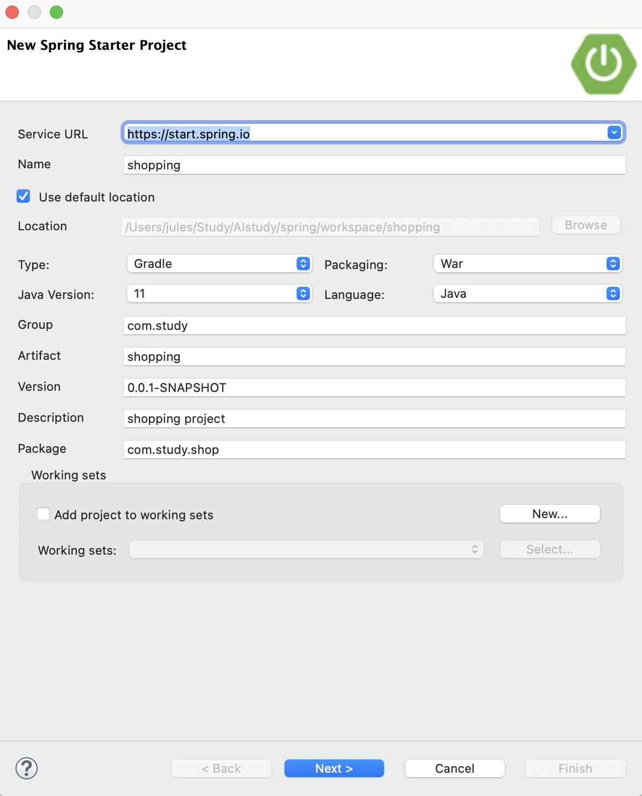
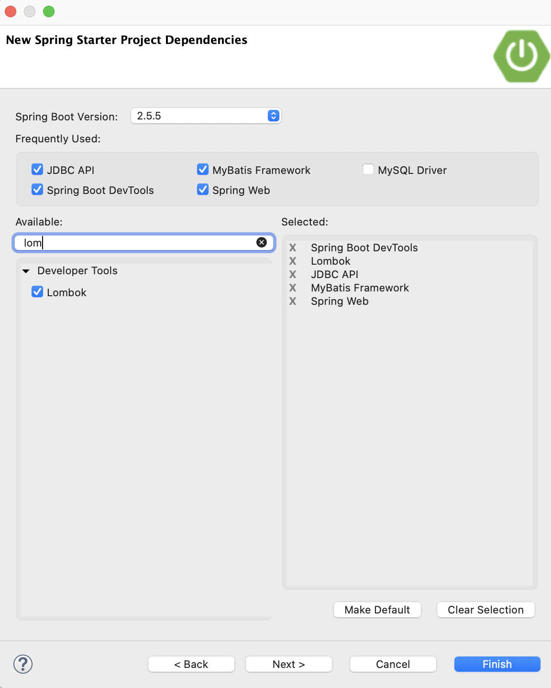
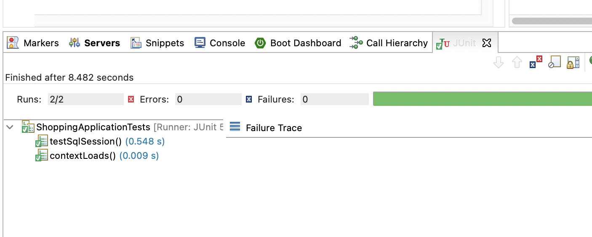
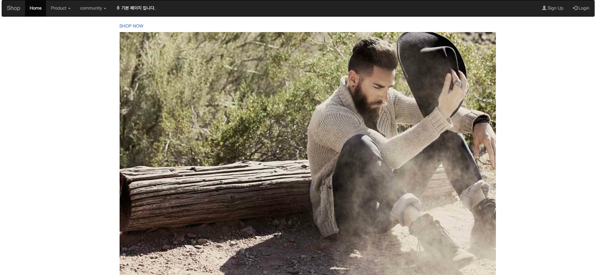
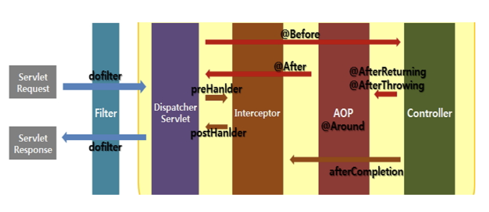
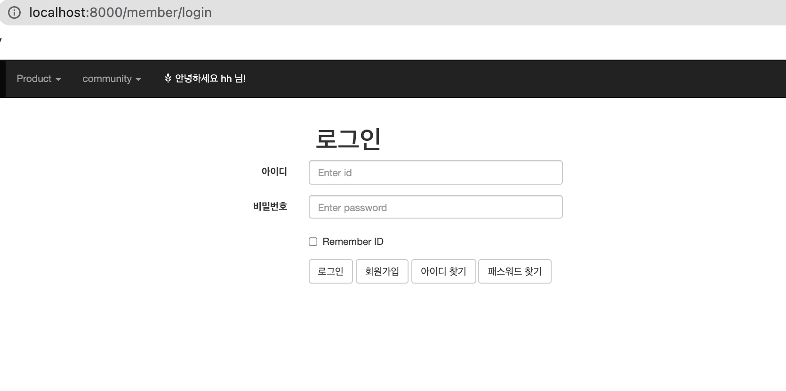

# SpringBoot


## Shopping application 제작


### 1. Spring Starter Project 생성

#### (1) Project start

Name : shopping
Group : com.study
Package : com.study.shop






#### (2) src/main/resources/application.properties 설정

- 프로젝트에 사용되는 오라클 계정 설정

> application.properties

```properties
server.port = 8000
# JSP View path
spring.mvc.view.prefix=/WEB-INF/views/
spring.mvc.view.suffix=.jsp
# DEVTOOLS (DevToolsProperties)
spring.devtools.livereload.enabled=true

# Oracle
spring.datasource.hikari.driver-class-name=oracle.jdbc.driver.OracleDriver
spring.datasource.hikari.jdbc-url:jdbc:oracle:thin:@orcldb_high?TNS_ADMIN=전자지갑경로
spring.datasource.hikari.username=admin
spring.datasource.hikari.password=디비비번
 
# All DBMS
spring.datasource.hikari.maximum-pool-size=10
spring.datasource.hikari.minimum-idle=5
spring.datasource.hikari.connection-timeout=5000
```


#### (3) Jsp 의존성 추가

- 편집 후 Gradle -> Refresh Gradle Project

> build.gradle 편집

```
implementation 'javax.servlet:jstl'  
implementation 'org.apache.tomcat.embed:tomcat-embed-jasper'  
implementation 'org.springframework.boot:spring-boot-starter-validation'
```


#### (4)  Component scan "com.study.shop" 패키지 설정


```java
package com.study.shop;

import org.springframework.boot.SpringApplication;
import org.springframework.boot.autoconfigure.SpringBootApplication;
import org.springframework.context.annotation.ComponentScan;

@SpringBootApplication
@ComponentScan(basePackages= {"com.study.*"})
public class ShoppingApplication {

	public static void main(String[] args) {
		SpringApplication.run(ShoppingApplication.class, args);
	}

}
```


####  (5) 관련폴더 생성

- JSP views: /src/main/webapp/WEB-INF/views
- CSS: /src/main/resources/static/css
- images: /src/main/resources/static/images
- Javascript: /src/main/resources/static/js


### 2. MyBatis 설정


#### (1) DatabaseConfiguration 파일생성

- xml mapper 위치할 src/main/resources/mybatis 폴더 생성

> DatabaseConfiguration.java

```java
package com.study.shop;
 
import javax.sql.DataSource;
 
import org.apache.ibatis.session.SqlSessionFactory;
import org.mybatis.spring.SqlSessionFactoryBean;
import org.mybatis.spring.SqlSessionTemplate;
import org.mybatis.spring.annotation.MapperScan;
import org.springframework.beans.factory.annotation.Autowired;
import org.springframework.boot.context.properties.ConfigurationProperties;
import org.springframework.context.ApplicationContext;
import org.springframework.context.annotation.Bean;
import org.springframework.context.annotation.Configuration;
import org.springframework.context.annotation.PropertySource;
 
import com.zaxxer.hikari.HikariConfig;
import com.zaxxer.hikari.HikariDataSource;
 
@Configuration
@PropertySource("classpath:/application.properties")  // 설정 파일 위치
@MapperScan(basePackages= {"com.study.*"})
public class DatabaseConfiguration {
  @Autowired
  private ApplicationContext applicationContext;
  
  @Bean
  @ConfigurationProperties(prefix="spring.datasource.hikari") // 설정 파일의 접두사 선언 
  public HikariConfig hikariConfig() {
      return new HikariConfig();
  }
  
  @Bean
  public DataSource dataSource() throws Exception{
      DataSource dataSource = new HikariDataSource(hikariConfig());
      System.out.println(dataSource.toString());  // 정상적으로 연결 되었는지 해시코드로 확인
      return dataSource;
  }
  
  @Bean
  public SqlSessionFactory sqlSessionFactory(DataSource dataSource) throws Exception{
      SqlSessionFactoryBean sqlSessionFactoryBean = new SqlSessionFactoryBean();
      sqlSessionFactoryBean.setDataSource(dataSource);
      sqlSessionFactoryBean.setMapperLocations(applicationContext.getResources("classpath:/mybatis/**/*.xml"));   
      return sqlSessionFactoryBean.getObject();
  }
  
  @Bean
  public SqlSessionTemplate sqlSessionTemplate(SqlSessionFactory sqlSessionFactory){
      return new SqlSessionTemplate(sqlSessionFactory);
  }
}
```


#### (2) Oracle Driver 설정 및 테스트

- Oracle Driver 인식이 불규칙하면 WEB-INF/lib/ojdbc8.jar 로 저장한다.
- /src/test/java/ -> Junit Test

```java
package com.study.shop;

import org.junit.jupiter.api.Test;
import org.mybatis.spring.SqlSessionTemplate;
import org.springframework.beans.factory.annotation.Autowired;
import org.springframework.boot.test.context.SpringBootTest;

@SpringBootTest
class ShoppingApplicationTests {

	@Autowired
	private SqlSessionTemplate sqlSession;

	@Test
	void contextLoads() {
	}

	@Test
	public void testSqlSession() throws Exception {
		System.out.println(sqlSession.toString());
	}
}
```




- Amateras ERD툴 => 잘 적용 안되는 경우가 많아 강의 내용에는 있지만, 생략


## shopping 기본페이지_tiles 설정 및 template 사용, index.jsp


### 1. tiles 설정


#### (1) build.gradle 편집

```
// https://mvnrepository.com/artifact/org.apache.tiles/tiles-jsp
	implementation group: 'org.apache.tiles', name: 'tiles-jsp', version: '3.0.8' 
}
```


#### (2) TilesConfiguration 클래스 생성

- TilesViewResolver 생성 및 layout xml 위치 지정

> TilesConfiguration.java

```java
package com.study.shop;
 
import org.springframework.context.annotation.Bean;
import org.springframework.context.annotation.Configuration;
import org.springframework.web.servlet.view.tiles3.TilesConfigurer;
import org.springframework.web.servlet.view.tiles3.TilesView;
import org.springframework.web.servlet.view.tiles3.TilesViewResolver;
 
@Configuration
public class TilesConfiguration {
  @Bean
  public TilesConfigurer tilesConfigurer() {
      final TilesConfigurer configurer = new TilesConfigurer();
      //해당 경로에 tiles.xml 파일을 넣음
      configurer.setDefinitions(new String[]{"classpath:/tiles/tiles_member.xml"});
      configurer.setCheckRefresh(true);
      return configurer;
  }
 
  @Bean
  public TilesViewResolver tilesViewResolver() {
      final TilesViewResolver tilesViewResolver = new TilesViewResolver();
      tilesViewResolver.setViewClass(TilesView.class);
      return tilesViewResolver;
  }
}
```


#### (3) layout 설정 파일 생성

>  /src/main/resources/tiles/tiles_member.xml 

```xml
<?xml version="1.0" encoding="UTF-8" ?>
<!DOCTYPE tiles-definitions PUBLIC
       "-//Apache Software Foundation//DTD Tiles Configuration 3.0//EN"
       "http://tiles.apache.org/dtds/tiles-config_3_0.dtd">
 
<tiles-definitions>
  <!-- main -->
  <definition name="main"
    template="/WEB-INF/views/template/template.jsp">
    <put-attribute name="header"
      value="/WEB-INF/views/template/top.jsp" />
  </definition>
  <definition name="/home" extends="main">
    <put-attribute name="title" value="기본페이지"></put-attribute>
    <put-attribute name="body"
      value="/WEB-INF/views/index.jsp" />
  </definition>
 
</tiles-definitions>
```


> /WEB-INF/views/template/template.jsp 

```jsp
<%@ page contentType="text/html; charset=UTF-8"%>
<%@ taglib prefix="tiles" uri="http://tiles.apache.org/tags-tiles"%>
<html>
<head>
<title><tiles:getAsString name="title" /></title>
</head>
<body>

  <!-- 상단 메뉴 -->
  <tiles:insertAttribute name="header" />
  <!-- 상단 메뉴 끝 -->

  <!-- 내용 시작 -->
  <tiles:insertAttribute name="body" />
  <!-- 내용 끝 -->

</body>
</html>
```


> /WEB-INF/views/template/top.jsp 

```jsp
<%@ page contentType="text/html; charset=UTF-8"%>
<%@ taglib prefix="c" uri="http://java.sun.com/jsp/jstl/core"%>
<c:set var="root" value="${pageContext.request.contextPath }" />
<c:choose>
  <c:when test="${not empty sessionScope.id && sessionScope.grade == 'A'}">
    <c:set var="str">관리자 페이지 입니다.</c:set>
  </c:when>
  <c:when test="${not empty sessionScope.id && sessionScope.grade != 'A'}">
    <c:set var='str'>안녕하세요  ${sessionScope.id } 님!</c:set>
  </c:when>
  <c:otherwise>
    <c:set var="str">기본 페이지 입니다.</c:set>
  </c:otherwise>
</c:choose>
<!DOCTYPE html>
<html>
<head>
<title>memo</title>
<meta charset="utf-8">
<meta name="viewport" content="width=device-width, initial-scale=1">
<link rel="stylesheet" href="https://maxcdn.bootstrapcdn.com/bootstrap/3.4.0/css/bootstrap.min.css">
<script src="https://ajax.googleapis.com/ajax/libs/jquery/3.5.1/jquery.min.js"></script>
<script src="https://maxcdn.bootstrapcdn.com/bootstrap/3.4.0/js/bootstrap.min.js"></script>
<style type="text/css">
#grade {
  color: white;
}
</style>
</head>
<body>
  <!--상단메뉴-->
  <div class="container-fluid">
    <nav class="navbar navbar-inverse">
      <div class="container-fluid">
        <div class="navbar-header">
          <a class="navbar-brand" href="${root}/">Shop</a>
        </div>
        <ul class="nav navbar-nav">
          <li class="active"><a href="${root}/">Home</a></li>
          <li class="dropdown"><a class="dropdown-toggle" data-toggle="dropdown" href="#">Product <span
              class="caret"></span></a>
            <ul class="dropdown-menu">
              <li><a href="#">Jean</a></li>
              <li><a href="#">Bag</a></li>
              <li><a href="#">Shoes</a></li>
            </ul></li>
          <li class="dropdown"><a class="dropdown-toggle" data-toggle="dropdown" href="#">community <span
              class="caret"></span></a>
            <ul class="dropdown-menu">
              <li><a href="${root}/contents/mypage">Mypage</a></li>
              <li><a href="${root}/review/list">Review</a></li>
              <li><a href="#">Notice</a></li>
              <li><a href="#">Q&A</a></li>
            </ul></li>
          <li><a id="grade"><span class="glyphicon glyphicon-grain"></span> ${str}</a></li>
        </ul>
        <ul class="nav navbar-nav navbar-right">
          <c:choose>
            <c:when test="${empty sessionScope.id }">
              <li><a href="${root}/member/agree"><span class="glyphicon glyphicon-user"></span> Sign Up</a></li>
              <li><a href="${root}/member/login"><span class="glyphicon glyphicon-log-in"></span> Login</a></li>
            </c:when>
            <c:when test="${not empty sessionScope.id && sessionScope.grade == 'A'}">
              <li><a href="${root}/admin/create"><span class="glyphicon glyphicon-plus-sign"></span> 상품등록</a></li>
              <li><a href="${root}/admin/list"><span class="glyphicon glyphicon-list"></span> 회원목록</a></li>
              <li><a href="${root}/member/logout"><span class="glyphicon glyphicon-log-out"></span> 로그아웃</a></li>
            </c:when>
            <c:otherwise>
              <li><a href="${root}/member/update"><span class="glyphicon glyphicon-shopping-cart"></span> Cart</a></li>
              <li><a href="${root}/member/update"><span class="glyphicon glyphicon-edit"></span> 회원수정</a></li>
              <li><a href="${root}/member/logout"><span class="glyphicon glyphicon-log-out"></span> 로그아웃</a></li>
            </c:otherwise>
          </c:choose>

        </ul>
      </div>
    </nav>

  </div>
</body>
</html>
```


#### (4) Controller, View

> package com.study.member;
>
> MemberController.java

```java
package com.study.member;

import org.springframework.stereotype.Controller;
import org.springframework.web.bind.annotation.GetMapping;

@Controller
public class MemberController {

	@GetMapping("/")
	public String home() {

		return "/home";
	}
}
```


> views/index.jsp

```jsp
<%@ page contentType="text/html; charset=UTF-8"%>
<%@ taglib prefix="c" uri="http://java.sun.com/jsp/jstl/core"%>

<!DOCTYPE html>
<html>
<head>
<title>기본페이지</title>
<meta charset="utf-8">
<style type="text/css">
img {
  display: inline;
}
</style>
</head>
<body>

  <div class="container">
    <p>
      <a href="./content/list">SHOP NOW</a>
    </p>
    

  </div>
</body>
</html>
```


### 실행결과

```
http://localhost:8000/
```




## member 테이블 모델링, SQL 제작, MemberDTO , JSON 의존성 추가


### 1.회원 SQL 

> WEB-INF/sql/member.sql
>
> member table 작성

```sql
CREATE TABLE MEMBER(
	id 			VARCHAR2(10) NOT NULL PRIMARY KEY,
	passwd 		VARCHAR2(20) NOT NULL,
	mname 		VARCHAR2(20) NOT NULL,
	tel 		VARCHAR2(14) NULL ,
	email 		VARCHAR2(50) NOT NULL UNIQUE,
	zipcode		VARCHAR2(7) NULL ,
	address1 	VARCHAR2(150) NULL ,
	address2 	VARCHAR2(50) NULL ,
	job 		VARCHAR2(20) NOT NULL,
	mdate 		DATE NOT NULL,
	fname 		VARCHAR2(50) DEFAULT 'member.jpg' NOT NULL,
	grade 		VARCHAR2(1) DEFAULT 'H' NOT NULL
);
 
COMMENT ON TABLE member is '회원';
COMMENT ON COLUMN member.id is '아이디';
COMMENT ON COLUMN member.passwd is '비밀번호';
COMMENT ON COLUMN member.mname is '성명';
COMMENT ON COLUMN member.tel is '전화번호';
COMMENT ON COLUMN member.email is '이메일';
COMMENT ON COLUMN member.zipcode is '우편번호';
COMMENT ON COLUMN member.address1 is '주소';
COMMENT ON COLUMN member.address2 is '상세주소';
COMMENT ON COLUMN member.job is '직업';
COMMENT ON COLUMN member.mdate is '가입일';
COMMENT ON COLUMN member.fname is '회원사진';
COMMENT ON COLUMN member.grade is '회원등급';
```


※ 제약 조건 

- NOT NULL: INSERT SQL에서 필수 입력. 
- UNIQUE : 컬럼에 중복된 값이 올 수 없음. 
- PRIMARY KEY (id): 기본적으로 UNIQUE의 성질을 포함하면서 레코드를  구분하는 기준 컬럼의 값. 


```sql
--create 
INSERT INTO member(id, passwd, mname, tel, email, zipcode,  
address1,address2, job, mdate, fname, grade) 
VALUES('user1', '1234', '개발자1', '123-1234', 'email1@mail.com',  
'123-123','인천시', '남동구' ,'A01', sysdate, 'member.jpg', 'H'); 
 
INSERT INTO member(id, passwd, mname, tel, email, zipcode,  
address1,address2, job, mdate, fname, grade) 
VALUES('user2', '1234', '개발자2', '123-1234', 'email2@mail.com',  
'123-123','광명시','남동구' ,'A01', sysdate, 'man.jpg', 'H'); 
 
INSERT INTO member(id, passwd, mname, tel, email, zipcode,  
address1,address2, job, mdate, fname, grade) 
VALUES('user3', '1234', '개발자3', '123-1234', 'email3@mail.com',  
'123-123','용인시','남동구' ,'A01', sysdate, 'myface.jpg', 'H'); 
 
--관리자 계정
INSERT INTO member(id, passwd, mname, tel, email, zipcode,  
address1,address2, job, mdate, fname, grade) 
VALUES('admin', '1234', '관리자', '02-1234-1234', 'admin@mail.com',  
'123-123','서울시 서초구','남부터미널' ,'A01', sysdate, 'member.jpg', 'A');  
 
--중복 아이디 검사 관련 SQL 
-- 0: 중복 아님, 1: 중복  
SELECT COUNT(id)  
FROM member  
WHERE id='user1'; 
 
 
--이메일 중복 확인
SELECT COUNT(email) as cnt  
FROM member  
WHERE email='email3@mail.com'; 
 
 
--user1 회원 정보 보기 
SELECT id, passwd, mname, tel, email, zipcode, address1, address2, 
    job, mdate, fname, grade 
FROM member  
WHERE id='user1'; 
 
 
--회원 사진 이미지의 수정
UPDATE member 
SET fname='' 
WHERE id='user1'; 
 
 
--패스워드 변경
UPDATE member
SET passwd='1234'
WHERE id='';
 
 
--회원 정보 수정 
UPDATE member  
SET passwd='TEST',
tel='123-123', 
email='email10',
zipcode='TEST',  
    address1='수원', 
    address2='팔달구', 
    job='TEST'
WHERE id = 'user3'; 
 
 
--'user3' 회원 삭제 
DELETE FROM member WHERE id='user3';
 
 
--로그인 관련 SQL 
SELECT COUNT(id) as cnt 
FROM member 
WHERE id = 'user1' AND passwd = '1234';  
 
 
 
--list
SELECT id, mname, tel, email, zipcode, address1, address2, fname,  r
from(
		SELECT id, mname, tel, email, zipcode, address1, address2, fname, rownum r
		from(
			SELECT id, mname, tel, email, zipcode, address1, address2, fname
			FROM member
			where mname like '%개%'
			ORDER BY mdate DESC 
		)
)where r >= 1 and r <= 5;
```


\+ JSON 객체 의존성 추가

- build.gradle 편집 Gradle ->Refresh Gradle Project

> build.gradle

```
// https://mvnrepository.com/artifact/org.json/json
implementation group: 'org.json', name: 'json', version: '20201115'  
```


## mybatis 설정

mybatis.xml, Mapper, @Service, @Controller, tiles


### 1. mybatis 설정

>DatabaseConfiguration.java

```java
package com.study.shop;
 
import javax.sql.DataSource;
 
import org.apache.ibatis.session.SqlSessionFactory;
import org.mybatis.spring.SqlSessionFactoryBean;
import org.mybatis.spring.SqlSessionTemplate;
import org.mybatis.spring.annotation.MapperScan;
import org.springframework.beans.factory.annotation.Autowired;
import org.springframework.boot.context.properties.ConfigurationProperties;
import org.springframework.context.ApplicationContext;
import org.springframework.context.annotation.Bean;
import org.springframework.context.annotation.Configuration;
import org.springframework.context.annotation.PropertySource;
 
import com.zaxxer.hikari.HikariConfig;
import com.zaxxer.hikari.HikariDataSource;
 
@Configuration
@PropertySource("classpath:/application.properties")  // 설정 파일 위치
@MapperScan(basePackages= {"com.study.*"})
public class DatabaseConfiguration {
  @Autowired
  private ApplicationContext applicationContext;
  
  @Bean
  @ConfigurationProperties(prefix="spring.datasource.hikari") // 설정 파일의 접두사 선언 
  public HikariConfig hikariConfig() {
      return new HikariConfig();
  }
  
  @Bean
  public DataSource dataSource() throws Exception{
      DataSource dataSource = new HikariDataSource(hikariConfig());
      System.out.println(dataSource.toString());  // 정상적으로 연결 되었는지 해시코드로 확인
      return dataSource;
  }
  
  @Bean
  public SqlSessionFactory sqlSessionFactory(DataSource dataSource) throws Exception{
      SqlSessionFactoryBean sqlSessionFactoryBean = new SqlSessionFactoryBean();
      sqlSessionFactoryBean.setDataSource(dataSource);
      sqlSessionFactoryBean.setMapperLocations(applicationContext.getResources("classpath:/mybatis/**/*.xml"));   
      return sqlSessionFactoryBean.getObject();
  }
  
  @Bean
  public SqlSessionTemplate sqlSessionTemplate(SqlSessionFactory sqlSessionFactory){
      return new SqlSessionTemplate(sqlSessionFactory);
  }
}
```


### 2. mybatis xml, Mapper Interface

> mybatis/member.xml

```xml
<?xml version="1.0" encoding="UTF-8"?>

<!DOCTYPE mapper
PUBLIC "-//mybatis.org//DTD Mapper 3.0//EN"
"http://mybatis.org/dtd/mybatis-3-mapper.dtd">

<mapper namespace="com.study.member.MemberMapper">
  <update id="updateFile" parameterType="Map">
    update member
    set fname = #{fname}
    where id = #{id}
  </update>
  <select id="total" parameterType="Map" resultType="int">
    select count(*) from member
    <where>
      <choose>
        <when test="col=='mname'">
          mname like '%'||#{word}||'%'
        </when>
        <when test="col=='id'">
          id like '%'||#{word}||'%'
        </when>
        <when test="col=='email'">
          email like '%'||#{word}||'%'
        </when>
      </choose>
    </where>
  </select>
  <select id="list" parameterType="Map" resultType="com.study.member.MemberDTO">
    SELECT id, mname, tel, email, zipcode, address1, address2, fname, r
    from(
        SELECT id, mname, tel, email, zipcode, address1, address2,fname, rownum r
        from(
            SELECT id, mname, tel, email, zipcode, address1, address2, fname
            FROM member
    <where>
      <choose>
        <when test="col=='mname'">
          mname like '%'||#{word}||'%'
        </when>
        <when test="col=='id'">
          id like '%'||#{word}||'%'
        </when>
        <when test="col=='email'">
          email like '%'||#{word}||'%'
        </when>
      </choose>
    </where>
    ORDER BY mdate DESC
    )
        <![CDATA[       
                )where r >= #{sno} and r <= #{eno}
        ]]>
  </select>
  <update id="update" parameterType="com.study.member.MemberDTO">
    update member
    set tel = #{tel},
    email = #{email},
    zipcode = #{zipcode},
    address1 = #{address1},
    address2 = #{address2},
    job = #{job}
    where id = #{id}
  </update>
  <select id="read" parameterType="String" resultType="com.study.member.MemberDTO">
    select *
    from member
    where id = #{id}
  </select>
  <select id="getGrade" parameterType="String" resultType="String">
    select
    grade from member
    where id = #{id}
  </select>
  <select id="loginCheck" parameterType="Map" resultType="int">
    select
    count(*) from member
    where id = #{id}
    and passwd = #{passwd}
  </select>
  <select id="duplicatedId" parameterType="String" resultType="int">
    select count(*) from member
    where id = #{id}
  </select>
  <select id="duplicatedEmail" parameterType="String" resultType="int">
    select count(*) from member
    where email = #{email}
  </select>
  <insert id="create" parameterType="com.study.member.MemberDTO">
    INSERT INTO member(id, passwd,
    mname, tel, email, zipcode,
    address1, address2, job, mdate, fname, grade)
    VALUES(#{id}, #{passwd},#{mname}, #{tel}, #{email}, #{zipcode},
    #{address1}, #{address2}, #{job}, sysdate, #{fname}, 'H')
  </insert>
</mapper>
```


> MemberMapper.java

```java
package com.study.member;

import java.util.List;
import java.util.Map;

public interface MemberMapper {
	int duplicatedId(String id);

	int duplicatedEmail(String email);

	int create(MemberDTO dto);

	int loginCheck(Map<String, String> map);

	String getGrade(String id);

	MemberDTO read(String id);

	int update(MemberDTO dto);

	int total(Map map);

	List<MemberDTO> list(Map map);

	int updateFile(Map map);
}
```


### 3. Service Interface, impl Class 구현

> MemberService.java

```java
package com.study.member;

import java.util.List;
import java.util.Map;

public interface MemberService {
	int duplicatedId(String id);

	int duplicatedEmail(String email);

	int create(MemberDTO dto);

	int loginCheck(Map<String, String> map);

	String getGrade(String id);

	MemberDTO read(String id);

	int update(MemberDTO dto);

	int total(Map map);

	List<MemberDTO> list(Map map);

	int updateFile(Map map);
}
```


> MemberServiceImpl.java

```java
package com.study.member;

import java.util.List;
import java.util.Map;

import org.springframework.beans.factory.annotation.Autowired;
import org.springframework.stereotype.Service;

@Service("com.study.member.MemberServiceImpl")
public class MemberServiceImpl implements MemberService {

	@Autowired
	private MemberMapper mapper;
	
	 @Override
     public int duplicatedId(String id) {
             // TODO Auto-generated method stub
             return mapper.duplicatedId(id);
     }

     @Override
     public int duplicatedEmail(String email) {
             // TODO Auto-generated method stub
             return mapper.duplicatedEmail(email);
     }

     @Override
     public int create(MemberDTO dto) {
             // TODO Auto-generated method stub
             return mapper.create(dto);
     }

     @Override
     public int loginCheck(Map<String, String> map) {
             // TODO Auto-generated method stub
             return mapper.loginCheck(map);
     }

     @Override
     public String getGrade(String id) {
             // TODO Auto-generated method stub
             return mapper.getGrade(id);
     }

     @Override
     public MemberDTO read(String id) {
             // TODO Auto-generated method stub
             return mapper.read(id);
     }

     @Override
     public int update(MemberDTO dto) {
             // TODO Auto-generated method stub
             return mapper.update(dto);
     }

     @Override
     public int total(Map map) {
             // TODO Auto-generated method stub
             return mapper.total(map);
     }

     @Override
     public List<MemberDTO> list(Map map) {
             // TODO Auto-generated method stub
             return mapper.list(map);
     }

     @Override
     public int updateFile(Map map) {
             // TODO Auto-generated method stub
             return mapper.updateFile(map);
     }

}
```


### 4. Controller Class 작성

> MemberController.java

```
```


 ### 5. 유틸 클래스 작성

> com.study.utility.Utility.java

```
```


### 6. View 페이지, Tiles

\- views/member 폴더를 다운받은 후  위치에 복사.


#### (1) Tile 설정 및 파일 업로드 설정

- build.gradle 의존성 추가
- Gradle -> Refresh Gradle Project

> build.gradle

```
// https://mvnrepository.com/artifact/org.apache.tiles/tiles-jsp
implementation group: 'org.apache.tiles', name: 'tiles-jsp', version: '3.0.8' 

// https://mvnrepository.com/artifact/commons-io/commons-io       
implementation group: 'commons-io', name: 'commons-io', version: '2.6'

// https://mvnrepository.com/artifact/commons-fileupload/commons-fileupload
implementation group: 'commons-fileupload', name: 'commons-fileupload', version: '1.3.3
```


- /src/main/java 폴더에 TilesConfiguration.java 생성
- /src/main/resources 폴더에 tiles폴더 생성
- TilesConfiguration.java 에서 tiles_member.xml 추가


> TilesConfiguration.java

```java
  @Bean
  public TilesConfigurer tilesConfigurer() {
      final TilesConfigurer configurer = new TilesConfigurer();
      //해당 경로에 tiles.xml 파일을 넣음
      configurer.setDefinitions(new String[]{"classpath:/tiles/tiles_member.xml"});
      configurer.setCheckRefresh(true);
      return configurer;
  }
```


- tiles_member.xml 파일 작성

> tiles_member.xml

```xml
<?xml version="1.0" encoding="UTF-8" ?>
<!DOCTYPE tiles-definitions PUBLIC
       "-//Apache Software Foundation//DTD Tiles Configuration 3.0//EN"
       "http://tiles.apache.org/dtds/tiles-config_3_0.dtd">
 
<tiles-definitions>
  <!-- main -->
  <definition name="main"
    template="/WEB-INF/views/template/template.jsp">
    <put-attribute name="header"
      value="/WEB-INF/views/template/top.jsp" />
  </definition>
  <definition name="/home" extends="main">
    <put-attribute name="title" value="기본페이지"></put-attribute>
    <put-attribute name="body"
      value="/WEB-INF/views/index.jsp" />
  </definition>
  <definition name="/member/agree" extends="main"> 
    <put-attribute name="title" value="약관동의" ></put-attribute> 
    <put-attribute name="body" value="/WEB-INF/views/member/agreement.jsp" /> 
  </definition>   
  <definition name="/member/create" extends="main"> 
	<put-attribute name="title" value="회원가입" ></put-attribute> 
    <put-attribute name="body" value="/WEB-INF/views/member/createForm.jsp" /> 
  </definition>   
  <definition name="/member/login" extends="main"> 
    <put-attribute name="title" value="로그인" ></put-attribute> 
    <put-attribute name="body" value="/WEB-INF/views/member/loginForm.jsp" /> 
  </definition>   
  <definition name="/member/read" extends="main"> 
    <put-attribute name="title" value="나의정보" ></put-attribute> 
    <put-attribute name="body" value="/WEB-INF/views/member/read.jsp" /> 
  </definition>   
  <definition name="/member/update" extends="main"> 
	<put-attribute name="title" value="정보수정" ></put-attribute> 
    <put-attribute name="body" value="/WEB-INF/views/member/updateForm.jsp" /> 
  </definition>   
  <definition name="/member/list" extends="main"> 
    <put-attribute name="title" value="회원목록" ></put-attribute> 
    <put-attribute name="body" value="/WEB-INF/views/member/list.jsp" /> 
  </definition>   
  <definition name="/member/updateFile" extends="main"> 
    <put-attribute name="title" value="사진수정" ></put-attribute> 
    <put-attribute name="body" value="/WEB-INF/views/member/updateFileForm.jsp" /> 
  </definition> 
</tiles-definitions>
```


% 잘 안되서 -> commons-io.jar 설치


## 관리자 인증의 구현, Interceptor

- 관리자 권한이 없는 상태에서 관리자만 접근할 수 있는 페이지를 불법으로 접근하면 관리자 로그인 페이지로 이동하여 관리자 로그인을 유도한다.
- 인테셉터 이용전 일반계정은 권한이 부족해도 관리자 페이지에 접근할 수 있다.

-> url로 접근하면 접근 가능

```
http://localhost:8000/admin/list
```


### 1. 필터

- web 개발에서 사용자의 권한을 확인하여 권한이 없는 경우에 권한을 획득할 수 있도록 로그인 페이지로 이동할 경우 Filter를 이용한다.
- Filter는 요청과 응답을 필터링 후 정제하는 역할을 한다.
- Filter는 Front Controller 이전에 실행된다. 필터가 요청내용을 변경하거나, 여러가지 체크를 수행할 수 있다.
- 요청의 처리가 끝난 후 응답내용에 대해서도 변경하는 처리를 할 수가 있다.
- 일반적으로 인코딩 변환 처리, 로그인처리, 권한체크 등을 한다.

#### [ 필터의 실행메서드 ]

- `init()` - 필터 인스턴스 초기화
- `doFilter()` - 요청 작업 전/후 처리
- `destroy()` - 필터 인스턴스 종료


### 2. 인터셉터

- Spring MVC에서 Filter 대신 Intercepter를 이용할 수 있다.
- 요청에 대한 작업 전/후로 가로챈다고 보면 된다.
- 필터는 스프링 컨텍스트 외부에 존재하여 스프링과 무관한 자원에 대해 동작한다.(일반 JSP, MVC에서 가능) 
- 인터셉터는 스프링의 Front Controller가 요청처리(백앤드) 컨트롤러를 호출하기 전, 후로 끼어들기 때문에 스프링 컨텍스트(Context, 영역) 내부에서 Controller에 관한 요청과 응답에 대해 처리한다.
- 스프링의 모든 빈 객체에 접근할 수 있다.
- 로그인 체크, 권한체크, 프로그램 실행시간 계산작업 로그확인 등의 업무처리 등을 할 수 있다.

#### [ 인터셉터의 실행메서드 ] 

- `preHandler()` - 컨트롤러 메서드가 실행되기 전
- `postHanler()` - 컨트롤러 메서드 실행된 후 view페이지 렌더링 되기 전
- `afterCompletion()` - view페이지가 렌더링 되고 난 후

  

### 3.. Filter, Interceptor, AOP의 흐름

- 공통업무에 관련된 코드를 모든 페이지 마다 작성 해야 한다면 중복된 코드가 많아지게 되고  프로젝트 단위가 커질수록 서버에 부하를 줄 수도있으며, 소스 관리도 되지 않는다.
- 즉, 공통 부분은 빼서 따로 관리하는게 좋다.
- 이러한 공통업무를 프로그램 흐름의 앞, 중간, 뒤에 추가하여 자동으로 처리 할 수 있다.
- 공통처리를 위해 활용할 수 있는 것이 Filter, Intercepter, AOP이다.
  \- 파란화살표 : Filter
  \- 갈색화살표 : Intercepter
  \- (붉은화살표 : AOP)




### 4. HandlerIntercepter 인터페이스 구현 및 설정

- shopping project의 관리자 인증에서 Interceptor를 사용한다.


#### (1) HandlerIntercepter 구현 클래스

> AdminInterceptor.java

```java
package com.study.shop;

import javax.servlet.http.HttpServletRequest;
import javax.servlet.http.HttpServletResponse;
import javax.servlet.http.HttpSession;
import org.springframework.web.servlet.ModelAndView;
import org.springframework.web.servlet.handler.HandlerInterceptorAdapter;

import com.study.utility.Utility;

public class AdminInterceptor extends HandlerInterceptorAdapter {
	// URL 요청후 콘트롤러 작동전에 실행함.
	@Override
	public boolean preHandle(HttpServletRequest request, HttpServletResponse response, Object handler)
			throws Exception {
		HttpSession session = request.getSession(true);
		// 회원 로그인시 "grade" 세션 변수 생성, "A" 할당
		String grade = Utility.checkNull((String) session.getAttribute("grade"));
		System.out.println("session.getAttribute(\"grade\"): " + grade);
		System.out.println("preHandle executed.");
		if (grade.length() != 0 && grade.compareTo("A") <= 0) { // 접근 가능, 요청 페이지 처리,회원이거나 회원보다 높은 권한
			System.out.println("접속 권한 있음: " + grade);
			return true; // 요청 페이지로 계속 진행
		} else {
			// 에러 출력또는 로그인 페이지로 이동
			response.sendRedirect("/member/login");
			return false;
		}
	}

	// 요청 주소 결과 생성후 작동함
	@Override
	public void postHandle(HttpServletRequest request, HttpServletResponse response, Object handler,
			ModelAndView modelAndView) throws Exception {
		System.out.println("postHandle executed.");
		modelAndView.addObject("admin", "관리자 관련 기능을 출력합니다.");
	}

	// JSP등 View 페이지 출력전에 작동됨.
	@Override
	public void afterCompletion(HttpServletRequest request, HttpServletResponse response, Object handler, Exception ex)
			throws Exception {
		System.out.println("관리자 Interceptor 실행 후 최종 출력됨.");
	}
}
```


#### (2) Interceptor 등록 설정

> MVCConfiguration.java

```java
package com.study.shop;

import org.springframework.context.annotation.Configuration;
import org.springframework.web.servlet.config.annotation.InterceptorRegistry;
import org.springframework.web.servlet.config.annotation.WebMvcConfigurer;

@Configuration
public class MVCConfiguration implements WebMvcConfigurer {
	@Override
	public void addInterceptors(InterceptorRegistry registry) {

// URL에 "/admin/"이 들어간 요청은 AdminInterceptor 작동함.
		registry.addInterceptor(new AdminInterceptor()).addPathPatterns("/admin/**");

	}
}
```


#### (3) 실행




*Fin.🐧*

