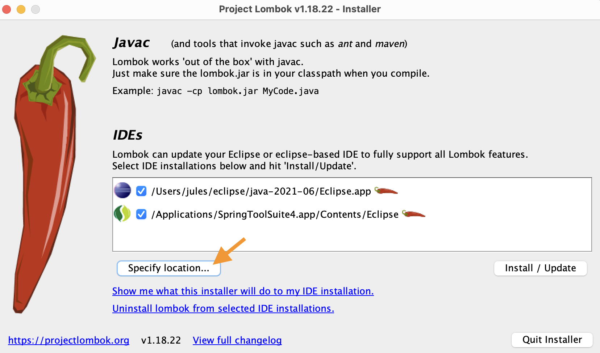
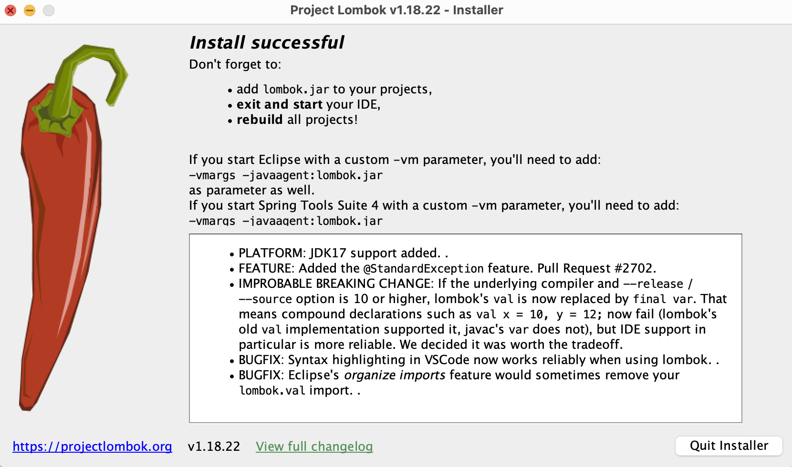
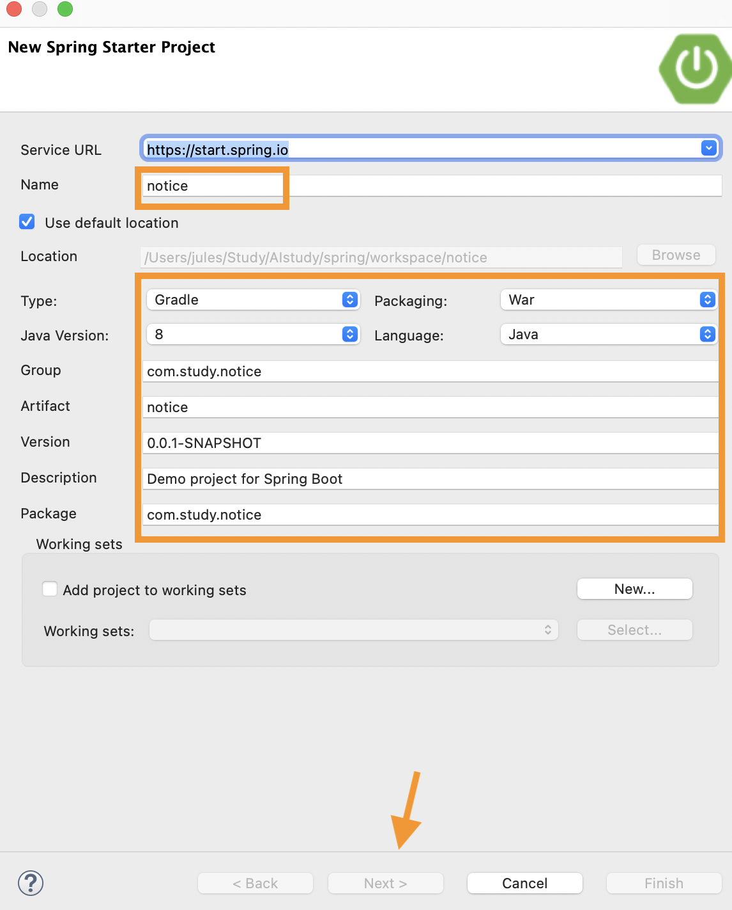
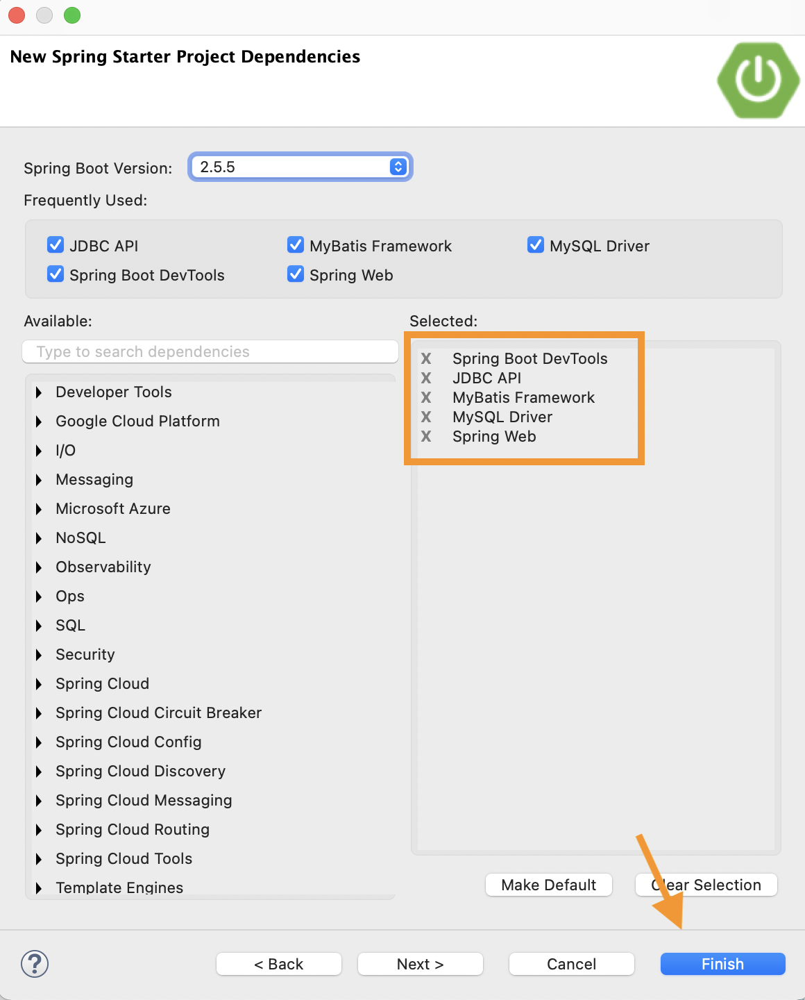
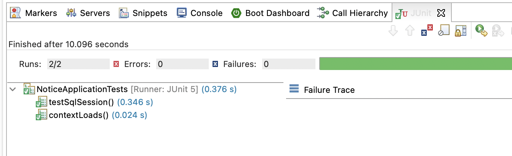
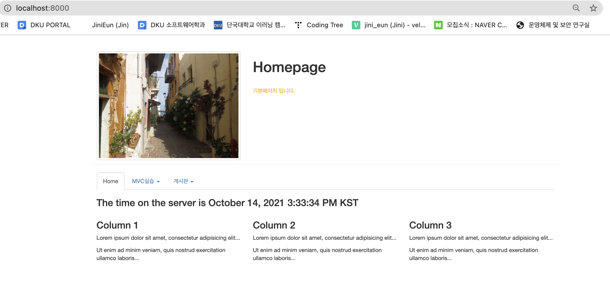

# SpringBoot


## Spring Boot 공지사항 만들기


### 1. 데이터 베이스 설정

>  notice.sql

```sql
-- DDL
-- DROP TABLE notice;
CREATE TABLE notice(
  noticeno      INT (11)                  NOT NULL AUTO_INCREMENT COMMENT '글 번호',
  title         VARCHAR(300)              NOT NULL COMMENT '제목',
  content       TEXT                      NOT NULL COMMENT '내용',
  wname         VARCHAR (20)              NOT NULL COMMENT '작성자',
  passwd        VARCHAR (20)              NULL COMMENT '패스워드',
  cnt           SMALLINT(10)              NOT NULL DEFAULT '0' COMMENT '조회수',
  rdate         DATETIME                  NOT NULL COMMENT '등록일',
  PRIMARY KEY (noticeno)  
);
-- 등록
INSERT INTO notice(title, content, wname, passwd, cnt, rdate)
VALUES('spring 시즌 접수 안내 1', '10% 할인 실시!', '왕눈이', '1234', 0, NOW());
INSERT INTO notice(title, content, wname, passwd, cnt, rdate)
VALUES('spring 시즌 접수 안내 2', '10% 할인 실시!', '아로미', '1234', 0, NOW());
INSERT INTO notice(title, content, wname, passwd, cnt, rdate)
VALUES('spring 시즌 접수 안내 3', '10% 할인 실시!', '투투투', '1234', 0, now());
-- 목록
SELECT noticeno, title, content, wname, passwd, cnt, rdate
FROM notice
ORDER BY noticeno DESC;
-- 조회
SELECT noticeno, title, content, wname, passwd, cnt, rdate
FROM notice
WHERE noticeno=1;
-- 조회수증가
UPDATE notice
SET cnt = cnt + 1
WHERE noticeno=1;
-- 수정
UPDATE notice
SET title='추가 공지', content='5% 추가 할인!', wname='아로미'
WHERE noticeno=1;
-- 패스워드 확인
SELECT COUNT(*) AS cnt
FROM notice
WHERE noticeno=1 AND passwd='1234';
-- 삭제
DELETE FROM notice
WHERE noticeno=3;
 
SELECT * FROM notice;
```


### 2. Lombok을 이용하여 DTO(Data Transfer Object) 생성하기 
- 롬복을 이용하면 getter, setter, toString등을 코드 없이 자동으로 생성해준다.


#### (1) Lombook 설치

- 롬복 홈페이지에서 롬복 플러그인 설치
- IDE 종료

터미널에서 

```
java -jar lombok.jar 
```






✓ 롬복 다운받는 곳에서 build.gradle에 추가할 코드 복사.

```
// https://mvnrepository.com/artifact/org.projectlombok/lombok
compileOnly group: 'org.projectlombok', name: 'lombok', version: '1.18.12'
```


## Spring Boot 공지사항 만들기_프로젝트 생성


### 1.. Spring Starter Project 실행






### 2. build.gradle, application.properties 설정

- jsp 사용을 위한 의존성 추가
- mysql Connection을 위한 driver 의존성 추가
- Annotation기반 Form검증 validation 의존성 추가

> build.gradle

```
implementation 'javax.servlet:jstl'  
implementation 'org.apache.tomcat.embed:tomcat-embed-jasper'  
implementation 'org.springframework.boot:spring-boot-starter-validation'   
runtimeOnly 'mysql:mysql-connector-java'
```


- 서버포트 변경
- JSP view path
- DEVTOOLS
- MariaDB 설정, Conntion pool 설정

> application.properties

```properties
server.port = 8000
# JSP View path
spring.mvc.view.prefix=/WEB-INF/views/
spring.mvc.view.suffix=.jsp
# DEVTOOLS (DevToolsProperties)
spring.devtools.livereload.enabled=true
# MariaDB
spring.datasource.hikari.driver-class-name=com.mysql.cj.jdbc.Driver
spring.datasource.hikari.jdbc-url: jdbc:mysql://localhost:3306/디비이름?useUnicode=true&characterEncoding=utf-8&serverTimezone=UTC
# Hikari Connection Pool
spring.datasource.hikari.username=root
spring.datasource.hikari.password=디비비번
spring.datasource.hikari.connection-test-query=SELECT 1
```


### 3. Component scan 패키지 설정

> NoticeApplication.java
>
> `@ComponentScan(basePackages = {"com.study.*"})` 추가

```java
package com.study.notice;

import org.springframework.boot.SpringApplication;
import org.springframework.boot.autoconfigure.SpringBootApplication;
import org.springframework.context.annotation.ComponentScan;

@SpringBootApplication
@ComponentScan(basePackages = {"com.study.*"})
public class NoticeApplication {

	public static void main(String[] args) {
		SpringApplication.run(NoticeApplication.class, args);
	}

}
```


### 4. NoticeDTO.java 생성

- src/main/java 폴더에 생성
- lombok의 @Data 적용

> NoticeDTO.java

```java
package com.study.model;
import lombok.Data;
@Data
public class NoticeDTO {
  private int    noticeno     ;
  private String title        ;
  private String content      ;
  private String wname        ;
  private String passwd       ;
  private int    cnt          ;
  private String rdate        ;
}
```


### 5. JSP Views, images 폴더 생성

#### (1) jsp views

- /src/main/폴더에 webapp/WEB-INF/views 생성

#### (2) images

- /src/main/resources/static 폴더에 images 생성


### 6. Mybatis 설정

#### (1) DatabaseConfiguration 클래스 생성

- @PropertySource("classpath:/application.properties")는 이 클래스에서 application.properties를 사용
- Hikari를 사용한 datasource를 생성하기 위한 메소드 선언
- 설정 파일의 접두사 선언 spring.datasource.hikari....
- spring mybatis에서 필요한 SqlSessionFactory와 SqlSessionTemplate를 생성 하기 위한 메소드 선언
- /src/main/resources/mybatis 폴더의 파일명이 "xml"로 끝나는 파일 매핑
- MapperScan의 basePackages 선언

> DatabaseConfiguration.java

```java
package com.study.notice;

import javax.sql.DataSource;

import org.apache.ibatis.session.SqlSessionFactory;
import org.mybatis.spring.SqlSessionFactoryBean;
import org.mybatis.spring.SqlSessionTemplate;
import org.mybatis.spring.annotation.MapperScan;
import org.springframework.beans.factory.annotation.Autowired;
import org.springframework.boot.context.properties.ConfigurationProperties;
import org.springframework.context.ApplicationContext;
import org.springframework.context.annotation.Bean;
import org.springframework.context.annotation.Configuration;
import org.springframework.context.annotation.PropertySource;

import com.zaxxer.hikari.HikariConfig;
import com.zaxxer.hikari.HikariDataSource;

@Configuration
@PropertySource("classpath:/application.properties") // 설정 파일 위치
@MapperScan(basePackages = { "com.study.model" })
public class DatabaseConfiguration {
	@Autowired
	private ApplicationContext applicationContext;

	@Bean
	@ConfigurationProperties(prefix = "spring.datasource.hikari") // 설정 파일의 접두사 선언
	public HikariConfig hikariConfig() {
		return new HikariConfig();
	}

	@Bean
	public DataSource dataSource() throws Exception {
		DataSource dataSource = new HikariDataSource(hikariConfig());
		System.out.println(dataSource.toString()); // 정상적으로 연결 되었는지 해시코드로 확인
		return dataSource;
	}

	@Bean
	public SqlSessionFactory sqlSessionFactory(DataSource dataSource) throws Exception {
		SqlSessionFactoryBean sqlSessionFactoryBean = new SqlSessionFactoryBean();
		sqlSessionFactoryBean.setDataSource(dataSource);
		sqlSessionFactoryBean.setMapperLocations(applicationContext.getResources("classpath:/mybatis/**/*.xml"));
		return sqlSessionFactoryBean.getObject();
	}

	@Bean
	public SqlSessionTemplate sqlSessionTemplate(SqlSessionFactory sqlSessionFactory) {
		return new SqlSessionTemplate(sqlSessionFactory);
	}
}
```


#### (2) MyBatis 설정 JUnit 테스트
- /src/test/java 폴더에 테스트 기초 파일이 생성되어 있음
- SqlSessionTemplate 객체 값 확인을 위해서 아래내용 작성
- /src/main/resources/mybatis 폴더 생성
- 테스트 실행: NoticeApplicationTests.java 파일 선택 -> Debug as -> JUnit test




### 실행 확인




## 공지사항, 기본 페이지

### 1. tiles 설정

#### (1) build.gradle 편집

> build.gradle

```
// https://mvnrepository.com/artifact/org.apache.tiles/tiles-jsp
	implementation group: 'org.apache.tiles', name: 'tiles-jsp', version: '3.0.8'
```


#### (2) TilesConfiguration 클래스 생성

- TilesViewResolver 생성 및 layout xml 위치 지정

> TilesConfiguration.java

```java
package com.study.notice;
 
import org.springframework.context.annotation.Bean;
import org.springframework.context.annotation.Configuration;
import org.springframework.web.servlet.view.tiles3.TilesConfigurer;
import org.springframework.web.servlet.view.tiles3.TilesView;
import org.springframework.web.servlet.view.tiles3.TilesViewResolver;
 
@Configuration
public class TilesConfiguration {
  @Bean
  public TilesConfigurer tilesConfigurer() {
      final TilesConfigurer configurer = new TilesConfigurer();
      //해당 경로에 tiles.xml 파일을 넣음
      configurer.setDefinitions(new String[]{"classpath:/tiles/tiles.xml"});
      configurer.setCheckRefresh(true);
      return configurer;
  }
 
  @Bean
  public TilesViewResolver tilesViewResolver() {
      final TilesViewResolver tilesViewResolver = new TilesViewResolver();
      tilesViewResolver.setViewClass(TilesView.class);
      return tilesViewResolver;
  }
}
```


#### (3) layout 설정 파일 생성

> tiles.xml

```xml
<?xml version="1.0" encoding="UTF-8"?>
<!DOCTYPE tiles-definitions PUBLIC
       "-//Apache Software Foundation//DTD Tiles Configuration 3.0//EN"
       "http://tiles.apache.org/dtds/tiles-config_3_0.dtd">
 
<tiles-definitions>
  <!-- main -->
  <definition name="main"
    template="/WEB-INF/views/template/template.jsp">
    <put-attribute name="header"
      value="/WEB-INF/views/template/top.jsp" />
  </definition>
  <definition name="/home" extends="main">
    <put-attribute name="title" value="기본페이지"></put-attribute>
    <put-attribute name="body"
      value="/WEB-INF/views/index.jsp" />
  </definition>
  
</tiles-definitions>
```


#### (2) Controller, View

- Controller 패키지 ComponentScan 등록

> NoticeApplication.java
>
> `@ComponentScan(basePackages = {"com.study.*"})` 추가

```java
package com.study.notice;

import org.springframework.boot.SpringApplication;
import org.springframework.boot.autoconfigure.SpringBootApplication;
import org.springframework.context.annotation.ComponentScan;

@SpringBootApplication
@ComponentScan(basePackages = {"com.study.*"})
public class NoticeApplication {

	public static void main(String[] args) {
		SpringApplication.run(NoticeApplication.class, args);
	}

}
```


> NoticeController.java

```java
package com.study.controller;

import java.text.DateFormat;
import java.util.*;

import javax.servlet.http.HttpServletRequest;

import org.springframework.beans.factory.annotation.Autowired;
import org.springframework.beans.factory.annotation.Qualifier;
import org.springframework.stereotype.Controller;
import org.springframework.ui.Model;
import org.springframework.web.bind.annotation.GetMapping;
import org.springframework.web.bind.annotation.PostMapping;
import org.springframework.web.bind.annotation.RequestMapping;

import com.study.model.NoticeDTO;
import com.study.model.NoticeService;
import com.study.utility.Utility;

@Controller
public class NoticeController {

	@GetMapping("/")
	public String home(Locale locale, Model model) {
		Date date = new Date();
		DateFormat dateFormat = DateFormat.getDateTimeInstance(DateFormat.LONG, DateFormat.LONG, locale);

		String formattedDate = dateFormat.format(date);

		model.addAttribute("serverTime", formattedDate);
		return "/home";
	}
}

```


- spring_bbs 에서 template폴더 및 index.jsp를 /WEB-INF/views에 복사


> top.jsp

```jsp
<%@ page contentType="text/html; charset=UTF-8" %> 
<%  request.setCharacterEncoding("utf-8"); 
 
String root = request.getContextPath();
 
%> 
<!DOCTYPE html> 
<html> 
<head>
  <title>notice</title>
  <meta charset="utf-8">
  <meta name="viewport" content="width=device-width, initial-scale=1">
  <link rel="stylesheet" href="https://maxcdn.bootstrapcdn.com/bootstrap/3.4.0/css/bootstrap.min.css">
  <script src="https://ajax.googleapis.com/ajax/libs/jquery/3.3.1/jquery.min.js"></script>
  <script src="https://maxcdn.bootstrapcdn.com/bootstrap/3.4.0/js/bootstrap.min.js"></script>
  <style type="text/css">
  #grade{
  
   color : orange;
  }  
  </style>
</head>
<body> 
<!--상단메뉴-->
<div class="container">
 
  <div class="page-header row">
   <div class="col-sm-4">
    /images/img_chania.jpg" class="img-responsive img-thumbnail" alt="Cinque Terre" >
   </div>
   <div class="col-sm-8"><h1>Homepage</h1><br>
    
   <p id="grade">기본페이지 입니다.</p> 
   
   </div>     
  </div>
  <ul class="nav nav-tabs">
    <li class="active"><a href="<%=root%>/">Home</a></li>
    <li class=dropdown">
      <a class="dropdown-toggle" data-toggle="dropdown" href="#">MVC실습 <span class="caret"></span></a>
      <ul class="dropdown-menu">
        <li><a href="<%=root%>/mvc/hello.do">인삿말</a></li>
        <li><a href="<%=root%>/mvc/date.do">오늘의 날짜</a></li>                       
        <li><a href="<%=root%>/mvc/myinfo.do">나의 정보</a></li>
        <li><a href="<%=root%>/mvc/team.do">팀목록</a></li>                     
      </ul>
    </li>
    <li class="dropdown">
      <a class="dropdown-toggle" data-toggle="dropdown" href="#">게시판 <span class="caret"></span></a>
      <ul class="dropdown-menu">
        <li><a href="<%=root %>/list">공지 목록</a></li>
        <li><a href="<%=root %>/create">공지 생성</a></li>
      </ul>
    </li>   
  </ul>
</div>
</body>
</html>
```


## 공지사항 등록, 목록 처리

### 1. Mybatic xml mapper 생성

> /src/main/resources/mybatis/notice.xml

```xml
<?xml version="1.0" encoding="UTF-8"?>
<!DOCTYPE mapper
PUBLIC "-//mybatis.org//DTD Mapper 3.0//EN"
"http://mybatis.org/dtd/mybatis-3-mapper.dtd">
<mapper namespace="com.study.model.NoticeMapper">
  <!-- 등록 -->
  <insert id="create" parameterType="com.study.model.NoticeDTO">
    INSERT INTO notice(title, content, wname, passwd, cnt, rdate)
    VALUES(#{title}, #{content}, #{wname}, #{passwd}, 0, NOW())
  </insert>
  <!-- 목록 -->
  <select id="list" parameterType="Map" resultType="com.study.model.NoticeDTO">
    SELECT noticeno, title, wname, cnt, rdate
    FROM notice
    <where>
      <choose>
        <when test="col=='wname'">
          wname like CONCAT('%',#{word},'%')
        </when>
        <when test="col=='title'">
          title like CONCAT('%',#{word},'%')
        </when>
        <when test="col=='content'">
          content like CONCAT('%',#{word},'%')
        </when>
        <when test="col=='title_content'">
          title like CONCAT('%',#{word},'%')
          or
          content like CONCAT('%',#{word},'%')
        </when>
      </choose>
    </where>
    ORDER BY noticeno DESC
    limit #{sno} , #{cnt}
  </select>
  <!--total -->
  <select id="total" resultType="int" parameterType="Map">
    select count(*) from notice
    <where>
      <choose>
        <when test="col=='wname'">
          wname like CONCAT('%',#{word},'%')
        </when>
        <when test="col=='title'">
          title like CONCAT('%',#{word},'%')
        </when>
        <when test="col=='content'">
          content like CONCAT('%',#{word},'%')
        </when>
        <when test="col=='title_content'">
          title like CONCAT('%',#{word},'%')
          or
          content like CONCAT('%',#{word},'%')
        </when>
      </choose>
    </where>
  </select>
</mapper>
```

❗️-> 과제할 때 오라클 디비로 변환해야 함. 다른 예제에서 했던 삼중쿼리 등


### 2. NoticeMapper 생성

- 메소드명과 xml mapper의 id값과 일치 시킨다.

```java
package com.study.model;
 
import java.util.List;
import java.util.Map;

public interface NoticeMapper {
  int create(NoticeDTO dto);
  List<NoticeDTO> list(Map map);
  int total(Map map);
}
```


### 3. Service 영역 생성

- Service 인터페이스와 ServiceImpl클래스를 만들어 사용한다.

- 인터페이스와 구현클래스로 분리하는 장점 

  ① 느스한 결합(loose coupling)으로 기능간의 의존관계 최소화

  ② 기능변화에 대한 최소한의 수정에 따른 유연성 최대화

  ③ 모듈화를 통한 높은 재사용성

  ④ 스프링의 IOC/DI 사용의 활용의 극대화

> NoticeService.java

```java
package com.study.model;

import java.util.List;
import java.util.Map;

public interface NoticeService {
	int create(NoticeDTO dto);

	List<NoticeDTO> list(Map map);

	int total(Map map);
}
```


> NoticeServiceImpl.java

```java
package com.study.model;

import java.util.List;
import java.util.Map;

import org.springframework.beans.factory.annotation.Autowired;
import org.springframework.stereotype.Service;

@Service("com.study.model.NoticeServiceImpl")
public class NoticeServiceImpl implements NoticeService {
	@Autowired
	private NoticeMapper mapper;

	@Override
	public int create(NoticeDTO dto) {
		// TODO Auto-generated method stub
		return mapper.create(dto);
	}

	@Override
	public List<NoticeDTO> list(Map map) {
		// TODO Auto-generated method stub
		return mapper.list(map);
	}

	@Override
	public int total(Map map) {
		// TODO Auto-generated method stub
		return mapper.total(map);
	}

}
```


### 4. Controller class 작성

> NoticeController.java

```java
package com.study.controller;

import java.text.DateFormat;
import java.util.*;

import javax.servlet.http.HttpServletRequest;

import org.springframework.beans.factory.annotation.Autowired;
import org.springframework.beans.factory.annotation.Qualifier;
import org.springframework.stereotype.Controller;
import org.springframework.ui.Model;
import org.springframework.web.bind.annotation.GetMapping;
import org.springframework.web.bind.annotation.PostMapping;
import org.springframework.web.bind.annotation.RequestMapping;

import com.study.model.NoticeDTO;
import com.study.model.NoticeService;

@Controller
public class NoticeController {

	@Autowired
	@Qualifier("com.study.model.NoticeServiceImpl")
	private NoticeService service;

	@GetMapping("/")
	public String home(Locale locale, Model model) {
		Date date = new Date();
		DateFormat dateFormat = DateFormat.getDateTimeInstance(DateFormat.LONG, DateFormat.LONG, locale);

		String formattedDate = dateFormat.format(date);

		model.addAttribute("serverTime", formattedDate);
		return "/home";
	}

	@GetMapping("create")
	public String create() {

		return "/create";
	}

	@PostMapping("create")
	public String create(NoticeDTO dto) {

		if (service.create(dto) == 1) {
			return "redirect:list";
		} else {
			return "/error";
		}

	}

	@RequestMapping("list")
	public String list(HttpServletRequest request) {
		// 검색관련------------------------
		String col = Utility.checkNull(request.getParameter("col"));
		String word = Utility.checkNull(request.getParameter("word"));

		if (col.equals("total")) {
			word = "";
		}

		// 페이지관련-----------------------
		int nowPage = 1;// 현재 보고있는 페이지
		if (request.getParameter("nowPage") != null) {
			nowPage = Integer.parseInt(request.getParameter("nowPage"));
		}
		int recordPerPage = 3;// 한페이지당 보여줄 레코드갯수

		// DB에서 가져올 순번-----------------
		int sno = ((nowPage - 1) * recordPerPage);
		// int eno = nowPage * recordPerPage;

		Map map = new HashMap();
		map.put("col", col);
		map.put("word", word);
		map.put("sno", sno);
		map.put("cnt", recordPerPage);

		int total = service.total(map);

		List<NoticeDTO> list = service.list(map);

		String paging = Utility.paging(total, nowPage, recordPerPage, col, word);

		// request에 Model사용 결과 담는다
		request.setAttribute("list", list);
		request.setAttribute("nowPage", nowPage);
		request.setAttribute("col", col);
		request.setAttribute("word", word);
		request.setAttribute("paging", paging);

		// view페이지 리턴
		return "/list";
	}
}
```


### 5. Component scan 패키지 설정

> NoticeApplication.java

```java
package com.study.notice;

import org.springframework.boot.SpringApplication;
import org.springframework.boot.autoconfigure.SpringBootApplication;
import org.springframework.context.annotation.ComponentScan;

@SpringBootApplication
@ComponentScan(basePackages = {"com.study.*"})
public class NoticeApplication {

	public static void main(String[] args) {
		SpringApplication.run(NoticeApplication.class, args);
	}

}
```


### 6. view 작성 및 tiles.xml 등록

createFrom.jsp

```jsp
<%@ page contentType="text/html; charset=UTF-8" %> 
 
<!DOCTYPE html> 
<html> 
<head>
  <title>notice</title>
  <meta charset="utf-8">
  <script type="text/JavaScript">
        
 	function checkIn(f){
         if (f.wname.value == ""){
              alert("글쓴이를 입력하세요");
              f.wname.focus()
              return false;
         }
         if (f.title.value == ""){
              alert("제목를 입력하세요");
              f.title.focus();
              return false;
         }
         if (f.content.value == '') {
             window.alert('내용을 입력해 주세요.');
             f.content.focus();
             return false;
         }
         if (f.passwd.value == ""){
             alert("패스워드를 입력하세요");
             f.passwd.focus();
             return false;
         }
 }
 </script>
</head>
<body> 
<div class="container">
<h2 class="col-sm-offset-2 col-sm-10">공지 생성</h2>
<form class="form-horizontal" 
      action="./create"
      method="post"
      onsubmit="return checkIn(this)"
      >
 
  <div class="form-group">
    <label class="control-label col-sm-2" for="wname">작성자</label>
    <div class="col-sm-6">
      <input type="text" name="wname" id="wname" class="form-control">
    </div>
  </div>
  <div class="form-group">
    <label class="control-label col-sm-2" for="title">제목</label>
    <div class="col-sm-8">
      <input type="text" name="title" id="title" class="form-control">
    </div>
  </div>
  
  <div class="form-group">
    <label class="control-label col-sm-2" for="content">내용</label>
    <div class="col-sm-8">
    <textarea rows="12" cols="7" id="content" name="content" class="form-control"></textarea>
    </div>
  </div>
  
  <div class="form-group">
    <label class="control-label col-sm-2" for="passwd">비밀번호</label>
    <div class="col-sm-6">
      <input type="password" name="passwd" id="passwd" class="form-control">
    </div>
  </div>
   <div class="form-group">
   <div class="col-sm-offset-2 col-sm-5">
    <button class="btn">등록</button>
    <button type="reset" class="btn">취소</button>
   </div>
 </div>
</form>
</div>
</body> 
</html> 
```


list.jsp

```jsp
<%@ page contentType="text/html; charset=UTF-8" %>
<%@ taglib prefix="c" uri="http://java.sun.com/jsp/jstl/core" %>
<%@ taglib prefix="fn" uri="http://java.sun.com/jsp/jstl/functions"%>
<%@ taglib prefix="util" uri="/ELFunctions" %>
 
<!DOCTYPE html> 
<html> 
<head>
  <title>Bootstrap Example</title>
  <meta charset="utf-8">
   <script type="text/javascript">
     function read(noticeno){
       var url = "read";
       url += "?noticeno="+noticeno;
       url += "&col=${col}";
       url += "&word=${word}";
       url += "&nowPage=${nowPage}";
       location.href=url;
 
     }  
  </script>
 
</head>
<body>
<div class="container">
 
   <h2>공지 사항</h2>
  <form class="form-inline" action="./list">
    <div class="form-group">
      <select class="form-control" name="col">
        <option value="wname"
        <c:if test= "${col=='wname'}"> selected </c:if>
        >성명</option>
        <option value="title"
        <c:if test= "${col=='title'}"> selected </c:if>
        >제목</option>
        <option value="content"
        <c:if test= "${col=='content'}"> selected </c:if>
        >내용</option>
        <option value="title_content"
        <c:if test= "${col=='title_content'}"> selected</c:if>
        >제목+내용</option>
        <option value="total"
        <c:if test= "${col=='total'}"> selected </c:if>
        >전체출력</option>       
     </select>
    </div>
    <div class="form-group">
      <input type="text" class="form-control" placeholder="Enter 검색어" 
      name="word" value="${word}">
    </div>
    <button type="submit" class="btn btn-default" >검색</button>
    <button type="button" class="btn btn-default" onclick="location.href='./create'">등록</button>
  </form>
  
  <table class="table table-striped">
   <thead>
    <tr>
    <th>번호</th>
    <th>제목</th>
    <th>작성자</th>
    <th>등록날짜</th>
    <th>조회수</th>
    </tr>
   </thead>
   <tbody>
 
<c:choose>   
<c:when test="${empty list}">
   <tr><td colspan="6">등록된 글이 없습니다.</td>
</c:when>
<c:otherwise>
  
   <c:forEach var="dto" items="${list}"> 
   
   <tr>
    <td>${dto.noticeno}</td>
    <td>
    <a href="javascript:read('${dto.noticeno}')">${dto.title}</a>
 
    <c:if test="${util:newImg(fn:substring(dto.rdate,0,10)) }">
          
    </c:if>
 
    </td>
    <td>${dto.wname}</td>
    <td>${dto.rdate}</td>
    <td>${dto.cnt}</td>
   </tr>
   </c:forEach>
   </c:otherwise>
   </c:choose>
 
   </tbody>
  
  </table>
  <div>
      ${paging}
  </div>
</div>
</body> 
</html> 
```


> tiles.xml

```xml
  <definition name="/create" extends="main">
    <put-attribute name="title" value="등록"></put-attribute>
    <put-attribute name="body"
      value="/WEB-INF/views/createForm.jsp" />
  </definition>
  <definition name="/list" extends="main">
    <put-attribute name="title" value="목록"></put-attribute>
    <put-attribute name="body"
      value="/WEB-INF/views/list.jsp" />
  </definition>
```


### 7. new 이미지 생성을 위한 tld 파일 제작

> WEB-INF/tld/el-functions.tld

```xml
<?xml version="1.0" encoding="UTF-8" ?>

<taglib xmlns="http://java.sun.com/xml/ns/j2ee"
	xmlns:xsi="http://www.w3.org/2001/XMLSchema-instance"
	xsi:schemaLocation="http://java.sun.com/xml/ns/j2ee 
                        web-jsptaglibrary_2_0.xsd"
	version="2.0">

	<description>EL에서 함수실행</description>
	<tlib-version>1.0</tlib-version>
	<uri>/ELFunctions</uri>

	<function>
		<description>new 이미지 출력</description>
		<name>newImg</name>
		<function-class>
			com.study.utility.Utility
		</function-class>
		<function-signature>
			boolean compareDay( java.lang.String )
		</function-signature>
	</function>
</taglib> 
```


### 8. new이미지 생성및 paging을 위한 Utility클래스 제작
> Utility.java

```java
package com.study.utility;

import java.text.SimpleDateFormat;
import java.util.ArrayList;
import java.util.Calendar;
import java.util.List;

public class Utility {

	public static boolean compareDay(String wdate) {
		boolean flag = false;
		List<String> list = getDay();
		if (wdate.equals(list.get(0)) || wdate.equals(list.get(1)) || wdate.equals(list.get(2))) {
			flag = true;
		}

		return flag;
	}

	/**
	 * 오늘,어제,그제 날짜 가져오기
	 * 
	 * @return List- 날짜들 저장 SimpleDateFormat("yyyy-MM-dd")
	 */
	public static List<String> getDay() {
		List<String> list = new ArrayList<String>();

		SimpleDateFormat sd = new SimpleDateFormat("yyyy-MM-dd");
		Calendar cal = Calendar.getInstance();
		for (int j = 0; j < 3; j++) {
			list.add(sd.format(cal.getTime()));
			cal.add(Calendar.DATE, -1);
		}

		return list;
	}

	public static String checkNull(String str) {
		if (str == null) {
			str = "";
		}

		return str;
	}

	/**
	 * @param totalRecord   전체 레코드수
	 * @param nowPage       현재 페이지
	 * @param recordPerPage 페이지당 레코드 수
	 * @param col           검색 컬럼
	 * @param word          검색어
	 * @return 페이징 생성 문자열
	 */
	public static String paging(int totalRecord, int nowPage, int recordPerPage, String col, String word) {
		int pagePerBlock = 5; // 블럭당 페이지 수
		int totalPage = (int) (Math.ceil((double) totalRecord / recordPerPage)); // 전체 페이지
		int totalGrp = (int) (Math.ceil((double) totalPage / pagePerBlock));// 전체 그룹
		int nowGrp = (int) (Math.ceil((double) nowPage / pagePerBlock)); // 현재 그룹
		int startPage = ((nowGrp - 1) * pagePerBlock) + 1; // 특정 그룹의 페이지 목록 시작
		int endPage = (nowGrp * pagePerBlock); // 특정 그룹의 페이지 목록 종료

		StringBuffer str = new StringBuffer();
		str.append("<div style='text-align:center'>");
		str.append("<ul class='pagination'> ");
		int _nowPage = (nowGrp - 1) * pagePerBlock; // 10개 이전 페이지로 이동
		if (nowGrp >= 2) {
			str.append("<li><a href='./list?col=" + col + "&word=" + word + "&nowPage=" + _nowPage + "'>이전</A></li>");
		}

		for (int i = startPage; i <= endPage; i++) {
			if (i > totalPage) {
				break;
			}

			if (nowPage == i) {
				str.append("<li class='active'><a href=#>" + i + "</a></li>");
			} else {
				str.append(
						"<li><a href='./list?col=" + col + "&word=" + word + "&nowPage=" + i + "'>" + i + "</A></li>");
			}
		}

		_nowPage = (nowGrp * pagePerBlock) + 1; // 10개 다음 페이지로 이동
		if (nowGrp < totalGrp) {
			str.append("<li><A href='./list?col=" + col + "&word=" + word + "&nowPage=" + _nowPage + "'>다음</A></li>");
		}
		str.append("</ul>");
		str.append("</div>");

		return str.toString();
	}

}
```


## 공지사항 조회, 수정, 삭제, 패스워드 검증 처리

### 1. Mybatis Mapper XML

>  notice.xml

```xml
  <!-- 조회수 증가 -->
  <update id="upCnt" parameterType="int">
    update notice              
    set cnt = cnt + 1 
    where noticeno = #{noticeno}         
  </update>
  
  <!-- 조회 -->
  <select id="read" resultType="com.study.model.NoticeDTO">
    SELECT noticeno, title, content, wname, passwd, cnt, rdate
    FROM notice
    WHERE noticeno=#{noticeno}
  </select>
 
  <!-- 패스워드 검사 -->
  <select id="passwd" resultType="int" parameterType="HashMap">
    SELECT COUNT(*) AS cnt
    FROM notice
    WHERE noticeno=#{noticeno} AND passwd=#{passwd}
  </select>   
 
  <!-- 수정 -->
  <update id="update"  parameterType="com.study.model.NoticeDTO">
    UPDATE notice
    SET title=#{title}, content=#{content}, wname=#{wname}
    WHERE noticeno=#{noticeno}
  </update>
 
  <!-- 삭제 -->
  <delete id="delete" parameterType="int">
    DELETE FROM notice
    WHERE noticeno=#{noticeno};
  </delete>   
```


### 2. NoticeMapper.java

> NoticeMapper.java

```java
package com.study.model;

import java.util.List;
import java.util.Map;

public interface NoticeMapper {
	int create(NoticeDTO dto);

	List<NoticeDTO> list(Map map);

	int total(Map map);

	NoticeDTO read(int noticeno);

	int passwd(Map map);

	int update(NoticeDTO noticeDTO);

	int delete(int noticeno);

	void upCnt(int noticeno);
}
```


### 3. Service 영역

> NoticeService.java

```java
package com.study.model;

import java.util.List;
import java.util.Map;

public interface NoticeService {
	int create(NoticeDTO dto);

	List<NoticeDTO> list(Map map);

	int total(Map map);

	NoticeDTO read(int noticeno);

	int passwd(Map map);

	int update(NoticeDTO noticeDTO);

	int delete(int noticeno);

	void upCnt(int noticeno);
}
```


> NoticeServiceImpl.java
>
> 함수 추가

```java
@Override
	public NoticeDTO read(int noticeno) {
		// TODO Auto-generated method stub
		return mapper.read(noticeno);
	}

	@Override
	public int passwd(Map map) {
		// TODO Auto-generated method stub
		return mapper.passwd(map);
	}

	@Override
	public int update(NoticeDTO noticeDTO) {
		// TODO Auto-generated method stub
		return mapper.update(noticeDTO);
	}

	@Override
	public int delete(int noticeno) {
		// TODO Auto-generated method stub
		return mapper.delete(noticeno);
	}

	@Override
	public void upCnt(int noticeno) {

		mapper.upCnt(noticeno);

	}
```


### 4. Controller class 작성

>  NoticeController.java
>
> 함수추가

```java
@GetMapping("/read")
	public String read(int noticeno, Model model) {

		service.upCnt(noticeno);

		NoticeDTO dto = service.read(noticeno);

		String content = dto.getContent().replaceAll("\r\n", "<br>");

		dto.setContent(content);

		model.addAttribute("dto", dto);

		return "/read";
	}

	@GetMapping("update")
	public String update(int noticeno, Model model) {

		model.addAttribute("dto", service.read(noticeno));

		return "/update";
	}

	@PostMapping("update")
	public String update(NoticeDTO dto) {

		Map map = new HashMap();
		map.put("noticeno", dto.getNoticeno());
		map.put("passwd", dto.getPasswd());
		int pcnt = service.passwd(map);

		int cnt = 0;
		if (pcnt == 1) {

			cnt = service.update(dto);
		}

		if (pcnt != 1) {
			return "./passwdError";
		} else if (cnt == 1) {
			return "redirect:./list";
		} else {
			return "./error";
		}

	}

	@GetMapping("/delete")
	public String delete() {

		return "/delete";
	}

	@PostMapping("/delete")
	public String delete(HttpServletRequest request, int noticeno, String passwd) {

		Map map = new HashMap();
		map.put("noticeno", noticeno);
		map.put("passwd", passwd);
		int pcnt = service.passwd(map);

		int cnt = 0;
		if (pcnt == 1) {

			cnt = service.delete(noticeno);
		}

		if (pcnt != 1) {
			return "./passwdError";
		} else if (cnt == 1) {
			return "redirect:./list";
		} else {
			return "./error";
		}

	}
```


### 5. View 및 Tiles 작성

> tiles.xml

```xml
 <definition name="/read" extends="main">
    <put-attribute name="title" value="조회"></put-attribute>
    <put-attribute name="body"
      value="/WEB-INF/views/read.jsp" />
  </definition>
  <definition name="/update" extends="main">
    <put-attribute name="title" value="수정"></put-attribute>
    <put-attribute name="body"
      value="/WEB-INF/views/updateForm.jsp" />
  </definition>
  <definition name="/delete" extends="main">
    <put-attribute name="title" value="삭제"></put-attribute>
    <put-attribute name="body"
      value="/WEB-INF/views/deleteForm.jsp" />
  </definition>
```

> read.jsp

```jsp
<%@ page contentType="text/html; charset=UTF-8"%>
<%@ taglib prefix="c" uri="http://java.sun.com/jsp/jstl/core"%>

<!DOCTYPE html>
<html>
<head>
<title>조회</title>
<meta charset="utf-8">

<script type="text/javascript">
	function updateM() {
		var url = "update";
		url += "?noticeno=${dto.noticeno}";
		location.href = url;
	}
	function deleteM() {
		var url = "delete";
		url += "?noticeno=${dto.noticeno}";
		location.href = url;
	}

	function listM() {
		var url = "list";
		url += "?nowPage=${param.nowPage}";
		url += "&col=${param.col}";
		url += "&word=${param.word}";
		location.href = url;
	}
</script>

</head>
<body>
  <div class="container">

    <h2>조회</h2>
    <div class="panel panel-default">
      <div class="panel-heading">작성자</div>
      <div class="panel-body">${dto.wname}</div>

      <div class="panel-heading">제목</div>
      <div class="panel-body">${dto.title}</div>

      <div class="panel-heading">내용</div>
      <div class="panel-body">${dto.content}</div>

      <div class="panel-heading">조회수</div>
      <div class="panel-body">${dto.cnt}</div>

      <div class="panel-heading">등록일</div>
      <div class="panel-body">${dto.rdate}</div>

    </div>
    <div>
      <button type="button" class="btn" onclick="location.href='./create'">등록</button>
      <button type="button" class="btn" onclick="updateM()">수정</button>
      <button type="button" class="btn" onclick="deleteM()">삭제</button>
      <button type="button" class="btn" onclick="listM()">목록</button>
    </div>
  </div>
</body>
</html>
```


> updateForm.jsp

```jsp
<%@ page contentType="text/html; charset=UTF-8"%>
<!DOCTYPE html>
<html>
<head>
<title>수정</title>
<meta charset="utf-8">

</head>
<body>

  <div class="container">
    <h1 class="col-sm-offset-2 col-sm-10">게시판 수정</h1>
    <form class="form-horizontal" action="./update" method="post">
      <input type="hidden" name="noticeno" value="${dto.noticeno}">
      <div class="form-group">
        <label class="control-label col-sm-2" for="wname">작성자</label>
        <div class="col-sm-6">
          <input type="text" name="wname" id="wname" class="form-control" value="${dto.wname}">
        </div>
      </div>
      <div class="form-group">
        <label class="control-label col-sm-2" for="title">제목</label>
        <div class="col-sm-8">
          <input type="text" name="title" id="title" class="form-control" value="${dto.title}">
        </div>
      </div>

      <div class="form-group">
        <label class="control-label col-sm-2" for="content">내용</label>
        <div class="col-sm-8">
          <textarea rows="12" cols="7" id="content" name="content" class="form-control">${dto.content}</textarea>
        </div>
      </div>

      <div class="form-group">
        <label class="control-label col-sm-2" for="passwd">비밀번호</label>
        <div class="col-sm-6">
          <input type="password" name="passwd" id="passwd" class="form-control">
        </div>
      </div>

      <div class="form-group">
        <div class="col-sm-offset-2 col-sm-5">
          <button class="btn">수정</button>
          <button type="reset" class="btn">취소</button>
        </div>
      </div>
    </form>
  </div>
</body>
</html>
```


>deleteForm.jsp

```jsp
<%@ page contentType="text/html; charset=UTF-8"%>
<!DOCTYPE html>
<html>
<head>
<title>삭제</title>
<meta charset="utf-8">
<style type="text/css">
#red {
  color: red;
}
</style>
</head>
<body>
  <div class="container">

    <h2 class="col-sm-offset-2 col-sm-10">삭제</h2>
    <form class="form-horizontal" action="./delete" method="post">
      <input type="hidden" name="noticeno" value="${param.noticeno}">
      <div class="form-group">
        <label class="control-label col-sm-2" for="passwd">비밀번호</label>
        <div class="col-sm-6">
          <input type="password" name="passwd" id="passwd" class="form-control">
        </div>
      </div>

      <p id="red" class="col-sm-offset-2 col-sm-6">삭제하면 복구할 수 없습니다</p>

      <div class="form-group">
        <div class="col-sm-offset-2 col-sm-5">
          <button class="btn">삭제</button>
          <button type="reset" class="btn">취소</button>
        </div>
      </div>
    </form>

  </div>
</body>
</html>
```


\+ passwdError.jsp, error.jsp 다운받아서 views 폴더로 복사

  

*Fin.🐧*

