# Spring

## MVC(Model, View, Controller) 모델

### 비즈니스 로직과 표현의 분리

- 장점

\- 디자이너는 표현에 집중하여 개발, 프로그래머는 비즈니스 로직에 전념하여 개발 -> 효율성이 높아짐

\- 웹 응용프로그램의 수정이 쉽다.

\- 웹 응용프로그램의 확장이 쉽다.

\- 웹 응용프로그램의 유지보수가 쉽다.

\- jsp와 javabeans로 개발한 경우는 비즈니스 로직과 표현을 완전히 분리하기 쉽지 않을 뿐 아니라 프로젝트 규모가 커질수록 더욱 어려움이 생긴다.

\- 이런문제의 해결책으로 웹 응용프로그램을 비즈니스 로직과 표현으로
 분리하여 개발하고자 하는 것이 MVC 모델.


### MVC 모델 정의

\- 1979년 제록스 사 팔로 알토 연구소에서 스몰톡(SmallTalk)이라는 객체지향 언어를 사용한 사용자 인터페이스 개발에 소개된 개념으로 오랫동안 GUI(Graphical User Interface)개발 분야에서 사용된 개발 패턴이다.

\- 새로운 개발 방법이 아니라 기존의 MVC 개발 모델이 웹 응용프로그램 개발에도 적합하다는 것이 입증되어, JSP개발자들에게 권고하는 개발 모델이다.

\- 모델은 웹 응용프로그램을 구성하는 서버 모듈을 사용자에게 보이는 표현을 뷰(View)로, 자료와 비즈니스 로직 처리를 모델(Model)로, 그리고 이들 상호 간의 흐름을 제어하는 컨트롤러(Controller)로 분리하여 개발하는 모델.


| MVC 요소   | 구현 프로그램 | 역할                                   |
| ---------- | ------------- | -------------------------------------- |
| Model      | 자바빈즈      | 자료의 비즈니스 로직 처리              |
| View       | JSP, HTML     | 표현(Presentation) 부분 처리           |
| Controller | 서블릿        | 적절한 Model을 처리하여 뷰로 제어 이동 |


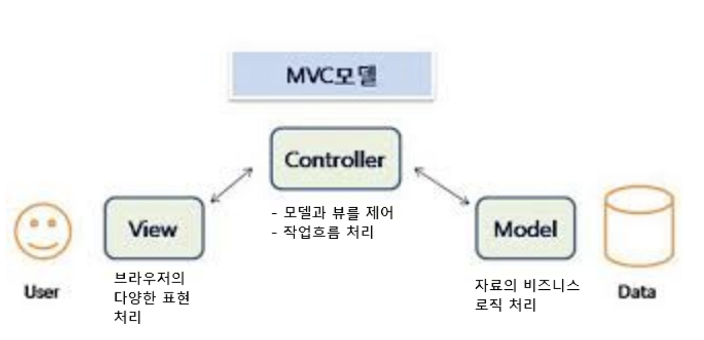


## MVC 개발

### JSP+JavaBeans 개발과 MVC 모델 구조

#### Model 1(JSP+JavaBeans)의 구조 

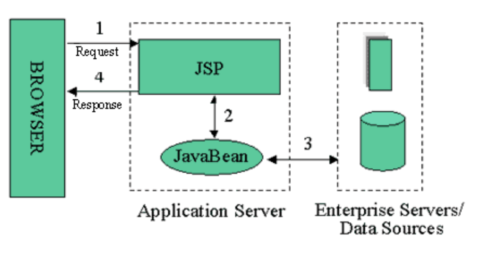


#### Model2(MVC) 구조

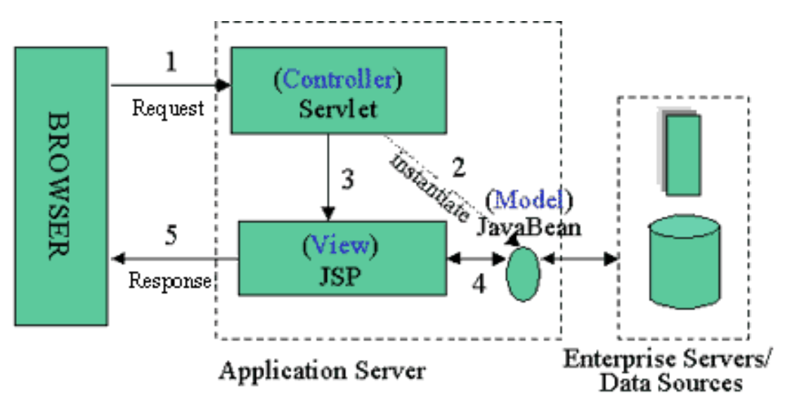


#### Controller의 처리순서

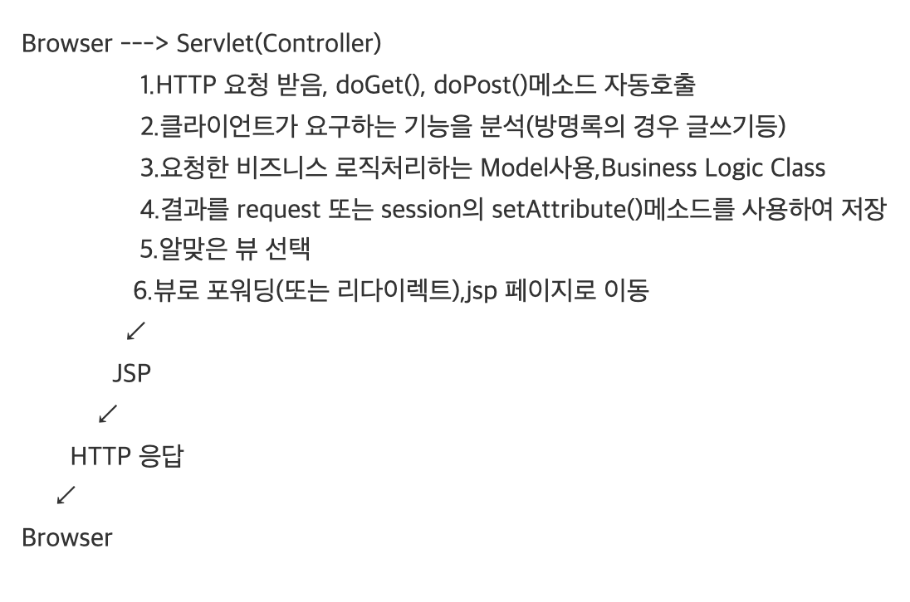


#### Command Pattern에 기반한 Controller의 처리순서 

 \- Command Handler 
  . Interface, 추상 클래스의 형태 
  . JSP Beans, EJB를 통해서 Command Handler를 구현한다. 

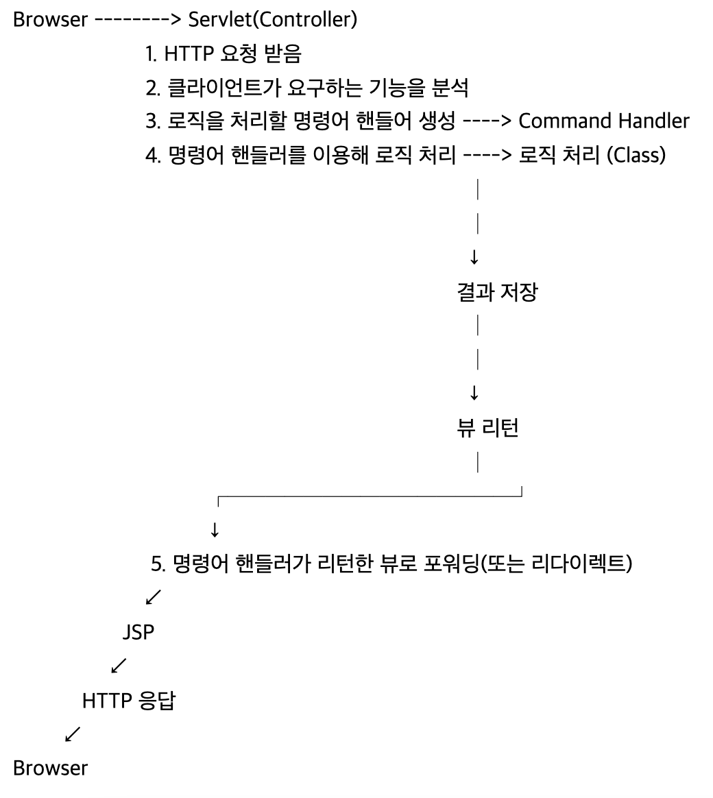


### MVC App 개발 순서

#### JSP + JavaBeans 개발 순서 


① DBMS 설정 
② DTO(Data Transfer Object) Class 제작 
③ DAO(Data Access Object) Class 제작 
④ Service Class 제작 
⑤ Service/DAO test 
⑥ JSP 생성 연동 


#### MVC Web Application 개발 순서 

① DBMS 설정 
② DTO(Data Transfer Object) Class 제작 
③ DAO(Data Access Object) Class 제작 
④ Service Class 제작 
⑤ Service/DAO test 
⑥ Servlet Controller 제작 
⑦ Action Interface 제작 
⑧ Action 구현 Class 제작 
    . Service Class 연동 

⑨ JSP 생성 연동 


## Properties class, String class, Class class

### Properties Class

 \- 키와 값의 구조를 가지고 있으며 특정 객체를 생성하는 경우에 초기값으로 많이 
  사용한다. 
 \- 상속 구조 
java.lang.Object 
  java.util.Dictionary<K,V> 
    java.util.Hashtable<Object,Object> 
      java.util.Properties<String,String> 


#### Properties 파일

\- STS Setting 
  . Project Type: Dynamic Web Project 
  .       Name: test


jdbc.properties

드라이버 뒤에 빈공간 없어야 함.

```properties
#---------------------------------- 
#  jdbc.properties 
#---------------------------------- 
driver=oracle.jdbc.pool.OracleDataSource
url=jdbc:oracle:thin:@오라클디비이름_high?전자지갑경로/
account=username
password=디비_비밀번호
```


#### properties 이용 클래스

> test/src/main/java/properties/PropertyTest.java 

```java
package properties; 

import java.io.File; 
import java.io.FileInputStream; 
import java.io.IOException; 
import java.sql.Connection; 
import java.sql.DriverManager; 
import java.sql.PreparedStatement; 
import java.sql.ResultSet; 
import java.util.Iterator; 
import java.util.Properties; 

public class PropertyTest { 

    public static void main(String[] args) { 
        Properties prop = new Properties(); 
         
        FileInputStream fis = null;   // 파일을 읽어 오는 역활을 합니다. 
        //  경로  산출 
        File file = new File("jdbc.properties"); 
        System.out.println("절대경로: " + file.getAbsoluteFile()); 
                
        try { 
            fis = new FileInputStream(file); 
            //속성 파일을 객체로 로딩, 키와 문자열 값으로 저장됩니다. 
            prop.load(fis); 
        } catch (IOException e) { 
            e.printStackTrace(); 
        } finally { 
            if (fis != null) try { fis.close(); } catch(IOException ex) {} 
        } 
         
        // properties 객체에서 키목록을 추출합니다. 
        // driver, url, account, password 
        Iterator keyIter = prop.keySet().iterator(); 
        while( keyIter.hasNext() ) { 
            String key = (String)keyIter.next();  //키 추출 
            String value = prop.getProperty(key); //키에 따른 값 추출 
            System.out.println(key + "=" + value); 
        } 
         
        Connection con = null; 
        PreparedStatement pstmt = null; 
        ResultSet rs = null; 
        String sql = ""; 
        String driver = ""; 
        String url = ""; 
        String account = ""; 
        String password=""; 
         
        driver = prop.getProperty("driver"); 
        url = prop.getProperty("url"); 
        account = prop.getProperty("account"); 
        password = prop.getProperty("password"); 

        try{ 
            Class.forName(driver); 
            con = DriverManager.getConnection(url, account, password); 
            sql = "SELECT count(*) cnt FROM tab"; 
            pstmt = con.prepareStatement(sql); 
            rs = pstmt.executeQuery(); 
            if (rs.next()){ 
                System.out.print(account + " 계정의 테이블 갯수: "); 
                System.out.println(rs.getInt("cnt")); 
            } 
        }catch(Exception e){ 
            System.out.println(e); 
        }         
    } 
} 
```


### 문자열 추출

> StringTest.java

```java
package properties; 

public class StringTest { 

    public static void main(String[] args) { 
        String mapping = "/mvc/hello.do"; 
         
        // 'hello.do' 문자열의 추출 
        System.out.println(mapping); 
        System.out.println("-----------------------"); 
        System.out.print(mapping.charAt(0));   // '/' 
        System.out.print(mapping.charAt(1));   // 'm' 
        System.out.print(mapping.charAt(2));   // 'v' 
        System.out.println(mapping.charAt(3)); // 'c' 
        System.out.println("-----------------------");         
        System.out.println("mapping.substring(5): " + mapping.substring(5)); 
        System.out.println("-----------------------");         
         
        // 문자열이 '/mvc'로 시작하는지 검사하여 boolean값 리턴 
        System.out.println("startsWith: " + mapping.startsWith("/mvc")); 

        // 문자열이 '/mvc'로 끝나는지 검사하여 boolean값 리턴 
        System.out.println("endsWith: " + mapping.endsWith("/hello.do"));         
         
        // 마지막으로 "/"문자가 나타난 index 값 리턴 
        int index = mapping.lastIndexOf("/"); 
        System.out.println("index: " + index); 
         
        System.out.println("substring(index+1): " + mapping.substring(index+1)); 
         
        System.out.println("substring(0, 3): " + mapping.substring(0, 3));   
         
    } 
} 
```

> StringTest2.java

```java
package properties; 

public class StringTest2 { 

    public static void main(String[] args) { 
         
        String str = "mail@domain.com"; 
     
        pl("ⓐ '@'문자가 있는지의 여부를 출력하는 루틴 제작"); 
        pl(str.indexOf('@'));      // 4 
        pl(str.indexOf('X'));      // 존재하지 않음으로 -1 
        pl(str.indexOf("domain")); // domain 문자열의 시작위치 5 
        pl(str.indexOf('.'));      // 11 
        pl(str.length());          // 15 
        pl(str.replaceAll("domain", "www.java")); // mail@www.java.com 

        for(int i=0; i < str.length(); i++){ 
            p(str.charAt(i)); 
        } 

    } 
     
    public static void pl(String str){ 
        System.out.println(str); 
    } 

    public static void pl(int i){ 
        System.out.println(i); 
    } 
     
    public static void p(char i){ 
        System.out.print(i); 
    }     
} 
```


### 실습 문제

▷ 콘솔상에서 파일명을 입력받아 파일명과 확장자를 추출하여 출력하는 프로그램을 작성하세요. 단, 잘못된 파일명(abc, .txt, abc.)을 입력했을때 오류메세지 출력후 다시 입력받아 처리 할 수 있도록 작성하세요

```java
package properties;

import java.util.Scanner;

public class Ex01 {

	public static void main(String[] args) {
		// InputStream i = System.in;
		// BufferedReader r = new BufferedReader(new InputStreamReader(i));
		// System.out.println("파일명을 입력하세요");
		// String file = r.readLine();

		Scanner r = new Scanner(System.in);
		System.out.println("파일명을 입력하세요");
		String file = r.nextLine();

		System.out.println(file);

		while (true) {
			// indexOf(), startsWith(), endsWith()
			if (file.indexOf('.') == -1 || file.startsWith(".") || file.endsWith(".")) {
				System.out.println("옳지 않은 파일명입니다.");
				System.out.println("파일명을 입력하세요");
				file = r.nextLine();

				System.out.println(file);
			} else {
				int idx = file.indexOf('.');
				String filename = file.substring(0, idx);
				System.out.println("파일명은 " + filename + "입니다.");

				String fileExtension = file.substring(idx + 1, file.length());
				System.out.println("파일명의 확장자는 " + fileExtension + "입니다.");
				break;
			}
		}
		r.close();
	}
}

```


> --- 실행 결과 --- 
>   파일명을 입력하세요.: abc.txt 
>
>   파일명은 abc 입니다. 
>   파일의 확장자는 txt 입니다. 
>
>
>   파일명을 입력하세요.: abc.html 
>
>   파일명은 abc 입니다. 
>   파일의 확장자는 html 입니다. 


### Class class

> classTest.java

실행

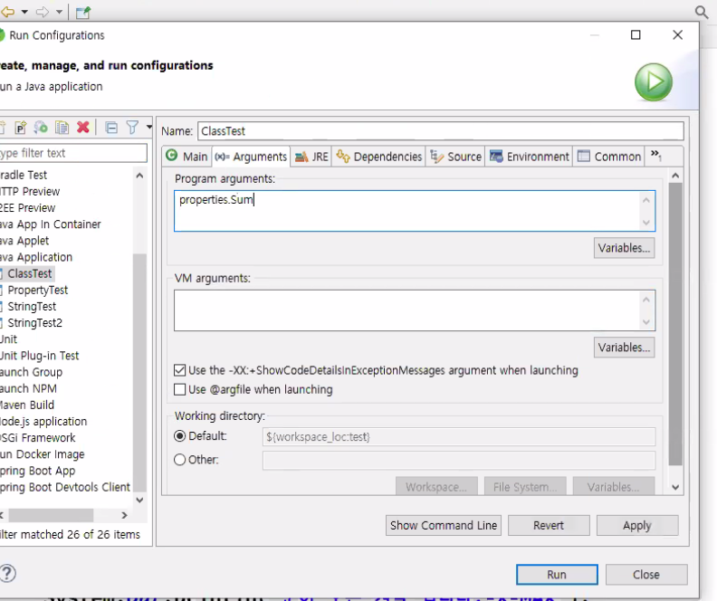

코드

```java
package properties;

interface Action {
	void execute();
}

class Spring implements Action {
	
	@Override
	public void execute() {
		System.out.println("따뜻한 봄 입니다. - 새싹");
	}
}

class Summer implements Action {
	
	@Override
	public void execute() {
		System.out.println("더운 여름입니다. - 바다");
	}
}

class Fall implements Action {
	
	@Override
	public void execute() {
		System.out.println("시원한 가을입니다. - 등산");
	}
}

class Winter implements Action {
	
	@Override
	public void execute() {
		System.out.println("눈이오는 겨울입니다. - X-MAS");
	}
}

public class ClassTest {

	public static void main(String[] args) {

		try {
			String className = args[0];
			Class object = Class.forName(className);
			Action instance = (Action) object.newInstance();
			instance.execute();
		} catch (Exception e) {
			// TODO Auto-generated catch block
			System.out.println(e);
		}
	}
}

```


> ClassTest2.java

```java
package properties;

import java.util.HashMap;
import java.util.Map;

public class ClassTest2 {

	public static void main(String[] args) {
		String className = args[0];
		Map map = new HashMap();
		Class object = null;
		Action instance = null;
		
		try {
			object = Class.forName("properties.Spring");
			instance = (Action)object.newInstance();
			
			map.put("Spring", instance);
			
			object = Class.forName("properties.Summer");
			instance = (Action)object.newInstance();
			
			map.put("Summer", instance);
			
			object = Class.forName("properties.Fall");
			instance = (Action)object.newInstance();
			
			map.put("Fall", instance);
			
			object = Class.forName("properties.Winter");
			instance = (Action)object.newInstance();
			
			map.put("Winter", instance);
			
			instance = (Action)map.get(className);
			instance.execute();
			
		} catch (Exception e) {
			// TODO Auto-generated catch block
			e.printStackTrace();
		}

	}

}
```


## request JSP 내부 객체


### request 객체에 객체 저장

\- mvc_test 프로젝트에서 작업

> request_test.jsp

```jsp
<%@ page language="java" contentType="text/html; charset=UTF-8" pageEncoding="UTF-8"%>
<!DOCTYPE html>
<html>
<head>
<meta charset="UTF-8">
<title>Insert title here</title>
</head>
<body>
<div style="font-size:xx-large; text-align: center;">
<% 
	request.setAttribute("name", "개발자"); 
	out.println("name: " + request.getAttribute("name") + "<br/>"); 
 
	request.setAttribute("count", 0); 
	out.println("count: " + request.getAttribute("count") + "<br/>"); 
 
	Object obj = request.getAttribute("count"); 
	int count = (Integer)obj; 
	count = count + 100; 
	
	request.setAttribute("count", count); 
 
	out.println("count: " + request.getAttribute("count") + "<br/>"); 
 
%> 
</div>
</body>
</html>
```


> 결과 확인

```
http://localhost:8000/test/request_test.jsp
```

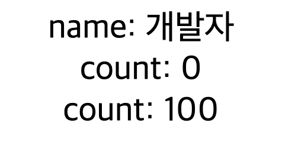


### 다른 페이지 요청

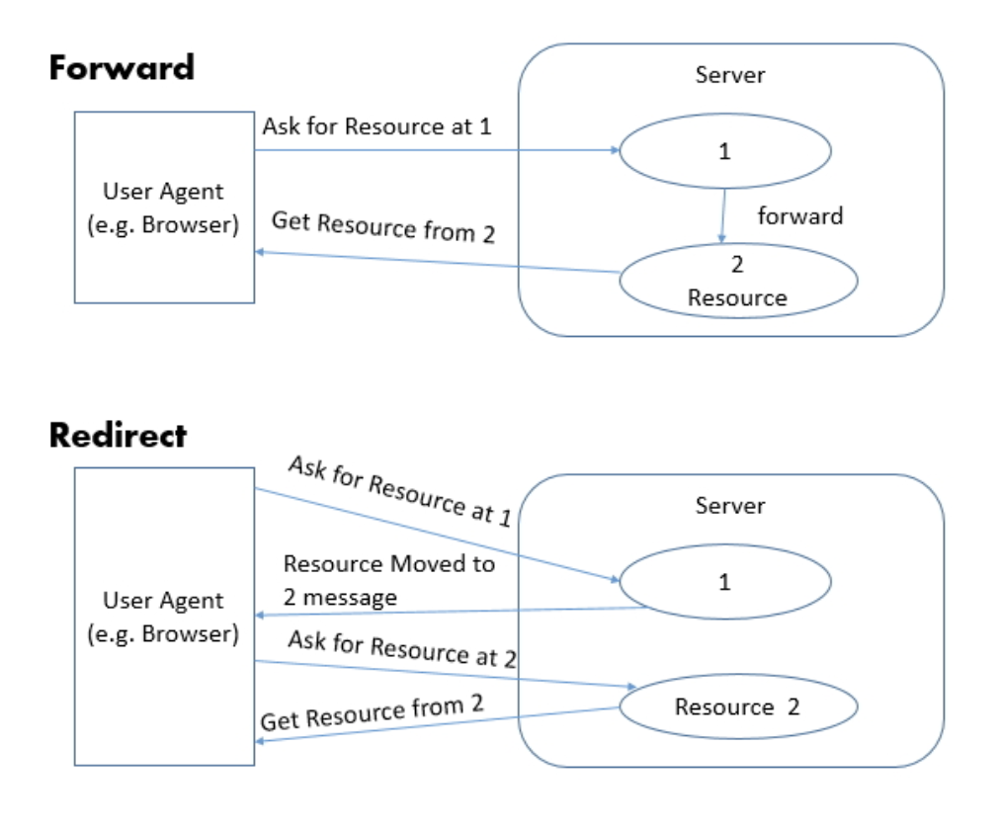

#### `<jsp:forward page="" />`

\- 기존요청에 대신 응답으로 다른페이지로 이동한다.
\- 기존의 request객체가 살아있으므로 그영역의 저장된 모든 데이터는
  유지된다.

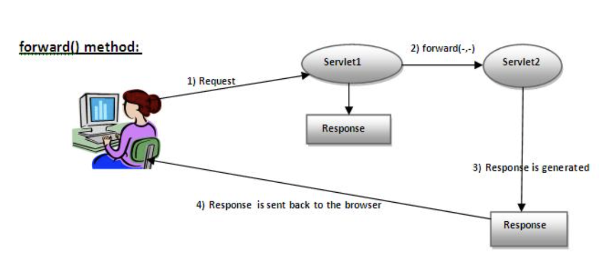

#### `response.sendRedirect( );`
 \-  재요청에 대한 응답으로  다른 페이지로 이동합니다.
 \-  새로운 request객체가 생성되므로  기존 request영역에 저장된 모든 데이터가 없어진다.

#### `<jsp:include page=""/>`
 \- 다른 자원을 요청 페이지에 포함시킨다.


> request.PageInfo.java

```java
package request;

public class PageInfo {
	private int nowPage = 0;
	private String searchColumn = "";
	private String searchWord = "";

	/**
	 * 기본 생성자
	 */
	public PageInfo() {
		super();
		// TODO Auto-generated constructor stub
	}

	/**
	 * @param nowPage
	 * @param searchColumn
	 * @param searchWord
	 */
	public PageInfo(int nowPage, String searchColumn, String searchWord) {
		super();
		this.nowPage = nowPage;
		this.searchColumn = searchColumn;
		this.searchWord = searchWord;
	}

	/**
	 * @return the nowPage
	 */
	public int getNowPage() {
		return nowPage;
	}

	/**
	 * @param nowPage the nowPage to set
	 */
	public void setNowPage(int nowPage) {
		this.nowPage = nowPage;
	}

	/**
	 * @return the searchColumn
	 */
	public String getSearchColumn() {
		return searchColumn;
	}

	/**
	 * @param searchColumn the searchColumn to set
	 */
	public void setSearchColumn(String searchColumn) {
		this.searchColumn = searchColumn;
	}

	/**
	 * @return the searchWord
	 */
	public String getSearchWord() {
		return searchWord;
	}

	/**
	 * @param searchWord the searchWord to set
	 */
	public void setSearchWord(String searchWord) {
		this.searchWord = searchWord;
	}
}
```


> webapp/request/pageinfo.jsp

```jsp
<%@ page language="java" contentType="text/html; charset=UTF-8" pageEncoding="UTF-8"%>
<%@ page import="request.*"%>
<!DOCTYPE html>
<html>
<head>
<meta charset="UTF-8">
<title>Insert title here</title>
</head>
<body>
<%
	PageInfo info = new PageInfo();
	info.setNowPage(1);
	info.setSearchColumn("title"); 
	info.setSearchWord("JSP");
	
	request.setAttribute("info", info);
	
	//response.sendRedirect("pageinfo2.jsp"); 
%>
<!-- 현재페이지 요청을 pageinfo2.jsp가 대신 응답된다.-->  
<jsp:forward page="/request/pageinfo2.jsp"/>
</body>
</html>
```


> webapp/request/pageinfo2.jsp

```jsp
<%@ page language="java" contentType="text/html; charset=UTF-8" pageEncoding="UTF-8"%>
<%@ page import="request.*"%>
<%
	PageInfo info = (PageInfo) request.getAttribute("info");
%>
<!DOCTYPE html>
<html>
<head>
<meta charset="UTF-8">
<title>Insert title here</title>
</head>
<body>
<div style="font-size: xx-large; text-align: center;"> 
<h2>  pageinfo2.jsp 입니다.</h2> 
    nowPage:      <%=info.getNowPage() %> <br/> 
    searchColumn: <%=info.getSearchColumn() %> <br/> 
    searchWord:   <%=info.getSearchWord() %> <br/> 
 
</div> 
</body>
</html>
```


> 결과 확인

```
http://localhost:8000/test/request/pageinfo.jsp
```


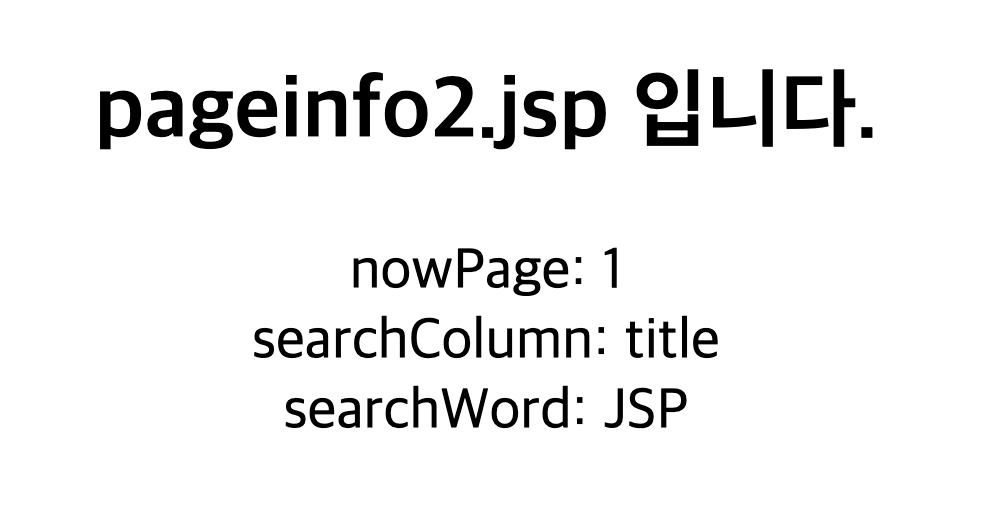


## MVC의 구현(Service, Action)

### 템플릿 기반의 URI Command Pattern에 기반한 MVC의 구현 
 \- URI상에 있는 주소를 얻어와 명령어로 처리하는 패턴입니다. 
 \- STS Setting 
  . Project Type: Dynamic Web Project 
  .       Name: mvc (web.xml 만들어지도록 선택하고 생성)

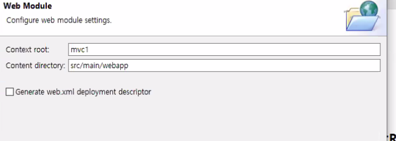

  . Package Name: action, controller, model

- 폴더 구조 
  mvc/src/main/webapp/view     : jsp 파일들 
  mvc/src/main/webapp/template  : template관련 파일들 
  mvc/src/main/webapp/WEB-INF  : web.xml 환경 설정 파일 위치 
  mvc/src/main/java                         : 서블릿 클래스 위치
  mvc/src/main/webapp/WEB-INF/config : properties 파일등, 기타 리소스 파일 
  mvc/src/main/webapp/WEB-INF/lib  : jar 파일의 라이브러리 위치, 자동 생성 


### Service Class

> CommandService.java

```java
package model;

import java.util.Date;

public class CommandService {

	public StringBuffer getHello() {
		StringBuffer sb = new StringBuffer();

		sb.append("<li> 안녕하세요..MVC 입니다.<br>");
		sb.append("<li> Template Page<br>");
		sb.append("<li> URI Command Pattern<br>");
		sb.append("<li> Properties 파일을 이용한 처리입니다.<br>");

		return sb;
	}

	public String getDate() {
		Date dt = new Date();
		String str = dt.toLocaleString();

		return str;
	}
}
```


### Command Handler 
 \- 인터페이스 또는 추상클래스로 구현.

 \- 비즈니스 로직 클래스(자식 클래스)들이 동일한 메소드를 실행 하도록 강제성 부여하며 표준 인터페이스 역할. 

> Action.java 

```java
package action;

import javax.servlet.http.HttpServletRequest;
import javax.servlet.http.HttpServletResponse;

public interface Action {
	public String execute(HttpServletRequest request, HttpServletResponse response) throws Throwable;

}
```


### Action Class 
\- Action Interface를 상속받아 구현 

> HelloAction.java

```java
package action;

import javax.servlet.http.HttpServletRequest;
import javax.servlet.http.HttpServletResponse;

import model.CommandService;

public class HelloAction implements Action {

	@Override
	public String execute(HttpServletRequest request, HttpServletResponse response) throws Throwable {
		// 1. 모델 사용 
		CommandService commandService = new CommandService();
		StringBuffer sb = commandService.getHello();
		// 2. 결과 저장 
		request.setAttribute("hello", sb);
		System.out.println("HelloAction Loading");

		// 3. 뷰 페이지 리턴 
		// Context Path을 제거한 경로 지정
		return "/view/hello.jsp";
	}

}
```


> DateAction.java

```java
package action;

import javax.servlet.http.HttpServletRequest;
import javax.servlet.http.HttpServletResponse;

import model.CommandService;

public class DateAction implements Action {

	@Override
	public String execute(HttpServletRequest request, HttpServletResponse response) throws Throwable {
		CommandService commandService= new CommandService(); 
        String str = commandService.getDate(); 
         
        // 가져온 날짜 문자열을 request 객체에 저장 
        request.setAttribute("date", str); 
        return "/view/date.jsp"; 
	}
}

```


> NullAction.java

```java
package action;

import javax.servlet.http.HttpServletRequest;
import javax.servlet.http.HttpServletResponse;

public class NullAction implements Action {

	@Override
	public String execute(HttpServletRequest request, HttpServletResponse response) throws Throwable {
		return "/view/nullCommand.jsp";
	}

}

```


## MVC의 구현(Controller, config, web.xml)


### Controller Servlet

\- 속성 파일 이용


> Controller.java
>
> new Servlet 으로 생성

```java
package controller;

import java.io.FileInputStream;
import java.io.IOException;
import java.util.Iterator;
import java.util.Map;
import java.util.Properties;

import javax.servlet.RequestDispatcher;
import javax.servlet.ServletConfig;
import javax.servlet.ServletException;
import javax.servlet.http.HttpServlet;
import javax.servlet.http.HttpServletRequest;
import javax.servlet.http.HttpServletResponse;

import action.Action;
import action.NullAction;

public class Controller extends HttpServlet {
	private boolean usingTemplate = false; // template 사용 여부 (계속 유지되는 top, bottom 부분 물어보는 것.)
	private String templatePage = null; // template 사용할 경우 template page 경로.
	private Map map = new java.util.HashMap();

	public void init(ServletConfig config) throws ServletException {
		// web.xml에서 configfile 파라메터값 읽어옴.
		String configFile = config.getInitParameter("configFile");
		Properties prop = new Properties();
		FileInputStream fis = null;

		try {
			fis = new FileInputStream(configFile);
			prop.load(fis);

		} catch (IOException e) {
			e.printStackTrace();
		} finally {
			if (fis != null)
				try {
					fis.close();
				} catch (IOException ex) {
				}
		}

		Iterator keyIter = prop.keySet().iterator();
		while (keyIter.hasNext()) {
			String command = (String) keyIter.next();
			String handlerClassName = prop.getProperty(command).trim();

			try {
				// 클래스를 JVM으로 로딩.
				Class handlerClass = Class.forName(handlerClassName);

				// 읽어들인 클래의 객체를 생성.
				Object handlerInstance = handlerClass.newInstance();

				// MAP에 키와 각 클래스별 객체가 저장.
				map.put(command, handlerInstance);

			} catch (ClassNotFoundException e) {
				e.printStackTrace();
			} catch (InstantiationException e) {
				e.printStackTrace();
			} catch (IllegalAccessException e) {
				e.printStackTrace();
			}
		} // while end

		// web.xml에서 templatePage 파라메터값 가져옴.
		templatePage = config.getInitParameter("templatePage");

		if (templatePage != null && !templatePage.equals("")) {
			usingTemplate = true; // 템플릿 페이지 존재
		}
	}

	protected void doGet(HttpServletRequest request, HttpServletResponse response)
			throws ServletException, IOException {
		process(request, response);
	}

	protected void doPost(HttpServletRequest request, HttpServletResponse response)
			throws ServletException, IOException {
		process(request, response);
	}

	private void process(HttpServletRequest request, HttpServletResponse response)
			throws ServletException, IOException {
		// 요청 분석 - 어떤 명령어인지 확인 /mvc/mvc/hello.do
		String command = request.getRequestURI();
		if (command.indexOf(request.getContextPath()) == 0) {
			command = command.substring(request.getContextPath().length());
		}
		
		Action action = (Action)map.get(command);
		
		if(action == null) {
			action = new NullAction();
		}
		
		String viewPage = null;
		
		try {
			viewPage = action.execute(request, response);
		} catch (Throwable e) {
			// TODO Auto-generated catch block
			e.printStackTrace();
		}
		
		if(usingTemplate) {
			request.setAttribute("CONTENT_PAGE", viewPage);
		}
		
		// jsp페이지로 포워드<jsp:forward page="대신 보여줄 페이지"/>
		
		// jsp페이지로 포워드
		RequestDispatcher dispatcher = request.getRequestDispatcher(usingTemplate ? templatePage : viewPage);
		dispatcher.forward(request, response);
		
	}
}

```


### /WEB-INF/config/config.properties 

\- #: 주석. 
\- *.do: 일반적으로 명령어에 확장자로 'do'를 사용.

> config.properties 

```properties
/mvc/hello.do=action.HelloAction
/mvc/date.do=action.DateAction
```


### /WEB-INF/web.xml 

  \- xml 선언문 앞에 공백이나 빈 문자가 있으면 안된다. 
  \- `<load-on-startup>`: Application 로딩시 자동으로 실행하라는 태그. 
  \- `<url-pattern></url-pattern>`
   . 폴더 매핑  : /mvc 
   . 폴더 매핑  : /mvc/* 
   . 확장자 매핑 : *.do 

> web.xml
>
> url mapping
>
> servlet mapping

```xml
<?xml version="1.0" encoding="UTF-8"?>
<web-app xmlns:xsi="http://www.w3.org/2001/XMLSchema-instance" xmlns="http://xmlns.jcp.org/xml/ns/javaee" xsi:schemaLocation="http://xmlns.jcp.org/xml/ns/javaee http://xmlns.jcp.org/xml/ns/javaee/web-app_4_0.xsd" id="WebApp_ID" version="4.0">
  <display-name>mvc</display-name>
  <welcome-file-list>
    <welcome-file>index.html</welcome-file>
    <welcome-file>index.htm</welcome-file>
    <welcome-file>index.jsp</welcome-file>
    <welcome-file>default.html</welcome-file>
    <welcome-file>default.htm</welcome-file>
    <welcome-file>default.jsp</welcome-file>
  </welcome-file-list>
  
  <servlet>
  	<servlet-name>Controller</servlet-name>
  	<servlet-class>controller.Controller</servlet-class>
  	<init-param>
  		<param-name>configFile</param-name>
        <param-value>/파일경로/config.properties</param-value>
	</init-param>
	<init-param>
  		<param-name>templatePage</param-name>
    	<param-value>/template/template.jsp</param-value>
    </init-param>
  </servlet>
  <servlet-mapping>
  	<servlet-name>Controller</servlet-name>
  	<url-pattern>*.do</url-pattern>
  </servlet-mapping>
</web-app>
```


## Jsp View

### webapp/view/hello.jsp 

```jsp
<%@ page language="java" contentType="text/html; charset=UTF-8"
    pageEncoding="UTF-8"%>
<!DOCTYPE html>
<html>
<head>
<meta charset="UTF-8">
<title>hello.jsp</title>
</head>
<body>
<div align="center"> 
<br>
<h1> 
<%= request.getAttribute("hello") %> 
</h1> 
</div> 
</body>
</html>
```


### webapp/view/date.jsp 

```jsp
<%@ page language="java" contentType="text/html; charset=UTF-8"
    pageEncoding="UTF-8"%>
<!DOCTYPE html>
<html>
<head>
<meta charset="UTF-8">
<title>date.jsp</title>
</head>
<body>
<div align="center"> 
<br>
<h1> 
<%= request.getAttribute("date") %> 
</h1> 
</div> 
</body>
</html>
```


### webapp/view/nullCommand.jsp 

```jsp
<%@ page language="java" contentType="text/html; charset=UTF-8"
    pageEncoding="UTF-8"%>
<!DOCTYPE html>
<html>
<head>
<meta charset="UTF-8">
<title>nullCommand.jsp</title>
</head>
<body>
<div align="center"> 
<br>
<h1> 
일치하는 명령어가 없습니다.<br> 
</h1> 
</div> 
</body>
</html>
```


### 테스트

```
http://127.0.0.1:8000/mvc/mvc/hello.do 
```

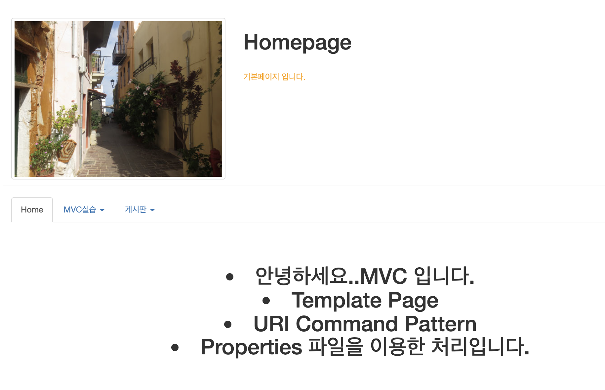

```
http://127.0.0.1:8000/mvc/mvc/date.do 
```

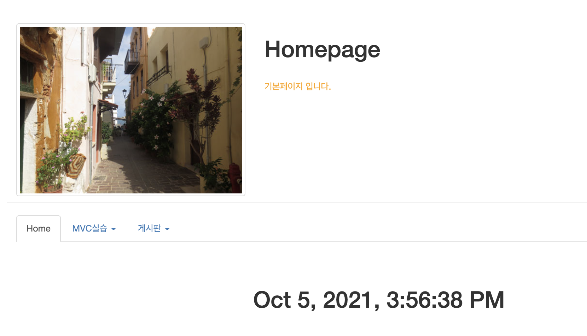

```
http://127.0.0.1:8000/mvc/mvc/hello2.do 
```

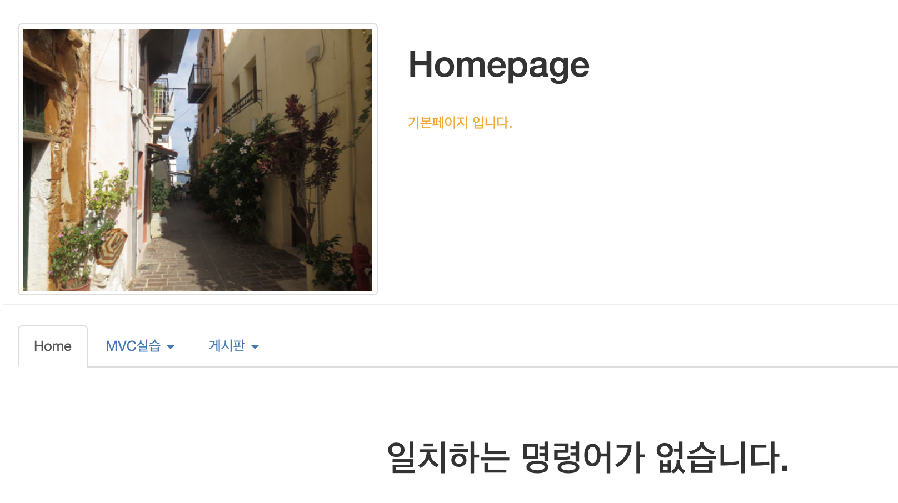


- 추가로 예제 진행해봄


> config.properties

```
/mvc/hello.do=action.HelloAction
/mvc/date.do=action.DateAction
/mvc/myinfo.do=action.MyinfoAction
```


MyinfoAction.java

```java
package action;

import javax.servlet.http.HttpServletRequest;
import javax.servlet.http.HttpServletResponse;

import model.CommandService;

public class MyinfoAction implements Action {

	@Override
	public String execute(HttpServletRequest request, HttpServletResponse response) throws Throwable {
		CommandService service = new CommandService();
		StringBuffer sb = service.getMyinfo();
				
		request.setAttribute("myinfo", sb);
		
		
		return "/view/myinfo.jsp"; // 보여 줄 viewpage return
	}

}
```


CommandService.java

```java
public StringBuffer getMyinfo() {
		StringBuffer sb = new StringBuffer();

		sb.append("<li> 이름 : 홍길동 <br>");
		sb.append("<li> 나이 : 30 <br>");
		sb.append("<li> 보유 기술 : Java, JSP, Spring <br>");
		sb.append("<li> 성격 : 호의적. <br>");

		return sb;
	}
```


/view/myinfo.jsp

```jsp
<%@ page language="java" contentType="text/html; charset=UTF-8"
    pageEncoding="UTF-8"%>
<!DOCTYPE html>
<html>
<head>
<meta charset="UTF-8">
<title>Insert title here</title>
</head>
<body>
<div align="center"> 
<br>
<h1> 
<%= request.getAttribute("myinfo") %> 
</h1> 
</div> 
</body>
</html>
```


> 실행 결과 확인

```
http://localhost:8000/mvc/mvc/myinfo.do
```

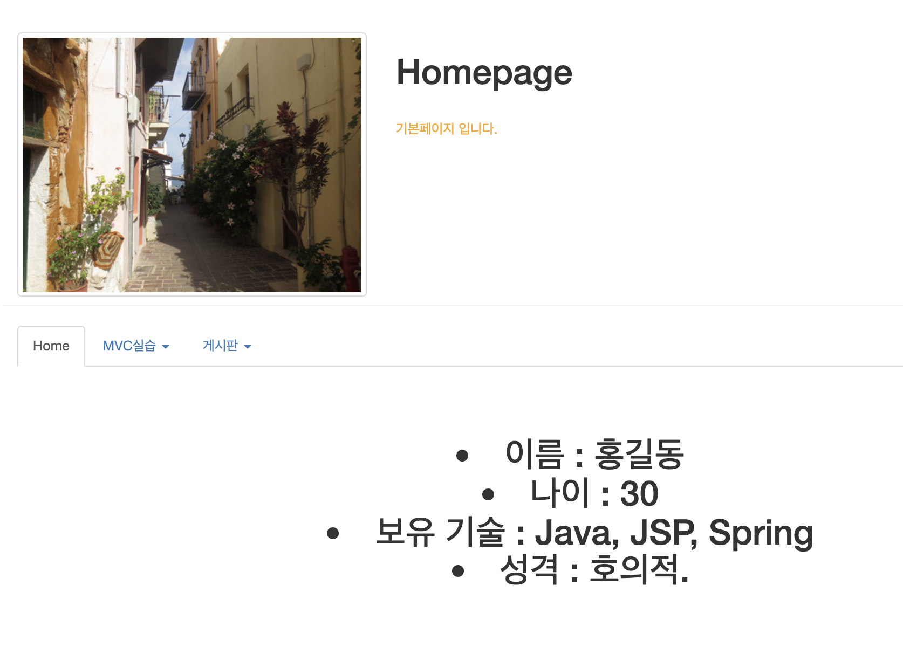


