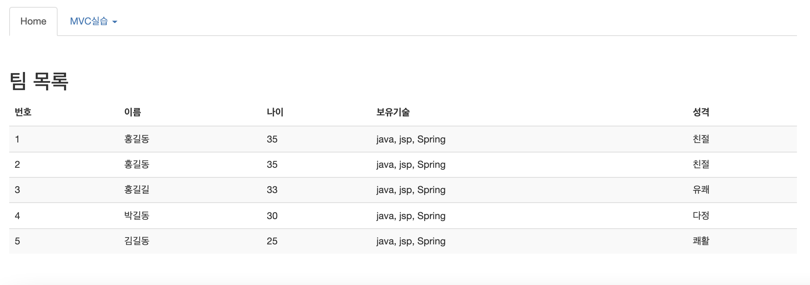

# Spring


실습하기

```
명령어 생성 -> configFile
Action 구현 클래스 생성
- 모델사용
- 결과 저장
- 뷰 리턴
CommandService에 getTeam() 생성
- 5사람의 정보를 각각 map에 저장 후 list에 담아서 return 
```


CommandService.java

getTeam(); 추가

```java
package model;

import java.util.*;

public class CommandService {

	public StringBuffer getHello() {
		StringBuffer sb = new StringBuffer();

		sb.append("<li> 안녕하세요..MVC 입니다.<br>");
		sb.append("<li> Template Page<br>");
		sb.append("<li> URI Command Pattern<br>");
		sb.append("<li> Properties 파일을 이용한 처리입니다.<br>");

		return sb;
	}

	public String getDate() {
		Date dt = new Date();
		String str = dt.toLocaleString();

		return str;
	}
	
	public StringBuffer getMyinfo() {
		StringBuffer sb = new StringBuffer();

		sb.append("<li> 이름 : 홍길동 <br>");
		sb.append("<li> 나이 : 30 <br>");
		sb.append("<li> 보유 기술 : Java, JSP, Spring <br>");
		sb.append("<li> 성격 : 호의적. <br>");

		return sb;
	}
	
	public List<Map> getTeam() {
		List<Map> list = new ArrayList<Map>();
		Map map = new HashMap();
		map.put("name", "홍길동");
		map.put("age", "35");
		map.put("skills", "java, jsp, Spring");
		map.put("personal", "친절");
		
		list.add(map);
		
		map = new HashMap();
		map.put("name", "홍길동");
		map.put("age", "35");
		map.put("skills", "java, jsp, Spring");
		map.put("personal", "친절");
		
		list.add(map);
		
		map = new HashMap();
		map.put("name", "홍길길");
		map.put("age", "33");
		map.put("skills", "java, jsp, Spring");
		map.put("personal", "유쾌");
		
		list.add(map);
		
		map = new HashMap();
		map.put("name", "박길동");
		map.put("age", "30");
		map.put("skills", "java, jsp, Spring");
		map.put("personal", "다정");
		
		list.add(map);
		
		map = new HashMap();
		map.put("name", "김길동");
		map.put("age", "25");
		map.put("skills", "java, jsp, Spring");
		map.put("personal", "쾌활");
		
		list.add(map);

		return list;
	}
}
```


TeamAction.java

```java
package action;

import javax.servlet.http.HttpServletRequest;
import javax.servlet.http.HttpServletResponse;
import java.util.*;

import model.CommandService;

public class TeamAction implements Action {

	@Override
	public String execute(HttpServletRequest request, HttpServletResponse responae) throws Throwable {
		CommandService service = new CommandService();
		List<Map> list = service.getTeam();
		
		request.setAttribute("team", list);
		
		return "/view/team.jsp";
	}

}
```


```
http://localhost:8000/mvc/mvc/team.do
```





## MVC 기반의 게시판 구현 
 \- URI상에 있는 주소를 얻어와 명령어로 처리하는 패턴 


###  Web Application 설정   
 \- STS Setting 
  Project  Type: Dynamic Web Project 
  Project  Name: mvc_bbs
  Package Name: model, controller, action, utility 

\- 폴더 구조 
  mvc_bbs/src/main/webapp/view    : 게시판 관련 jsp 파일 
  mvc_bbs/src/main/webapp/template : template 관련 파일들 
  mvc_bbs/src/main/webapp/WEB-INF      : web.xml 환경 설정 파일 위치 
  mvc_bbs/src/main/java          : 서블릿 클래스 위치
  mvc_bbs/src/main/webapp/WEB-INF/config : properties 파일등, 기타 리소스 파일 
  mvc_bbs/src/main/webapp/WEB-INF/lib    : jar 파일의 라이브러리 위치 


### JSP+beans에서 사용한 게시판을 MVC모델로 변경
\- STS에서 jsp 프로젝트 webtest(bbs)를 import하여 사용.
\- File -> import -> General -> Existing Projects into Workspace 

-> Select root directory Browse 선택

-> web\workspace\webtest(bbs) 선택 

(1) Model 만들기
 \- webtest bbs package -> mvc_bbs의 model package로 복사 
 \- BbsDTO.java, BbsDAO.java

(2) Utility 클래스
 \- webtest utility package -> mvc_bbs utility package 로 복사
 \- paging 메소드의 list.jsp -> list.do로 변경한다.

paging 함수 내용 

```java
public static String paging(int totalRecord, int nowPage, int recordPerPage, String col, String word) {
		int pagePerBlock = 5; // 블럭당 페이지 수
		int totalPage = (int) (Math.ceil((double) totalRecord / recordPerPage)); // 전체 페이지
		int totalGrp = (int) (Math.ceil((double) totalPage / pagePerBlock));// 전체 그룹
		int nowGrp = (int) (Math.ceil((double) nowPage / pagePerBlock)); // 현재 그룹
		int startPage = ((nowGrp - 1) * pagePerBlock) + 1; // 특정 그룹의 페이지 목록 시작
		int endPage = (nowGrp * pagePerBlock); // 특정 그룹의 페이지 목록 종료

		StringBuffer str = new StringBuffer();
		str.append("<div style='text-align:center'>");
		str.append("<ul class='pagination'> ");
		int _nowPage = (nowGrp - 1) * pagePerBlock; // 10개 이전 페이지로 이동
		if (nowGrp >= 2) {
			str.append(
					"<li><a href='./list.do?col=" + col + "&word=" + word + "&nowPage=" + _nowPage + "'>이전</A></li>");
		}

		for (int i = startPage; i <= endPage; i++) {
			if (i > totalPage) {
				break;
			}

			if (nowPage == i) {
				str.append("<li class='active'><a href=#>" + i + "</a></li>");
			} else {
				str.append("<li><a href='./list.do?col=" + col + "&word=" + word + "&nowPage=" + i + "'>" + i
						+ "</A></li>");
			}
		}

		_nowPage = (nowGrp * pagePerBlock) + 1; // 10개 다음 페이지로 이동
		if (nowGrp < totalGrp) {
			str.append(
					"<li><A href='./list.do?col=" + col + "&word=" + word + "&nowPage=" + _nowPage + "'>다음</A></li>");
		}
		str.append("</ul>");
		str.append("</div>");

		return str.toString();
	}
```


(3) jsp 페이지
\- webtest/WebContent/bbs  -> mvc_bbs/src/main/webapp/view 로 복사
\- webtest/WebContent/menu -> mvc_bbs/src/main/webapp/template 로 복사
\- webtest/WebContent/index.jsp -> mvc_bbs/src/main/webapp/index.jsp 로 복사


### Action interface, NullAction Class, NullCommand.jsp


Action.java

```java
package action;

import javax.servlet.http.HttpServletRequest;
import javax.servlet.http.HttpServletResponse;

public interface Action {
	String execute(HttpServletRequest request, 
			HttpServletResponse responae) throws Throwable;
}
```


NullAction.java

```java
package action;

import javax.servlet.http.HttpServletRequest;
import javax.servlet.http.HttpServletResponse;

public class NullAction implements Action {

	@Override
	public String execute(HttpServletRequest request, HttpServletResponse responae) throws Throwable {
		// TODO Auto-generated method stub
		return "/view/nullCommand.jsp";
	}

}
```


nullCommand.jsp

```jsp
<%@ page language="java" contentType="text/html; charset=UTF-8"
    pageEncoding="UTF-8"%>
<!DOCTYPE html>
<html>
<head>
<meta charset="UTF-8">
<title>Insert title here</title>
</head>
<body>
<div align="center">
<h1>
일치하는 명령어가 없습니다.
</h1>
</div>
</body>
</html>
```


### Controller Servlet


Controller.java

```java
package controller;

import java.io.FileInputStream;
import java.io.IOException;
import java.util.HashMap;
import java.util.Iterator;
import java.util.Map;
import java.util.Properties;

import javax.servlet.RequestDispatcher;
import javax.servlet.ServletConfig;
import javax.servlet.ServletException;
import javax.servlet.http.HttpServlet;
import javax.servlet.http.HttpServletRequest;
import javax.servlet.http.HttpServletResponse;

import action.Action;
import action.NullAction;

public class Controller extends HttpServlet {
	private boolean usingTemplate = false; //template 사용여부
	private String templatePage = null; //templatepage경로
	private Map map = new HashMap(); //URI명령어 = Action
	
	public void init(ServletConfig config) throws ServletException {
		//web.xml에서 configFile 파라메터값 가져온다.
		String configFile = config.getInitParameter("configFile");
		Properties prop = new Properties();
		FileInputStream fis = null;
		
		try {
			fis = new FileInputStream(configFile);
			prop.load(fis);
			
		} catch (IOException e) {
			// TODO Auto-generated catch block
			e.printStackTrace();
		} finally {
			if(fis != null) try {fis.close();} catch(IOException ex) {}
		}
		
		Iterator keyIter = prop.keySet().iterator();
		while(keyIter.hasNext()) {
			String command = (String)keyIter.next();
			String handlerClassName = prop.getProperty(command);
			
			try {
				Class handlerClass = Class.forName(handlerClassName);
				Object handlerInstance = handlerClass.newInstance();
				
				map.put(command, handlerInstance);
				
				
			} catch (ClassNotFoundException e) {
				// TODO Auto-generated catch block
				e.printStackTrace();
			} catch (InstantiationException e) {
				// TODO Auto-generated catch block
				e.printStackTrace();
			} catch (IllegalAccessException e) {
				// TODO Auto-generated catch block
				e.printStackTrace();
			}
			
		}//while end
		//web.xml에서 templatPage 파라메터값 가져온다.
		templatePage = config.getInitParameter("templatePage");
		if(templatePage != null && !templatePage.equals("")) {
			usingTemplate = true;
		}
		
	}


	protected void doGet(HttpServletRequest request, HttpServletResponse response) throws ServletException, IOException {
		process(request,response);
	}

	
	protected void doPost(HttpServletRequest request, HttpServletResponse response) throws ServletException, IOException {
		process(request,response);
	}


	private void process(HttpServletRequest request, HttpServletResponse response) throws ServletException, IOException {
		//요청분석-어떤명령어인지 확인 /mvc/mvc/hello.do
		String command = request.getRequestURI();
		if(command.indexOf(request.getContextPath())==0) {
			command = command.substring(request.getContextPath().length());
		}
		
		Action action = (Action)map.get(command);
		
		if(action == null) {
			action = new NullAction();
		}
		
		String viewPage = null;
		
		try {
			viewPage = action.execute(request, response); //model사용,결과저장,view리턴
		} catch (Throwable e) {
			// TODO Auto-generated catch block
			e.printStackTrace();
		}
		
		if(usingTemplate) { //template페이지 내용부분에 사용
			request.setAttribute("CONTENT_PAGE", viewPage);
		}
		
		//jsp페이지로 포워드<jsp:forward page="hello.jsp"/>
		//RequestDispatcher dispatcher = request.getRequestDispatcher("template.jsp")
		//
		RequestDispatcher dispatcher = request.getRequestDispatcher(
				usingTemplate ? templatePage : viewPage);
		dispatcher.forward(request, response);
		
	}

}

```


### 명령어, 핸들러 클래스의 매핑 정보 저장 

config.properties

```properties
/bbs/list.do=action.ListAction
/bbs/create.do=action.CreateAction
/bbs/createProc.do=action.CreateProcAction
/bbs/read.do=action.ReadAction
```


web.xml

```xml
<?xml version="1.0" encoding="UTF-8"?>
<web-app xmlns:xsi="http://www.w3.org/2001/XMLSchema-instance" xmlns="http://xmlns.jcp.org/xml/ns/javaee" xsi:schemaLocation="http://xmlns.jcp.org/xml/ns/javaee http://xmlns.jcp.org/xml/ns/javaee/web-app_4_0.xsd" id="WebApp_ID" version="4.0">
  <display-name>mvc</display-name>
  <welcome-file-list>
    <welcome-file>index.html</welcome-file>
    <welcome-file>index.htm</welcome-file>
    <welcome-file>index.jsp</welcome-file>
    <welcome-file>default.html</welcome-file>
    <welcome-file>default.htm</welcome-file>
    <welcome-file>default.jsp</welcome-file>
  </welcome-file-list>
  
  <servlet>
  	<servlet-name>Controller</servlet-name>
  	<servlet-class>controller.Controller</servlet-class>
  	<init-param>
  		<param-name>configFile</param-name>
        <param-value>/Users/jules/Study/AIstudy/spring/workspace/mvc_bbs/src/main/webapp/WEB-INF/config/config.properties</param-value>
	</init-param>
	<init-param>
  		<param-name>templatePage</param-name>
    	<param-value>/template/template.jsp</param-value>
    </init-param>
  </servlet>
  <servlet-mapping>
  	<servlet-name>Controller</servlet-name>
  	<url-pattern>*.do</url-pattern>
  </servlet-mapping>
</web-app>
```


### jsp

* 복사해 온 파일들에서 .jsp 로 써있는 부분들 .do 로 바꿔줌

* ex) createForm.jsp 에서 

  ```jsp
  <form class="form-horizontal" 
        action="createProc.do"
        method="post">
  ```

  

list.jsp

```jsp
<%@ page contentType="text/html; charset=UTF-8" %> 
<%@ page import="java.util.*,model.*,utility.*" %>
<%
	List<BbsDTO> list = (List<BbsDTO>)request.getAttribute("list");
	String paging = (String)request.getAttribute("paging");
	String col = (String)request.getAttribute("col");
	String word = (String)request.getAttribute("word");
	int nowPage = (int)request.getAttribute("nowPage");
%>
<!DOCTYPE html> 
<html> 
<head>
  <title>homepage</title>
  <meta charset="utf-8">
  
  <script>
  function read(bbsno){
	  let url = "read.do";
	  url += "?bbsno="+bbsno;
	  url += "&col=<%=col%>";
	  url += "&word=<%=word%>";
	  url += "&nowPage=<%=nowPage%>";
	  
	  location.href=url;
  }
  </script>
</head>
<body> 
<div class="container">
<h1>게시판 목록</h1>
<form class='form-inline' action='list.do'>
	<div class='form-group'>
		<select class="form-control" name='col'>
			<option value="wname" 
			<% if(col.equals("wname")) out.print("selected");%>
			>성명</option>
			<option value="title"
			<% if(col.equals("title")) out.print("selected");%>
			>제목</option>
			<option value="content"
			<% if(col.equals("content")) out.print("selected");%>
			>내용</option>
			<option value="title_content"
			<% if(col.equals("title_content")) out.print("selected");%>
			>제목+내용</option>
			<option value='total'
			<% if(col.equals("total")) out.print("selected");%>
			>전체출력</option>
		</select>
	</div>
	<div class='form-group'>
		<input type='search' name="word"  value = "<%=word%>" class="form-control" placeholder='검색어를 입력하세요'>
	</div>
	<button class='btn'>검색</button>
	<button type='button' class='btn' onclick="location.href='createForm.jsp'">등록</button>
</form>
<table class='table table-striped'>
<thead>
	<tr>
		<th>번호</th>
		<th>제목</th>
		<th>작성자</th>
		<th>grpno</th>
		<th>indent</th>
		<th>ansnum</th>
	</tr>
</thead>

<tbody>
   <%if(list.size()==0){ %>
     <tr><td colspan='6'>등록된 글이 없습니다.</td></tr>
    <%
    }else{
    	for(int i=0; i<list.size(); i++) {
    		BbsDTO dto = list.get(i);
    %>
		 <tr>
			<td><%=dto.getBbsno() %></td>
			<td>
			<%
			for(int r=0; r<dto.getIndent(); r++){
				out.print("&nbsp;&nbsp;");
			}
			if(dto.getIndent() > 0 ){
				out.print("");
			}
			%>
			<a href="javascript:read('<%=dto.getBbsno() %>')"><%=dto.getTitle() %></a>
			<% if(Utility.compareDay(dto.getWdate())){ %>
			
			<%} %>
			</td>
			<td><%=dto.getWname() %></td>
			<td><%=dto.getGrpno() %></td>
			<td><%=dto.getIndent() %></td>
			<td><%=dto.getAnsnum() %></td>
		 </tr>
	<% 
	   }//forend
     } //ifend
    %>
</tbody>
</table>
 <%=paging %>
</div>
</body> 
</html> 
```


top.jsp

```jsp
<%@ page contentType="text/html; charset=UTF-8" %> 
<%  request.setCharacterEncoding("utf-8"); 
 
String root = request.getContextPath();
 
%> 
<!DOCTYPE html> 
<html> 
<head>
  <title>memo</title>
  <meta charset="utf-8">
  <meta name="viewport" content="width=device-width, initial-scale=1">
  <link rel="stylesheet" href="https://maxcdn.bootstrapcdn.com/bootstrap/3.4.0/css/bootstrap.min.css">
  <script src="https://ajax.googleapis.com/ajax/libs/jquery/3.3.1/jquery.min.js"></script>
  <script src="https://maxcdn.bootstrapcdn.com/bootstrap/3.4.0/js/bootstrap.min.js"></script>
  <style type="text/css">
  #grade{
  
   color : orange;
  }  
  </style>
</head>
<body> 
<!--상단메뉴-->
<div class="container">
 
  <div class="page-header row">
   <div class="col-sm-4">
    /template/images/img_chania.jpg" class="img-responsive img-thumbnail" alt="Cinque Terre" >
   </div>
   <div class="col-sm-8"><h1>Homepage</h1><br>
    
   <p id="grade">기본페이지 입니다.</p> 
   
   </div>     
  </div>
  <ul class="nav nav-tabs">
    <li class="active"><a href="<%=root%>/index.jsp">Home</a></li>
    <li class="dropdown">
      <a class="dropdown-toggle" data-toggle="dropdown" href="#">MVC실습 <span class="caret"></span></a>
      <ul class="dropdown-menu">
        <li><a href="<%=root%>/mvc/hello.do">인삿말</a></li>
        <li><a href="<%=root%>/mvc/date.do">오늘의 날짜</a></li>                       
        <li><a href="<%=root%>/mvc/myinfo.do">나의 정보</a></li>      
        <li><a href="<%=root%>/mvc/team.do">팀 목록</a></li>                  
      </ul>
    </li>  
    <li class="dropdown">
      <a class="dropdown-toggle" data-toggle="dropdown" href="#">게시판 <span class="caret"></span></a>
      <ul class="dropdown-menu">
        <li><a href="<%=root %>/bbs/list.do">게시판 목록</a></li>
        <li><a href="<%=root %>/bbs/create.do">게시판 생성</a></li>
      </ul>
    </li>  
  </ul>
</div>
</body>
</html>
```


- create

update, delete 도 유사한 방식.

createAction.java

```java
package action;

import javax.servlet.http.HttpServletRequest;
import javax.servlet.http.HttpServletResponse;

public class CreateAction implements Action {

	@Override
	public String execute(HttpServletRequest request, HttpServletResponse responae) throws Throwable {
		// TODO Auto-generated method stub
		return "/view/createForm.jsp";
	}

}

```


createFrom.jsp

```jsp
<%@ page contentType="text/html; charset=UTF-8" %> 
 
<!DOCTYPE html> 
<html> 
<head>
  <title>homepage</title>
  <meta charset="utf-8">
</head>
<body> 

<div class="container">
<h1 class="col-sm-offset-2 col-sm-10">게시판 생성</h1>
<form class="form-horizontal" 
      action="createProc.do"
      method="post">

  <div class="form-group">
    <label class="control-label col-sm-2" for="wname">작성자</label>
    <div class="col-sm-6">
      <input type="text" name="wname" id="wname" class="form-control">
    </div>
  </div>
  
  <div class="form-group">
    <label class="control-label col-sm-2" for="title">제목</label>
    <div class="col-sm-8">
      <input type="text" name="title" id="title" class="form-control">
    </div>
  </div>
  
  <div class="form-group">
    <label class="control-label col-sm-2" for="content">내용</label>
    <div class="col-sm-8">
    <textarea rows="12" cols="7" id="content" name="content" class="form-control"></textarea>
    </div>
  </div>
  
  <div class="form-group">
    <label class="control-label col-sm-2" for="passwd">비밀번호</label>
    <div class="col-sm-8">
      <input type="password" name="passwd" id="passwd" class="form-control">
    </div>
  </div>

   <div class="form-group">
   <div class="col-sm-offset-2 col-sm-5">
    <button class="btn">등록</button>
    <button type="reset" class="btn">취소</button>
   </div>
 </div>
</form>
</div>
</body> 
</html> 
```


CreateProcAction.java

```java
package action;

import javax.servlet.http.HttpServletRequest;
import javax.servlet.http.HttpServletResponse;

import model.BbsDAO;
import model.BbsDTO;

public class CreateProcAction implements Action {

	@Override
	public String execute(HttpServletRequest request, HttpServletResponse responae) throws Throwable {
		BbsDAO dao = new BbsDAO();
		BbsDTO dto = new BbsDTO();
		request.setCharacterEncoding("utf-8");
		dto.setWname(request.getParameter("wname"));
		dto.setTitle(request.getParameter("title"));
		dto.setContent(request.getParameter("content"));
		dto.setPasswd(request.getParameter("passwd"));

		boolean flag = dao.create(dto);
		request.setAttribute("flag", flag);
		
		return "/view/createProc.jsp";
	}

}
```


createProc.jsp

```jsp
<%@ page contentType="text/html; charset=UTF-8"%>
<%
	boolean flag = (boolean)request.getAttribute("flag");
%>
<!DOCTYPE html>
<html>
<head>
<title>게시판 생성</title>
<meta charset="utf-8">
</head>
<body>
	<div class="container">
		<div class="well well-lg">
			<%
			if (flag) {
				out.print("글 등록 성공입니다.");
			} else {
				out.print("글 등록 실패입니다.");
			}
			%>
		</div>
		<button class="btn" onclick="location.href='create.do'">다시 등록</button>
		<button class="btn" onclick="location.href='list.do'">목록</button>
	</div>
</body>
</html>

```


- mvc_memo 실습

1. 첫 시작은 top.jsp에서 시작
/memo/list.do
/memo/create.do
가 제일 먼저 필요하기 때문에 config.properties에서 명령어 선언
2. 선언된 Action들 각각 작성
항상 return을 표시할 jsp페이지로 작성하고
각각의 jsp 페이지 수정
3. jsp 페이지의 <~ action= > 태그 확인
~Proc.jsp를 ~Proc.do로 수정하고 다시 config.properties에서 명령어 선언
4. list와 create가 끝나면 list.jsp 수정
read.jsp를 read.do로 수정하고 config.properties에서 명령어 선언
Action 작성 , jsp 수정
5. read.jsp로부터 delete update reply 반복


