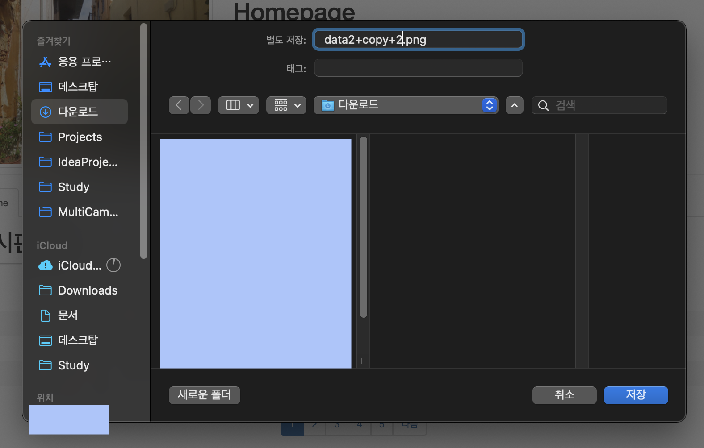
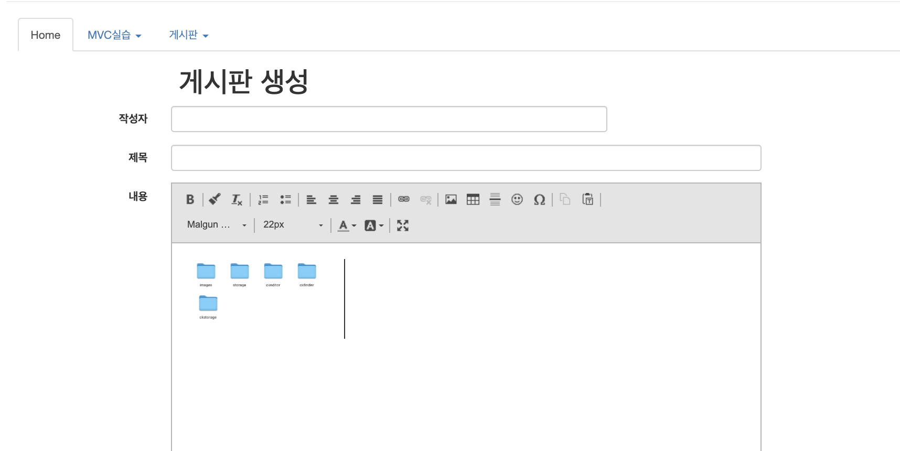
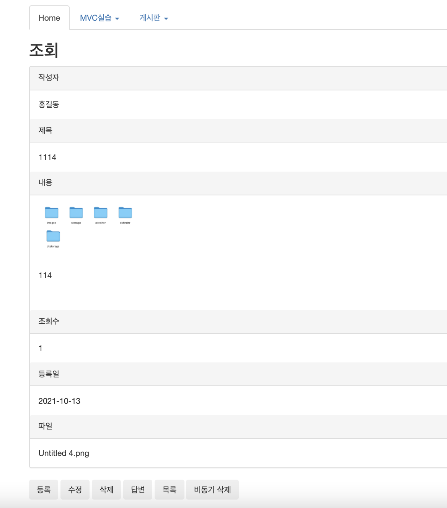

# SpringBoot


## Ajax 사용을 위한 데이터 변환


### 1. @ResponseBody, @RequestBody 사용

- Front와 backend사이에 데이터 전송을 

  JSON형식으로 변환하여 전달 하기 위해 사용.


### 2. Spring boot bbs에서 삭제처리시 데이터변환 실습

#### (1) 데이터 변환 라이브러리 설치

> build.gradle
>
> 다음 코드 추가

```
	// https://mvnrepository.com/artifact/org.json/json
    implementation group: 'org.json', name: 'json', version: '20201115'
```


#### (2) jQuery Ajax 통신을 위한 자바스크립트 라이브러리 설치

- 부트스트렙을 사용하면 자동으로 라이브러리 제공한다.
- top.jsp에서 선언되었기때문에 그냥 사용할 수 있다.

```jsp
<script src="https://ajax.googleapis.com/ajax/libs/jquery/3.5.1/jquery.min.js"></script>
```


#### (3) 테스트할 delete_Ajax.jsp 생성

- Ajax 통신을 위한 코드 존재

```jsp
<%@ page contentType="text/html; charset=UTF-8" %>
<%@ taglib prefix="c" uri="http://java.sun.com/jsp/jstl/core"%> 
<!DOCTYPE html> 
<html> 
<head>
  <title>homepage</title>
  <meta charset="utf-8">
  <style>
   #red{
    color:red;
   }
  </style>
  <script>
  $(function(){
      $('#btn1').on('click',function(){
         let form = {
			bbsno : $('#bbsno').val(),
			filename : $('#oldfile').val(),
			passwd : $('#passwd').val()
			}
            alert(form.bbsno + "" + form.passwd);
            //비공기 통신
		$.ajax({
			url: "./delete_Ajax",
			type: "POST",
			data: JSON.stringify(form),
			contentType: "application/json; charset=utf-8;",
			dataType: "json",
			success: function(data){      
              $('#red').text('');
              $('#red').text(data.str);
          },
		error: function(request,status,error){
			alert("code = "+ request.status + " message = " + request.responseText + " error = " + error); // 실패 시 처리
			}                    
        });// ajax end
      });     // click 이벤트설정 end
	}); //페이지로딩 end
  </script>
</head>
<body> 
<div class="container">
<h1 class="col-sm-offset-2 col-sm-10">삭제</h1>
 <input type="hidden" name='bbsno' id="bbsno" value='${param.bbsno}'>
 <input type="hidden" name='col' value='${param.col}'>
 <input type="hidden" name='word' value='${param.word}'>
 <input type="hidden" name='nowPage' value='${param.nowPage}'>
 <input type="hidden" name='oldfile' id="oldfile"  value='${param.oldfile}'>
  <div class="form-group">
    <label class="control-label col-sm-2" for="passwd">비밀번호</label>
    <div class="col-sm-6">
      <input type="password" name="passwd" id="passwd" class="form-control">
    </div>
  </div>
  
  <p id='red' class="col-sm-offset-2 col-sm-6">삭제하면 복구할 수 없습니다.</p>
  
   <div class="form-group">
   <div class="col-sm-offset-2 col-sm-5">
    <button class="btn" id="btn1">삭제</button>
    <button type="reset" class="btn">취소</button>
   </div>
 </div>
</div>
</body> 
</html> 
```


#### (4) views/read.jsp

> read.jsp에 delete_Ajax.jsp 확인을 위한 버튼

```jsp
<button class='btn' onclick="delete_Ajax()">비동기 삭제</button>
```


> read.jsp에 delete_Ajax.jsp 확인을 위한 버튼 + 함수 추가
> 버튼 클릭 후 실행하는 javascript delete_Ajax() 작성한다.


```jsp
<script>
  	function delete_Ajax(){
  		let url = "delete_Ajax";
  		url += '?bbsno=${dto.bbsno}';
  		url += "&oldfile=${dto.filename}"; 
  		url += "&col=${param.col}";
  		url += "&word=${param.word}";
  		url += "&nowPage=${param.nowPage}";
  		
  		location.href=url;
  	}
</script>
```


#### (5) tiles.xml

```xml
<definition name="/bbs/delete_Ajax" extends="main">
    <put-attribute name="title" value="비동기 삭제"></put-attribute>
    <put-attribute name="body"
      value="/WEB-INF/views/delete_Ajax.jsp" />
  </definition>
```


#### (6) @ResponseBody, @RequestBody 사용

- BbsController에 비동기 삭제처리를 위한 delete_Ajax() 메소드 생성
- @RequestBody : frontend 전달하는 JSON형태의 데이터를 문자열 형태로 변환해서 backend에서는 BbsDTO로 받는다.
- @ResponseBody : Controller에서 데이터 처리후 자바객체의 값을 JSON형태로 변환해서 리턴한다.

> BbsConteroller.java

```java
@GetMapping("/bbs/delete_Ajax")
	public String delete_Ajax() {
		return "/bbs/delete_Ajax";
	}

	@PostMapping(value = "/bbs/delete_Ajax", produces = "application/json;charset=UTF-8")
	@ResponseBody
	public Map<String, String> delete_Ajax(@RequestBody BbsDTO dto, HttpServletRequest request) throws IOException {
		boolean cflag = false;
		int cnt = mapper.checkRefnum(dto.getBbsno());
		if (cnt > 0)
			cflag = true;
		String upDir = new ClassPathResource("/static/storage").getFile().getAbsolutePath();
		Map map = new HashMap();
		map.put("bbsno", dto.getBbsno());
		map.put("passwd", dto.getPasswd());

		boolean pflag = false;
		boolean flag = false;

		if (!cflag) {
			int cnt2 = mapper.passCheck(map);
			if (cnt2 > 0)
				pflag = true;
		}
		if (pflag) {
			if (dto.getFilename() != null)
				Utility.deleteFile(upDir, dto.getFilename());
			int cnt3 = mapper.delete(dto.getBbsno());
			if (cnt3 > 0)
				flag = true;
		}

		Map<String, String> map2 = new HashMap<String, String>();

		if (cflag) {
			map2.put("str", "답변있는 글이므로 삭제할 수 없습니다");
			map2.put("color", "blue");
		} else if (!pflag) {
			map2.put("str", "패스워드가 잘못입력되었습니다");
			map2.put("color", "blue");
		} else if (flag) {
			map2.put("str", "삭제 처리되었습니다");
			map2.put("color", "blue");
		} else {
			map2.put("str", "삭제중 에러가 발생했습니다");
			map2.put("color", "blue");
		}

		return map2;
	}
```


## 업로드된 파일 다운로드 구현


### 1. 목록, 조회 페이지에서 다운로드 링크 만들기

> list.jsp
>
> script/fileDown 함수 추가

```jsp
  <script>
  function fileDown(filename){
      var url = "./fileDown";
      url += "?filename="+filename;
      url += "&dir=/static/storage";
      
      location.href=url;
   }
  </script>
```

> filename 부분 수정

```jsp
<td>
		<c:choose>
			<c:when test="${empty dto.filename}">파일없음</c:when>
			<c:otherwise> 
				<a href="javascript:fileDown('${dto.filename}')">
					${dto.filename}
				</a>
			</c:otherwise>
		</c:choose>
</td>
```


### 2. 다운로드 요청URL을 받는 Controller의 메소드 제작

> BbsController
>
> fileDown GetMapping 함수 추가

```java
	@GetMapping("/bbs/fileDown")
	public void fileDown(HttpServletRequest request, HttpServletResponse response) throws IOException {

		// 저장 폴더를 절대 경로로 변환
		String dir = new ClassPathResource("/static/storage").getFile().getAbsolutePath();
		// 파일명 받기
		String filename = request.getParameter("filename");
		byte[] files = FileUtils.readFileToByteArray(new File(dir, filename));
		response.setHeader("Content-disposition",
				"attachment; fileName=\"" + URLEncoder.encode(filename, "UTF-8") + "\";");
		// Content-Transfer-Encoding : 전송 데이타의 body를 인코딩한 방법을 표시함.
		response.setHeader("Content-Transfer-Encoding", "binary");
		/**
		 * Content-Disposition가 attachment와 함게 설정되었다면 'Save As'로 파일을 제안하는지 여부에 따라 브라우저가
		 * 실행한다.
		 */
		response.setContentType("application/octet-stream");
		response.setContentLength(files.length);
		response.getOutputStream().write(files);
		response.getOutputStream().flush();
		response.getOutputStream().close();
	}
```


### 3. 다운로드 실행





## 블로그 형 게시판의 제작 - 웹에디터 CKEditor와 CKFinder 함께 사용하기


### 1. 'ckeditor' 다운로드

```
https://ckeditor.com/ckeditor-4/
```

- preset: Full, 언어 한국어 추가하고 datadown으로 다운로드

- '/spring_bbs/resources/static'로 'ckeditor' 폴더 복사


## 2. ckfinder 다운로드

Java -> previous 버전 -> 자바 2.6.3 버전으로 다운로드

-  다운로드한 'ckfinder_java_2.6.3.zip' 압축 해제

- 해제 후 ckfinder/CKFinderJava-2.6.3.war 압축해제

- war파일 압축푼 폴더 안 ckfinder 폴더 이동 

- 'CKFinderJava-2.6.3/ckfinder' 폴더를 '**/src/main/resources/static**'로 복사

- 복사할 jar 파일들

  CKFinderJava-2.6.3/ckfinder/WEB-INF/lib/

  ```
  'CKFinder-2.6.3.jar',
  'CKFinderPlugin-FileEditor-2.6.3.jar',
  'CKFinderPlugin-ImageResize-2.6.3.jar',
  'thumbnailator-0.4.8.jar' 
  ```


### 3. ckfinder/CKFinderJava-2.6.3/WEB-INF/config.xml 이동

- '/CKFinderJava-2.5.0/WEB-INF/config.xml'을 ckfinder-config.xml로 변경 후 '**/spring_bbs/main/webapp/WEB-INF/ckfinder-config.xml**' 로 이동


### 4. 파일 저장용 폴더 생성

 \- '/src/main/resources/static/ckstorage'를 생성


### 5. ckfinder 파일업로드 웹어플리케이션 경로 설정

- '/WEB-INF/ckfinder-config.xml' 
- 상단 enabled, baseDir, baseURL 태그를 아래처럼 수정한다.

```xml
	<enabled>true</enabled>
	<!--
	Configure the location of uploaded files. See the following article for more details:
	http://docs.cksource.com/CKFinder_2.x/Developers_Guide/Java/Configuration/baseURL_and_baseDir
	-->
	<baseDir>/Users/jules/Study/AIstudy/spring/workspace/spring_bbs/bin/main/static/ckstorage</baseDir>
	<baseURL>/ckstorage</baseURL>
	<licenseKey></licenseKey>
	<licenseName></licenseName>
```


### 6.  spring_bbs에서 확인


### 7. 'ckeditor/config.js' 설정하기

> ckeditor/config.js

```js
CKEDITOR.editorConfig = function( config ) {
// Define changes to default configuration here. For example:
// config.language = 'fr';
// config.uiColor = '#AADC6E';
config.height = 600;
//config.uiColor = '#9AB8F3';
config.uiColor = '#D3D3D3';
config.enterMode = CKEDITOR.ENTER_BR; //엔터키 태그 1:<p>, 2:<br>, 3:<div>
config.font_defaultLabel = 'Malgun Gothic'; //기본글씨
config.font_names = '굴림체/Gulim;돋움체/Dotum;맑은 고딕/Malgun Gothic;';
config.fontSize_defaultLabel = '22px';
config.fontSize_sizes = '14/14px;18/18px;22/22px;24/24px;28/28px;36/36px;48/48px;72/72px;';
config.toolbar = [
{ name: 'basicstyles', items: [ 'Bold', 'Underline', 'Subscript', 'Superscript', '-', 'CopyFormatting', 'RemoveFormat' ] },
{ name: 'paragraph', items: [ 'NumberedList', 'BulletedList', '-', 'JustifyLeft', 'JustifyCenter', 'JustifyRight', 'JustifyBlock' ] },
{ name: 'links', items: [ 'Link', 'Unlink' ] },
{ name: 'insert', items: [ 'Image', 'Table', 'HorizontalRule', 'Smiley', 'SpecialChar' ] },
{ name: 'clipboard', items: ['Copy', 'PasteText'] },
{ name: 'styles', items: ['Font', 'FontSize' ] },
{ name: 'colors', items: [ 'TextColor', 'BGColor' ] },
{ name: 'tools', items: [ 'Maximize' ] },
];
// Remove some buttons provided by the standard plugins, which are
// not needed in the Standard(s) toolbar.
config.removeButtons = 'Underline,Subscript,Superscript';
// Set the most common block elements.
config.format_tags = 'p;h1;h2;h3;pre';
// Simplify the dialog windows.
config.removeDialogTabs = 'image:advanced;link:advanced';
config.filebrowserBrowseUrl = "../ckfinder/ckfinder.html";
config.filebrowserFlashBrowseUrl = "../ckfinder/ckfinder.html?type=Flash";
config.filebrowserUploadUrl = "../ckfinder/core/connector/java/connctor.java?command=QuickUpload&type=Files";
config.filebrowserImageUploadUrl = "../ckfinder/core/connector/java/connector.java?command=QuickUpload&type=Images";
config.filebrowserFlashUploadUrl = "../ckfinder/core/connector/java/connector.java?command=QuickUpload&type=Flash";
};
```


### 8. View 파일 수정


#### (1) createForm.jsp

- checkIn 함수 : 글 필수 입력 체크

```jsp
<script type="text/javascript" src="${pageContext.request.contextPath}/ckeditor/ckeditor.js"></script>
<script type="text/JavaScript">
 $(function() {
         CKEDITOR.replace('content'); // <TEXTAREA>태그 id 값
   });

	function checkIn(f) {
		if (f.wname.value == "") {
			alert("글쓴이를 입력하세요");
			f.wname.focus();
			return false;
		}
		if (f.title.value == "") {
			alert("제목를 입력하세요");
			f.title.focus();
			return false;
		}
		if (CKEDITOR.instances['content'].getData() == '') {
			window.alert('내용을 입력해 주세요.');
			CKEDITOR.instances['content'].focus();
			return false;
		}
		if (f.passwd.value == "") {
			alert("패스워드를 입력하세요");
			f.passwd.focus();
			return false;
		}
	}
</script>
```

- content textarea 태그에 `id="content"` 추가

```jsp
<div class="form-group">
				<label class="control-label col-sm-2" for="content">내용</label>
				<div class="col-sm-8">
					<textarea rows="12" cols="7" id="content" name="content"
						class="form-control"></textarea>
				</div>
			</div>
```


#### (2) updateForm.jsp

```jsp
  <script type="text/javascript" src="${pageContext.request.contextPath}/ckeditor/ckeditor.js"></script>
<script type="text/JavaScript">
 $(function() {
         CKEDITOR.replace('content'); // <TEXTAREA>태그 id 값
   });
 </script>
```

- content textarea 태그에 `id="content"` 추가

```jsp
<div class="form-group">
    <label class="control-label col-sm-2" for="content">내용</label>
    <div class="col-sm-8">
    <textarea rows="12" cols="7" id="content" name="content" class="form-control">${dto.content}</textarea>
    </div>
  </div>
```


#### (3) read.jsp

```jsp
<div class="panel-heading">내용</div>
      <div class="panel-body" style="height: 200px">${dto.content}</div>
```


\+ replyFrom.jsp에도 createForm.jsp처럼 함수 추가


### 9. Spring Boot에 서블릿의 등록 

> com.study.bbs;
>
> ServletRegister.java

```java
package com.study.bbs;
 
import java.util.HashMap;
import java.util.Map;
import javax.servlet.http.HttpServlet;
import org.springframework.boot.web.servlet.ServletRegistrationBean;
import org.springframework.context.annotation.Bean;
import org.springframework.context.annotation.Configuration;
import com.ckfinder.connector.ConnectorServlet;
 
@Configuration
public class ServletRegister {
  //CKEditor 서블릿 등록
  @Bean
  public ServletRegistrationBean<HttpServlet> getConnectorServlet() {
    ServletRegistrationBean<HttpServlet> registrationBean = new ServletRegistrationBean<HttpServlet>(
        new ConnectorServlet());
    registrationBean.addUrlMappings("/ckfinder/core/connector/java/connector.java"); // 접근 주소
    Map<String, String> params = new HashMap<String, String>();
    params.put("XMLConfig", "/WEB-INF/ckfinder-config.xml");
    params.put("debug", "false");
    registrationBean.setInitParameters(params);
    registrationBean.setLoadOnStartup(1);
    return registrationBean;
  }
}
```


### 10. 결과

글에 이미지 첨부






*Fin.🐧*

