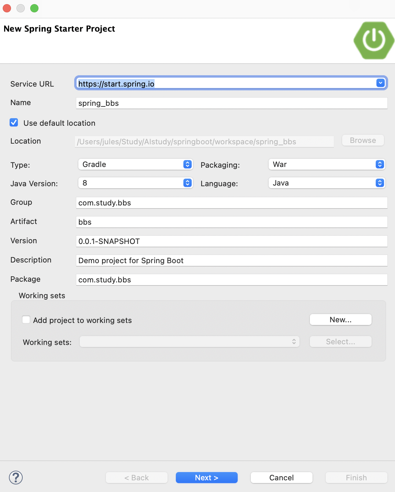
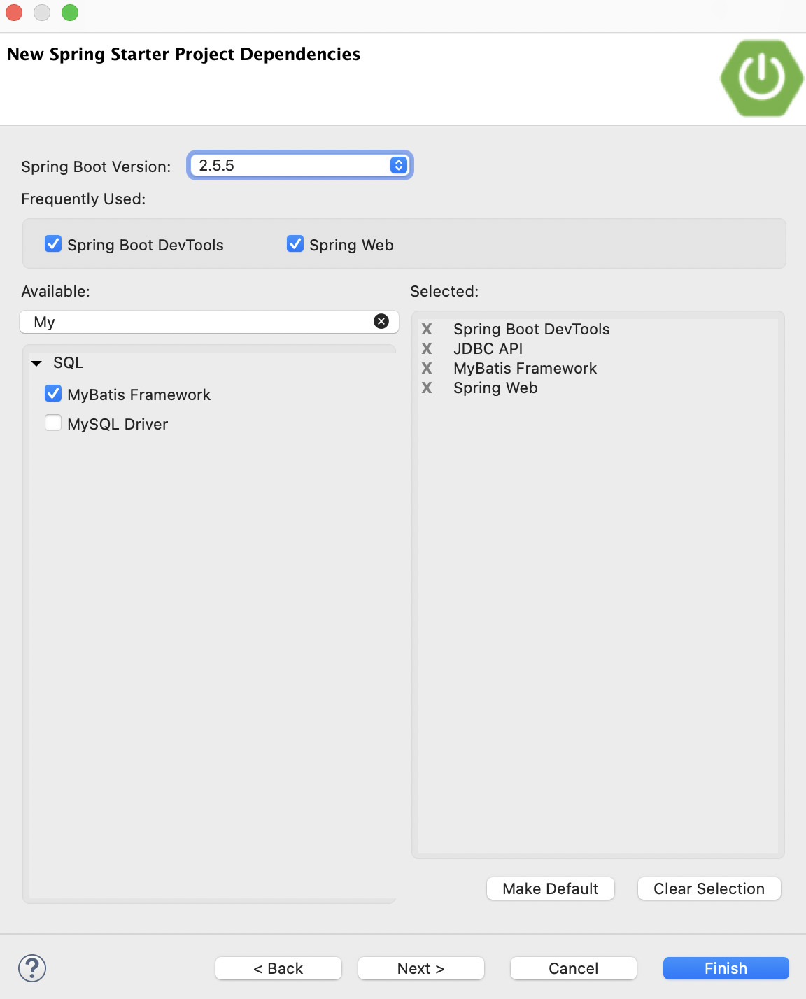

# Springboot


## Spring Boot bbs 만들기

bbs 실습


### 1. Spring Starter Project 실행






### 2. build.gradle, application.properties 설정

- jsp 사용을 위한 의존성 추가

- Annotation기반 Form검증 validation 의존성 추가

  -> Gradle -> Refresh Gradle Project

> build.gradle 편집 (추가)

```
  implementation 'javax.servlet:jstl'  
  implementation 'org.apache.tomcat.embed:tomcat-embed-jasper'  
  implementation 'org.springframework.boot:spring-boot-starter-validation' 
```


- 서버포트 변경
- JSP view path
- oracle 설정, Conntion pool 설정


> application.properties

```properties
server.port = 8000
# JSP View path
spring.mvc.view.prefix=/WEB-INF/views/
spring.mvc.view.suffix=.jsp

# DEVTOOLS (DevToolsProperties)
spring.devtools.livereload.enabled=true

# Oracle
spring.datasource.hikari.driver-class-name=oracle.jdbc.pool.OracleDataSource
spring.datasource.hikari.jdbc-url: jdbc:oracle:thin:@orcldb_high?TNS_ADMIN=/전자지갑경로
spring.datasource.hikari.username=admin
spring.datasource.hikari.password=디비_비밀번호

# All DBMS
spring.datasource.hikari.maximum-pool-size=10
spring.datasource.hikari.minimum-idle=5
spring.datasource.hikari.connection-timeout=5000
```


### 3. Component scan 패키지 설정

> SpringBbsApplication.java

```java
package com.study.bbs;

import org.springframework.boot.SpringApplication;
import org.springframework.boot.autoconfigure.SpringBootApplication;
import org.springframework.context.annotation.ComponentScan;

@SpringBootApplication
@ComponentScan(basePackages= {"com.study.*"})
public class SpringBbsApplication {

	public static void main(String[] args) {
		SpringApplication.run(SpringBbsApplication.class, args);
	}

}
```


### 4. JSP Views, images 폴더 생성

#### (1) jsp views

- /src/main/폴더에 webapp/WEB-INF/views 생성

#### (2) images 
- /src/main/resources/static 폴더에 images 생성


### 5. Mybatis 설정

#### (1) DatabaseConfiguration 클래스 생성

- @PropertySource("classpath:/application.properties")는 이 클래스에서 application.properties를 사용
- Hikari를 사용한 datasource를 생성하기 위한 메소드 선언
- 설정 파일의 접두사 선언 spring.datasource.hikari....
- spring mybatis에서 필요한 SqlSessionFactory와 SqlSessionTemplate를 생성 하기 위한 메소드 선언
- /src/main/resources/mybatis 폴더의 파일명이 "xml"로 끝나는 파일 매핑
- MapperScan의 basePackages 선언

> DatabaseConfiguration.java

```java
package com.study.bbs;
 
import javax.sql.DataSource;
 
import org.apache.ibatis.session.SqlSessionFactory;
import org.mybatis.spring.SqlSessionFactoryBean;
import org.mybatis.spring.SqlSessionTemplate;
import org.mybatis.spring.annotation.MapperScan;
import org.springframework.beans.factory.annotation.Autowired;
import org.springframework.boot.context.properties.ConfigurationProperties;
import org.springframework.context.ApplicationContext;
import org.springframework.context.annotation.Bean;
import org.springframework.context.annotation.Configuration;
import org.springframework.context.annotation.PropertySource;
 
import com.zaxxer.hikari.HikariConfig;
import com.zaxxer.hikari.HikariDataSource;
 
@Configuration
@PropertySource("classpath:/application.properties")  // 설정 파일 위치
@MapperScan(basePackages= {"com.study.model"})
public class DatabaseConfiguration {
  @Autowired
  private ApplicationContext applicationContext;
  
  @Bean
  @ConfigurationProperties(prefix="spring.datasource.hikari") // 설정 파일의 접두사 선언 
  public HikariConfig hikariConfig() {
      return new HikariConfig();
  }
  
  @Bean
  public DataSource dataSource() throws Exception{
      DataSource dataSource = new HikariDataSource(hikariConfig());
      System.out.println(dataSource.toString());  // 정상적으로 연결 되었는지 해시코드로 확인
      return dataSource;
  }
  
  @Bean
  public SqlSessionFactory sqlSessionFactory(DataSource dataSource) throws Exception{
      SqlSessionFactoryBean sqlSessionFactoryBean = new SqlSessionFactoryBean();
      sqlSessionFactoryBean.setDataSource(dataSource);
      sqlSessionFactoryBean.setMapperLocations(applicationContext.getResources("classpath:/mybatis/**/*.xml"));   
      return sqlSessionFactoryBean.getObject();
  }
  
  @Bean
  public SqlSessionTemplate sqlSessionTemplate(SqlSessionFactory sqlSessionFactory){
      return new SqlSessionTemplate(sqlSessionFactory);
  }
}
```


#### (2) oracle설정 JUnit 테스트

- Oracle Driver 인식이 불규칙하면 WEB-INF/lib/ojdbc8.jar로 저장한다.
- /src/main/resources/mybatis 폴더 생성
- /src/test/java 폴더에 테스트 기초 파일이 생성되어 있음
- SqlSessionTemplate 객체 값 확인을 위해서 아래내용 작성
- 테스트 실행: SpringBbsApplicationTests.java 파일 선택 -> Debug as -> JUnit test

> /src/test/java
>
> SpringBbsApplicationTests.java

```java
package com.study.bbs;

import org.junit.jupiter.api.Test;
import org.mybatis.spring.SqlSessionTemplate;
import org.springframework.beans.factory.annotation.Autowired;
import org.springframework.boot.test.context.SpringBootTest;

@SpringBootTest
class SpringBbsApplicationTests {
	@Autowired
	private SqlSessionTemplate sqlsession;

	@Test
	void contextLoads() {
	}
	
	@Test
	public void testSqlSession() throws Exception{
		System.out.println(sqlsession.toString());
	}

}

```


실행 결과

```
-----------------------------------------------------
 .   ____          _            __ _ _
 /\\ / ___'_ __ _ _(_)_ __  __ _ \ \ \ \
( ( )\___ | '_ | '_| | '_ \/ _` | \ \ \ \
 \\/  ___)| |_)| | | | | || (_| |  ) ) ) )
  '  |____| .__|_| |_|_| |_\__, | / / / /
 =========|_|==============|___/=/_/_/_/
 :: Spring Boot ::                (v2.4.3)
 
------------------
HikariDataSource (HikariPool-1)
------------------
org.mybatis.spring.SqlSessionTemplate@2dd3d39d
-----------------
```


## bbs, tiles 설정 및 template 사용, index.jsp


### 1. tiles 설정

#### (1) build.gradle 편집

Gradle -> Refresh Gradle Project

> build.gradle

```
// https://mvnrepository.com/artifact/org.apache.tiles/tiles-jsp
implementation group: 'org.apache.tiles', name: 'tiles-jsp', version: '3.0.8'
```


#### (2) TilesConfiguration 클래스 생성
- TilesViewResolver 생성 및 layout xml 위치 지정

> TilesConfiguration.java

```java
package com.study.bbs;
 
import org.springframework.context.annotation.Bean;
import org.springframework.context.annotation.Configuration;
import org.springframework.web.servlet.view.tiles3.TilesConfigurer;
import org.springframework.web.servlet.view.tiles3.TilesView;
import org.springframework.web.servlet.view.tiles3.TilesViewResolver;
 
@Configuration
public class TilesConfiguration {
  @Bean
  public TilesConfigurer tilesConfigurer() {
      final TilesConfigurer configurer = new TilesConfigurer();
      //해당 경로에 tiles.xml 파일을 넣음
      configurer.setDefinitions(new String[]{"classpath:/tiles/tiles.xml"});
      configurer.setCheckRefresh(true);
      return configurer;
  }
 
  @Bean
  public TilesViewResolver tilesViewResolver() {
      final TilesViewResolver tilesViewResolver = new TilesViewResolver();
      tilesViewResolver.setViewClass(TilesView.class);
      return tilesViewResolver;
  }
}
```


#### (3) layout 설정 파일 생성

- /src/main/resources/tiles/tiles.xml
- mvc_bbs의 template폴더 및 index.jsp를 /WEB-INF/views/로 복사함
- template/images/ 내용을 static/images/로 복사한다.
- 내용 수정

> tiles.xml

```xml
<?xml version="1.0" encoding="UTF-8" ?>
<!DOCTYPE tiles-definitions PUBLIC
       "-//Apache Software Foundation//DTD Tiles Configuration 3.0//EN"
       "http://tiles.apache.org/dtds/tiles-config_3_0.dtd">
 
<tiles-definitions>
  <!-- main -->
  <definition name="main"
    template="/WEB-INF/views/template/template.jsp">
    <put-attribute name="header"
      value="/WEB-INF/views/template/top.jsp" />
  </definition>
  <definition name="/home" extends="main">
    <put-attribute name="title" value="기본페이지"></put-attribute>
    <put-attribute name="body"
      value="/WEB-INF/views/index.jsp" />
  </definition>
  <definition name="/bbs/create" extends="main">
    <put-attribute name="title" value="게시판 생성"></put-attribute>
    <put-attribute name="body"
      value="/WEB-INF/views/createForm.jsp" />
  </definition>
 
</tiles-definitions>
```


> /WEB-INF/views/templates/template.jsp 

```jsp
<%@ page contentType="text/html; charset=UTF-8" %>
<%@ taglib prefix="tiles"  uri="http://tiles.apache.org/tags-tiles"%>
<!DOCTYPE html PUBLIC "-//W3C//DTD HTML 4.01 Transitional//EN" "http://www.w3.org/TR/html4/loose.dtd">
<html>
<head>
<meta http-equiv="Content-Type" content="text/html; charset=UTF-8">
<title><tiles:getAsString name="title"/></title>
</head>
<body>
 
<!-- 상단 메뉴 -->
<tiles:insertAttribute name="header"/>
<!-- 상단 메뉴 끝 -->
 
<!-- 내용 시작 -->
<tiles:insertAttribute name="body"/>
<!-- 내용 끝 -->
 
</body>
</html>
```


> /WEB-INF/views/templates/top.jsp 

```jsp
<%@ page contentType="text/html; charset=UTF-8" %> 
<%  request.setCharacterEncoding("utf-8"); 
 
String root = request.getContextPath();
 
%> 
<!DOCTYPE html> 
<html> 
<head>
  <title>memo</title>
  <meta charset="utf-8">
  <meta name="viewport" content="width=device-width, initial-scale=1">
  <link rel="stylesheet" href="https://maxcdn.bootstrapcdn.com/bootstrap/3.4.0/css/bootstrap.min.css">
  <script src="https://ajax.googleapis.com/ajax/libs/jquery/3.3.1/jquery.min.js"></script>
  <script src="https://maxcdn.bootstrapcdn.com/bootstrap/3.4.0/js/bootstrap.min.js"></script>
  <style type="text/css">
  #grade{
  
   color : orange;
  }  
  </style>
</head>
<body> 
<!--상단메뉴-->
<div class="container">
 
  <div class="page-header row">
   <div class="col-sm-4">
    /images/img_chania.jpg" class="img-responsive img-thumbnail" alt="Cinque Terre" >
   </div>
   <div class="col-sm-8"><h1>Homepage</h1><br>
    
   <p id="grade">기본페이지 입니다.</p> 
   
   </div>     
  </div>
  <ul class="nav nav-tabs">
    <li class="active"><a href="<%=root%>/">Home</a></li>
    <li class="dropdown">
      <a class="dropdown-toggle" data-toggle="dropdown" href="#">MVC실습 <span class="caret"></span></a>
      <ul class="dropdown-menu">
        <li><a href="<%=root%>/mvc/hello.do">인삿말</a></li>
        <li><a href="<%=root%>/mvc/date.do">오늘의 날짜</a></li>                       
        <li><a href="<%=root%>/mvc/myinfo.do">나의 정보</a></li>
        <li><a href="<%=root%>/mvc/team.do">팀목록</a></li>                     
      </ul>
    </li>
    <li class="dropdown">
      <a class="dropdown-toggle" data-toggle="dropdown" href="#">게시판 <span class="caret"></span></a>
      <ul class="dropdown-menu">
        <li><a href="<%=root %>/bbs/list">게시판 목록</a></li>
        <li><a href="<%=root %>/bbs/create">게시판 생성</a></li>
      </ul>
    </li>   
  </ul>
</div>
</body>
</html>
```


### 2. Controller, View

> BbsController.java

```java
package com.study.controller;

import java.text.DateFormat;
import java.util.Date;
import java.util.Locale;

import org.springframework.beans.factory.annotation.Autowired;
import org.springframework.stereotype.Controller;
import org.springframework.ui.Model;
import org.springframework.web.bind.annotation.GetMapping;

import com.study.model.BbsMapper;

@Controller
public class BbsController {

	@Autowired
	private BbsMapper mapper;

	@GetMapping("/")
	public String home(Locale locale, Model model) {
		Date date = new Date();
		DateFormat dateFormat = DateFormat.getDateTimeInstance(DateFormat.LONG, DateFormat.LONG, locale);
		String formattedDate = dateFormat.format(date);
		model.addAttribute("serverTime", formattedDate);

		return "/home";
	}

	@GetMapping("/bbs/create")
	public String create() {
		return "/bbs/create";
	}

}
```

> views/index.jsp

```jsp
<%@ page language="java" contentType="text/html; charset=UTF-8"
    pageEncoding="UTF-8"%>
<!DOCTYPE html>
<html>
<head>
<meta charset="UTF-8">
<title>Insert title here</title>
</head>
<body>
 <!--내용-->
 <div class="container">
 <h3>The time on the server is ${serverTime}</h3>
  <div class="row">
    <div class="col-sm-4">
      <h3>Column 1</h3>
      <p>Lorem ipsum dolor sit amet, consectetur adipisicing elit...</p>
      <p>Ut enim ad minim veniam, quis nostrud exercitation ullamco laboris...</p>
    </div>
    <div class="col-sm-4">
      <h3>Column 2</h3>
      <p>Lorem ipsum dolor sit amet, consectetur adipisicing elit...</p>
      <p>Ut enim ad minim veniam, quis nostrud exercitation ullamco laboris...</p>
    </div>
    <div class="col-sm-4">
      <h3>Column 3</h3>        
      <p>Lorem ipsum dolor sit amet, consectetur adipisicing elit...</p>
      <p>Ut enim ad minim veniam, quis nostrud exercitation ullamco laboris...</p>
    </div>
  </div>
</div>
</body>
</html>
```


## Fileupload 처리

### 1. SQL 수정(bbs.sql)

- 파일명, 파일 사이즈 저장할 컬럼 추가

```sql
alter table bbs
add (filename varchar(50),
     filesize number(7) default 0);
```


### 2. Fileupload 의존성 추가
- build.gradle 편집 Gradle -> Refresh Gradle Project

> build.gradle

```
 // https://mvnrepository.com/artifact/commons-io/commons-io       
  implementation group: 'commons-io', name: 'commons-io', version: '2.6'
  // https://mvnrepository.com/artifact/commons-fileupload/commons-fileupload
  implementation group: 'commons-fileupload', name: 'commons-fileupload', version: '1.3.3'
```


### 3. BbsDTO 수정

- bbs 프로젝트의 BbsDTO 복사후 수정

>  com.study.model.BbsDTO.java

```java
package com.study.model;

import org.springframework.web.multipart.MultipartFile;

public class BbsDTO {
	/** 번호 */
	private int bbsno;
	/** 글쓴이 */
	private String wname;
	/** 제목 */
	private String title;
	/** 내용 */
	private String content;
	/** 패스워드 */
	private String passwd;
	/** 조회수 */
	private int viewcnt;
	/** 등록일 */
	private String wdate;
	/** 그룹 번호 */
	private int grpno;
	/** 답변 차수 */
	private int indent;
	/** 답변 순서 */
	private int ansnum;
	/** 파일 이름 */
	private String filename;
	/** 파일 사이즈 */
	private int filesize;
	/** form에서 선택한 파일을 서버에서 처리할 수 있는 타입으로 선언 */
	private MultipartFile filenameMF;
```


## 


### 1. mybatis xml, Mapper Interface

> mybatis/bbs.xml

```
```

- DAO처리부분 -> mybatis사용시 Mapper interface로 간단히 작성할 수 있다.

> com.study.bbs.BbsMapper.java

```
```

\- bbs 프로젝트의 Utility.java 복사함
\- upload 기능 메소드 추가 
\- paging 메소드 url 수정
\- oldfile 삭제 메소드 추가


### 2. Utility.java 수정


> com.study.utility.Utility.java
>
> `public static String saveFileSpring(MultipartFile mf, String basePath) {...}` 함수 추가

```java
public static String saveFileSpring(MultipartFile mf, String basePath) {
		InputStream inputStream = null;
		OutputStream outputStream = null;
		String filename = "";
		long filesize = mf.getSize();
		String originalFilename = mf.getOriginalFilename();
		try {
			if (filesize > 0) { // 파일이 존재한다면
				// 인풋 스트림을 얻는다.
				inputStream = mf.getInputStream();

				File oldfile = new File(basePath, originalFilename);

				if (oldfile.exists()) {
					for (int k = 0; true; k++) {
						// 파일명 중복을 피하기 위한 일련 번호를 생성하여
						// 파일명으로 조합
						oldfile = new File(basePath, "(" + k + ")" + originalFilename);

						// 조합된 파일명이 존재하지 않는다면, 일련번호가
						// 붙은 파일명 다시 생성
						if (!oldfile.exists()) { // 존재하지 않는 경우
							filename = "(" + k + ")" + originalFilename;
							break;
						}
					}
				} else {
					filename = originalFilename;
				}
				// make server full path to save
				String serverFullPath = basePath + "\\" + filename;

				System.out.println("fileName: " + filename);
				System.out.println("serverFullPath: " + serverFullPath);

				outputStream = new FileOutputStream(serverFullPath);

				// 버퍼를 만든다.
				int readBytes = 0;
				byte[] buffer = new byte[8192];

				while ((readBytes = inputStream.read(buffer, 0, 8192)) != -1) {
					outputStream.write(buffer, 0, readBytes);
				}
				outputStream.close();
				inputStream.close();

			}

		} catch (Exception e) {
			e.printStackTrace();
		} finally {

		}

		return filename;
	}
```


## Controller, View 페이지 


### 1. Controller class 수정

> com.study.controller/BbsController.java

```java
package com.study.controller;

import java.text.DateFormat;
import java.util.Date;
import java.util.Locale;

import org.springframework.beans.factory.annotation.Autowired;
import org.springframework.stereotype.Controller;
import org.springframework.ui.Model;
import org.springframework.web.bind.annotation.GetMapping;

import com.study.model.BbsMapper;

@Controller
public class BbsController {

	@Autowired
	private BbsMapper mapper;

	@GetMapping("/")
	public String home(Locale locale, Model model) {
		Date date = new Date();
		DateFormat dateFormat = DateFormat.getDateTimeInstance(DateFormat.LONG, DateFormat.LONG, locale);
		String formattedDate = dateFormat.format(date);
		model.addAttribute("serverTime", formattedDate);

		return "/home";
	}

	@GetMapping("/bbs/create")
	public String create() {
		return "/bbs/create";
	}

}

```


\- mvc_bbs/ view 페이지 복사


### 2. View 복사 후 수정


> createForm.jsp

```jsp
<%@ page contentType="text/html; charset=UTF-8"%>
<!DOCTYPE html>
<html>
<head>
<title>homepage</title>
<meta charset="utf-8">
</head>
<body>

	<div class="container">
		<h1 class="col-sm-offset-2 col-sm-10">게시판 생성</h1>
		<form class="form-horizontal" action="create" method="post"
			enctype='multipart/form-data'>

			<div class="form-group">
				<label class="control-label col-sm-2" for="wname">작성자</label>
				<div class="col-sm-6">
					<input type="text" name="wname" id="wname" class="form-control">
				</div>
			</div>
			<div class="form-group">
				<label class="control-label col-sm-2" for="title">제목</label>
				<div class="col-sm-8">
					<input type="text" name="title" id="title" class="form-control">
				</div>
			</div>

			<div class="form-group">
				<label class="control-label col-sm-2" for="content">내용</label>
				<div class="col-sm-8">
					<textarea rows="12" cols="7" id="content" name="content"
						class="form-control"></textarea>
				</div>
			</div>

			<div class="form-group">
				<label class="control-label col-sm-2" for="filenameMF">파일</label>
				<div class="col-sm-6">
					<input type="file" name="filenameMF" id="filenameMF"
						class="form-control">
				</div>
			</div>
			<div class="form-group">
				<label class="control-label col-sm-2" for="passwd">비밀번호</label>
				<div class="col-sm-6">
					<input type="password" name="passwd" id="passwd"
						class="form-control">
				</div>
			</div>

			<div class="form-group">
				<div class="col-sm-offset-2 col-sm-5">
					<button class="btn">등록</button>
					<button type="reset" class="btn">취소</button>
				</div>
			</div>
		</form>
	</div>
</body>
</html>
```


(1012 이어서)


static은 resource안에

main/java

> BbsController.java
>
> @PostMapping create 함수 (/bbs/create)

```java
@PostMapping("/bbs/create")
	public String create(BbsDTO dto, HttpServletRequest request) {
		String basePath = new ClassPathResource("/static/storage").getFile().getAbsolutePath();

		if (dto.getFilenameMF() != null) {
			dto.setFilename(Utility.saveFileSpring(dto.getFilenameMF(), basePath));
			dto.setFilesize((int) dto.getFilenameMF().getSize());
		}

		boolean flag = false;

		int cnt = mapper.create(dto);

		if (cnt > 0) {
			flag = true;
		}

		if (flag) {
			return "redirect:/bbs/list";
		} else {
			return "/bbs/error";
		}
	}
```

redirect : 재요청


> package com.study.model;
>
> BbsMapper.java (interface)

```
package com.study.model;

public interface BbsMapper {

	int create(BbsDTO dto);

}
```


> mybatis/bbs.xml

```xml
<?xml version="1.0" encoding="UTF-8" ?> 
 
<!DOCTYPE mapper
PUBLIC "-//mybatis.org//DTD Mapper 3.0//EN"
"http://mybatis.org/dtd/mybatis-3-mapper.dtd">

<mapper namespace="com.study.model.BbsMapper">
	<insert id="create" parameterType="com.study.model.BbsDTO">
		insert into bbs(bbsno, wname, title, content, passwd, wdate,grpno,filename,filesize)
		values((select nvl(max(bbsno),0) + 1 as bbsno from bbs), 
		#{wname}, #{title}, #{content}, #{passwd}, sysdate,
		(select nvl(max(grpno),0) + 1 as grpno from bbs),#{filename},#{filesize})
	</insert>
</mapper>
```


❗️mac 파일경로 때문에 saveFileSpring 함수 수정

> package com.study.utility;
>
> Utility.java
>
> 수정 (슬래시)
>
> String serverFullPath = basePath + "/" + filename;

```java
public static String saveFileSpring(MultipartFile mf, String basePath) {
		InputStream inputStream = null;
		OutputStream outputStream = null;
		String filename = "";
		long filesize = mf.getSize();
		String originalFilename = mf.getOriginalFilename();
		try {
			if (filesize > 0) { // 파일이 존재한다면
				// 인풋 스트림을 얻는다.
				inputStream = mf.getInputStream();

				File oldfile = new File(basePath, originalFilename);

				if (oldfile.exists()) {
					for (int k = 0; true; k++) {
						// 파일명 중복을 피하기 위한 일련 번호를 생성하여
						// 파일명으로 조합
						oldfile = new File(basePath, "(" + k + ")" + originalFilename);

						// 조합된 파일명이 존재하지 않는다면, 일련번호가
						// 붙은 파일명 다시 생성
						if (!oldfile.exists()) { // 존재하지 않는 경우
							filename = "(" + k + ")" + originalFilename;
							break;
						}
					}
				} else {
					filename = originalFilename;
				}
				// make server full path to save
				String serverFullPath = basePath + "/" + filename;

				System.out.println("fileName: " + filename);
				System.out.println("serverFullPath: " + serverFullPath);

				outputStream = new FileOutputStream(serverFullPath);

				// 버퍼를 만든다.
				int readBytes = 0;
				byte[] buffer = new byte[8192];

				while ((readBytes = inputStream.read(buffer, 0, 8192)) != -1) {
					outputStream.write(buffer, 0, readBytes);
				}
				outputStream.close();
				inputStream.close();

			}

		} catch (Exception e) {
			e.printStackTrace();
		} finally {

		}

		return filename;
	}
```


`<![CDATA[ ]]>` : xml 문법

문자 그대로


> tiles.xml
>
> list 부분 추가

```xml
<?xml version="1.0" encoding="UTF-8" ?>
<!DOCTYPE tiles-definitions PUBLIC
       "-//Apache Software Foundation//DTD Tiles Configuration 3.0//EN"
       "http://tiles.apache.org/dtds/tiles-config_3_0.dtd">
 
<tiles-definitions>
  <!-- main -->
  <definition name="main"
    template="/WEB-INF/views/template/template.jsp">
    <put-attribute name="header"
      value="/WEB-INF/views/template/top.jsp" />
  </definition>
  <definition name="/home" extends="main">
    <put-attribute name="title" value="기본페이지"></put-attribute>
    <put-attribute name="body"
      value="/WEB-INF/views/index.jsp" />
  </definition>
  <definition name="/bbs/create" extends="main">
    <put-attribute name="title" value="게시판 생성"></put-attribute>
    <put-attribute name="body"
      value="/WEB-INF/views/createForm.jsp" />
  </definition>
  <definition name="/bbs/list" extends="main">
    <put-attribute name="title" value="게시판 목록"></put-attribute>
    <put-attribute name="body"
      value="/WEB-INF/views/list.jsp" />
  </definition>
 
</tiles-definitions>
```


bbs/read

> BbsController.java

```java
@GetMapping("/bbs/read")
	public String read(int bbsno, Model model) {
		mapper.upViewcnt(bbsno);
		BbsDTO dto = mapper.read(bbsno);
		
		String content = dto.getContent().replaceAll("\r\n", "<br>");
		dto.setContent(content);
		
		model.addAttribute("dto",dto);
		
		return "/bbs/read";
	}
```


create, list, read, update


## 답변이 있는 글 삭제 못하게 처리

### 1. SQL 컬럼 추가

- 답변글의 부모글 bbsno 저장할 컬럼 생성

```sql
alter table bbs
add (refnum number(7) default 0);
```

- 테스트를 위해 기존 답변글의 부모글 삭제

```
```


### 2. 답변처리 수정

- 답변글 생성할때 refnum에 답변글의 부모글을 저장

> bbs.xml

```xml
<insert id="createReply" parameterType="com.study.model.BbsDTO">
		INSERT INTO bbs(bbsno, wname, title,
		content, passwd, wdate, grpno,
		indent, ansnum, filename,filesize, refnum)
		VALUES(
		(SELECT NVL(MAX(bbsno), 0)+1 FROM bbs),
		#{wname}, #{title}, #{content}, #{passwd}, sysdate,
		#{grpno}, #{indent}+1, #{ansnum}+1, #{filename}, #{filesize}, #{bbsno} )
	</insert>

<select id="checkRefnum" parameterType="int" resultType="int">
		SELECT
		count(*) FROM bbs
		WHERE refnum = #{bbsno}
	</select>
```


### 3. 삭제 처리 수정

- 삭제하려는 글이 부모글인지 확인

> BbsMapper.java

```java
boolean checkRefnum(int bbsno);
```


> BbsController.java

```java
@GetMapping("/bbs/delete")
	public String delete(int bbsno, Model model) {

		boolean flag = mapper.checkRefnum(bbsno);

		model.addAttribute("flag", flag);

		return "/bbs/delete";

	}
```


> deleteForm.jsp

```jsp
<%@ page contentType="text/html; charset=UTF-8" %> 
<%
    boolean flag = (Boolean)request.getAttribute("flag");
%>
<!DOCTYPE html> 
<html> 
<head>
  <title>homepage</title>
  <meta charset="utf-8">
  <style>
   #red{
    color:red;
   }
  </style>
</head>
<body> 
<div class="container">
<%
  if(flag){
  out.print("<div class='well well-lg'>");
  out.print("답변있는 글이므로 삭제할 수 없습니다.<br><br>");
  out.print("<button class='btn' onclick='history.back()'>다시시도</button>");
      out.print("<br></div>");
  }else{  
%>
<h1 class="col-sm-offset-2 col-sm-10">삭제</h1>
<form class="form-horizontal" 
      action="delete"
      method="post"
      enctype="multipart/form-data"
      >
 <input type="hidden" name='bbsno' value='<%= request.getParameter("bbsno")%>'>
 <input type="hidden" name='col' value='<%= request.getParameter("col")%>'>
 <input type="hidden" name='word' value='<%= request.getParameter("word")%>'>
 <input type="hidden" name='nowPage' value='<%= request.getParameter("nowPage")%>'>
 <input type="hidden" name='oldfile' value='<%= request.getParameter("oldfile")%>'>
  <div class="form-group">
    <label class="control-label col-sm-2" for="passwd">비밀번호</label>
    <div class="col-sm-6">
      <input type="password" name="passwd" id="passwd" class="form-control">
    </div>
  </div>
  
  <p id='red' class="col-sm-offset-2 col-sm-6">삭제하면 복구할 수 없습니다.</p>
  
   <div class="form-group">
   <div class="col-sm-offset-2 col-sm-5">
    <button class="btn">삭제</button>
    <button type="reset" class="btn">취소</button>
   </div>
 </div>
</form>
<%} %>
</div>
</body> 
</html> 
```


>  BbsDTO.java
>
> refnum 추가

```java
package com.study.model;

import org.springframework.web.multipart.MultipartFile;

public class BbsDTO {
	/** 번호 */
	private int bbsno;
	/** 글쓴이 */
	private String wname;
	/** 제목 */
	private String title;
	/** 내용 */
	private String content;
	/** 패스워드 */
	private String passwd;
	/** 조회수 */
	private int viewcnt;
	/** 등록일 */
	private String wdate;
	/** 그룹 번호 */
	private int grpno;
	/** 답변 차수 */
	private int indent;
	/** 답변 순서 */
	private int ansnum;
	/** 파일 이름 */
	private String filename;
	/** 파일 사이즈 */
	private int filesize;
	/** form에서 선택한 파일을 서버에서 처리할 수 있는 타입으로 선언 */
	private MultipartFile filenameMF;

	private int refnum;

	public BbsDTO() {
		super();
		// TODO Auto-generated constructor stub
	}

	@Override
	public String toString() {
		return "BbsDTO [bbsno=" + bbsno + ", wname=" + wname + ", title=" + title + ", content=" + content + ", passwd="
				+ passwd + ", viewcnt=" + viewcnt + ", wdate=" + wdate + ", grpno=" + grpno + ", indent=" + indent
				+ ", ansnum=" + ansnum + ", filename=" + filename + ", filesize=" + filesize + ", filenameMF="
				+ filenameMF + ", refnum=" + refnum + "]";
	}

	public BbsDTO(int bbsno, String wname, String title, String content, String passwd, int viewcnt, String wdate,
			int grpno, int indent, int ansnum, String filename, int filesize, MultipartFile filenameMF, int refnum) {
		super();
		this.bbsno = bbsno;
		this.wname = wname;
		this.title = title;
		this.content = content;
		this.passwd = passwd;
		this.viewcnt = viewcnt;
		this.wdate = wdate;
		this.grpno = grpno;
		this.indent = indent;
		this.ansnum = ansnum;
		this.filename = filename;
		this.filesize = filesize;
		this.filenameMF = filenameMF;
		this.refnum = refnum;
	}

	public String getFilename() {
		return filename;
	}

	public void setFilename(String filename) {
		this.filename = filename;
	}

	public int getFilesize() {
		return filesize;
	}

	public void setFilesize(int filesize) {
		this.filesize = filesize;
	}

	public MultipartFile getFilenameMF() {
		return filenameMF;
	}

	public void setFilenameMF(MultipartFile filenameMF) {
		this.filenameMF = filenameMF;
	}

	public int getBbsno() {
		return bbsno;
	}

	public void setBbsno(int bbsno) {
		this.bbsno = bbsno;
	}

	public String getWname() {
		return wname;
	}

	public void setWname(String wname) {
		this.wname = wname;
	}

	public String getTitle() {
		return title;
	}

	public void setTitle(String title) {
		this.title = title;
	}

	public String getContent() {
		return content;
	}

	public void setContent(String content) {
		this.content = content;
	}

	public String getPasswd() {
		return passwd;
	}

	public void setPasswd(String passwd) {
		this.passwd = passwd;
	}

	public int getViewcnt() {
		return viewcnt;
	}

	public void setViewcnt(int viewcnt) {
		this.viewcnt = viewcnt;
	}

	public String getWdate() {
		return wdate;
	}

	public void setWdate(String wdate) {
		this.wdate = wdate;
	}

	public int getGrpno() {
		return grpno;
	}

	public void setGrpno(int grpno) {
		this.grpno = grpno;
	}

	public int getIndent() {
		return indent;
	}

	public void setIndent(int indent) {
		this.indent = indent;
	}

	public int getAnsnum() {
		return ansnum;
	}

	public void setAnsnum(int ansnum) {
		this.ansnum = ansnum;
	}

	public int getRefnum() {
		return refnum;
	}

	public void setRefnum(int refnum) {
		this.refnum = refnum;
	}

}
```


