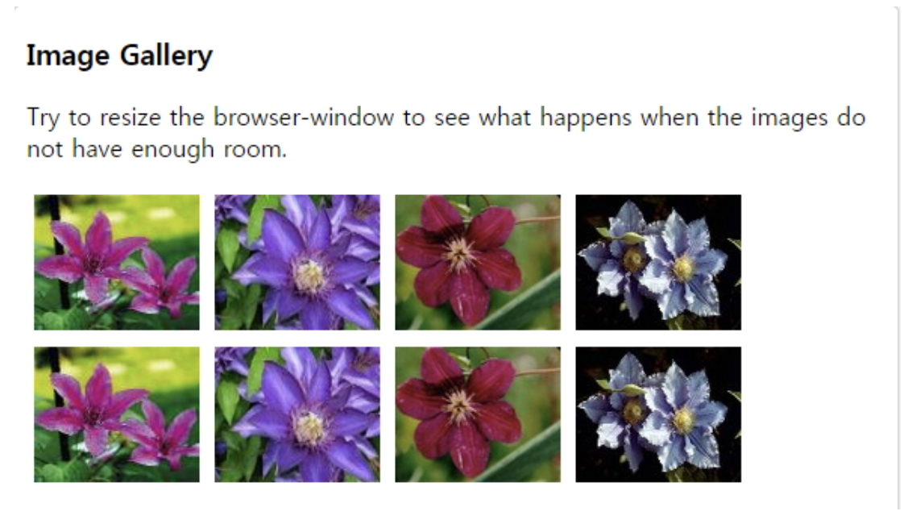
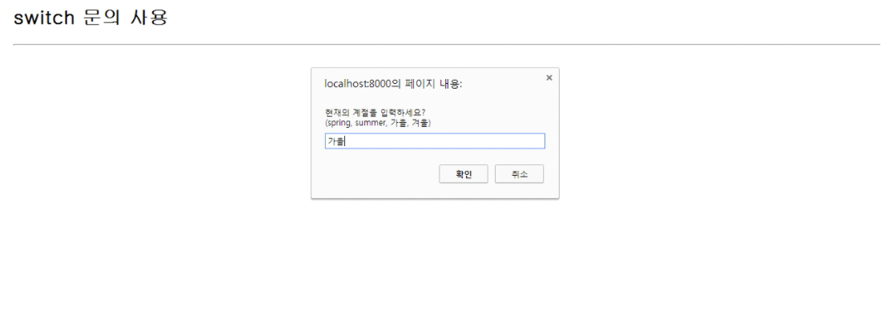
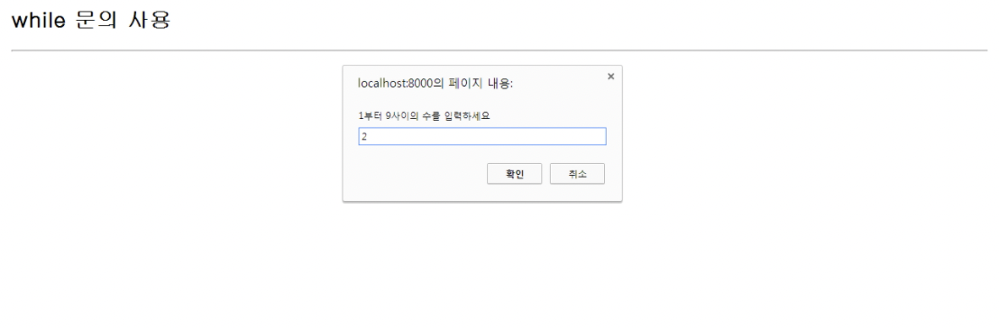
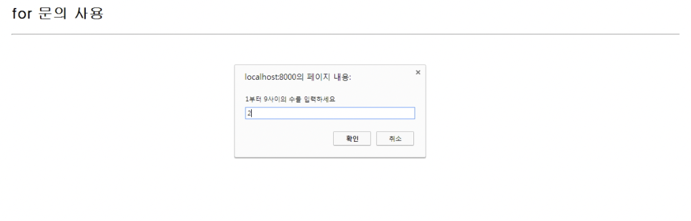
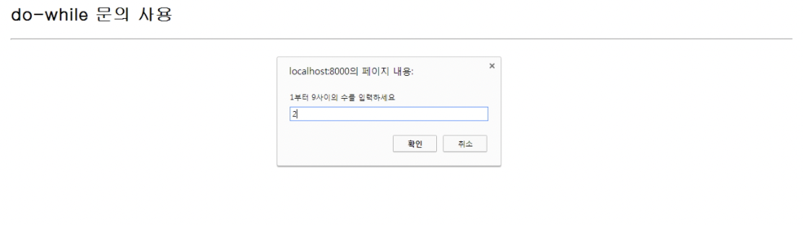
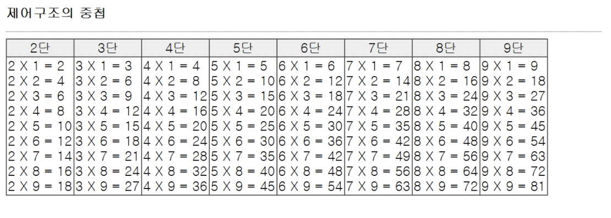
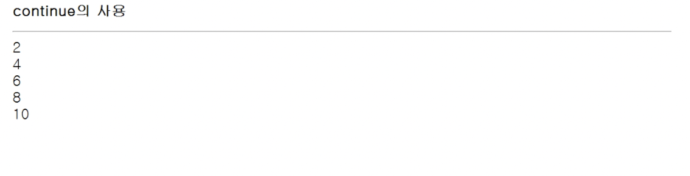
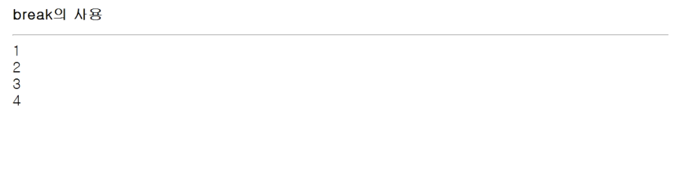
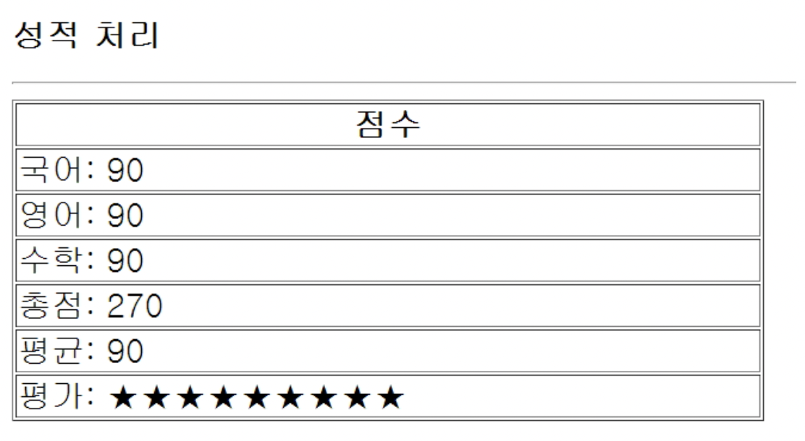

# CSS

## CSS Float, FlexBox

\- 문서에 사진이나 글그림을 왼쪽이나 오른쪽에 띄어서 정렬하거나 각 객체를 오른쪽이나 왼쪽으로 정렬하여 문서를 배치한다.
\- float는 left right none으로 설정할 수 있다.
\- block형 요소에만 사용된다. 예) div, p, ol, ul, table, img ...
\- https://developer.mozilla.org/en-US/docs/Web/CSS/float

```html
<!DOCTYPE html>
<html>
<head>
<style>
.thumbnail {
    float: left;
    width: 110px;
    height: 90px;
    margin: 5px;
}
</style>
</head>
<body>
 
<h3>Image Gallery</h3>
<p>Try to resize the browser-window to see what happens when the images do not have enough room.</p>


 
</body>
</html>
```

\- result




# JavaScript

## JavaScript

 \- 1995년 Netscape의 브랜든 아이크에 의해 모카를 개발, 후에 LiveScript로 변경 되었으며 최종적으로 JavaScript로 지정되었다.  
 \- HTML과 Server Script(백앤드) 사이에서 접속자의 마우스 클릭, 키보드 입력등 이벤트 처리를 주로 담당

 HTML + CSS : 출력

Javascript : 동작/이벤트

백앤드 : 데이터베이스 접속 처리(Oracle, MySQL...)

 \- Javascript는 Ajax 통신을 이용하여 서버와 태그단위로(JSP는 페이지단위 통신, 페이지단위 이동) 비동기 통신이 가능하며, jQuery로 Framework화 되어 발전되어 사용한다.

 \- 요즘은 Ajax 통신의 결과를 SPA(Single Page Application)로 구현하기 위해 typescript, React등을 사용.

 \- javascript 코드는 Chrome(V8 엔진, 가장 고속), IE, FF등의 브러우저가 처리함.

 \- 모든 브라우저는 현재 ECMAScript 10 in 2019 등 표준화로 정착되어 사용한다.

 \- 참조 사이트 : https://developer.mozilla.org/en-US/docs/Web/JavaScript


### 1. 자바스크립트 실행

 (1) JS 는 브라우저에서 확인할 수 있다.
 \- Editplus 편집기에서 test.html 생성하여 web/javascript 에 저장한다.

```html
<!--test.html-->
<!DOCTYPE HTML PUBLIC "-//W3C//DTD HTML 4.0 Transitional//EN">
<HTML>
 <HEAD>
  <TITLE> New Document </TITLE>
  <META NAME="Generator" CONTENT="EditPlus">
  <META NAME="Author" CONTENT="">
  <META NAME="Keywords" CONTENT="">
  <META NAME="Description" CONTENT="">
 </HEAD>
 
 <BODY>
  <script type='text/javascript'>console.log('Hello World!')</script>
 </BODY>
</HTML>
```

(2) Text Editor 비주얼 스튜디오 설치 및 확장하기

-- 효율적인 코딩을 위한 Extentions

```
- open in browser install : 브라우저에서 확인
- Material Theme install -> set color theme -> darker high contrast 
- Material Icon Theme install 
- Prettier - Code formatter install -> 아래 부분 Manage -> Settings 선택 -> 
    save 검색 후
          Editor:Format On Save 아래 체크
    prettier 검색 후
          Prettier :Tab Width
          Number of spaces it should use per tab
          2 로 설정
    Quote 검색 후 
          Javascript;Preferences: Quote Style
          .....
          auto -> single로 변경
    
    Typescript;Preferences: Quote Style
          .....
          auto -> single로 변경
- Bracket Pair Colorizer install : 괄호 색깔 다르게 지정됨
- Indent Rainbow install : 들여쓰기가 보기 좋게 표현된다.
- Auto Rename Tag install : html의 앞에 태그를 바꾸면 뒤에 닫는 태그도 바꾸어준다.
- CSS Peek install : css 찾기 쉽게 한다. class의 이름 위에서 Ctrl + 클릭하면 style로 이동.
- HTML CSS Support install : html에서 css의 자동완성 이용할 수 있다.
- Live Server install : 서버사용, html, css 변경사항을 저장후 바로 적용해준다.
        Manager -> Settings -> live server 검색 -> Use local ip 체크, Custom Browser : chrome선택
       
        html 파일의 Open with Live Server 선택 후 브라우저에서 확인할 수 있다.
```

(3) VSCode에서 open folder 선택하여 web/javascript폴더 선택한다.
\- javascript 옆의 새파일 선택하여 index.html 생성 후 
 ! Tab을 눌러 기본html 코드를 생성한다.
\- index.html -> head -> script src='main.js' 작성 후 브라우저에서 확인한다. 
\- 확인방법 : 파일선택 오른쪽 마우스 Open in Default Browser, Open with Live server

```html
<!--index.html-->
<!DOCTYPE html>
<html lang="en">
<head>
    <meta charset="UTF-8">
    <meta http-equiv="X-UA-Compatible" content="IE=edge">
    <meta name="viewport" content="width=device-width, initial-scale=1.0">
    <title>Document</title>
    <script src="main.js"></script>
</head>
<body>
    
</body>
</html>
```

(5) async 와 defer
\- html 한줄 한줄 읽어가는것을 parsing이라고 한다. 
\- `<script src='main.js'></script>`
  html parsing -> js 다운로드 -> 다시 html parsing -> js실행

\- `<script async src='main.js'></script> `
  : 병렬로 html parsing과 js 다운로드. 그러나 먼저 js가 다운로드 되면 html parsing이 안된 상태에서 js가 실행될 수 있다.
  html parsing -> html parsing 
  js 다운로드  -> js실행

\- `<script defer src='main.js'></script>`
 : 병렬로 html parsing과 js 다운로드, but, html parsing이 먼저 되고 다운로드된 js를 순서대로 실행한다 ; 가장 안정적인 방법이다.

### 2. 변수의 선언

 \- 변수에 할당되는 데이터에 따라 동적으로 타입이 할당, 자바는 타입이 철저 구분.

 \- 변수 선언시 int등의 데이터 타입을 선언하지 않는다.
 \- js 작성시 처음부분에 'use strict'; 써주면 js에서 유연한(안전하지 못한) 변수 선언등을 좀 더 안전(엄격)하게 만들어 준다.

 \- var, let(권장) 이용하여 선언 :  ` let str = "message string";`

 \- var는 var 사용하지 않고 선언된 모든 변수는 전역변수, 함수안에서 선언해도 전역변수로 바뀜 (권장 아님)

 \- const는 선언과 함께 할당된 값이 변경되지 못한다.

#### (1) Data Type

자바스크립트의 데이터타입은 하나의 변수에 여러가지 데이터형을 저장할 수 있다. (Dynamic typing : dynamically typed language)

- primitive : 더이상 작은 단위로 나눠지지 않는 타입, single item

  \- number : 정수, 실수, 숫자 0으로 시작하는 8진수, 0x로 시작하는 16진수등을 저장할 수 있는 복합적인 데이터 타입이다.

  \- string :  "" , ''를 이용해서 문자열을 표현한다. 또한 [template literals](https://developer.mozilla.org/ko/docs/Web/JavaScript/Reference/Template_literals)도 문자열로 표현한다.

  \- boolean : true, false / 0, null, undefined, NaN, '' 는 false로 해석되고 그 외의 값은 true로 해석된다.

  \- null : 데이터의 형식이 알려지지 않았거나 데이터가 없음을 나타냄.

  \- undefined : 변수를 선언후 데이터를 할당하지 않은 경우 갖는 값.

  \- symbol : 고유한 식별자가 필요할때 사용한다. 출력할때는 description 속성을 사용해서 string으로 변환해야 한다.

- object : single item을 묶어서 한 단위나 box로 관리할 수 있다.

- function : 함수는 작업을 수행하거나 값을 계산하는 문장 집합 같은 자바스크립트 절차 함수를 사용하려면 함수를 호출하고자 하는 범위 내에서 함수를 정의해야한다.

(화살표 함수(arrow function expression) : 전통적인 함수표현(function)의 간편한 대안. 

\- [this](https://developer.mozilla.org/ko/docs/Web/JavaScript/Reference/Operators/this)나 [super](https://developer.mozilla.org/ko/docs/Web/JavaScript/Reference/Operators/super)에 대한 바인딩이 없고, [methods](https://developer.mozilla.org/ko/docs/Glossary/Method) 로 사용될 수 없다.

\- [new.target](https://developer.mozilla.org/ko/docs/Web/JavaScript/Reference/Operators/new.target)키워드가 없다.

\- 일반적으로 스코프를 지정할 때 사용하는 [call](https://developer.mozilla.org/ko/docs/Web/JavaScript/Reference/Global_Objects/Function/call), [apply](https://developer.mozilla.org/ko/docs/Web/JavaScript/Reference/Global_Objects/Function/apply), [bind](https://developer.mozilla.org/ko/docs/Web/JavaScript/Reference/Global_Objects/Function/bind) methods를 이용할 수 없다.

\- 생성자[(Constructor)](https://developer.mozilla.org/ko/docs/Web/JavaScript/Reference/Classes/constructor)로 사용할 수 없다.

\- [yield](https://developer.mozilla.org/ko/docs/Web/JavaScript/Reference/Operators/yield)를 화살표 함수 내부에서 사용할 수 없다.

)

-- index.html

```html
.........
<script src="variable.js"></script> <!--추가-->
...........
```

-- variable.js

```js
//1.use strict (added in ES 5)
'use strict';
//2.Variable 
//let (added in ES6)
let name =  '홍';
const maxNumber = 5;
console.log(name);

//3. Variable types
let a = 12;
let b = 12.1;
console.log(`value:${a}, type: ${typeof a}`)
console.log(`value:${b}, type: ${typeof b}`)

const infinity = 1/0;
const negativeInfinity = -1/0;
const nAn = 'not a number' / 2;
console.log(infinity);
console.log(negativeInfinity);
console.log(nAn)

const char = 'c';
const brendan = 'brendan';
const greeting = 'hello' + 'brendan';
console.log(`value: ${greeting}, type:${typeof greeting}`)
const helloBob = `hi ${brendan}!`;//template literals(string)
console.log(`value: ${helloBob} type: ${typeof helloBob}`);
console.log('value: ' + helloBob + ' type: '+typeof helloBob);

const canRead = true;
const test = 3 < 1;
console.log(`value: ${canRead}, type: ${typeof canRead}`)
console.log(`value: ${test}, type: ${typeof test}`)

let nothing = null;
console.log(`value: ${nothing}, type: ${typeof nothing}`)

let x;
console.log(`value: ${x}, type: ${typeof x}`)

//symbol, create unique identifiers for objects
const symbol1 = Symbol('id');
const symbol2 = Symbol('id');
console.log(symbol1 === symbol2)
const gsymbol1 = Symbol.for('id');
const gsymbol2 = Symbol.for('id');
console.log(gsymbol1 === gsymbol2)
console.log(`value: ${symbol1.description}, type: ${typeof symbol1}`)
//Dynamic typing : dynamically typed language
let text = 'hello';
console.log(text.charAt(0)); //'h'
console.log(`value: ${text}, type: ${typeof text}`);
text = 1
console.log(`value: ${text}, type: ${typeof text}`);
text = '7' + 5; //+때무에 5가 문자열로 변환
console.log(`value: ${text}, type: ${typeof text}`);
text = '8' / '2'; //8,2는 숫자로 변환
console.log(`value: ${text}, type: ${typeof text}`);
//console.log(text.charAt(0)); //오류

//object 
const obj = {name:'obj', age:20}
console.log(`name: ${obj.name}, age: ${obj.age}, type:${typeof obj}`)
```


### Operator ( 연산자 )

#### (1) 산술연산

 \- ! Tab (Emmet abbreviation)

(!입력하고 바로 tab하면 기본 html 구조가 자동으로 생성된다.)

-- javascript/js.html

```html
<!DOCTYPE html>
<html lang="en">
<head>
    <meta charset="UTF-8">
    <meta http-equiv="X-UA-Compatible" content="IE=edge">
    <meta name="viewport" content="width=device-width, initial-scale=1.0">
    <title>Document</title>
    <style type="text/css"> 
        *{ 
          font-family: gulim; 
          font-size: 22px; 
        } 
        </style> 
</head>
<body>
    <H2>연산자</H2>
<HR>
<script type="text/javascript">
  var i = 10;
  var j = 3;
 
  pl("더하기: " + (i + j));
  pl("빼기: " + (i - j));
  pl("곱하기: " + (i * j));
  pl("나누기: " + (i / j)); // 정수/정수=실수 (*)
  pl("나머지: " + (i % j));
 
  function pl(str){
    document.write(str + "<br><br>");
  }
 
</script>
</body>
</html>
```


#### (2) String concatenation (+), 산술연산, ++, 연산후 할당연산, 비교연산, 논리연산, Equality

\- 주석색상 변경하는 방법
\- Manager->settings->.json검색 -> JSON:Schemas 아래 Edit in settings.json 클릭하여 아래 코드 추가

```json
  "editor.tokenColorCustomizations": {

	    "comments": "#eeff00"

  },

  "json.schemas": [
 
  ]

}
```

-- index.html

`<script src='operator.js'></script>` 추가

-- operator.js

```js
console.log('my' + ' dog');
console.log('1' + 2); // 2는 문자열로 변환
console.log(`string literals: 1 + 2 = ${1 + 2}`)
 
console.log( 1 + 1); 
console.log( 1 - 1);
console.log( 1 / 1);
console.log( 1 * 1);
console.log( 5 % 2); //나머지
console.log( 2 ** 3); //거듭제곱
 
let counter = 2;
const preIncrement = ++counter; //counter값이 먼저 증가된후  할당된다.
console.log(`preIncrement: ${preIncrement}, counter:${counter}`)
 
const postIncrement = counter++; //할당먼저 된후  counter값이 1증가한다.
console.log(`preIncrement: ${preIncrement}, counter:${counter}`)
 
//연산 후 할당연산
let x = 3;
let y = 6;
x += y; // x = x + y;
x -= y;
x /= y;
x *= y;
 
//비교연산
console.log(10 < 6);
console.log(10 <= 6);
console.log(10 > 6);
console.log(10 >=6);
 
//논리 연산  ||(or), &&(and), !(not)
const value1 = true;
const value2 = 4 < 2;
 
// or  연산 (첫번째 값이 true이면 뒤에 두개는 확인하지 않는다 check()함수 실행 안함)
console.log(`or: ${value1 || value2 || check()}`);
 
// and 연산 (check() 처럼 내용이 긴 경우 마지막 비교 부분에 넣는것이 좋다.)
console.log(`and: ${value1 && value2 && check()}`); 
 
//객체가 널 인지 확인후 널이 안닐경우만 객체의 속성이나 함수를 호출한다.
// if(nullableObject != null){
//     nullableObject.something;
// }
 
function check(){
    for (let i = 0; i < 10; i++) {
        console.log('wating ?');
    }
    return true;
}
 
// !(not)
console.log(!value1)
 
 
//Equality (==, ===)
const stringfive = '5';
const numberfive = 5;
 
//== loose equality, with type conversion (타입변환을 사용한 약한 비교)
console.log(stringfive == numberfive);
console.log(stringfive != numberfive);
 
//=== strict equality, no type convrsion(타입변환을 하지 않는 엄격한 비교)
console.log(stringfive === numberfive);
console.log(stringfive !== numberfive);
 
// object equality by reference
const js1 = {name:'js'};
const js2 = {name:'js'};
const js3 = js1;
console.log(js1 == js2);
console.log(js1 === js2)
console.log(js1 === js3)

//equality 확인 
console.log(0 == false);
console.log(0 === false);
console.log('' == false);
console.log('' === false);
console.log(null == undefined);
console.log(null === undefined);
```


## JS 제어문, break, javascript 파일의 include 사용

### if, Ternary operator:?, swich, loop, break, continue

#### (1) 제어문 확인

-- operator_2.js

```js
//조건절  if, else if, else
 
const name = 'js';
if(name === 'js'){
    console.log('Welcome, js!');
}else if(name === 'coder'){
    console.log("coder~");
}else{
    console.log('unknown');
}
 
//Ternary operator:? 셋으로 이루어진 연산
//condition ? value1 : value2;
console.log(name === 'js' ? 'yes' : 'no');
 
//switch statement
//use for multiple if checks
//use for enum-like value check
//use for multiple type checks in TS 
const browser = "IE";
switch (browser){
    case 'IE':
        console.log("이제 없어진다.");
        break;
    case 'Chrome':
    case 'Firefox':
        console.log('많이 사용');
        break;
    
        console.log('많이 사용');
        break;
    default:
        console.log("모두 브라우저");
        break;
}
//loops , while the condition is truthy,
//body code is executed
let i = 3;
while (i>0){
    console.log(`while:${i}`)
    i--;
}
 
//do while loop, body code is executed first,
//then check the condition.
do{
    console.log(`do while: ${i}`)
    i--;
} while(i > 0);
 
//for loop, for(begin; codition; step)
for (i = 3; i > 0 ; i--){
    console.log(`for: ${i}`);
}
 
//nested loops
for(let i=0; i < 10; i++){
    for(let j=0; j < 10; j++){
        console.log(`i: ${i}, j: ${j}`);
    }
}
 
//break, continue
for (let i=0; i < 11; i++){
    if(i % 2 !== 0){
        continue; //continue 대신  i값 출력해도 된다.
    }
    console.log(`i: ${i} `)
}
 
for(let i = 0; i <  11; i++){
    if(i > 8){
        break;
    }
    console.log(`i: ${i}`);
}
```


#### (2) if 분기문

-- js2.html

```html
<!DOCTYPE html>
<html>
<head>
<meta charset="UTF-8">
<title>Insert title here</title>
<style type="text/css"> 
*{ 
  font-family: gulim; 
  font-size: 22px; 
} 
</style> 
</head>
<body>
<H2>if-else 제어구조</H2>
<HR>
 
<script type="text/javascript">
 
  var temp1 = 5, temp2 = 10;
  var max, min; 
 
  // 두 숫자의 크기를 비교하여 max와 min변수에 저장
  if (temp1 >= temp2){
    //temp1이 큰경우
    max=temp1;
    min=temp2;
  }else{
    //temp2가 큰경우
    max=temp2;
    min=temp1;
  }
  
  pl("");
  pl("큰값 = " + max);
  pl("작은값 = " + min); 
 
  function pl(str){
    document.write("<span style='color: #FF0000; font-size: 28px'>");
    document.write(str);
    document.write("</span><br>");
  }
 
</script>
 
</body>
</html>
```


#### (3) switch 분기문



-- js3.html

```html
<!DOCTYPE html>
<html>
<head>
<meta charset="UTF-8">
<title>Insert title here</title>
<style type="text/css"> 
*{ 
  font-family: gulim; 
  font-size: 22px; 
} 
</style> 
</head>
<body>
 
<H2>switch 문의 사용</H2>
<HR>
 
<script type="text/javascript">
 
// 사용자로 부터 값을 입력 받는데 사용
temp=prompt("현재의 계절을 입력하세요?\n(spring, summer, 가을, 겨울)", "가을");
 
switch(temp){
  case "spring" : // JDK 1.7부터 문자열 비교 가능하나 1.6을 많이 사용함으로 권장은 아님
    document.write("봄이군요. 날씨가 따뜻하네요");
    break;
  case "summer" :
    document.write("여름이군요. 날씨가 무척 덥네요");
    break;
  case "가을" :
    document.write("가을이군요. 날씨가 시원하네요");
    break;
  case "겨울" :
    document.write("겨울이군요. 날씨가 매우 춥네요");
    break;
  default :
    document.write("알수없는 단어입니다.");
}
</script>
 
</body>
</html>
```


#### (4) while 반복문



-- js4.html

```html
<!DOCTYPE html>
<html>
<head>
<meta charset="UTF-8">
<title>Insert title here</title>
<style type="text/css"> 
*{ 
  font-family: gulim; 
  font-size: 22px; 
} 
</style> 
</head>
<body>
 
<H2>while 문의 사용</H2>
<HR>
 
<script type="text/javascript">
var innum, i;
 
// 숫자를 입력
innum=prompt("1부터 9사이의 수를 입력하세요", "2");
 
pl("입력한 숫자 " + innum + "에 대한 구구단<br>");
i=1;
 
//1부터 9까지 9번 반복실행
while(i <= 9){
  pl(innum + " X " + i + " = " + (innum * i));
  //i값을 1 증가
  i++;    
}
 
function pl(str){
  document.write(str + "<br>");
}
 
</script>
 
 
</body>
</html>
```


#### for 반복분



-- js5.html

```html
<!DOCTYPE html>
<html>
<head>
<meta charset="UTF-8">
<title>Insert title here</title>
<style type="text/css"> 
*{ 
  font-family: gulim; 
  font-size: 22px; 
} 
</style> 
</head>
<body>
 
<H2>for 문의 사용</H2>
<HR>
 
<script type="text/javascript">
var innum,i;
 
//숫자를 입력
innum=prompt("1부터 9사이의 수를 입력하세요", 2);
 
pl("입력한 숫자 " + innum + "에 대한 구구단<br><br>");
 
//1부터 9까지 9번 반복실행
for(i=1; i<=9; i++){
  pl(innum + " X " + i + " = " + (innum * i));
}
 
function pl(str){
    document.write(str + "<br>");
}
</script>
 
</body>
</html>
```


#### do-while 반복문



-- js6.html

```html
<!DOCTYPE html>
<html>
<head>
<meta charset="UTF-8">
<title>Insert title here</title>
<style type="text/css"> 
*{ 
  font-family: gulim; 
  font-size: 22px; 
} 
</style> 
</head>
<body>
 
<H2>do-while 문의 사용</H2>
<HR>
 
<script type="text/javascript">
var innum,i = 1;
 
//숫자를 입력
innum=prompt("1부터 9사이의 수를 입력하세요", 2);
 
pl("입력한 숫자 " + innum + "에 대한 구구단<br><br>");
 
// 1부터 9까지 9번 반복실행
do{
    pl(innum + " X " + i + " = " + (innum * i));
        
    i++; // i를 1씩 증가
} while(i<=9);
 
function pl(str){
    document.write(str + "<br>");
}
</script>
 
</body>
</html>
```


#### (7) 제어문의 중첩



-- js7.html

```html
<!DOCTYPE html>
<html>
<head>
<meta charset="UTF-8">
<title>Insert title here</title>
<style type="text/css"> 
*{ 
  font-family: gulim; 
  font-size: 22px; 
} 
</style> 
</head>
<body>
 
<H2>제어구조의 중첩</H2>
<HR>
 
<!-- 표의 시작  -->
<TABLE BORDER="1" cellspacing="0" cellpadding="2">
<!-- 1행 시작  -->
<TR>
 
<script type="text/javascript">
var i, j, result
 
// 칸을 만들면서 2부터 9까지 제목을 출력
for(i=2; i<=9; i++){
    p("<TD ALIGN='CENTER' BGCOLOR='#EEEEEE'>");
    p(i + "단");
    p("</TD>");
}
 
// 1행의 끝과 2행 시작
p("</TR>");
p("<TR>");
 
// 변수 i에 대해 j가 2부터 9까지 계산
for(i=2; i<=9; i++){
 
    p("<TD>");
    for(j=1; j<=9; j++){
        //곱셈결과를 계산하고 칸에 출력
        result = i * j;
        p(i + " X " + j + " = " + result + "<br>");
    }
    p("</TD>");
}
 
function p(str){
  document.write(str);
}
 
function pl(str){
  document.write(str + "<br>");
}
</script>
</TR>
</TABLE>
 
</body>
</html>
```


#### (8) Continue



-- js8.html

```html
<!DOCTYPE html>
<html>
<head>
<meta charset="UTF-8">
<title>Insert title here</title>
<style type="text/css"> 
*{ 
  font-family: gulim; 
  font-size: 22px; 
} 
</style> 
</head>
<body>
 
<H2>continue의 사용</H2>
<HR>
 
<script type="text/javascript">
  var i;
  i=0;
  while(i<10){
    i++;
 
    // 짝수만 출력
    if(i % 2 == 1) continue;
    pl(i);
  }
 
  function p(str){
    document.write(str);
  }
  
  function pl(str){
    document.write(str + "<br>");
  }
</script>
 
</body>
</html>
```


#### (9) break, javascript 파일의 include 사용



-- utility.js

```js
function p(str){
    document.write(str);
}
 
function pl(str){
    document.write(str + "<br>");
}
```

-- js9.html

```html
<!DOCTYPE html>
<html>
<head>
<meta charset="UTF-8">
<title>Insert title here</title>
<style type="text/css"> 
*{ 
  font-family: gulim; 
  font-size: 22px; 
} 
</style>
 
<script type="text/javascript" src="./utility.js" ></script>
 
</head>
<body>
 
<H2>break의 사용</H2>
<HR>
 
<script type="text/javascript">
var i = 0;
 
while(i<10){
    i++;
 
    //i가 5인 경우에는 루프를 종료
    if(i==5) break;
    pl(i);
}
</script>
 
</body>
</html>
```


**[과제 1] 국어, 영어, 수학 점수를 입력받아 점수, 총점과 평균을 출력하는 예제를 작성하세요. '★'표는 10점당 1개로 지정, 점수 입력은 prompt()함수 이용 결과는 테이블의 행으로 출력되도록 하세요.**



-- exam01.html

```html
<!DOCTYPE html>
<html>
<head>
<meta charset="UTF-8">
<title>Insert title here</title>
<style type="text/css"> 
*{ 
  font-family: gulim; 
  font-size: 22px; 
} 
</style> 
</head>
<body>
 
<H2>성적 처리</H2>
<HR>
 
<script type="text/javascript">
  // 국어, 영어, 수학 점수 입력받기
  var kuk = prompt("국어 점수를 입력하세요...", 0); // 문자열로 처리됨.
  var eng = prompt("영어 점수를 입력하세요...", 0);
  var mat = prompt("수학 점수를 입력하세요...", 0);
 
  // 총점과 평균을 출력하는 예제를 작성하세요
  var tot = parseInt(kuk) + parseInt(eng) + parseInt(mat);
  var avg = tot / 3;
  
  var star = '';
  for (var i=1; i <= avg/10; i++){
 star = star + '★';
  }
  
  document.write("<TABLE width='50%' border='1'>");
  document.write("  <TR><TH>점수</TH></TR>");
  document.write("  <TR><TD>국어: "+kuk+"</TD></TR>");
  document.write("  <TR><TD>영어: "+eng+"</TD></TR>");
  document.write("  <TR><TD>수학: "+mat+"</TD></TR>");
  document.write("  <TR><TD>총점: "+tot+"</TD></TR>");
  document.write("  <TR><TD>평균: "+avg+"</TD></TR>");
  document.write("  <TR><TD>평가: "+star+"</TD></TR>");
  document.write("</TABLE>");
  
</script> 
 
</BODY>
</HTML>
```


