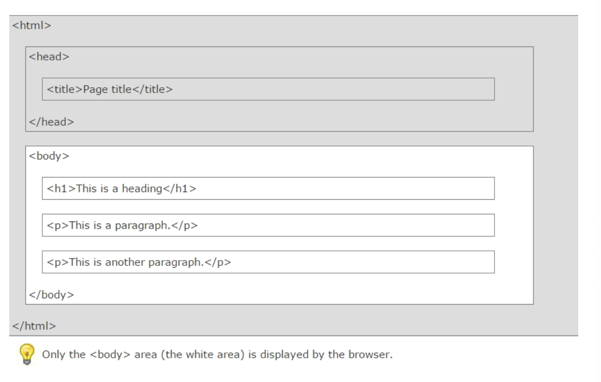
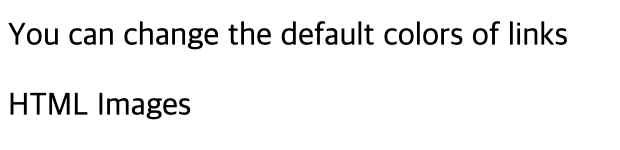

# HTML

## HTML

Hypertext Markup Language (HTML) : 웹 브라우저 상에서 보여지도록 설계된 문서이며, 표준화된 markup 언어를 사용한다.

Markup Language : 일반적인 텍스트와 문법적으로 구분하기 위해 문서에 annotating된 것이다.

### HTML 구조



### HTML 버전에 따른 Declaration


### HTML Version

| HTML      | Year |
| --------- | ---- |
| HTML      | 1991 |
| HTML 2.0  | 1995 |
| HTML 3.2  | 1997 |
| HTML 4.01 | 1999 |
| XHTML     | 2000 |
| HTML5     | 2014 |

현재 HTML5 사용

### HTML 웹 코딩

\- JS Bin 에서 작업
\- https://jsbin.com/?html,output

```html
<!--Test.html-->
<!DOCTYPE html>
<html>
<head>
  <meta charset="utf-8">
  <meta name="viewport" content="width=device-width">
  <title>JS Bin</title>
</head>
<body>
  <h1>My First Heading</h1>
  <p>My first paragraph.</p>
</body>
</html>
```


## HTML Heading,  Paragraphs, Styles

### HTML Headings

`<h1> ~ <h6>`

```html
<!--heading.html-->
<!DOCTYPE html>
<html>
<body>
 
<h1>This is heading 1</h1>
<h2>This is heading 2</h2>
<h3>This is heading 3</h3>
<h4>This is heading 4</h4>
<h5>This is heading 5</h5>
<h6>This is heading 6</h6>
 
</body>
</html>
```

### HTML Paragraphs

The HTML **<p>** element defines a **paragraph**.
**<p>**  : 브라우저 문단 앞,뒤에 자동으로 빈줄을 추가한다.

```html
<!--parag.html-->

<!DOCTYPE html>
<html>
<body>
 
<p>The hr tag defines a horizontal rule:</p>
<hr>
<p>This is a paragraph.</p>
<hr>
<p>This is a paragraph.</p>
<hr>
<p>This is a paragraph.</p>
 
</body>
</html>
```

```html
<!--london.html-->
<!DOCTYPE html>
<html>
<body>
 
<h1>London</h1>
 
<p>London is the capital city of England. It is the most populous city in the United Kingdom, with a metropolitan area of over 13 million inhabitants.</p>
 
</body>
</html>
```

```html
<!--paragraph.html-->

<!DOCTYPE html>
<html>
<body>
 
<p>
This paragraph
contains a lot of lines
in the source code,
but the browser 
ignores it.
</p>
 
<p>
This paragraph
contains      a lot of spaces
in the source     code,
but the    browser 
ignores it.
</p>
 
<p>
The number of lines in a paragraph depends on the size of the browser window. If you resize the browser window, the number of lines in this paragraph will change.
</p>
 
</body>
</html>

```


### HTML Styling

Every HTML element has a **default style** (background color is white and text color is black).

`style="property:value"`

```html
<!--style1.html-->

<!DOCTYPE html>
<html>
<body style="background-color:lightgrey">
 
<h1>This is a heading</h1>
 
<p>This is a paragraph.</p>
 
</body>
</html>
```

```html
<!--style2.html-->
 
<!DOCTYPE html>
<html>
<body>
 
<h1 style="color:blue">This is a heading</h1>
 
<p style="color:red">This is a paragraph.</p>
 
</body>
</html>
```

```html
<!--style3.html-->

<!DOCTYPE html>
<html>
<body>
 
<h1 style="text-align:center">
Centered heading</h1>
 
<p>This is a paragraph.</p>
 
</body>
</html>
```


## HTML CSS(Cascading Style Sheets), id Attribute ,class Attribute

### HTML  elements 에 Style을 적용하기 위한  3 ways

- Inline - using a **style attribute** in HTML elements
- Internal - using a **<style> element** in the HTML <head> section
- External - using one or more **external CSS files**

```html
<!--Inline Styling -->
<!DOCTYPE html>
<html>
<body>
 
<h1 style="color:blue">This is a Blue Heading</h1>
 
</body>
</html>
```

```html
<!--Internal Styling (Internal CSS)-->

<!DOCTYPE html>
<html>
 
<head>
<style>
  body {background-color:lightgrey}
  h1   {color:blue}
  p    {color:green}
</style>
</head>
 
<body>
<h1>This is a heading</h1>
<p>This is a paragraph.</p>
</body>
 
</html>
```

```html
<!--External Styling (External CSS)-->

<!DOCTYPE html>
<html>
<head>
<link rel="stylesheet" href="styles.css">
</head>
 
<body>
<h1>This is a heading</h1>
<p>This is a paragraph.</p>
</body>
 
</html>
```


### CSS Fonts

- font-size : px, pt, cm, % 등의 단위로 지정하거나, xx-small, x-small, medium, large, x-large, xx-large로 사용 가능
- medium default = 12pt = 10px = 13cm = 100%

```html
<!DOCTYPE html>
<html>
 
<head>
<style>
h1 {
    color:blue;
    font-family:verdana;
    font-size:300%;
 
}
p  {
    color:red;
    font-family:courier;
    font-size:160%;
}
</style>
</head>
 
<body>
<h1>This is a heading</h1>
<p>This is a paragraph.</p>
</body>
 
</html>
```


### id Attribute

JS-Bin 에서 file -> download -> web/html/ex01.html 저장

```html
<!--ex01.html-->
<!DOCTYPE html>
<html>
 
<head>
<style>
p#p01 {
    color: blue;
}
</style>
</head>
<body>
 
<p>This is a paragraph.</p>
<p>This is a paragraph.</p>
<p>This is a paragraph.</p>
<p id="p01">I am different.</p>
 
</body>
</html>
```


### class Attribute

```html
<!--ex02.html-->

<!DOCTYPE html>
<html>
 
<head>
<style>
p.error {
    color:red;
}
</style>
</head>
<body>
 
<p>This is a paragraph.</p>
<p>This is a paragraph.</p>
<p class="error">I am different.</p>
<p>This is a paragraph.</p>
<p class="error">I am different too.</p>
 
</body>
</html>
```


### link, image

```html
<!--link.html-->
<!DOCTYPE html>
<html>
<head>
<style>
a:link {
    color:#000000;
    background-color:transparent;
    text-decoration:none;
}
a:visited {
    color:#000000;
    background-color:transparent;
    text-decoration:none;
}
a:hover {
    color:#ff0000;
    background-color:transparent;
    text-decoration:underline;
}
a:active {
    color:#ff0000;
    background-color:transparent;
    text-decoration:underline;
}
</style>
</head>
 
<body>
 
<p>You can change the default colors of links</p>
 
<a href="ex01.html" target="_blank">HTML Images</a> 
 
</body>
</html>
```

\- 결과




마우스를 올리면 다음과 같이 link에 대한 style이 보인다.

```html
<!--image.html-->

<!DOCTYPE html>
<html>
<body>
 
<h2>Spectacular Mountains</h2>

 
</body>
</html>
```


## HTML 테이블


### HTML Table Tags


### <table>의 테두리 속성 적용


### border-collapse: collapse;


### <th> tag


### colgroup, col


### Cell Padding


### border-spacing


((비번은 tim / ~ [10]CSS overflow))


-- ??

```java
public class Constant {
    public static final String driver="oracle.jdbc.driver.OracleDriver";
    public static final String url="jdbc:oracle:thin:@127.0.0.1:1521:XE";
    public static final String user="user1234";
    public static final String passwd="1234";
}
```


