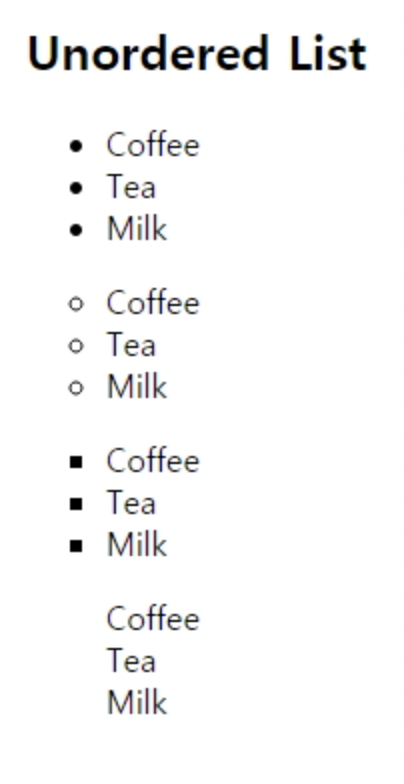
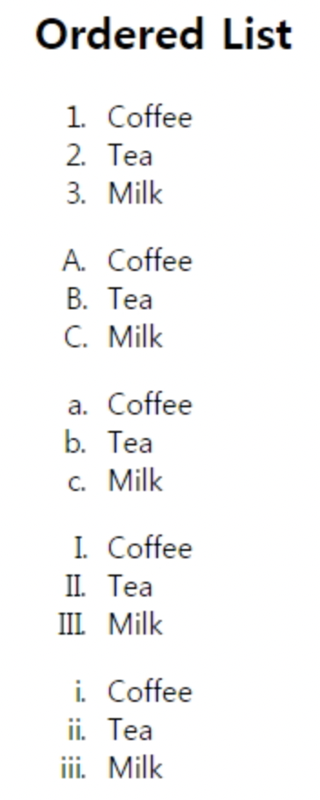
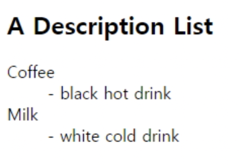
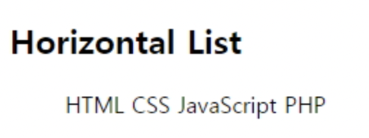
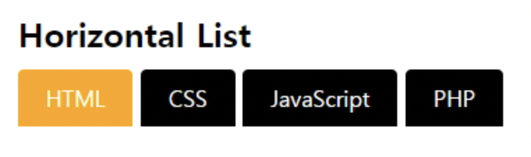

# HTML

## HTML Lists

.assets/image-20210920190329408.png)

### Unordered HTML Lists - The Style Attribute

.assets/image-20210920190506677.png)

```html
<!DOCTYPE html>
<html>
<body>
 
<h2>Unordered List with Disc Bullets</h2>
 
<ul style="list-style-type:disc">
  <li>Coffee</li>
  <li>Tea</li>
  <li>Milk</li>
</ul>  
 
<ul style="list-style-type:circle">
  <li>Coffee</li>
  <li>Tea</li>
  <li>Milk</li>
</ul>
  
<ul style="list-style-type:square">
  <li>Coffee</li>
  <li>Tea</li>
  <li>Milk</li>
</ul>  
 
<ul style="list-style-type:none">
  <li>Coffee</li>
  <li>Tea</li>
  <li>Milk</li>
</ul>  
 
</body>
</html>
```

-- result




### Ordered HTML Lists - The Type Attribute

.assets/image-20210920190633554.png)

```html
<!DOCTYPE html>
<html>
<body>
 
<h2>Ordered List with Numbers</h2>
 
<ol type="1">
  <li>Coffee</li>
  <li>Tea</li>
  <li>Milk</li>
</ol>  
 
<ol type="A">
  <li>Coffee</li>
  <li>Tea</li>
  <li>Milk</li>
</ol>  
 
<ol type="a">
  <li>Coffee</li>
  <li>Tea</li>
  <li>Milk</li>
</ol>  
 
<ol type="I">
  <li>Coffee</li>
  <li>Tea</li>
  <li>Milk</li>
</ol>  
 
<ol type="i">
  <li>Coffee</li>
  <li>Tea</li>
  <li>Milk</li>
</ol>  
 
</body>
</html>
```

-- result




### HTML Description Lists

**<dl>** tag defines a description list.
**<dt>** tag defines the term (name) : 제목
**<dd>** tag defines the data (description) : 설명 

```html
<!DOCTYPE html>
<html>
<body>
 
<h2>A Description List</h2>
 
<dl>
  <dt>Coffee</dt>
  <dd>- black hot drink</dd>
  <dt>Milk</dt>
  <dd>- white cold drink</dd>
</dl>
 
</body>
</html>
```

-- result




### lists inside lists

```html
<!DOCTYPE html>
<html>
<body>
 
<h2>A Nested List</h2>
 
<ul>
  <li>Coffee</li>
  <li>Tea
    <ul>
    <li>Black tea</li>
    <li>Green tea</li>
    </ul>
  </li>
  <li>Milk</li>
</ul>
 
</body>
</html>
```


###  Horizontal Lists



```html
<!DOCTYPE html>
<html>
 
<head>
<style>
ul#menu li {
    display:inline;
}
</style>
</head>
 
<body>
 
<h2>Horizontal List</h2>
 
<ul id="menu">
  <li>HTML</li>
  <li>CSS</li>
  <li>JavaScript</li>
  <li>PHP</li>
</ul>  
 
</body>
</html>
```



```html
<!DOCTYPE html>
<html>
 
<head>
<style>
ul#menu {
    padding: 0;
}
 
ul#menu li {
    display: inline;
}
 
ul#menu li a {
    background-color: black;
    color: white;
    padding: 10px 20px;
    text-decoration: none;
    border-radius: 4px 4px 0 0;
}
 
ul#menu li a:hover {
    background-color: orange;
}
</style>
</head>
 
<body>
 
<h2>Horizontal List</h2>
 
<ul id="menu">
 <li><a href="/html/default.asp">HTML</a></li>
 <li><a href="/css/default.asp">CSS</a></li>
 <li><a href="/js/default.asp">JavaScript</a></li>
 <li><a href="/php/default.asp">PHP</a></li>
</ul>  
 
</body>
</html>
```


## HTML Forms

\-  사용자의 입력값을 모집할 수 있다.
 \- <form> 요소로 선언한다.
 \- 다른 type의 <input>요소를 가진다. checkboxes, radio buttons, submit buttons 등등 

### <form> tag 중요속성

 \- action 속성 : 사용자가 입력한 값을 server-side script로  보내면서 요청할 webpage를 선언한다.
 \- method 속성 :  사용자가 입력한 값을 Server-Side Script로 보낼때 HTTP Method를 설명한다 (GET or POST)
  GET  - 민감한 정보를 보내지 않고 페이지 요청시 사용함, 주소에 submit되는 정보가 노출됨
  POST- 민감한 정보를 보내면서 페이지 요청시 사용함, 주소에 submit되는 정보가 노출되지 않음.

```html
<form action="action_page.jsp" method="GET"> 
```

-- 이 경우 말고도 GET 방식의 페이지 요청이 많음

```html
<form action="action_page.jsp" method="POST">
```

 -- 이 경우만 POST 방식의 페이지 요청


### Grouping Form Data with <fieldset>

\- **<fieldset>** 폼안에서 관련있는 data를 분류

\- **<legend>** <fieldset>의  타이틀

```html
<!DOCTYPE html>
<html>
<body>
 
<form action="action_page.php">
<fieldset>
<legend>Personal information:</legend>
First name:<br>
<input type="text" name="firstname" value="Mickey">
<br>
Last name:<br>
<input type="text" name="lastname" value="Mouse">
<br><br>
<input type="submit" value="Submit">
</fieldset>
</form>
 
</body>
</html>
```

-- result

.assets/image-20210920192056587.png)

- <input> 요소 : checkbox, radio, button, submit

- ```html
  <select>-drop down, <textarea>, <button>
  ```


