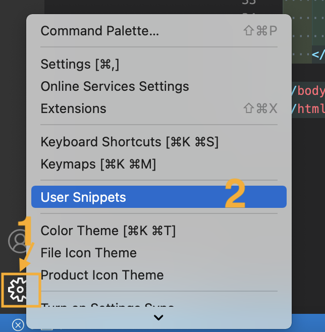

# JQuery


## jQuery 설치

(1) 장점

- jQuery는 JavaScript Library 입니다.
- jQuery는 상당히 단순한 JavaScript programming이다.  또한 간결하게 코딩하고 많은 일을 해주는 JavaScript Library이다. 
- CSS의 selecter를 사용하고 있어서 습득하기 쉬우며,  브러우저의 다양성을 처리해 줌으로  호환성 처리에 시간을 소비할 필요가 없다. 
- 복잡한 Javascript의 구현시 DOM 문법을 매우 간결하게 해주어 개발 속도를  향상 할 수 있다.
- jQuery의 기능을 확장할 수 있는 plugin 구조를 지원한다.
- Ajax를 지원해 줍니다. 
- 참고사이트 : `https://api.jquery.com/


(2) 설치

- jQuery 다운로드 : https://jquery.com/download/
- 설치 없이도 코드를 넣어 이용 가능

`<script src="../scripts/jquery-3.6.0.js"></script>`

`<script src="https://code.jquery.com/jquery-3.5.0.js"></script>`


(3) jQuery로 작성된 스크립트

- `$(function () {`

  의미 : 페이지가 로딩될 때.

- `$("dd:not(:first)").css("display","none");`

  의미:첫번째 dd태그를 제외한 나머지 dd태그의 display를 none로 한다.

- `$("+dd", this).slideDown("slow"); `

  의미: 현재 dd의 뒤에 dd를 천천히 올린다.

```html
<!DOCTYPE html>
<html>

<head>
    <meta charset="UTF-8" />
    <title> 아코디언판넬 </title>
    <script src="https://code.jquery.com/jquery-3.5.0.js"></script>
    <script type="text/javascript">
        $(function () {
            $("dd:not(:first)").css("display", "none");
            $("dl dt").click(function () {
                if ($("+dd", this).css("display") == "none") {
                    $(this).siblings("dd").slideUp("slow");
                    $("+dd", this).slideDown("slow");
                }
            });
        });
    </script>
    <style type="text/css">
        * {
            margin: 0;
            padding: 0;
        }

        dl {
            width: 400px;
            margin: 50px auto;
        }

        dl dt {
            background: #7CADB6;
            border-bottom: 1px solid #FFFFFF;
            cursor: pointer;
        }

        dl dd {
            border: 1px solid #7CADB6;
            border-top: none;
            height: 300px;
        }
    </style>
</head>

<body>
    <div id="container">
        <dl>
            <dt> 텍스트1</dt>
            <dd>
                <p> 텍스트 텍스트 텍스트 텍스트 텍스트 텍스트 텍스트 텍스트 텍스트
                    텍스트 텍스트 텍스트 텍스트 텍스트 텍스트 텍스트 텍스트 텍스트 텍스트 </p>
            </dd>
            <dt> 텍스트 2</dt>
            <dd>
                <p> 텍스트 텍스트 텍스트 텍스트 텍스트 텍스트 텍스트 텍스트 텍스트
                    텍스트 텍스트 텍스트 텍스트 텍스트 텍스트 텍스트 텍스트 텍스트 텍스트 </p>
            </dd>
            <dt> 텍스트 3</dt>
            <dd>
                <p> 텍스트 텍스트 텍스트 텍스트 텍스트 텍스트 텍스트 텍스트 텍스트
                    텍스트 텍스트 텍스트 텍스트 텍스트 텍스트 텍스트 텍스트 텍스트 텍스트 </p>
            </dd>
        </dl>
    </div>
</body>
</html>
```


## jQuery template 설정

- `!! + tab` 을 하면 한번에 템플릿이 생성되도록 단축키 개념
- Manager -> User Snippets -> html 검색 후 선택




- html.json에 다음 코드 작성

> html.json

```json
// Example:
	"jQuery": {
		"prefix": "!!",
		"body": [
			"<!DOCTYPE html>",
			"<html lang='ko'>",
			"<head>",
			"<meta charset='UTF-8'>",
			"<meta name='viewport' content='width=device-width, initial-scale=1.0'>",
			"<title>$1</title>",
			"<style>$2</style>",
			"<script src='https://code.jquery.com/jquery-3.5.0.js'></script>",
			"<script>",
			"$(function () {",
			"$3",
			"});",
			"</script>",
			"</head>",
			"<body>",
			"$4",
			"</body>",
			"</html>",
		],
		"description": "Log output to console"
	}
```


## Selector - CSS, CSS2 

- selector를 이용하여 DOM Element를 검색한다.


### Selector 기본 문법

- 사용법: $("")

- 용어 : 태그 = Element, 속성 = Attribute

### CSS Selector

 (1) tag selector  

- `$("태그명")` : HTML tag를 제어

 (2) id selector

- `$("#id명")` : id 속성을 가진 tag를 제어

 (3) class selector  

- `$(".class명")` : class속성을 가진 tag를 제어

 (4) 자손 selector  

- `$("태그1 태그2") `: 태그안의 자식태그 제어 

```html
<!DOCTYPE html>
<html>
<head>
    <meta charset="UTF-8" />
    <title>자손 셀렉터</title>
    <script src="https://code.jquery.com/jquery-3.5.0.js"></script>
    <script>
        $(function () {
            $(".first strong").css("color", "red");
        });
    </script>
</head>
<body>
    <ul>
        <li class="first"><strong> 텍스트 </strong> 텍스트 텍스트 텍스트 텍스트 </li>
        <li class="second"><strong> 텍스트 </strong> 텍스트 텍스트 텍스트 텍스트 </li>
        <li class="third"><strong> 텍스트 </strong> 텍스트 텍스트 텍스트 텍스트 </li>
        <li class="fourth"><strong> 텍스트 </strong> 텍스트 텍스트 텍스트 텍스트 </li>
    </ul>

</body>
</html>
```


(5) 유니버셜 selector

- `$("*")` : 전체태그

```html
<!DOCTYPE html>
<html>
<head>
    <meta charset="UTF-8">
    <title>전체태그</title>
    <script src="https://code.jquery.com/jquery-3.5.0.js"></script>
    <script>
        $(function () {
            $("li *").css("color", "red");
        });
    </script>
</head>
<body>
    <ul>
        <li><strong> 텍스트 </strong> 텍스트 텍스트 텍스트 텍스트 </li>
        <li><em> 텍스트 </em> 텍스트 텍스트 텍스트 텍스트 </li>
        <li><span> 텍스트 </span> 텍스트 텍스트 텍스트 텍스트 </li>
        <li> 텍스트텍스트텍스트텍스트 </li>
    </ul>

</body>
</html>
```


(6) 그룹 selector

- `$("셀렉터1, 셀렉터2")` :복수의 셀렉터

```html
<!DOCTYPE html>
<html>
<head>
    <meta charset="UTF-8">
    <title>그룹 셀렉터</title>
    <script src="https://code.jquery.com/jquery-3.5.0.js"></script>
    <script type="text/javascript">
        $(function () {
            $("#first , #third").css("color", "red");
        });
    </script>
</head>
<body>
    <ul>
        <li id="first"> 텍스트 텍스트 텍스트 텍스트 텍스트 </li>
        <li id="second"> 텍스트 텍스트 텍스트 텍스트 텍스트 </li>
        <li id="third"> 텍스트 텍스트 텍스트 텍스트 텍스트 </li>
        <li id="fourth"> 텍스트 텍스트 텍스트 텍스트 텍스트 </li>
    </ul>
</body>
</html>
```


### CSS2 Selector

 (1) 자식 selector 

- `$("부모태그명 > 자식태그명") : 특정 태그의 바로 밑에 자식태그

```html
<!DOCTYPE html>
<html>
<head>
    <meta charset="UTF-8">
    <title>자식 셀렉터</title>
    <script src="https://code.jquery.com/jquery-3.5.0.js"></script>
    <script>
        $(function () {
            $("li > strong").css("color", "red");
        });
    </script>
</head>
<body>
    <ul>
        <li><strong> 텍스트</strong> 텍스트 텍스트 텍스트 텍스트</li>
        <li> 텍스트 텍스트 텍스트 텍스트 텍스트 </li>
        <li>
            <div><strong> 텍스트 </strong> 텍스트 텍스트 텍스트 텍스트
                <span> 텍스트 </span>
            </div>
        </li>
        <li> 텍스트 텍스트 텍스트 텍스트 텍스트 </li>
    </ul>
</body>
</html>
```

 

(2) 다음 인접 selector 

- `$("이전+다음")` : 이전의 인접한 다음 태그 선택

```html
<!DOCTYPE html>
<html>
<head>
    <meta charset="UTF-8">
    <title>인접 셀렉터</title>
    <script src="https://code.jquery.com/jquery-3.5.0.js"></script>
    <script>
        $(function () {
            $("#second + li").css("color", "red");
        });
    </script>
</head>
<body>
    <ul>
        <li id="first"> 텍스트 텍스트 텍스트 텍스트 텍스트 </li>
        <li id="second"> 텍스트 텍스트 텍스트 텍스트 텍스트 </li>
        <li id="third"> 텍스트 텍스트 텍스트 텍스트 텍스트 </li>
        <li id="fourth"> 텍스트 텍스트 텍스트 텍스트 텍스트 </li>

    </ul>
</body>
</html>
```


(3) :first-child Selector

- `$("태그:first-child")`: 동일 태그 안의 첫 태그

```html
<!DOCTYPE html>
<html>
<head>
    <meta charset="UTF-8">
    <title>first-child 클래스</title>
    <script src="https://code.jquery.com/jquery-3.5.0.js"></script>
    <script>
        $(function () {
            $("li:first-child").css("color", "red");
        });
    </script>
</head>
<body>
    <ul>
        <li> 텍스트 텍스트 텍스트 텍스트 텍스트 </li>
        <li> 텍스트 텍스트 텍스트 텍스트 텍스트 </li>
        <li> 텍스트 텍스트 텍스트 텍스트 텍스트 </li>
        <li> 텍스트 텍스트 텍스트 텍스트 텍스트 </li>

    </ul>
    <ul>
        <li> 텍스트 텍스트 텍스트 텍스트 텍스트 </li>
        <li> 텍스트 텍스트 텍스트 텍스트 텍스트 </li>
        <li> 텍스트 텍스트 텍스트 텍스트 텍스트 </li>
        <li> 텍스트 텍스트 텍스트 텍스트 텍스트 </li>
    </ul>
</body>
</html>
```


## Selector - CSS3

### CSS3 Selector

(1) Next Siblings Selector (“prev ~ siblings”) 

: "prev" 요소 다음에 오는 모든 "siblings" 요소를 선택하고 동일한 부모를 가지며 필터링 "siblings" 선택기와 일치한다.

```html
<!doctype html>
<html lang="ko">
<head>
    <meta charset="utf-8">
    <title>next siblings demo</title>
    <style>
        div,
        span {
            display: block;
            width: 80px;
            height: 80px;
            margin: 5px;
            background: #bfa;
            float: left;
            font-size: 14px;
        }

        div#small {
            width: 60px;
            height: 25px;
            font-size: 12px;
            background: #fab;
        }
    </style>
    <script src="https://code.jquery.com/jquery-3.5.0.js"></script>
</head>
<body>

    <div>div (doesn't match since before #prev)</div>
    <span id="prev">span#prev</span>
    <div>div sibling</div>
    <div>div sibling <div id="small">div niece</div>
    </div>
    <span>span sibling (not div)</span>
    <div>div sibling</div>

    <script>
        $("#prev ~ div").css("border", "3px groove blue");
    </script>

</body>
</html>
```


(2) :not() Selector

- `$(":not(selector)")` : 주어진 selector에 매치되지 않는 모든 요소를 선택.

```html
<!doctype html>
<html lang="en">
<head>
    <meta charset="utf-8">
    <title>not demo</title>
    <script src="https://code.jquery.com/jquery-3.5.0.js"></script>
</head>
<body>
    <div>
        <input type="checkbox" name="a">
        <span>Mary</span>
    </div>
    <div>
        <input type="checkbox" name="b">
        <span>lcm</span>
    </div>
    <div>
        <input type="checkbox" name="c" checked="checked">
        <span>Peter</span>
    </div>

    <script>
        $("input:not(:checked) + span").css("background-color", "yellow");
        $("input").attr("disabled", "disabled");
    </script>

</body>
</html>
```


(3) jQuery(":empty") 

- `$("태그:empty")` : 자식태그 혹은 text nodes 를 포함하지 않는 태그

```html
<!doctype html>
<html lang="en">
<head>
    <meta charset="utf-8">
    <title>empty demo</title>
    <style>
        td {
            text-align: center;
        }
    </style>
    <script src="https://code.jquery.com/jquery-3.5.0.js"></script>
</head>
<body>

    <table border="1">
        <tr>
            <td>TD #0</td>
            <td></td>
        </tr>
        <tr>
            <td>TD #2</td>
            <td></td>
        </tr>
        <tr>
            <td></td>
            <td>TD#5</td>
        </tr>
    </table>

    <script>
        $("td:empty")
            .text("Was empty!")
            .css("background", "rgb(255,220,200)");
    </script>

</body>
</html>
```


(4) jQuery( ":nth-child(index/even/odd/equation)" ) 

- `$("태그:nth-child(index)")` : 특정 태그안에서 지정한 번호의 태그
- 두 개의 `<li>`를 포함하는 단일 `<ul>`이 주어지면 `$( "li:nth-child(1)" )` 첫 번째 `<li>` 를 선택하는 반면 `$( "li" ).eq( 1 )` 는 두 번째 `<li>`를 선택한다.
- `.eq(n)` 의 n은 0부터 시작한다.

```html
<!doctype html>
<html lang="en">
<head>
    <meta charset="utf-8">
    <title>nth-child demo</title>
    <style>
        div {
            float: left;
        }

        span {
            color: blue;
        }
    </style>
    <script src="https://code.jquery.com/jquery-3.5.0.js"></script>
</head>
<body>

    <div>
        <ul>
            <li>John</li>
            <li>Karl</li>
            <li>Brandon</li>
        </ul>
    </div>
    <div>
        <ul>
            <li>Sam</li>
        </ul>
    </div>
    <div>
        <ul>
            <li>Glen</li>
            <li>Tane</li>
            <li>Ralph</li>
            <li>David</li>
        </ul>
    </div>

    <script>
        $("ul li:nth-child(2)").append("<span> - 2nd!</span>");
        $("ul li").eq(2).append("<span> - 3nd!</span>");
    </script>

</body>
</html>
```


(5) last-child selector 

- `$("태그:last-child")` : 자식태그들 중에 마자막 자식태그
- ` .hover(handlerIn, handlerOut)`

```html
<!doctype html>
<html lang="en">
<head>
    <meta charset="utf-8">
    <title>last-child demo</title>
    <style>
        span.solast {
            text-decoration: line-through;
        }
    </style>
    <script src="https://code.jquery.com/jquery-3.5.0.js"></script>
</head>
<body>

    <div>
        <span>John,</span>
        <span>Karl,</span>
        <span>Brandon,</span>
        <span>Sam</span>
    </div>
    <div>
        <span>Glen,</span>
        <span>Tane,</span>
        <span>Ralph,</span>
        <span>David</span>
    </div>

    <script>
        $("div span:last-child")
            .css({ color: "red", fontSize: "80%" })
            .hover(function () {
                $(this).addClass("solast");
            }, function () {
                $(this).removeClass("solast");
            });
    </script>

</body>
</html>
```


(6) only-child 유사클래스  

- `$("태그:only-child") : 부모의 자식이 하나인 태그 

```html
<!doctype html>
<html lang="en">
<head>
    <meta charset="utf-8">
    <title>only-child demo</title>
    <style>
        div {
            width: 100px;
            height: 80px;
            margin: 5px;
            float: left;
            background: #b9e;
        }
    </style>
    <script src="https://code.jquery.com/jquery-3.5.0.js"></script>
</head>
<body>

    <div>
        <button>Sibling!</button>
        <button>Sibling!</button>
    </div>

    <div>
        <button>Sibling!</button>
    </div>

    <div>
        None
    </div>

    <div>
        <button>Sibling!</button>
        <button>Sibling!</button>
        <button>Sibling!</button>
    </div>

    <div>
        <button>Sibling!</button>
    </div>

    <script>
        $("div button:only-child").text("Alone").css("border", "2px blue solid");
    </script>
</body>
</html>
```


## Selector - Atrribute

### Attribute

 (1) [attribute]  

- `$("[속성명]")` : 특정 속성을 가진 태그

```html
<!DOCTYPE html>
<html>
<head>
    <meta charset="UTF-8">
    <title>속성 셀렉터</title>
    <script src="https://code.jquery.com/jquery-3.5.0.js"></script>
    <script>
        $(function () {
            $("[id]").css("color", "red");
        });
    </script>
</head>
<body>
    <ul>
        <li id="first"> 텍스트 텍스트 텍스트 텍스트 텍스트 </li>
        <li class="second"> 텍스트 텍스트 텍스트 텍스트 텍스트 </li>
        <li id="third"> 텍스트 텍스트 텍스트 텍스트 텍스트 </li>
        <li class="fourth"> 텍스트 텍스트 텍스트 텍스트 텍스트 </li>
    </ul>
</body>
</html>
```


(2) [attribute='value']

- `$("[속성명='값']")`

```html
<!doctype html>
<html lang="en">
<head>
    <meta charset="utf-8">
    <title>attributeEquals demo</title>
    <script src="https://code.jquery.com/jquery-3.5.0.js"></script>
</head>
<body>
    <div>
        <label>
            <input type="radio" name="newsletter" value="Hot Fuzz">
            <span>name?</span>
        </label>
    </div>
    <div>
        <label>
            <input type="radio" name="newsletter" value="Cold Fusion">
            <span>value?</span>
        </label>
    </div>
    <div>
        <label>
            <input type="radio" name="newsletter" value="Evil Plans">
            <span>value?</span>
        </label>
    </div>
    <!-- 덮어씀-->
    <script>
        $("input[value='Hot Fuzz']").next().text("Hot Fuzz");
    </script>
</body>
</html>
```


 (3) [attribute!='value'

- `$( "input[name!='newsletter']" ).next().append( "<b>; not newsletter</b>" );`

- 결과는 아래와 같다.

  ```html
  <span>no name <b>; not newsletter</b></span>
  <span>name is accept<b>; not newsletter</b></span>
  ```


```html
<!doctype html>
<html lang="en">
<head>
    <meta charset="utf-8">
    <title>attributeNotEqual demo</title>
    <script src="https://code.jquery.com/jquery-3.5.0.js"></script>
</head>
<body>
    <div>
        <input type="radio" name="newsletter" value="Hot Fuzz">
        <span>name is newsletter</span>
    </div>
    <div>
        <input type="radio" value="Cold Fusion">
        <span>no name</span>
    </div>
    <div>
        <input type="radio" name="accept" value="Evil Plans">
        <span>name is accept</span>
    </div>
    <script>
        $("input[name!='newsletter']").next().append("<b>; not newsletter</b>");
    </script>
</body>
</html>
```


(4) [attribute^='value']

- `$("태그명[속성명^='값']")`  : 특정 속성이 지정한 값으로 시작되는 태그

```html
<!doctype html>
<html lang="en">
<head>
    <meta charset="utf-8">
    <title>attributeNotEqual demo</title>
    <script src="https://code.jquery.com/jquery-3.5.0.js"></script>

    <script type="text/javascript">
        $(function () {
            $("[title^='f']").css("color", "red");
        });
    </script>
</head>
<body>
    <ul>
        <li title="first"> 텍스트 텍스트 텍스트 텍스트 텍스트 </li>
        <li title="second"> 텍스트 텍스트 텍스트 텍스트 텍스트 </li>
        <li title="third"> 텍스트 텍스트 텍스트 텍스트 텍스트 </li>
        <li title="fourth"> 텍스트 텍스트 텍스트 텍스트 텍스트 </li>
    </ul>
</body>
</html>
```


(5) [attribute$='value']

- `$("태그명[속성명$='값']")` : 특정 속성이 지정한 값으로 끝나는 태그

```html
<!doctype html>
<html lang="en">
<head>
    <meta charset="utf-8">
    <title>attributeEndsWith demo</title>
    <script src="https://code.jquery.com/jquery-3.5.0.js"></script>
</head>
<body>

    <input name="newsletter">
    <input name="milkman">
    <input name="jobletter">

    <script>
        $("input[name$='letter']").val("a letter");
    </script>

</body>
</html>
```


(6) [attribute*='value']

- `$("태그명[속성명*='값']")` : 특정 속성이 지정한 값을 포함하고 있는 태그

```html
<!doctype html>
<html lang="en">
<head>
    <meta charset="utf-8">
    <title>attributeContains demo</title>
    <script src="https://code.jquery.com/jquery-3.5.0.js"></script>
</head>
<body>
    <input name="man-news">
    <input name="milkman">
    <input name="letterman2">
    <input name="newmilk">

    <script>
        $("input[name*='man']").val("has man in it!");
    </script>
</body>
</html>
```


(7) [attribute~='value'] 

- `$("태그명[속성 ~= 값]")`

  : 공백으로 구분된 주어진 단어를 포함하는 값으로 지정된 속성이 있는 요소선택

```html
<!doctype html>
<html lang="en">
<head>
    <meta charset="utf-8">
    <title>attributeContainsWord demo</title>
    <script src="https://code.jquery.com/jquery-3.5.0.js"></script>
</head>
<body>

    <input name="man-news">
    <input name="milk man">
    <input name="letterman2">
    <input name="newmilk">

    <script>
        $("input[name~='man']").val("mr. man is in it!");
    </script>

</body>
</html>
```


(8) `jQuery( "[attribute |= 'value']" )`

- $("태그[속성 |= 값]")

  : 값이 주어진 문자열과 같거나 해당 문자열로 시작하여 하이픈(-)이 오는 지정된 속성이 있는 요소 선택.

```html
<!doctype html>
<html lang="en">
<head>
    <meta charset="utf-8">
    <title>attributeContainsPrefix demo</title>
    <style>
        a {
            display: inline-block;
        }
    </style>
    <script src="https://code.jquery.com/jquery-3.5.0.js"></script>
</head>
<body>

    <a href="example.html" hreflang="en">Some text</a>
    <a href="example.html" hreflang="en-UK">Some other text</a>
    <a href="example.html" hreflang="english">will not be outlined</a>

    <script>
        jQuery("a[hreflang |= 'en']").css("border", "3px dotted green");
    </script>

</body>
</html>
```


## jQuery 필터


(1) `.frist()`

- 일치하는 요소 집합을 집합의 첫 번째 요소로 줄인다. 
- 인수가 없는 함수.

```html
<!doctype html>
<html lang="en">
<head>
    <meta charset="utf-8">
    <title>first demo</title>
    <style>
        .highlight {
            background-color: yellow;
        }
    </style>
    <script src="https://code.jquery.com/jquery-3.5.0.js"></script>
</head>
<body>

    <ul>
        <li>Look:</li>
        <li>This is some text in a list.</li>
        <li>This is a note about it.</li>
        <li>This is another note about it.</li>
    </ul>

    <script>
        $("ul li").first().addClass("highlight");
    </script>

</body>
</html>
```


(2) even()/odd() 필터

- 일치하는 요소 집합을 0부터 번호가 지정된 집합의 짝수/홀수로 줄인다.

```html
<!doctype html>
<html lang="en">
<head>
    <meta charset="utf-8">
    <title>even demo</title>
    <style>
        .highlight {
            background-color: yellow;
        }

        .highlight2 {
            background-color: aqua;
        }
    </style>
    <script src="https://code.jquery.com/jquery-3.5.0.js"></script>
</head>
<body>

    <ul>
        <li>Look:</li>
        <li>This is some text in a list.</li>
        <li>This is a note about it.</li>
        <li>This is another note about it.</li>
    </ul>

    <script>
        $("ul li").even().addClass("highlight2");
        $("ul li").odd().addClass("highlight");
    </script>

</body>
</html>
```


(3) `.eq(index)/eq(indexFromEnd), slice(start [,end])`

- index : 요소의 0부터 시작하는 위치를 나타내는 정수이다.
- indexFromEnd : 요소의 위치를 나타내는 정수로, 집합의 마지막 요소부터 거꾸로 계산
- eq : 일치하는 요소 집합을 지정된 인덱스에 있는 요소로 줄인다.
- slice : start ~ end까지 또는 start ~끝까지 일치하는 요소 집합으로 줄임.

```html
<!doctype html>
<html lang="en">
<head>
    <meta charset="utf-8">
    <title>eq demo</title>
    <style>
        div {
            width: 60px;
            height: 60px;
            margin: 10px;
            float: left;
            border: 2px solid blue;
        }

        .blue {
            background: blue;
        }
    </style>
    <script src="https://code.jquery.com/jquery-3.5.0.js"></script>
</head>
<body>

    <div></div>
    <div></div>
    <div></div>
    <div></div>
    <div></div>
    <div></div>

    <script>
        $("body").find("div").eq(2).addClass("blue");
        $("body").find("div").slice(0, 2).css("background", "yellow");
        $("body").find("div").slice(3).css("background", "orange");
    </script>

</body>
</html>
```


(4) header/contain/has/parent 필터

- `$(":header")`: h1 ~ h6까지의 heading태그

```html
<script>
$( ":header" ).css({ background: "#ccc", color: "blue" });
</script>
```

- `$(":contains(text)")` : 특정 text를 포함하고 있는 태그

```html
<script>
$( "div:contains('John')" ).css( "text-decoration", "underline" );
</script>
```

- `$(":has(태그)")`: 특정 태그를 포함하고 있는 태그 

```html
<script>
$( "div:has(p)" ).addClass( "test" );
</script>
```

- `$(":parent)`

  : 하나 이상의 자식 노드(요소 또는 텍스트)가 있는 모든 요소 선택.

```html
<!doctype html>
<html lang="en">
<head>
    <meta charset="utf-8">
    <title>parent demo</title>
    <style>
        td {
            width: 40px;
            background: green;
        }
    </style>
    <script src="https://code.jquery.com/jquery-3.5.0.js"></script>
</head>
<body>
    <table border="1">
        <tr>
            <td>Value 1</td>
            <td></td>
        </tr>
        <tr>
            <td>Value 2</td>
            <td></td>
        </tr>
    </table>

    <script>
        $("td:parent").fadeTo(1500, 0.3);
    </script>
</body>
</html>
```


## jQuery 명령어


(1) 텍스트 변경, 가져오기

- text(...)/text()/text(function)

  ; function 

  Type: Function( Integer index, String text ) => String

```html
<!doctype html>
<html lang="en">
<head>
    <meta charset="utf-8">
    <title>text demo</title>
    <style>
        p {
            color: blue;
            margin: 8px;
        }
    </style>
    <script src="https://code.jquery.com/jquery-3.5.0.js"></script>
</head>
<body>

    <p>Test Paragraph.</p>
    <ul>
        <li>list item 1</li>
        <li>list <strong>item</strong> 2</li>
    </ul>

    <script>
        $("p").text("<b>Some</b> new text.");
        $("ul li").text(function (index) {
            return "item number " + (index + 1);
        });
    </script>

</body>
</html>
```


(2) HTML 변경과 취득

- `html(...)/html()/html(funtion) `

```html
<!doctype html>
<html lang="en">
<head>
    <meta charset="utf-8">
    <title>html demo</title>
    <style>
        .red {
            color: red;
        }
    </style>
    <script src="https://code.jquery.com/jquery-3.5.0.js"></script>
</head>
<body>

    <span>Hello</span>
    <div></div>
    <div></div>
    <div></div>

    <div class="demo-container">
        <div class="demo-box">Demonstration Box</div>
    </div>

    <script>
        $("div").html("<span class='red'>Hello <b>Again</b></span>");
        $("div.demo-container").html("<p>All new content. <em>You bet!</em></p>");
        $("div.demo-container").html(function () {
            var emphasis = "<em>" + $("p").length + " paragraphs!</em>";
            return "<p>All new content for " + emphasis + "</p>";
        });
    </script>

</body>
</html>
```


(3) HTML 삽입

- prepend(...)/append(...)  : 태그 **안의** 맨앞/맨뒤에 HTML을 삽입

  ```html
  <script>
      $( "p" ).first().prepend( "<b>Hello </b>" );
      $( "p" ).last().append( "<strong>Hello</strong>" );
  </script>
  ```

  

- before(...)/after(...)   : 태그 앞/뒤에 HTML을 삽입함

- p 태그는 앞뒤로 한줄의 공간을 가진다.

  ```html
  <script>
      $("p").first().before("<b>Hello</b>");
      $("p").last().after("<b>Hello</b>");
  </script>
  ```

  

(4) HTML 이동

- prependTo()/appendTo(...) 
- `$( "span" ).prependTo( "#foo" );`
- : 'span' 를 #foo요소 안의 앞으로 이동
- `$( "span" ).appendTo( "#foo2" );`
- : 'span' 를 #foo2요소 안의 뒤로 이동


- `$( "p" ).first().insertBefore( "#foo" );`:  p가 #foo요소 앞에 이동
- `$( "p" ).last().insertAfter( "#foo2" );`  : p가 #foo2요소 뒤로 이동


(5) 다른 태그로 묶음

- `.wrap('<div></div>');` : 각 요소를 `<div></div>` 태그로 각각 감싼다.
-  `.wrapAl('<div></div>');` : 요소 전체를 `<div></div>` 태그로 한번에 감싼다.
- `.wrapInner(.'<b></b>');` : 자식 요소 각각을 `<b></b>` 태그로 각각 감싼다.


(6) 태그변경/제거

- ```
  $( this ).replaceWith( "<div>" + $( this ).text() + "</div>" );
  ```

- this 요소를 `"<div>" + $( this ).text() + "</div>"` 로 바꾼다.

- `.remove()` : 태그를 제거


(7) 속성값 변경과 취득

- `attr(... , ...)`  : 지정한 속성값 변경
- `attr(...)`: 지정한 속성값 가져옴
- `removeAttr(...)` : 지정한 속성값 제거

```html
<script type="text/javascript">
		$(function () {
				$("a").first().attr("href", "http://daum.net/");

				$("a").first().text($("a").attr("href"));

				$("a").last().removeAttr("target");
		});
</script>
```


(8) class 속성 추가/제거

- `addClass(...)`: class 속성 추가
- `removeClass(...)` : class 속성 제거

```html
<script>
	$( "p" ).addClass( "selected" );
	$( "p" ).first().removeClass( "selected" );
</script>
```


(9) css 제어

- `css(...,...)` : 지정한 CSS 속성값 설정
- `css(..)` : 지정한 CSS 속성값 가져옴

```html
<!doctype html>
<html lang="en">
<head>
    <meta charset="utf-8">
    <title>css demo</title>
    <style>
        div {
            width: 60px;
            height: 60px;
            margin: 5px;
            float: left;
        }

        p {
            clear: left;
        }
    </style>
    <script src="https://code.jquery.com/jquery-3.5.0.js"></script>
</head>
<body>

    <span id="result">&nbsp;</span>

    <div style="background-color:blue;"></div>
    <div style="background-color:rgb(15,99,30);"></div>
    <div style="background-color:#123456;"></div>
    <div style="background-color:#f11;"></div>

    <p>Just roll the mouse over me.</p>
    <p>Or me to see a color change.</p>
    <script>

        $("div").click(function () {
            var color = $(this).css("background-color");
            $("#result").html("That div is <span style='color:" +
                color + ";'>" + color + "</span>.");
        });

        $("p").mouseover(function () {
            $(this).css("color", "red");
        }).mouseout(function () {
            $(this).css("color", "black");
        });

    </script>

</body>
</html>
```


## jQuery 이벤트


### 이벤트가 발생한 태그 얻기

- `$(function(){........})` : 아래 명령어의 생략형
- `$(document).ready(function()(......)` : 웹 페이지를 모두 읽어드리고, 준비가 되었다는 뜻

```html
<!doctype html>
<html lang="en">
<head>
    <meta charset="utf-8">
    <title>click demo</title>
    <style>
        p {
            color: red;
            margin: 5px;
            cursor: pointer;
        }

        p:hover {
            background: yellow;
        }
    </style>
    <script src="https://code.jquery.com/jquery-3.5.0.js"></script>
</head>
<body>

    <p>First Paragraph</p>
    <p>Second Paragraph</p>
    <p>Yet one more Paragraph</p>

    <script>
        $("p").click(function () {
            $(this).slideUp();
        });
    </script>

</body>
</html>
```


### toggle()

- 일치하는 요소를 표시하거나 숨긴다.

```html
<script>
	$( "button" ).click(function() {
	//   $( "p" ).toggle();
  $( "p" ).toggle( "slow" );
});
</script>
```


### unbind()

- 요소에서 이전에 연결된 이벤트 핸들러 제거

```html
<!doctype html>
<html lang="en">
<head>
    <meta charset="utf-8">
    <title>unbind demo</title>
    <style>
        button {
            margin: 5px;
        }

        button#theone {
            color: red;
            background: yellow;
        }
    </style>
    <script src="https://code.jquery.com/jquery-3.5.0.js"></script>
</head>
<body>

    <button id="theone">Does nothing...</button>
    <button id="bind">Bind Click</button>
    <button id="unbind">Unbind Click</button>
    <div style="display:none;">Click!</div>

    <script>
        function aClick() {
            $("div").show().fadeOut("slow");
        }
        $("#bind").click(function () {
            $("#theone")
                .bind("click", aClick)
                .text("Can Click!");
        });
        $("#unbind").click(function () {
            $("#theone")
                .unbind("click", aClick)
                .text("Does nothing...");
        });
    </script>

</body>
</html>
```


### on

- 하나 이상의 이벤트에 대한 이벤트 핸들러 함수를 선택한 요소에 연결.

```html
<!doctype html>
<html lang="en">
<head>
    <meta charset="utf-8">
    <title>on demo</title>
    <style>
        p {
            background: yellow;
            font-weight: bold;
            cursor: pointer;
            padding: 5px;
        }

        p.over {
            background: #ccc;
        }

        span {
            color: red;
        }
    </style>
    <script src="https://code.jquery.com/jquery-3.5.0.js"></script>
</head>
<body>

    <p>Click me!</p>
    <span></span>

    <script>
        var count = 0;
        $("body").on("click", "p", function () {
            $(this).after("<p>Another paragraph! " + (++count) + "</p>");
        });
    </script>

</body>
</html>
```


## jQuery Ajax

- 비동기 통신 처리를 구현하는 기술


### Json 데이터 받아오기

- 서버를 구현한 jsp는 톰캣 필요

- 톰캣 서버 설정

- VSCode 확장

  Debugger for java (Microsoft)

  Tomcat for java (Wei Shen)

- TOMCAT SERVERS에서 '+' 클릭 후 톰캣 폴더 추가.
- Open server configration 선택

settiing.xml

```xml
<!-- <Host name="localhost" 찾아서 아래부분에 다음소스 추가 
(폴더 경로 Web)-->
<Context path="" docBase="jsp작업경로"></Context>
```

★ 주의: 실행은 톰캣을 실행하고 요청페이지 확인 후 Ajax로 요청한다.
\- `http://localhost:8000/test.jsp` : 요청페이지 확인
\- `http://localhost:8000/jsonAjax.html `: 비동기 통신 요청

> ❗️me.
>
> jQuery 폴더 까지만 잡아서 폴더 포함해서 경로 입력하기!
>
> 경로 
>
> : `<Context path="" docBase="/Users/jules/Study/AIstudy/web/jQuery/"></Context>`
>
> 실행 할 때 아래와 같이 하기.
>
> `http://localhost:8000/jsp/jsonAjax.html`
>
> `http://localhost:8000/jsp/test.jsp`


(1) $.ajax() 사용

- 비동기 HTTP(Ajax) 요청을 수행

> jsp/jsonAjax.html

```html
<!DOCTYPE html>
<html lang='ko'>
<head>
    <meta charset='UTF-8'>
    <meta name='viewport' content='width=device-width, initial-scale=1.0'>
    <title></title>
    <style>
        td {
            border: 1px solid gray;
        }
    </style>
    <script src='https://code.jquery.com/jquery-3.5.0.js'></script>
    <script>
        $(document).ready(function () {
            $.ajax({
                url: "./test.jsp",
                dataType: "json",
                success: function (data) {
                    console.log(data);
                    // result = jQuery.parseJSON(data);
                    result = data;
                    console.log('Call Back Call: ' + result.name);
                    $("#panel").append(
                        "<tr>" +
                        "<td>이름</td>" +
                        "<td>아이디</td>" +
                        "<td>국어</td>" +
                        "<td>영어</td>" +
                        "</tr>" +
                        "<tr>" +
                        "<td>" + result.name + "</td>" +
                        "<td>" + result.id + "</td>" +
                        "<td>" + result.kuk + "</td>" +
                        "<td>" + result.eng + "</td>" +
                        "</tr>"
                    );
                },
                statusCode: {
                    404: function () {
                        alert("page not found");
                    },
                    500: function () {
                        alert("page error");
                    }
                }
            });
        });
    </script>
</head>
<body>
    <!-- 테이블로 출력 -->
    <table id="panel"></table>
</body>
</html>
```

> jsp/test.jsp

```jsp
<%@ page contentType="text/html; charset=UTF-8" %>
{ 
    "code": "success",
    "name": "가길동",
    "id": "user1",
    "kuk": 80,
    "eng": 90
}
```


(2) `$.getJSON` 사용

- GET HTTP 요청을 사용하여 서버에서 JSON 인코딩 데이터를 로드한다.
- flickr.com 에서 제공하는 데이터 정보 API에서 JSON 데이터를 가져와서 출력한다.
- 자바 스크립트는 서로 다른 도메인에 대한 요청을 보안상 제한한다.
- 다른 도메인으로부터 데이터를 가져올 때 JSONP(JSON with Padding)사용할 수 있다.
- JSONP 요청 URL에 `'?jsoncallback=?'` 를 붙여서 사용한다.
- `tags:, tagmode, format` 는 서버에 보내는 파라메터이다.

> getJson.html

 ```html
 <!DOCTYPE html>
 <html lang='ko'>
 <head>
     <meta charset='UTF-8'>
     <meta name='viewport' content='width=device-width, initial-scale=1.0'>
     <title></title>
     <style>
         img {
             height: 100px;
             float: left;
         }
     </style>
 
     <script src='https://code.jquery.com/jquery-3.5.0.js'></script>
     <script>
         $(function () {
 
         });
     </script>
 </head>
 <body>
     <div id="images"></div>
     <script>
         (function () {
             var flickerAPI = "https://api.flickr.com/services/feeds/photos_public.gne?jsoncallback=?";
             $.getJSON(flickerAPI, {
                 tags: "mount rainier",
                 tagmode: "any",
                 format: "json"
             })
                 .done(function (data) {
                     console.log(data.items[0]);
                     $.each(data.items, function (i, item) {
                         $("").attr("src", item.media.m).appendTo("#images");
                         if (i === 3) {
                             return false;
                         }
                     });
                 });
         })();
     </script>
 </body>
 </html>
 ```


### parameter 보낸 후 결과 받아오기

(1) JSON 결과 요청 페이지

> get.jsp

```jsp
<%@ page  contentType="text/html; charset=UTF-8" %>
<%
request.setCharacterEncoding("utf-8");
 
String name= request.getParameter("name");
System.out.println("name: " + name);
 
int kuk = Integer.parseInt(request.getParameter("kuk"));
System.out.println("kuk: " + kuk);
 
int eng = Integer.parseInt(request.getParameter("eng"));
System.out.println("eng: " + eng);
 
int tot = kuk + eng;
int avg = tot / 2;
%>
{
    name: '<%=name%>',
    kuk: <%=kuk%>,
    eng: <%=eng%>,
    tot: <%=tot%>,
    avg: <%=avg%>
}
```

> -- Output
>
> `http://localhost:8000/jsp/get.jsp?name=홍길동&kuk=90&eng=100` : 이 링크로 확인


(2) $.get() 사용

★ 주의: 실행은 톰캣을 실행하고 요청페이 확인 후 Ajax로 요청한다.
\- `http://localhost:8000/get.jsp` : 요청 페이지 확인
\- `http://localhost:8000/getAjax.html` : 비동기 통신 요청

> getAjax.html

```html
<!doctype html>
<html lang="ko">
<head>
    <meta charset="utf-8">
    <title>insertBefore demo</title>
    <style>
        td {
            border: 1px solid gray;
        }
    </style>
    <script src="https://code.jquery.com/jquery-3.5.0.js"></script>
    <script>
        $(function () {
            $.get(
                "./get.jsp",
                {
                    "name": "가길동",
                    "kuk": 90,
                    "eng": 100
                },
                function (data) {
                    console.log(data);
                    result = data;
                    console.log('Call Back Call: ' + result.name);
                    $("#panel").append(
                        " 성명: " + result.name +
                        " 국어: " + result.kuk +
                        " 영어: " + result.eng +
                        " 총점: " + result.tot +
                        " 평균: " + result.avg
                    );
                }, "json");
        });

    </script>
</head>
<body>

    <div id="panel"></div>
</body>
</html>
```


(3) $.post() 사용

★ 주의: 실행은 톰캣을 실행하고 요청페이 확인 후 Ajax로 요청한다.
\- ` http://localhost:8000/get.jsp` : 요청페이지 확인
\- `http://localhost:8000/postAjax.html` : 비동기 통신 요청

> postAjax.html

```html
<!doctype html>
<html lang="ko">
<head>
    <meta charset="utf-8">
    <title>insertBefore demo</title>
    <script src="https://code.jquery.com/jquery-3.5.0.js"></script>
    <script>
        function requestCheck() {
            let param = $("#frmSungjuk").serialize();
            console.log(param);
            $.post(
                "./get.jsp",
                param,
                function (data) {
                    console.log(data);
                    result = data;
                    console.log('Call Back Call: ' + result.name);
                    display();
                }, "json").
                fail(function () {
                    alert('error');
                });
        }
        function display() {
            $("#panel").text("");
            $("#panel").append(
                " 성명: " + result.name +
                " 국어: " + result.kuk +
                " 영어: " + result.eng +
                " 총점: " + result.tot +
                " 평균: " + result.avg
            );
        }
    </script>
    <style>
        td {
            border: 1px solid gray;
        }
    </style>
</head>
<body>
    <div id="panel" align="center"></div>
    <hr>
    <form id="frmSungjuk">
        성명: <input type="text" name="name" value='가길동' /><br />
        국어: <input type="text" name="kuk" value='80' /><br />
        영어: <input type="text" name="eng" value='100' /><br /><br />

        <button type="button" onclick='requestCheck()'>성적계산</button>

    </form>
</body>
</html>
```


(4) $.ajax() 사용

★ 주의: 실행은 톰캣을 실행하고 요청페이 확인 후 Ajax로 요청한다.
\- `http://localhost:8000/get.jsp` : 요청페이지 확인
\- `http://localhost:8000/testAjax.html` : 비동기 통신 요청

> testAjax.html

```html
<!doctype html>
<html lang="ko">
<head>
    <meta charset="utf-8">
    <title>insertBefore demo</title>
    <script src="https://code.jquery.com/jquery-3.5.0.js"></script>
    <script>
        function requestCheck() {
            let param = $("#frmSungjuk").serialize();
            console.log(param);
            $.ajax({
                url: "./get.jsp",
                dataType: "json",
                data: param,
                success: function (data) {
                    console.log(data);
                    result = data;
                    console.log('Call Back Call: ' + result.name);
                    display();
                },
                statusCode: {
                    404: function () {
                        alert("page not found");
                    },
                    500: function () {
                        alert("page error");
                    }
                }
            });
        }
        function display() {
            $("#panel").text("");
            $("#panel").append(
                " 성명: " + result.name +
                " 국어: " + result.kuk +
                " 영어: " + result.eng +
                " 총점: " + result.tot +
                " 평균: " + result.avg
            );
        }
    </script>
    <style>
        td {
            border: 1px solid gray;
        }
    </style>
</head>

<body>
    <div id="panel" align="center"></div>
    <hr>
    <form id="frmSungjuk">
        성명: <input type="text" name="name" value='가길동' /><br />
        국어: <input type="text" name="kuk" value='80' /><br />
        영어: <input type="text" name="eng" value='100' /><br /><br />

        <button type="button" onclick='requestCheck()'>성적계산</button>
    </form>
</body>
</html>
```


> ❗️error
>
> 작동 안 함
>
> ```
> http://localhost:8000/jsp/gettAjax.html
> http://localhost:8000/jsp/postAjax.html
> http://localhost:8000/jsp/testAjax.html
> ```
>
> 


*Fin.🐧*