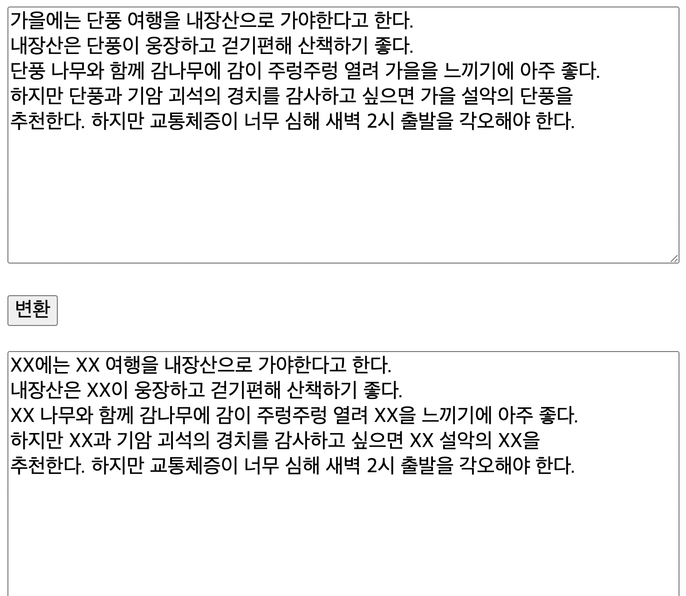

# JavaScript

## 객체

### 속성과 메소드

- 배열 내부에 있는 값 : 요소 / 객체 내부의 값 : 속성
- 객체의 속성중 자료의 처리하는 속성을 메서드라 부른다.
- 메소드 내에서 자신의 속성을 출력하고 싶을 때는 this 키워드 사용.

```html
<!DOCTYPE html>
<html lang="en">

<head>
    <meta charset="UTF-8">
    <meta http-equiv="X-UA-Compatible" content="IE=edge">
    <meta name="viewport" content="width=device-width, initial-scale=1.0">
    <title>Document</title>
</head>

<body>
    <p id="demo"></p>

    <script>
        // 속성과 메소드 1
        /* 
        let person = {
            firstName: "John",
            lastName: "Doe",
            id: 5566,
            fullName: function () {
                return `${this.firstName} ${this.lastName}`;
            }
        }; 
        */

        /*
        document.getElementById("demo").innerHTML = person.fullName();
        */

        // 속성과 메소드 2 
        let person = {
            name: '홍길동',
            eat: function (food) {
                alert(this.name + '이 ' + food + '을/를 먹습니다.');
            }
        };

        person.eat('밥');

    </script>
</body>

</html>
```


### 생성자 함수

\- new 키워드로 객체를 생성할 수 있는 함수를 의미한다.
\- new 키워드 없이 객체를 생성하면 생성자 함수라 할 수 없다.
\- this 키워드로 객체의 속성과 함수에 접근한다.

```html
<!DOCTYPE html>
<html lang="en">

<head>
    <meta charset="UTF-8">
    <meta http-equiv="X-UA-Compatible" content="IE=edge">
    <meta name="viewport" content="width=device-width, initial-scale=1.0">
    <title>Document</title>
</head>

<body>
    <p id="demo"></p>

    <script>
        // 생성자 함수
        function Person(first, last, age, eye) {
            this.firstName = first;
            this.lastName = last;
            this.age = age;
            this.eyeColor = eye;
        }

        let myFather = new Person("John", "Doe", 50, "blue");
        let myMother = new Person("Sally", "Rally", 48,"green");

        document.getElementById("demo").innerHTML =
                'My father is ' + myFather.age + ". My mother is " + myMother.age;

    </script>
</body>
</html>
```


\- 객체에 속성과 함수 추가
\- 두개의 객체를 생성할 경우 하나의 객체에만 추가될 수있다.
 아래 예제에서는 myFather객체에만 추가된다.

// myFather.nationality , myFather.name = function(){}

```html
<!DOCTYPE html>
<html lang="en">

<head>
    <meta charset="UTF-8">
    <meta http-equiv="X-UA-Compatible" content="IE=edge">
    <meta name="viewport" content="width=device-width, initial-scale=1.0">
    <title>Document</title>
</head>

<body>
    <p id="demo"></p>

    <script>
        // 생성자 함수
        function Person(first, last, age, eye) {
            this.firstName = first;
            this.lastName = last;
            this.age = age;
            this.eyeColor = eye;
        }

        let myFather = new Person("John", "Doe", 50, "blue");
        let myMother = new Person("Sally", "Rally", 48,"green");

        myFather.nationality = "English";
        myFather.name = function(){
            return this.firstName + ", " + this.lastName;
        }

        document.getElementById("demo").innerHTML =
                'My father is ' + myFather.name();


    </script>
</body>
</html>
```


### 프로토 타입

\- 프로토타입은 생성자함수로 생성된 객체가 공통으로 가지는 공간이다.
\- 프로토타입을 사용하지 않고 메소드를 만들경우는 객체가 생성될때 마다 속성과 동일한 함수를 계속 만들어 자료수가 많아지면 쓸데없이 메모리를 잡아 비효율이 된다.

\- 프로토타입으로 속성 및 메소드 생성

```html
<!DOCTYPE html>
<html lang="en">

<head>
    <meta charset="UTF-8">
    <meta http-equiv="X-UA-Compatible" content="IE=edge">
    <meta name="viewport" content="width=device-width, initial-scale=1.0">
    <title>Document</title>
</head>

<body>
    <p id="demo"></p>

    <script>
        // 생성자 함수
        function Person(first, last, age, eye) {
            this.firstName = first;
            this.lastName = last;
            this.age = age;
            this.eyeColor = eye;
        }

        Person.prototype.nationality = "English";
        Person.prototype.name = function(){
            return this.firstName + ", " + this.lastName;
        };

        let myFather = new Person("John", "Doe", 50, "blue");
        let myMother = new Person("Sally", "Rally", 48,"green");


        document.getElementById("demo").innerHTML =
                'My father is ' + myFather.name() + '<br> My mother is ' + myMother.name();


    </script>
</body>
</html>
```


### 클래스 사용

-- index.html

```html
<!--index.html-->
<!DOCTYPE html>
<html lang="en">
<head>
    <meta charset="UTF-8">
    <meta http-equiv="X-UA-Compatible" content="IE=edge">
    <meta name="viewport" content="width=device-width, initial-scale=1.0">
    <title>Document</title>
    <script src='object/class.js'></script>
</head>
<body>
</body>
</html>
```

-- class.js

```js
'use strict';
//class : template
//object : instance of a class

//class declarations
class Person {
    //constructor
    constructor(name, age) {
        //fields
        this.name = name;
        this.age = age;
    }

    //methods
    speak() {
        console.log(`${this.name}: hello! `);
    }
}

const hong = new Person('hong', 20);
console.log(hong.name)
console.log(hong.age);
hong.speak();
```


## 배열 생성 및 사용, 배열 메소드, 배열 Sort

### 배열(Array) 생성 및 사용

\- new Array() 생성자로 배열생성
\- 한개의 요소만으로 배열생성시 undefined 발생

```js
 var array = new Arrray(12,20);
 array[0] : 12 
 array[1] : 20
 var array  = new Array(12); 
 array[0] : undefined //잘못된 결과값 발생
```

 -- array.html

```html
<!DOCTYPE html>
<html lang="en">

<head>
    <meta charset="UTF-8">
    <meta http-equiv="X-UA-Compatible" content="IE=edge">
    <meta name="viewport" content="width=<device-width>, initial-scale=1.0">
    <title>Document</title>
</head>

<body>
    <p id='demo'></p>
    <script>
        /*
        let person = { firstName: "John", lastName: "Doe", age: 46 };
        document.getElementById("demo").innerHTML = person["firstName"];
        document.getElementById("demo").innerHTML =
person['firstname'] + ": " + person; 
*/
        let fruits, text, flen, i;
        fruits = ["Banana", "Orange", "Apple", "Mango"];
        flen = fruits.length;
        text = "<ul>";

        //for
        for (i = 0; i < flen; i++) {
            text += '<li>' + fruits[i] + "</li>";
        }

        // for of
        for(let fruit of fruits){
            console.log(fruit);
        }

        // forEach
        fruits.forEach((fruit) => console.log(fruit));

        text += '</ul>';
        document.getElementById("demo").innerHTML = text;

    </script>
</body>

</html>
```


### 배열의 메소드

\- toString() : 배열의 값을 comma로 구분된 하나의 String값으로 변환

\- join() : toString()와 같은 역할을 하지만 특별한 구분자를 사용할 수 있다.

```html
<!DOCTYPE html>
<html lang="en">

<head>
    <meta charset="UTF-8">
    <meta http-equiv="X-UA-Compatible" content="IE=edge">
    <meta name="viewport" content="width=<device-width>, initial-scale=1.0">
    <title>Document</title>
</head>

<body>
    <p id='demo'></p>
    <script>
        
        let fruits, text, flen, i;
        fruits = ["Banana", "Orange", "Apple", "Mango"];
        flen = fruits.length;

        document.getElementById("demo").innerHTML = fruits.toString();
        document.getElementById("demo").innerHTML = fruits.join(' * ');
    </script>
</body>

</html>
```

---

\- push() : push는 배열의 마지막 요소로 추가되며 추가후 배열의 길이를 가져옴

```html
<!DOCTYPE html>
<html lang="en">
<head>
    <meta charset="UTF-8">
    <meta http-equiv="X-UA-Compatible" content="IE=edge">
    <meta name="viewport" content="width=device-width, initial-scale=1.0">
    <title>Document</title>
</head>
<body>
    <p>The push method returns the new array length.</p>
    
    <button onclick="myFunction()">Try it</button>
    
    <p id="demo"></p>
    
    <script>
        let fruits = ["Banana", "Orange", "Apple", "Mango"];
        document.getElementById('demo').innerHTML = fruits;

        function myFunction() {
            console.log(fruits.push("Kiwi"));
            document.getElementById('demo').innerHTML = fruits;
        }
    </script>
</body>
</html>
```

\- pop() : pop은 배열의 마지막 요소값을 삭제하며 삭제한 값을 가져옴

```html
<!DOCTYPE html>
<html lang="en">
<head>
    <meta charset="UTF-8">
    <meta http-equiv="X-UA-Compatible" content="IE=edge">
    <meta name="viewport" content="width=device-width, initial-scale=1.0">
    <title>Document</title>
</head>
<body>
    <p>The push method returns the new array length.</p>
    
    <button onclick="myFunction()">Try it</button>
    
    <p id="demo"></p>
    
    <script>
        let fruits = ["Banana", "Orange", "Apple", "Mango"];
        document.getElementById('demo').innerHTML = fruits;

        function myFunction() {
            // console.log(fruits.push("Kiwi"));
            console.log(fruits.pop());
            document.getElementById('demo').innerHTML = fruits;
        }
    </script>
</body>
</html>
```

---

\- unshift() : 배열의 첫번째 요소에 값을 추가하며 배열의 길이를 리턴
\- shift() : 배열 첫번째 요소값을 제거하며 제거된 값을 가져온다.

```html
<!DOCTYPE html>
<html lang="en">
<head>
    <meta charset="UTF-8">
    <meta http-equiv="X-UA-Compatible" content="IE=edge">
    <meta name="viewport" content="width=device-width, initial-scale=1.0">
    <title>Document</title>
</head>
<body>
    <p>The push method returns the new array length.</p>
    
    <button onclick="myFunction()">Try it</button>
    
    <p id="demo"></p>
    
    <script>
        let fruits = ["Banana", "Orange", "Apple", "Mango"];
        document.getElementById('demo').innerHTML = fruits;

        function myFunction() {
            // console.log(fruits.unshift("Lemon"));
            console.log(fruits.shift());
            document.getElementById('demo').innerHTML = fruits;
        }
    </script>
</body>
</html>
```

\- 배열 요소값 추가

```html
<!DOCTYPE html>
<html lang="en">
<head>
    <meta charset="UTF-8">
    <meta http-equiv="X-UA-Compatible" content="IE=edge">
    <meta name="viewport" content="width=device-width, initial-scale=1.0">
    <title>Document</title>
</head>
<body>
    <p>The push method returns the new array length.</p>
    
    <button onclick="myFunction()">Try it</button>
    
    <p id="demo"></p>
    
    <script>
        let fruits = ["Banana", "Orange", "Apple", "Mango"];
        document.getElementById('demo').innerHTML = fruits;

        function myFunction() {
            console.log(fruits[fruits.length] = 'kiwi');
            document.getElementById('demo').innerHTML = fruits;
        }
    </script>
</body>
</html>
```

\- splice() : item을 지정된 위치에서 지운다.
\- splice(start:number, deleteCount?:number, 추가될 요소값:string[]) : string[] 

deleteCount? 옵션으로 생략가능, 생략하면 추가될 요소가 하나 지워진다.

```html
<!DOCTYPE html>
<html lang="en">
<head>
    <meta charset="UTF-8">
    <meta http-equiv="X-UA-Compatible" content="IE=edge">
    <meta name="viewport" content="width=device-width, initial-scale=1.0">
    <title>Document</title>
</head>
<body>
    <p>The push method returns the new array length.</p>
    
    <button onclick="myFunction()">Try it</button>
    
    <p id="demo"></p>
    
    <script>
        let fruits = ["Banana", "Orange", "Apple", "Mango"];
        document.getElementById('demo').innerHTML = fruits;

        function myFunction() {
            console.log(fruits.splice(2, 0, "Lemon", "Kiwi"));
            document.getElementById('demo').innerHTML = fruits;
        }
    </script>
</body>
</html>
```

```html
<!DOCTYPE html>
<html lang="en">
<head>
    <meta charset="UTF-8">
    <meta http-equiv="X-UA-Compatible" content="IE=edge">
    <meta name="viewport" content="width=device-width, initial-scale=1.0">
    <title>Document</title>
</head>
<body>
    <p>The push method returns the new array length.</p>
    
    <button onclick="myFunction()">Try it</button>
    
    <p id="demo"></p>
    
    <script>
        let fruits = ["Banana", "Orange", "Apple", "Mango"];
        document.getElementById('demo').innerHTML = fruits;

        function myFunction() {
            fruits.splice(0,1);
						document.getElementById('demo').innerHTML = fruits;
        }
    </script>
</body>
</html>
```

\- concat() : 두개 또는 이상의 배열을 연결해서 새로운 배열을 만들어냄

```html
<!DOCTYPE html>
<html lang="en">
<head>
    <meta charset="UTF-8">
    <meta http-equiv="X-UA-Compatible" content="IE=edge">
    <meta name="viewport" content="width=device-width, initial-scale=1.0">
    <title>Document</title>
</head>

<body>
    <p id="demo"></p>

    <script>
        var myGirls = ["Cecilie", "Lone"];
        var myBoys = ["Emil", "Tobias", "Linus"];
        let myChildren = myGirls.concat(myBoys);

        document.getElementById("demo").innerHTML = myChildren;
    </script>
</body>
</html>
```

```html
<!DOCTYPE html>
<html lang="en">
<head>
    <meta charset="UTF-8">
    <meta http-equiv="X-UA-Compatible" content="IE=edge">
    <meta name="viewport" content="width=device-width, initial-scale=1.0">
    <title>Document</title>
</head>

<body>
    <p id="demo"></p>

    <script>
        var myGirls = ["Cecilie", "Lone"];
        var myBoys = ["Emil", "Tobias", "Linus"];
        var arr3 = ["Robin", "Morgan"];

        let myChildren = myGirls.concat(myBoys, arr3);

        document.getElementById("demo").innerHTML = myChildren;
    </script>
</body>
</html>
```


\- slice() :기존 배열에서 잘라내서 새로운 배열로 만들어냄
 slice(시작인덱스,끝인덱스(포함되지 않음))

```html
<!DOCTYPE html>
<html lang="en">
<head>
    <meta charset="UTF-8">
    <meta http-equiv="X-UA-Compatible" content="IE=edge">
    <meta name="viewport" content="width=device-width, initial-scale=1.0">
    <title>Document</title>
</head>
<body>
    <p>The push method returns the new array length.</p>
    
    <button onclick="myFunction()">Try it</button>
    
    <p id="demo"></p>
    
    <script>
        let fruits = ["Banana", "Orange", "Lemon", "Apple", "Mango"];
        document.getElementById('demo').innerHTML = fruits + '<br>' + fruits.slice(3);
      //  document.getElementById('demo').innerHTML = fruits + '<br>' + fruits.slice(1, 3);

        function myFunction() {
            document.getElementById('demo').innerHTML = fruits;
        }
    </script>
</body>
</html>
```


### 배열 정렬

 \- sort() : 오름차순으로 정렬해줌

```html
<!DOCTYPE html>
<html lang="en">
<head>
    <meta charset="UTF-8">
    <meta http-equiv="X-UA-Compatible" content="IE=edge">
    <meta name="viewport" content="width=device-width, initial-scale=1.0">
    <title>Document</title>
</head>
<body>
    <p>The push method returns the new array length.</p>
    
    <button onclick="myFunction()">Try it</button>
    
    <p id="demo"></p>
    
    <script>
        let fruits = ["Banana", "Orange", "Lemon", "Apple", "Mango"];
        document.getElementById('demo').innerHTML = fruits;
        // + '<br>' + fruits.slice(1, 3);

        function myFunction() {
            // console.log(fruits.push("Kiwi"));
            // console.log(fruits.pop());
            // console.log(fruits.unshift("Lemon"));
            // console.log(fruits.shift());
            // console.log(fruits[fruits.length] = 'kiwi');
            // console.log(fruits.splice(2, 0, "Lemon", "Kiwi"));
            // fruits.splice(0,1);
            fruits.sort();
            document.getElementById('demo').innerHTML = fruits;
        }
    </script>
</body>
</html>
```

\- 숫자 배열 sort

```html
<!DOCTYPE html>
<html lang="en">
<head>
    <meta charset="UTF-8">
    <meta http-equiv="X-UA-Compatible" content="IE=edge">
    <meta name="viewport" content="width=device-width, initial-scale=1.0">
    <title>Document</title>
</head>
<body>
    <p>The push method returns the new array length.</p>
    
    <button onclick="myFunction()">Try it</button>
    
    <p id="demo"></p>
    
    <script>
        // let fruits = ["Banana", "Orange", "Lemon", "Apple", "Mango"];
        var fruits = [1, 8, 5, 4];
        document.getElementById('demo').innerHTML = fruits;

        function myFunction() {

            fruits.sort();
            document.getElementById('demo').innerHTML = fruits;
        }
    </script>
</body>
</html>
```

\- reverse

```html
<!DOCTYPE html>
<html lang="en">
<head>
    <meta charset="UTF-8">
    <meta http-equiv="X-UA-Compatible" content="IE=edge">
    <meta name="viewport" content="width=device-width, initial-scale=1.0">
    <title>Document</title>
</head>
<body>
    <p>The push method returns the new array length.</p>
    
    <button onclick="myFunction()">Try it</button>
    
    <p id="demo"></p>
    
    <script>
        // let fruits = ["Banana", "Orange", "Lemon", "Apple", "Mango"];
        var fruits = [1, 8, 5, 4];
        document.getElementById('demo').innerHTML = fruits;

        function myFunction() {
            fruits.reverse();
            document.getElementById('demo').innerHTML = fruits;
        }
    </script>
</body>
</html>
```


### 실습 예제

입력된 문장에 금지어가 있는 경우 금지어를 추출하여 출력 후 원본 문자열도

출력하는 스크립트를 작성하세요.

[조건]

\- 태그는 <TEXTAREA>와 <INPUT TYPE='button'>만을 사용합니다.

\- indexOf() 함수를 활용.

```
[실행 결과]

원본문자열:

   가을에는 단풍 여행을 내장산으로 가야한다고 한다.

   내장산은 단풍이 웅장하고 걷기편해 산책하기 좋다.

   단풍 나무와 함께 감나무에 감이 주렁주렁 열려 가을을 느끼기에 아주 좋다.

   하지만 단풍과 기암 괴석의 경치를 감사하고 싶으면 가을 설악의 단풍을

   추천한다. 하지만 교통체증이 너무 심해 새벽 2시 출발을 각오해야 한다.  

수정 문자열: 

   XX에는 XX 여행을 내장산으로 가야한다고 한다.

   내장산은 XX이 웅장하고 걷기편해 산책하기 좋다.

   XX 나무와 함께 감나무에 감이 주렁주렁 열려 XX을 느끼기에 아주 좋다.

   하지만 XX과 기암 괴석의 경치를 감사하고 싶으면 XX 설악의 XX을

   추천한다. 하지만 교통체증이 너무 심해 새벽 2시 출발을 각오해야 한다. 
```

-- exam01.html

```html
<!DOCTYPE html>
<html lang="en">
<head>
    <meta charset="UTF-8">
    <meta http-equiv="X-UA-Compatible" content="IE=edge">
    <meta name="viewport" content="width=device-width, initial-scale=1.0">
    <title>Document</title>
    <style type="text/css">
        * {
            font-family: gulim;
            font-size: 22px;
        }
    </style>
    <script>
        function check() {
            let f = document.frm; // frm : form name
            let str = f.data.value;
            // console.log(str);

            let warning = ["가을", "단풍"];   // 금지어

            // javascript는 (java)replaceAll()이 없음으로 직접 구현
            for (let i = 0; i < warning.length; i++) {  // 금지어 수 만큼 순환
                let sw = true;               

                while (sw) {
                    let index = str.indexOf(warning[i]);   // 금지어 검색
                    if (index >= 0) {  // 발견 안되면 -1
                        // alert('index: ' + index);
                        str = str.replace(warning[i], "XX"); // 금지어 변경
                    } else {
                        sw = false; // 단어가 없을 경우 순환 중지
                    }
                }
            }
            // document.getElementById("panel").innerHTML = str; // 출력
            f.panel.value = str;
            
        }
    </script>
</head>
<body>
    <form name='frm'>
        <textarea name='data' rows='10' cols='70'>
가을에는 단풍 여행을 내장산으로 가야한다고 한다.
내장산은 단풍이 웅장하고 걷기편해 산책하기 좋다.
단풍 나무와 함께 감나무에 감이 주렁주렁 열려 가을을 느끼기에 아주 좋다.
하지만 단풍과 기암 괴석의 경치를 감사하고 싶으면 가을 설악의 단풍을
추천한다. 하지만 교통체증이 너무 심해 새벽 2시 출발을 각오해야 한다.  
        </textarea>
        <br><br>
        <input type='button' value='변환' onclick="check();">

        <br><br>
        <textarea name='panel' rows='10' cols='70'></textarea>
    </form>
</body>
</html>
```

-- Output




## BUTTON, SUBMIT 태그의 Event 처리

### Event의 처리(BUTTON, SUBMIT) 

\- `<a href="javascript:sendit();">`에서 javascript 생략 불가능.

#### 1. Anchor 태그에서 click 이벤트를 받는 소스

-- /event/event.html

-- Upgrade: [주소 이동] 버튼을 추가하여 주소 이동을 하는 기능 구현

```html
<!--event.html-->
<!DOCTYPE html>
<html lang="en">
<head>
    <meta charset="UTF-8">
    <meta http-equiv="X-UA-Compatible" content="IE=edge">
    <meta name="viewport" content="width=device-width, initial-scale=1.0">
    <title>Document</title>
    <style type="text/css">
        * {
            font-family: gulim;
            font-size: 22px;
        }
    </style>
    <script>
        function sendit() {
            let str = document.getElementById("url").value; //id 로 검색 
            console.log(`str : ${str}`);

            if (str == "") {
                alert("주소를 입력해 주세요");
                document.regiform.url.focus(); // 마우스 커서 
                // name속성으로 검색 
            } else {
                location.href = str;     // location 객체: 주소 관련 객체, href: 주소 값, 이동
            }
        }
    </script>
</head>

<body>
<form name='regiform'>
    <!-- id  : 태그 검색시 자바 스크립트가 사용, document.getElementById('url');
         name: request.getParameter("url") -->
    <input type="text" id="url" name="url" size="50">
    <a href="javascript: sendit();">주소 이동</a>
		<!-- <button type="button" onclick="sendit()">주소 이동</button> -->
</form>
</body>
</html>
```


-- Upgrade: 'http://' 이 문자열이 없으면 주소 이동이 안됨으로, 입력이 없을시 자동으로 주소가 추가되도로 해주세요

-- Upgrade:  미리 버튼에 [DAUM], [기상청], [교보문고]를 준비하여 클릭시 주소가 자동으로 입력창에 할당 되도록 하기


#### 2. 입력값을 검사하는 기본 자바 스크립트

- button 태그는 항상 자바스크립트 함수와 같이 사용된다.

  \- onClick='check(this.form)': this.form -> 폼 태그

- SUBMIT 버튼의 사용

    \- reset: 태그의 기본 값으로 돌아감.

    \- submit: 서버로 폼의 내용을 전송함.

   \- onsubmit: submit 버튼이 작동되면 자동으로 호출됨.

- image는 submit 과 같은 기능 + 버튼 이미지를 사용할 수 있음.

```html
<!DOCTYPE html>
<html lang="en">

<head>
    <meta charset="UTF-8">
    <meta http-equiv="X-UA-Compatible" content="IE=edge">
    <meta name="viewport" content="width=device-width, initial-scale=1.0">
    <title>Document</title>
    <style type="text/css">
        * {
            font-family: gulim;
            font-size: 22px;
        }
    </style>
    <script>
        function check(f) {
            if (f.wname.value == '' || f.wname.value.length == 0) {
                alert("이름을 입력하세요");
                f.wname.focus();
                // return false; // button이 submit기능을 가지고 있을 때 작성
            } else if (f.subject.value.length == 0) {
                alert("제목을 입력하세요");
                f.subject.focus();
                // return false; // button이 submit기능을 가지고 있을 때 작성
            } else if (f.wcontent.value == "" || f.wcontent.value.length == 0) {
                alert("내용을 입력하세요");
                f.wcontent.focus();
                // return false; // button이 submit기능을 가지고 있을 때 작성
            } else {
                // 모든 데이터를 입력 한 경우 서버로 전송
                alert("데이터 정상 입력, 계속 진행합니다.");
                f.submit(); // button이 submit 기능이 없을 때 호출
            }
        }

    </script>
</head>

<body>
    <!-- 데이터 입력 형식 제공 -->
    <form method='post' action='' name='myform' onsubmit="return check(this)">
        <h2>방명록</h2>
        이름 : <input name="wname" type="text"> <br>
        제목 : <input name="subject" type="text" size="50"> <br>
        내용 : <textarea name='wcontent' rows='8' cols='54'></textarea> <br>
        <!--<button type="button" onclick="check(this.form)">저장</button>-->
        <!--<button>저장</button> --><!--submit 버튼-->
        <!--<button type='image' src='./disks.jpg' width="50px"></button>-->
        <a href="javascript:check(myform)">
            
        </a>


    </form>
</body>
</html>
```


## CHECKBOX, RADIO 태그의 Event 처리

### Event의 처리 (CHECKBOX, RADIO)

   \- 입력 값의 범위 지정.

   \- 사용자는 시각적인 인터페이스로 사용이 편리.

#### split()함수를 이용 - 입력된 값을 분리하여 출력하는 스크립트 작성

 \- onload event: 페이지 로딩시 자동실행 함수 선언, body tag 실행 후 실행

 \- 자바스크립트를 BODY태그 안에서 호출시 결과가 body tag 안에 들어감

```html
<!DOCTYPE html>
<html lang="en">

<head>
    <meta charset="UTF-8">
    <meta http-equiv="X-UA-Compatible" content="IE=edge">
    <meta name="viewport" content="width=device-width, initial-scale=1.0">
    <title>Document</title>
    <style type="text/css">
        * {
            font-family: gulim;
            font-size: 22px;
        }
    </style>
    <script>
        function searchW() {
            let str = '기획자/설계자/개발자/디자이너';
            let strout = '';
            let strSplit = str.split('/');
            console.log(`추출된 문자열 갯수:  ${strSplit.length}`);
            for (let i = 0; i < strSplit.length; i++) {
                strout += '▶ ' + strSplit[i] + ' ';
            }
            let panel = document.getElementById('panel');
            panel.innerHTML = strout;
        }
    </script>
</head>

<body onload="searchW()">

    <div id='panel'></div>

</body>
</html>
```


#### 파일의 확장자를 검사하는 함수

  \- 아래의 자바스크립트를 호출하는 HTML을 작성하세요.

  \- 검색이되면 0보다 크거나 같은 값이 나오고 발견이 안되면 -1을 리턴함.

```
```


