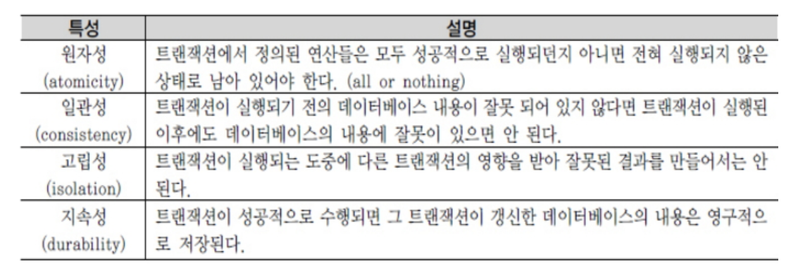
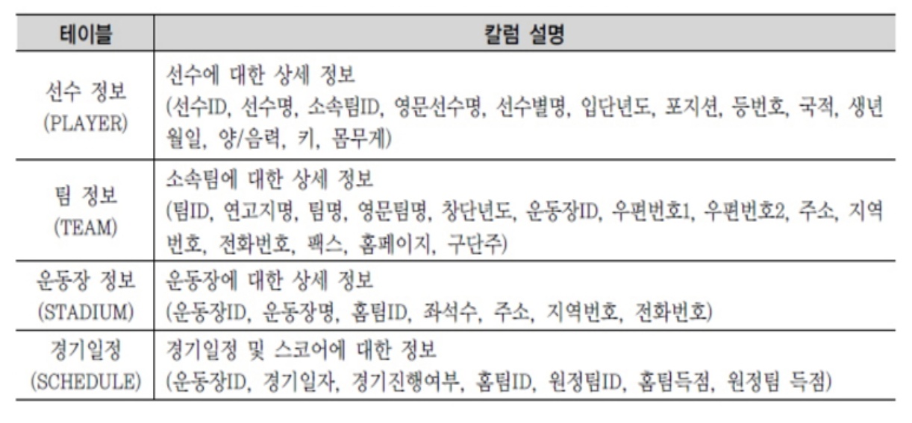
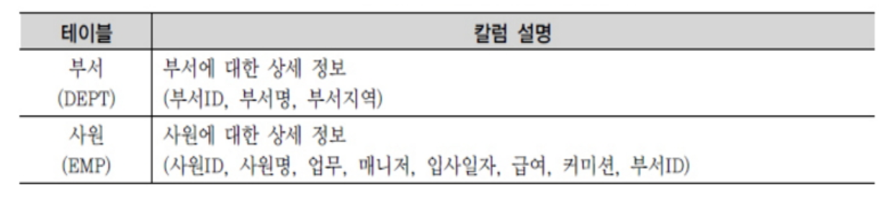
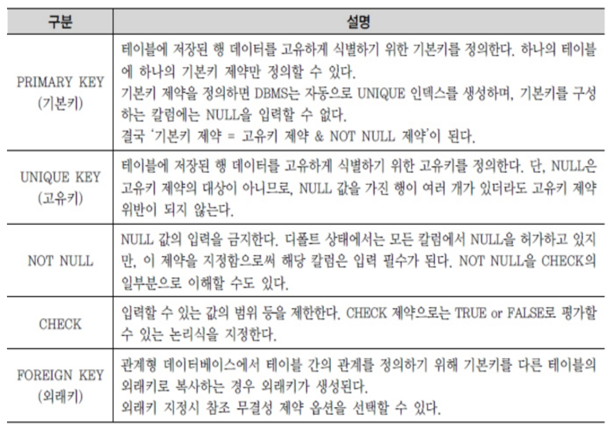
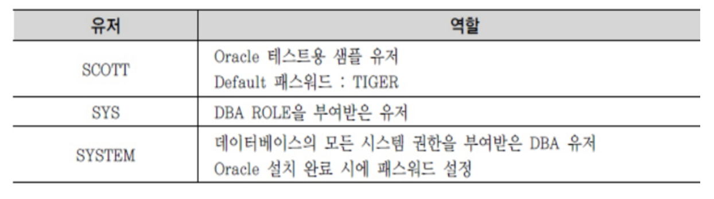

## DML

: DATA MANIPULATION LANGUAGE

1. INSERT

(1) 단일 행 INSERT문

단일 행 INSERT문은 VALUES절을 포함하며, 한 번에 한 건만 입력된다.

```sql
INSERT INTO 테이블명 [(컬럼1, 칼럼2, .......)] VALUES (값1, 값2, ....)
```

특징

- 칼럼명과 VALUES 절의 값을 서로 1:1로 매핑해 기술한다.
- PRIMARY KEY 제약 또는 NOT NULL 제약이 지정된 칼럼은 NULL값 입력을 허용하지 않아, 오류가 발생.
-  해당 칼럼의 데이터유형이 CHAR, VARCHAR 일 경우 '' 함께 값을 입력한다.

-  INTO 절의 칼럼명은 생략 할 수 있다. 
- INTO절 칼럼명을 지정하지 않는 경우, 테이블에 정의된 칼럼순서 대로 VALUES 절에 모든값을 빠짐없이 기술해야 함.
- INTO 절의 칼럼명을 지정하는 편이 쿼리의 안정성 측면에서 바람직.

(2) 서브쿼리를 이용한 다중 행 INSERT

- INSERT 문에 서브쿼리 사용하면 서브쿼리의 결과를 테이블에 입력 가능
- 서브쿼리의 결과가 다중행이면 한 번에 여러 건이 입력된다.
- INTO 절의 칼럼명 개수와 서브쿼리의 SELECT 절 칼럼 개수가 일치해야 함.


2. UPDATE

UPDATE 다음에 수정되어야 할 칼럼이 존재하는 테이블명을 입력하고 SET 다음 수정되어야 할 칼럼며오가 해당 칼럼에 수정되는 값으로 수정.

```sql
UPDATE  테이블명
SET 수정할 칼럼명1 = 수정될 새로운 값1
[ ,   수정할 칼럼명2 = 수정될 새로운 값2]
[ ,   ............                                      ]
[WHERE 수정 대상 식별 조건식 ];
 
```

(1) UPDATE문의 SET 절에 서브쿼리 사용하기

- 서브쿼리의 결과로 값이 수정됨.
- 서브쿼리의 결과가 NULL을 반환할 경우 수정해야 할 칼럼의 값이 NULL이 될 수 있기 때문에 주의 필요.

(2) UPDATE문의 WHERE절에 서브쿼리 사용하기

- 수정될 행을 식별해 불필요한 수정 방지.

```sql
UPDATE  STADIUM A
SET (A.DDD, A.TEL) = (SELECT  X.DDD, X.TEL
                      FROM  TEAM X
                       WHERE  X.TEAM_ID = A.HOMETEAM_ID)
WHERE  EXISTS (SELECT 1
               FROM TEAM X
               WHERE X.TEAM_ID = A.HOMETEAM_ID) ;
```

- 앞의 UPDATE문 TEAM 테이블을 2번 조회하는 비효율이 있다.
   MERGE문을 사용하면 TEAM 테이블을 1번 조회하여 데이터를 수정할 수 있다.

```sql
MERGE
INTO STADIUM T
USING TEAM S
	ON (T.HOMETEAM_ID = S.TEAM_ID )
WHEN MATCHED THEN
	UPDATE
	SET T.DDD = S.DDD,
			T.TEL = S.TEL;
```


3. DELETE

- 테이블의 정보가 필요없게 된 경우 데이터 삭제 수행
- DELETE FROM 테이블명을 입력, 실행.
- WHERE 절을 사용하지 않는다면 테이블의 전체 데이터가 삭제된다.

```sql
DELETE  [FROM]  테이블명
[WHERE  삭제 대상 식별 조건식];
```

(1) DELETE 문의 WHERE 절에 서브쿼리 사용

- 다른 테이블을 참조해 삭제할 행을 식별할 수 있다.


4. MERGE

- 새로운 행을 입력하거나, 기존 행을 수정하는 작업을 한 번에 할 수 있다.
- MERGE 다음에 입력/수정돼야 할 타겟 테이블 입력, 
   USING 절에 입력/수정에 사용할 소스 테이블 입력.
   ON 절에는 타겟 테이블과 소스테이블간의 조인 조건식을 기술해, 입력/수정할 대상 결정.
- ON 절의 조인 조건에 따라 조인에 성공한 행들에 대해서는 WHEN MATHCED THEN 아래 UPDATE구문을 수행하고, 조인에 실패한 행들에 대해 WHEN NOT MATHCED THEN 아래 INSERT구문을 수행.

```sql
MERGE
INTO 타겟 테이블명
	USING 소스 테이블명    
		ON (조인 조건식)
	WHEN MATCHED THEN
		UPDATE
			SET  수정할 칼럼명1 = 수정될 새로운 값1
					[ ,     수정할 칼럼명2 = 수정될 새로운 값2, ....]
	WHEN NOT MATCHED THEN
		INSERT [(칼럼1, 칼럼2, .....)]
		VALUES (값1, 값2, .....,)
	;
```


[예제]MERGE 문을 자세히 설명하기 위해 TEAM_TMP 테이블을 임시로 만든다. NVL2 함수는 null이 아닌경우 지정값1을 출력하고, null인 경우 지정값2을 출력 한다.
\- 함수 : **NVL2(**"값", "지정값1", "지정값2"**)**

```sql
CREATE TABLE TEAM_TMP AS
SELECT NVL(B.TEAM_ID, 'K' ||
           ROW_NUMBER() OVER (ORDER BY B.TEAM_ID, A.STADIUM_ID)) AS TEAM_ID
        ,  SUBSTR(A.STADIUM_NAME, 1, 2) AS REGION_NAME
        ,  SUBSTR(A.STADIUM_NAME, 1, 2) || NVL2(B.TEAM_NAME, 'FC', '시티즌') AS TEAM_NAME
        ,  A.STADIUM_ID, A.DDD, A.TEL
  FROM STADIUM A, TEAM B
 WHERE B.STADIUM_ID(+) = A.STADIUM_ID;
```

(  **예제 때문에 참고**

ROW_NUMBER 함수 (윈도우 함수 - 그룹 내 순위 함수)

-  ROW_NUMBER 함수는 RANK나 DENSE_RANK 함수가 동일한 값에 대해서는 동일한 순위를 부여하는데 반해, 동일한 값이라도 고유한 순위를 부여한다.

)

### DDL과 DML 처리 방식

- DDL(CREATE, ALTER, RENAME, DROP) 명령어의 경우,데이터 구조 변경이 DDL 명령어 수행이 완료됨과 동시에 즉시 반영된다.
- DML(INSERT, UPDATE, DELETE, SELECT) 명령어 사용 시 데이터 변경 사항을 테이블에 영구적으로 저장하기 위해서는 COMMIT 명령어를 수행해 TRANSACTION을 종료해야 한다.


## TCL

### 1. 트랜잭션 

TRANSACTION

- 데이터베이스의 논리적 연산단위.
- 밀접히 관련돼 분리될 수 없는 한 개 이상의 데이터베이스 조작.
- 하나의 트랜잭션에는 하나 이상의 SQL 문장이 포함된다.
- 분할할 수 없는 최소의 단위. 그러므로 전부 적용하거나 전부 취소.
- 은행에서의 계좌이체 상황을 연상하면 트랜잭션을 이해하는데 도움이 됨.
- 계좌이체는 최소한 두 가지 이상의 작업으로 이루어져 있다. 

(1) 계좌이체 사례

STEP1. 100번 계좌의 잔액에서 10,000원을 뺀다. 
STEP2. 200번 계좌의 잔액에 10,000원을 더한다.

- 계좌이체라는 작업 단위는 이런 두 개의 업데이트가 모두 성공적으로
   완료되었을 때 종료된다.
- 둘 중 하나라도 실패할 경우 계좌이체는 원래의 금액을 유지하고 있어야만 한다.
- 만약 어떠한 장애에 의해 어느 쪽이든 한 쪽만 실행했을 경우, 이체금액은 어디로 증발해 버렸거나 마음대로 증가하게 된다.
- 이런 경우 수정을 취소하여 원 상태로 되돌려야 한다. 
- 계좌이체와 같은 하나의 논리적인 작업 단위를 구성하는 세부적인 연산들의 집합을 트랜잭션이라 한다.

(2) 트랜잭션을 제어 명령어 TCL(TRANSACTION CONTROL LANGUAGE) 

- 커밋(COMMIT) : 올바르게 반영된 데이터를 데이터베이스에 반영시키는 것.
- 롤백 (ROLLBACK) : 트랜잭션 시작 이전의 상태로 되돌리는 것.
- 저장점 (SAVEPOINT) : 트랜잭션의 일부만 취소할 수 있게 만드는 명령어.

\- 트랜잭션의 대상은 UPDATE, INSERT, DELETE 등 데이터를 변경하는 DML 문이다.

트랜잭션의 특성



\- 이체가 결정되기 전까지는 다른 사람이 이 계좌의 정보를 변경할 수 없다.
 이것을 잠금(LOCKING)이라고 표현한다.
\- 잠금은 기본적으로 트랜잭션이 수행하는 동안 특정 데이터에 대해서 다른 트랜잭션이 동시에 접근하지 못하도록 제한하는 기법.
\- 잠금이 걸린 데이터는 잠금을 실행한 트랜잭션만 독점적으로 접근할 수 있고
 다른 트랜잭션으로부터 간섭이나 방해를 받지 않는 것이 보장된다.
\- 잠금이 걸린 데이터는 잠금을 수행한 트랜잭션만이 해제할 수 있다.


### 2. COMMIT

입력,수정,삭제한 자료에 대해 전혀 문제가 없다고 판단됐을 경우 COMMIT 명령어를 통해서 트랜잭션을 완료할 수 있다.

■ COMMIT이나 ROLLBACK 이전의 데이터 상태는 다음과 같다.  
 \- 데이터의 변경을 취소해 이전 상태로 복구 가능하다.
 \- 현재 사용자는 SELECT 문장으로 결과를 확인 가능하다.
 \- 다른 사용자는 현재 사용자가 수행한 명령의 결과를 볼 수 없다.
 \- 변경된 행은 잠금(LOCKING)이 설정되어서 다른 사용자가 변경할 수 없다.

※ COMMIT 이후의 데이터 상태는 다음과 같다.
 \- 데이터에 대한 변경 사항이 데이터베이스에 반영된다.
 \- 이전 데이터는 영원히 잃어버리게 된다.
 \- 모든 사용자는 결과를 볼 수 있다.
 \- 관련된 행에 대한 잠금(LOCKING)이 풀리고, 다른 사용자들이 행을 조작할 수 있게 된다.


### 3. ROLLBACK

\- 테이블 내 입력한 데이터나, 수정한 데이터, 삭제한 데이터에 대하여 COMMIT 이전에는 변경 사항을 취소할 수 있는데 데이터베이스에서는 롤백(ROLLBACK) 기능 사용.
\- 롤백(ROLLBACK)은 데이터 변경 사항이 취소돼 데이터가 이전 상태로 복구되며, 관련된 행에 대한 잠금(LOCKING)이 풀리고 다른 사용자들이 데이터 변경을 할 수 있게 된다.

■ COMMIT , ROLLBACK사용으로 다음과 같은 효과를 볼 수 있다.
\- 데이터 무결성 보장
\- 영구적인 변경을 하기 전에 데이터의 변경 사항 확인 가능
\- 논리적으로 연관된 작업을 그룹핑해 처리 가능


### 4. SAVEPOINT

\- 저장점(SAVEPOINT)을 정의하면 롤백(ROLLBACK)할 때 트랜잭션에 포함된 전체 작업을 롤백하는 것이 아니라 현 시점에서 SAVEPOINT까지 트랜잭션의 일부만 롤백할 수 있다.
\- 복잡한 대규모 트랜잭션에서 에러가 발생했을 때 SAVEPOINT까지의 트랜잭션만 롤백하고 실패한 부분에 대해서만 다시 실행할 수 있다.
\- 복수의 저장점을 정의할 수 있으며, 동일이름으로 저장점을 정의했을 때는
 나중에 정의한 저장점이 유효하다.

\- 다음의 SQL문은 SVPT1이라는 저장점을 정의하고 있다.
**SAVEPOINT SVPT1;**

\- 저장점까지 롤백할 때는 ROLLBACK 뒤에 저장점 명을 지정한다.
**ROLLBACK TO SVPT1;**

\- 위와 같이 롤백(ROLLBACK)에 SAVEPOINT 명을 부여하여 실행하면 저장점 설정 이후에 있었던 데이터 변경에 대해서만 원래 데이터 상태로 되돌아간다.

## DDL

DATA DEFINITION LANGUAGE

### 1. CREATE TABLE

(1) 테이블과 컬럼의 정의 
\- 테이블에 존재하는 모든 데이터를 고유하게 식별할 수 있으면서 반드시 값이 존재하는 기본키 칼럼을 지정한다.
\- 선수 테이블을 예로 들면 ‘선수ID’ 칼럼이 기본키로 적당하다.
\- 기본키는 단일 칼럼이 아닌 여러 개의 칼럼으로 구성될 수 있다(복합키).
\- 테이블과 테이블 간에 정의된 관계는 기본키(PRIMARY KEY)와 외부키(FOREIGN KEY)를 활용해서 설정하도록 한다.
\- 이상 현상을 방지하기 위해 팀 정보를 관리하는 팀 테이블을 별도로 분리해서 팀ID와 팀이름을 저장하고, 선수 테이블에서는 팀ID를 외부키로 참조하게 한다. 

■ K-리그 테이블과 컬럼정보



■ 부서-사원 테이블과 컬럼정보



(2) 테이블 생성

\- 테이블 생성 구문

```sql
CREATE　TABLE　테이블이름 (
칼럼명1  DATATYPE  [DEFAULT 값]  [NOT NULL],
칼럼명2  DATATYPE  [DEFAULT 값]  [NOT NULL],
칼럼명2  DATATYPE  [DEFAULT 값]  [NOT NULL],
............
) ;
```

■ 테이블 생성시 주의 할 규칙
 \- 테이블명은 의미있는 이름을 사용한다.
 \- 테이블 명은 다른 테이블의 이름과 중복되지 않아야 한다.
 \- 한 테이블 내에서는 칼럼명이 중복되게 지정될 수 없다.
 \- 테이블 이름을 지정하고 각 칼럼들은 괄호 "( )" 로 묶어 지정한다.
 \- 각 칼럼들은 콤마 ","로 구분되고, 테이블 생성문의 끝은 항상 세미콜론 ";"으로 끝난다.
 \- 칼럼에 대해서는 다른 테이블까지 고려해 데이터베이스 내에서 일관성 있게
  사용한는 것이 좋다(데이터 표준화 관점)
 \- 칼럼 뒤에 데이터 유형은 꼭 지정되어야 한다.
 \- 테이블명과 칼럼명은 반드시 문자로 시작해야 한다.
 \- 벤더에서 사전에 정의한 예약어(Reserved word)는 쓸 수 없다.
 \- A-Z, a-z, 0-9, _, $, # 문자만 허용된다.
 \- 테이블명이 잘못된 사례
  10_PLAYER => 숫자로 시작할 수 없다.
  T-PLAYER  => 특수 문자  '-' 는 사용할 수 없다.

[예제] 팀 테이블 생성

```sql
CREATE TABLE TEAM ( 
TEAM_ID             CHAR(3)                NOT NULL,  --팀ID
REGION_NAME     VARCHAR2(8)         NOT NULL,  --연고지명
TEAM_NAME       VARCHAR2(40)        NOT NULL,  --한글팀명
E_TEAM_NAME     VARCHAR2(50),                       --영문팀명
ORIG_YYYY          CHAR(4),                                --창단년도
STADIUM_ID        CHAR(3)                NOT NULL,  --구장고유ID
ZIP_CODE           CHAR(5),                                --우편번호
ADDRESS           VARCHAR2(80),                        --주소
DDD                 VARCHAR2(3),                          --지역번호
TEL                   VARCHAR2(10),                        --전화번호
FAX                  VARCHAR2(10),                        --팩스번호
HOMEPAGE        VARCHAR2(50),                        --홈페이지
OWNER             VARCHAR2(10),                        --구단주
CONSTRAINT TEAM_PK PRIMARY KEY (TEAM_ID), 
CONSTRAINT TEAM_FK FOREIGN KEY (STADIUM_ID) 
                   REFERENCES STADIUM(STADIUM_ID)
);
```

\- 테이블 생성시 대/소문자 구분은 하지 않는다.
 기본적으로 테이블이나 칼럼명은 대문자로 만들어진다.
\- DATETIME 데이터 유형에는 별도로 크기를 지정하지 않는다.
\- 문자 데이터 유형은 반드시 가질 수 있는 최대 길이를 표시해야 한다.
\- 칼럼과 칼럼의 구분은 콤마로 하되, 마지막 칼럼은 콤마를 찍지 않는다.
\- 칼럼에 대한 제약조건이 있으면 CONSTRAINT를 이용하여 추가할 수 있다.

(3) 제약조건
\- 제약조건(CONSTRAINT)이란 사용자가 원하는 조건의 데이터만 유지하기 위한 즉, 데이터의 무결성을 유지하기 위한 데이터베이스의 보편적인 방법으로 테이블의 특정 칼럼에 설정하는 제약이다.

※ 제약조건의 종류 



■ NULL 의미
 \- NULL(ASCII 코드 00번)은 공백(BLANK, ASCII 코드 32번)이나 숫자 0(ZERO, ASCII 48)과는 전혀 다른 값이며, 조건에 맞는 데이터가 없을 때의 공집합과도 다르다.
 \- ‘NULL’은 ‘아직 정의되지 않은 미지의 값’이거나 ‘아직 데이터가 입력되지 않는 경우’를 의미한다.

■ DEFAULT 의미
 \- 데이터 입력시 칼럼 값을 지정하지 않은 경우에 NULL 값이 입력된다. 사전에 DEFAULT 값을 정의했다면, NULL 값 대신 사전에 정의된 기본  값 (DEFAULT)이 자동으로 입력된다.

(4) 생성된 테이블 구조 확인
 \- DESCRIBE 테이블명 또는 DESC 테이블명으로 정보를 확인할 수 있다.

(5) SELECT 문장으로 테이블 생성 사례
\- SELECT 문장으로 활용해서 테이블을 생성할 수 있는 방법이 있다.
 (CTAS, CREATE TABLE ~ AS SELECT ~)
\- 기존 테이블을 이용한 CTAS 방법을 사용하면 칼럼별로 데이터 유형을 
 다시 정의 하지 않아도 되는 장점이 있다.
\- 주의 할점은 기존 테이블 제약조건 중 NOT NULL제약만 새로 생성되는
 테이블에 적용되고 기본키/고유기/외래키/CHECK 등의 다른 제약 조건은
 없어진다.


### 2. ALTER TABLE

\- 컬럼의 추가/삭제 및 제약조건 추가/삭제를 한다.

(1) ADD COLUMN
 \- 기존 테이블에 필요한 칼럼을 추가하는 명령어이다.

```sql
ALTER  TABLE  테이블명
       ADD(  추가할 컬럼명1 데이터유형  [기본값]  [NOT NULL]
            [ , 추가할 컬럼명1 데이터유형  [기본값]  [NOT NULL]
                     ,  .......] );
```


(2) DROP COLUMN

 \- 테이블에서 필요 없는 칼럼을 삭제할 수 있으며 데이터가 있거나 없거나
  모두 삭제 가능하다.

````sql
ALTER TABLE 테이블명 DROP COLUMN ( 삭제할 칼럼명1 [, 삭제할 칼럼명2, ........] );
````

(3) MODIFY COLUMN
\- 칼럼의 데이터 유형, 디폴트(DEFAULT) 값, NOT NULL 제약조건 변경 

```sql
ALTER  TABLE  테이블명
       MODIFY (  컬럼명1  데이터유형  [기본값]  [NOT NULL]
                 [ , 컬럼명1 데이터유형  [기본값]  [NOT NULL]
                     ,  .......] );
```


■ RENAME COLUMN
\- 테이블 생성시 만들었던 칼럼명을 변경해야 하는 경우 사용한다.

```sql
ALTER TABLE PLAYER RENAME COLUMN PLAYER_ID TO TEMP_ID;
```


 (4) DROP CONSTRAINT

\- 테이블 생성 시 부여했던 제약조건을 삭제하는 명령어 형태는 다음과 같다.

```sql
ALTER TABLE 테이블명 DROP CONSTRAINT 제약조건명;
```

(5) ADD CONSTRAINT

\- 테이블 생성 시 제약조건을 적용하지 않았다면, 생성 이후에 필요에 의해서
 제약조건을 추가할 수 있다. 
\- 다음은 특정 칼럼에 제약조건을 추가하는 명령어 형태이다.

```sql
ALTER TABLE 테이블명 ADD CONSTRAINT 제약조건명 제약조건 (칼럼명);
```


### 3. RENAME TABLE

\- RENAME 명령어를 사용하여 테이블의 이름을 변경할 수 있다.

```sql
RENAME 변경전 테이블명 TO 변경후 테이블명;
```

(5) DROP TABLE

\- 테이블을 잘못 만들었거나 테이블이 더 이상 필요 없을 경우 해당 테이블을
 삭제해야 한다.
\- 다음은 불필요한 테이블을 삭제하는 명령이다.

```sql
DROP TABLE 테이블명 [CASCADE CONSTRAINT];
```

\- DROP 명령어를 사용하면 테이블의 모든 데이터 및 구조를 삭제한다.
 CASCADE CONSTRAINT 옵션은 해당 테이블과 관계가 있었던 참조되는 제약조건에 대해서도 삭제한다는 것 의미.

(6) TRUNCATE TABLE

 \- TRUNCATE TABLE은 테이블 자체가 삭제되는 것이 아니고, 해당 테이블에 들어있던 모든 행들이 제거되고 저장 공간을 재사용 가능하도록 해제한다.
  테이블 구조를 완전히 삭제하기 위해서는 DROP TABLE을 실행하면 된다.

```sql
TRUNCATE TABLE 테이블명;
```


## DCL

### 1. DCL

유저를 생성하고 권한을 제어할 수 있는 명령어

- 유저와 권한

\- 새로운 유저를 생성하고, 생성한 유저에게 **공유할 테이블이나 기타 오브젝트에  대한 접근 권한만을 부여할 수 있다.**
\- 대부분의 데이터베이스는 **데이터 보호와 보안을 위해서 유저와 권한을
 관리**하고 있다.
\- Oracle을 설치하면 기본적으로 제공되는 유저들은 아래와 같다.
\- OracleXE 는 SCOTT/TIGER 계정 없음.



(1) 유저 생성과 시스템 권한 부여

 \- **유저를 생성하고 데이터베이스에 접속한다. 하지만 접속했더라도 테이블, 뷰, 인덱스 등과 같은 오브젝트(OBJECT)를 생성할 수는 없다.**

 \- 사용자가 실행하는 모든 DDL 문장(CREATE, ALTER, DROP, RENAME 등)은 그에 해당하는 적절한 권한이 있어야만 문장을 실행할 수 있다.

 \- 이런 권한을 시스템 권한이라고 하며 약 100개 이상의 종류가 있다.
  100개 이상의 시스템 권한을 일일이 사용자에게 설정하는 것은 너무 복잡하고, 특히 유저로부터 권한을 관리하기 어렵다.

 \- **롤(ROLE)을 이용하여 간편하고 쉽게 권한을 부여**한다.
 \- 새로운 유저를 생성하려면 **유저 생성 권한(CREATE USER)**이 있어야 한다.


