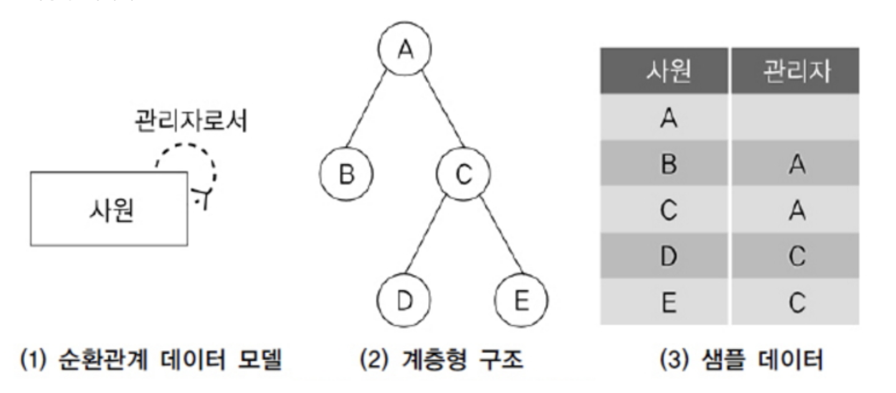
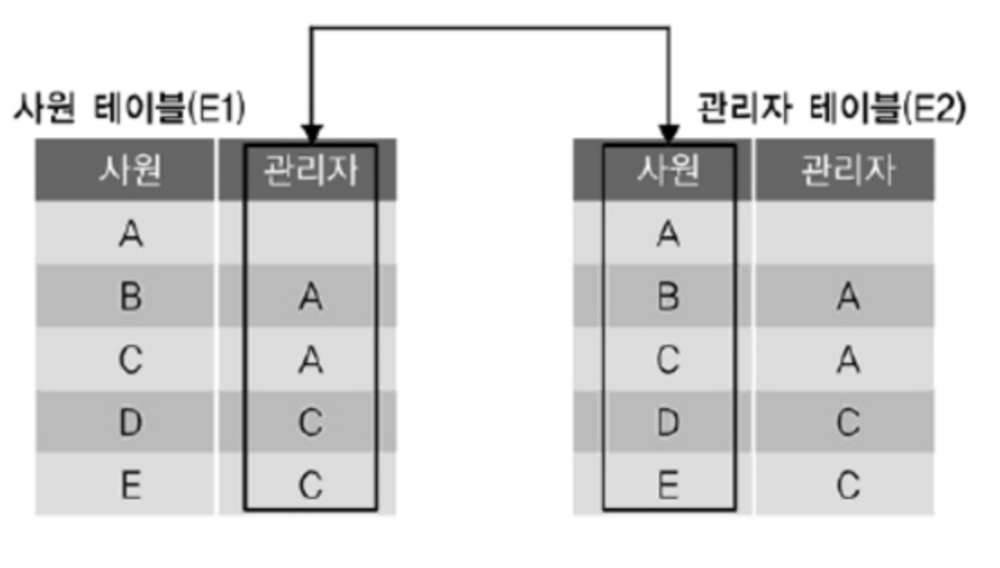
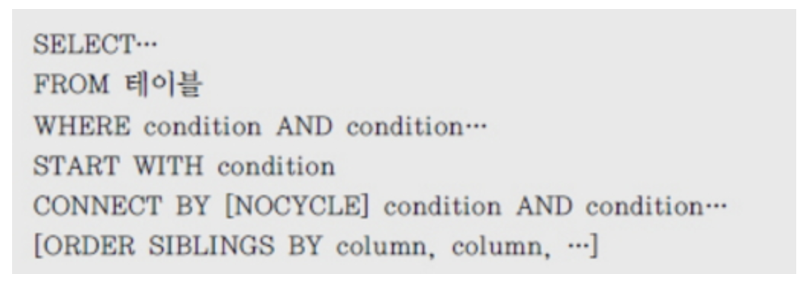
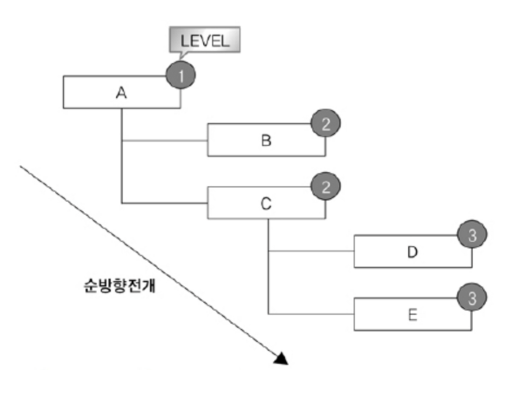
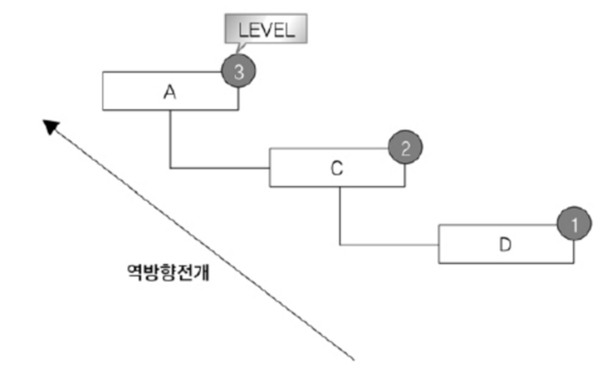

# SQL활용

## 윈도우 함수

### 1. WINDOW FUNCTION

- **행과 행간의 관계를 쉽게 정의하기 위해 만든 함수**
- 윈도우 함수를 활용하면 복잡한 프로그램을 하나의 SQL 문장으로 쉽게 해결 가능
- 분석 함수(ANALYTIC FUNCTION)나 순위 함수(RANK FUNCTION)로도 알려져 있는 윈도우 함수는 [데이터웨어하우스](http://ko.wikipedia.org/wiki/데이터_웨어하우스)에서 발전한 기능이다.
- WINDOW 함수는 중첩(NEST)해서 사용하지는 못하지만, **서브쿼리에서는 사용**할 수 있다.

#### 윈도우 함수 종류

(1) 그룹 내 순위(RANK) 관련 함수 RANK, DENSE_RANK, ROW_NUMBER
(2) 그룹 내 집계(AGGREGATE) 관련 함수 SUM, MAX, MIN, AVG, COUNT
(3) 그룹 내 행 순서 관련함수 FIRST_VALUE, LAST_VALUE, LAG, LEAD
(4) 그룹 내 비율 관련 함수 CUME_DIST, PERCENT_RANK, NTILE, RATIO_TO_REPORT
(5) 선형 분석을 포함한 통계분석 관련 함수 

#### Window Function Syntax

WINDOW 함수에는 OVER 문구가 키워드로 필수 포함된다.

```sql
SELECT WINDOW_FUNCTION (ARGUMENTS)
OVER ( [PARTITION BY 칼럼] [ORDER BY 절] [WINDOWING 절] )  
FROM 테이블 명;
```

- WINDOW_FUNCTION : 기존에 사용하던 함수도 있고, 새롭게 WINDOW 함수용으로 추가된 함수도 있다.
- ARGUMENTS (인수) : 함수에 따라 0 ~ N개의 인수가 지정될 수 있다.
- PARTITION BY 절 : 전체 집합을 기준에 의해 소그룹으로 나눌 수 있다.
- ORDER BY 절 : 어떤 항목에 대해 순위를 지정할 지 ORDER BY 절을 기술한다.
- WINDOWING 절 : WINDOWING 절은 함수의 대상이 되는 **행 기준의 범위를 강력하게 지정**할 수 있다. 

- **ROWS는 물리적인 결과 행의 수**를, **RANGE는 논리적인 값에 의한 범위**를 나타내는데, 둘 중의 하나를 선택해서 사용할 수 있다.

### 2. 그룹 내 순위 함수

1. RANK 함수

- ORDER BY를 포함한 **QUERY 문에서 특정 항목(칼럼)에 대한 순위를 구하는 함수**
- 이때 특정 범위(PARTITION) 내에서 순위를 구할 수도 있고 전체 데이터에 대한 순위를 구할 수도 있다.
- 동일한 값에 대해서는 동일한 순위를 부여하게 된다.

[예제] 사원 데이터에서 급여가 높은 순서와 JOB 별로 급여가 높은 순서를 같이 출력한다.

```sql
SELECT job, ename, sal,
	RANK () OVER ( ORDER BY SAL DESC) ALL_RANK,
	RANK( ) OVER (PARTITION BY JOB ORDER BY SAL DESC) JOB_RANK
FROM EMP;
```

\- 업무 구분이 없는 ALL_RANK 칼럼에서 FORD와 SCOTT, WARD와 MARTIN은 동일한 SALARY이므로 같은 순위를 부여한다.

\- 업무를 PARTITION으로 구분한 JOB_RANK의 경우 같은 업무 내 범위에서만 순위를 부여한다

\- ORDER BY SAL DESC 조건과 PARTITION BY JOB 조건이 충돌이 났기 때문에 JOB 별로는 정렬이 되지 않고, ORDER BY SAL DESC 조건으로 정렬이 되었다.

**PARTITION BY : 전체 집합을 기준에 의해 소그룹으로 나눔.**

2. DENSE_RANK 함수

DENSE_RANK 함수는 RANK 함수와 유사하지만, 동일한 순위를 하나의 건수로 취급하는 점이 다름.

3. ROW_NUMBER 함수

RANK나 DENSE_RANK 함수가 동일한 값에 대해서는 동일한 순위를 부여하는데 반해, 동일한 값이라도 고유한 순위를 부여.

만일 동일 값에 대한 순서까지 관리하고 싶으면 ROW_NUMBER( ) OVER (ORDER BY SAL DESC, ENAME) 같이 ORDER BY 절을 이용해 추가적인 정렬 기준을 정의해야 한다.

### 3. 일반 집계 함수

1. SUM 함수

파티션별 윈도우의 합을 구할 수 있다.

[예제] 같은 매니저를 두고 있는 사원들의 SALARY 합을 구한다. PARTITION BY MGR 구문을 통해 매니저별로 데이터를 파티션화 한다.

```sql
SELECT MGR, ENAME, SAL,
       SUM(SAL) OVER (PARTITION BY MGR) MGR_SUM
FROM   EMP;
```

[예제] OVER 절 내에 ORDER BY 절을 추가해 파티션 내 데이터를 정렬하고 이전 SALARY 데이터까지의 누적값을 출력한다. **RANGE UNBOUNDED PRECEDING 는 현재 행을 기준으로 파티션 내의 첫 번째 행까지의 범위를 지정한다.**

```sql
SELECT  MGR, ENAME, SAL,
       SUM(SAL) OVER (PARTITION BY MGR ORDER BY SAL
                   RANGE UNBOUNDED PRECEDING) AS MGR_SUM
FROM  EMP ;
```

2. MAX 함수

파티션별 윈도우의 최대값을 구할 수 있다.

[예제]같은 매니저를 두고 있는 사원들의 SALARY 중 최대값을 같이 구한다.

```sql
SELECT MGR, ENAME, SAL,
      MAX(SAL) OVER (PARTITION BY MGR) AS MGR_MAX
FROM EMP;
```

\- 파티션 내의 최대값을 파티션 내 모든 행에서 MGR_MAX라는 칼럼 값으로
 가진다.

\- INLINE VIEW를 이용해 파티션별 최대값을 가진 행만 추출할 수도 있다.

[예제] 파티션별 최대값을 가진 행만 추출할 때, 아래처럼 순위 함수를 사용해도 된다.

```sql
SELECT  MGR, ENAME, SAL 
FROM (SELECT MGR, ENAME, SAL, 
			RANK () OVER (PARTITION BY MGR ORDER BY SAL DESC) AS SAL_RK 
		FROM EMP) 
WHERE  SAL_RK = 1;
```

3. MIN 함수

파티션별 윈도우의 최소값을 구할 수 있다.


4. AVG 함수

AVG 함수와 파티션별 ROWS 윈도우를 이용해 원하는 조건에 맞는 데이터에
 대한 통계값을 구할 수 있다.

\- ROWS BETWEEN 1 PRECEDING AND 1 FOLLOWING 는 현재 행을 기준으로 파티션 내에서 앞의 한 건, 현재 행, 뒤의 한 건을 범위로 지정한다.
 (ROWS : 현재 행의 앞뒤 건수를 말하는 것)

5. COUNT 함수

COUNT 함수와 파티션별 ROWS 윈도우를 이용해 원하는 조건에 맞는 데이터에 대한 통계값을 구할 수 있다.


### 4. 그룹 내 행 순서 함수

1. FIRST_VALUE 함수

FIRST_VALUE 함수를 이용해 파티션별 윈도우에서 가장 먼저 나온 값을 구한다. 

[예제]부서별 직원들을 연봉이 높은 순서부터 정렬하고, 파티션 내에서 가장 먼저 나온 값을 출력한다.

```sql
SELECT  DEPTNO, ENAME, SAL,
		FIRST_VALUE(ENAME) OVER (PARTITION BY DEPTNO ORDER BY SAL DESC
							ROWS UNBOUNDED PRECEDING) AS ENAME_FV
FROM  EMP;
```


\- ROWS UNBOUNDED PRECEDING는 현재 행을 기준으로 파티션 내의 첫 번째 행까지의 범위를 지정한다.

\- FIRST_VALUE는 다른 함수와 달리 공동 등수를 인정하지 않고 처음 나온 행만을 처리한다.

\- 위처럼 공동 등수가 있을 경우에 의도적으로 세부 항목을 정렬하고 싶다면 별도의 정렬 조건을 가진 INLINE VIEW를 사용하거나, OVER () 내의 ORDER BY 절에 칼럼을 추가해야 한다.

[예제] 앞의 SQL 문장에서 같은 값을 가진 FIRST_VALUE를 처리하기 위해 ORDER BY 정렬 조건을 추가한다.

```sql
SELECT  DEPTNO, ENAME, SAL, 
		FIRST_VALUE(ENAME) OVER (PARTITION BY DEPTNO ORDER BY SAL DESC , ENAME
							ROWS UNBOUNDED PRECEDING) AS ENAME_FV
FROM  EMP; 
```

2. LAST_VALUE 함수

파티션별 윈도우에서 가장 나중에 나온 값을 구한다.

[예제]부서별 직원들을 연봉이 높은 순서부터 정렬하고, 파티션 내에서 가장 마지막에 나온 값을 출력한다.

```sql
SELECT  DEPTNO, ENAME, SAL,
		LAST_VALUE(ENAME) OVER (PARTITION BY DEPTNO ORDER BY SAL DESC
							ROWS BETWEEN CURRENT ROW
								AND UNBOUNDED FOLLOWING) AS ENAME_LV
FROM  EMP;
```

\- ROWS BETWEEN CURRENT ROW AND UNBOUNDED FOLLOWING 은 현재 행을 포함해서 파티션 내의 마지막 행까지의 범위를 지정한다.

\- LAST_VALUE는 공동 등수를 인정하지 않고 가장 나중에 나온행만을 처리한다.

\- 공동 등수가 있을 경우를 의도적으로 정렬하고 싶다면 별도의 정렬 조건을 가진 INLINE VIEW를 사용하거나, OVER () 내의 ORDER BY 조건에 칼럼을 추가해야 한다.

3. LAG 함수

파티션별 윈도우에서 이전 몇 번째 행의 값을 가져올 수 있다.

[예제] 직원들을 입사일자가 빠른 기준으로 정렬을 하고, 본인보다 입사일자가 한 명 앞선 사원의 급여를 본인의 급여와 함께 출력한다.

```sql
SELECT ENAME, HIREDATE, SAL,
           LAG(SAL) OVER (ORDER BY HIREDATE) AS LAG_SAL
FROM EMP
WHERE JOB = 'SALESMAN' ;
```

\- LAG 함수는 3개의 ARGUMENTS 까지 사용할 수 있다.
    두 번째 인자는 몇 번째 앞의 행을 가져올지 결정하는 것이고 (DEFAULT 1), 세 번째 인자는 가져올 데이터가 없어 NULL 값이 들어오는 경우, 다른 값으로 바꾸어 줄 수 있다. 결과적으로 NVL이나 ISNULL 기능과 같다.

4. LEAD 함수

파티션별 윈도우에서 이후 몇 번째 행의 값을 가져올 수 있다.

[예제] 직원들을 입사일자가 빠른 기준으로 정렬을 하고, 바로 다음에 입사한 인력의 입사일자를 함께 출력한다.

```sql
SELECT  ENAME, HIREDATE,
		LEAD(HIREDATE, 1) OVER (ORDER BY HIREDATE) AS LEAD_HIREDATE
FROM EMP
WHERE  JOB = 'SALESMAN';
```

\- LEAD 함수는 3개의 ARGUMENTS 까지 사용할 수 있는데,
 두 번째 인자는 몇 번째 후의 행을 가져올지 결정하는 것이고 (DEFAULT 1),
 세 번째 인자는 가져올 데이터가 없어 NULL 값이 들어오는 경우 다른 값으로
 바꾸어 줄 수 있다. 결과적으로 NVL이나 ISNULL 기능과 같다.


### 5. 그룹 내 비율 함수

1. RATIO_TO_REPORT 함수

 \- RATIO_TO_REPORT 함수를 이용해 파티션 내 전체 SUM(칼럼)값에 대한 행별 칼럼 값의 백분율을 소수점으로 구할 수 있다.
 \- 결과 값은 > 0 & <= 1 의 범위를 가진다.
 \- 개별 RATIO의 합을 구하면 1이 된다. 

[예제] JOB이 SALESMAN인 사원들을 대상으로 전체 급여에서 본인이 차지하는  비율을 출력한다.

```sql
SELECT  ENAME, SAL,
           ROUND(RATIO_TO_REPORT(SAL) OVER (), 2) AS SAL_RR 
FROM EMP
WHERE JOB = 'SALESMAN';
```


2. PERCENT_RANK 함수

\- PERCENT_RANK 함수를 이용해 파티션별 윈도우에서 제일 먼저 나오는 것을 0으로,
 제일 늦게 나오는 것을 1로 하여, 값이 아닌 행의 순서별 백분율을 구한다.
\- 결과 값은 >= 0 & <= 1 의 범위를 가진다.

[예제] 같은 부서 소속 사원들의 집합에서 본인의 급여가 순서상 몇 번째 위치쯤에 있는지 0과 1 사이의 값으로 출력한다.

```sql
SELECT  DEPTNO, ENAME, SAL,
		PERCENT_RANK() OVER (PARTITION BY DEPTNO ORDER BY SAL DESC) AS PR
FROM   EMP;
```

3. CUME_DIST 함수

\- CUME_DIST 함수를 이용해 파티션별 윈도우의 전체건수에서 현재 행보다 작거나 같은 건수에 대한 누적백분율을 구한다.
\- 결과 값은 > 0 & <= 1 의 범위를 가진다. 

[예제] 같은 부서 소속 사원들의 집합에서 본인의 급여가 누적 순서상 몇 번째 위치쯤에 있는지 0과 1 사이의 값으로 출력한다.

```sql
SELECT  DEPTNO, ENAME, SAL,
		CUME_DIST() OVER (PARTITION BY DEPTNO ORDER BY SAL DESC) AS CD
FROM  EMP;
```

4. NTILE 함수

\- NTILE 함수를 이용해 파티션별 전체 건수를 ARGUMENT 값으로 N 등분한
 결과를 구할 수 있다.

[예제]전체 사원을 급여가 높은 순서로 정렬하고, 급여를 기준으로 4개의 그룹으로 분류한다.

```sql
SELECT ENAME, SAL,
	NTILE(4) OVER (ORDER BY SAL DESC) AS NT
FROM EMP;
```


## Top N 쿼리

### 1. ROWNUM 슈도 컬럼

\- ORACLE의 ROWNUM은 칼럼과 비슷한 성격의 슈도(Pseudo Column)으로서 SQL처리 결과 집합의 각 행에 대해 임시로 부여되는 일련번호다.
\- 테이블이나 집합에서 원하는 만큼의 행만 가져오고 싶을 때 WHERE 절에서
 행의 개수를 제한하는 목적으로 사용한다.

- 한건의 행만 가져오고 싶을 때 사용하는 방법

```sql
SELECT  PLAYER_NAME
FROM  PLAYER
WHERE  ROWNUM <= 1;

SELECT  PLAYER_NAME
FROM  PLAYER
WHERE  ROWNUM < 2; 
```

- 두 건 이상의 행만 가져오고 싶을 때는 ROWNUM = N으로 사용할 수 없다. 아래와 같이 사용한다.

```sql
SELECT  PLAYER_NAME
FROM  PLAYER
WHERE  ROWNUM <= N;

SELECT  PLAYER_NAME
FROM  PLAYER
WHERE  ROWNUM < N + 1; 
```

\- 순위가 높은 N개의 로우를 추출하기 위해 ORDER BY 절과 WHERE 절의
 ROWNUM 조건을 같이 사용하는 경우가 있는데 이 두 조건으로는 원하는
 결과를 얻을 수 없다.
\- 데이터의 일부가 먼저 추출된 후 데이터에 대한 정렬 작업이 일어난다.

[예제]사원 테이블에서 급여가 높은 3명만 내림차순으로 출력하고자 하는데, 잘못 사용된 SQL의 사례이다.

```sql
SELECT ENAME, SAL
FROM EMP
WHERE ROWNUM < 4
ORDER BY SAL DESC;
```

\- 위의 실행 결과의 3명은 급여가 상위인 3명을 출력한 것이 아니라, 급여 순서에 상관없이 무작위로 추출된 3명에 한해서 급여를 내림차순으로 정렬한 결과이므로 원하는 결과를 출력한 것이 아니다.

\- **ROWNUM 조건을 ORDER BY 절보다 먼저 처리되는 WHERE 절에서 처리하므로**, 정렬 후 원하는 데이터를 얻기 위해서는 **서브쿼리에서 먼저 데이터 정렬을 수행한 후 메인쿼리에서 ROWNUM 조건을 사용**해야 한다.

\- 올바른 사용 예시

```sql
SELECT ENAME, SAL
FROM ( SELECT ENAME, SAL
	FROM EMP
	ORDER BY SAL DESC)
WHERE ROWNUM < 4 ;
```

### 2. TOP 절 

- SQL Server에서 사용됨.

### 3. ROW LIMITING 절

\- TOP N 쿼리를 작성할 수 있다.
\- ANSI표준 SQL 문법이다.
\- ROW LIMITING절은 ORDER BY 절 다음에 기술하며, ORDER BY절과 함께 수행된다.
\- ROW와 ROWS절은 구분하지 않아도 된다.

```sql
[OFFSET offset {ROW|ROWS}]
[FETCH {FIRST | NEXT} [ {rowcount | percent PERSENT}] {ROW | ROWS} {ONLY | WITH TIES}]
```

\- OFFSET offset :건너뛸 행의 개수를 지정한다.
\- FETCH :반환할 행의 개수나 백분율을 지정한다.
\- ONLY : 지정된 행의 개수나 백분율만큼 행을 반환한다.
\- WITH TIES : 마지막 행에 대한 동순위를 포함해서 반환한다.

[예제] ROW LIMITING 절을 사용한 TOP N 쿼리 확인

```sql
SELECT EMPNO, SAL
FROM EMP
ORDER BY SAL, EMPNO 
     FETCH FIRST 5 ROWS ONLY;
```

OFFSET만 기술하면 건너뛴 행 이후의 전체행이 반환된다.

```sql
SELECT EMPNO, SAL
FROM EMP
ORDER BY SAL, EMPNO 
OFFSET 5 ROWS ;
```


## 계층형 질의와 셀프 조인

### 1. 개요

\- 테이블에 계층형 데이터가 존재하는 경우 데이터를 조회하기 위해서 계층형 질의 (Hierarchical Query)를 사용한다.
\- 계층형 데이터란 동일 테이블에 계층적으로 상위와 하위 데이터가 포함된 데이터이다.
\- 사원 테이블에서는 사원들 사이에 상위 사원(관리자)과 하위 사원 관계가 존재하고 조직 테이블에서는 조직들 사이에 상위 조직과 하위 조직 관계가 있다.
\- 엔터티를 순환관계 데이터 모델로 설계할 경우 계층형 데이터가 발생한다.
\- 순환관계 데이터 모델의 예로는 조직, 사원, 메뉴 등이 있다.

#### 계층형 데이터



\- 위 그림은 사원에 대한 순환관계 데이터 모델을 표현한 것이다.
\- 그림 (2) 계층형 구조에서 A의 하위 사원은 B, C이고 B 밑에는 하위 사원이 없고 C의 하위 사원은 D, E가 있다.
\- 계층형 구조를 데이터로 표현한 것이 그림 (3) 샘플 데이터이다. 

\- 순환관계 데이터 모델은 셀프 조인이나 계층형 질의로 조회한다.

### 2. 셀프 조인

\- 셀프 조인(Self Join)이란 동일 테이블 사이의 조인을 말한다.
\- FROM 절에 동일 테이블이 두 번 이상 나타난다.
\- 동일 테이블 사이의 조인을 수행하면 테이블과 칼럼 이름이 모두 동일하기 때문에 식별을 위해 반드시 테이블 별칭(Alias)를 사용해야 한다.
\- 칼럼에도 모두 테이블 별칭을 사용해서 어느 테이블의 칼럼인지 식별해줘야 한다. 

#### 셀프 조인에 대한 기본적인 사용법

```sql
SELECT   ALIAS명1.칼럼명, ALIAS명2.칼럼명, ...
FROM  테이블1 ALIAS명1, 테이블2 ALIAS명2
WHERE   ALIAS명1.칼럼명2 = ALIAS명2.칼럼명1;
 

SELECT  WORKER.EMPNO 사원번호, WORKER.ENAME 사원명, MANAGER.ENAME 관리자명
FROM  EMP WORKER, EMP MANAGER
WHERE  WORKER.MGR = MANAGER.EMPNO;
```

\- 순환관계로 설계된 사원테이블은 사원과 관리자가 모두 하나의 사원이라는 개념으로 동일시하여 같이 입력되어 있다.
\- 이것을 이용해서 다음 문제를 셀프 조인으로 해결해 보면 다음과 같다.
\- “자신과 상위, 차상위 관리자를 같은 줄에 표시하라.”
\- 이 문제를 해결하기 위해서는 FROM 절에 사원 테이블을 두 번 사용해야 한다.

#### 셀프 조인의 개념



\- 셀프 조인은 동일한 테이블(사원)이지만 위 그림과 같이 개념적으로 두 개의 서로 다른 테이블(사원, 관리자)을 사용하는 것과 동일하다.
\- 동일 테이블을 다른 테이블인 것처럼 처리하기 위해 테이블 별칭을 사용한다.
 여기서는 E1(사원), E2(관리자) 테이블 별칭을 사용하였다.
\- 차상위 관리자를 구하기 위해서 E2.사원 = E1.관리자 조인 조건을 사용한다.

### 계층형 질의

#### Oracle 계층형 질의

\- Oracle은 계층형 질의를 지원하기 위해서 아래와 같은 계층형 질의 구문을
 제공한다.



\- START WITH절은 계층 구조 전개의 시작 위치를 지정하는 구문이다. 
 즉, 루트 데이터를 지정한다.(액세스) 
\- CONNECT BY절은 다음에 전개될 자식 데이터를 지정하는 구문이다.
  자식 데이터는 CONNECT BY절에 주어진 조건을 만족해야 한다.(조인) 

\- PRIOR : CONNECT BY절에 사용되며, 현재 읽은 칼럼을 지정한다. 
 (부모노드)=PRIOR(자식노드) 형태를 사용하면 부모 데이터에서 자식 데이터(부모 → 자식) 방향으로 전개하는 순방향 전개를 한다. 

PRIOR(부모노드)=(자식노드) 형태를 사용하면 반대로 자식 데이터에서 부모 데이터(자식 → 부모) 방향으로 전개하는 역방향 전개를 한다. 

\- NOCYCLE : 데이터를 전개하면서 이미 나타났던 동일한 데이터가 전개 중에 다시 나타난다면 이것을 가리켜 사이클(Cycle)이 발생했다고 한다. 
사이클이 발생한 데이터는 런타임 오류가 발생한다. NOCYCLE를 추가하면 사이클이 발생한 이후의 데이터는 전개하지 않는다. 
\- ORDER SIBLINGS BY : 형제 노드(동일 LEVEL) 사이에서 정렬을 수행한다. 
\- WHERE : 모든 전개를 수행한 후에 지정된 조건을 만족하는 데이터만 추출한다. (필터링)


\- Oracle은 계층형 질의를 사용할 때 다음과 같은 가상 칼럼(Pseudo Column)을 제공한다.

| 가상 칼럼          | 설명                                                         |
| ------------------ | ------------------------------------------------------------ |
| LEVEL              | 루트 데이터면 1, 그 하위 데이터면 2이다. 리프(Leaf) 데이터까지 1씩 증가한다. |
| CONNECT_BY_ISLEAF  | 전개 과정에서 해당 데이터가 리프 데이터이면 1, 그렇지 않으면 0이다. |
| CONNECT_BY_ISCYCLE | 전개 과정에서 자식을 갖는데, 해당 데이터가 조상으로서 존재하면 1, 그렇지 않으면 0. (여기서 조상은 자신으로부터 루트까지의 경로에 존재하는 데이터.) CYCLE 옵션을 사용했을 때만 사용할 수 있다. |

[예제]다음은 EMP 테이블을 계층형 질의 구문을 이용해서 조회한 것이다.
PK인 EMPNO 앞쪽에 PRIOR 연산자를 기술했다. 여기서는 결과 데이터를 들여쓰기하기 위해서 LPAD 함수를 사용하였다.

```sql
SELECT LEVEL AS LV, LPAD(' ', (LEVEL-1) * 2) || EMPNO AS EMPNO, MGR ,
            CONNECT_BY_ISLEAF ISLEAF
FROM EMP
START WITH MGR IS NULL
CONNECT BY PRIOR EMPNO = MGR;
```

#### 순방향 계층형 질의에 대한 논리적인 실행 모습



[예제]다음 예제는 사원 'D'로부터 **자신의 상위관리자를 찾는 역방향 전개**의 예이다. FK인 MGR앞쪽에 PRIOR 연산자를 기술한다.

```sql
SELECT LEVEL, LPAD(' ', 2 * (LEVEL-1)) || EMPNO AS EMPNO, MGR,
              CONNECT_BY_ISLEAF ISLEAF
FROM EMP
START WITH EMPNO = '7876'
CONNECT BY EMPNO = PRIOR MGR;
```


#### 역방향 계층형 질의에 대한 논리적인 실행모습



\- Orcle은 계층형 질의를 사용할 때 사용자 편의성을 제공하기 위해서 아래와 같은 함수를 제공한다

| 함수                | 설명                                                         |
| ------------------- | ------------------------------------------------------------ |
| SYS_CONNECT_BY_PATH | 루트 데이터로부터 현재 전개할 데이터까지의 경로를 표시한다.<br />사용법 : SYS_CONNECT_BY_PATH(칼럼, 경로분리자) |
| CONNECT_BY_ROOT     | 현재 전개할 데이터의 루트 데이터를 표시한다. 단항 연산자이다.<br />사용법 : CONNECT_BY_ROOT 칼럼 |

\- SYS_CONNECT_BY_PATH, CONNECT_BY_ROOT를 사용한 예는 다음과 같다.
\- START WITH를 통해 추출된 루트 데이터가 1건이기 때문에 루트사원은
 모두 7839이다.
\- 경로는 루트로부터 현대 데이터까지의 경로를 표시한다.
 예를들어 7876의 경로는 7839 -> 7566 -> 7788 -> 7876

```sql
SELECT CONNECT_BY_ROOT(EMPNO) AS ROOT_EMPNO,
           SYS_CONNECT_BY_PATH(EMPNO, ',') AS PATH,
           EMPNO , MGR
FROM EMP
START WITH MGR IS NULL
CONNECT BY MGR = PRIOR EMPNO;
```


## PIVOT절과 UNPIVOT절

### 1. 개요

PIVOT은 회전시킨다는 의미를 갖고 있다.PIVOT절은 행을 열로 회전시키고,
UNPIVOT절은 열을 행으로 회전시킨다.


### 2. PIVOT절

PIVOT 절은 행을 열로 전환한다. PIVOT절의 구문은 아래와 같다.

```sql
PIVOT [XML]
		(AGGREGATE_FUNCTION (EXPR) [[AS] ALIAS]
		[, AGGREGATE_FUNCTION (EXPR)  [[AS] ALIAS]]....
		FOR {COLUMN | (COLUMN [, COLUMN]....)}
		IN ({{{EXPR | (EXPR [, EXPR]... )} [[AS] ALIAS]} ....
 			| SUBQUERY
			| ANY [, ANY] ....
			})
		)
```

 \- AGGREGATE_FUNCTION은 집계할 열을 지정한다.
 \- FOR 절은 PIVOT할 열을 지정한다.
 \- IN 절은 PIVOT할 열 값을 지정한다.

[예제] PIVOT절 사용, PIVOT절은 집계함수와 FOR절에 지정되지 않은 열을 기준으로 집계되기 때문에 인라인 뷰를 통해 사용할 열을 지정한다.

```sql
SELECT *
FROM (SELECT JOB, DEPTNO, SAL FROM EMP)
      PIVOT (SUM (SAL) FOR DEPTNO IN (10, 20, 30))
ORDER BY 1;
```

[예제]다음 쿼리는 인라인 뷰에 YYYY 표현식을 추가한다. 행 그룹에 YYYY 표현식이 추가된 것을 확인한다.

```sql
SELECT *
FROM (SELECT TO_CHAR(HIREDATE, 'YYYY') AS YYYY, JOB, DEPTNO, SAL FROM EMP)
   PIVOT (SUM(SAL) FOR DEPTNO IN (10, 20, 30))
ORDER BY 1, 2;
```

[예제] 집계함수와 IN절에 별칭을 지정했다. 별칭을 지정하면 결과 집합의 열 명이 변경된다.

```sql
SELECT *
FROM (SELECT JOB, DEPTNO, SAL FROM EMP)
   PIVOT (SUM (SAL) AS SAL FOR DEPTNO IN (10 AS D10, 20 AS D20, 30 AS D30) )
ORDER BY 1;
```

[예제] SELECT 절에 부여된 열 명을 지정하면 필요한 열만 조회할 수 있다.

```sql
SELECT JOB, D20_SAL
FROM (SELECT JOB, DEPTNO, SAL FROM EMP)
    PIVOT (SUM(SAL) AS SAL FOR DEPTNO IN (10 AS D10, 20 AS D20, 30 AS D30))
WHERE D20_SAL > 2500
ORDER BY 1;
```

[예제] PIVOT 절은 다수의 집계함수를 지원한다. SUM, COUNT 함수를 사용했다

```sql
SELECT *
FROM (SELECT JOB, DEPTNO, SAL FROM EMP)
   PIVOT ( SUM(SAL) AS SAL, COUNT(*) AS CNT
              FOR DEPTNO IN (10 AS D10, 20 AS D20))
ORDER BY 1;
```

[예제] FOR 절에도 다수의 열을 기술할 수 있다. IN절에 다중 열 사용.

```sql
SELECT *
FROM (SELECT TO_CHAR(HIREDATE, 'YYYY') AS YYYY, JOB, DEPTNO, SAL FROM EMP)
   PIVOT (SUM(SAL) AS SAL, COUNT(*) AS CNT 
                FOR (DEPTNO, JOB) IN ((10, 'ANALYST') AS D10A, (10, 'CLERK') AS D10C,
                                                (20, 'ANALYST') AS D20A, (20, 'CLERK') AS D20C))
ORDER BY 1;
```

[예제] PIVOT 절을 사용할 수 없는 경우 집계함수와 CASE 표현식으로PIVOT을 수행

```sql
SELECT JOB,
             SUM (CASE DEPTNO WHEN 10 THEN SAL END) AS D10_SAL ,
             SUM (CASE DEPTNO WHEN 20 THEN SAL END) AS D20_SAL ,
             SUM (CASE DEPTNO WHEN 30 THEN SAL END) AS D30_SAL
FROM EMP
GROUP BY JOB
ORDER BY JOB;
```

### 3. UNPIVOT

UNPIVOT절은 PIVOT절과 반대로 열이 행으로 전환된다. UNPIVOT 절의 구문이다.

```sql
UNPIVOT [{INCLUDE | EXCLUDE} NULLS]
		(	{COLUMN | (COLUMN [, COL]....)}
		FOR {COLUMN | (COLUMN [, COL]....)}
		IN   ({COLUMN | (COLUMN [, COL]....)} [AS {LITERAL | (LITERAL [, LITERAL] ....)}]
		[, {COLUMN | (COLUMN [, COL]....)} [AS {LITERAL | (LITERAL [, LITERAL] ....)}]].......
		)
	)
```

 \- UNPIVOT COLUMNE 절은 UNPIVOT된 값이 들어갈 열을 지정한다.
 \- FOR 절은 UNPIVOT된 값을 설명할 값이 들어갈 열을 지정한다.
 \- IN 절은 UNPIVOT할 열 설명할 값의 리터럴 값을 지정한다.

[예제] UNPIVOT절을 사용하여 D10_SAL, D20_SAL 열이 행으로 전환된다.

```sql
SELECT JOB, DEPTNO, SAL
FROM T1
 UNPIVOT (SAL FOR DEPTNO IN (D10_SAL, D20_SAL))
ORDER BY 1, 2;
```

[예제] IN절에 별칭을 지정하면 FOR절에 지정한 열의 값을 변경할 수 있다. 10, 20으로 변경한다.

```sql
SELECT JOB, DEPTNO, SAL
FROM T1
UNPIVOT (SAL FOR DEPTNO IN (D10_SAL AS 10, D20_SAL AS 20))
ORDER BY 1, 2;
```

[예제] INCLUDE NULLS 기술하면 UNPIVOT된 열의 값이 널인 행도 결과에 포함된다.

```sql
SELECT JOB, DEPTNO, SAL
FROM T1
UNPIVOT INCLUDE NULLS (SAL FOR DEPTNO IN (D10_SAL AS 10, D20_SAL AS 20))
ORDER BY 1, 2;
```

[예제] FOR 절에 다수의 열, IN 절에 다수의 별칭을 지정할 수 있다.

```sql
SELECT *
FROM T1
 UNPIVOT ((SAL, CNT) 
		FOR DEPTNO IN ((D10_SAL, D10_CNT) AS 10 , (D20_SAL, D20_CNT) AS 20))
ORDER BY 1, 2;
```


