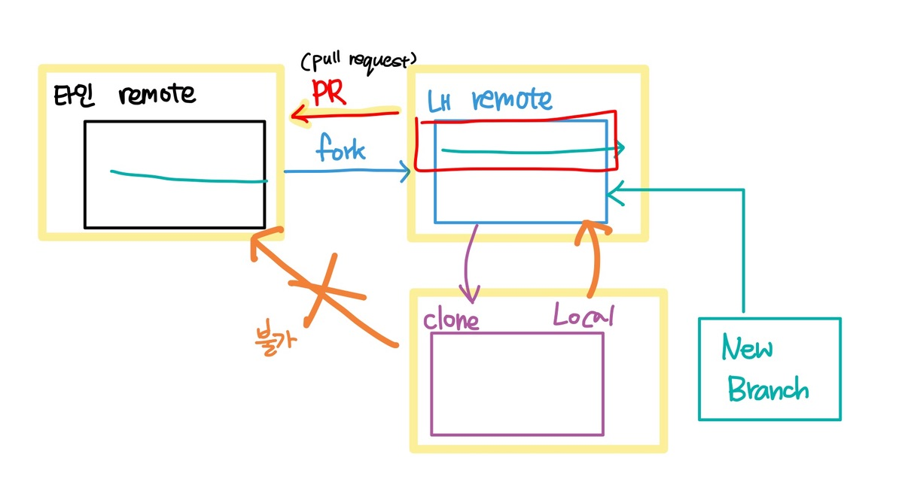

# 복습 (0909)

## 마크다운

Heading : (#) level은 6까지.

list ( -,*, ) : 순서 없는 리스트, (1. 2. 3. ) : 순서가 있는 리스트

code block : 

```
```code block```
`inline`
```

`inline code` 인라인 코드 블럭

link : [네이버]( https://www.naver.com)

image : 

**굵은 글씨** *기울임체* ~~취소선~~

수평선 `---`

---

> 인용문 :  `> 인용문`

표 : 이런 형태 (` | 이름 | 나이 | ` )

| 이름 | 나이 |
| ---- | ---- |
|      |      |

or 표 삽입

## Unix/Linux 명령어 복습

cd : 경로 이동

mkdir : directory 생성

touch : 파일 생성

rm : 삭제

cd에서 . : 내가 현재 있는 디렉토리

. / .. : 상대경로 (내가 있는 위치를 기반으로 한 경로)

## Git 명령어

- 기본 명령어

`git init` : 로컬 저장소 생성

`git status` : 현재 git으로 관리되고 있는 파일들의 상태

`git add . ` : untracked 수정된 파일을 모두 Staging Area에 올린다.

`git commit -m "~"` :  commit, 저장소에 기록

`git log` : commit log 확인


`git remote add origin ~` : 원격 저장소 추가

`git push origin master` : 커밋한 내용을 원격 저장소로 

`git clone repo_url` : 원격 저장소 clone (복제_)

`git pull origin master` : 원격 저장소에서 로컬 저장소로 코드 가져오기


- 0910

`git clone ~~.git ` : 폴더째로 clone

`git clone ~~.git .  `  : git 뒤에 .을 넣으면 현재 디렉토리에 바로 clone

`git restore --staged {file}` :  수정한 파일 되돌리기

`git restore {file}` : 스테이징 되돌리기 (작업한 내용 사라짐 / 수정한 파일이 잘 안되서 최근 커밋까지 되돌릴 때 사용)

- git reset

`git reset --hard {commit id}` : 해당 commit 버전으로 돌아감.

`--hard ` : 돌아가려는 이력이후의 모든 내용을 지운다. **working directory를 과거의 특정 커밋의 내용과 똑같게 만든다.**

`--soft` : 돌아가려 했던 이력으로 되돌아 갔지만, 이후의 내용이 지워지지 않고, 해당 내용의 인덱스(또는 스테이지)도 그대로 있다. (바로 다시 커밋할 수 있는 상태로 남아있는 것). **Head가 과거의 특정 커밋을 가리키도록 한다.**

`--mixed` : mixed ( 옵션을 적지 않으면 mixed로 동작한다.) 이력은 되돌려지고, 이후에 변경된 내용에 대해서는 남아있지만, 인덱스는 초기화된다. 커밋을 하려면 다시 변경된 내용은 추가해야 하는 상태이다. **staging area를 과거의 특정 커밋의 내용과 똑같게 만든다.**

- **git에서 HEAD의 의미**

HEAD는 현재 체크아웃된 커밋. 즉 현재 작업중인 커밋이다. 

HEAD는 항상 작업트리의 가장 최근 커밋을 가리킨다. 작업트리에 변화를 주는 git 명령어들은 대부분 HEAD를 변경하는것으로 시작한다.
일반적으로 HEAD는 브랜치의 이름을 가리킨다.

- .gitignore 파일 이용하기

: 모든 파일이 git에 올라가지 않게 하는 파일

.gitignore에 원하지 않는 파일을 적으면 제외시킬 수 있다.


- 협업의 시작 ( Collaboration )

| Manager                                | Crew                       |
| -------------------------------------- | -------------------------- |
| Github Repository 생성 (end-to-end)    | 이메일 초대 수락           |
| Local에서 end-to-end 디렉토리 생성     | git clone URL.git          |
| git init                               | README.md 수정 (잇는 단어) |
| git remote add origin URL.git          | git add, commit            |
| README.md 생성 (첫번째 단어)           | git push origin master     |
| git add, commit                        |                            |
| git push origin master                 |                            |
| manage access -> invite a collaborator |                            |
| write 권한                             |                            |


## Branch basic commands

브랜치 Branch : 특정 커밋을 가리키는 '포인터'

1. 브랜치 생성

``````
(master) $ git branch {branch name}
``````

2. 브랜치 이동

```
(master) $ git checkout {branch name}
```

3. 브랜치 생성 및 이동

```
(master) $ git checkout -b {branch name}
```

4. 브랜치 목록 

```
(master) $ git branch
```

5. 브랜치 삭제

``` 
(master) $ git branch -d {branch name}
```

- branch merge

각 브랜치에서 작업을 한 이후 이력을 합치기 위해서는 일반적으로 merge 명령어를 사용한다.

병합을 진행할 때, 만약 서로 다른(commit)에서 동일한 파일을 수정한 경우 충돌이 발생할 수 있다.

이 경우 반드시 직접 수정을 진행해야 한다.

충돌이 발생한 것은 오류는 아니고 이력이 변경되는 과정에서는 발생할 수 있는 일.

- **Branch merge - fast-forward**

기본 브랜치에 변경사항이 없어서 단순히 앞으로 이동

1. feature-a branch로 이동 후 commit
2. master 별도 변경 없음
3. master branch로 병합

```
(master) $ git merge feature-a
Updating 54b9314>>5429f25
Fast-forward
```

- **Branch merge (merge commit case)**

기존 master 브랜치에 변경사항이 있어 병합 커밋 발생

1. feature-a branch로 이동 후 commit
2. master branch commit
3. master branch로 병합

```
(master) $ git merge feature-a
Already up to date!
Merge made by the 'recursive' strategy.
```

## Git Flow

git을 활용하여 협업하는 흐름으로, banch를 활용하는 전략 의미.

- 대표적인 전략 예시

| branch                        | 주요 특징                                                    | 예시                                                        |
| ----------------------------- | ------------------------------------------------------------ | ----------------------------------------------------------- |
| Master (main)                 | 배포 가능한 상태의 코드                                      | LOL 클라이언트 라이브 버전(9.23.298.3143)                   |
| develop (main)                | - feature branch로 나눠지거나, 발생된 버그 수정 등 개발 진행<br />- 개발 이후 release branch로 갈라짐. | 다음 패치를 위한 개발 (9.24)                                |
| feature branches (supporting) | - 기능별 개발 브랜치 (topic branch)<br />- 기능이 반영되거나 드랍되는 경우 브랜치 삭제 | 개발 시 기능별<br />예) 신규 챔피언 세나, 드래곤 업데이트   |
| release branches (supporting) | - 개발 완료 이후 QA/Test 등을 통해 얻어진 다음<br />배포 전 minor bug fix 등 반영 | 9.24a, 9.24b, ...                                           |
| Hotfixes (supporting)         | - 긴급하게 반영 해야하는 bug fix<br />- release beanch는 다음 버전 / hotfix branch는 현재 버전을 위한 것 | 긴급 패치를 위한 작업<br />예) 버그로 인한 챔피언 선택 금지 |

git flow는 정해진 답이 있는 것은 아니고, 각 서비스별 제안되는 흐름이 있고, 변형되어 각자의 프로젝트/회사에서 활용된다. 

- 프로젝트에 활용할 수 있는 간단한 브랜치 전략 

Github Flow 기본 원칙

1. master branch는 반드시 배포 가능한 상태여야 한다.
2. feature branch는 각 기능의 의도를  알 수 있도록 작성한다.
3. Commit message는 중요하며, 명확하게 작성한다.
4. Pull Request를 통해 협업을 진행한다.
5. 변경사항을 반영하고 싶다면, master branch에 병합한다.

## Github Flow Models (협업)

Github에서 제시하는 방법 2가지

- Shared Repository Model
- Fork & Pull Model

두 모델의 가장 큰 차이점: 작업자가 해당 프로젝트 저장소에 직접적인 push 권한이 있는 지의 여부

- Shared Repository Model

: 동일한 저장소를 공유하여 활용하는 방식. (위의 '협업의 시작' 내용 참고)

- Fork & Pull Model

Repository에 Collaborator에 등록되지 않고 Pull request를 통한 협업 가능



